# Cyber Security and Privacy — Volume 04 — Industry, Technologies, and Privacy Foundations

**Course:** NPTEL 106106248 · **Instructor:** Prof. Saji K. Mathew, IIT Madras  
**Series:** notes-2 (transcript-grounded)  
**Scope:** Industry attacks; crypto and access control; privacy theories

These notes follow the lecture videos and public captions. They are study material, not official NPTEL transcripts.

---

# Lecture T22: Industry Perspective — Part 01

**Playlist index:** 22  
**Transcript:** [22-industry-perspective-part-01.md](../transcripts/markdown/22-industry-perspective-part-01.md)  
**Video:** https://www.youtube.com/watch?v=F5KwJEVGIxg  
**Week / theme:** Industry exposure — why cyberspace is hard to secure; OS/rings, cryptography, OSI/TCP-UDP, access control, firewalls, DMZ, espionage vs network breach

## Learning objectives

- Explain why a cooperative, trust-based internet makes security structurally hard.
- State the five principles the guest uses for a working cybersecurity system (CIA plus accountability and auditability).
- Describe operating-system rings, symmetric vs public–private cryptography, and hash functions as taught.
- Trace how a packet is unwrapped (MAC → IP → port → application) and why TCP and UDP differ.
- Sketch a corporate perimeter (firewall layers, DMZ, proxy) and the two routes an attacker actually uses.

## What this lecture actually teaches

This is an industry session on **cybersecurity threats, solutions and challenges**. The guest will leave the slide order if the room is talking. The point is realistic problems with realistic solutions, including for students without a technical background.

### Why “truly secure” is a joke

The opening quote: the only system that is truly secure is switched off, unplugged, locked in a titanium safe, buried in a concrete bunker, surrounded by nerve gas and highly paid armed guards — and even then the speaker would not stake a life on it.

The reason is not “hackers are clever.” It is how cyberspace was built.

### Cyberspace is cooperative by design

Anything connected that can interact — over airwaves or other waves — is **fundamentally designed to be cooperative**. Cyberspace is built on cooperation, coordination, and **trust**.

If you send a packet, the other side is welcome to receive it. TCP, IP, and similar protocols do not first ask the OS “do I want this?” Most protocols still do not validate.

**BGP** is the running example. BGP servers decide how packets move between big networks (India to a company in America, crossing multiple BGP routes). A route announces “I know how to go to America”; everybody believes it. Nobody asks “how do you know?” The guest’s claim: **the biggest cyber attacks happen by BGP routes.** That is the type of trust embedded in the network.

If trust is at the root of everything, and everybody is assumed nice, **how do you catch rogues?** That is “the route of all the challenges in cyberspace.”

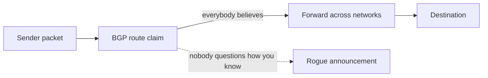

### Definition and five principles

Cybersecurity is a body of **technologies, processes and practices** involved in protecting individuals and organizations from cyber crime originally, now also **cyber warfare**.

A definition does not illuminate unless it is specific about *what* is protected. The guest uses **five principles**, of which three are the usual triad:

| Principle | Meaning in this lecture |
|-----------|-------------------------|
| **Confidentiality** | Data is given access only to people with rightful access |
| **Integrity** | Data cannot be tampered with; if it is, you will know |
| **Availability** | When you want the data, you always have access |
| **Accountability** | You can identify who made changes |
| **Auditability** | Changes cannot be denied: “you did it at that time” — **non-repudiation** |

When you say a cybersecurity system is in place, you should be able to claim all five.

### Scope: reported crime is the small slice

2021-era projections are shown. Industry experience: such statistics are based on **20–30% of crimes that are actually reported**. A large number of attacks are not reported “for obvious reasons.” Even that slice is staggering.

Why it keeps happening: almost all businesses are moving digital, and **not many thought about security in digital**. Building a house: you first build a compound wall. In digital space it is the opposite — **first the house, then you think of a compound wall.** That is why cybersecurity remains a big issue.

### First cyber attack: Soviet pipeline, logic bomb

Guesses from the room (1970s, 1980s). The story taught: attack on a **Soviet-era pipeline**. Soviets could build pipelines but not the software to control them; they sourced software from a **Canadian company**. Peak of the Cold War. Americans reached the Canadian company, planted a programmer, inserted a **logic bomb**, which triggered and destroyed a pipeline built at huge cost — significant economic impact on Soviet Russia. Now accepted by the Americans too.

Point: **from the beginning, cyberspace was never a space of peace.**

Warfare language: peace vs conflict, and a middle state — **no war, no peace** (constant conflict without declared war). That, the guest says, accurately describes cyberspace today, and it has always been like that.

### Operating system: where the battles are

Without a few concepts, the rest of the class is “significantly impeded.”

An OS is the **interface between the human and the hardware**. Scope: Raspberry Pi to a laptop. Three things: **compute, input devices, output devices**. The human uses inputs; compute talks to devices, does work, shows output. After power-on you interact with the OS; it says the devices are ready.

Double-click feels intuitive; the OS is everywhere and not felt. **All battles are fought in the applications and the operating system space. Nowhere else.**

### Rings: becoming the watchman

To steal location, destroy disk, or steal personal information, the attacker needs **full control**. Approaches include OS-level control. Multiple layers of defense:

- **Kernel** — “the secret room, nobody should enter.”
- **User space** — free to play; crossing into kernel is refused.

Hackers want kernel because: if you become the watchman, can anyone notice you as a thief? Every thief wants the police cap. Attackers **abuse OS powers and hide in plain sight**, pretending to be part of the OS.

Defenses exist in the OS and at **hardware** level. **Not all operating systems use the hardware protections effectively.** Even the then-latest Windows “does not use most of the hardware protections.” That space is still not attended to.

**Rings (hardware concept):**

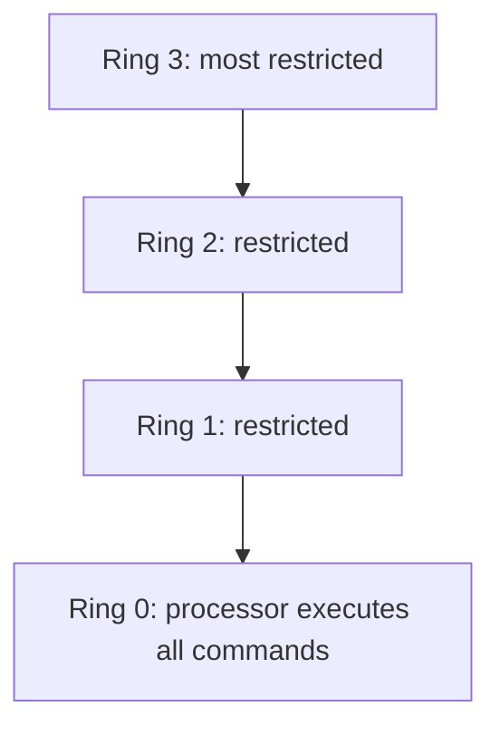

- **Ring 0:** hardware fully listens; the processor executes all commands you send.
- **Rings 1, 2, 3:** restricted, limited access.
- Kernel / OS largely operates in **ring 1 or ring 0**.

### Cryptography: CIA of the message; why shared keys fail

Cryptography here means **ensuring the CIA of the message** you send: it reaches safely, confidentiality and integrity hold, and it is available to the recipient.

**Home analogy:** siblings share passwords. Distance problem: if you can share the password, you could have used the same channel for the message. The space between you is treated as **compromised**. That is why **shared symmetric encryption will not work** as a complete answer when you cannot meet.

**Symmetric encryption:** both use the **same key**. Further risk: an eavesdropper copies gibberish traffic; later they slap the password out of you and **decrypt the entire history** — complete compromise. These are the World War I / II problems, made critical by **radio waves (open for all)**. **Enigma** is the example; cracking it is “a single reason why the allies have won the war,” and keeping that secret mattered equally.

**Public–private (asymmetric) picture:** two keys — one to lock, one to unlock. You put a message in a trunk, lock it with **the recipient’s public key** (known to everyone, used to lock). Only the recipient has the **private key** to unlock. Everyone announces a public key: encrypt to me with this and only I can read it. Private key stays secret.

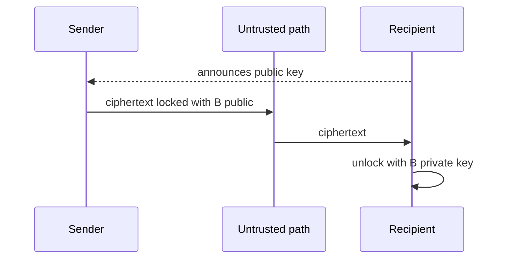

### Hash functions

Private keys are generated using **hash functions**. A hash takes any random block and converts it to a sequence of random alphanumerics. Mathematically verified to be **one way**:

1. One unique number for a block; **modify one bit and the whole number changes**.
2. From the number you **cannot reconstruct** the original data.

**MD5** (and similar): a 700 MB file and a 5 MB file still produce a **fixed-length** digest (lecture: 128 characters). Cat-image demo: one missing whisker barely visible, hash output completely different. Forensic use: hash a file you received; match means nobody tampered. Download pages publish an MD5; check after download — mismatch means tampering in transit. One-sided, highly efficient.

### Networking: wrapping, OSI, TCP vs UDP

WhatsApp (call or message) hides many packaging layers. The **OS receives** packets from the network device.

Unwrapping, as taught:

1. **MAC** — is this for my LAN card? (unique to a NIC; **data-link**.)
2. **IP** — is this for my network? (**network layer**; “when we say TCP/IP, IP is the network layer.”)
3. **Port** — unique identifier for a **process** with a network connection (browser, Windows Update, …). **Ports live under the transport layer (TCP).**
4. Further **presentation / application** layers decide user, file, etc.

Each layer resolves further so the packet reaches the right destination. The small message is wrapped many times. Mature model from years of experience: **OSI, 7 layers.**

TCP vs UDP:

- Movie vs “hello” are not the same. A movie is many packets in sequence; miss one and the file is useless. TCP pays extra attention to **order**. Sender waits for acknowledgement. Acknowledgements can be lost, so you may retransmit and the receiver may see duplicates — coordination is built in. The lecture’s three-step picture: send packet 1 → he received packet 1 → I understand you received packet 1, **then** packet 2. **By design slow but reliable.** Not used for video conferencing, audio, streaming: one lost packet is a blurred pixel or a small glitch.
- **UDP:** keep sending 1, 2, 3, 4, 5; receiver may get 1, 5, 7, 8, 9 — still fine for media.

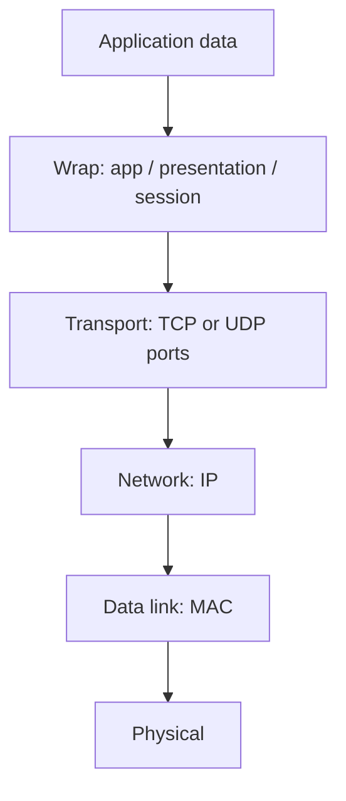

### Access control on the network

Can be implemented at **network** and **hardware**. Question: who are you on my network? Do you have access to printers and other resources? You cannot randomly cable a laptop to an IIT printer without authenticating.

**LDAP, Kerberos, RADIUS** identify every person on the network uniquely. If you cannot identify uniquely, you do not know who they are.

External access: identify yourself to an LDAP or Kerberos authentication server, then you are on the network. These are **gateways**. The guest’s industry punch: **not many people understand how they function**, which is why despite billions of budget, people “screw up on basic things.”

### Firewalls: the guard, the rules, the layers

A firewall is a **security guard at network entry and network exit**. Rule in the lecture’s wording: no ID card, you stay out; ID card but you are B.Tech trying to enter an M.Tech class, stay out; class starts at 9, you arrived at 8, stay out. Rules are framed and implemented strictly.

Same job at different “intelligence” levels (army, gate guard, classroom door): the **layer of data you consume to verify** differs. That is why there are multiple firewall layers:

| Firewall “layer” | What it looks at |
|------------------|------------------|
| **Layer 2** | Lower-level access |
| **Layer 3** | IP level |
| **Application** | Can notice “WhatsApp is not supposed to run here — why did this packet arrive?” |

More intelligence = more data = more processing = **more expensive**. First-level firewalls do basic work; upper ones are “CISF-like” (ID, photo match).

**Packet-filtering firewall:** looks at identity, source, whether there is a TCP/IP session, recognized IP, IP ranges. Splits traffic: **trusted-network packets should not go out wrongly; untrusted should not come in.** Basic rules.

### What a company network actually looks like

- **Router** routes packets between networks.
- **DMZ (demilitarized zone)** — taught here as a zone where some assets sit with controlled access from outside and, via a **simple proxy**, access toward the inside. Proxy records who you are. Separate routers/configurations for internal vs external.

Hacker path the room is asked to see:

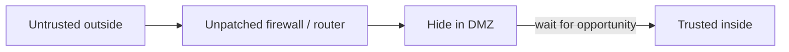

Attackers come from the outside. If they break the perimeter, they **hide in the DMZ**, wait, then go in. **Unpatched vulnerabilities in routers and firewalls are the cracks in the wall.** Keep hitting; once in, stay comfortably — nobody notices — then get out. *Dhoom* line: to catch A, think like A.

### Cyber espionage: skip the wall by fooling a person

A different route from “routers and networks”: if you want inner **people dynamics**, you attack people rather than only information assets. Monitor how things work, then act.

**Social engineering** (or whatever you call it) can take you **directly inside** without the struggle of the perimeter — you fooled an employee. Easy way out, but **easily caught**. Pick the wrong person and the whole operation is exposed.

Espionage vs cyber warfare is **a difference of motive**, not necessarily of skill: you sneaked in like a thief; you can also “do murder.” Skill may be the same; motive differs.

## Cases and examples from the lecture

- Titanium-safe / nerve-gas quote as a way to start “why security is never absolute.”
- BGP trust: India → America packets across routes nobody validates.
- House vs compound wall: digital builds the house first.
- Soviet pipeline **logic bomb** via a Canadian vendor at Cold War peak.
- Enigma; radio as an open channel.
- Cat image missing a whisker vs hash avalanche; MD5 next to download links.
- WhatsApp as many wrapping layers; Windows Update as a port destination.
- TCP three-way wait vs UDP streaming.
- IIT printers and LDAP / Kerberos / RADIUS.
- Firewall as ID-card / classroom / time-of-day rules.
- Corporate DMZ + proxy; hide-then-pivot.
- Social-engineering shortcut vs network breach; wrong-target risk.

## Key terms

| Term | Meaning in this lecture |
|------|-------------------------|
| Cyberspace | Connected, interacting systems; built on cooperation and trust |
| BGP | Big internet route servers; trust “I know the path” without challenge |
| CIA + 2 | Confidentiality, integrity, availability, plus accountability and auditability (non-repudiation) |
| Logic bomb | Hidden trigger in software (pipeline story) |
| No war, no peace | Constant conflict without declared war — the guest’s description of cyberspace |
| OS | Interface human ↔ compute / I/O; the space where battles are fought |
| Ring 0 | Hardware executes all commands; kernel wants this |
| Symmetric crypto | Same key to lock and unlock; key distribution and later full-history decrypt |
| Public / private key | Public locks for a recipient; only their private key unlocks |
| Hash | One-way, avalanche on one-bit change; integrity / forensics / download checks |
| MAC / IP / port | NIC identity, network identity, process identity |
| TCP | Reliable, sequenced, slow by design (acks) |
| UDP | Fire-and-forget; OK to lose packets for media |
| LDAP / Kerberos / RADIUS | Unique identification of people on the network |
| Firewall | Guard at entry/exit implementing strict rules at chosen OSI intelligence |
| DMZ | Perimeter zone; in this talk, where an intruder hides after a wall crack |
| Proxy | Records identity; connects networks without treating them as one |
| Social engineering | Fool a person and skip the technical wall |

## Formulas / frameworks (if any)

**Five principles of a “system in place”:** confidentiality, integrity, availability, accountability, auditability.

**Packet delivery (taught unwrap order):** MAC match → IP match → port/process → application/user.

**TCP reliability loop (as sketched):** send → receive ack → confirm the ack was understood → next packet.

**Attacker’s two doors:** (1) unpatched router/firewall → hide in DMZ → inside; (2) social engineering an employee → straight inside, higher exposure if you pick wrong.

## Distinctions the instructor insists on

- Cyberspace insecurity is not only “bad people”; **protocols assume cooperation**.
- A cybersecurity definition is empty unless it names **CIA + accountability + auditability**.
- Published attack statistics are **not the full crime volume** (20–30% reported).
- **Ring 0 vs user space:** thieves want the watchman’s cap, not a noisy user-space crime.
- Symmetric shared-key is not just “weaker math”; **you cannot safely ship the key**, and a later key theft decrypts **old** traffic.
- Hash is **not encryption**: you cannot reconstruct data from the digest.
- TCP vs UDP is **reliability vs loss-tolerance**, not “TCP is always better.”
- Firewall layers differ by **how much of the packet they inspect**, not by the slogan “block bad guys.”
- Cyber espionage vs breaking the router: **same possible skill, different route and motive**; people-path is faster and easier to blow.

## Exam-oriented recap

- Trust is the design of the internet (BGP as the extreme); catching rogues is the core challenge.
- Five principles, not only the triad; auditability = non-repudiation.
- First taught “cyber” strike: Cold War **logic bomb** in pipeline-control software.
- OS + applications are the battlefield; **rings** are hardware privilege; kernel wants ring 0.
- Symmetric key: share problem + later total compromise. Asymmetric: public lock, private unlock.
- Hash: one-way, one-bit avalanche, integrity check (MD5 on downloads).
- OSI unwrap: MAC → IP → port; TCP three-way reliability vs UDP streaming.
- Identify people with LDAP/Kerberos/RADIUS; filter packets with layered firewalls; expect attackers to **sit in the DMZ** after a perimeter hole — or to **phish an employee** and skip the hole.

---

# Lecture T23: Industry Perspective — Part 02

**Playlist index:** 23  
**Transcript:** [23-industry-perspective-part-02.md](../transcripts/markdown/23-industry-perspective-part-02.md)  
**Video:** https://www.youtube.com/watch?v=ROHhs7PMIGw  
**Week / theme:** Industry exposure — VPN as “key to the kingdom,” kill chain, random vs targeted ops, malware taxonomy, C2, DoS/DDoS, vulnerability–exploit–payload, RATs/stealers, Qbot, APTs and 3 Ds, SideCopy

## Learning objectives

- Explain VPN as a private encrypted tunnel — and why fooling the VPN server is “key to the kingdom.”
- Walk the **cyber kill chain** using the *Uri* commando analogy.
- Separate spray-and-pray crime from focused cyber espionage.
- Define Trojan vs malware, phishing vs spear phishing, C2, DoS vs DDoS, and vulnerability vs exploit vs payload.
- Describe RAT markets, stealers (Vidar), Qbot staging, APTs, the 3 Ds, and the SideCopy / fake `mail-gov.in` campaign.

## What this lecture actually teaches

Continues the industry session. CIA triad is assumed known and not re-taught at length.

### VPN: private network without private wires

A company with four or five branches will not copy the same data and servers everywhere. There is a **central repository**. Other locations must connect.

That is the start of a **private network**: parent-wise one organization, one private network. Laying real lines Hyderabad–Chennai–Mumbai is too expensive. So they use the **internet** but create a **private encrypted tunnel**. That process is a **virtual private network**.

There is a **VPN server** (also called **VPS — virtual private server** in this talk). You identify yourself to the VPS; it assigns a **private IP** and makes you virtually part of the office network. Delhi office, you sit in Chennai: the VPS gives you an IP **as if you were in Delhi**, so you can use Delhi resources. A Chennai member participates in Delhi through VPN.

**Hacker’s view:** VPN is **key to the kingdom**. Fool the VPN / VPS server and you are in; **nobody will even know.**

Real big organizations: multiple VPN servers connecting each other. **The group is as strong as the weakest one in the group.** Visualize where things will be bad.

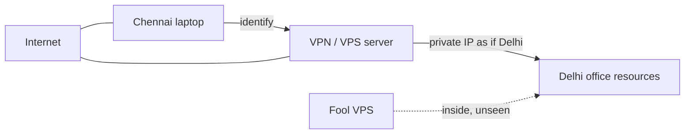

### How an attacker actually attacks: kill chain as a commando raid

Not different from a movie commando raid. *Uri* is the analogy.

| Movie beat | Cyber language |
|------------|----------------|
| Bird / satellite / tunnels — **reconnaissance** | Homework on the target |
| Night insertion, quiet helicopter, drop away from the field | Choose when and how to arrive without waking the defenders |
| Right weapons | After identifying assets (VPN, server, anything), **pick a weapon that works against that asset** |
| Go and shoot; there is a crack | Get in |
| Exploit | You have OS access |
| Stay, steal or destroy | **Deliver payload and retain access** |
| Alert to command center: “Yes Boss, it is done” | Callback after delivery → installation, **without the hacker watching each step** |
| Then do what you came for | Botnet, copy data, destroy server |

Broad name: **kill chain / cyber kill chain**. Delivery through installation is **not visible** to the operator as a live camera feed; then the alert arrives.

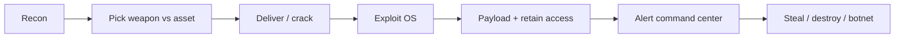

### Two operating models: random spray vs focused espionage

**Unplanned / random (how “most cyber hackers” work):** randomly pick a huge number of email addresses, keep sending payloads, hope some compromise. From those machines collect more data and leads (the box is usually inside a network, or the mailbox yields more addresses), then **spread again**. Over time: a large list of vulnerable machines at your command. Looks like spam. **Nobody specifically targeted your company**; you could be an unfortunate victim. Industry claim: **a lot of big companies fall to this.**

**Specialized / cyber espionage:** hell-bent on **you and only you**. Focused launch, collect from one victim, then expand, expand. They do not spray everyone. **Weapons and tools are different.** The spray model risks exposure — what if you targeted a **cybersecurity researcher**? A two-page report and the operation is gone. Targeted work is **more expensive, dangerous, and tough**.

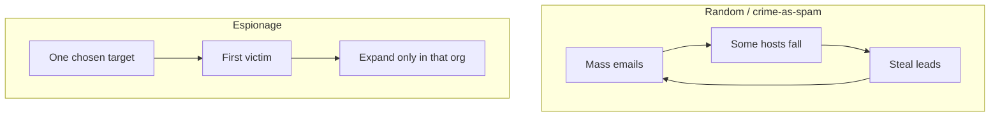

### Terminology drill (Q&A in the room)

**Trojan vs malware.** Malware is the **general** term; Trojan is **specific**. Trojan takes a **payload within a payload**. Trojans are one type of malware. **Primary objective: give a back door** to the attacker.

**Can a Trojan become ransomware?** Yes. That is the point — do not treat the labels as sealed boxes.

**Phishing vs spear phishing.** Spear phishing is **more targeted**. Phishing: random emails, not a focused effort. Spear example: attacker researches that you have a daughter at Doon School, writes an email to phish you. Conclusion the room is asked to draw: the attacker is **motivated and only wants you** — that itself is an important input.

**C2.** People say **C2** rather than “command and control.” Also **C&C**. If the machine is compromised it is managed through command and control: **another machine** whose job is to keep taking pings — “are you alive?” — then issue commands: fetch images, fetch files, send huge packets to this computer.

**DoS.** A server provides a service; the attacker wants that service **denied** to clients, by **overwhelming** the server.

**When is it distributed?** The same thing from **multiple** sources. These are **volumetric** attacks. A network has limited bandwidth; a computer can handle only so many connections. Overwhelm so legitimate customers are not served. User-visible symptom: **the website is simply not responding** — it is busy serving customers who do not care about it. Taught as a **very common form of cyber warfare** or a crude way of settling accounts.

### Vulnerability, exploit, payload — if you miss this you miss cybersecurity

Bunker-buster bomb picture:

| Term | Bunker picture | Office picture (Microsoft Word) |
|------|----------------|----------------------------------|
| **Vulnerability** | Weak link; thinnest part of the bunker | Word has bugs that can let a hacker **execute arbitrary commands** |
| **Exploit** | Material with enough strength to break through that weak link — you are **not always** able to exploit a weakness | Weaponize the bug so double-click / run **executes the attacker’s commands**, loaded from an internet server |
| **Payload** | What you deliver inside to do the job | Command **downloads a Remote Administration Tool and installs it** |

Deadliest part: **the payload**. Most antiviruses try to identify **payloads**, not exploits. Some now look for exploit signatures; it is rapidly changing.

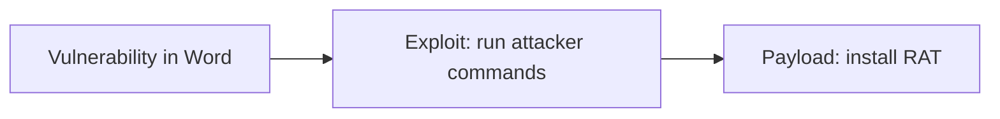

### What payloads look like: RATs and the dark-web business

Payloads are “pretty simple lower-level software” that give **very good control** of the machine. Bought for **15–20 dollars** on the dark web. If the victim is not cyber-aware, install prompts: flash update, new app, Amazon ₹200 extra, Flipkart 50% sale — **prompts to install RATs**.

**RAT = remote administration tool.** Genuine uses exist: **TeamViewer, Ammy Admin**. Attackers take inspiration and build their own so **nobody can detect them**. Open-source examples named: **Puppy RAT, Qrat**. Markets sell RAT access **not detected by antiviruses**. Names: **DarkComet, Atom Logger**, sold **on license**. Antivirus changes daily, so the RAT author must update constantly — hence **annual subscription**. Keep paying, the RAT stays alive; otherwise it gets caught.

Post-COVID **key logger** use “sky rockets”: many people who do not understand cyberspace suddenly have access; many fell victim. Huge market in India too.

### Stealer demo: Vidar

A special Trojan/malware: **stealer** — job is to **steal passwords**. Panel on screen: **Vidar**. Victims shown: one **Brazil**, one **Lucknow** (IP looks like **Reliance Jio** — mobile, desktop, or broadband unknown). Stolen domains named: redbus.in, grammarly.com, olacabs.com, kesco.co.in, freecharge.in. Delivery: **WinRAR archive / zip**, **0.13 MB**. Panel also shows date/time and command-and-control information.

Dark web: hundreds of supply sources; make once, sell many times; payment in bitcoin etc. Forums push cheaper prices. You might be running one and not know. Plus **daily new vulnerabilities**, and **not everything is patched**.

### Qbot: from random zip to botnet monetization

**Qbot:** first-phase **random emails**, hope for a target, collect into a **botnet**, then think how to **monetize**.

Staging as taught:

1. Attachment is a **zip**. Why zip? **Email scanners cannot scan inside** the way they scan the message. You download and unzip. The file the gateway scanned and the file you now run are **two different things**.
2. Inside: malicious **XLSM**. Opening **executes macros**. Macros are a Microsoft feature to automate tasks; the attacker exploits them to run **his** tasks.
3. Downloads a malicious **DLL** separately, binary separately — **first-stage payload**, then that loads the **actual Trojan**.
4. Stages: first-level download, second-level download, **persistence**.
5. After that, ransomware vs Trojan depends on the **bot manager**. Sample documents/emails go to the master (C2). If the samples look like **a guy with a lot of money** → ransom. If a random person with nothing → **sell the bot** to click ads for advertisement money.

**Real emails shown:** compromised address; “Hello please read this and confirm regards” + zip. If it looks like it is from your boss: “Yes sir, I will do sir” — that is what they count on. Another: “Please familiar yourself with the attached file and reply here, if you have any questions. **Do not call me.** Reply here only” — because a phone call would reveal the sender never said that.

Excel: many **hidden sheets**. On open: looks like a form; “enable content”; “macros have been disabled” — **forces you to enable**. Clever **exploit plus social engineering**.

**Data Pro** is named as a **debugger** to look at source and see the malicious component more easily. Other tool: **Ghidra** (released by US intelligence / NSA). “Good tool but nobody trusts it, but then it is a good tool.”

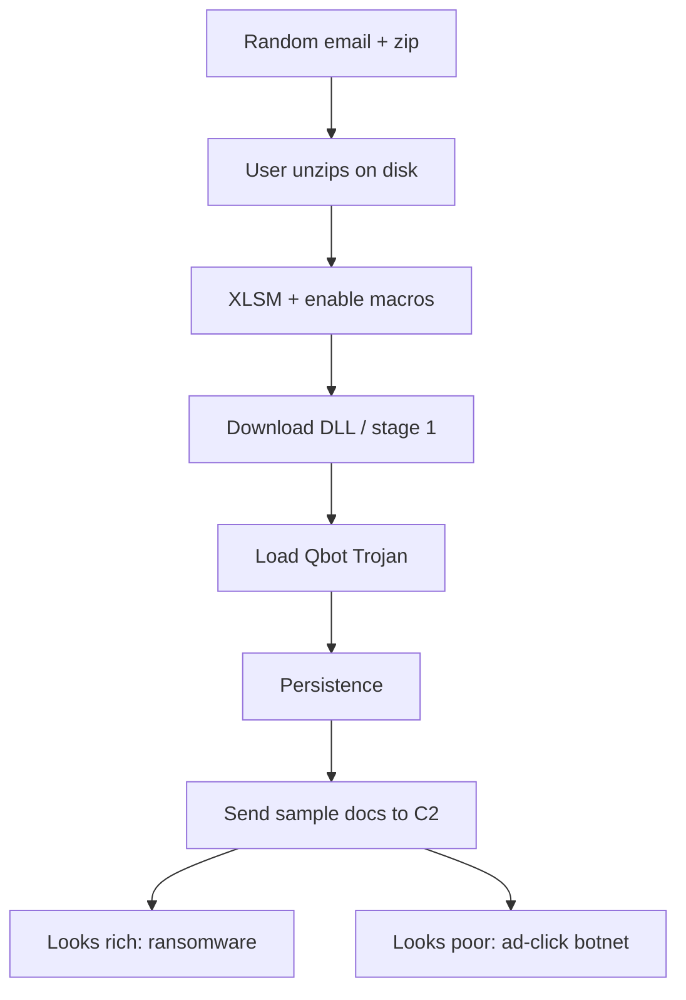

### Serious players: APTs

How do you define a cyber attack at this level? Serious players are **APTs**. They run this as a **serious business**. Motives: government vs government, or a group in it for money. Building software, finding bugs, exploiting, weaponizing, targeting is **very expensive** — not as cheap as it appears.

Definition taught: attempt to gain **unauthorized access** to a computer, system, or network **with intent to cause damage**. APT difference: **higher motives**; they are **advanced** and **persistent** — after you, they do not give up, they continue to be a threat. A regular hacker leaves and goes after something else; **APTs do not**.

Example: while India was developing COVID vaccines, **healthcare companies were relentlessly targeted** to copy vaccine source code, mixtures, formulations. Advanced and persistent until they get what they want.

### Motives and the 3 Ds

First list of motives: **steal data** (also called **cyber espionage**), **disrupt**, **destroy**.

Then: technically, cyber attacks in **3 Ds**:

1. **Disrupt** — irritate the functioning of a system.
2. **Degrade** — you used to manage 100 customers simultaneously, now only 50 because two servers are destroyed or bandwidth is wasted on the attacker.
3. The “last one” is completed from the earlier triad as **destroy** (the lecture trails off after degrade).

Recent example left as a thought: **Mumbai / Tata Power grid** suddenly came down; nobody had any idea why.

### Types usually seen (top 15 as listed)

Distribution of malware, web-based attacks, phishing, web application attacks, spam, denial of service, identity theft, data breaches, insider threats, botnets, physical manipulation / damage / theft / loss (USB example promised), ransomware, espionage, **cryptojacking**.

**Cryptojacking:** take over other PCs to **mine cryptocurrency**; could also mean **taking over your wallet directly**. (Lecture: crypto mining vs also wallet takeover.)

### Sample APT: SideCopy

**SideCopy:** APT group **probably affiliated with Pakistan**; nowadays seen with **a lot of Chinese help**. Malware modules constantly under development and evolving, but **code remains very same**. Actors track detection and change source so antivirus A or B no longer flags it. They also **copy another (probably Indian) APT group’s tools** to **mislead** attribution.

Campaign: Government of India had an application to **prevent people from illegally accessing email accounts of government officials**. SideCopy distributed a **malicious version**: “you seem to be hacked, please download this application and use it henceforth.” Lookalike of the real app; hostname called out: **mail-gov.in** — “how many will notice it.” Happily distributed; the operation worked.

## Cases and examples from the lecture

- Multi-branch firm: no duplicate data centers; VPN tunnel instead of private fiber.
- *Uri* recon / quiet insert / weapons / payload / command-center ping as kill chain.
- Spray phishing vs researcher-risk of getting published.
- Doon School daughter email = spear phishing (motivation signal).
- Website “not responding” as the civilian view of volumetric DoS.
- Bunker buster; Word arbitrary-command bug → RAT download.
- TeamViewer / Ammy Admin as legitimate remote admin; DarkComet / Atom Logger as paid undetectable RATs.
- Vidar: Brazil + Lucknow/Jio, Redbus/Grammarly/Ola/… via 0.13 MB zip.
- Qbot zip → XLSM macros → staged DLL → C2 decides ransom vs ads.
- “Do not call me, reply here only.”
- Hidden Excel sheets + “enable content.”
- Ghidra (NSA) vs Data Pro debugger.
- COVID vaccine-research targeting of Indian healthcare.
- Tata Power / Mumbai grid unexplained drop.
- SideCopy fake government mail-security app, `mail-gov.in`.

## Key terms

| Term | Meaning in this lecture |
|------|-------------------------|
| VPN / VPS | Encrypted tunnel; VPS assigns a private IP so you look on-LAN |
| Kill chain | Recon → weaponize → deliver → exploit → payload / persist → C2 → act |
| Trojan | Malware type whose primary job is a **back door** (payload in a payload) |
| Spear phishing | Researched, one-target phishing |
| C2 / C&C | Separate machine that pings “alive?” and issues commands |
| DoS / DDoS | Overwhelm a service; distributed = many sources, volumetric |
| Vulnerability | Weak link (not automatically exploitable) |
| Exploit | Weapon that actually breaks through that link |
| Payload | What runs after the break (often a RAT); deadliest piece |
| RAT | Remote administration tool; legitimate or criminal |
| Stealer | Malware that harvests site passwords (Vidar) |
| Qbot | Random-email → zip/macro → staged Trojan → botnet monetization |
| APT | Advanced, persistent, will not walk away; expensive to run |
| 3 Ds | Disrupt, degrade, destroy (plus steal/espionage as motive) |
| Cryptojacking | Hijack machines to mine, or hijack a wallet |
| SideCopy | APT (Pakistan-affiliated in this talk) using lookalike gov mail tools |

## Formulas / frameworks (if any)

**Kill chain (as analogized):** reconnaissance → choose weapon for the identified asset → deliver/exploit → payload and retain access → command-center alert → objective (steal / destroy / botnet).

**Two economies of hacking:** (1) mass email → bots → spread; (2) one-org espionage with custom tools.

**V–E–P:** vulnerability (weakness) → exploit (weapon) → payload (the job, e.g. RAT). Antivirus historically chases payloads.

**Qbot money:** C2 inspects stolen samples → ransom the rich / ad-click the rest.

**APT:** unauthorized access **with intent to cause damage**, plus **will not give up**.

## Distinctions the instructor insists on

- VPN is not “privacy from your ISP” in this lecture; it is **how branches join HQ** — and the **single best impersonation target**.
- Random crime and espionage are **different weapons and different risk of getting caught**, not two names for the same email.
- Malware ⊃ Trojan; a Trojan **can** become ransomware.
- Phishing vs spear phishing is **targeting and research**, which itself tells you motive.
- DoS vs DDoS is **one source vs many**; both are about **capacity**, not clever credentials.
- A vulnerability is not an exploit; an exploit is not the payload. **The payload is the deadliest.**
- Genuine remote-admin tools and criminal RATs share the *idea*; the market sells **undetectable, subscription-updated** variants.
- Zip attachments exist to **desynchronize what the mail scanner saw from what the user runs**.
- APT vs “regular hacker”: **persistence and motive**, not a cooler logo.
- Espionage / warfare: **motive** (steal vs disrupt vs destroy); 3 Ds are the **technical effects**.

## Exam-oriented recap

- Fool the VPN server = sit on the office LAN with a private IP; weakest VPN in the mesh is the mesh.
- Kill chain = commando raid: recon, right weapon, exploit, payload, C2 callback.
- Spray-and-pray builds botnets from spam; espionage is expensive, focused, and allergic to hitting a researcher.
- Learn V–E–P, C2, Trojan-as-backdoor, spear phishing as a motivation signal, volumetric DDoS.
- RATs are cheap, licensed against AV; stealers (Vidar) siphon passwords from zip-sized droppers.
- Qbot: zip → macros → staged DLL → C2 chooses ransom or ads; social engineering says “don’t call, reply here.”
- APTs do not leave; vaccine-theft and SideCopy fake-gov-app are the Indian-facing examples; think disrupt / degrade / destroy plus steal.

---

# Lecture T24: Live Session — Residual Risk, TVA, and Technology-Week Readings

**Playlist index:** 24  
**Transcript:** [24-industry-perspective-part-03.md](../transcripts/markdown/24-industry-perspective-part-03.md)  
**Video:** https://www.youtube.com/watch?v=JPQiuqw6fvw  
**Week / theme:** Live interaction in the risk-management week — corrected residual-risk formula, TVA worksheet, and how to read textbook chapters 5–8 into the technology weeks

## Learning objectives

- Restate the **risk management process** as identify → assess (measure) → control.
- Compute **residual risk** with the **corrected** classroom formula (no “controls subtracted twice”).
- Unpack **loss frequency** and **loss magnitude** into the two probabilities and the impact × exposure story.
- Draw a **TVA** worksheet (threats × assets → vulnerability) and say what you do after you sort it.
- Know that **chapters 6–8 are to be read together** for the cybersecurity-technology weeks, even if the weekly split looks neater on paper.

## What this lecture actually teaches

This is **not** a continuation of the industry guest’s attack/defense slides. It is a **live interaction** in the **risk-management week**. The industry classroom session already exists as video; this hour is Prof. Saji on **risk measurement**, a **formula correction**, the **TVA** template, and **readings that feed the technology weeks**.

### Why risk first

Cybersecurity management depends on how well you understand the risk involved. The textbook’s applied path: **measure** risk, then use that measure as the basis to **control** it. Control mechanisms are discussed **after** assessment.

Process:

1. **Risk identification**
2. **Risk assessment** — here **assessment means measurement**
3. **Risk control** — act on managing, controlling, or reducing risk based on the measures

Classroom slogan: **that which you cannot measure you cannot control.** The first step toward control is measurement. Objective measures let you act.

Analogy used: weekly **assignment scores** are an instrument. The score goes to instructor and student; a low score means act (effort, access to materials, teaching, time). The score is not the point; **learning** is — but the score reflects learning. Risk management works the same way: identify, assess, control.

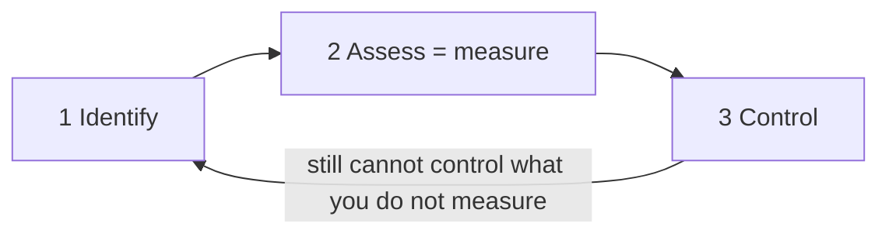

### Residual risk — the corrected formula

Slide: **final formula for calculating risk**. It looks like an equation.

**Residual risk = (loss frequency × loss magnitude) + measurement uncertainty**

He has **corrected the formula from the pre-recorded video lecture** (the older line sat at the bottom of that slide). The correction is to make it simple.

Risk is assessed primarily from **two factors**: **loss frequency** and **loss magnitude**.

### Loss frequency = two probabilities multiplied

Go back to the lessons: loss frequency emerges from **two probabilities**. He notes a slight difference between **likelihood** and **probability**, then **uses them in a similar sense**.

1. **Probability / likelihood of an attack.** There are many threats, internal and external; they are **not equal** in likelihood. That number has to exist as data. **Threat intelligence** is a very informed activity and often needs **external expertise**. So this probability comes from **experts**.
2. **Likelihood of success of that attack.** That depends on **vulnerability**. For each threat there is a corresponding vulnerability. You have already invested in **people, process, technology**. For some attacks you may be fully prepared, so **likelihood of success is very low** even if likelihood of attack is not.

**Multiply** those two probabilities. That product is **loss frequency**: the likelihood that there will be a **successful** attack. It is itself a probability.

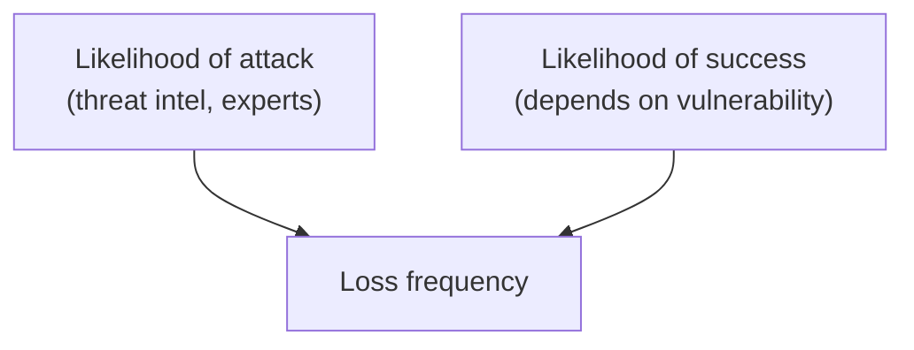

### Loss magnitude = impact × how much of the asset is exposed

If an attack happens, what is your **exposure**? How much loss?

The video lectures already have an **objective measure of impact** (e.g. a 0–100 scale, or another objective scale).

If equipment is attacked, **sometimes it is not the whole equipment** — a part of a server or system may be down. **Exposure** = **what percentage of a particular asset is exposed**. That is what loss magnitude is getting at.

**Loss frequency × loss magnitude** is **probability × impact** in the general sense.

**General formula for risk:** probability of occurrence × impact if it occurs. Cybersecurity risk assessment just names those pieces **loss frequency** and **loss magnitude**.

### Why add measurement uncertainty

These measurements always have **error**. They are not purely objective; they are often **perceptual**. Probability may be an **expert’s judgment** (judgment error). Magnitude and exposure are often perceptual too.

So another item is added to the residual-risk measurement: **measurement uncertainty**.

It is added because you want to **amplify** the risk — go with the **worst case**. Measurement may be inaccurate, so **step it up** and show risk **higher than what is measured**.

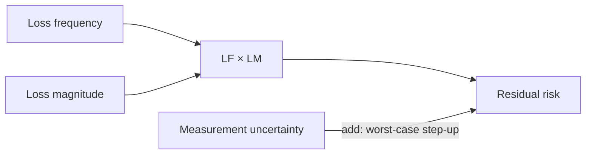

### What was removed from the old formula (and from the new textbook)

The previous formula included **minus the percentage of risk mitigated by current controls**. Even the **new edition of the textbook has removed** that minus term.

The fine-grained idea was: after assessment, if extra measures are taken to reduce risk, subtract them so residual risk is very accurate. **In class that term caused confusion.**

**Assumption that makes the simple formula valid:** loss frequency and loss magnitude are assessed **with certain controls already in place**, and **no additional measure** is taken afterward to further minimize risk. Under that assumption, drop the minus term.

The worked example (next slide in the live session) also has **no such factor**. **For all practical purposes:**

> residual risk = loss frequency × loss magnitude + measurement uncertainty

That is the lesson he wanted in this hour: the extra factor is not well understood, and the textbook has corrected it.

### TVA worksheet

Recurring content question: the **TVA** template (he also says “DBA worksheet” once in the caption noise — the object is **TVA**).

- **Threats on the vertical axis**
- **Assets on the horizontal axis**
- **Vulnerability** for **each combination** of asset and threat
- Threat **works against** assets; **asset is one unit, threat is another unit**
- When you **sort** it, it comes in **ascending order**
- **For each vulnerability** you then try to understand **likelihood of success of the attack** — it is **based on vulnerabilities**

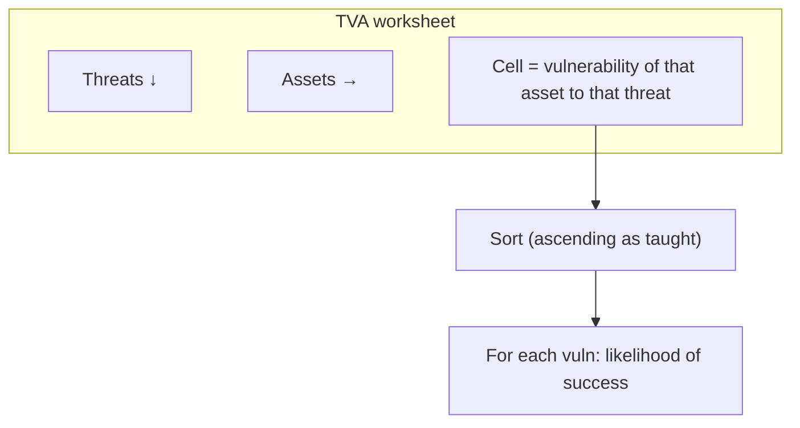

Unit of later calculation (picked up again in T25): you still **go by asset**.

### Readings that unlock the technology weeks

He has posted reading for **this week and the next two** (he first says weeks six, seven and eight, then tightens the mapping).

Taught mapping, after the correction in his own wording:

| Textbook | When |
|----------|------|
| **Chapter 5** | **This week — risk management** |
| **Chapters 6, 7 and 8** | **Weeks 7 and 8** — three chapters for **two** weeks of **cybersecurity technologies** |

**Read 6–8 together in advance.** There **will be overlaps**. Concepts **flow**: unless you know the previous one you cannot go to the next. A question from chapter 6 or 7 may appear in week 7; chapter 8 may be **partially** in a week-7 lecture. The weekly chapter split is an **approximation**. **You need all three chapters to understand cybersecurity technologies.**

He also states the **industry invited lecture** was a live classroom with student questions, fully captured on video — it is not supposed to map 1:1 onto a numbered assignment week.

## Cases and examples from the lecture

- Weekly assignment **score** as a measurement instrument that triggers action — the same logic as risk identify / assess / control.
- Expert **threat intelligence** as the source of attack likelihood (not something you invent at the desk).
- Defense already in place → attack may still be **likely** but **success** is low → product (loss frequency) is low.
- Partial server down → **exposure percentage**, not always 100% of asset value.
- Textbook **new edition** dropping “minus % mitigated by current controls,” matching his classroom correction.
- TVA grid: every **asset–threat pair** gets a vulnerability, then sort, then success likelihood.

## Key terms

| Term | Meaning in this lecture |
|------|-------------------------|
| Assessment | **Measurement**, not a vague essay about risk |
| Residual risk | Risk left in the measure: **LF × LM + measurement uncertainty** (corrected) |
| Loss frequency | P(attack) × P(success \| attack); P(success) from **vulnerability** / existing defense |
| Loss magnitude | Impact of a successful attack, including **% of the asset exposed** |
| Measurement uncertainty | Added slack because expert/perceptual measures err; **worst-case step-up** |
| Threat intelligence | Expert (often external) source of likelihood-of-attack data |
| TVA | Threats × assets worksheet; cell = vulnerability; then likelihood of success |
| Chapters 6–8 | Technology weeks; read as **one block**, not three isolated weeks |

## Formulas / frameworks (if any)

**Process:** identify → assess (measure) → control.

**Residual risk (use this, not the video’s older line):**

\[
\text{Residual risk} = (\text{Loss frequency} \times \text{Loss magnitude}) + \text{Measurement uncertainty}
\]

**Loss frequency:**

\[
\text{LF} = (\text{Likelihood of attack}) \times (\text{Likelihood of success})
\]

Likelihood of success is driven by **vulnerability** given people / process / technology already deployed.

**Loss magnitude (as taught):** impact of the event, with **exposure** = percentage of the asset affected — so you are not always multiplying full asset value.

**General risk:** P(occurrence) × impact if it occurs. LF × LM is that idea with cybersecurity names.

**Do not subtract** “% of risk mitigated by current controls” **if** LF and LM were already assessed **with those controls in place** and nothing extra was added after the assessment. That minus term is what confused the pre-recorded lecture and was removed in the new textbook edition.

**TVA:** threat (vertical) × asset (horizontal) → vulnerability per cell → sort ascending → for each vulnerability, likelihood of successful attack.

## Distinctions the instructor insists on

- **Control follows measurement.** No number, no control.
- **Likelihood of attack ≠ likelihood of success.** You can be a popular target and still a hard target.
- **Exposure ≠ “the whole box died.”** Part of a system can be down.
- Residual risk in **this** hour is **not** “LF × LM − current controls + uncertainty.” Current controls are **already inside** LF (via P(success)) and LM if you assessed honestly. Adding a minus term **double-counts** and confused the class.
- Measurement uncertainty is **not** a confession of ignorance to hide; it is a **deliberate conservative add-on**.
- The **industry video** and the **risk-week live session** are different objects. This live hour is formula + TVA + how to read for **technology** weeks.
- Chapter-per-week labels for 6, 7, 8 are **approximate**; **overlaps are expected**.

## Exam-oriented recap

- Risk week mantra: identify, **measure**, then control — because you cannot control what you cannot measure.
- **Residual risk = LF × LM + measurement uncertainty.** Drop the old “minus % mitigated by current controls” when assessment already assumed those controls.
- LF = P(attack) × P(success); P(attack) from threat intel; P(success) from vulnerability / existing defense.
- LM = impact, with exposure as **percent of asset**.
- Add uncertainty to **step risk up** (worst case), because expert judgment is perceptual.
- TVA: threats down, assets across, vulnerability in the cell; sort; then success likelihood **per vulnerability**.
- For the coming **cybersecurity technologies** weeks, **read textbook chapters 6, 7 and 8 together** (chapter 5 is this risk week).

---

# Lecture T25: Cybersecurity Technologies — Part 01

**Playlist index:** 25  
**Transcript:** [25-cybersecurity-technologies-part-01.md](../transcripts/markdown/25-cybersecurity-technologies-part-01.md)  
**Video:** https://www.youtube.com/watch?v=3rkIe2ZkkfY  
**Week / theme:** Close quantitative risk management (five options, ALE/ACS) and open the **protection** role of cybersecurity technologies

## Learning objectives

- Close the risk-management loop: identify → quantitative assessment → **management choice** among five strategies.
- Keep **defence** and **mitigation** from collapsing into each other.
- Justify a control with **ALE, SLE, ACS** (cost–benefit), then **monitor** because estimates are not actuals.
- See today’s technology topic as **defence/protection**, complementary to last week’s industry session (Mr. Sai).

## What this lecture actually teaches

Welcome back. Previous sessions were risk as something to address with solutions; last week was **Mr. Sai** — practical handling of cybersecurity issues, complementary to conceptual cybersecurity management.

**Today’s plan:** summarize and **close risk management**, then move to **cybersecurity technologies**. Focus: **overview of technologies used particularly for protection** — the **defence** point of view: how you deploy technology **against attack**. (Different roles of technology exist; this block is protection.)

### Risk management recap: three stages

Risk management is basically a **preventive** measure. You identify **assets** because assets are what are attacked / become the target of enemies.

Three stages:

1. **Identify** — identify yourself and identify your enemies: **assets** and **potential threats**.
2. **Assessment** — quantitative; bring precision. Assets identified, but **how do you value them?** If affected, what is the **financial impact**? Also **threat intelligence**: probability a threat materializes, and if it occurs, **chance it is successful given existing defense**.
3. Then the **final measures** for calculating risk.

Two important assessment measures (already discussed):

| Measure | As restated today |
|---------|-------------------|
| **Loss frequency** | Probability of an attack × probability of a **successful** attack (“actually happening in your system”) |
| **Loss magnitude** | **Exposure of an asset**: asset value × **what percentage** of that asset will be exposed |

Once those exist, you can arrive at the overall measure.

### Residual risk (this lecture’s wording)

Risk as an overall measure is called **residual risk**: the risk **left after implementing certain protection mechanisms**.

At a “very detailed level of quantitative measurement,” today he still writes it as:

**product of loss frequency and loss magnitude, minus the protection from existing systems, plus a measurement error / measurement uncertainty** (uncertainty can be calculated from the error).

Unit is the **asset**. Each asset has vulnerability and value. Vulnerability comes from **mapping each asset to a threat**. **TVA worksheet**, then risk **per asset**.

Compare T24’s live correction: there, the minus-“current controls” term is dropped because LF and LM are already assessed with controls in place. This lecture still **voices the long form**. For the exam, know **both** the live-session simplified formula and this “detailed” statement.

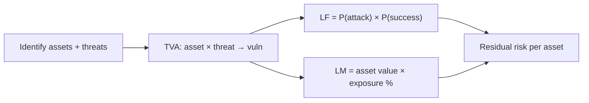

### Place it before management: five options, not “always defend”

The pack goes to management: these assets, these risks. **Risk is something that needs to be managed.** You estimated per asset; asset X has this risk on a relative scale. **So what?** Action is management’s.

**Five options** (textbook language on the slide):

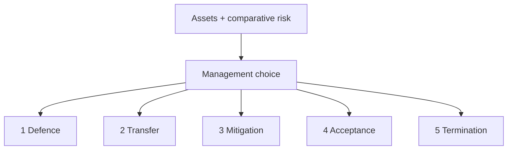

Defence is **not the only option**. In management literature, defence is one option. The path taken has to be **justified**.

#### 1. Defence

E-commerce server has high risk; you will not leave it. Step in, put **safeguards**. Invest more in cybersecurity technologies; recruit a **CISO**; invest in **people** and **technologies** because the decision is to **defend**. If an attack occurs tomorrow, be as prepared as possible. Effort to **reduce risk**: more defence → **reduce exposure** or **reduce chance of success**. **Investment decision**.

#### 2. Transfer

A **smart** option; **many non-IT companies** do this for cyber assets: **transfer risk from the owner to a third party**.

**Outsourcing:** IT asset management to a vendor. Example: **TCS** providing IT services to a US client — responsibility for running systems; **SLAs** (e.g. 99.99% availability). Cyber attack becomes something **the vendor** needs to manage; owner’s risk is passed on.

**Cloud computing** (from the room): storage moved to cloud — another third-party vendor. Cloud is **one** transfer option, not the whole of transfer.

Student point: transfer can look like it “includes” defence, mitigation, acceptance, termination because the vendor then uses those strategies. Reply: **each is a separate strategy**. A company can transfer **or** continue to own. Once risk is transferred, the **vendor** may try each option because *they* must manage risk. The **client can continue to own** the assets and take an option **other than** transfer.

**Managed services** (Wipro or TCS): **assets may still be owned by the client** (material ownership) but **services are managed** — availability is the provider’s job, so **cybersecurity management of the client’s asset becomes the provider’s responsibility**. Different from “we sold you the cloud.”

Why transfer: often **no internal expertise**; give it to a professional.

**iPremier (recalled case):** the company **had transferred** risk to a third party, but the third party was **unprofessional**, not updated, **even worse than the client’s knowledge**. Transfer requires **professional** management.

Classroom worry: you might still be unstable to customers after transfer. Yes — transfer is not magic.

#### 3. Mitigation — not a synonym of defence

People use mitigation and risk management **synonymously with defence**. **Wrong.**

| | Defence | Mitigation |
|--|---------|------------|
| Timing | Build **against** attack (e.g. **firewall**) | Assumes **attack has already happened** (as in **contingency management / planning**) |
| Goal | Reduce chance of success / exposure | **Minimize the impact** of an attack |
| Example investment | Defence technologies, CISO | Contingency **team**, **hot site** |

Investing in a hot site is **not** an investment in defence; it is **reducing impact** — therefore **mitigation**. Separating / allotting resources for contingency planning **is** a mitigation strategy.

**Keep that in mind.** He has heard people use the words synonymously; **it is not correct.** Mitigation is reducing impact.

#### 4. Acceptance

Recall **Target Corporation**. Some experts: you are a **70 billion** company and lost **500 million** — a small tip; **do not over-invest**, do not do more defence or mitigation; **cross the bridge when you come to it**.

These are **informed** management decisions. If you choose acceptance, know the **economic implications** — loss vs gain, economic justification.

Conditions: an organization may be ready to accept. **To a large extent, academic institutions like ours have chosen acceptance** — not too worried; if data is leaked tomorrow, we will face it; not that critical; **not so much investment** in cybersecurity. Sometimes based on **criticality of data and applications**.

#### 5. Termination

Cybersecurity investment would have to be so large that it **does not make economic sense** to keep the business unit. Cash flows / revenues vs cost do not justify the business. **Stop** having those IT assets; **sell them off**. Also an option, based on economic justification.

**Informed, rational management** decides on **economic justification**.

### Standards speak different dialects

Same generic concepts (textbook, first column of a comparison table); **NIST** and **ISO** use slightly different language. NIST example given: a standard for **documenting risk**, **SP 830**. There are standard ways of documenting risk once assessed.

### Controls need a cost–benefit sheet

Students of management already know CBA. For any investment: benefits should be more than cost; how much more often decides go / no-go. **Gains should outweigh the cost** — same principle for cybersecurity risk-management options.

Investment in defence or mitigation puts money into systems. Arrive at a **cost–benefit sheet for each option**.

### ALE, SLE, ACS

**Annualized loss expectancy (ALE)** is used to calculate cost and benefits.

- **SLE (single loss expectancy)** = **loss magnitude** = **asset value × exposure factor** (already seen).
- **ALE** = that loss magnitude **annualized** by **number of occurrences in a year** — estimated loss magnitude over a year.

**Overall gain or loss** (can be positive or negative):

You have **ALE prior** — current expected annualized loss **before** the new action (assessment already done).

Risk people propose an investment (protection or mitigation or whatever). After that you expect **ALE post** — different because better protection is in place.

You also incur **ACS — annualized cost of the safeguard** (cost of implementing the control, annualized).

Classroom trap: who should be **higher**, ALE prior or ALE post? Someone says ALE post. **No** — it is about **loss**. When the system is more vulnerable, expected losses are **more**. After you spend ACS, you expect **ALE to go down**.

Trade-off: look at **ALE post + ACS**. What justifies the investment: **ALE post + ACS should be less than ALE prior**. Then you have a **gain**, a positive cash flow.

If **ACS is very high**, the control **does not justify** — gain goes down. Reasonable investment that **reduces losses enough** justifies itself.

All of this needs **quantification and monetization**. Conceptually: investment should reduce losses **sufficiently** to justify the spend.

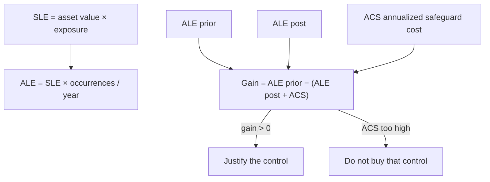

### After you choose: monitor

At investment time you have an **estimate** of gains or losses. **Actual can be very different.** Management must see that the investment **delivers the expected gains**. Next effort: **monitoring of the risk-control strategies** you put in place.

Tomorrow’s technology discussion: mechanisms for **defence** and for **mitigation**.

## Cases and examples from the lecture

- Mr. Sai last week: practice complementing theory.
- E-commerce server → invest in tech + CISO (defence).
- TCS / US client SLA 99.99% (transfer by outsourcing).
- Cloud as one transfer path; **managed services** (Wipro/TCS) where **client still owns** boxes.
- **iPremier**: transferred to an **unprofessional** vendor — worse than in-house.
- Firewall = defence; **hot site / contingency team** = mitigation.
- **Target**: $70B firm, $500M loss, some experts say accept.
- **IIT / academic institutions**: largely **acceptance**.
- Terminate a business unit when security cost kills the economics.
- NIST **SP 830** / ISO different labels, same ideas.
- ALE prior vs post vs ACS: do not buy a safeguard whose annualized cost eats the loss reduction.

## Key terms

| Term | Meaning in this lecture |
|------|-------------------------|
| Residual risk | Risk left after protection; detailed form includes minus existing protection + uncertainty |
| TVA | Asset–threat map that yields per-asset vulnerability and then risk |
| Defence | Invest to be ready **before** / **against** attack; cuts P(success) or exposure |
| Transfer | Pass operational cyber risk to vendor (outsource, cloud, managed services) |
| Managed services | Client **owns** assets; provider must keep them available / secure |
| Mitigation | **After** incident logic: spend to **cut impact** (contingency, hot site) |
| Acceptance | Informed choice to live with the number (Target comment; campuses) |
| Termination | Exit the asset or business when security spend cannot be justified |
| SLE | Single loss expectancy = loss magnitude = AV × exposure factor |
| ALE | SLE annualized by yearly frequency |
| ACS | Annualized cost of the safeguard |
| SP 830 | NIST document-risk standard as **named in this lecture** |

## Formulas / frameworks (if any)

**Three stages:** identify (assets + threats) → assess (value, P(attack), P(success), TVA) → manage (five options) → **monitor**.

**Loss frequency** = P(attack) × P(successful attack).

**Loss magnitude** = asset value × % exposed.

**Residual risk (this video’s detailed wording):** (LF × LM) − protection from existing systems + measurement uncertainty.

**Five options:** defence, transfer, mitigation, acceptance, termination — **economically justified**.

**SLE** = asset value × exposure factor (= loss magnitude).

**ALE** = SLE × (annualized number of occurrences).

**Gain from a control:**

\[
\text{Gain} = \text{ALE}_{\text{prior}} - (\text{ALE}_{\text{post}} + \text{ACS})
\]

Invest when gain is positive, i.e. when \(\text{ALE}_{\text{post}} + \text{ACS} < \text{ALE}_{\text{prior}}\).

## Distinctions the instructor insists on

- Technology this week is **protection / defence**, not a full catalogue of every cyber tool.
- **Defence ≠ mitigation.** Firewall vs hot site. Mitigation **assumes the hit** and cuts **impact**. Using the words as synonyms is **incorrect**.
- Transfer ≠ “we no longer have a problem.” **iPremier**. Client can still **own** assets under managed services.
- Cloud is **a** transfer option; transfer also includes classic outsourcing / managed services.
- Acceptance is not laziness if it is an **informed economic** choice; he still says campuses largely **accept**.
- Termination is a real fifth option, not a joke.
- **ALE post should be lower than ALE prior** (losses), even though you added ACS.
- A control with huge ACS can **fail CBA** even if it “improves security.”
- Estimates at decision time are not actuals → **monitor**.
- NIST/ISO **names** differ; textbook **concepts** are the generic column.

## Exam-oriented recap

- Close risk with **five management options**; defence is only one, and it must pay for itself.
- TVA and per-asset residual risk go to management as a **comparative scale**.
- Transfer: outsourcing, cloud, managed services (ownership may stay); vendor must be competent (**iPremier**).
- Mitigation = contingency / hot site / impact reduction, **not** “another word for firewall.”
- Acceptance (Target 70B vs 500M; academia) and termination (kill the unit) are rational when the economics say so.
- **SLE → ALE; compare ALE prior with ALE post + ACS.** Positive gain justifies the safeguard; then monitor.
- Next: what those defence and mitigation **technologies** actually are (managerial overview).

---

# Lecture T26: Cybersecurity Technologies — Part 02

**Playlist index:** 26  
**Transcript:** [26-cybersecurity-technologies-part-02.md](../transcripts/markdown/26-cybersecurity-technologies-part-02.md)  
**Video:** https://www.youtube.com/watch?v=ZQSXMurVEXA  
**Week / theme:** Managerial overview of protection tech — *1984* / surveillance, IAAA access control, biometrics (FAR/FRR/CER), firewalls and DMZ, cryptography (symmetric/asymmetric, signatures, Caesar / transposition / XOR)

## Learning objectives

- Place access control, firewalls/DMZ, and cryptography as three **protection** families for CIA.
- Walk **identification → authentication → authorization → accountability** and the authentication factors actually named (password, passphrase, OTP, MFA, biometrics, voice/signature).
- Evaluate biometrics with **FAR, FRR, CER**, using the Andhra ration / worn-ridge case and the CAT-score analogy.
- State what a **firewall rule** does, what **trusted / untrusted / DMZ** mean here, and why cryptography **does not control access** but hides meaning.
- Contrast **symmetric vs asymmetric** key management, **digital signature** (reversed keys, non-repudiation), **digital certificates**, and the three cipher techniques (substitution, transposition, XOR).

## What this lecture actually teaches

As part of cybersecurity **management**, you may **defend** (stronger defence) or invest in **mitigation**. Today: what **technologies** exist to provide better security, reduce cyber risk, feel safer with new safeguards.

**Disclaimer:** this is an **overview**. Each technology is a distinct engineering topic. He will **not** go into design detail. Managerial aim: **awareness** of what the technologies **do**, **where** they are used, and some **functional** “how” (cryptography as the example).

### Culture notes he actually assigns

Watch movies related to cybersecurity (not only recent incident films).

- **1984** — book by **George Orwell (1949)**, predicting a 1984 scenario; a classic. Also recommends **Animal Farm** to understand politics. **1984 is about surveillance**: surveillance technologies as a powerful tool for governments to enter the **private space** of individuals; government decides what citizens do. Not a claim that we fully live there — it is about **potential abuse** by agencies who have power. **Power asymmetry**: you are vulnerable; you do not have much say in what government should do.
- **Minority Report** (Steven Spielberg, 2002, Tom Cruise) — **retinal detection** for access to systems. Access control is a cybersecurity mechanism; the film is the hook.

### CIA again, and four steps of access control

Confidentiality, integrity, availability are the **objectives**. A mechanism for ensuring CIA involves **four steps** (covered before, reused now): **identification, authentication, authorization, accountability**. Today: **how technology** does access control — how access-control tech **serves CIA**.

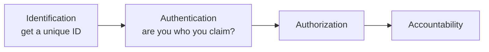

### Identification

Anyone who wants a system, cyber asset, or service should have an **ID**. Creating ID is first. An **identifier uniquely identifies a user**.

Colonial / school example: no ID card, not biometrics, **not even a photograph**. **Permanent body marks** — “black mole on the right cheek” — recorded as ID. Rudimentary; uniqueness is questionable. Today: advanced techniques.

### Authentication

ID is stored. When you present yourself, what you present is **compared with what is stored**. Authentication: **whether you are the person whom you claim to be.** You say “I am X”; we verify you are X.

Methods shown:

- **Something you know:** **password** (unique, only you know, stored, compared). **Passphrase** — longer expression, a **phrase not a word**; passwords can be cracked; passphrases gaining importance. Password “developed at MIT many decades ago.” **OTP** — we live in the era of **multi-factor authentication**.
- One factor (password/passphrase) vs **multiple factors**.

**SBI example (as walked):**

1. Username = **ID** (who you claim to be).
2. Password compared with store = **first factor**.
3. **CAPTCHA** — “are you a man or an animal?” Ensures **human, not a script**.
4. **OTP** to a **different device** — second factor from **something you own** (phone). India’s tele-density “close to 100%” made phone OTP a national MFA mechanism.

Apple-style **three-factor** and beyond: be very sure it is you. MFA **increases the level of access control**.

Other methods: **smart cards**; **fingerprints**; **retina and iris scans** — eye properties unique to an individual. **Retina:** blood-vessel patterns unique (like fingerprints). **Iris:** pattern **around the pupil**. Capture with camera, store → becomes an ID for authentication.

**Fourth type:** authentication using **what you produce** — **voice, signature**.

Biometric (part of body) and non-biometric can be **combined**.

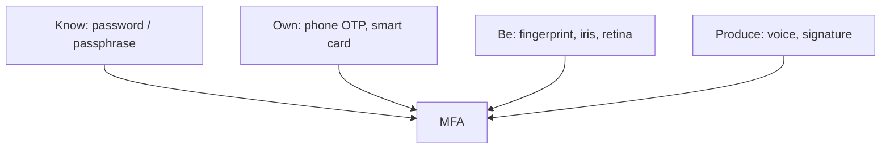

### Biometrics: limitations, inclusion, FAR / FRR / CER

Because biometric devices are widely used for access control, know **limitations**.

**Digital inclusion** in India: urban users have UPI / cards / cash; a rural farmer may have no card and little awareness — **excluded** from digital benefits. Several states tried fingerprint authentication for **rations**.

**Krishna district, Andhra Pradesh:** he judged a national competition; met the IAS officer. Farmer at ration shop without wallet: show fingerprints. Fingerprints stored; **Aadhaar-linked bank account** linked to the distribution system. Want 2 kg rice, pay from bank by fingerprint — “acting as your credit card.”

**Implementation problem:** **ridges wear out**, especially with **manual labour**. System could not sense them. Fix: not one finger — **combination of all five fingers** so probability of correct identification improves. Then the system was implemented.

**False positives vs false negatives** — trade-off, like controlling entry.

**CAT / DoMS analogy:**

- Make entry extremely strict (CAT 99.99) to ensure no “bad” students: you drive **false positives** down (no bad student admitted) but **false negatives** go up (a 99.8 who is actually better, or someone having a bad exam day, is rejected). CAT is a measurement with error; not an exact aptitude meter.
- Relax to 80%: false negatives fall (you stop rejecting good people) but **false positives go up**.
- Like **Type I / Type II** in hypothesis testing.

On biometric devices that trade-off is **FAR vs FRR**:

| Acronym | Meaning |
|---------|---------|
| **FAR** | False **acceptance** rate (false positive: let the wrong person in) |
| **FRR** | False **rejection** rate (false negative: reject the right person) |
| **CER** | **Crossover error rate** — **optimal point** where the two meet |

When FAR increases, FRR is low; when FRR goes up, FAR goes down. **CER is typically specified** on biometric devices. Check whether CER is **sufficiently low** and acceptable for the problem in hand.

Widely used: fingerprints; retina (blood-vessel pattern); **iris** — “random patterns of freckles, pits, striations, vasculature and coronas” (multiple iris attributes; the combination is unique). Watch the suggested movie for use **and abuse**.

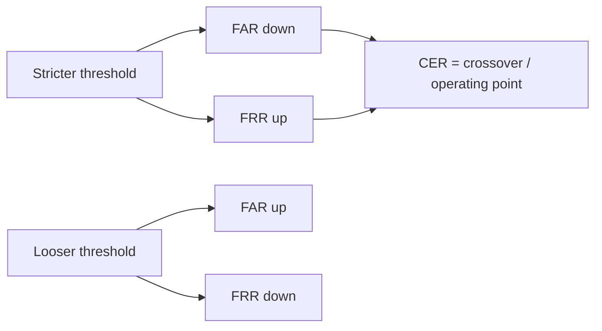

### Firewalls and DMZ

From access control to firewalls: still **protection** technologies.

Access control: who can access; make unauthorized access as impossible as possible. Biometrics raise that bar. Firewalls: widely used, prevent unauthorized access to **data center / servers**. Metaphor: a **burning wall** around the classroom so the enemy cannot enter.

What a firewall **does**: provides access based on **identity**. Example: someone from a particular **IP** tries to reach a **database server**; the firewall **decides** whether that IP may. **Rules are configured**: which IP cannot access a given system. Typical pattern: configure **who cannot**; others can.

**Trusted network** (firewall / cybersecurity literature): **your** network — internal cyber assets, typically the **data center** (servers and applications running org services).

**Untrusted network:** any network **external** to the organization. You do not know it; **do not trust unless we know**.

Because the outside has good, bad, and ugly, you need mechanisms — including **avoid direct access**. You do not want an external agent **directly** into the trusted network. If they want a resource, it is **not provided directly**. A **copy** sits in a **demilitarized zone (DMZ)**. (He misspeaks “dematerialized,” then corrects.)

**DMZ** = **replica** of the trusted network. External agent gets **DMZ, not the trusted network**. Builds a **proxy** — mediator between external systems and trusted network. Campus **proxy servers** insulate the trusted network. Firewall application: configure who cannot access, using firewall rules — **it prevents access**.

```mermaid
flowchart LR
    UN["Untrusted internet"] --> FW["Firewall rules"]
    FW --> DMZ["DMZ replica / proxy"]
    DMZ -.->|"no direct path"| TR["Trusted network / DC"]
```

### Cryptography: assume they got the bits anyway

Third protection family for CIA. Cryptography ensures data is **not used / not accessed** in the sense of **not understood**. Here **access is not controlled**. Despite firewalls and biometrics, someone can still get at data **in transmission**. Impostor / “evil” gains access to the flow.

Assume somebody **has** access: how do you still prevent the information from leaking **meaning**? **You do not control access; you assume access and hide writing.** Encrypt so they “do not understand what they got.”

**Alice and Bob:** Bob sends a confidential Valentine message; a jealous party must not read it. Encrypt: plaintext vs encrypted version that is not legible. **Kryptos** — hidden writing. Encryption = hiding information.

History: Germans in World War, broken by British scientists; popular movies exist. Everyday: **WhatsApp**. On send, WhatsApp says messages are **end-to-end encrypted**. **End to end** means **sender to receiver**; **no one in between** — **not even WhatsApp** can read. (Caveat: we do not know what government will do; **power asymmetry of technology** again.) Some messaging apps provide this **as of now**.

Vocabulary taught:

- **Plain text** — original message, sent as bit stream, grouped into **blocks** (8 bits, 16 bits, …); **blocks** get encrypted.
- **Cipher** — transformation of characters/bytes/bits of plaintext into encrypted components.
- **Cipher text / cryptogram** — unintelligible encoded message.
- **Decipher** = decrypt. Receiver must read “Hi,” not gibberish. Decryption **always involves a key**. Key locks and unlocks.

Two broad methods: **symmetric key** and **asymmetric key** — two ways to **manage the key**.

### Symmetric vs asymmetric

Message encrypted with a key, like a locker. Recipient needs a key to unlock.

**Symmetric:** **only one key** for encrypt and decrypt. Plus: simple, one key to manage. Minus: **how does Alice learn the key?** If the network is insecure (the assumption of encryption), sending the key on the **same** network means the key can be accessed. **Key management is the challenge / limitation.**

**Asymmetric:** key used to encrypt **differs** from key used to decrypt. **Public key** and **private key**.

Alice wants Bob (and others) to send to her. Alice generates **two** keys. She gives Bob her **public key**: “use this to lock.” Bob encrypts with Alice’s public key. Alice does **not** open with the public key — public **cannot** decrypt. She opens with her **private key**, which **stays with Alice**. Public key may travel the insecure network; it cannot be used to read. **Public encrypts, private decrypts.**

TSA suitcase aside: TSA-marked lock the airport can open — **sort of** two different keys; “not exactly the same” as public-key crypto, but the pedagogical picture of a master key. Lighter note: Alice distributed her public key **not only to Bob**.

```mermaid
sequenceDiagram
    participant Bob
    participant Net as Unsecure net
    participant Alice
    Alice-->>Bob: Alice public key
    Bob->>Net: locked with Alice public
    Net->>Alice: ciphertext
    Alice->>Alice: open with Alice private
```

### Digital signatures and certificates — reverse the keys

When the **asymmetric process is reversed**, you are in **digital signature / digital certificate** territory. Previously: sender has public, recipient has private. **Now: sender signs with private key; public key opens.**

Purpose: **non-repudiation** — somebody should not refuse “I sent the message.” Important in **blockchains** too.

Bank cheque: you signed; later you refuse the signature = **repudiation**. Blockchains: you cannot refuse if you actually signed. Non-repudiation in business transactions is an important requirement.

**Indian e-governance:** **Passport Seva**; mandatory company filings (annual reports) automated — **TCS** built automatic filing. Problem: how does government know **it was you**, and tomorrow you cannot deny, and you cannot quietly “correct” after send? Done with **digital signature**: each company given a **key to sign** before sending. A student project with **Satyam**: Satyam distributed **private keys through a dongle** obtained from government — **third party as key manager**. Purpose: **along with** information security, **non-repudiation** / ownership of the filed document.

**Digital certificates:** type iitm.ac.in; browser must ensure it **is** IIT Madras. Genuine orgs have a certificate for the browser to verify. Certificates are like **signatures signed by the company, managed by a third party**. Browser checks a stored certificate that **authenticates the site**.

```mermaid
flowchart LR
    subgraph CONF["Confidentiality path"]
      PUB1["Recipient public"] --> LOCK["Encrypt"]
      LOCK --> PRIV1["Recipient private decrypts"]
    end
    subgraph NR["Non-repudiation path"]
      PRIV2["Sender private signs"] --> OPEN["Anyone with sender public verifies"]
    end
```

### Three technical methods (textbook)

Encryption in a generic sense: **substitution, transposition, and XOR** (Exclusive OR). Described in the textbook.

**Substitution:** mono-alphabetic vs poly-alphabetic. Very old; **Caesar** to his commander via a messenger who must not read Latin plaintext.

**Caesar’s cipher:** instead of A, shift (lecture walk: advance by a number). Encrypted English that decrypts to **“Meet me after the toga party.”** Formula: **p + k**, **k** the shift. Walk: add **3**. Substitute each character with the letter **k** positions later. When the alphabet ends, **wrap** — that is **mod 26**.

**Mono-alphabetic:** **the same rule for all alphabets**. Key is **k**; if the messenger knows k, “Caesar is gone.”

**Poly-alphabetic:** **different rule per alphabet**. When it is A, which substitute is determined by a **key**. Classroom problem: key **IITM**, encrypt **DOMS**. “D becomes L” in the walk-through; **read the textbook for more examples**.

**Transposition:** bit streams in **blocks of 8**; encryption by **changing positions**. Each bit in the block has a **different rule**; block-wise transposition. Key = **rule for changing positions**. Plaintext → ciphertext by applying the key to each block.

**XOR:** truth table for two inputs. Same inputs → output **0**; different → **1**. (0,0)→0; (1,0)→1; (0,1)→1; (1,1)→0. Encryption: for each bit of the message block, apply a key bit with XOR.

He is **outlining principles**, not claiming real encryption is this simple. Encryption **standards** and a recap move to the **next class**; today they will also hear a presentation on **active defense**.

## Cases and examples from the lecture

- Orwell *1984* / *Animal Farm*; Spielberg *Minority Report* retina gates.
- School ID as a **mole on the cheek**.
- SBI: username → password → CAPTCHA → SMS OTP (something you know + prove human + something you own).
- Krishna district PDS: worn fingerprints, five-finger fusion, Aadhaar-linked bank pay.
- CAT 99.99 vs 80% as FAR/FRR.
- Firewall: IP may / may not hit the database server.
- Campus proxy + DMZ replica so outsiders never touch the trusted DC directly.
- WhatsApp **end-to-end** = not even the company reads in transit.
- Jealous third party vs Bob→Alice.
- TSA lock as a loose “two-key” picture.
- Passport Seva and company e-filing; Satyam **dongle** private keys; non-repudiation not just secrecy.
- Browser warning: site certificate missing/outdated.
- Caesar “toga party,” k=3, mod 26; IITM key on DOMS; XOR 1⊕1=0.

## Key terms

| Term | Meaning in this lecture |
|------|-------------------------|
| Power asymmetry | Surveillance tech in the hands of government vs the governed (*1984*) |
| IAAA | Identify, authenticate, authorize, account |
| Passphrase | Phrase, not a word; harder to crack than a password |
| MFA | More than one factor, often a second **device** (OTP) |
| FAR / FRR / CER | False accept, false reject, crossover (device spec to check) |
| Trusted network | **Your** internal assets / data center |
| Untrusted network | Everything outside the organization |
| DMZ | Demilitarized zone: **replica** offered to outsiders via proxy |
| Cryptography | Hide meaning **assuming** the channel is already accessed |
| End-to-end | Encrypted sender→receiver; intermediary (WhatsApp) cannot read |
| Symmetric | Same key both ways; **key distribution** is the hole |
| Asymmetric | Public locks, private opens (for confidentiality) |
| Digital signature | **Private** signs, **public** verifies — **non-repudiation** |
| Digital certificate | Third-party-managed site identity the browser checks |
| Caesar | Mono-alphabetic shift **p+k mod 26** |
| Transposition | Reorder bits in a block by a position key |
| XOR | Bitwise exclusive-or with a keystream |

## Formulas / frameworks (if any)

**Access-control chain:** identification → authentication → authorization → accountability.

**MFA (SBI walk):** ID (username) + knowledge (password) + human check (CAPTCHA) + possession (OTP on phone).

**Biometric operating point:** trade FAR against FRR; **CER** is the crossover / specified optimum; decide if that CER is low enough for the use case (rations vs MBA admissions vs a data center).

**Perimeter:** untrusted → firewall rules → **DMZ replica** → (no direct) trusted DC.

**Crypto assumption:** access to the **ciphertext** may happen; confidentiality is **incomprehensibility**.

**Symmetric:** one shared key; cannot safely ship it on the same untrusted net.

**Asymmetric (confidentiality):** encrypt with **recipient public**, decrypt with **recipient private**.

**Signature:** sign with **sender private**, verify with **sender public** → non-repudiation.

**Caesar:** \(C = (p + k) \bmod 26\) (wrap when the alphabet ends).

**XOR:** output 1 iff the two bits differ.

## Distinctions the instructor insists on

- This is **managerial awareness**, not crypto course design depth.
- *1984* is **surveillance / private space / power**, not a claim that 2020s India is Oceania.
- Identification is **issuing a unique mark**; authentication is **matching presentation to the store**.
- Password vs passphrase vs OTP vs biometric vs “what you produce” are different **factors**; MFA **combines** them, often across **devices**.
- FAR down **is not free** — FRR goes up (CAT 99.99). CER is the honest spec to read on a device.
- Worn labourers’ fingerprints are a **technology** failure with **inclusion** consequences, not user stupidity; **five-finger** fusion was the local fix.
- Firewall **prevents access** by rule; cryptography **does not prevent access** — it prevents **reading**.
- Trusted = **ours**; untrusted = **not ours**. DMZ is a **replica / proxy**, not “the safe room where we stop monitoring” (contrast the industry guest’s looser DMZ talk in T22).
- End-to-end ≠ “encrypted somewhere in Google”; it means **intermediary cannot read in transit**.
- Symmetric’s fatal issue is **key management**, not “the cipher is weak” in this lecture.
- Confidentiality crypto and **digital signatures use the same two-key idea in opposite directions**.
- Non-repudiation is why e-filing used dongles — **ownership**, not only secrecy.
- Mono-alphabetic = one **k** for every letter; poly = **per-letter rule** from a keyword (IITM / DOMS).

## Exam-oriented recap

- Protection stack taught today: **IAAA access control** (IDs, MFA, biometrics with CER), **firewall + DMZ/proxy**, **cryptography** (hide meaning on an untrusted path).
- *1984* and *Minority Report* frame surveillance power and biometric access.
- SBI MFA and Krishna-district five-finger rations are the Indian working examples; FAR/FRR trade-off is the CAT story.
- Symmetric = one key you cannot safely ship. Asymmetric = public lock / private unlock. Reverse the keys for **signatures and certificates** (Passport Seva, company filings, HTTPS padlock).
- Three primitive techniques: Caesar **p+k mod 26**, transposition of 8-bit blocks, XOR truth table. Standards come next class; active-defense presentation follows this hour.

---

# Lecture T27: Foundations of Privacy — Part 01

**Playlist index:** 27  
**Transcript:** [27-foundations-of-privacy-part-01.md](../transcripts/markdown/27-foundations-of-privacy-part-01.md)  
**Video:** https://www.youtube.com/watch?v=7-nnLNGBtLM  
**Week / theme:** Close encryption standards / blockchain properties; open **privacy** — WhatsApp leaks, Big Brother, panopticon, Warren & Brandeis, autonomy vs public space

## Learning objectives

- Finish the technology block: why encryption is “the heart of the matter,” blockchain’s CIA/hash story, and the **DES → 3DES / AES / RSA** ladder.
- Separate **“encryption was cracked”** from **backup / storage was in plaintext** (celebrity WhatsApp + NCB).
- State why privacy is **not an absolute right** (public interest, national security, Indian Telegraph Act 1885) and how **party-in-power vs opposition** flip the slogan.
- Use **Big Brother, Foucault, panopticon**, and the **IIT hostel CCD** fight as the surveillance teaching.
- Quote the classical definition: **“the right to be let alone”** (Warren & Brandeis, 1890, Kodak) and the Greek **polis / oikos** split; note reductionism vs coherentism.

## What this lecture actually teaches

Last sessions: technologies plus an industry/practitioner view. Some topics **reaffirm** what the industry talk already covered. He **concludes cybersecurity technologies**, then opens **privacy**.

### Technologies: access control is not enough

You saw technologies for **controlling access** to information stored or transmitted — identification, authentication, authorization. Even when access is controlled in the best way, **unauthorized access can still happen**. Next step: when data moves node A → node B, **encrypt** so an intruder **does not understand** what is transmitted.

Encryption is **very important and very critical**; he would say it is **the heart of the matter** for technology. **If there is no encryption, there is no e-commerce.** You cannot send credit-card information on a public network without security; it would not be trustworthy. **Trust in computerized financial transactions is thanks to cybersecurity using encryption.**

### Blockchain (as already covered in the industry talk)

Blockchains: current, evolving; technically a **linked list** — one block linked to the next.

Security articulation:

| Property | How |
|----------|-----|
| **Confidentiality** | Encryption; unauthorized **reading** prevented |
| **Non-repudiation** | Transaction transmitted with an individual’s **private key**; cannot deny |
| **Integrity** | In blockchain talk: **immutability** (“mutability” is the slip in the caption). Once made, a transaction **cannot change** |

**Hash function** (already discussed): once generated for a block you cannot change that hash. Change the original block and the hash changes. Hash is **permanent**, so the block is **immutable**. He praises a student slide on how hashes ensure immutability.

```mermaid
flowchart LR
    B1["Block n"] --> H1["Hash n"]
    H1 --> B2["Block n+1"]
    B2 --> H2["Hash n+1"]
    CH["Edit block n"] -.->|"hash breaks chain"| H1
```

### Industry encryption standards

Open standard **DES (Data Encryption Standard)** developed by **IBM**: **64 block size, 56-bit key**. **Rivest, Shamir and Adleman** employed people and **cracked** it — DES no more secure; they became popular; **RSA** developed by those three (he thinks one from Israel).

Standards had to become more unbreakable:

- **Triple DES** today as a successor step
- **AES (Advanced Encryption Standard)** — most widely used; **NIST and ISO**
- **RSA** — competing standard from Rivest, Shamir, Adleman

**Key length** 128, 192 or **256** bits. More bits → more complex to break.

Textbook research table: years to break a **128-bit** encrypted message — count the years; **virtually impossible**. To his knowledge he has **not read an incident where a hacker decrypted a standard-encrypted message and read it**. Other ways of hacking exist, but **breaking the key is extremely, extremely difficult**. That is the **assurance encryption technologies provide**. Close the tech topic on that note.

### Opening privacy: not the same as “the crypto failed”

Second course topic: **Privacy**. Linkage with cybersecurity; why the linkage matters. Current happenings, especially **information privacy** (focus as they go). Difference between **privacy** and **information privacy**, and the connection to cybersecurity. Introductory class; **case discussion toward the end** (the case itself is T29; today is the setup plus a TV-chat puzzle).

**WhatsApp** claims **end-to-end encryption**. Yet a few years ago, TV showed a WhatsApp thread between two celebrities — conversation about **substance abuse / weeds**. Popular media chewed it for months.

Two questions he puts:

1. Here is an **encrypted** text **in the public domain**. If cracking encryption is “impossible,” how did a TV channel get it?
2. Even if someone accessed it, **how can a TV channel publicly transmit a private conversation?**

Student reconstruction he accepts: WhatsApp can **back up chats to Google Drive**, which was **initially unencrypted**. Law enforcement could access Google, or **Google-account credentials leaked**, then chats in **plain text**. **Not the encrypted message** — the **backup**. WhatsApp **does not guarantee** that backed-up / stored messages stay unreadable. White paper: WhatsApp encryption standard is **open**; **distinct key for every message**. NCB (**Narcotics Control Bureau**) was the agency in the crackdown.

So question 1 is answered: **do not doubt the encryption**; doubt the **backup layer**.

Question 2 is **privacy**, not crypto: can a private conversation be made public by TV? Channel still operating. During investigation, gathered texts **also became public**.

```mermaid
flowchart TB
    WA["WhatsApp E2E in transit"] --> PHONE["On device"]
    PHONE --> BAK["Cloud backup historically unencrypted"]
    BAK --> NCB["Agency access for investigation"]
    NCB --> TV["Public broadcast"]
    TV --> Q2["Privacy: is broadcast justified?"]
```

### Public interest, national security, not 100% privacy

Channels: **public interest**. Government: **national security** — **provided for even by the court**; government **can access private information** for national security. **Caveat** on tall claims that privacy is a fundamental right: **it is not an absolute right**. They will see this in regulation. **No 100% guarantee for privacy**, even with secure technologies.

**Ratan Tata / Niira Radia** conversations leaked onto YouTube; Tata went to **Supreme Court** — intrusion into private space.

**Politics:** ruling party wants control to govern; opposition questions. When opposition becomes ruling party, **they change stance**. His take: **a political party in power stresses national security; in opposition it advocates privacy rights.** Watch as power changes hands. **Grey area.**

### Big Brother, Telegraph Act, Foucault

**Big Brother** coined by Orwell in *1984*: government / the one in power. **Huge power asymmetry** between power centre and governed. Government can use technology for **security and welfare** **or abuse it for political gains**. Both are “hard fights.” Human systems, not a named-party attack.

**Indian Telegraph Act, 1885** (British): gave government access to communication between individuals — tap mails/letters. Many historical cases. You can call it draconian. **Has any government changed this?** Convenient for governance: you need information to decide. Downside: **misuse**. We live with that reality.

Philosophical layer: **Michel Foucault** (French) — first to write about **technology and power** and asymmetry; plus Orwell.

### IIT cameras: security vs privacy, panopticon

Would you agree if IIT Madras installed a **CCD camera in your room**, saying girls must be secure after a theft / incident? Room says **no / uncomfortable**. Two wants: **secure campus** and **privacy**.

**Real case:** institute put CCD cameras in **girls’ hostels** (and later floors of apartments). Girls went on **dharna**: “No CCD camera here.” Outcome as he tells it: **they won** on the room/corridor fight he is pointing at — then he asks whether cameras exist now in hostels (students: yes). Corridor vs room.

**Panopticon:** one point from which you **control the entire infrastructure**; surveillance displayed at one point; **being observed while the subject does not know**. Privacy advocates: if there is a CCD, it should be **written / known** that you are under surveillance — **informed**, mandatory notice; then it is up to you whether to be there. Compromise. Administration may monitor **its space** without entering **rooms**. **Corridor is not private space; it is public space.** Hard negotiation with students.

```mermaid
flowchart TB
    CAM["Cameras in hostel"] --> SEC["Institute: security"]
    CAM --> PRIV["Students: private space"]
    PRIV --> DHARNA["Dharna / negotiation"]
    DHARNA --> NOTICE["Informed surveillance signage"]
    DHARNA --> BOUND["Corridor = public; room = private"]
```

### “Who cares?” — postcards, collectivism, consciousness of privacy

Is privacy just talk? **Postcards** in the 1980s: you wrote the whole story; the local postman would know everyone. Movies; “Marykutty delivered.” Writers knew the **liability** of an open card.

His observation: society functioned until somebody made us **conscious** — “you are an individual, this is your private space.” **Gen X / 70s–80s:** privacy was not something you talked about; you talked in groups. Connection to a **Western individualistic** world; researchers: India is a **collectivist** society — joint families, religious communities, **information as public property**, everyone knows everything.

Aside he marks as **his observation**: social scientists argue we were not very **caste** conscious as a political category; caste as **work communities** (like engineers grouping). Natural affinities are not per se wrong; **hierarchy** brought abuse. “Everything about caste is wrong” may be a **Western lens**. We became **caste conscious** and **privacy conscious of late**.

### Origin story: 1890, Kodak, “right to be let alone”

When did privacy become prominent in **management and law** literature? **1890.** Two scholars: **Samuel Warren and Louis Brandeis**, paper **“The Right to Privacy,” Harvard Law Review**.

1890 has to do with **technology**. A company that functioned successfully a very long time and closed in the digital era: not Nokia. **Eastman Kodak**, 1890s, **photography**. One of them (entrepreneurs/celebrities) at a **private evening party**, sat close to a woman; **next day’s evening newspaper** ran the picture. Shock: private chat, now public. Photography captures a moment; newspapers make it **public**. **Power of technology to intrude into private space** became clear. Social media today is flooded with pictures we **want** to transmit — until they affect us negatively.

They defined privacy as **the right to be let alone**. Still the **classical definition**. Every individual has a **right to privacy**.

Social-science lens: **freedom**. Democratic constitutions ensure individual freedom; that freedom is part of **autonomy**. **What is at stake in privacy is autonomy of the individual.** Even without food once, you still want control of where you go, what you do, whom you talk to. A private conversation is yours; **nobody, including government, has any right to get into that space** — with the legal caveat.

**William Pitt, 1763:** even the poorest in his hut — **no government has the right to get in there**, unless by **warrant**. Simply entering is intrusion.

Some scholars: why talk about privacy separate from freedom? It is **already embedded** — **no distinct concept**. Others: there **is** a coherent distinct concept — he names the debate **reductionism versus coherentism** (caption also says “coherent delism”). Leave it there for now.

### Greeks: public vs private space

Aristotle: public space **polis**, private space **oikos**. Ever since: separate the two; individual free in private; public needs **governance, rules** — you cannot do whatever you want on the street or in a classroom. That is the public/private debate under the reductionism/coherentism heading.

```mermaid
flowchart LR
    AUT["Autonomy / freedom"] --> PRIV["Privacy: right to be let alone"]
    POLIS["Polis: public, governed"] --> RULES["Rules, classroom, street"]
    OIKOS["Oikos: private"] --> ALONE["Let alone, warrant to enter"]
```

## Cases and examples from the lecture

- E-commerce / credit cards as **proof you need encryption**.
- DES cracked by the RSA people; AES 128/192/256 “virtually unbreakable.”
- Celebrity WhatsApp + **Google backup** + **NCB** + TV; WhatsApp white paper (per-message keys).
- **Ratan Tata / Niira Radia** leak and Supreme Court.
- Parties swapping **national security** vs **privacy rights** when they enter office.
- **Indian Telegraph Act 1885** still convenient to every government.
- IIT **girls’ hostel CCD**, dharna, panopticon, notice vs room.
- Postcards / Marykutty; collectivist sharing vs imported privacy consciousness.
- **Kodak** party photograph in the evening paper, 1890s.
- Pitt 1763 hut; warrant exception.

## Key terms

| Term | Meaning in this lecture |
|------|-------------------------|
| Heart of the matter | Encryption — without it, no trustworthy e-commerce |
| DES | IBM 64-block / 56-bit; broken; led to RSA fame |
| AES | Widely used NIST/ISO standard; 128/192/256-bit keys |
| Immutability | Blockchain integrity via **hash** of each block |
| Backup gap | E2E in transit ≠ encryption of **cloud chat backup** |
| Public interest / national security | Media and state justifications that **qualify** privacy |
| Big Brother | Orwell’s name for the power centre that watches |
| Panopticon | Observe all from one point; subject may not know |
| Indian Telegraph Act 1885 | Legal tap of communications; not repealed |
| Right to be let alone | Warren & Brandeis 1890 — classical **privacy** |
| Autonomy | The freedom-stake that privacy is about |
| Polis / oikos | Aristotle’s public vs private spaces |
| Reductionism vs coherentism | Privacy already inside “freedom” vs privacy as its own concept |

## Formulas / frameworks (if any)

**Blockchain security mapping:** confidentiality = encryption; non-repudiation = private-key origin; integrity = hash immutability of chained blocks.

**Standards ladder:** DES (broken) → Triple DES; AES (NIST/ISO); RSA (asymmetric competitor). Break-difficulty rises with **key bits**.

**Two-layer failure model (WhatsApp TV case):** (1) transport crypto held; (2) **storage/backup** and then **publication** failed the person.

**Privacy is qualified:** fundamental-right talk **plus** national security / public interest / Telegraph Act.

**Surveillance compromise taught:** **inform** people they are watched; **rooms** ≠ **corridors**.

**Classical definition:** privacy = **right to be let alone** (1890), grounded in **autonomy**, with a **warrant** exception to enter the hut.

## Distinctions the instructor insists on

- **Access control ≠ encryption.** Encryption is what you do **after** someone may still see the bits.
- He has **not** seen a standard-ciphertext broken in the wild; **do not** use the celebrity chats as “WhatsApp crypto failed.”
- Backup / Drive / credentials are a **different surface** from E2E.
- Getting the chats for **investigation** is not the same as **TV broadcasting** them.
- Privacy is **not absolute**; national security is the court’s cave-in; **politics flips** the slogan.
- Security cameras can be **welfare** and **abuse**; panopticon is the name of one-point watch.
- **Corridor vs room** is the live privacy boundary on campus.
- Collectivist postcard culture ≠ “Indians never had privacy”; **consciousness** of the individual right is late and partly **Western-framed**.
- Kodak moment: **technology scaled intrusion**; that is why 1890 is the origin in law reviews.
- Privacy vs freedom: **reductionism** (already inside freedom) vs **coherentism** (distinct).
- **Polis** is ruled; **oikos** is where “let alone” lives.

## Exam-oriented recap

- Close tech: encryption underpins e-commerce; DES died to RSA; AES/RSA key lengths make brute force “virtual” fantasy; blockchain = encrypt + private-key non-repudiation + hash immutability.
- Open privacy with a case where **crypto worked** and **backup + media** did not.
- Big Brother / Foucault / Telegraph Act 1885 / panopticon / IIT cameras: **power asymmetry**, informed surveillance, public vs private **place**.
- Warren & Brandeis 1890, Kodak, **right to be let alone**, Pitt’s hut, Aristotle’s two spaces, reductionism vs coherentism.
- Next lectures move from this general privacy to **information privacy** (T28) and the *We Googled You* case (T29).

---

# Lecture T28: Foundations of Privacy — Part 02

**Playlist index:** 28  
**Transcript:** [28-foundations-of-privacy-part-02.md](../transcripts/markdown/28-foundations-of-privacy-part-02.md)  
**Video:** https://www.youtube.com/watch?v=TOki4KHyVWg  
**Week / theme:** From general privacy to **information privacy** — Posner, feminist critique, Westin, FIPPs, data roles, CFIP four dimensions

## Learning objectives

- Place economic and feminist **views of privacy** beside the “let alone” tradition.
- Quote **Alan Westin’s** definition and use it to split **privacy** from **information privacy**.
- List the **Fair Information Practice Principles (FIPP / FIPPs)** as taught from the 1973 US advisory report — including Aadhaar-style **collect only what you need**.
- Name the three entities **data subject / controller / processor** (and India’s principal / fiduciary / processor).
- Measure **concern for information privacy (CFIP)** on four dimensions: collection, unauthorized access, errors, secondary use.

## What this lecture actually teaches

Continues the privacy opening. Views other than “right to be let alone,” then the shift to **information privacy**, which is this course’s focus.

### Economic view (Posner 1975)

When economists look at privacy, they do not care much. **Posner (1975):** privacy is **not important so long as there is no economic consequence**.

Does it have economic consequence? Room: data leakage of personal information **impacts the entire organization**. Yes — organizations collect and store a lot of personal information; leakage **incurs liability**. **Identity theft** may have economic consequence. There **is** economic consequence; a later session is dedicated to **economics of privacy**. Pointers only, today.

### Feminist view

He is following **Stanford Encyclopedia of Philosophy** for an overview. Feminist take: **private space is not very positive**. Defining **family** as a space nobody else can enter, no mediator, nobody overhears, actually **favours men not women**. In many communities women are vulnerable; **abuse**. With no guardian / third person, violence. Therefore a **strict private boundary is not in favour of females**.

### Alan Westin — father of (information) privacy

**Alan Westin** is often called the **father of privacy / father of information privacy**. He consistently studied the topic, books and papers. A name you cannot miss.

**His definition of privacy** (taught as the definition of **information privacy**):

> the claim of individuals, groups or institutions to determine for themselves **when, how and to what extent** information about them is communicated to others.

In other words: **information privacy is an individual’s control over one’s information.** I will decide what I disclose. That right / autonomy.

```mermaid
flowchart TB
    P["Privacy (classical)"] -->|"right to be let alone"| BODY["Whole person, including body / space"]
    IP["Information privacy (Westin)"] -->|"control over information"| CTRL["When, how, how much is communicated"]
```

### Privacy vs information privacy (the difference he wants)

| | Privacy | Information privacy |
|--|---------|---------------------|
| Classical line | **Right to be let alone** | **Ability to decide for yourself what you share or do not share** |
| Scope | Physical, body, the whole | Control over **information** |

Information privacy became extremely important with **technology**: started with **photography / cameras**, then exploded when organizations (government and business) **collected, stored, and analyzed** individuals’ data in **databases**. Awareness about employee and citizen information in the **computer era**.

### FIPPs — 1973 foundation for later law

US government instituted the **US Secretary’s Advisory Committee on Automated Personal Data Systems**. In **1973** they produced a report — time to make guiding principles or law because data is in databases. That report gave **five principles** known as **Fair Information Practice Principles**, **FIPP / FIPPs**.

**Most fundamental foundation for information privacy.** Later they will review regulations in Europe, India, maybe North America: **FIPP is a guiding principle for all of them**.

As numbered and illustrated in class:

**Principle 1.** There must be **no personal-data record-keeping systems whose very existence is secret**. No company, **including government**, can collect and keep data about an individual **in secret**. If any agency stores my data, **I should know**.

**Principle 2.** There must be a way for a person to find out **what information about the person is in a record and how it is used**. Right to **access**. Aadhaar: can you access and is there a procedure to **change / correct**? Yes.

**Principle 3.** There must be a way for a person to **prevent** information obtained **for one purpose** from being **used or made available for other purposes without the person’s consent**.

Illustration: **Shaadi.com** (matrimonial) — a lot of private information for finding a partner. Do they share with other agencies? **Read the privacy policy.** Sometimes companies take **perpetual rights** to transmit your data anywhere. If an agency shares, it should be **with your consent**. Why regulation is getting stricter.

**Principle 4.** There must be a way for a person to **correct or amend** a record of identifiable information about the person.

**Collect only what you need (taught next, as a basic principle, with Aadhaar):** **Nandan Nilekani** — they collect only the **most basic data required, nothing more**. Purpose-driven: data used **only for that purpose**. You cannot collect extra “just for the sake of it.” If you collect extra, purpose must be clear.

**Fifth principle (as numbered).** Any organization creating, maintaining, using or disseminating records of identifiable personal data must **assure the reliability of the data for their intended use** and must **take precautions to prevent misuse**.

**Onus of securing private data is on the data collector.** Data breach is a **breach of law / of the privacy principle**. Company’s responsibility to **invest in security**. This FIPP principle **became regulation in many countries**.

```mermaid
flowchart TB
    P1["1 No secret systems"] --> P2["2 Access: what is held, how used"]
    P2 --> P3["3 No secondary use without consent"]
    P3 --> P4["4 Correct / amend"]
    P4 --> MIN["Collect only what you need / purpose"]
    MIN --> P5["5 Reliability + prevent misuse\n(collector's duty to secure)"]
```

### Three entities (and the GDPR / India names)

In information privacy you constantly meet **three entities** — very much in **GDPR**:

| Role | Who | What they do |
|------|-----|----------------|
| **Data subject** | Person / individual | Whose data is collected |
| **Data controller** | Agency that collects | Also **takes decisions** about the data: process, store, **share** with another entity |
| **Data processor** | The other entity (or the same) | Processes on behalf; **ICICI** shares with **Fractal Analytics** — data passes controller → processor |

Controller and processor **can be one entity**. Visualize private data **transmitted, stored, processed** across these three.

**Personal Data Protection Act** (he notes it **got dropped recently**; government **reworking**). Original document similar concepts with different words:

| GDPR-style | Indian PDP wording in that draft |
|------------|----------------------------------|
| Data subject | **Data principal** |
| Data controller | **Data fiduciary** (someone you **entrust** data with) |
| Data processor | Data processor |

```mermaid
flowchart LR
    DS["Data subject / principal"] -->|"provides"| DC["Controller / fiduciary"]
    DC -->|"may share"| DP["Processor"]
    DC -->|"or is also"| DC
```

### Concern for Information Privacy — a measurable scale

Privacy can be talk (rights, regulation). In **research** — consumer research and economic analysis — you need **measurable** concepts. Scholars developed a **scale / measure of privacy** (Likert or similar).

**Four dimensions** of information privacy / **concern for information privacy**:

1. **Collection** — why are they collecting? what purpose?
2. **Unauthorized access** — having collected, **who is accessing** my health data, family data, …?
3. **Errors** — can I correct wrong private data?
4. **Secondary use** — will the entity **pass my data to somebody else**, and then what?

**GATE example (errors):** a student could not log in; password linked to **date of birth**; student had entered a **wrong DOB** in the GATE database. System had the wrong date; student typed the real one. Checked ID; allowed to write because it was an **error**. Student’s concern: **I need to correct that error**.

Keep the four dimensions; that is what you mean when you talk CFIP, even if you later score them on a scale.

```mermaid
flowchart TB
    CFIP["Concern for information privacy"] --> C["Collection"]
    CFIP --> U["Unauthorized access"]
    CFIP --> E["Errors"]
    CFIP --> S["Secondary use"]
```

### Why the topic exploded; why orgs and people should worry

Historic milestones slide: evolution of information privacy **1960s to 2005 and beyond**. Westin did not live in the social-media era; concerns keep growing; countries regulate flows; **Indian Supreme Court**: privacy is a **fundamental right**. Public debate. Primary reason: **information era / information revolution** — digital life is convenient, but the **dark side** is that **information about you is flowing**, efficiently stored and transmitted, and can be **misused**.

**Why organizations:** several **data-breach** cases and **liabilities**. **Tomorrow / next class:** discussion of a **2017 data breach** (not far in history). Major concern; leadership must take information privacy seriously. Change already happening: besides **CISO**, a **special office for information privacy**.

**Why individuals:** it is my private data; I can be **harmed**; I can be **embarrassed**. Embarrassment is **pain**; can harm career, personal/family life, existence.

When he joined his PhD, he read **Simson Garfinkel, *Database Nation***: in the US, information available to **credit bureaus** that collect, process, and give **spending habits, preferences** to merchants — **profiling**. Positive for merchants, can **harm individuals**. Garfinkel highlighted cases; when they went to court, **decision in favour of the business, not individuals**. Why? Enquire. **Privacy terms and conditions** we all generally **agree**; once you agree, **no legal remedy**. **Beware of matrimonial sites.**

Gen-X aside: they shared a lot but **nobody knows** (no digital record). If **you** put it online, **everybody knows**. Social-media orgs (regulation now changing) often **do not delete** — they **retire** you but do not delete.

Hands over for the case **We Googled You** — privacy involving an **organization and individuals** (full case: T29).

## Cases and examples from the lecture

- Posner: no economic consequence → privacy “not important”; liability and identity theft say otherwise.
- Feminist: family-as-fortress hides **violence against women**.
- Westin control definition vs Warren/Brandeis “let alone.”
- Secret government files vs “I should know the system exists.”
- **Aadhaar** access/correction as FIPP-2 (and Nilekani minimization).
- **Shaadi.com** perpetual-share policies as FIPP-3 failure mode.
- **ICICI → Fractal Analytics** as controller → processor.
- India PDP draft: **principal / fiduciary**.
- **GATE wrong date of birth** as CFIP-errors.
- CISO **plus** a privacy office; 2017 breach teed up.
- Garfinkel *Database Nation*; credit-bureau profiling; courts for business; T&Cs you clicked.

## Key terms

| Term | Meaning in this lecture |
|------|-------------------------|
| Posner 1975 | Privacy matters to economists when it has **economic consequence** |
| Westin | Control over **when, how, to what extent** information is communicated |
| Information privacy | Decide what you share; not the same as physical “let alone” |
| FIPP / FIPPs | 1973 Fair Information Practice Principles — template for later law |
| Secret systems | Forbidden: the **existence** of the file must not be hidden |
| Purpose / consent | No **secondary use** without the person’s consent |
| Data subject | The individual (India draft: **principal**) |
| Data controller | Collects and **decides** (India draft: **fiduciary**) |
| Data processor | Third party (or same org) that **processes** |
| CFIP | Measurable **concern**: collection, unauthorized access, errors, secondary use |
| Profiling | Credit bureaus / merchants building a picture of you |
| Retire vs delete | Platforms may stop showing you and still **keep** the record |

## Formulas / frameworks (if any)

**Westin (information privacy):** individuals, **groups or institutions** claim to determine **when / how / to what extent** information about them is communicated.

**FIPPs as taught:**

1. No secret personal-data systems  
2. Individual can find out what is held and how used  
3. No other-purpose use / sharing without **consent**  
4. Individual can **correct or amend**  
5. (Plus minimization:) collect **only needed**, purpose-driven data  
6. Collector must assure **reliability** and **prevent misuse** — **security is the collector’s job**

(He numbered five FIPP clauses and separately stressed Nilekani-style minimization before the fifth.)

**Three-entity flow:** subject → controller (decides) → processor (optional share).

**CFIP four-factor measure:** collection, unauthorized access, errors, secondary use.

## Distinctions the instructor insists on

- **Privacy** (let alone, body and home) is not **information privacy** (control of **disclosure**).
- Economists ignore privacy **until liability / theft shows up in money**.
- A locked family door can be **protection** or a **cover for abuse** — feminist critique of “private.”
- FIPP-1 is about the **existence** of the system, not only the accuracy of rows.
- Shaadi-style **perpetual license** is exactly the **secondary-use** problem FIPP-3 targets — **read the policy**.
- **Security spend** is not a separate “IT hobby”: under FIPP it is a **privacy duty** of the collector; breach = principle broken.
- Controller **decides**; processor **handles**; they may be the same legal person.
- India’s dropped PDP bill **renamed** the roles (principal / fiduciary) without throwing the triad away.
- CFIP is how researchers **stop hand-waving** and put privacy on a **scale**.
- Clickwrap T&Cs can **kill legal remedy** even when harm is real (*Database Nation*).
- Digital natives leave a **record**; analog sharing did not.

## Exam-oriented recap

- Westin: information privacy = **control over communication of information about you**.
- 1973 FIPPs (no secret files, access, purpose/consent, correction, minimization, collector security) underlie GDPR-style law.
- Subject / controller / processor (principal / fiduciary / processor).
- CFIP = collection + unauthorized access + errors + secondary use (GATE DOB).
- Orgs worry because of **liability**; people worry because of **harm and embarrassment**; credit bureaus show the profiling machine; **We Googled You** is next.

---

# Lecture T29: Foundations of Privacy — Part 03

**Playlist index:** 29  
**Transcript:** [29-foundations-of-privacy-part-03.md](../transcripts/markdown/29-foundations-of-privacy-part-03.md)  
**Video:** https://www.youtube.com/watch?v=s2vt-xAbgUk  
**Week / theme:** Case *We Googled You* — employer internet screening, information privacy vs HR judgment, China legitimacy, personal digital footprint

## Learning objectives

- Reconstruct the **Hathaway Jones / Mimi Brewster** case as the lecture actually argued it (facts, stakeholders, two exam questions).
- Separate **“it was public, so not a privacy violation”** from **“on what ground may you reject, and must you disclose the Google search?”**
- List the **policy layers** the student team mapped (FCRA, GDPR consent-to-check, EEOC, NLRA, HIPAA) and the screening hygiene they proposed.
- Hear the instructor’s pushback: **authoritarian China**, Tiananmen, **organizational legitimacy**, inner HR–CEO politics, and why “keep her in the US” may **defeat the hire**.
- Translate the case into **personal** practice: do not vanish online; **Google yourself**; professional vs private accounts.

## What this lecture actually teaches

This hour is a **student case discussion** (Group 1: Shriraam, Nithish, Anna) plus **instructor critique**. The teaching object is *We Googled You* — information privacy **and** HR, in public digital records.

### Frame the students open with

“Privacy is power. What people don’t know, they can’t ruin.” In a social-media world you **cannot fully exercise** that power. Instagram, Twitter, LinkedIn, etc. expose achievements, purchases, viewing, location. Benefits plus **privacy loss**; threats already discussed (**social engineering, spear phishing**).

Companies now use that residue to **assess personality** and **job fit** **before** the interview. Survey cited (**Harris Poll, 2020**): **71%** of companies agree a social profile is an effective screen; **55%** found content that caused them **not to hire**. Another 2020 study: social media as **cheap, fast** hiring intel — free and **beyond the resume**.

**Invasive background check:** collecting more than needed to judge qualification — relationship status, **credit score**, medical history (embarrass / disclose ailment), **race / ethnicity**. In hiring this can mean **bias and discrimination**.

### Case facts: Hathaway Jones and the China bet

**Hathaway Jones:** luxury apparel retailer, sales **over $5 billion**. **Declining sales**; younger customers want **affordable clothing with flair** the firm does not provide. CEO strategy: tap the **“Chinese dream”** / luxury queues — turn around via **China**.

**Characters:**

| Person | Role in the case |
|--------|------------------|
| **Fred Westen** | CEO of the China transition; luxury-brand experience; **does not care much for rules**; wants the **best team**; new, not close to old HR |
| **Virginia Flanders** | VP HR; **lifetime** company; Fred’s “old guard,” **not inner circle**; stickler for rules; thinks Fred **sidelines internal talent**; methodical **background checks**, extra mile |
| **Mimi Brewster** | Candidate: top US colleges, ambitious, **expat from China**, **fluent Chinese**, leadership / product launches, **activist streak** |
| **John Brewster** | Fred’s friend; asks Fred to **interview his daughter** |

**Sequence:** Fred plans stores in **Beijing, Guangzhou, Shanghai**; needs a manager. First impression of Mimi: extremely impressed, **already decided** he will hire, does not want to lose her. Forwards name to HR. Virginia Googles **nine pages** (most people stop at three). **Page nine:** Mimi led a **WTO protest march** and protested **Chinese authorities** over the death of a **dissident journalist**.

Fred: if you search deep enough you get **dirt on anybody**; he remembers his own wild youth; **leadership involves taking risks**; activist history can **be** leadership. He wants a **second interview**. Virginia: Google searching **might not be entirely legal**; asks for **company lawyers**. Case ends on two questions.

```mermaid
flowchart TB
    CEO["Fred: hire Mimi for China"] --> HR["Virginia: 9-page Google"]
    HR --> DIRT["WTO protest + anti-China journalism protest"]
    DIRT --> Q1["Was deep Google a privacy violation?"]
    DIRT --> Q2["Hire her or not?"]
```

### Two questions the case leaves

1. Was the company **right to dig deep** on the internet / is it a **violation of Mimi’s privacy**?
2. **Should the company hire Mimi**, with arguments both ways.

### Business impact the team walks (hire vs don’t)

**If they hire:** years later competitors (or others) surface the protests and **attack the American firm inside China**, in a **US–China** trade-war climate. Reputation / image; **customer acquisition and retention** costs. Mimi herself had said Chinese customers are **high-context**, loyalty, **Confucian**. A “person of their kind” at an American firm who protested **against the Chinese government** could hurt buying. Cost of undoing damage high; **Chinese government regulatory** risk.

**If they do not hire:** excellent candidate may learn she was rejected for **old protests** and **sue** — civil / privacy theories of **bias, discrimination, ideology, favouritism**. Legal exposure the other way.

Two aspects: **information-privacy / individual privacy**, and an **HR** question.

### Room on question 1 — “it’s public”

Students in the audience: **not a violation** because it is already in the **public domain**; she is not hiding it; press coverage she would have known; objection would have been to the **press**, not to a later reader. Company always did **background checks** (references, talking to people); Google is an additional or substitute step. **Long time gap** (about a **decade**) between protests and interview — she may not even remember the digital residue.

Team takeaway: companies have a **right to screen** public social/internet information, but **two lines blur**:

1. **How far** they go to collect  
2. **On what rational** they hire or reject — must be **professional**, not **personal ideology / belief**

Virginia’s actual line: they are still studying **legal and privacy implications** of internet searching; “**It’s a bit risky letting her know that we are considering not hiring her because we Googled her.**” Why the fear if “public is OK”? Room: rejecting **solely** on a decade-old Google hit can still be **discrimination**; personality is **dynamic**. Also: they may **lack a defined screening framework** — she does not cite a checklist, she just conferences Fred.

```mermaid
flowchart LR
    PUB["Public posts / news"] --> OK["Collection often not a secret-file violation"]
    OK --> HOW["How far + for what reason"]
    HOW --> PROF["Job-relevant, non-discriminatory rule"]
    HOW --> BAD["Ideology / race / health / private stalking"]
```

### Policy stack the team wants in a written screening policy

A well-drafted **background + internet-profile screening policy** should comply with **multiple layers** of information privacy: country data-protection rules, constitutional privacy, **local law of the jurisdiction**.

Acts they put on the slide (Western / US-centric because Hathaway Jones is Western):

| Instrument | Point they stress |
|------------|-------------------|
| **FCRA** (they say Foreign Credit Rule Act / consumer-credit rule) | How orgs use consumer / candidate information, credit history, criminal records; **no bias** in that use |
| **GDPR** | If using information of **EU citizens**, **explicit consent** **before** background check; **make the person aware** the check will happen |
| **EEOC** (Equal Employment Opportunity) | Do not discriminate on protected attributes |
| **NLRA** (National Labor Relations Act) | Protects employees’ **protests / unions**; do not fire or reject **for that protected activity** (more Western-labour than China) |
| **HIPAA** | Personal **health** information off-limits; cases of firms collecting health data, firing for future productivity, then **sued** |

Other hygiene they recommend:

- Limit internet search to **publicly available** information  
- Avoid **private** social spaces (deep stalking of locked Facebook/Instagram)  
- Information must be **relevant to the opening**  
- **Transparent** process; **tell candidates** there will be background + internet screening  

Then they can confront Mimi **without** ad-hoc lawyer panic.

### Question 2 — hire or not

Team’s three options on screen; they and a show of hands prefer **option 3: confront Mimi**, hear her side. **Not everything on the internet is true** (fake / manipulated). Then decide.

Instructor: even after confront, it is still **hire or don’t**. She may say “I was an activist at Stanford; that is what I believe.” Credentials still scream fit for **China**: language, **Stanford MBA**, similar experience, **female** — all positive. If not hired, **competitors hire her**. He does not think the team has fully seen the **other** side: it remains **in the public domain that she did anti-China activism**.

Student add: firms exist that **erase** net dirt and build a good image — if the company **wants** her on performance.

**Inner politics:** HR and CEO **not in good terms**. Virginia may be negative because Mimi is **“Fred’s person.”** “Organization is a complex entity.”

Team branches after confront:

- Try to **remove or edit** news/Facebook posts, or **flood positive / diplomatic** China content so it outranks the old protests  
- **Do not let her go**, but **do not send her to China** — keep her in the **US** overseeing overseas strategy, maybe push later if the climate liberalizes  

Instructor: that **may defeat the purpose** — she is being hired **for China**; **local culture is what she knows**. Via media (hire, train, **probation**) is thinkable, but keep governments in mind.

### Instructor close: governments and legitimacy

Governments can be “very, very, very” negative about individuals who **question their authority**. **Chinese government is authoritarian, not democracy.** **Tiananmen Square:** they **crack down and kill students** who protested. **No place for protest**; anyone who questions authority is **not welcome**.

Analogy: how hard for a **Pakistani** citizen (even a **Pakistani-born German** scholar, parents in Pakistan) to come to **India** for a conference — almost impossible; origins must be informed; delays and near-denials. **This is how governments function.**

Two lenses that both matter:

1. **Credentials** — if the candidate is good, you should select (straightforward)  
2. **Political / legitimacy** — for an organization to **function legitimately in a place**, look at both  

That is the **complexity** of the case.

```mermaid
flowchart TB
    CRED["Credentials: China language, MBA, launches"] --> HIRE["Pressure to hire"]
    POL["Public anti-China activism + authoritarian host"] --> RISK["Legitimacy risk in China"]
    HRPOL["Virginia vs Fred inner circle"] --> DISTORT["Screening used as a weapon"]
    HIRE --> VIA["Via media: confront, probation, placement"]
    RISK --> VIA
```

### Personal digital-footprint advice (Anna’s close)

Assume **almost 100%** of employers will check. If something embarrassing is ten years old, **do not just delete the account**: survey — **one in five** employers, finding **nothing** online, think the person **has something to hide** and are **less likely to hire**.

Do:

- **Clean and have a good presence**; post relevant professional achievements  
- Mantra of the case title: **Google yourself** on a schedule (every few months)  
- Professionals: **Google Alert on yourself**  
- **Two accounts:** public professional vs locked private (close friends/family)  
- **Be mindful** — what is online **remains**, even if you delete  

Instructor: good job bringing facts and three options; his concern is that confront still collides with **China as a political space**.

## Cases and examples from the lecture

- Harris Poll 2020: 71% screen social; 55% rejected because of content.
- Hathaway Jones $5B luxury, China cities Beijing / Guangzhou / Shanghai.
- Virginia’s **nine-page** Google; WTO + dissident-journalist protests.
- Virginia quote: risky to admit “we might not hire you **because we Googled you**.”
- GDPR: **tell EU candidates** before you background-check.
- HIPAA firing-for-illness lawsuits as a warning not to scrape health.
- Reputation-repair vendors; dual social accounts.
- Instructor: **Tiananmen**; Pakistani-origin German scholar vs Indian visa practice.

## Key terms

| Term | Meaning in this lecture |
|------|-------------------------|
| Invasive background check | More personal data than the job needs (status, credit, health, race) |
| *We Googled You* | HBR-style case: luxury firm, China expansion, Google dirt on the hire |
| Public domain argument | If press already published it, reading it is not secret surveillance — **but rejection reason still regulated** |
| Screening policy | Written, layered, job-relevant, transparent — so HR is not improvising with lawyers |
| GDPR (as applied here) | **Awareness / explicit consent** before checking **EU** people |
| EEOC / NLRA / HIPAA / FCRA | Anti-discrimination, protected concerted activity, health data, credit/consumer data |
| Legitimacy | Firm’s ability to operate in a host polity (China) without political blowback |
| Digital vanishing | Empty search can look like **hiding**; worse than a cleaned professional page |
| Google yourself | Recurring self-audit (+ alerts) of what employers will see |

## Formulas / frameworks (if any)

**Two case questions:** (1) privacy of deep Google on **public** traces; (2) hire / don’t / confront, under **China risk** and **discrimination risk**.

**Screening policy layers:** data-protection statute + constitutional privacy + local law + (for this firm) FCRA, GDPR, EEOC, NLRA, HIPAA.

**Collection limits taught:** public, **job-relevant**, no private-profile stalking, **notify** the candidate.

**Decision frame the instructor wants:** credentials **and** host-government politics **and** internal HR–CEO games — not a single “privacy yes/no.”

**Personal hygiene:** visible professional presence, self-search, alerts, split public/private, assume permanence.

## Distinctions the instructor insists on

- **Public ≠ anything-goes rejection.** Reading page nine may not violate secrecy; **rejecting for ideology, race, health, or union-like protest** can still be illegal or illegitimate.
- Telling Mimi “we Googled you” is a **separate** legal/PR risk from doing the search.
- Confronting her does **not** dissolve the **China** problem; the activism **stays Googleable**.
- Parking her in the US **may save face and lose the reason she was uniquely valuable**.
- **Authoritarian** host vs **democratic labour statutes** (NLRA) — the slide stack is Western; **Tiananmen** is the instructor’s correction.
- Inner-circle **politics** can dress up as “privacy diligence.”
- Erasing your whole footprint is not “more private” to employers — it reads as **concealment**.
- Fake internet content exists — **hear the candidate** before treating Google as a court.

## Exam-oriented recap

- *We Googled You*: Fred wants Mimi for China; Virginia’s nine-page search finds old **anti-WTO** and **anti-China-government** protests; lawyers enter.
- Privacy analysis: **public records / press** vs **how far** and **why you use** them; write a **layered screening policy**; GDPR-style **notice**; keep health and protected classes out.
- Business analysis: hire → China legitimacy and competitor attacks; don’t hire → **discrimination** suit and she goes to a rival.
- Instructor’s exam-level complexity: **credentials vs authoritarian politics vs org politics**; via media (confront, probation) without pretending the host state is a liberal campus.
- For you as a candidate: **Google yourself**, keep a **professional** public trail, do not assume delete = gone.

---
