# Cyber Security and Privacy — Volume 05 — Regulation, Economics, Strategy, and Capstone

**Course:** NPTEL 106106248 · **Instructor:** Prof. Saji K. Mathew, IIT Madras  
**Series:** notes-2 (transcript-grounded)  
**Scope:** GDPR, DPDP/Aadhaar, privacy economics, strategy/safety, live capstone

These notes follow the lecture videos and public captions. They are study material, not official NPTEL transcripts.

---

# Lecture T30: Privacy Regulation — Part 01

**Playlist index:** 30  
**Transcript:** [30-privacy-regulation-part-01.md](../transcripts/markdown/30-privacy-regulation-part-01.md)  
**Video:** https://www.youtube.com/watch?v=g_G2bFrkeHY  
**Week / theme:** Privacy regulation — why law is needed; lock-in, unfair consent, privacy paradox, anonymity vs privacy, PII

## Learning objectives
- Explain why privacy concern, once it is collective, becomes a regulatory problem for the state.
- Show how platform **lock-in**, unread privacy clauses, and immediate gratification produce one-sided data exchanges.
- Define the **privacy paradox** as the clash between wanting a personalised experience and wanting privacy.
- Distinguish **right to privacy** from **right to anonymity**, using Derek Smith / ChoicePoint.
- Separate **personal data**, **personally identifiable information (PII)**, and **quasi-identifiers**.

## What this lecture actually teaches

### From cybersecurity to information privacy
The course has moved from the cybersecurity space into information privacy. Many concepts are shared, but privacy is a distinct concern: individuals, groups, and organisations worry about personal privacy and about **information privacy**. How well (or how badly) an organisation addresses that concern is itself part of the information privacy domain. The two fields are closely related; the session’s case is meant to show what organisations should and should not do, as future managers.

Privacy starts at the individual. When it becomes collective it scales to groups, organisations, industry domains, and then the country. Some breaches affect **millions** of people. That is not one person’s problem; it has a pervasive effect. Organisations store **citizens’ data**. The role of government is the welfare of citizens. If industry is not regulated, people’s welfare is affected. That is the warrant for regulation in this session and in the case.

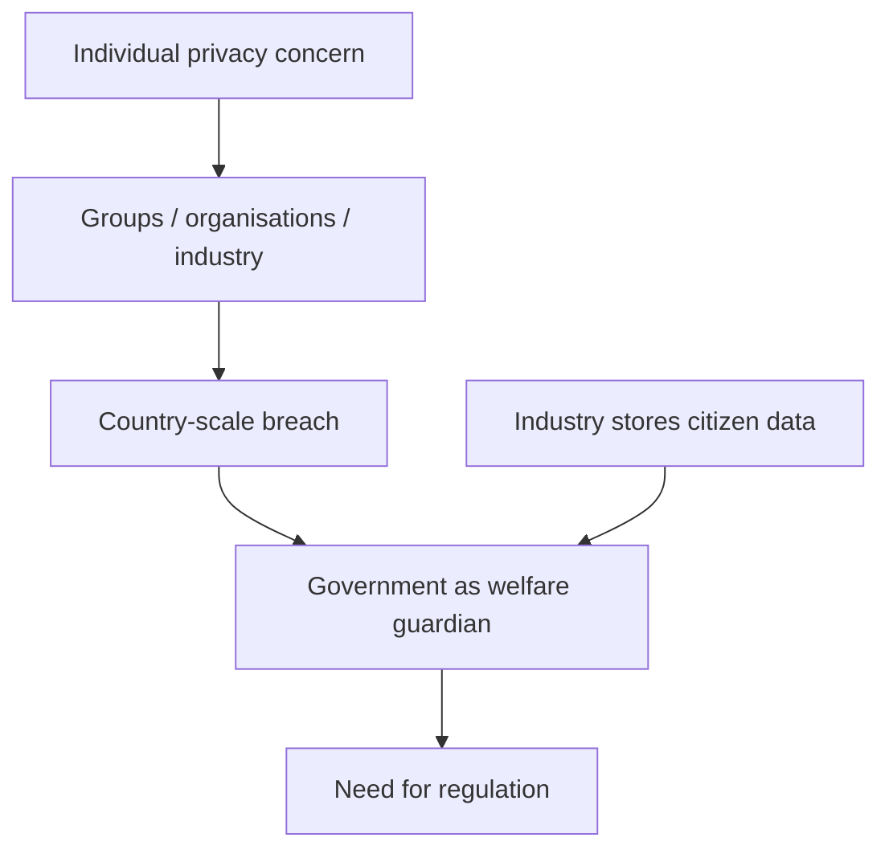

### Hotel California and lock-in
The instructor opens with the Eagles song *Hotel California*: “you can check out anytime you like but you can never leave.” In management literature that is **lock-in**. You enter a product or service and cannot leave because **switching cost** is inhibitive. Preferred banks, Amazon, mobile operators, operating systems, and social-media graphs all work this way. Lock-in is built into digital-platform strategy: large participation is how the platform is built, and the platform does not want to let you go because connections are strong.

In the digital world people thought they could sign out anytime; they cannot. Disclosed information and connections are effectively forever. One choice is not to go there — to stay **anonymous**. The instructor’s German IS collaborator uses neither WhatsApp nor any social-media account. You can opt out of email and even cell phones; people lived that way for decades. Those “necessities” are created for you. Whether you share data for a service, or give Google a search key, is your choice. Once you do, the search is linked to you and becomes part of your profile.

The cartoon line the instructor likes: “I like privacy but it makes it difficult to enjoy life.” You can still be alive but not “have a life” as businesses define it. Shrewd entrepreneurs have thought through needs and built exchanges around them.

### Unfair privacy agreements and immediate gratification
Yesterday’s matrimonial-site example returns. Users click “I agree” on a long privacy statement they do not read. The Shaadi-style fine print, as read in class: with respect to content submitted on publicly accessible areas of the site, including contact details, the user **unconditionally and irrevocably** grants Shaadi the licence to use, distribute, reproduce, modify, adapt, publicly perform and publicly display that content. It is a **perpetual** agreement. You did not pay them money. The exchange is data for service.

Gmail is “free,” but in business there is no free lunch. These are **non-monetary exchanges** on digital platforms. That is why it is hard to win a data-exchange case in court: you legally agreed, and they have evidence. The other side is design: the legal document is long; you have a need to gratify. Economists call this **immediate gratification**. You are in a hurry, a friend has the service, you click. Platforms exploit that. Luca and Bazerman (Harvard Business School; book on online experiments) report a fact the instructor highlights: it takes **76 working days** to read and understand a typical privacy policy. Even if you read some of it, it is legal language you are not trained to parse. If you want the service, you agree. It is **by design**. Privacy agreements are one-sided. Regulation is trying to accept that this is not fair play. GDPR, later in the course, tries to address this **unfair exchange of information**.

The same scholars report that when you sign into Facebook you are a participant in online experiments almost every day — which profiles you dwell on, which ads you respond to. Research involving human subjects is supposed to take **informed consent**. Platforms do not. They also have legal cover: telling you it is an experiment can defeat the experiment.

### Fairness vs the need to socialise
On the user side, regulation is absent or still evolving, and it favours corporations that exploit desires through platforms. There is a fairness question. On the other side, very few people actually want to be let alone. Privacy is the **right to be let alone**, but people do not want to be let alone; they want others to know about them. That is a social need. Social life has moved from physical to virtual, but the need is human. People make **selective disclosure** — a Facebook profile is an impression or a statement about the self you want to be. Platforms are designed to fulfil that desire, and in that desire you disclose a lot.

### Loyalty programs: bribed to share
In stores, physical or online, loyalty no longer needs a card; a **cell phone number** is the primary key. Retailers insist on it; it is not mandatory. The instructor stops sharing (“I do not have a phone number”) and can still buy. Once the number is shared, they track what you buy: behaviour and preferences become a profile. With a loyalty program (his example: Titan), points, discounts, and money-back come with disclosure — sometimes Aadhaar, phone, descriptive data. Nobody compels you. You sign in for benefits. The cost is monitoring. “You get **bribed** to share your data”: the discount is a small remuneration for letting them know you. One use is targeted service and product recommendation. The other is that **data has monetary value** and can be sold. Many US retailers, the instructor has read, make **more money from data than from their products**. People agree because they need the service. They raise privacy concerns only when they are affected by the trade of data.

### Privacy paradox
This is the **privacy paradox**. People want both: the best free Gmail experience *and* privacy, which obviously cannot happen. Gmail shares what you write with advertisers. An individual may not read your mail, but the **text is scanned**. You want service; they make money with your data. It is a designed exchange. It is conflicting to claim privacy while getting something that is paid for with your data.

Personal experience and privacy are conflicting needs. You want the best personal experience in online services and you also want privacy, which is not possible: “if you have to take something from the top, you raise your hand, something falls off.” Can the paradox be resolved? That is a difficult question. Sharing identity buys privileges; the decision is yours. What is worse is **government**: as a citizen there are **mandatory disclosures**. Government’s view is that to secure you in a country, it needs to know you. You cannot completely hide yourself anywhere in the world.

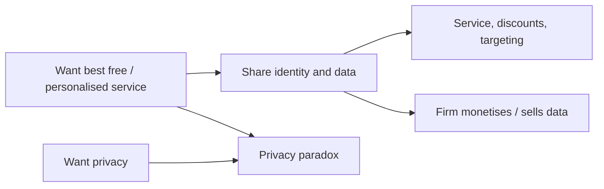

### Derek Smith, ChoicePoint, and the right to anonymity
Derek Smith, CEO of ChoicePoint, said this when his company — a credit bureau whose breach in **2005** put privacy into public debate and policy — was under fire. Today’s case is a similar 2017 credit-bureau story. Critics said the industry that collects, processes, profiles and sells individual information for credentialing is illegitimate because it cannot protect the data, and that identities should be kept anonymous. Smith’s response, as taught here:

> You have a right to privacy but in this society we can have a right to anonymity.

**Right to privacy** and **right to anonymity** are two different things. You have a right to privacy, but you cannot be anonymous on the planet. You have to belong to some country. Territory is how humanity is organised (the instructor’s colonial aside: the British tried to make most of the world theirs; you still belonged to a colony). To be affiliated and to enjoy the privileges of a country or an organisation, you have to say who you are. Some basic information needs to be with the government. That is the side we fail to see.

### Personal data, PII, and quasi-identifiers
Before privacy / anonymity / secrecy are defined in the next lecture, the class needs **personal data** and **personally identifiable information (PII)**.

**Personal data** is any data related to you that is yours: name, age, place of birth, address, cell phone.

**Personally identifiable data** is data able to **uniquely identify**. Not all attributes uniquely identify (as in databases). Name is not a unique identifier. Combine attributes and they can become one. Identifiers that are not uniquely identifying by themselves are **quasi-identifiers**. Name is a quasi-identifier; add age and address and linking can almost distinctly identify you. There are algorithms that identify people from disclosed data by linking. Email and cell phone are very much identifiable. Data points that have the potential to uniquely identify you, or partly identify you, are identifiable data. More PII concepts come with GDPR.

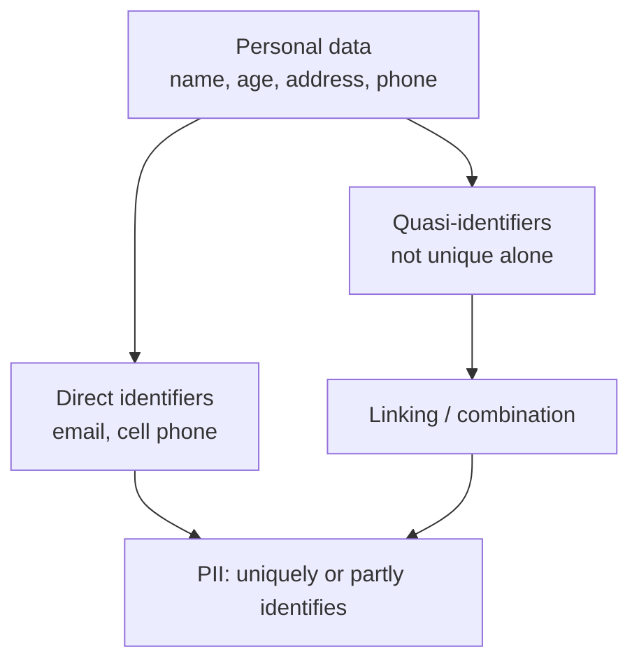

## Cases and examples from the lecture
- *Hotel California* as the lock-in metaphor; Amazon, banks, mobile operators, OS, Facebook.
- German colleague with no WhatsApp and no social-media accounts — choosing anonymity by opting out.
- Shaadi.com perpetual, irrevocable content licence on click-wrap “I agree.”
- Luca and Bazerman: **76 working days** to read a typical privacy policy; Facebook as daily unconsented experiment.
- Titan loyalty / phone number as primary key; US retailers earning more from data than merchandise.
- Gmail “free” mail scanned for advertising.
- ChoicePoint 2005 (Derek Smith) as predecessor to the 2017 credit-bureau case.

## Key terms
| Term | Meaning in this lecture |
|------|-------------------------|
| Lock-in | Enter a product/service and cannot leave; switching cost prohibits exit. Built into platform strategy. |
| Switching cost | Cost of moving to another product or service; when high, you stay. |
| Immediate gratification | Economist’s name for rushing to the service and clicking agree without reading. |
| Non-monetary exchange | You pay with data, not money; still an exchange (no free lunch). |
| Right to be let alone | Classic privacy formula — which most people do not actually want, because they want to socialise. |
| Selective disclosure | Choosing what a profile shows in order to make an impression. |
| Privacy paradox | Wanting both the best personalised/free service and privacy; the two conflict. |
| Right to privacy vs anonymity | Privacy is not invisibility; Smith: you cannot have a right to anonymity in this society. |
| Personal data | Any data that is yours and related to you. |
| PII / identifiable data | Attributes that uniquely or partly identify you. |
| Quasi-identifier | Not unique alone (e.g. name); combining several can identify. |

## Formulas / frameworks (if any)
- **Regulation warrant:** individual concern → collective/pervasive breach → citizen-data held by industry → government welfare role → regulate.
- **Unfair consent stack:** lock-in + unread legal text + immediate gratification + one-sided click-wrap → need for regulation (GDPR later).
- **PII construction:** quasi-identifiers + linking ≈ identification.

## Distinctions the instructor insists on
- Cybersecurity and information privacy share concepts, but privacy concern is its own domain — how well you address it is the privacy problem.
- Lock-in is not mere preference; it is a designed platform strategy (Hotel California).
- “Free” digital service is not free; it is a non-monetary data exchange, which is why court challenges fail once you clicked agree.
- Privacy agreements are one-sided **by design**; fairness, not just individual carelessness, is the regulatory issue.
- Very few people want to be let alone; the social need and selective disclosure are why platforms harvest so much.
- You raise privacy concerns when the **trade of data affects you**, not when you take the discount — that is the paradox.
- **Right to privacy ≠ right to anonymity.** You cannot be anonymous on the planet and still claim the privileges of a state.
- Name is personal data and a quasi-identifier; it is not, by itself, a unique identifier.

## Exam-oriented recap
- Regulation is needed because breaches are pervasive, organisations store citizen data, and government’s job is welfare.
- Platforms lock users in; privacy policies take ~76 working days to understand; click-wrap is not fair play.
- Privacy paradox: personalised experience vs privacy; both are wanted, both cannot be fully had.
- Mandatory state disclosure is the harder case of the same tension.
- ChoicePoint/Smith: privacy yes, anonymity no.
- Personal data vs PII vs quasi-identifiers; linking can finish the identification GDPR will later regulate.

---

# Lecture T31: Privacy Regulation — Part 02

**Playlist index:** 31  
**Transcript:** [31-privacy-regulation-part-02.md](../transcripts/markdown/31-privacy-regulation-part-02.md)  
**Video:** https://www.youtube.com/watch?v=nBr733H_xH4  
**Week / theme:** Privacy regulation — anonymity, secrecy, confidentiality, k-anonymity, risk–utility, the regulatory landscape

## Learning objectives
- Separate **anonymity, secrecy, confidentiality, transparency, privacy, and security**, which the instructor says are often confused.
- Place total anonymity, **pseudo-anonymity**, and identifiability on one scale, including Aadhaar’s pseudo identifier.
- Apply three privacy-preserving data-mining techniques: **randomization, anonymization, encryption**.
- State **k-anonymity** (Sweeney), and distinguish **suppression** from **generalization**.
- Use the **risk–utility (R–U) map** as the analytics trade-off that regulation must govern.
- Contrast US sectoral law, FIPPs/OECD principles, the EU **directive**, and the 2018 EU **regulation**.

## What this lecture actually teaches

### Related concepts, from the instructor’s research paper
Anonymity, secrecy, confidentiality, and security get mixed. Definitions used here come from the instructor’s research paper.

**Anonymity** is the ability to conceal a person’s identity. Individuals can choose to be **totally anonymous**, **pseudo-anonymous**, or **identifiable**.

Recent discussion: sharing Aadhaar number with business entities. If you share the Aadhaar number directly, business can misuse it or use it as identification (e.g. a cell-phone service profiling you). Aadhaar’s response is a **pseudo identifier** — a number that is not the Aadhaar number, issued by Aadhaar. Aadhaar can link that number to your number; a business entity cannot. That is **pseudo-anonymity**, not pure anonymity, because **an agency can reconstruct your identity**. Hiding personally identifiable information is anonymization / anonymity.

Classroom example: analysing how well a class is doing. Students refuse identity. Grades can be released numbered 1, 2, 3… without name, roll number, or email. **Grade is not personally identifiable data**; it is a fact / a measure (as in a fact table). You can give the measure and anonymize the person. When a company must share individual data for mining or outsourced analytics, anonymizing to protect identity matters. There are anonymization techniques (next slides).

**Secrecy** is **intentional concealment of information**: you not only want to be anonymous, you do not want to disclose anything, and you can **mislead** people.

Confidentiality and security sit on the 2×2 below. **Confidentiality is typically used in the organisational context; privacy is typically used at the individual level**, generally in the literature.

### Four quadrants: accuracy × amount shared
X-axis: **accuracy of personal information**. Y-axis: **amount of personal information externalized or shared**.

| | Low amount shared | High amount shared |
|---|-------------------|--------------------|
| **High accuracy** | **Confidentiality** — share little, but when you share you share complete information **with identity** | **Transparency** — almost full information, accurately (public institutions “should be transparent”) |
| **Low accuracy** | **Secrecy** — share little volume, and what is shared may be incorrect or misleading | **Anonymity** — share a lot of facts (e.g. all grades) that **cannot be accurately linked** to you |

Transparency is the fourth quadrant: high accuracy and high amount — “100 percent transparent.” The opposite is secrecy (countries; personal secrets; hide or mislead). Anonymity is the first quadrant: accuracy of personal information is low, but you may share a lot. Confidentiality is the other way: extent of sharing is limited, but the share is complete and identified.

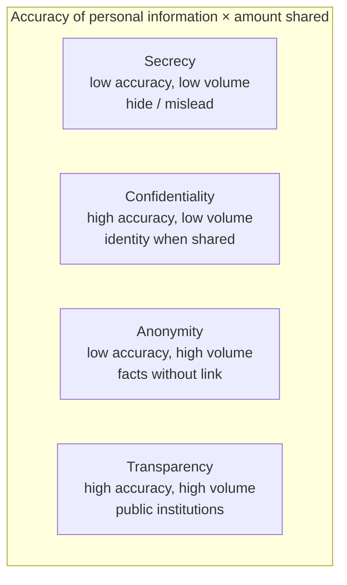

### Incognito browsing is not anonymity
Browsers offer “incognito,” “private browsing,” each with its own term. Does it ensure anonymity? The **service provider still knows**. What it does not keep is history on the **local machine**: no history, no stored passwords, no local record after you exit. It is anonymity **to some extent**, when some users want it — not against the site or the provider.

### Privacy-preserving data mining — three techniques
Companies store large personal data. If it is shared with an external entity, or analytics is **outsourced**, it goes to a **data processor**. To protect individuals, hide identity from external providers when the collector/owner is privacy-conscious. Sharing can be totally anonymous, pseudo-anonymous, or identifiable (full information).

Three main techniques:

1. **Randomization**
2. **Anonymization**
3. **Encryption**

**Randomization:** before sending data to the processor, randomize it. If \(x_i\) is the value of a sensitive attribute, add a random term \(e_i\), noise drawn from some distribution. The processor does not receive the same data; it may receive distributional properties, not exact values.

Anonymization is the technique the class spends time on.

### k-anonymity (Sweeney)
Taken from a paper by **Sweeney** (Harvard). Definition, to be looked at carefully — like k-means, there is **k-anonymity**:

> Each release of data must be such that every combination of values of quasi-identifiers can be indistinctly matched to **at least k individuals**.

\(k\) is a value. Roll number uniquely identifies (distinct). Place of birth “Maharashtra” + birth year 1999: if only one such person, you are unique; if two, **k becomes 2**. Blur further to “Maharashtra” only, eight people in a large class — still some identification, anonymized to extent \(k\). **\(k\) is the extent of anonymization.**

Two techniques in k-anonymization:

| Technique | What the lecture shows |
|-----------|------------------------|
| **Suppression** | A column is **completely removed**. Table 2 has no name column. Potential to identify uniquely or closely → drop the column. |
| **Generalization** | Coarsen a value. Birth column: date and month removed, **year only**. Zip code: last digit removed — disclosed, but part removed. |

The instructor slips “separation and generalization,” then corrects: **suppression and generalization**.

Analytics still needs some individual characteristics, so the release tries to share “born in this year” without full date of birth. Generalization strikes a balance between analytic value and identifiability.

**Alice example (the two tables).** Table 1: Alice, race not disclosed, date of birth, sex, zip — together a unique record; the sensitive **measure** is disease = flu. Table 2: first two records share the same identifiable tuple (blank, 1965, M, 0214). Flu can be attributed to record 1 **or** 2. Indistinctly mapped to two people: **k = 2**. Purpose of anonymization: remove unique identification of a fact with an individual.

**Aadhaar / credit-card last 4 digits.** Wallet shows last 4 of Aadhaar or card (e.g. 6709). Is that suppression or generalization? Class gets it wrong if they say suppression. Suppression **removes a column as it is**. Zip and year-of-birth are generalization: you disclose, but remove part. Last-4 is **generalization**.

### Linking — the limitation
Quasi-identifiers plus more collected data can link multiple records and uniquely identify. That is **linking**. Analytics does this; there are algorithms for reverse-tracking identity after anonymization, especially in medical and government contexts. From anonymity you link more data and create identity.

### Risk versus utility — R–U maps
Last-but-one slide: **risk versus utility of data**, R–U maps. Privacy risk / **disclosure risk** is very low when disclosure is less, and goes up when you fully disclose (privacy very low). Utility / analytics insights are then very high. If you anonymize, **value of analytics suffers**: you cannot profile customers or recommend products; individual personalisation is not possible. Operate in the middle so analytics is not completely diluted and privacy is still protected. Generalization is that middle: some identity remains, not complete.

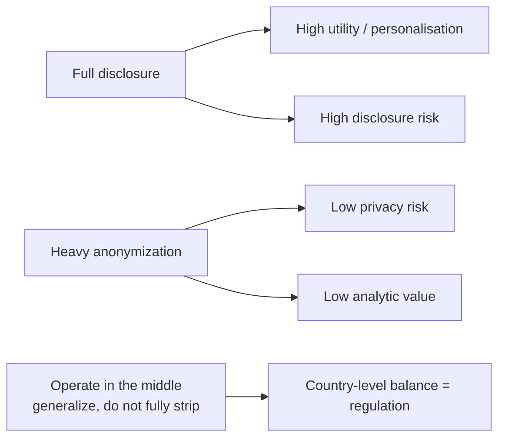

### Why this becomes regulation
Given individuals’ and organisations’ privacy concern, and organisations’ need to deliver services, the balance must be done at **country / governance** level. That is **regulation**. Privacy regulations are still emerging.

- **FIPPs** (Fair Information Practice Principles) in the United States were discussed yesterday. **Guiding principles, not a regulation.** OECD regulations / principles in the same family.
- European Union: **no regulation till 2018**. It was a **directive** — EU data protection directive — **not a law**. **Regulation means it is enforceable by law.** In 2018 the directive’s **D was replaced by R**: it became a regulation.
- The world is changing because of huge digital storage and flow; regulating data has become a necessity.
- **United States:** no one regulation binding or overarching for all personal-data exchanges. **Domain-specific** rules, e.g. **HIPAA** for healthcare. Guidelines and regulations vary **state to state**; states can have their own laws — another dimension of complexity.
- **GDPR** is very broad-based; most countries, including India, and some US states try to emulate it. Next sessions: GDPR, then the Indian context, with cases.
- Today’s case is from the US because the class is focusing on America; the case also shows **limitations because there is no country-wide regulation**.

## Cases and examples from the lecture
- Aadhaar pseudo identifier vs raw Aadhaar number shared with a telco.
- Class grades released as 1…n with names stripped — measure without identity.
- Incognito / private browsing: local machine vs service provider.
- Live k-anonymity drill: Maharashtra + birth year 1999; k = 1 vs k = 2 vs k = 8.
- Sweeney-style tables: Alice, flu, suppression of name, generalization of DOB and zip; k = 2 on the first two rows.
- Last-4 Aadhaar / credit card as generalization, not suppression.
- HIPAA; FIPPs vs GDPR-as-regulation.

## Key terms
| Term | Meaning in this lecture |
|------|-------------------------|
| Anonymity | Ability to conceal identity; share facts that cannot be accurately linked to you. |
| Pseudo-anonymity | Substitute ID (Aadhaar-issued) that an agency can map back; business cannot. Not pure anonymity. |
| Secrecy | Intentional concealment; may mislead; low volume and low accuracy. |
| Confidentiality | Limited sharing; when shared, complete and identified. Organisational word. |
| Privacy | Typically the individual-level counterpart of confidentiality. |
| Transparency | High accuracy and high volume shared (public institutions). |
| Randomization | Share \(x_i + e_i\), not \(x_i\); processor sees noise / distribution, not exact values. |
| k-anonymity | Every quasi-identifier combination matches at least k people. |
| Suppression | Remove a column entirely. |
| Generalization | Coarsen (year not full DOB; truncated zip; last-4 of Aadhaar). |
| Linking | Re-identify anonymized records by joining more data. |
| R–U map | Trade-off of disclosure **risk** vs data **utility**. |
| Directive vs regulation | EU pre-2018 D = not enforceable as such; 2018 R = law. |
| FIPPs | US Fair Information Practice Principles — principles, not a statute. |

## Formulas / frameworks (if any)
- **Randomization:** processor receives \(x_i + e_i\), \(e_i\) random noise from some distribution.
- **k-anonymity:** each released quasi-identifier tuple is indistinctly matched to ≥ k individuals; k is the extent of anonymization.
- **2×2:** accuracy × amount shared → secrecy / anonymity / confidentiality / transparency.
- **R–U:** more disclosure → more risk and more utility; regulation is choosing the operating point for a country.

## Distinctions the instructor insists on
- Pseudo-anonymity is **not** pure anonymity: Aadhaar (or another agency) can reconstruct.
- Grade / a fact-table **measure** is not PII; name, roll, email are.
- Confidentiality ≠ privacy (organisation vs individual, in the literature used here).
- Secrecy is not anonymity: secrecy can be inaccurate and misleading; anonymity can share a lot of true facts without a link.
- Incognito hides the **local machine**, not the service provider.
- Suppression is dropping a column; showing last-4 digits is **generalization**.
- FIPPs and the old EU instrument are **not** regulations; HIPAA is domain-specific; the US has **no omnibus** personal-data law; GDPR is the broad template.

## Exam-oriented recap
- Four-quadrant map is the clean way to keep secrecy, anonymity, confidentiality, and transparency apart.
- PPDM: randomize, anonymize, or encrypt before a processor sees data.
- k-anonymity + suppression + generalization; linking is why they are not enough.
- Last-4 Aadhaar is generalization.
- R–U: personalisation needs identity; privacy needs blur; regulation governs the middle.
- 2018: EU directive becomes regulation. US remains sectoral and state-wise — which the Equifax case will show as a limitation.

---

# Lecture T32: Privacy Regulation — Part 03

**Playlist index:** 32  
**Transcript:** [32-privacy-regulation-part-03.md](../transcripts/markdown/32-privacy-regulation-part-03.md)  
**Video:** https://www.youtube.com/watch?v=IKPp1yc0dnk  
**Week / theme:** Privacy regulation — Equifax 2017 as governance failure and as the argument for mandatory breach notification

## Learning objectives
- Reconstruct the **Equifax 2017** breach: business model, unpatched **Apache Struts**, stolen PII, delayed disclosure.
- List privacy harms of a credit-bureau leak (identity theft, loan fraud, targeting, Aadhaar-scale analog in India).
- Separate **technical** failures (patch, SSL, logs, ACIS) from **governance** failures (CLO over CSO, board silence on public cyber ratings).
- Follow the class debate: **negligence vs unlucky**, then the instructor’s question — where is the **major** problem?
- State why **breach-notification timelines** (US patchwork vs later GDPR **72 hours**) are the regulatory lesson.

## What this lecture actually teaches

This session is Group 2’s Equifax case, then instructor-moderated Q&A. Cybersecurity and information privacy meet in one firm that lives on personal data.

### What Equifax is
Founded **1899**; US-based credit reporting, customers worldwide. Collects income, employment, and related data; produces creditworthiness / ratings. Indian analog: **CIBIL**. Slogan taught in class: “Powering the world with knowledge.” About **90% gross margin**; ~**820 million** consumers and **91 million** businesses.

Three segments:

| Segment | What it does |
|---------|----------------|
| **US Information Services** | Collects customer data; online information, mortgage services; revenue from selling customer and commercial credit reports. |
| **Workforce Solutions** | Uses that data for employment and income history; unemployment claims, employment tax credits. |
| **Global Consumer Solutions** | Credit monitoring and identity-threat protection. |

### Security theatre vs reality
Information-extensive, so cybersecurity is crucial. Invested millions from **2005**; **over 1% of operating revenue** on cybersecurity each year **2014–2017**. A cybersecurity expert as **CSO**, charged with modernising defences; a **crisis-management squad** that rehearses breaches.

Two command chains:

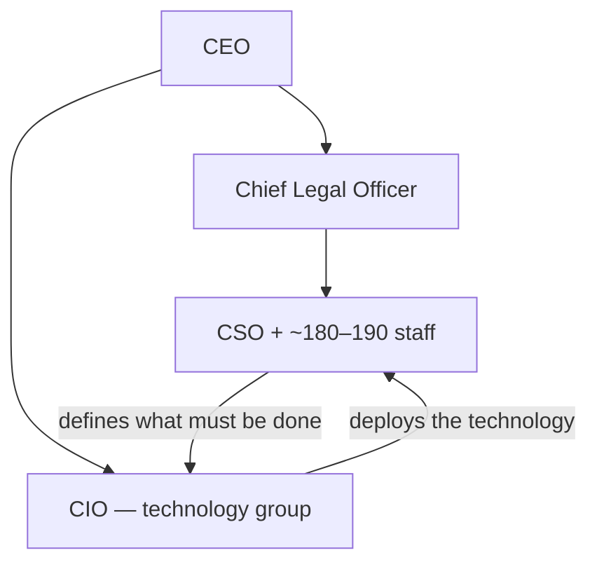

Security **defines what has to be done**; technology **deploys** it. Security engineering configures software.

Named teams:

- **GTVM** — Global Threat and Vulnerability Management: tracks IT threats; monthly meetings on possible cyber threats.
- **VAT** — Vulnerability Assessment Team: runs scans.
- **Countermeasures** — deploys code to obstruct exploitation of vulnerabilities GTVM and VAT identify.

They still had a massive 2017 breach.

### What a credit-bureau leak does to a person
Class answers, which the teaching keeps: ransom; tracking; health/credit expenses used for financial, insurance, and banking threats; **identity theft**; someone with a good score takes a loan in your name and does not repay — you are left indebted; **targeted ads**. In the Indian analog, Experian / Equifax / TransUnion / CIBIL-style pages take **Aadhaar, passport, driving licence** — a grave risk if leaked.

### Red flags before 2017
It did not start in 2017.

- **2013:** hackers could access credit-report data.
- **2015:** software-modification error publicly exposed consumer information.
- **2016:** ~**431,000** employees’ salary and tax data publicly exposed; independent researchers flagged it.
- **2017 (before the big breach):** Equifax Workforce Solutions — employee tax documents freely downloaded by attackers.

Known, not unknown. **Mandiant** warned systems were **unpatched and misconfigured**. **Deloitte** security audit: several unpatched-system issues. **Cyence** quantified breach probability at about **50%**. **FICO** (Fair Isaac) corporate cyber risk **550** on a **300–850** range. **BigSight**: **F** for application security, **D** for software patching. **MSCI**: **0** for privacy; almost lowest **CCC** for privacy and data security.

### Apache Struts and the 2017 timeline
Cause: **Apache Struts** vulnerability. Open-source software for Java applications, widely used in banks and financial institutions. Apache published that a **public exploit** existed: attackers could add their own code to web pages, disable firewalls, install malware, access servers.

**US-CERT** (Department of Homeland Security) alerted vulnerable parties, including Equifax. GTVM got the message. Most monthly meetings were **not even attended** by senior officials or Equifax cybersecurity members. They did not take it seriously. Countermeasures **delayed**. Slide timeline: **7 March** Apache discloses; Equifax takes on the order of **five months** to take corrective action — that is when they come to know about the breach. Class later: CERT said patch within **48 hours**; they did not.

Garbled student chronology, teaching beats that survive:

- ~**8 March:** Cisco and others alert on Struts.
- Fail to patch.
- ~**11 March:** hackers gain access.
- Fail to identify the unpatched hole → PII collection.
- They track some attacker IPs, block one, cannot block multiples; shut systems; law firm and **FBI**.
- **31 July:** CIO informed.
- Smith notifies teams by phone; board meeting; **143 million** consumers affected; public announcement.
- CSO and CIO resign; CEO also resigns.
- Additional **2.5 million** not confirmed at first.
- CEO testifies before US government committees.
- ~**10 million** driver’s licences; ~**700,000** UK customers; IRS contract suspended.

How it actually ran once inside: ~**30 backdoors** using **web shells** Equifax failed to notice, making the open door harder to find. **SSL certificates** should renew every **12–39 months**; Equifax ran **expired** certificates across the network. ACIS blocked an IP; portal stayed open; patch did not hold; attackers (class: from China) returned; **11-day** shutdown.

Stolen fields taught: names, **Social Security numbers**, birth dates, addresses, email, driver’s licence, credit-card numbers, passport numbers, tax IDs, credit-card **dispute documents**.

```mermaid
sequenceDiagram
    participant Apache
    participant CERT as US-CERT
    participant EQ as Equifax GTVM
    participant H as Attackers
    participant Pub as Public
    Apache->>CERT: Struts exploit public (~Mar)
    CERT->>EQ: Alert; patch in hours not months
    Note over EQ: Meetings poorly attended; no patch
    H->>EQ: Access ~11 Mar; 30 web-shell backdoors
    EQ->>EQ: Expired SSL; old ACIS; short logs
    EQ->>EQ: CIO told 31 Jul
    EQ->>Pub: Announce ~Sep: 143M (six-week gap after discovery)
```

### Internal sources of vulnerability
**Patch management.** Roles of **business owner, software owner, and system owner** were ambiguous. **2015 Deloitte audit: ~8,500 unpatched vulnerabilities**; still unresolved into 2017. No comprehensive **IT inventory**. CSO Payne and secretary **unaware ACS ran Apache Struts**. From 2015, patching was **reactive** (when a system went down / on request), not proactive.

Employee reasons: technology **not well integrated**, hard to update; **antiquated** systems and operational risk (Windows-update analogy: you must shut down to patch); not enough people to implement processes that meet internal security goals.

**Accountability gap.** Until 2005, CSO reported to CIO and to CEO. After an **interpersonal conflict (2005)**, CSO and CIO reported **independently to the CEO**. No clear communication. IT and security interaction mainly at monthly / senior meetings. Failed to identify clear lines of accountability for developing and executing IT policy. Security concerns presented by the **CLO**; neither CSO nor CIO had authority to present them. The CLO had **neither experience nor training** in cybersecurity.

**Technological barrier to oversight.** Failed to see malicious activity. **ACIS** described as 1970s-era, not updated. Lacked **file-integrity monitoring**: cannot scan for unauthorised access or suspicious events. **NIST:** log data about **3 months**; Equifax cleared logs within **30 days** — cannot reconstruct past breaches. No process to keep SSL current. January 2017 internal audit: SSL devices missing; unaddressed. **324 expired SSL certificates**, **79** in a critical business domain. Certificates grouped together; **no business segmentation** — once in, hackers moved.

### Announcement and response
Public PR in **September 2017**; breach traffic from **March**. Announced **143 million** Americans exposed; website to check whether you were hit; Mandiant engaged. Free for one year: credit-file monitoring, Equifax credit lock, identity-theft insurance, dark-web scanning — customers had to sign a **controversial clause that they will not sue Equifax**. Stock **$143 → $93 in a week (−35%)**.

Missteps taught: the no-sue clause angered customers; they **started charging for credit freezes**; identity protection only one year then pay; **delayed** announcement; Equifax **Twitter directed customers to a fake website** someone else had started.

11-member board, 9 with 3-year tenure. Only credit-reporting company with a **separate technology committee** (5 members) reviewing technology investment and information-security policy — and the breach still happened.

### Fallout
Stock −35%; **CSO, CIO, CEO, and chairman** resigned. Consideration of **clawing back** compensation, including the CEO’s. Plan to bring director **McGregor** (cyber / information-security experience). Lawsuits and inquiries: **New York Attorney General**, **FTC**. **Freedom from Equifax Exploitation Act**: enhance fraud-alert procedures; **free access to credit freezes**.

Shareholder activism: **Change to Win** (investment advisor / activism group) — **six proposals**, or they would not support re-election of McGregor. Four named in class:

1. Improve governance and hold executives accountable.
2. Remove chairs of **audit and technology** committees.
3. Permanently **separate CEO and chairman**.
4. Consider **legal settlements** when setting executive compensation.

### Breach notification — the regulatory hole
About a **six-week gap** between discovery and public disclosure. **US did not have a proper regulation for disclosure**: one source said **45 days**, others had **no guidelines**. Proposal of a bill for a **unified 30-day** consumer-alert window. New York AG: **72 hours** to **state regulators**.

Scale: **143 million** records vs **254 million** US adults in 2017 — almost half. Profit **−27%**; **$90 million** breach-related cost; **240** customer lawsuits; many separate investigations. Not unique: **3,785** US corporates victims in 2017; Cisco: **55%** of surveyed companies had a breach; large-caps lost ~**$500 million** market cap on average for major attacks that year.

### Debate the instructor insists you have: negligent or unlucky?
Students, majority: **pure negligence** — outdated services, Twitter to a fake site, patches not in, expired certificates that could not detect exfil packets, security issues not reaching the CEO, legal officer without security background, **CSO exits around 2013** as a red flag, CERT 48-hour patch ignored, no log of who attended meetings. Even if an attack still happened, **segmenting the database** could have minimised impact. After the incident: delayed disclosure, charging for freezes — **gross negligence after the fact**, not “unlucky.” Equifax is not ordinary: it hosts about **half of USA’s** information, so likelihood of attack is higher and the duty to defend is higher. Should be treated like **critical infrastructure** (Indian analog: CII-designated organisations). Trust and faith of customers were not honoured.

Instructor’s **counter (to force post-hoc humility):** Equifax is **not a technology company**; its business is **data** — customers are suppliers and customers. Several **acquisitions** bring poorly integrated, outdated tech. Organisations live with old and new systems; upgrades take time. There was a defined CSO and CIO structure, imperfectly functioning. Finding fault is easy **post hoc** with a documented case. He would “just side with Equifax, well they were unlucky” — then invites the opposite.

Then the real exam question: assuming they could have done better, **where lies the major problem?** Failures run from **country-level regulation** to **board, CEO, managers, employees**. Pick one or two things that really caused it.

Class: **governance** — roles unclear after restructure; CLO reports information security without experience, so criticality is not heard. Instructor: two command centres coordinated at CEO is a structure; **board does not run day-to-day**. Did the board have information it should have acted on? Yes: **2015 audit, 8,500 unpatched**, still open two years later; audit **widely shared with board members**; DHS told vulnerable parties to address immediately; no counter-check that employees patched; **April GTVM meeting did not even re-address** the March issue.

Instructor’s striking governance failures:

1. **Directors / board did not even react** to public **security scores** (MSCI CCC etc.). Independent directors exist to **ask questions**: why is the rating so low?
2. **Management was not functioning effectively.**

For large organisations, cybersecurity is something the **board must monitor**. Technology failure → massive loss, reputation, stock. **If structures are not in place, the system will respond accordingly.**

Closing teaching line: cybersecurity is **not just a technical issue but a corporate governance issue**. It also touches **need for regulation** — how many days to report. If reported early, an individual can **stop cards** and tell the bank. If not informed, the loss is the individual’s. There should be **clear government regulation**. That is how **GDPR** is different: it makes notification **mandatory** for EU countries.

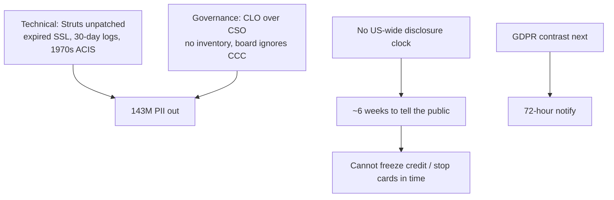

## Cases and examples from the lecture
- Equifax as CIBIL analog; 90% margin on other people’s data.
- Pre-2017 leaks (2013, 2015, 2016, Workforce Solutions W-2s).
- External scores: Mandiant, Deloitte, Cyence 50%, FICO 550, BigSight F/D, MSCI 0 / CCC.
- Apache Struts + 30 web shells + expired SSL.
- Forced arbitration / “will not sue”; fake Twitter site; charging for freezes.
- Freedom from Equifax Exploitation Act; Change to Win six proposals.
- 3,785 other US victims in 2017 — still does not make Equifax “ordinary.”
- Indian CII comparison: this class of firm should have been treated as critical.

## Key terms
| Term | Meaning in this lecture |
|------|-------------------------|
| GTVM / VAT / Countermeasures | Equifax threat-tracking, scanning, and blocking functions that still failed. |
| Apache Struts | Open-source Java web framework; public exploit was the entry. |
| Web shell / backdoor | ~30 persistence paths Equifax did not see. |
| ACIS | Old (class: 1970s) control that blocked one IP and could not see the rest. |
| File-integrity monitoring | Missing control: scan for unauthorised access / suspicious events. |
| Credit freeze | Lock the file so new credit cannot be opened — Equifax charged for it after the breach. |
| Clawback | Recovering executive pay after failure. |
| Breach notification | Duty to tell people and regulators in a fixed time so they can act. |
| CCC / FICO cyber | Public cyber ratings the board could have interrogated and did not. |

## Formulas / frameworks (if any)
- **Two-chain model:** security says what; technology deploys; CEO must actually integrate them.
- **Notification comparison taught here:** US mix of 45 days / none → proposed **30-day** consumer notice; NY **72 hours** to regulators; GDPR (preview) **72 hours**.
- **Governance test:** did the board have independent, public evidence (audit, MSCI, CERT) and fail to ask?

## Distinctions the instructor insists on
- Investment and a CSO on the org chart ≠ security. Equifax spent >1% of revenue and still failed.
- **Post-hoc** blame is easy; still, the **major** documented failure is **corporate governance**, not “Equifax was unlucky.”
- Board fault is not micromanaging patches; it is **not reacting to information it had** (2015 audit, public CCC).
- CLO presenting cyber without cyber competence is a structural, not a personality, problem.
- Cybersecurity at this scale is **enterprise risk / governance**, not only IT.
- Delayed disclosure is not a PR issue only: without a legal clock, **the individual cannot freeze credit**. That is why regulation must specify days.
- Equifax is a **data business** and a **high-value target**; “attacks happen every day” is not an excuse.

## Exam-oriented recap
- Vector: unpatched Apache Struts after a public CERT alert; persistence via web shells; expired SSL; 8,500 leftover vulns.
- 143 million Americans (~half of adults); SSN-level PII.
- Disclosure ~six weeks after discovery; no US-wide rule.
- Root cause the class is meant to leave with: **governance** (board + split IT/security under a non-expert CLO) plus **no mandatory notification**.
- Bridge to Europe: GDPR puts the 72-hour clock and processor/controller accountability into law.

---

# Lecture T38: GDPR — Part 01

**Playlist index:** 38  
**Transcript:** [38-privacy-regulation-in-europe-part-01.md](../transcripts/markdown/38-privacy-regulation-in-europe-part-01.md)  
**Video:** https://www.youtube.com/watch?v=qtTFHNVUDBg  
**Week / theme:** Privacy regulation in Europe — why GDPR exists; principles, legal bases, roles, rights, DPD → GDPR

## Learning objectives
- Restate the **need for regulation** as a fair balance among data collectors, processors, and individuals.
- Contrast US **sectoral / toothless** law (Equifax notification gap, no set penalty) with the EU move from **1995 DPD** to **GDPR 2018**.
- Define GDPR **personal data** (direct and in-conjunction identifiers).
- List the **six principles**, **six legal bases**, **controller / processor / DPO** roles, and **data-subject rights**.
- State the fine: **€20 million or 4% of global annual revenue, whichever is higher**, and 72-hour breach notice.

## What this lecture actually teaches

### Why regulation, before Europe
Eleventh session. Data privacy is a basic need: protect private data from exploitation. It is not only the individual. Collectors, storers, and processors have **conflicting objectives**: business and government need data; individuals have information-privacy concern. Without regulation, the balance moves toward **dominant players**. Government has to come in. Cases (Target, *We Googled You*, Equifax) showed the need to tighten rules. Privacy and security are related: organisations must protect data from breach and unauthorised access **because of the privacy value of the data**.

**Meta aside (not the regulatory object today).** A PhD student project: in Meta worlds you do **not** need a real-world identity — not name, email, cell, date of birth. You name yourself, hang around, trade, play. That world is **not regulated yet**, early evolution. This course is about the **real world**, where data is tied to a self. Value of the self and **autonomy of the self** are at the core of data privacy.

### What the US cases showed the law cannot do
North American cases: after a breach, law often **lacked teeth**. FTC guidelines; **HIPAA** for healthcare; child-specific rules. **No overarching end-to-end regulation** covering prevention **and** post-event duties. Two holes Equifax made vivid:

1. **Duration within which a data breach should be reported** — no specific rule.
2. **Penalty** on collectors/processors — no specific guideline.

Enforcement is difficult and **varies by state**.

### From EU directive to GDPR
Today: European Union (UK excepted). Fairly new regulation, **May 2018**. Until then a **directive / guideline**, like US **FIPPs**. Becoming a **law in 2018** is a landmark. Privacy was becoming a global issue around the time this course started. Next class: India’s initiative. Rest of this lecture is Group 3’s GDPR overview.

### Why a law now
January **2023**: **4.76 billion** global social-media users — **59.4%** of world population. 2016: 2.31B → 2021: 4.2B → ~6B projected by 2027. Internet penetration in India also rising fast since 2020. Digital media process large **sensitive personal data**; under globalisation, data is shared **across nation-states**. Digital marketing (email, social, other) spends more and more to get personal data.

### What GDPR is
**General Data Protection Regulation.** Earlier **DPD** (Data Protection Directive), **1995** — a **directive, not a law**. Member states could refer to it and implement **their own** laws; **not uniformly enforced**. Digitalisation made a comprehensive law necessary. Named GDPR in **2016**; **enforced 2018**.

**Where it applies**

- All **EU member states** and establishments there, **and**
- Any organisation **processing data of individuals residing in the EU** (even if the organisation is outside).

Concerned with **storage, processing, and sharing of personal data**.

**Personal data:** any data which can identify an individual **on its own or in conjunction with other data**. Not only name, physical address, email. **Indirect** data — employee information, databases, **biometric**, retina, fingerprint — also in scope if they can identify in conjunction.

### Roles: controller and processor are both in the dock
Two kinds of organisation:

| Role | Lecture definition |
|------|-------------------|
| **Controller** | Person or authority who **determines the means and purposes** of processing personal data. Directly “owns” / directs the personal data. |
| **Processor** | Acts **on behalf of** the controller; does not own the data. |

Under **DPD, only controllers** were held responsible. Under **GDPR, controllers and processors are both responsible** for security of the data. Processors must enter a **contract** with controllers spelling out data-security responsibility.

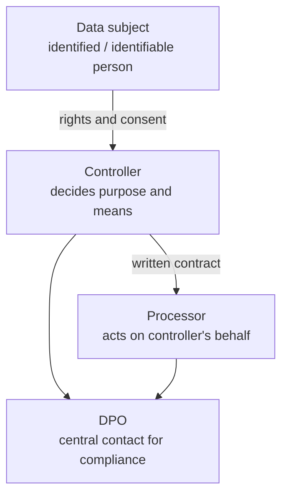

**Processing:** the kind of operation performed on user data. **Pseudonymization:** original data replaced with **artificial** data. **Security:** GDPR does **not** formulate specific technical measures; organisations choose controls by **severity of the data** (IAM limiting access to job function; DLP; incident-response plan; **SASE** for WFH/hybrid).

If non-compliance, **processor or controller** is liable.

### Six underlying principles
1. **Lawfulness, fairness and transparency** — individuals must have a **very clear idea** how their data is used.
2. **Purpose limitation** — specified, **explicit and legitimate** purpose; purpose limited and known to the individual.
3. **Minimising collection** — only data **adequate and relevant**, not excess.
4. **Data accuracy** — keep data accurate; subjects can get it **modified, corrected, or erased**; failing that, **restrict processing**.
5. **Storage limitation** — when the purpose is served, **delete**; do not retain.
6. **Confidentiality, security and integrity** — **CIA** compliance already studied.

### Six legal bases (you cannot process “because you want to”)
After GDPR, organisations must disclose **why** they process, **how long** stored, **with whom** shared. Six bases:

| Basis | Classroom example |
|-------|-------------------|
| **Consent** | Checkbox to receive marketing mail. |
| **Vital interest** | Car accident; doctors use medical records to save a life. |
| **Contract** | Online purchase; address processed **to deliver the goods**. |
| **Public interest** | Crime witness; investigators use personal details. |
| **Legal obligation** | Banks’ **KYC / AML** on client data. |
| **Legitimate interest** | Job-seeker résumé on a site; recruitment agency sends it to clients. |

### Penalties and early fines
Non-compliance may be intentional or not (unclear policies, or **external cyber threats**). Strict consequences:

- Fine: maximum **€20 million or 4% of total global annual revenue, whichever is higher**.
- Consumers can initiate **civil litigation**.

Examples taught:

- **Amazon** ~**$780 million** for using user data **without consent** — largest fine “till date” in the presentation.
- **WhatsApp** — unclear privacy policies.
- **Google** — did not provide an **easy way of refusing cookies**.
- **British Airways** — **not intentional**; cyber-attack, ~**4 lakh** customer records; still fined.

### Data-subject rights
Beyond being told why data is used, individuals can require organisations to:

- **Delete** personal data
- **Stop** “browsing” / processing personal data
- **Edit / correct** personal data
- **Port** data to some other place
- **Access** the data
- **Know how** it is used
- **Restrict processing**

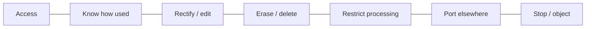

**Consent** = approval. **DPO** is now **mandatory** (presentation: employ a DPO to meet compliance) — independent executive or firm executive as **central point of contact**. Awareness training sessions. **DPIA** (below) for high-risk work.

### DPD vs GDPR — key changes the group listed
**Personal data redefined.** Earlier: only data that **directly** identifies (name, address, phone, email). Now: anything that **in conjunction** can identify — **IP address, mobile device identifier, geolocation, fingerprints**.

**Opt-in / consent** not enforced that way under DPD. GDPR: explain why you use the data **and** secure **opt-in consent**.

**Rights** listed again: access, know use, erase, restrict processing.

**Joint responsibility** of processor and controller (DPD: controller only), via contract.

**DPO mandated** as central contact for implementation and whether security/compliance is maintained.

**DPIA mandatory for high-risk projects** (not under DPD): sensitive personal data, **large-scale** handling, **profiling a vulnerable** section. DPIA identifies probable risks and mitigation. It is **project-specific**, not a generic organisation evaluation. Ensures GDPR compliance and **data protection / privacy by design** in new projects.

**Penalties and breach protocols uniform.** DPD: member countries adopted **different** breach protocols. GDPR: **all member countries** notify data subjects that a breach happened, **within 72 hours**. Fines heftier: €20M or 4% global turnover, whichever higher.

## Cases and examples from the lecture
- Meta / virtual identity vs real-world autonomy of the self.
- US: Target, We Googled You, Equifax — no report clock, no set penalty, state variation.
- Social-media user counts 2016–2027 as the reason a comprehensive law was felt necessary.
- Consent checkbox; ER vital interest; delivery contract; crime public interest; bank KYC; recruiter legitimate interest.
- Amazon, WhatsApp, Google cookies, British Airways (no intent, still fined).
- WFH / hybrid → SASE as a GDPR-era security pattern.

## Key terms
| Term | Meaning in this lecture |
|------|-------------------------|
| DPD (1995) | Directive: member states write their own laws; not uniform. |
| GDPR | Regulation: law, enforced 2018 (adopted 2016). |
| Personal data | Identifies on its own **or in conjunction** (IP, device ID, geo, biometrics). |
| Controller | Decides purposes and means. |
| Processor | Processes on behalf; now jointly liable; needs a contract. |
| Pseudonymization | Replace original with artificial data. |
| DPO | Mandatory central contact for GDPR compliance. |
| DPIA | Project-specific high-risk impact assessment; privacy by design. |
| 72 hours | Uniform breach notification window under GDPR. |
| 4% / €20M | Ceiling on administrative fine, higher of the two. |

## Formulas / frameworks (if any)
- **Scope test:** EU establishment **or** processing of people residing in the EU.
- **Lawful processing:** one of six bases; not “because we want the data.”
- **Accountability pair:** controller **and** processor; DPO; DPIA for high risk; 72h notice; 4% / €20M.

## Distinctions the instructor / group insist on
- Meta can skip real identity; **real-world** privacy is about the self and autonomy — that is what law is for.
- US has category laws (HIPAA, children, FTC) but **no overarching** end-to-end statute; Equifax showed missing **time** and **penalty**.
- A **directive is not a regulation**; 2018 is the change from D to R.
- Personal data is not only name and email; **in-conjunction** identifiers are in.
- DPD blamed the **controller only**; GDPR puts the **processor** on the contract and in the dock.
- British Airways: **no intent** is not a defence when there is a breach.
- DPIA is **project-specific**, not a one-time org score.
- GDPR does not prescribe a single security stack; measures scale with **severity**, but non-compliance is still liability.

## Exam-oriented recap
- GDPR applies to anyone processing EU residents’ data, not only EU companies.
- Six principles (lawfulness/fairness/transparency through CIA) and six legal bases (consent through legitimate interest).
- Roles: subject, controller, processor, DPO; mermaid above.
- Rights: access, know, rectify, erase, restrict, port, object.
- Uniform 72-hour breach notice and 4% / €20M fines are the “teeth” the US cases lacked.

---

# Lecture T33: GDPR — Part 02

**Playlist index:** 33  
**Transcript:** [33-privacy-regulation-in-europe-part-02.md](../transcripts/markdown/33-privacy-regulation-in-europe-part-02.md)  
**Video:** https://www.youtube.com/watch?v=gt8j3cUCL-I  
**Week / theme:** Privacy regulation in Europe — Cavoukian / privacy by design, Microsoft operational GDPR, global copycats, implementation gaps

## Learning objectives
- Attribute GDPR’s foundation, as the lecture does, to **Ann Cavoukian** and her **privacy by design / by default** line.
- Turn GDPR into organisational work: **records, DPIA, 72-hour notice, DPO, vendor contracts, third-country safeguards**.
- Explain why **COVID / hybrid work** is used to account for the surge in fines.
- State the lecture’s “way forward”: privacy as **new normal** and **brand differentiator** (~120 country laws; 82% see certifications as a buying factor).
- Take the implementation Q&A seriously: culture, manufacturing capability, import leverage, and **aware people** plug loopholes more than text does.

## What this lecture actually teaches

Continues Group 3 after the introduction and DPD comparison. Also walks a **Microsoft** perspective article.

### Ann Cavoukian as the lecture’s founder
The person who “actually started off with this GDPR,” in the presentation, is **Ann Cavoukian**, former Information and Privacy Commissioner for **Ontario**. Line they quote:

> Privacy knows no borders, we have to protect privacy globally or we protect it nowhere.

She gave **seven principles** on which, they say, GDPR was laid. As spoken in class (order mixed; capture the seven beats):

1. **Full functionality** — **positive-sum, not zero-sum**. You cannot “take some / leave some.” Full privacy; the individual should have **full control** over data.
2. **End-to-end security** — from the start of the technology / application through its **full lifecycle**.
3. **Visibility and transparency** — no ambiguity; the person knows what is taken and required, and stays in control.
4. **Respect for user privacy / user-centric** — even where legitimate/legal access exists (Boya’s bases), stay inside that ambit; only what is required.
5. **Proactive not reactive** — COVID/hybrid produced attacks because measures were remedial. **Preventative** from **inception**, not after the system is online. Antivirus, malware, incident reporting as proactive.
6. **Privacy embedded into design** — not an afterthought. Same idea as isolating critical systems at the **conceptual / engineering** stage.
7. **Privacy as default** — default settings protect the user; whatever is made should protect privacy at all times.

**Privacy by design and as a default** is what the Microsoft article “starts off” with, and the first GDPR requirement they list.

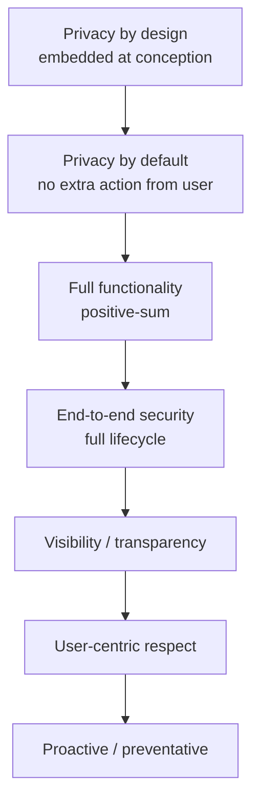

### Microsoft / practitioner requirements
**1. Privacy by design and default.** Every development stage; IT systems, **business practices**, **physical design**, **network architecture** should be privacy-enhancing. Strength **commensurate with sensitivity** (medical, legal). Objective: privacy and **personal control** over one’s data.

**2. Record-keeping.** Accurate, up-to-date record of **processing activities**: purpose, **categories** of data, **third parties** likely to use or access. Also records of **data breaches and responses** and impact — not “leave it at that.”

**3. DPIA.** Any **new processing activity** entails risk. Cover nature, concept, purpose, **likelihood and severity** of harm. Under the DPO’s purview: are design-and-default already incorporated?

**4. After a breach.** Identify **authorities within 72 hours**; **inform affected individuals** — you cannot hide it. Adequate **technical and organisational** measures to **detect, report, and investigate** personal-data breaches.

**5. Data transfer outside the EU.** Recipient country should provide protection **in accordance with GDPR**. Indian **outsourcing** already “gives a lot of heat” to GDPR. If the country does not provide adequate protection (no privacy law, or not technologically ahead), implement **standard contractual clauses**, **binding corporate rules**, and similar safeguards so security is at least “some semblance of or at par.”

**Vendor / processor:** always a **written agreement** — obligations, what is / is not to be done, GDPR and data-protection measures. Microsoft’s pitch in the article: tools for DPIA, data mapping, privacy by design/default, cloud encryption and access control — “perfect for GDPR.”

### How GDPR manifests inside a firm
Technology side (an article they cite): **pseudo-anonymizing** processing — encrypt so **need-to-know** only; not everyone sees data if there is a breach. **Heightened accountability:** ensure and **demonstrate** adherence, e.g. **certification**.

Organisational must-haves already covered, restated as how GDPR “shows up”:

- Immediate notification: 72 hours, **and** tell the individual.
- **Nominate a DPO** — advising, **awareness training**, monitoring compliance. DPIA sits with this officer.
- Heavier fines designed to **deter**; also **seizure of profits**, **injunctions**. Amazon still the largest; Google; British Airways.

**2020–21 figures they put up:** by ~2020 GDPR had been in force ~3 years. **Minimum penalty €2,000**; **306 fines in 2020**; by 2021 **429** fines and a **seven-fold** increase in money. They link the rise to **COVID-19**: organisations unprepared for hybrid; **home environments lacked safeguards**; public networks; business intelligence / counter-intelligence wanting to siphon information. Fault of organisations **and** of people working from unprotected PCs.

### Conclusions / “privacy is the new normal”
People are “very sentimental and very concerned”; privacy is here to stay. It **was not the norm**; going forward it **is the new normal**. Customers will expect it, authorities will check it, corporates will do it. Automation will grow; the requirement is **by design / by default, not afterthought**. Organisations are still in **nascent** compliance. **Almost 120 countries** have enacted privacy laws; severity and penalties likely to increase. Privacy becomes a **brand differentiator**. Study cited: **82% of organisations** view **privacy certifications and privacy shield as a buying factor**. Practical long-term compliance beats debating whether penalties or hybrid work are “fair.”

### Global copycats named in the slides
Not all countries listed; these were:

| Country / region | What they named |
|------------------|-----------------|
| Australia | Privacy amendment to the Privacy Act, effect **February 2018** |
| Brazil | **LGPD**, modelled on GDPR, **lesser penalties** |
| Canada | Digital charter implementation act |
| China | **Personal information protection law** |
| India | **Personal data protection bill**; companies already gearing up |
| Israel / Japan | Japan’s APPI amended; applies to **foreign and domestic** firms processing Japanese citizens’ data |
| Nigeria / African Union | AU **resolution 2014**; members enacting laws even where tech is nascent |

### Q&A the instructor does not treat as logistics
A student: the rules are comprehensive; we fail at **implementation**. People treat rights as **absolute** and do not speak of **responsibilities**. Gaps at organisation, national, international, individual levels; how do you get **uniformity** globally?

Answer taught: **countries are not the same** — culture, population, infrastructure. Privacy by design / default needs **manufacturing capability**. If you **import** the thing, you cannot have your say on design. India is moving penalties toward **~5% of global turnover** (not 4%). Like the **US states**, implementation follows **demography and culture**. EU: smaller populations, developed infrastructure, comparatively easier — and if **majority of your exports go to the EU, they have the say**. A **net importer** does not have that leverage. Broad ramifications.

Indian Facebook/cookie reality: majority just press OK so the site opens. Only now are younger people alive to malware and personal data leaving. Cyber attacks targeting Indian personal data. Laws work when **knowledge starts at school**. Once every country has some law, they will differ but a **common ground** becomes the bulwark. **Continued education**: the main characters who plug loopholes are **aware people, not organisations or businesses**.

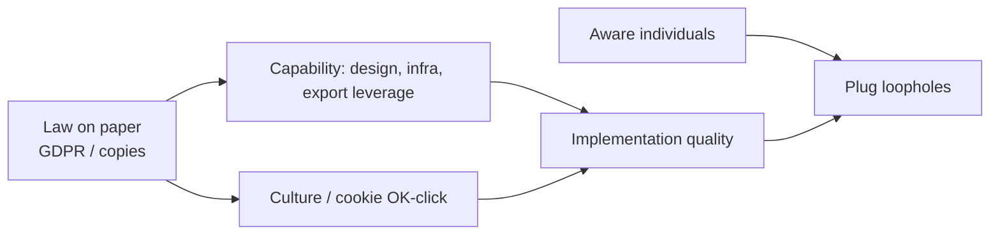

## Cases and examples from the lecture
- Cavoukian / Ontario; “privacy knows no borders.”
- Microsoft article as a vendor checklist (records, DPIA, SCCs/BCRs, encryption).
- Indian IT/outsourcing heat under GDPR transfer rules.
- Amazon, Google, BA fines; 306 → 429 fines; seven-fold money; COVID WFH as the explanation they offer.
- 82% buying-factor statistic; ~120 country laws.
- Brazil LGPD, China PIPL, India PDP bill, Japan extra-territorial APPI, AU 2014.
- Cookie “OK” in India vs EU-style default privacy.

## Key terms
| Term | Meaning in this lecture |
|------|-------------------------|
| Privacy by design | Embed protection at conceptual/design stage, not after go-live. |
| Privacy by default | Settings protect the user without extra action; full functionality, not a trade-off. |
| Positive-sum | Cavoukian: not “some privacy vs some function.” |
| SCC / BCR | Standard contractual clauses / binding corporate rules when the destination lacks adequacy. |
| Demonstrate adherence | Accountability is not only doing; it is showing (certification). |
| SASE / hybrid | Remote work makes GDPR compliance “hectic”; security protocols must follow the user. |
| Privacy as differentiator | Certification / shield as a **buying factor** (82%). |

## Formulas / frameworks (if any)
- **Cavoukian seven** (as taught): full functionality, end-to-end, transparency, user-centricity, proactive, embedded design, default.
- **Post-breach triad:** 72h to authority + notify individuals + technical/organisational detect-report-investigate.
- **Third-country fork:** adequacy-like protection **or** SCCs/BCRs/contracts.
- **Fine trajectory they cited:** min €2,000; 306 (2020) → 429 (2021); seven-fold money, blamed on COVID attack surface.

## Distinctions the instructor insists on
- Privacy in the product is **not an afterthought** and not a zero-sum against functionality.
- 72 hours is not only “tell the regulator”; **tell the person**.
- Strength of controls **scales with sensitivity** — medical/legal data is not a cookie banner.
- Processors outside the EU (India included) are in via **contract**, not via geography.
- More fines in 2020–21 are taught as **WFH unpreparedness**, not only “evil Big Tech.”
- Exporting to the EU buys **leverage for EU rules**; importing does not. India’s 5% idea does not erase that.
- Implementation gaps close with **educated users**, not only with stricter text.

## Exam-oriented recap
- Lecture founder figure: Cavoukian; slogans: no borders; by design; by default; positive-sum.
- Operations: processing records, breach logs, DPIA on new processing, DPO, 72h + individual notice, SCCs/BCRs for India-like destinations.
- Privacy is becoming a market factor (82%) and a global template (~120 laws).
- The hard part, in Q&A, is **implementation** given culture, industrial capability, and awareness — not drafting another article.

---

# Lecture T34: GDPR — Part 03

**Playlist index:** 34  
**Transcript:** [34-privacy-regulation-in-europe-part-03.md](../transcripts/markdown/34-privacy-regulation-in-europe-part-03.md)  
**Video:** https://www.youtube.com/watch?v=TSx88vrSfG0  
**Week / theme:** Privacy regulation in Europe — GDPR’s downside, cookie-consent failure, adequacy / third countries, does IIT Madras need to care?

## Learning objectives
- Argue both sides: GDPR as **accountability** (Equifax lesson) vs GDPR as a **constraint on data-driven business models**.
- Explain **privacy by default as a nudge** (default radio button = I disagree).
- Show why **cookie banners** may not produce real consent (gratification, no time to read).
- Map **third countries** and the lecture’s **14 “secure” / expressly permitted** countries — **USA and India not on the list**.
- Apply GDPR to **IIT Madras**: EU exchange and joint-degree data, MOUs without privacy clauses, photo consent at Passau.

## What this lecture actually teaches

Instructor debrief after the GDPR presentation. Group used the basic document, legal bases, implications inside and outside the EU, and post-GDPR **fines on American firms** (Google, Facebook, Amazon, even Microsoft, whose commentary they presented, “repeatedly fined” though they claim they are ready). Now: **the downside**.

### Does GDPR attack data businesses?
If collection, storage, processing and transfer are strictly regulated, can Google/Facebook-style firms **function at all**? They are among the world’s top technology companies; **business model is data**; revenue is **advertising**; the value they create is telling advertisers **what people need**. Is a very strict regime **against entrepreneurship and innovation**?

Student reply: business can be promoted in *n* ways without using personal data to cold-call and **undermine privacy**. Instructor: that is **simplistic**. He **agrees** that as regulations go stricter they **do stifle business**. Counter-argument from the group (mining / environmental-clearance analogy): a **blanket sanction** (anyone, anywhere) destroys the forest. GDPR says these rules should become a **norm in the greater good**; businesses must **adapt**. Stifling those who will not adapt is the point. Negative of *no* regulation: Facebook/Twitter controversies in their **own** country — **blatant misuse** in the absence of rules.

Instructor takes the argument. Equifax’s major issue was **accountability**. GDPR brings accountability for **firms that collect and firms that process** — clarity on what happens if something goes wrong, **penalty**, **when it has to be reported**. Without clear law, people play around. The other extreme is also bad: the regime should **encourage business**. Data privacy is **not an absolute concept**; people are willing to share data and do not want it **abused**. Both sides.

### Innovative bits: default disagree, privacy by design, nudges
Instructor’s last GDPR point: innovative aspects — **privacy by design, privacy by default**. If you are signing into an account, **by default the radio button should be I disagree, not I agree**. These are **nudges** (he names **“Richard Taylor’s idea of nudge”**). If the default is I agree, you tend to agree. If default is I disagree, you get a point to think. A nudge **in the interest of the user**. By design: privacy thought of **prior**, not an afterthought.

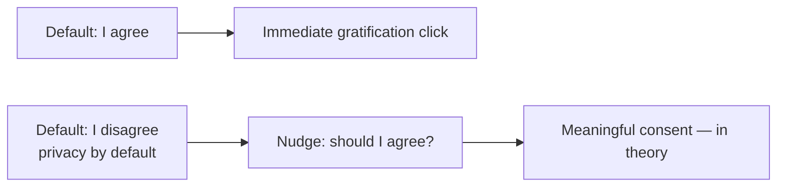

### Cookie banners: consent that does not work
To comply, firms safeguard themselves. Since **2018** the instructor sees “this consent business.” Any website associated with Europe immediately brings up **cookie policy**: agree with all cookies, decline, or **manage** — almost three options. What do people do? **Majority agree.** Going into settings takes time you do not have. Again it **goes against the human need to gratify**. “I agree / use all cookies” is **not serving any purpose**; it is an **annoyance**. Discussed at a recent privacy conference: if every firm takes consent in this format, you **do not have time to read the clauses**. **Consent actually doesn’t practically work.**

Group anecdote: WhatsApp message — a person complains to **IRCTC** that login shows “illegal site pictures.” IRCTC replies it depends on **which sites you have been constantly visiting**; those ads display; not IRCTC’s doing — **your surfing habits**. Difference after GDPR: sites used to take browsing habits silently; now they **show cookies / no cookies / manage cookies**. Instructor still not satisfied that this is real consent.

### Harmonisation vs Irish vs Dutch regulators
Q: GDPR covers many countries; some may interpret strictly, some leniently. How is it harmonised?

A (group): **GDPR is already harmonised.** DPD let members interpret and have their own laws; **not enforced**. GDPR **must be complied**; **uniform across member states**. Breach protocols and penalties are not each country’s private invention.

Follow-up: some companies prefer the **Irish regulator** to the **Dutch** for the same GDPR, to clarify interpretation or prove compliance — so some difference still exists?

Group: after **Brexit**, UK formulated its own law, **more or less compliant** with GDPR, derived from earlier DPD/GDPR. They did not research Ireland vs Netherlands in detail. Instructor restates the student’s possible question: does GDPR **discriminate** among countries, especially for **data transfer**? Group: uniform for members; they did not find a special Irish carve-out. Digital traffic can be monitored from any point; every firm is liable to have a **DPO** (Ireland included). If Ireland under-reports, **somebody in the Union will report**; the company takes a **very big penalty** risk. Early Amazon/Google fines described as a **state of flux** plus **COVID / hybrid / public network**, not always deliberate. GDPR has become the **precursor** for ~**120** countries (Nigeria / AU again).

### Third countries and the list of 14
Instructor: GDPR also mentions **third countries**. On the GDPR site, **14 countries** identified as **secure countries to trade data with** — **express permission**. Other countries do not have that, so corporations need **specific contracts** enabling the third-country organisation to comply with GDPR.

- **United States is not one of them** (you would expect USA to be there).
- **India is not there.**
- Countries with **strict data protection regulation** get the list slot.
- “We are a **third country** in GDPR and we are not in the list of 14, India.”
- Is the regime **skewed** toward certain business models / against others? That was the opening critique.

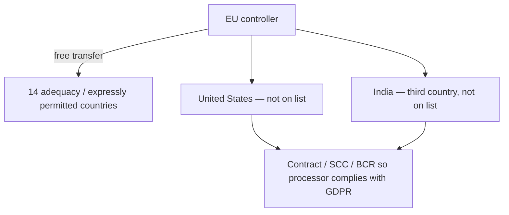

### Should IIT Madras worry about GDPR?
Instructor’s last question: the organisation he belongs to.

Group first cut: if you **process on behalf of** an organisation, you come under GDPR; else pre-existing Indian law — unless you handle data of EU individuals.

Do we process data of individuals from EU nations? **Exchange** processes. **Research collaborators**. **Speakers**. More importantly: **start-ups**; **joint degree programs with German universities**; **huge inflow of EU exchange students** (six months, sometimes a year, joint doctorates). IIT **collects, stores, and processes** data of EU citizens. GDPR protects **data of its citizens**. As a third country, bound by **MOU** (the contract with the other university). Instructor has **read MOUs with no specific clauses on protection of private data**. **Awareness is very low.** Fine **so long as there is no breach or complaint**. The day there is a breach and somebody goes to court…

Have we had a breach? He is **not aware** of a **formal**, public, declared breach. Studying ransomware: **all IITs have been breached once** somewhere. Informally: during festivals, students access **Dean’s students database**. “We function differently.” **Not so the case with Europeans.**

University of **Passau**, teaching **12 years**: he has seen the change. Today, a class photo: **ask, can I upload this to the website? Only with consent.** If a student says no, he cannot upload. German universities take **every student’s consent** before a picture goes to the site. Incoming students may have given consent on their side; **whether IIT takes explicit consent and records it, he does not know.** Unfamiliar practice. It may come soon because of **PDP** — India going for a similar regulation (next class). We **flip**: we want the law very strict, then find we are **losing opportunities**.

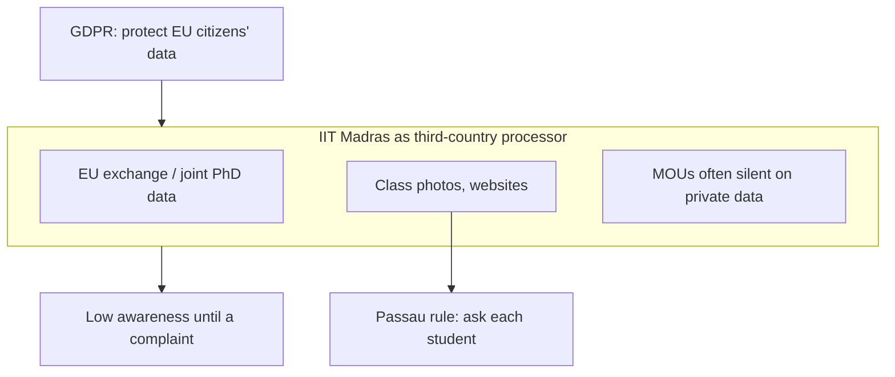

## Cases and examples from the lecture
- Repeated EU fines on Google, Facebook, Amazon, Microsoft after 2018.
- Environmental-clearance / mining analogy for why blanket freedom is not “innovation.”
- Default “I disagree” as Thaler-style **nudge** (said “Richard Taylor”).
- Cookie banners since 2018; majority click agree; conference view that consent does not scale.
- IRCTC ad complaint vs browsing history.
- Irish vs Dutch regulator shopping; UK GDPR after Brexit.
- 14-country express-transfer list; US and India absent.
- IIT–German joint degrees; Passau photo consent; festival access to Dean’s database; rumour of IIT ransomware/breaches.

## Key terms
| Term | Meaning in this lecture |
|------|-------------------------|
| Downside of GDPR | May stifle ad-funded, data-native business models. |
| Accountability | Equifax hole GDPR fills: who is liable, what penalty, when to report — collectors **and** processors. |
| Nudge | Default option steers choice; privacy-by-default = default **disagree**. |
| Cookie consent | Post-2018 banners; lecture conclusion: does **not practically work** as informed consent. |
| Harmonisation | GDPR is a regulation, uniform for members; unlike DPD. |
| Third country | Non-EU destination; India is one. |
| Expressly permitted / 14 | Countries treated as safe for free transfer; **not** US, **not** India. |
| MOU | The contract through which a university relationship should (but often does not) carry GDPR duties. |

## Formulas / frameworks (if any)
- **Balance:** accountability and no-abuse **versus** not killing data businesses; privacy is not absolute.
- **Default test:** radio button on signup = disagree if you are serious about privacy-by-default.
- **Transfer test:** on the 14-list → express permission; else **specific contracts**.
- **University test:** do we store EU persons’ data? Then GDPR awareness is not optional, complaint or no complaint.

## Distinctions the instructor insists on
- “Do business without personal data” is too simple; **stricter law does stifle** some models — and **no law** enables Equifax-style unaccountability and platform misuse.
- Privacy is **not absolute**; people will share; they refuse **abuse**.
- Privacy by default is a **nudge**, not a moral sermon.
- Cookie banners are **compliance theatre** if nobody can read them — same immediate-gratification problem as T30’s 76-day privacy policy.
- GDPR is **harmonised for members**; remaining differences (Ireland/Netherlands) are not a licence to shop for a blind regulator.
- Adequacy is **political/legal**, not “USA is advanced so it must be on the list.”
- IIT is not outside GDPR because it is Indian; **EU student data** is enough. Informal Indian breach culture is **not** the European standard (Passau photos).
- Wanting Indian law to be “very strict” and then complaining about lost opportunities is the same flip the next India lectures will hit.

## Exam-oriented recap
- GDPR’s teeth (fines, 72h, processor liability) are the point of Equifax; the cost is pressure on ad-tech models.
- Default-disagree and privacy-by-design are the innovative ideas; banners mostly fail the human-time test.
- India and the US are **third countries**, not on the 14; contracts must carry GDPR.
- IIT Madras already processes EU data (exchanges, joint degrees); MOUs and photo practice are the awareness gap.
- Next: Indian constitutional privacy, Puttaswamy, Aadhaar, DPDP.

---

# Lecture T35: Privacy: The Indian Way — Part 01

**Playlist index:** 35  
**Transcript:** [35-privacy-the-indian-way-part-01.md](../transcripts/markdown/35-privacy-the-indian-way-part-01.md)  
**Video:** https://www.youtube.com/watch?v=fobfwNopJtc  
**Week / theme:** Indian privacy — Constitution Art. 21, Telegraph Act, Puttaswamy, Aadhaar as state fiduciary, PDP → DPDP

## Learning objectives
- Read **Article 21** as personal liberty **with** the clause “except according to procedure established by law.”
- Place the **Indian Telegraph Act 1885** (and **1972** amendment) beside that liberty: the state has interceptive rights.
- Name **Justice K.S. Puttaswamy** as the lecture’s “father of data privacy in India” and state the **24 August 2017** holding.
- Apply the **threefold test** (legality, need / legitimate state aim, proportionality).
- Trace **Srikrishna → PDP bill dropped → DPDP 22 bill**, in parallel with GDPR 2018.
- Hold both lines: privacy is a **fundamental right** and **not absolute**; the state has **no absolute power to snoop**.

## What this lecture actually teaches

### Landing in India
Regulatory frameworks differ by region; cases showed the issues. Data privacy has **many stakeholders and layers** — not you alone, not government alone. Whenever **personal / personally identifiable data** is involved, there is a privacy issue. Today: state of affairs in India, in Indian society and culture (no foreign students in this class to compare). Understanding of privacy here is **dynamic**. The digital world has **exploded** in 20–30 years; administrative systems, including at country level, are **responding**. India is not sleeping: tap digital potential **and** take care of privacy concerns.

Plan: historical perspective, then recent national-level conflict. For decades post-independence the government did not have to worry much; now it is a **national issue**.

### Article 21 — read the whole sentence
The reference document that defines India is the **Constitution**, binding on all states and union territories. What it “enshrines” is a right to freedom. Article 21, as read in class (he flags the gender bias in the old wording):

No person may be deprived of his or her **life or personal liberty except according to procedure established by law**.

Nobody — individual, institution, government — can deprive an individual of personal liberty, **except** that exception. **Read the whole of Article 21**; do not read the first part and leave the second. The constitution is carefully drafted for **all stakeholders**. Personal freedom is assured; it is not unbounded.

### Indian Telegraph Act 1885 — interceptive right
Before and after the Republic (**1950**). Landmark pre-independence legislation: **1885**, still in the newspapers. Enacted by the British. Telegraph was institutional communication in the 19th century. After the British established themselves (he says Plassey **1775**), they built systems and laws. After the 1857–59 “mutiny” / first independence war, they used and **tapped telegraph** and found interceptive powers essential.

**Essential message of the Act:** it gives government **access / interceptive right** over telegraph communication, any communication in the country — power to **rule**. Post-independence the law **did not change**. Indian government put **Posts & Telegraph (P&T)** under government control, like Indian Railways — government control on communications. Article 21 and the Telegraph Act **work together**. Government has certain rights; you have personal right. They **may be in conflict**.

**1972 amendment** (he will not name individuals): 1970s government, notorious for the **Emergency**, further amended the law to make **wiretapping** possible, “especially [of] what opposition leaders were talking to each other.” Access was **made legal**.

### 2017–18: privacy declared a fundamental right
Legislative and executive are “one government”; they make laws convenient to rule. **Judiciary** intervenes. Landmark: Supreme Court of India declared **privacy a fundamental right**. He first says **2018**, then **corrects** when he reaches the judgment text: **24 August 2017**. Earlier, a **Madras High Court** judge had almost said Article 21 already assures privacy as fundamental even if not explicit. In 2018/2017 the Supreme Court said it **explicitly**, in the context of the **Aadhaar Act** and exhaustive Aadhaar deployment.

Government was collecting **biomedical / biometric** data of citizens and storing personally identifiable data digitally. **Government became a data controller** — the **major data fiduciary** of the country today is not private organisations but the **government**, with digital data of about **1.3 billion** people, “the largest database in the world.” Supreme Court: you are in possession of individual data, but it is somebody’s **fundamental right**; you are **guardian** of it — a critical responsibility.

### Legislative trail: Srikrishna, PDP, DPDP
When GDPR was an open draft, GoI started a similar regulation. He is “a bit confused” whether **Justice Srikrishna Commission** got the project in **2016 or 2014**. The commission made **extensive consultations**, was aware of GDPR, presented a final draft in **2018**: **Personal Data Protection bill (PDP)**. An independent committee’s draft is conceptual; government converts it to a bill and **made certain changes**. It sat long in Parliament, went to a parliamentary committee (opposition + ruling), **they never agreed**. Government **dropped PDP** and proposed **DPDP — Digital Personal Data Protection**. He misspells then corrects: **DPDP 22 is a bill now**; watch what happens next.

Broad overview: of late India is responsive; you may disagree with clauses (that is the debate), but we can be proud of being **at par with developed countries** in having a separate personal-data law in the works.

```mermaid
flowchart LR
    T1885["1885 Indian Telegraph Act<br/>state intercept"]
    C1950["1950 Constitution<br/>Art. 21 liberty + exception"]
    T1972["1972 amendment<br/>wiretap / Emergency"]
    PIL2012["2012 Puttaswamy PIL<br/>Aadhaar"]
    SK["~2014/16 Srikrishna<br/>drafting"]
    J2017["24 Aug 2017<br/>privacy = fundamental right"]
    PDP["2018 PDP draft<br/>GDPR year"]
    DROP["PDP dropped"]
    DPDP["DPDP 22 bill"]
    T1885 --> C1950 --> T1972 --> PIL2012 --> SK --> J2017 --> PDP --> DROP --> DPDP
```

### K.S. Puttaswamy
Are you familiar? Retired **Karnataka High Court** judge, “must be 97 now.” In **2012** he filed a **PIL** in the Supreme Court, when the Aadhaar debate was active. If you remember a single person for data privacy in India, the instructor will call him **father of data privacy in India**: it is **against his writ petition** that the Court held privacy a fundamental right. The Court does not make a statement in the air.

Puttaswamy’s concern: every individual goes to a collection centre, gives **biomedical identities** — iris, retina, all fingerprints; “everything about you.” Government getting too much power; **what government would do tomorrow** with this data. Second: making Aadhaar **mandatory for government services**. If you do not trust government and will not give PII, you are deprived of services — **ration (PDS)**, **right to vote**. He challenged that as unfair.

**Judgment key** (open document; long; this is the part taught):

> The right to privacy is a fundamental right. It is a right which protects the **inner sphere** of an individual from interference from both **state and non-state** actors and allows the individuals to make **autonomous life choices**.

Autonomy was discussed earlier in the course. Court upheld the right to be autonomous, to be oneself, to decide, to choose where one can be, **with whom to share data**.

### The conflict the class must sit in
If privacy is fundamental, how can government require **biometric** data for benefits? Is government **intruding** into private space? If you choose not to disclose, autonomy says government **should not deny services**. Student: people who want absolute privacy may also want no benefits. Instructor: if government says **for benefits you must share all your data**, that is **not fair**. One hand: right to decide whether to share. Other hand: you will not get services if you exercise the right. **Some kind of balance**; a **grey area**. (Side chatter about celebrities not wanting privacy is parked.)

Another student: classify and protect information; see **end use**. After Aadhaar, **fraudulent ration entries** removed; benefits were being siphoned. **Assam: over ₹22,000 crore of corruption unearthed in two years** of implementation. Unique-ID social security already exists in the West; citizens there force governments to protect data. End use matters.

Is there an **ultimate guarantee** data will not be compromised? **No guarantee from the government.** That is what **PDP / regulation** is trying to do. Two **parallel lines**; regulation exists to stop the skew and **balance both interests**.

**Privacy paradox, Indian edition:** concern of the **upwardly mobile and educated**; the **lesser educated / majority** want the benefits — “privacy you can keep.” Unaware of privacy, as discussed. Migration, education, “western access” are changing that; otherwise this debate was not in the country. In digital space, people are more privacy-conscious; **upholding privacy as a fundamental right was very important**.

### Threefold test — privacy is not absolute
Back to Article 21’s exception. An invasion of privacy / personal liberty must meet **threefold requirements**:

| Test | Meaning in this lecture |
|------|-------------------------|
| **Legality** | Existence of law |
| **Need** | Defined in terms of **legitimate state aim** |
| **Proportionality** | Rational **extent** of data collection |

Example: Income Tax he thinks is **exempt**; **Narcotics Control Bureau** (a small case earlier in the course) accessed private communication between two people. For many agencies, **Enforcement Directorate (ED)** permission is generally required. About **ten agencies** can tap private communication based on the **1885** law. Government has that right in the Telegraph Act.

**Privacy is a fundamental right but not an absolute right.** You cannot say in all conditions privacy is protected. A criminal cannot refuse to say who he is. Context matters.

Recent clip, not the full judgment: a Supreme Court judge — **no absolute power for the state to snoop into the sacred private space of individuals**. Even for the state to intercept, **legality, need, proportionality**. **No absolute power for government as well.** Grey areas: in what situation, to what extent, can government wiretap, and can that be made public — that is the whole debate.

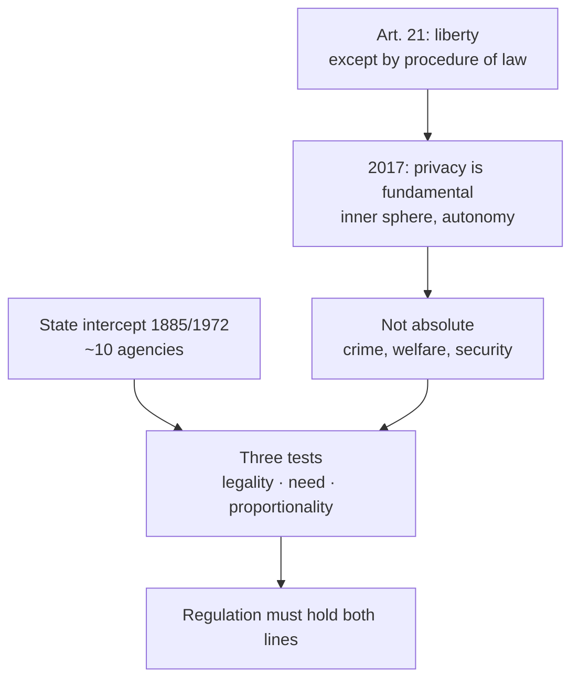

## Cases and examples from the lecture
- P&T / Railways as lifetime government-controlled communications.
- Emergency-era 1972 wiretap of opposition.
- Aadhaar biometric enrolment; 1.3 billion; government as chief fiduciary.
- Mandatory Aadhaar for PDS and voting as Puttaswamy’s unfairness claim.
- Assam ration fraud / ₹22,000 crore.
- NCB intercept; ~10 agencies; ED gate; IT possibly exempt.
- Privacy paradox: majority wants benefits, urban-educated wants rights.

## Key terms
| Term | Meaning in this lecture |
|------|-------------------------|
| Article 21 | Life and personal liberty except by procedure established by law. |
| Indian Telegraph Act 1885 | Colonial intercept statute; still the legal spine of tapping. |
| 1972 amendment | Emergency-period expansion of wiretap, including opposition. |
| Data fiduciary (here) | Government as custodian of 1.3B Aadhaar records. |
| K.S. Puttaswamy | 2012 PIL; “father of data privacy in India.” |
| Inner sphere / autonomy | Core of the 24 Aug 2017 holding; state **and** non-state actors. |
| Srikrishna Commission | Expert draft of PDP after consultations, GDPR-aware. |
| PDP | 2018 Personal Data Protection bill; government altered; Parliament stalled; **dropped**. |
| DPDP 22 | Digital Personal Data Protection bill that replaced it (still a bill in this lecture). |
| Threefold test | Legality, legitimate aim, proportionality. |

## Formulas / frameworks (if any)
- **Art. 21 structure:** liberty **+** “except according to procedure established by law.”
- **Puttaswamy formula:** fundamental right protecting inner sphere from state and non-state interference → autonomous life choices.
- **Snoop test:** no intercept without legality + need + proportional collection.
- **Two parallel lines:** welfare / unique ID **vs** autonomy to refuse biometrics → **regulation**.

## Distinctions the instructor insists on
- Do not quote Article 21 without the **exception**.
- Telegraph Act and Article 21 **coexist**; conflict is structural, not an accident.
- He **mis-speaks 2018**, then pins the judgment at **24 August 2017** — use the corrected date.
- Puttaswamy is not a slogan; it is a **writ** the Court had to decide.
- Government, not Facebook, is India’s **largest** personal-data controller.
- Mandatory Aadhaar-for-benefits vs fundamental privacy is a **grey area**, not a one-line win for either side.
- End use (fraud reduction in Assam) is relevant **and** there is **no guarantee** against compromise — hence a statute.
- Majority-benefit vs elite-privacy is the **privacy paradox** again, not proof that rights do not matter.
- Privacy is **not absolute**; the state’s snoop power is **also not absolute**.

## Exam-oriented recap
- 1885 intercept + 1950 Art. 21 + 1972 tap + 2012 PIL + **24 Aug 2017** fundamental right + 2018 PDP + dropped + **DPDP 22**.
- Father of Indian data privacy in this course: **Puttaswamy**.
- Three tests for invasion; ~10 agencies still sit on the Telegraph Act.
- Aadhaar made the state the main fiduciary; that is why privacy had to be constitutionalised.
- Next lecture: Aadhaar Act, Nilekani, architecture, weak links.

---

# Lecture T36: Privacy: The Indian Way — Part 02

**Playlist index:** 36  
**Transcript:** [36-privacy-the-indian-way-part-02.md](../transcripts/markdown/36-privacy-the-indian-way-part-02.md)  
**Video:** https://www.youtube.com/watch?v=oIUjD7JmDoU  
**Week / theme:** Indian privacy — Aadhaar Act, leakage/corruption rationale, Nilekani platform, CIDR–ASA–AUA architecture, weak links

## Learning objectives
- Show that Aadhaar collection is **“according to procedure established by law”** because there was an **Aadhaar Act** first.
- Explain the **welfare / anti-leakage** rationale: multiple identities, **₹1 → 70 paise**, information asymmetry (IRCTC).
- Describe Aadhaar as a **12-digit platform** run by **UIDAI**, designed by **Nandan Nilekani**, with a **minimalist** collection claim.
- Map **CIDR / ASA / AUA / device / user** and the **yes/no** authentication design.
- Locate **weak links**: enrolment vendors, disclosed Aadhaar numbers, **linking**, the “10-foot wall” vs Keshav’s open back door.
- Note Supreme Court **limits on mandatory Aadhaar** and the still-open **DPDP** debate on how safe the database is.

## What this lecture actually teaches

Continues Article 21: no deprivation of life or personal liberty except according to **procedure established by law**. Is Aadhaar that procedure?

### Aadhaar Act — legality is not the debate
**UIDAI** (Unique Identification Authority of India) is the agency in charge of Aadhaar data collection and the Aadhaar database. Is it according to procedure established by law? **Yes — we do not have to debate.** There was an **Aadhaar Act** in Parliament **before** Aadhaar came into existence. Government **can** collect this data; it is legal. Context is the rest of the argument.

Government’s role: **govern**, **welfare of people**, **guardian of the country’s assets**. It must do that job **and** protect privacy.

### Why a unique ID: asymmetry, leakage, multiple identities
As India digitised, **every** government — party does not matter — explored IT. **IRCTC** / online railway reservation is the set-piece: huge cut in **information asymmetry** and corruption. Corruption often stems from **asymmetry of information between two agents**. At a clerk’s window you depend on what the clerk says about whether a seat exists; you cannot see the inventory. Digital access **removes the asymmetry**.

In line with that: an **identity problem**. An Indian could have **multiple identities** — a ration card in Tamil Nadu, another in Kerala, another in UP or Bihar. Fifteen years ago, quite possible; similarly voter IDs. Assessed as a major issue. Economists’ **leakage**: if government gives **₹1, only 70 paise** reached the intended recipient. Unique ID is a “very valid, very rational” response: corruption, inability to deliver **effectively and efficiently**. **Aadhaar from government to government**, not one party’s idea; the country understood the need.

### Nilekani, 12 digits, platform, minimal data
Headed by **Nandan Nilekani** (Infosys), “one of the well-known IT gurus,” given charge of Aadhaar. Two books; instructor read one — excerpts on leading a mega-project: cut across ruling party and opposition, **robust technology** for **more than a billion** people, amid opposition and “privacy as a fundamental right,” and the project **had to move on**.

**12-digit** Aadhaar is unique ID for every individual; **world’s largest ID system**. Every record unique: go a second time for another Aadhaar and the application’s comparisons will not accept it. Built as a **platform** — not one player. A **database on which applications could be built**, other participants connect. Facebook is a platform because multiple **categories** of participants take and give; Google unites advertisers and users whose interests differ. Aadhaar is a database-platform that **unites / synchronises / orchestrates** interests.

Nilekani would assert: **minimum data**, not full demographics — only **basic identification** required. **Minimalist** at collection.

(Aside: **Machiavelli, *The Prince*** — suggested for managers, complexity of politics; **Chanakya** as the Indian familiar; good kings and bad kings, rational guidelines to survive. Context-setting, not the Aadhaar architecture.)

### Why privacy exploded: one database, mandatory use
Privacy became an issue because government needed to collect personal data and store it in a **single database**. Can it be **mandatory for government services**? Aadhaar was **challenged**; debate was public; **Supreme Court restricted where Aadhaar can be used and where it should not be mandatory**. Instructor does not have the list: certain **fundamental services** you need not have Aadhaar — **other identities** will do. Nothing should be so absolute as to gate **basic** government services.

**Cell phone / wireless today: you need Aadhaar.** If you want the service, provide data; if not, sit at home. Banking, insurance, many private services: Aadhaar becomes the unique identifier. Privacy-aware people know they are sharing a **unique ID**; **potential for misuse exists**.

### How safe is the database? 10-foot wall vs weakest link
Country-wide debate from about **2015**, still on, because **PDP / DPDP has not become a law yet**. How safe is Aadhaar? Guarantee data will not pass or leak in the architecture?

**Gulshan Rai**, India’s Cybersecurity Chief, answered that Aadhaar biometric data is **100 percent secure** and there is a **10-foot wall**. Data centre in **Haryana** (instructor’s reading). Claim: infrastructure very well secured. Is a 10-foot wall enough? Looks **trivial**; he is a techie, so there is a reason — the statement is about **physical security**. Student: then someone builds an **11-foot ladder**. Point taken; not the real point.

**Keshav cartoon in *The Hindu***: very secure from the front; **back door open**. Saying on the slide: **no chain is stronger than its weakest link**. Ninety-nine strong links, one weak, the chain breaks.

Reading: research paper by (about) **three IIT Delhi Computer Science** scholars on weaknesses in the Aadhaar system. **Justice Srikrishna commission referred this paper in the draft bill** — instructor: if you are a researcher, policy citing your paper is one of the finest moments. Footnote in the document is why it is a class reading. He is **not sure Aadhaar data ever got leaked from the [core] database**. The **architecture** is the issue.

### Architecture: CIDR, ASA, AUA, device, user
Three constituents in the paper’s picture:

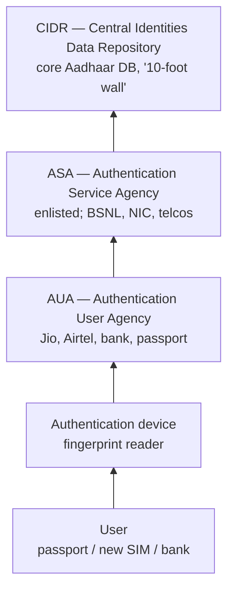

- **CIDR** — Central Identities Data Repository: Aadhaar data lives here; the data centre of the 10-foot wall. Jumping the wall still does not “collect and go” — it is digital; physical wall talk “does not make any sense” as the whole story. Access is **layered**.
- **ASA** — Authentication Service Agency: direct digital (wired) link to the database.
- **AUA** — Authentication User Agency: the **service provider** in front of you.
- **Authentication devices** — fingerprint readers etc.
- **User** — wants a service (passport renewal, new SIM).

Flow as taught: you go to Jio / Airtel / Idea (or bank, passport). The centre has the device. They must **authenticate** (claim vs proof, as earlier in the course). Claim = disclose the **12-digit** ID (3×4). Then fingerprints. The **telecom SP is the AUA**. The device reaches Aadhaar **through ASA**. ASA vendors must show credentials and be **enlisted / approved by UIDAI**. UIDAI **publishes** who the ASA providers are. **All telecom service providers are also ASA providers** (they have the network). **BSNL**, **NIC** named.

Core database may be encrypted, hard to tap by interception. **Where is the weak link?**

Class: a **rogue / malicious service entity**. But biometric **custody** is with **UIDAI**. Authentication is **yes/no**; they are **not releasing** the person’s data. The delivery point **does** get your **Aadhaar number** because you disclosed the ID. Debate: do not give the Aadhaar card; give a **pseudo number** (T31’s pseudo-anonymity). Weak point hard to find in the core; **authentication device** collects data of those authenticating.

Then: newspaper reports of **Aadhaar data open on the public internet**. Where from? Enquiries: **many organisations collect Aadhaar numbers**; leak from **websites and organisations**, not fetched from UIDAI.

### Criticisms summarised
Instructor collected news limitations; summary:

1. **Agencies collect Aadhaar as ID, aggregate, and link** (linking from the anonymization lecture) other data to the unique ID and **profile** the customer. **Potential leakage.** Mitigation: Aadhaar **pseudo ID** if you want; **you decide** whether to give the card; be careful — someone is getting your ID.
2. **Who creates the database.** Once created we believe it is safe. Collection was not Nilekani in person. Aadhaar enlisted **thousands of vendors** across India. Journalistic inquiry into leakages; in a short time UIDAI **fired about a thousand vendors**. If there was no leakage, why fire them? **A lot of leakages happened through vendors.** Government is **dependent on a vendor** to collect; vendors are people. Leakage at **time of collection** was quite possible. Many pitfalls; over time government became aware and has been **correcting its course**.

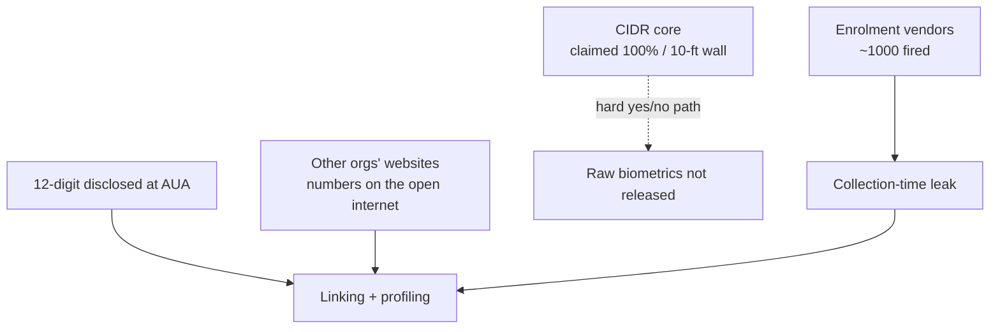

## Cases and examples from the lecture
- IRCTC vs the clerk: digital vs information asymmetry.
- Multiple state ration cards / voter IDs; ₹1 → 70 paise leakage.
- Nilekani / Infosys; world’s largest ID; second enrolment blocked.
- SC restriction on mandatory Aadhaar vs SIM-card Aadhaar.
- Gulshan Rai “100% secure” and Haryana 10-foot wall.
- Keshav, *The Hindu*: front wall, back door.
- IIT Delhi CS paper cited in Srikrishna draft.
- BSNL, NIC, telcos as published ASAs.
- ~1,000 enrolment vendors fired after journalistic inquiry.
- Pseudo-ID as the individual’s defence against linking.

## Key terms
| Term | Meaning in this lecture |
|------|-------------------------|
| UIDAI | Statutory authority for Aadhaar collection and database. |
| Aadhaar Act | The “procedure established by law” that makes collection legal. |
| Leakage | Share of welfare rupee that does not reach the target (here 30 paise). |
| Platform (Aadhaar) | Base database on which many participant-types connect and build. |
| Minimalist collection | Only basic identification data, not full demographics — Nilekani claim. |
| CIDR | Core identities repository behind the data-centre wall. |
| ASA | Enlisted technical path to CIDR (BSNL, NIC, telcos). |
| AUA | Face-to-face service agency (bank, telco, passport). |
| Yes/no authentication | AUA does not receive the biometric payload; only match result. |
| Weakest link | Cartoon/chain: not the wall; vendors, numbers, other websites. |
| Pseudo ID / VID idea | Substitute number so the raw Aadhaar is not left with every AUA. |

## Formulas / frameworks (if any)
- **Art. 21 applied:** Aadhaar Act ⇒ legality of collection is settled; **use, mandate, and security** remain open.
- **Leakage identity:** multiple IDs ⇒ ₹1 welfare → 70 paise; unique biometric ID is the state’s efficiency answer.
- **Layered access:** User → device → AUA → ASA → CIDR; compare to T31’s processor chain.
- **Weak-link audit:** core encryption ≠ no leak if collection vendors and downstream number-holders are open.

## Distinctions the instructor insists on
- **Legal** collection (Aadhaar Act) does not answer **mandatory use** or **security of the chain**.
- Party politics is the wrong frame; **every** government digitised; Nilekani had to work **across** parties.
- Aadhaar as **platform** is a design claim (orchestration), not “just a government file.”
- **Minimal data at collection** is the official theory; **thousands of vendors** are the practice.
- Supreme Court: Aadhaar not mandatory for all **fundamental** services; **SIM** still requires it in this lecture’s India.
- Gulshan Rai’s wall is **physical security rhetoric**; Keshav’s back door is the analytical point.
- He will **not** assert a proven leak **from CIDR**; he **will** assert vendor firing and public web dumps of numbers collected elsewhere.
- Authentication **yes/no** protects biometrics in transit **and** still leaves the **12-digit ID** and **linking** problem — same quasi-identifier logic as T31.
- DPDP still not law in this lecture; the safety debate is therefore still live.

## Exam-oriented recap
- Aadhaar is lawful (the Act), welfare-rational (70 paise, multiple IDs), and a Nilekani **platform** with a 12-digit unique key.
- Architecture: CIDR behind ASA/AUA; telcos are both.
- Risk is the **chain**: enrolment vendors (~1,000 fired), Aadhaar numbers sitting with AUAs and other websites, linking/profiling; pseudo-ID is the taught mitigation.
- SC cabined mandatory use; SIM/banking still pull the ID.
- “100% secure / 10-foot wall” fails the weakest-link test the cartoon and the IIT Delhi paper (in Srikrishna) were assigned to teach.

---

# Lecture T37: Privacy: The Indian Way — Part 03

**Playlist index:** 37  
**Transcript:** [37-privacy-the-indian-way-part-03.md](../transcripts/markdown/37-privacy-the-indian-way-part-03.md)  
**Video:** https://www.youtube.com/watch?v=8MDW4UP7Quc  
**Week / theme:** Week 12 / Indian data protection — PDP to DPDP, actors, localisation

## Learning objectives
- State the government’s terms of reference for the Justice Srikrishna Commission and why they put the data economy first.
- Map the three data actors in PDP/DPDP against GDPR language.
- Compare the Personal Data Protection (PDP) draft with the Digital Personal Data Protection (DPDP) bill as taught in class.
- Argue both sides of data localisation, including cost, jurisdiction, jobs, and corporate power.

## What this lecture actually teaches

### Privacy and unique identity both need regulation
The lecture opens on a dual need: **privacy** and **unique identity**. Both matter, so the state initiated regulation “well in time.” A bill existed by 2017. The instructor’s judgement of the first Indian personal data protection draft is that the drafters “did excellent job.”

The government’s terms of reference to the **Justice Srikrishna Commission** are described as a difficult order: **unlock the data economy while keeping citizens’ data secure and protected**. The instructor stresses the order of the sentence: **what comes first is unlocking the data economy**.

Digital India is not to be rolled back. The lecture rejects the idea of stopping being digital, returning to manual controls, or cutting internet connectivity in the name of privacy and then “nothing more.” Successful data businesses must not be deterred or destroyed. By the time the TOR was issued, Facebook and Uber were already in India. Uber is used as the extreme case: it does not run on traditional assets; it runs **purely on data**. Google is “right there” and even making cars. That is the new economy: do not destroy it, but take care of citizens’ privacy.

The government is said to recognise the **transformative potential of the digital economy** to improve lives, while upholding individual privacy. That pairing is why a regulatory initiative exists.

### How the 2019 PDP reached Parliament — and why it failed
The Union Cabinet presented the PDP in Parliament in **December 2019**. It did not pass as drafted by the Commission. Government **amendments** were added, mainly to give the state **more power to access personal data**. The instructor calls this, from one view, “undue powers,” while noting that government sees such access as needed for governance.

Justice Srikrishna’s public reaction is taught as a teaching beat, not as partisan commentary: “this is not the draft I drafted”; the amended bill would result in an **Orwellian state** (George Orwell, already referred to earlier in the course). The instructor refuses to “politicise” this as a party issue. Government as an institution feels it needs more control. The history of privacy in India, already covered, **cuts across political parties**.

The 2019 PDP was **dropped** the previous year (relative to the lecture). Government said it would go for an **alternate bill**. The current DPDP is presented as building on PDP: more **concise**, and in the instructor’s phrase more **inclusive**.

### Three actors: principal, fiduciary, processor
A sketch parallel to GDPR is the backbone of the lecture.

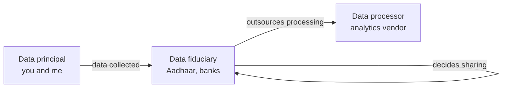

| GDPR term | PDP / DPDP term | Meaning in this lecture |
|-----------|-----------------|-------------------------|
| Data subject | **Data principal** | Individuals whose data is collected — “you and me” |
| Data controller | **Data fiduciary** | Guardian trusted with data; collects, stores, **decides** |
| Data processor | Data processor (same word) | Processes data **shared by** the controller |

**Aadhaar** is the instructor’s best example of a data controller/fiduciary.

Controller functions taught here: **collect**, **store**, and **take decisions** about data — with whom it is shared, what analysis is done, who does the processing (in-house or external). Many entities can sit inside “controller,” but decision rights are what make it a controller. “Fiduciary” is taught as someone who can be **trusted** with data.

A processor only processes data the controller shares. If analytics is outsourced, the analytics firm is the processor, **not** the controller.

When GDPR was discussed earlier, the point was that data passes hands and the principal **loses control** of custody and analysis. GDPR therefore made controllers **responsible for contracts** with processors. There must be a clear contract; **penalties apply to processors as well**. Before GDPR that was not the default: some contracts had liability clauses, some did not. GDPR made the domain aware that contracts and **financial implications** are required.

### DPDP 2022 as a public bill, read through experts
The bill under discussion is **Digital Personal Data Protection** — PDP with “digital” added — **DPDP**. It is open for public comments and available in the public domain.

DPDP 2022 has **22 clauses** plus experts’ notes. The instructor is not a lawyer; he is a teacher of information systems. He will not interpret the bill as legal expertise. Observations come from **expert views** and **opinion pieces in business newspapers**, because (as of the lecture) there is no journal article and no highly unbiased opinion. Which newspaper you read changes the side you get. He calls this **tertiary data**: compiling what lawyers said in public.

### Rule-making power and conflict of interest
Out of 22 clauses, the **central government has rule-making power in around 14**. A regulatory body is supposed to be **independent**, free from government influence. **RBI** is the comparison: it should take domain decisions not dictated even by government.

The instructor does **not** claim government should let data go uncontrolled. Government has a **legitimate need** to know people and investigate. The problem is **conflict of interest**: government is itself the fiduciary/controller in several cases (**Aadhaar**; **GST** is mentioned even though GST is not personal data). Government holds huge public data **and** can decide the regulation. “I make the law and I execute it” — both roles together are not correct. The estates should be independent, as judiciary is independent of legislative and executive. This is **an expert opinion quoted**, not a final verdict.

### PDP versus DPDP as compared in class
The first comparison point is the instructor’s own observation of size and scope.

| Feature | PDP (base document) | DPDP 2022 (as taught) |
|---------|---------------------|------------------------|
| Length | 14 chapters, **56 pages**, detailed | 6 chapters, **24 pages**, “very very concise,” about half the size |
| Scope | Trying to regulate **data as a whole** | **Personally identifiable data** only |
| Right to be forgotten | Explicit clause | Brought under **Right to Erasure**; lawyers say they **may not be the same** |
| Penalties | Lower | **Much higher**; **capped at ₹500 crore** for breaches |
| Principal liability | No penalty on principals | Penalty if a principal makes a **wrong claim** |
| Data classes | Three-tier: personal / **SPD** / **CPD** | Classification **done with**; only personally identifiable data |
| Localisation | SPD and CPD stored in India; cross-border **not allowed** | **Diluted**; no strong localisation clause |

**Right to be Forgotten vs Right to Erasure.** Forgotten would also apply to **data sharing among entities**. Erasure may not ensure that. Taught as a “minor issue,” but legally they are not treated as identical.

Higher penalties plus principal-side penalties show **more influence of other stakeholders**, not only the individual’s perspective. The bill also looks from the **corporation / business-entity** point of view. Firms do not want “irritation of complaints all the time.” Principal penalties will **probably reduce the number of complaints**.

### Three-tier classification that DPDP drops
PDP classified data as:

1. **Sensitive personal data (SPD)** — very much linked to individual space: **financial data, health data, passwords, matrimonial / personal-preference data**. Highly sensitive.
2. **Critical personal data (CPD)** — **not defined** in PDP. Government was given the right to decide what is critical for the country; government **did not define it**. The intended use: tell organisations that a category of individuals’ data **must reside in the country**, while other data may be stored elsewhere.
3. **Personal data** — the rest, neither critical nor sensitive.

DPDP has **no such three-tier classification**. It only says personally identifiable data. The instructor flags this as where “the politics or the debate actually comes in.”

In PDP, the last two categories (SPD and CPD) were recommended to be **stored within the country**. Cross-border transfer of SPD and CPD was **not allowed**. That is **data localisation**.

### Data localisation, GDPR parallel, and the classroom debate
Localisation is also called **data residency** or **data sovereignty** in some literature: citizens’ data should be stored in records/archives **within the country**, not go outside.

After PDP, government started “arm wrestling” with **WhatsApp, Facebook, Google, payment banks**: citizens’ data should be within the country.

GDPR’s related idea: cross-border transfer is **expressly permitted with only a few countries**; for the rest it must be **based on contract**.

The lecture then runs a long class debate. The instructor’s own first argument for localisation is **economic value of data**. Without localisation, MNCs can take Indian data home, analyse it, and **develop products for the Indian market from abroad**. Jobs and customised apps on Play Store built in the US from Indian data. Analytics could happen **in India**; results could build apps and digital services **here**. Without localisation, that value is transferred out.

A student notes India already **outsources analytics** — the country has competence. Localisation then becomes a **boost to Indian analytics**: do analytics within India; do not transfer the data out.

A second student argument is **jurisdiction**. If data sits in a US data centre, US law can force Azure (or similar) to share it. If it sits in India, Indian government has protection over it and it is not liable to share with other countries until it is India’s concern. Once citizens’ data go to country X, they come under **X’s jurisdiction**. If that country permits data trade, the data can be shared because it is **no longer within India’s jurisdiction**. For a data regulation to be effective, **data has to be within the country**. Once it leaves, the same laws cannot apply. The instructor accepts this as a **valid point**: localisation tries to ensure citizens’ data are protected **within the law of the country**.

The counter-weight: this can be **over-protecting individuals**. Controllers collect data for a purpose. If they analyse elsewhere they must change contracts — one corporate concern. DPDP **dilutes localisation**. Post-PDP the government wanted complete control; now, the instructor says, **thanks to corporate power**, localisation is not strict.

Another student argument: **security vs control**. Some MNC data centres in India were described (in a remembered article) as less secure than specialised facilities (an island data centre of a multinational). Firms may be willing to store there, but India would **lose control**. The instructor writes this on the board as: **plus = government’s control; minus = corporations losing potential value**.

He then prompts **data-centre economics**. A major negative for firms: **cost of operations goes up**. They previously used clouds whose warehouses were not in each home country. Localisation forces **dedicated data centres in each country**. Google (search “where are Google’s data centres”) has **rationalised** locations globally, often **close to hydroelectric projects** to save energy cost. That investment already exists. Localisation requires building centres **inside India**. They lose **scale advantages**. Storage cost goes up.

Plus side for India: **data-centre and analytics business** can prosper; new prospects for IT. Government has that rationale; corporations do not. If firms become **non-competitive**, they would not like to do business. DPDP rebalances: government now **permits cross-border transfer**. Dropping SPD/CPD classification also weakens the localisation argument, because that classification made the residency case stronger. Now there is only personally identifiable data, and localisation is **not very strict**.

The instructor warns against seeing this as “simply negative.” It **does not make economic sense for corporations**. Consultants also disagree that data centres are a huge job engine: they **do not create many jobs** but **use a lot of domestic resources**. Amazon in Hyderabad (as recounted): conditions of **~100 acres**, **full government security**, **no taxes**, employing perhaps **50–100** people. Storage facility ≠ IT services jobs. The instructor treats these as reasons government **relaxed** the strict localisation condition.

```mermaid
flowchart TB
    subgraph plus ["Localisation plus"]
        SOV["Jurisdiction stays Indian"]
        JOB["Analytics work in India"]
        DC["Domestic DC business"]
        CTRL["State control of citizen data"]
    end
    subgraph minus ["Localisation minus"]
        COST["DC cost and lost scale"]
        CLOUD["Breaks global cloud design"]
        SEC["Control vs possibly better offshore security"]
        COMP["Firms less competitive"]
        LAND["Land, power, tax giveaways; few jobs"]
    end
    plus --> DPDP["DPDP dilutes localisation"]
    minus --> DPDP
```

### Closing: watch the debate; data as the new oil
Indian regulation is **on debate**. Beware of newspaper articles that are overly critical of government or overly in favour. There are pluses and minuses. Government must **balance forces**. **Corporate interests are also important**; you cannot neglect them; **privacy is also important**.

Next class: **economics of privacy**. There are different stakeholders in data; none can be neglected. **“Data is the new oil.”** If oil becomes very expensive, manufacturing is not competitive. If privacy laws become very tight and **data becomes very expensive**, those businesses cannot survive or be profitable. Data must be protected, but it should not become **too expensive to do business with**.

## Cases and examples from the lecture
- **Uber** as a business with no traditional assets — purely data.
- **Facebook and Google** already in India when the TOR was written; Google “making car.”
- **Aadhaar** as data fiduciary/controller; **GST** as government holding huge public data (not personal data).
- **RBI** as the model of an independent regulator.
- Justice Srikrishna calling the amended PDP **Orwellian**.
- Post-PDP pressure on **WhatsApp, Facebook, Google, payment banks** for in-country storage.
- **Google data centres near hydroelectric projects**; **Amazon Hyderabad** land/security/tax conditions versus ~50–100 jobs.
- Student example of a specialised **island data centre** versus weaker Indian warehouses.

## Key terms
| Term | Meaning in this lecture |
|------|-------------------------|
| Data principal | Individual whose data is collected (GDPR data subject) |
| Data fiduciary | Controller: collects, stores, decides sharing and processing; “guardian” of data |
| Data processor | Party that only processes data shared by the fiduciary |
| SPD | Sensitive personal data — health, financial, passwords, matrimonial/preference data |
| CPD | Critical personal data — undefined in PDP; government could designate it; meant for in-country storage |
| Data localisation / residency / sovereignty | Citizens’ data stored inside the country so Indian law still applies |
| Right to erasure | DPDP substitute for PDP’s right to be forgotten; may not cover onward sharing |
| Rule-making power | Central government can make rules under ~14 of DPDP’s 22 clauses |
| Conflict of interest | Government as large fiduciary **and** rule-maker |

## Formulas / frameworks
**Three-actor model:** principal → fiduciary (decides) → processor (executes under contract). GDPR lesson reused: **controller–processor contract + processor liability**.

**PDP three-tier stack (dropped in DPDP):** SPD and CPD localised; residual personal data less constrained.

**Localisation ledger taught in class:** plus = control, jurisdiction, domestic analytics/DC business; minus = cost, scale, competitiveness, weak job creation, possible security/control trade-off.

## Distinctions the instructor insists on
- Unlocking the **data economy** is first in the TOR; privacy is to be upheld **without destroying data businesses**.
- **Fiduciary ≠ processor.** Analytics vendors process; they do not decide collection and sharing.
- **Right to be forgotten ≠ right to erasure** if sharing among entities is the issue.
- **Legal jurisdiction follows the data.** Once data is in country X, Indian PDP/DPDP cannot simply follow it.
- Localisation is not only a privacy slogan; it is a fight among **state control, corporate cost, and jobs**. DPDP’s dilution is taught as **corporate interest**, not as simple “privacy loss.”
- Government need for access is **legitimate**; combining **fiduciary + regulator** is the conflict, not the need itself.
- Srikrishna’s “Orwellian” remark is about **the amended bill**, not the original draft, and is not to be reduced to party politics.

## Exam-oriented recap
- TOR: unlock data economy **and** protect citizen data — economy named first.
- PDP 2019: Cabinet bill with extra **government access** powers; Srikrishna disowns it; bill dropped.
- DPDP 2022: 6 chapters / 24 pages vs PDP 14 / 56; PII only; 22 clauses; government rules in ~14; penalty cap **₹500 crore**; principals can be fined for false claims.
- Actors: principal, fiduciary (Aadhaar), processor; GDPR-style contracts and processor liability.
- PDP three-tier data (personal / SPD / CPD) and strict localisation of SPD+CPD **removed** in DPDP.
- Localisation plus/minus: jurisdiction and Indian analytics vs DC cost, scale, few jobs, corporate non-competitiveness.
- Next theme already announced: if privacy law makes data as expensive as scarce oil, data businesses die.

---

# Lecture T39: Information Privacy — Economics and Strategy — Part 01

**Playlist index:** 39  
**Transcript:** [39-information-privacy-economics-and-strategy-part-01.md](../transcripts/markdown/39-information-privacy-economics-and-strategy-part-01.md)  
**Video:** https://www.youtube.com/watch?v=qXHNviJSQD8  
**Week / theme:** Week 13 / Economic value of privacy — contracts, WTP/WTA, privacy paradox

## Learning objectives
- Explain why privacy must have an **economic value** if businesses are to spend on it.
- Show why cloud/controller–processor **contracts** still use thumb rules instead of a valuation model.
- Run the Gmail classroom experiment as **WTP vs WTA** and name that gap the **privacy paradox**.
- Apply **loss aversion**, **endowment effect**, and **stated vs revealed preference** to privacy pricing.

## What this lecture actually teaches

### Why economics and strategy at all
The topic is **information privacy: economics and strategy**. Two questions: is there an **economic value** to privacy, and where does it matter? Strategy (core of some firms’ business models, differentiation) is flagged for the next session.

From a **business perspective**, if privacy has no economic or strategic implication, it is “not worth spending much time,” because business is about those aspects.

Platforms built on individuals’ data are part of social life and happiness; they can also take happiness away and bring pain in different forms.

### Valuation is required because contracts are required
When privacy is treated as an **economic good**, some value must be assigned or one cannot speak in economic terms. Valuation is **practically important** in contracts between organisations. In the regulated world, a **data controller and a data processor** exchanging data must have a contract.

**GDPR insists** on a specific contract and on sharing losses/penalties if there is a breach. The contract needs a clause: **what is the penalty if there is a breach?** How do you ascertain that value? The asset exchanged is a **database of personally identifiable data**. How do you attribute a value to that database?

Although the topic is important, a **well-established method for valuation of privacy still remains an open research question**. Some publications are appearing; by and large it is open.

Cloud contracts are especially hard. Regulation requires firms to have contracts; **writing them is not easy**. The first difficulty is ascertaining the value of privacy.

### Industry practice: 5 percent of contract value
An MS scholar of the instructor did an **exploratory study** of how organisations in different domains manage contracts: what the document says, how they treat the value of privacy. They interviewed **CIOs** of leading organisations (names not given).

The instructor sat in on one interview: a **leading healthcare provider** in India. Healthcare data of Indian customers is stored in the cloud via an IT service provider. On data-breach clauses: there are **standard legal terms**, but they **do not do any valuation**. The typical clause is **5 percent**: the penalty is **5 percent of the contract value**. A **thumb rule**, not a model. Actual cost could be much more or less than 5 percent. Industry agrees there is **no clear model** to determine the value and then contract on that model. In the absence of a model, they use thumb rules.

That can cause **major losses** for client or provider if actual breach losses are very high.

Regulation supplies a number when models do not: **DPDP** (as proposed in India) has a penalty **cap of ₹500 crore**. That specific number can anchor a decision. Post-regulation there are **guidelines**, not a valuation model.

### Why a million-record database still has no price
A researcher who tries to price a million-record database hits a difficulty: privacy is **not straightforward**. If you ask an individual how much they value their privacy, the answer is **context specific**. What you feel today in one setting may not be what you feel in another. Privacy scholars have written this.

### Classroom experiment: Gmail WTP then WTA
Students use phones (menti.com; code given in class). Background: most use **Gmail / online email**, **do not pay** for it, no subscription. Emails are read — Google says **not by a human but by software** — for **advertising**, which is the revenue model, and users accept that. Users are still concerned: emails are read by someone; **sometimes humans too**; Google admits that.

**Question 1 — willingness to pay (WTP).** Hypothetical Google premium: pay a **price per month** so that **not even software will scan Gmail**. How much will you pay per month?

**Question 2 — willingness to accept (WTA).** Google will **pay you** per month if you **let humans read** your Gmail. How much will you accept?

The class followed the **expected pattern**. That pattern **is the privacy paradox**.

We **talk** about privacy and want to protect it; we are advocates. When we must **pay to protect** it, amounts go toward the **lowest** option (₹100, and students wanted a **₹0** option that was not offered). When money is **offered** for giving privacy away, we want the **maximum**.

### Privacy paradox = WTA higher than WTP
In economic literature: **WTA** and **WTP**.

- **Willingness to pay** to protect privacy **tends toward the lowest value**.
- **Willingness to accept** (to let privacy be taken) is **higher**.
- Average WTA **>** average WTP. That is **human behaviour**.

The claim that we will protect privacy “at any cost” is **talk**. The **economic man** in you differentiates WTP and WTA. There is a **paradox** among humans, visible even in a small sample. Economists have run several experiments on privacy behaviour; the instructor designed this one and “this has been working.”

```mermaid
flowchart TB
    subgraph stated ["Stated preference"]
        S1["Survey: privacy = 5/5"]
    end
    subgraph experiment ["Revealed in the Gmail game"]
        WTP["WTP to block scanning: low"]
        WTA["WTA to allow human reading: high"]
    end
    S1 -->|"talk vs behaviour"| WTP
    S1 -->|"talk vs behaviour"| WTA
    WTP --> PX["Privacy paradox"]
    WTA --> PX
    PX --> BE["Behavioural economics<br/>not neoclassical"]
```

### What does **not** explain it, and what does
Students offer: value of Gmail as a medium; whether email is the primary channel; type of data; culture; awareness. The instructor grants **culture-to-culture** differences and that the class is in a fairly homogeneous culture, but the question is **individual behaviour** inside that culture. Gmail **does** hold private communications, yet people still do not feel it is worth paying much.

Theoretically this is **irrational** relative to the **economic man** of **neoclassical economics** (profit-maximising, not carried away by emotions). Here **emotions play a role**. The behaviour falls under **behavioural economics**: economic man is **not very rational**; decisions are carried by **pain or loss**. Humans are **loss averse**. Pain gets **higher priority than gain**. For the same decision with both pain and gain, the focus is on **pain** — “you do not want a pain.” Read **Daniel Kahneman** and others.

### Privacy calculus: loss aversion and endowment effect
In the mind’s **privacy calculus**, two behavioural concepts run:

**1. Loss aversion (prospect theory).** A graph in the slides: **loss is more significant than gain**. Textbook-style example: **100% chance to gain $450** versus **50% chance to gain $1000**. Expected value is higher on the gamble, but people typically take the **certain** $450 because the other option has a **chance of loss**. Loss is a **pain**. **Embarrassment is a pain** (the instructor’s recurring assertion). We try to avoid it. That is loss aversion in **prospect theory**.

**2. Endowment effect.** Subtle idea we all carry. Trophy example: a small trophy from **fourth standard** in the living room. Someone (an “akri” / scrap buyer in the telling) weighs it — 300 grams — and offers **₹500** for the metal. You will not sell at metal cost. Even **₹50,000** may not be enough. It is **your trophy**. There is **parting pain**. For some products and services, price is **not** cost of material + production + margin, because **endowment is built in**. When something is yours and you must part with it, the cost is hard to assert.

Both effects show up in the Gmail experiment. A 15-year Gmail user enjoys service and expects **some privacy**. Taking that privacy away is taking something already owned — **pain**, so **WTA is high**. Private data is yours; there is loss. There may also be **opportunism** in a small sample (take the maximum money). If you enjoy a benefit and must part with it, endowment appears. Potential **embarrassment**, **social cost**, **loss of face** are pains; imagining them raises perceived cost/value.

### Privacy is a personal product, so one price does not exist
Privacy is a **very personal product**, not a physical tangible good. It is about you, what you feel about yourself and your data. That is why behavioural pricing enters. WTA and WTP **themselves** assign **different values** depending on whether the question is **protect** or **sell**. Valuation cannot assign **one value to privacy at all times independent of context**. **Privacy is context specific**.

Scholars still attempt WTA/WTP and surveys; all are **subject to variation by context**.

### Stated preference vs revealed preference
The last teaching beat, previously “not touched”: economists use a **contingent valuation** technique for privacy and related evaluations.

| Concept | How it is obtained | What the lecture shows |
|---------|--------------------|------------------------|
| **Stated preference** | Public statement / survey: “How important is privacy?” 1 to 5 | Answer is **5** — very important |
| **Revealed preference** | Cannot get it from that survey; **observe**, or change questions, or run **games** like Gmail | Although 5 was available, behaviour goes to **option 1** |

**What people think and what people actually behave** differ for privacy and privacy evaluation.

### Close of the economics block
Economic value of privacy — especially of **databases** — is important; valuation is important; **models are still evolving**. Guiding theories are **behavioural economics**, especially **WTA and WTP**. Next: a case at **organisational / aggregate** level on factors that influence the **trade of private data**.

## Cases and examples from the lecture
- GDPR controller–processor contract and shared breach losses.
- DPDP penalty cap **₹500 crore** as a decision number when no model exists.
- Indian **healthcare CIO**: cloud-stored patient data; breach penalty = **5% of contract value**; no valuation model.
- **Gmail** free account; software scanning for ads; hypothetical premium vs pay-to-scan.
- **$450 certain vs $1000 at 50%** — loss aversion / certainty effect.
- **School trophy** vs scrap-metal price — endowment / parting pain.
- Instructor’s own **15 years of Gmail** as endowment.

## Key terms
| Term | Meaning in this lecture |
|------|-------------------------|
| Valuation of privacy | Assigning economic value to PII databases so contracts can set breach penalties |
| Thumb rule | Industry substitute for a model — here **5% of contract value** |
| WTP | Willingness to pay to **protect** privacy (tends low) |
| WTA | Willingness to accept money to **give up** privacy (tends high) |
| Privacy paradox | Advocate privacy in talk; cheap to buy protection, expensive to sell it |
| Loss aversion | Pain of loss weighted above equivalent gain; prospect theory |
| Endowment effect | Extra value because the thing is already yours; parting pain |
| Privacy calculus | Mental trade-off when deciding about privacy |
| Stated preference | What you say in a survey |
| Revealed preference | What you do in a game or in the market |
| Contingent valuation | Economist’s tool using those two preference types |

## Formulas / frameworks
**Contract problem:** no model → thumb rule (5%) or statutory cap (DPDP ₹500 crore).

**Behavioural privacy model taught in class:**

```mermaid
flowchart LR
    CTX["Context<br/>data type, culture"]
    LA["Loss aversion<br/>pain > gain"]
    EE["Endowment<br/>parting pain"]
    CTX --> WTP
    CTX --> WTA
    LA --> WTA
    EE --> WTA
    WTP["Low WTP"]
    WTA["High WTA"]
    WTP --> GAP["WTA > WTP"]
    WTA --> GAP
    GAP --> VAL["No single price<br/>for privacy"]
```

**Prospect-theory illustration:** certain $450 preferred to 50% of $1000 even though EV is higher on the gamble.

## Distinctions the instructor insists on
- Privacy without **economic or strategic** implication is not a business topic.
- **Regulation requires contracts**; contracts require a number; **research has not supplied a stable model**.
- **5% of contract value is not valuation** — it is a thumb rule that can under- or over-shoot real loss.
- **WTA is not WTP.** The paradox is that gap, not that people “don’t care.”
- This is **not** neoclassical rational man; it is **behavioural economics** (Kahneman): loss aversion and endowment.
- **Stated 5/5 on a survey is not revealed behaviour.** Contingent valuation exists because those two split.
- Privacy value is **context specific**; there is no all-weather unit price for a database.

## Exam-oriented recap
- Why value privacy: controller–processor contracts, cloud, GDPR-style shared breach liability.
- Industry: **5% of contract value**; DPDP cap ₹500 crore as a guideline number.
- Gmail quiz: low pay-to-block-scan, high accept-to-allow-human-read → **privacy paradox**.
- Explain with **loss aversion** (pain, embarrassment, certainty over gambles) and **endowment** (trophy / 15-year inbox).
- Stated vs revealed preference; contingent valuation.
- Next case moves from the individual to **organisations trading private data**.

---

# Lecture T40: Information Privacy — Economics and Strategy — Part 02

**Playlist index:** 40  
**Transcript:** [40-information-privacy-economics-and-strategy-part-02.md](../transcripts/markdown/40-information-privacy-economics-and-strategy-part-02.md)  
**Video:** https://www.youtube.com/watch?v=LwARGPiu2oc  
**Week / theme:** Week 13 / Aggregate data trade — ShopSense × IFA case

## Learning objectives
- Reconstruct the HBR discussion case *The Dark Side of Custom Analytics* (Davenport and Harris) as presented in class.
- Judge the proposed grocery–insurer data deal from **ShopSense** and **IFA** sides: money, law, trust, strategy.
- Separate **legal consent** in a loyalty programme from **ethical** use of grocery data to set health premiums.
- Contrast **Progressive**’s transparent driving logger with covert supermarket-to-insurer sharing.

## What this lecture actually teaches

This session is a **student-led case** (Group 5: Manu and Bhuvan) plus instructor steering. The article is presented as **Thomas Davenport and Jeanne Harris**, *The Dark Side of Custom Analytics* — an HBR-style discussion of a supermarket sharing loyalty data with an insurer.

### The two firms
**ShopSense** — Dallas-based US supermarket chain. Large loyalty programme. Collects personal information and, in some cases, **medical-related** information to suggest products and discounts. **In-house analytics** on loyalty data; **pattern-based coupons** (e.g. milk / health products). Scanner information has already been shared **without customer knowledge**; the **CFO** line taught in class is that the company is **making more money from selling the data than from selling more meat**.

**IFA** — founded 1972; one of the largest US **life and health** insurers. Collects customer data from multiple agencies to set **premiums**. Health-related inference example: heavy **meat** or **alcohol** purchase → higher chance of cholesterol / BP issues → **charge more premium**.

ShopSense has already shared **10 years of Michigan** data with IFA as the proposed deal’s factual backdrop.

### Cast (as named in the presentation)
| Side | People |
|------|--------|
| IFA | Laura Brickman (Regional Manager, West Coast), Archie Stetter (senior analyst), Geneva Hendrickson (SVP ethics and corporate responsibility), O.Z. Cooper (general counsel), Jason Walter (CEO), Rusty Ware (analyst; other data sources) |
| ShopSense | Steve Worthington (chief analyst), Alan Atkins (COO), Denise Baldwin (HR), Donna Greer (CEO) |
| Four outside experts on “responsible” use | George Jones (CEO, Borders), Katherine Lemon (Boston College), David Norton (Harrah’s relationship marketing), Michael McCallister (CEO, Humana) |

### The scene that opens the case
Laura shops, remembers the **acquisition / data-sharing agreement 14 months earlier**, looks at receipts and coupons. At checkout she had been thinking about **sunscreen**; the back of the receipt prints a **sunscreen / disease benefit and a coupon** — climate-aware targeting. She realises grocery data shows **household food and health-related buying**, which an insurer could use to **assign premiums**. She flies to discuss with Steve; they obtain the Michigan extract.

### IFA internal debate (as presented)
- Laura: ShopSense loyalty data is worth getting.
- Archie: rich **household** insight; upcoming disease / premium impact.
- Rusty: IFA already buys **credit, financial, drug and product** data from other sources.
- O.Z. Cooper: if customers pay **higher premiums**, possible **legal problem** for ShopSense’s side.
- Jason Walter (CEO): if IFA builds **proprietary health indicators**, that is a **huge hurdle for competitors**. **Exclusive rights** to this dataset would be a hurdle competitors cannot easily get over.

### ShopSense internal debate (as presented)
- Steve: share data, gain economic output.
- Alan Atkins: if customers find out data is **sold to an insurer**, they may **stop using the loyalty card**, which **stops the data inflow** ShopSense needs to customise.
- CFO: more money from **selling data than meat**.
- Denise Baldwin (HR / privacy): if IFA uses data, could it identify **individual customers as employees** of particular companies? How will IFA use it?
- Donna Greer: should we **charge more**, because selling may **dilute customer relationship**; insurers can price more accurately with this data.

### Instructor restatement of the deal
ShopSense invested in analytics to **personalise marketing, coupons, discounts**. It already shares some scanner data without customer knowledge. IFA wants more data for **risk analysis** so it can **price premium more accurately**.

**Should ShopSense go ahead?** Class: revenue model, but **without customer knowledge** → legal and ethical problems.

### ShopSense: pros, cons, expert tone
**Pros taught:**
- The deal is **legal in all states where the company operates**. At the time of writing, **none of the states IFA did business in** had laws prohibiting this exchange. US **state-wise** regulation: **California** stricter; other operating states were not blocking this.
- About **$1 billion additional annual profit**; **no cost** to produce the data they already have.
- Insurer might build **wellness programmes** / personalised offerings — management considers this a plus.

**Cons taught:**
- Done **without customer knowledge**; customers may **opt out of loyalty**, stopping data and harming customisation.
- Expert opinion: **high risk, short-sighted**, not keeping customers at the core; **trust** may be lost.
- **Transparency** is very important.
- ShopSense would **lose control** of how data is used.
- Suggestion: a **combined programme with transparency**.

### Legal versus ethical — the instructor forces the distinction
If it is legal in the US and they comply, why a customer problem?

Answer developed in class: loyalty enrolment includes **acknowledgement / consent** that data is used for **analytics**, in return for extra discount. ShopSense then has a **contract** with IFA for **specific** data IFA needs — not sharing with “everyone.” **Legally** they stand.

The **con** is relationship harm: meat / cholesterol-related buying could **raise insurance premium**. When the customer learns grocery receipts affected life-insurance price, even after analytics consent, the **economic hit** feels like betrayal. They may leave the shop. **What is legal need not be ethical.**

Data **belongs to the customer** (third party). Sharing can always be **challenged**. Instructor: you are highlighting **consequence of sharing**. Individual data with the insurer, not only ShopSense; insurer monitors **what you eat and drink** through a grocer. That is the ethical problem. A **new model**.

```mermaid
flowchart TB
    C["Customer<br/>data owner, not in the room"]
    S["ShopSense<br/>loyalty + scanner data"]
    I["IFA<br/>prices health premium"]
    C -->|"consent for analytics / discounts"| S
    S -->|"$1B, 10 years Michigan"| I
    I -->|"higher premium / personalised product"| C
```

### Progressive: personalised insurance the customer can see
The case refers to **Progressive** (auto). Instructor’s US memory: ads — **if you drive safe, you get money back**. Model: everyone starts from the same premium; a **data logger / sensor in the car** monitors acceleration and speed; safe driver → **lower premium**, rash driver → **higher**. **Differentiated / personalised insurance**. **Money back** means charging less for safe driving.

Laura is pursuing the **same idea** with grocery data: **personalised health insurance** — a product for each individual. Difference stressed later: Progressive’s logger is **in the open**; the ShopSense path is **without the shopper knowing** the insurer is watching the trolley.

### “If you do not pay, data is what they use”
A student asks about **Google Pay / PhonePe / Paytm** charging nothing. Instructor: if you do not pay, **data is what they actually use**. The case throws light on **data trade** customers do not see, and how they may **pay for it or be adversely affected** without knowing. Many contexts.

### IFA side: a very good deal — with noise
Class consensus: **extremely valuable** data; habits → premium and product design quickly. IFA would be “too happy.”

Instructor / presenters add:
- Public **understands** insurers analyse risk.
- Possible **positive spin**: wellness programmes, discounts, Progressive-style rewards.
- **Accuracy may not be high**: people buy for **family** (father buying sweets for children). Should that raise **his** premium? **Outliers / noise**, but **patterns still exist**.
- **Battered customer syndrome**: once you profile, you focus on the **top 10–15%**; the remaining **85–90%** get worse service and may leave. A student suggests **family bundling** to absorb household buying noise.

Expert tone: can be good for the customer **if drafted as win-win**, with **transparency**. Hidden multi-source collection makes people **inhibited** about buying more products. **Public backlash** risk. Both companies’ managements are thinking “**what will be disclosed**” and deciding from that — experts say that must change; **ethical behaviour across the organisation**, any industry.

### Evidence, not a hypothetical: the pilot
Laura and ShopSense analytics ran a **pilot before formalising**. It was **successful**. **Correlation** between **purchase** (not proven consumption) of **trans-fat** products and **insurance claims**. Noise exists; **patterns nevertheless exist despite the noise**. The proposal is **evidence-based**. Strong argument for the deal.

### Data for competitive strategy
The instructor’s own addition, aimed at the strategy module: IFA can offer a product **competitors cannot**, because of data. **Personalised health insurance** rolled out **first** is **differentiation**. Subtle in the case; it is a **competitive strategy with a data partner**. “Data is also for strategy.”

If IFA does not buy, **anyone** can — ShopSense is ready to sell. The **CEO of IFA** says **exclusive rights** would be a hurdle competitors cannot get over. That is an important IFA consideration.

## Cases and examples from the lecture
- ShopSense loyalty coupons (milk, health, **sunscreen on a sunny day**).
- IFA inferences from **meat / alcohol** to cholesterol and BP.
- **10 years of Michigan** data already shared in the story.
- CFO: **more money from data than from meat**.
- **$1 billion** extra annual profit, zero marginal cost.
- **California** vs other states’ privacy law.
- **Progressive** in-car logger; “drive safe, money back.”
- **Google Pay / PhonePe / Paytm** as “free” services that live on data.
- Pilot: **trans-fat purchases ↔ claims**.
- Exclusive dataset as a **competitive hurdle**.

## Key terms
| Term | Meaning in this lecture |
|------|-------------------------|
| Loyalty programme | Legal hook: customer consents to analytics in exchange for discounts |
| Scanner information | Item-level purchase data already traded without shopper knowledge |
| Personalised insurance | Premium/product fitted to **individual** behaviour (driving or grocery) |
| Legal vs ethical | No prohibiting statute ≠ no trust/relationship harm |
| Battered customer syndrome | After profiling, service concentrates on the top slice; the rest leave |
| Pilot / evidence-based deal | Trans-fat–claims correlation shown **before** the contract |
| Exclusive data rights | IFA’s hoped-for hurdle against rival insurers |

## Formulas / frameworks
**Two-firm ledger**

| | ShopSense | IFA |
|--|-----------|-----|
| Gain | ~$1B; already-paid analytics asset | Risk insight; new product; exclusive moat |
| Legal story | Loyalty T&Cs; state law silent | Insurers are expected to underwrite |
| Break | Loyalty opt-out; lost control; PR | Noisy household baskets; backlash; ethics |

**Progressive vs ShopSense–IFA:** same personalisation idea; Progressive **shows the sensor**; grocer-to-insurer path **hides the sensor**.

## Distinctions the instructor insists on
- **Legal in the United States at the time of the case** does not cancel an **ethical** and **relationship** problem.
- Loyalty consent for **analytics / coupons** is not the same, in customers’ minds, as **selling to an insurer who raises premiums**.
- The customer is the **third party** whose data is traded while they are **not in the negotiation**.
- Purchase ≠ consumption; data has **noise**, but the pilot still found **real patterns**.
- This is not only a privacy case: it is **data as competitive strategy** (personalised product, exclusive rights).
- Free consumer apps that “do not charge” are in the same family: **data is the price**.

## Exam-oriented recap
- ShopSense: loyalty + analytics + covert scanner sales; IFA wants grocery data to **personalise health premiums**.
- Legal in operating states then; **~$1B**; wellness spin; **trust, opt-out, loss of control** on the con side.
- Ethical core: **eating and drinking monitored by an insurer through a grocer**.
- Progressive = transparent personalised auto insurance; IFA path = same logic, weaker notice.
- Pilot correlation (trans fats ↔ claims) + exclusive data as **strategy**.
- Next session continues the case: trust survey, GDPR principles, RBV dependence, joint product.

---

# Lecture T41: Information Privacy — Economics and Strategy — Part 03

**Playlist index:** 41  
**Transcript:** [41-information-privacy-economics-and-strategy-part-03.md](../transcripts/markdown/41-information-privacy-economics-and-strategy-part-03.md)  
**Video:** https://www.youtube.com/watch?v=EjOF_cVzvNE  
**Week / theme:** Week 13 / From data trade to privacy strategy — trust, RBV, joint product

## Learning objectives
- Use the **McKinsey 2019** confidence numbers to explain why retail trust is a **strategic** asset.
- Apply **purpose limitation, transparency, and data minimisation** to the ShopSense–IFA decision.
- Show why IFA’s analytics strategy fails a strict **resource-based view** test (data not owned).
- Explain why **notice + old consent** is weak, and why a **joint product** is the smarter ethical design.

## What this lecture actually teaches

The session continues the ShopSense / IFA case and turns it from economics toward **privacy as strategy** (next class).

### McKinsey 2019: who is trusted with data
A **McKinsey 2019** survey of how industries are perceived on privacy. **Healthcare and financial services** (IFA’s sector) tend to have a **better image** of how they handle data than other sectors. **Consumer packaged goods, automotive, public sector / government** are weak. **As low as 10 percent** of respondents have confidence in the **retailer** handling the data.

That is why **trust** is even more important for a grocer. If a retail company establishes that data will be handled **responsibly**, that can become **competitive advantage from a strategy perspective** for retail as well.

### Three pointers for ethical data decisions
GDPR is “one set of law” with high standards, being copied or implemented in different countries. Three pointers for organisational decisions:

1. **Purpose limitation** — personal data processed **only for the purpose for which it is collected**, and that purpose is **disclosed**. Grocery data for coupons is **not** for determining insurance premiums.
2. **Transparency** — customers get a **say** on whether data is shared with an **external partner**.
3. **Data minimisation** — in the age of big data, collect **only what is necessary** (e.g. to personalise coupons). Store so that if the customer later wants **deletion**, the organisation can delete from **one place**.

With these, the organisation takes a **responsible** approach and **builds trust**.

### Selective disclosure is not transparency
Instructor: the “disclosure” we see is often **not 100% transparent transfer of information**. It is **selective disclosure** suiting the organisation. That practice **plays into the McKinsey survey** — low confidence because firms disclose only what they want about use and sharing. More strictness would raise confidence.

A student: under purpose limitation, customers still **lack control** over processing and where data is used. Presenter agrees: loyalty sign-up, we **assume** a purpose or **do not fully understand** sharing. Disclosing that would **increase trust**.

### Amazon in the case: loyalty as a chance to charge more
The case refers indirectly to **Amazon** (called “a company”). Amazon **charges customers differently** — **price discrimination**. Same product, different price for you and me. In India Amazon is more a **marketplace**, but the US story taught here: they actually **charge loyal customers more**. Loyal customers may pay more than **new** customers; **they were sued**.

Logic: if you are loyal, Amazon knows you are **locked in** and will come back, so it can charge more. **Very opportunistic**. At some point they did that and were sued.

How firms make you loyal, sign you into a loyalty programme, **track you**, then see that you always return — an opportunity to **charge more**. They have all the data. Classic Bezos line taught: **“We do not throw away any data.”**

Data trade can be **very good or profitable** for organisations and can **hurt individuals** directly and indirectly. This case: you may **pay more premium** or **pay more prices for the same product** if your data is shared. The customer can be a **victim** and can **agree to sharing without knowing consequences**. That is why **GDPR-like regulation** has come. Existing agreements/law often **protect data trade but not customers**. New regulation is meant to close that. **Limiting purpose**: collected for better products and services, **not** for insurance premiums.

```mermaid
flowchart TB
    COL["Collect for coupons / loyalty"]
    PL["Purpose limitation"]
    TR["Transparency / customer say"]
    DM["Minimisation + deletable store"]
    COL --> PL
    COL --> TR
    COL --> DM
    PL --> TRUST["Retail trust as advantage"]
    TR --> TRUST
    DM --> TRUST
    SEL["Selective disclosure"] -->|"explains ~10% retail confidence"| LOW["McKinsey low trust"]
```

### Strategy based on analytics: future challenges
For IFA, ability to offer a **new product based on analytics** is a **differentiation strategy**. Is a business strategy based on **customers’ data** a good idea? Future challenges?

Class: **new regulations** (GDPR hit marketing agencies); **government / surveillance** (Snowden, next case) can shock a whole industry, not only the US.

Instructor’s own challenge: **dependence**. This strategy is based on a **resource**. In **Resource Based View (RBV)** of business strategy: **valuable, rare, inimitable** resources. Data is valuable and rare; they are building a strategy. **But is the data always in IFA’s control?** **Data is not their own.** It is **bought from somebody else**. They depend on another entity.

If ShopSense later sees IFA’s successful strategy, it can **charge more**. **Dependence and opportunism** in business: every company can become opportunistic. Competitors do not have ShopSense; ShopSense has it — classic **VRIO / RBV** story — **but the resource is not in IFA’s control**.

Contrast **Amazon**: recommender strategy on **historical data they fully control**, rare, valuable, inimitable because others do not have that history.

Tomorrow ShopSense says IFA will not pay enough, or **someone else will pay more**, and sells to IFA’s **competitor**. Sustaining the strategy depends on a **third-party data vendor**. They **do not possess** the resource; they **buy it**. That is the future-challenge proposition.

A student: **banks** already have spend analysis; if they sell insurance they **own** the resource and could beat IFA. Instructor: those who have access to data, as far as this case is concerned, yes.

Another student: **Knowledge Based View (KBV)** versus RBV — raw data not owned, but **upgraded to knowledge** that the company owns. Instructor: **absolutely**, but continuing the product still needs the **raw material**; **dependence remains**.

### The ethical problem restated
The broader question from the first slide: it is **the customer’s data** that is exchanged; the customer is the **affected party** but **not in the scene**. Two parties stand there **selling “you and me”** and making money or strategy; **I am not involved**. That is the ethical problem.

If this becomes public (social media less prevalent at the time of writing, but it can blow up), **ShopSense’s image** is hit because ShopSense shared.

### Can all three get what they want?
Wanted outcome: ShopSense gets **money**, IFA gets **new products / strategy**, customer is **not affected**.

Student proposal: **option** with **benefits** if they share; opt into a programme; based on purchase pattern, **lower premium or discounts**. Highlight benefits; let them choose.

Another student: in **car insurance**, third-party cover is **mandatory**; first- and second-party are not. Here it is **opposite**: the **third party is affected** and not highlighted.

Instructor shapes this: take consent **again**, draft as a **programme** — not IFA’s product alone but a **joint product** of retailer and insurer. Then it is clear both jointly offer it; **you can expect they will share resources**. That is a **major decision**; both must agree.

Further student: ShopSense should **inform** loyal customers that data is shared with IFA, with a **positive** frame (better insurance benefits).

Two different ideas: (1) **inform** that data will be shared; (2) **consent**. Instructor: **how many will give consent?** People do not have time. “**It is not working anyway.**”

Compromise suggested: notify, allow **opt-out** (maybe 10 in 100). Instructor’s challenge: **companies are already doing that**. They have consent for sharing; **no legal issue**. **Mandatory notice is difficult**: so many notices, **we do not pay attention**, especially from a grocer. Deals still happen. **Attention problem**. Legally right; **ethical issues continue**.

So the **joint product** — not “IFA product” but **“IFA–ShopSense insurance product”** — is **clear communication**. **One entity** as far as this product is concerned. Then you **do not question data sharing** in the same way. **Smarter solution if they can agree**. Otherwise: **legally right, ethically wrong**.

```mermaid
flowchart LR
    IFA["IFA wants<br/>new product"]
    SS["ShopSense wants<br/>data revenue"]
    CU["Customer wants<br/>not to be sold"]
    OLD["Hidden sale + old T&Cs"]
    NEW["Joint wellness product<br/>opt-in"]
    IFA --> OLD
    SS --> OLD
    OLD -->|"customer absent"| ETH["Legally right, ethically wrong"]
    IFA --> NEW
    SS --> NEW
    CU --> NEW
    NEW --> WIN["Sharing is the product"]
```

## Cases and examples from the lecture
- McKinsey 2019: healthcare / financial services trusted; retail confidence **~10%**.
- GDPR as the high-standard template other countries copy.
- **Amazon** loyalty / lock-in **price discrimination**; sued; Bezos: do not throw data away.
- Snowden flagged as the **next** shock to industry (preview of T42).
- Amazon recommenders as RBV **owned** data vs IFA **bought** data.
- Banks’ spend data as a rival resource for insurance products.
- Motor insurance: **third-party cover mandatory** — inverted here, because the data subject is the neglected third party.
- Notice fatigue: grocer emails nobody reads.

## Key terms
| Term | Meaning in this lecture |
|------|-------------------------|
| Purpose limitation | Use only for the disclosed collection purpose |
| Transparency | Customer say on external sharing; not selective disclosure |
| Data minimisation | Only necessary fields; deletable from one store |
| Selective disclosure | Organisations telling only convenient uses — drives low trust |
| RBV / VRIO | Strategy on valuable, rare, inimitable resources you **control** |
| Dependence / opportunism | Vendor can raise price or sell the same data to a rival |
| KBV | Insights/knowledge may be owned even if raw data is not; raw-material dependence remains |
| Joint product | Co-branded ShopSense–IFA insurance so sharing is visible in the offer |
| Attention problem | Notices exist; customers do not read them, so ethics are not fixed |

## Formulas / frameworks
**Ethical decision triad:** purpose limitation + transparency + minimisation → responsible handling → **trust as retail advantage**.

**RBV test on IFA:** data is valuable and rare, **not inimitable-in-possession**, because **ShopSense can resell**. Amazon passes the test; IFA does not.

**Remedy ladder taught:** more disclosure < extra consent (low uptake) < notices (no attention) < **joint product** (sharing is the product).

## Distinctions the instructor insists on
- **Financial services look more trusted than retail** in McKinsey 2019; a grocer selling to an insurer is therefore **especially** dangerous for ShopSense.
- Disclosure as practised is often **selective**, which **is** the confidence problem.
- **Purpose limitation** forbids using coupon data to **set premiums**.
- **RBV fails** if the strategic resource is **rented**. KBV does not erase that dependence.
- The ethical scandal is not only misuse; it is that **the person is not in the deal**.
- **Legal consent + notices** already exist and **do not solve ethics**, because of **attention**.
- **Joint product** is offered as clearer than another T&C checkbox.

## Exam-oriented recap
- ~10% retail data-handling confidence vs better healthcare/finance image.
- Three GDPR-style pointers: purpose, transparency, minimisation (and one-place deletion).
- Amazon: loyal customers charged **more**; sued; never throw data away.
- IFA strategy = differentiation on **un-owned** data → vendor opportunism.
- Customer absent from two-party trade = ethical core.
- Notices fail; **IFA–ShopSense insurance** as the design that puts the customer in the loop.
- Bridge to next class: **privacy as strategy** (Apple vs safety / Snowden).

---

# Lecture T42: Privacy — Strategy and Safety — Part 01

**Playlist index:** 42  
**Transcript:** [42-privacy-strategy-and-safety-part-01.md](../transcripts/markdown/42-privacy-strategy-and-safety-part-01.md)  
**Video:** https://www.youtube.com/watch?v=All1JR-Avjw  
**Week / theme:** Week 14 capstone / Apple, Snowden, encryption, backdoors

## Learning objectives
- Recap why privacy is **individual, economic, and strategic**, then add **safety vs privacy**.
- Reconstruct **PRISM / Snowden** and the **Snowden effect** on Cisco, cloud, and “NSA-resistant” marketing.
- Walk Apple’s encryption path: optional FDE → **default FDE (iOS 8)** → **iMessage E2E with no master key**.
- Compare **no encryption, E2E, key escrow, and split keys** as government-access designs.

## What this lecture actually teaches

### Course recap the instructor wants in the room
Last classroom day of a long arc: CIA triangle, management frameworks and standards, governance, recent examples where **data protection failed as corporate governance**. Storage and processing keep growing; the challenge is **dynamic**, not static.

On privacy they have already seen:
- Individual **concern**.
- **Economic** value — valuation is hard because **context specific**; people **advocate** privacy but are **not willing to pay much** (paradox).
- Behavioural tools: if you **enjoy** privacy and someone proposes to **remove** it, **loss aversion** (higher pain) and **endowment** (hard to part with). Pain and gain are **emotional**, not only rational; people can be “very irrational when we ask for money, when we are in pain.”
- At **aggregate** level, organisations **freely trade** private data for **strategy, profiling, positioning**. Ethical challenge: individuals **are not in the negotiation**.

Privacy is **pervasive**: personal, economic, strategic. Today’s cases are a **capstone**: they summarise privacy **and** security and link them to **safety**. Topic: **privacy versus safety**.

Complex mix: business models tied to privacy; **government as big brother** that thinks **no law should prevent access or interception**; a decade of **espionage** charges when collection became public. **No laws apply to government** in that image — they can aggregate, analyse, profile. Two Apple cases (A then B). Apple has risen to the top in **market valuation / capitalisation**. Analyse **why** the firm takes the positions it takes. It can look as if the **company** protects privacy “like God or like what government should be doing,” while government says privacy is **not very important**.

### The case: Apple — Privacy versus Safety
Group 4 (Colonel Jagvir, Prasad Deshmukh, Sanjay). Apple: founded **1 April 1976** by Steve Jobs, Steve Wozniak, Ronald Wayne; HQ California; iPad, iPhone, watches, earbuds, cloud services.

One side: **right to privacy** — fundamental, **not absolute**. Other side: surveillance agencies, **national security**, **front door and back door**. Privacy paradox already studied; also prospect theory, endowment, WTP/WTA.

**9 September 2015:** Tim Cook launches **iPhone 6S** (upgrade of 6) with **enhanced security, default encryption**. Cook’s statement: concern for customers’ **fundamental right to privacy**. **Cyrus** (district attorney) states the law-enforcement concern: **national security**, justice for victims and families.

### Why upgrade default encryption? Snowden
**Edward Snowden**, NSA contractor, **5 June 2013**, leaked the clandestine US programme **PRISM**: NSA collecting emails, chats, social posts, **phone tapping** from companies. Users and firms **shocked**; **foreign leaders outraged** that phones were tapped. Agencies **defended** it as a **key weapon against crime**.

**James Comey** (FBI director): internet and telecom firms treat privacy protection as a **business strategic advantage**. Encryption is “a **closet that cannot be opened**” or a “**safe that cannot be cracked**” — **at what cost?**

Hypothetical taught: a **murder** victim; proof is in email/phone; device **encrypted**; how do you give **justice** to the family?

**iOS 9 / new model:** **two-factor authentication**, upgraded encryption, passcode **four digits → six**. Agencies **displeased** — harder to crack; national-security concern.

### Tim Cook’s three issues
1. Users’ right to privacy **and** agencies’ national-security / case-cracking needs — both are “right.” **Find a balance midway.**
2. If Apple gives **limited access to US authorities**, **similar requests come from other governments**, including **notorious governments with human-rights violations**.
3. If Apple **cooperates** with law enforcement, does it **lose customer trust** and **market share**?

Class on (2): if Apple gives access to one country and not another, **Apple is deciding which country is a good country** — a company playing **moral judge**. They do business globally; they **cannot discriminate**; they would have to comply with **other countries too**. So: **one policy for all countries**.

Instructor on (3) and China: Cook looks like an **evangelist**, ideological. **Didn’t the same company let the Chinese government audit its data centre** for Chinese individuals’ data? If China got access, how can they refuse a **US backdoor**? Presenters agree they cannot have **different policies for themselves and for others**. The case will return to all three issues.

### PRISM, MUSCULAR, charges, asylum
NSA collected phone calls and data **within the USA and between the USA and other countries**. Telecoms **AT&T and Verizon**. **Nine internet companies compelled legally** to share. **Yahoo and others went to court** and challenged. Joint operation with the UK: **MUSCULAR**. Mixed public reaction: Snowden as **hero** (privacy) or **traitor**. US filed **criminal charges** for theft of government property and **Espionage Act** (spying against the government). Snowden sought countries; **Russia** gave **temporary asylum**; by the lecture, **permanent residency**.

### Snowden effect on industry
- **Cisco**: drop in customers / sales in **China**.
- **Qualcomm and HP**: sales declined.
- Chinese media/government **accused Apple of sharing secret data with US agencies**.
- **Brazil**: **data localisation** (as studied); shifted from **Microsoft Outlook to a domestic email** company.
- **American cloud** firms lost business as customers shifted away.
- **Non-US companies exploited** the moment: **“NSA-resistant”** services; claim they will not share with other companies or governments.

### 2015 survey beats taught in class
- Majority of Americans **not confident** about security of communication, landline, cell, email.
- **25%** changed technology (mobiles or other services) after the incident.
- **74%** gave more priority to **privacy and freedom** than to **national safety** (as presented).
- Only **55%** still satisfied with security/safety of mobiles and email.
- Prospect theory / endowment / WTP–WTA recalled: some will **disclose data for financial rewards or better services** yet still fear government/company **exploitation**.
- **Asia vs Europe/Canada:** Asians **more willing** to trade data for improved services or money; **Germans and Canadians less willing**.
- Cross-country chart (USA, Europe, China, India, Brazil) on what is “slightly/not private” vs “moderately/very private”: **financial** data highly private in USA; **India** has a **larger share** treating some categories as only slightly private. **Age/sex** often “not private” in USA, varies in India. **Web visits** differ by country.
- “Only you and whom you authorise”: **email content 68%** very important (13% somewhat, 15% not too); **location when using internet 54%** very / 16% somewhat / **26% not**; **times of day online** only **33%** very important, **45%** not that important.
- Still **50%** claimed they had been a **victim of data breach**.
- Most think **government or companies** (not themselves) must ensure safety.
- **62%** never change passwords regularly; **39%** used **no password** on mobile.

### Industry response after a December 2013 Obama meeting
Senior telecom and internet executives met **President Obama** on consequences of NSA surveillance. Then:
- More investment in **privacy controls and encryption**.
- **Google**: encrypt **traffic between data centres**.
- **IBM**: build data centres **outside the USA** so US government cannot monitor as easily.
- **Apple**: planned to go **out of USA, in Europe**.
- Companies started **telling users when government asks for data** (transparency reports).

### Technical path: how Apple encrypted
Old web: **HTTP**, anyone who intercepts can snoop. Then encryption. **Symmetric** encryption “not very secure” in this telling. Then **public/private**: **public key locks**, data in transit cannot be read; **private key** (recipient) decrypts.

Apple developed **encrypted hardware and software** early.

- **iOS 3 / iPhone 3GS (2009):** **full disk encryption (FDE)**. Problems: if adversary has **physical access**, early tools were **breakable**; **before iOS 8** the user had to **opt in** — not default.
- **iOS 8** (iPhone **4S** or later): FDE **default**, so even non-tech users get it if data leaks.
- Then **end-to-end** on **iMessage**. Keys generated and stored on **sender and recipient devices**. **Apple has no master key**; **even Apple cannot decrypt** by technical means.
- **Internal encryption:** user **passcode combined with a unique key** per user and device. **No common master key** that unlocks every iPhone.
- Robust algorithms; a hacker could try to find a **bug**, but the design **absolved Apple of liability**: if government forces Apple to decrypt, **it cannot**, as Tim Cook explained.

What the phone / Apple **can** see (as tabled):
- iPhone can access email, calendars, contacts from **outside providers**; health and usage.
- Some categories Apple can see but **anonymised** (search, etc.).
- Revenue streams (**iTunes / Apple Music**) use data for **personalisation / recommendations**.
- Technically readable but Apple **promises not to read**: emails, calendars, contacts, photos, bookmarks, passwords, **backups**.

**Google follow-on:** Gmail encryption **2010**, searches **2011**, cloud storage **2013**; **FDE** in Android from **Lollipop**. Android’s problem: **low-capability hardware** — encryption **performance penalty**. Google added FDE but **gave users a choice**; **not default**. Encryption tools exist but the public is barely aware; they are **not user-friendly**, reserved for “techie people,” and avoided on cheap devices.

### Lawful access: CALEA, UK, China, EU
Many countries press big tech for **backdoor** access for crime and counter-terrorism. US wanted **technology embedded in the product** for backdoor **anytime**. Government argument: existing law already set a precedent — **CALEA (Communications Assistance for Law Enforcement Act), 1994**: intercept / **wiretap**; later amended to include **VoIP**.

**UK:** PM **David Cameron** — in extreme situations (terror) they already intercept; why full privacy when **lives** are involved?

**China (2015):** mandated backdoor for counter-terrorism.

**EU block:** opposite stance — **promoted encryption**, including in **government services**.

### Four designs: who can read the data
| Design | Who can access | Problem taught |
|--------|----------------|----------------|
| **No encryption** | User, firms, government, “bad guys” | Accidental leaks; default unprotected |
| **End-to-end (user key only)** | User | Government says it **protects criminals**; Apple locked out too |
| **Key escrow** | User + holder of extra key (government) | Must **secure that key**; if stolen, **all data** under that key is gone; Apple can be locked out; associated with **hostile** agencies in the discussion |
| **Split keys / secret sharing** | Need **multiple keys in sequence** to unlock | Better if one key leaks; **hard to coordinate** across governments, firms, devices |

```mermaid
flowchart TB
    subgraph trade ["Privacy versus safety"]
        P["User E2E<br/>no master key"]
        S["Lawful access<br/>crime / terror"]
    end
    P -->|"Cook: cannot decrypt"| GAP["Technical impossibility"]
    S -->|"Comey: unopenable safe"| GAP
    GAP --> Q["Backdoor design?"]
    Q --> ESC["Key escrow<br/>one extra key"]
    Q --> SPL["Split keys<br/>all needed"]
    ESC -->|"stolen key"| ALL["Whole corpus compromised"]
    SPL -->|"coordination"| COST["Cost and standard wars"]
```

## Cases and examples from the lecture
- iPhone **6S**, 9 Sep 2015, Cook vs DA Cyrus.
- Snowden, **PRISM**, **MUSCULAR**, AT&T/Verizon, nine companies, Espionage Act, Russian residency.
- Comey: closet/safe that cannot be opened.
- Murder-victim phone hypothetical.
- Cisco/Qualcomm/HP China; Brazil localisation; NSA-resistant vendors.
- 2015 surveys: 25%, 74%, 55%, 50% breach victims, 62% stale passwords, 39% no phone PIN.
- Obama Dec 2013 meeting; Google DC links; IBM offshore DCs.
- HTTP → public-key crypto; FDE 2009 → default iOS 8; iMessage E2E.
- Android Lollipop FDE optional because of **slow hardware**.
- CALEA 1994 + VoIP; Cameron; China 2015; EU pro-encryption.
- Key escrow vs split keys.

## Key terms
| Term | Meaning in this lecture |
|------|-------------------------|
| Privacy vs safety | Capstone tension: E2E privacy vs national/victim justice |
| PRISM | NSA collection from firms, revealed 5 June 2013 |
| MUSCULAR | NSA–UK joint collection |
| Snowden effect | Lost US tech sales, localisation, NSA-resistant marketing |
| FDE | Full disk encryption; default from iOS 8 |
| Master key | What Apple claims **not** to have after passcode+device UID |
| CALEA | 1994 US lawful intercept statute, later VoIP |
| Key escrow | Extra government-held key |
| Split keys / secret sharing | Several keys required in sequence |

## Formulas / frameworks
**Cook’s triad:** balance privacy/safety; **one global policy** or become a moral judge of states; cooperation vs **trust/market share**.

**Encryption timeline:** optional breakable FDE (iOS 3) → default FDE (iOS 8) → E2E messaging with keys only on devices.

**Access ladder:** none / E2E / escrow / split keys — security of the **extra key** is the government’s hidden cost.

## Distinctions the instructor insists on
- Privacy is already **paradoxical and behavioural**; this case adds **state power** that does not play by the same law.
- Apple’s stance looks **ideological** but must be read as **strategy** (developed in later parts).
- **Giving the US a special door** forces the same door for **repressive** states — or Apple becomes a **judge of countries**.
- **China audit** is already on the table as a **consistency** problem.
- Default encryption matters because **most people will never turn optional crypto on**, especially on slow Androids.
- “Apple cannot decrypt” is a **technical** claim that **shifts liability**, not only a slogan.

## Exam-oriented recap
- Capstone: individual paradox + data trade ethics + **government as big brother**.
- Snowden/PRISM/MUSCULAR; hero vs traitor; industry **Snowden effect**.
- Cook’s three dilemmas; Comey’s unopenable safe; 6-digit passcode / 2FA / default crypto.
- iOS 8 default FDE; iMessage E2E; **no master key** (passcode + device-unique key).
- CALEA vs EU encryption policy; escrow vs split keys.
- Next: why governments want backdoors **now**, and Apple’s **business model** versus Google’s.

---

# Lecture T43: Privacy — Strategy and Safety — Part 02

**Playlist index:** 43  
**Transcript:** [43-privacy-strategy-and-safety-part-02.md](../transcripts/markdown/43-privacy-strategy-and-safety-part-02.md)  
**Video:** https://www.youtube.com/watch?v=MlYAd9Ip6Nw  
**Week / theme:** Week 14 capstone / Backdoors, investigation vs monitoring, Apple vs Google models

## Learning objectives
- Explain why default iOS 8 FDE changed **criminal investigation** (Manhattan DA: **74 of 92** phones dark).
- Separate **post-incident investigation** from **continuous government monitoring** (instructor’s distinction).
- Compare **key-disclosure law**: US (no forced self-incrimination) vs UK/Australia vs **India IT Act s.69 (up to 7 years)**.
- Tie Apple’s privacy **USP** to a business model that **does not sell ads**, and flag the **China data-centre** contradiction.

## What this lecture actually teaches

Part 02 continues the backdoor debate from T42’s escrow/split-key table.

### Why government is in a hurry: evidence now lives on the phone
Life used to be letters and paper in cabinets; now “each and every day of our life” is on a device. **October 2014–June 2015**, Manhattan District Attorney: could not access potential evidence from **74 of 92** iPhone **iOS 8** cases — the first iOS with **default FDE**. **James Comey** quote: encryption **hinders** solving cases; it **shields criminals**; the phone may be the difference between **conviction and letting them go**. Politicians: technology that **prevents government access should not exist**. They want a **default backdoor** in whatever firms ship.

**Do you agree with this limit on personal privacy?** A student: mandating keys/backdoors will **stifle innovation** — backdoors would have to track changing tech; government **cannot keep up**; mismatch. Presenters: many stakeholders; **hard to coordinate** how a backdoor is implemented.

### Geopolitics vs “privacy as a misnomer”
Colonel Vijay (class): almost no serious system lacks backdoors; **geopolitics**. Snowden showed NSA branches in **cyber warfare**, including **infiltration of Huawei**. “**Personal privacy is a fallacy**” for the public fight; in open corporate life some semblance is needed (yesterday’s **supermarket** case, medical records), but **states will always demand access**. Firms that want to stay in a country **cooperate**.

**Five Eyes (“5 I” in captions):** foundation **1941**; **US, UK, New Zealand, Australia, Canada** cooperate on **signals intelligence**. **Stuxnet** (Iran) attributed to **TAO — Tailored Access Operations**, NSA cyber-espionage unit; also active “in our country,” hush-hush. Internet itself from defence. **Ransomware as a service** deliberately placed on the **dark web** so malware reaches OnePlus, iPhone, etc. For day-to-day life, limit spread of information; in the larger world, governments **limit privacy** for national interest. Presenter: **100% privacy cannot be ensured**; states use this as a **warfare tool**; users **should not be kept in the dark**.

### Instructor: investigation is not the same as monitoring
Two sides:

**A. After an incident.** FBI/investigation; militant or criminal **died**, **password died with them**; without Apple decrypting, **no justice**; **safety** (national and individual) needs access.

**B. What the Snowden material actually shows.** Not response to an incident — **continuous monitoring**, extensive collection **inside and outside** the country, **profiling**. A backdoor then is **continuously open**. Government wants a backdoor **not for investigation but for monitoring**. That **makes the case very different**.

“Government” sounds like **God** or an extraterrestrial agent; it is **people**, in **political parties**, with **individual and political interests**. Sensitive territory.

Agencies also argue they already have **telecom metadata** (AT&T, Verizon) and **cloud backups**. The hard case remains the **smoking-gun** evidence on a dead victim’s phone — **unsolvable** without the device.

```mermaid
flowchart TB
    subgraph ok ["Safety argument that the class treats as fair"]
        INC["Specific crime / terror"]
        DEAD["Password died with the person"]
        CASE["Case-by-case access"]
        INC --> DEAD --> CASE
    end
    subgraph notok ["Snowden-type demand"]
        MON["Continuous collection"]
        PROF["Profiling at home and abroad"]
        DOOR["Permanent backdoor"]
        MON --> PROF --> DOOR
    end
    CASE --> POL["Political people, not God"]
    DOOR --> POL
```

### Who can be forced to hand over a password
**US:** law enforcement **cannot make a person witness against himself** — cannot force **self-incrimination**. **Key disclosure** only if **voluntary**.

**UK and Australia:** can **legally force** disclosure of password / encryption key.

**India:** **IT Act 2000, section 69**, amended **2008** — if you do not comply with law enforcement to **decrypt**, **up to 7 years** in prison.

National-security argument: after Apple E2E, **terror groups hide** in the technology, recruit, kill; intercepting to **prevent attacks** becomes impossible.

### Implications of a designed-in backdoor
If Apple (or any firm) **designs a backdoor from the start**, it is not only for “the” government:
- **Repressive regimes** monitor citizens and **dissidents**, prosecute, harm.
- **Hackers** who know a backdoor exists will try to **exploit** it.
- **Cybersecurity of the key:** creating a backdoor may not be hard; **protecting the key** is. Master key must be **stored, transferred, accessed** — many **threat vectors**, **high cost**. Over years you amass huge data; **one incident leaks all**. If **escrow keys** are compromised, **all data created with that key is permanently compromised**.
- **Greece:** lawful-interception **backdoor in national telephone switches**; someone listened to **parliament and the prime minister** during a sensitive **Olympic bid**. Intentional backbone can hit **governments themselves**.

Business: hard for tech firms to **coordinate a standard**. After Snowden, some considered **two product lines** — with backbone and without. Raises **cost**; **foreign customers** leave for vendors advertising **privacy protection**. After a terror attack, Apple could be **sued** for not complying after warnings. **July 2015:** a US senator proposed that **crime victims sue** a company if **encrypted devices allowed the user to commit a crime**.

### Apple’s privacy rating and the business-model contrast
Privacy became a **USP and marketing** line. An independent digital-privacy organisation gave Apple a **top rating in 2015** — only **9 of 24** tech giants. Experts: Apple is more focused on privacy / less tracking **because of its business model**, unlike ShopSense living on customer data.

**Apple revenue:** mainly **iPhone manufacturing and sales**; rest services, iPads, Macs. Global split: America, Europe, Greater China, rest of Asia. **None of that revenue is generated from data analytics or selling user data.** That does **not** mean Apple stores nothing: about **400 million iTunes accounts** (App Store purchases) → **credit-card data** of ~400 million; Apple ID takes **name and demographics**. Apple **has** user data; it **does not use it to generate revenue**.

**Google / Alphabet:** **major chunk from marketing**; YouTube ads and networks. **Reliant on user data.** That is why Apple-like firms need not track, and why they get top privacy ratings.

```mermaid
flowchart LR
    A["Apple"]
    G["Google / Alphabet"]
    A --> HW["Sell iPhone / devices"]
    A --> HOLD["Holds cards and IDs<br/>does not sell the profile"]
    G --> ADS["Ads / YouTube / networks"]
    G --> TRACK["Must observe users"]
    HW --> USP["Privacy as USP"]
    TRACK --> USP2["Weaker privacy pitch"]
```

### China: localisation, audit, alleged code share
**2014:** more Apple sales in **China than in the US**. Lawsuits and regulation: Apple **stored Chinese citizens’ data in China** (third-largest data centre). Chinese government **did not allow transfer outside China**.

**2015:** China accused Apple of **backdoors / US tracking**. Demanded a **security audit**. Apple initially refused (fear officials would seek a backdoor). Many said Apple **eventually agreed** and **might have shared code** — heavy criticism. Tim Cook press release: **never compromised privacy, never allowed backdoor for any government**.

Privacy was **compromised for safety or for law** not only with China but with the US government as well. That contradiction carries into Part 03.

## Cases and examples from the lecture
- Manhattan DA: **74 / 92** iOS 8 phones inaccessible (Oct 2014–Jun 2015).
- Snowden: Huawei infiltration; **Five Eyes**; **TAO / Stuxnet**; dark-web malware.
- Dead suspect, password gone, smoking-gun phone.
- US Fifth-Amendment-style limit vs UK/Australia compelled keys vs **India s.69, 7 years**.
- Terror recruitment behind E2E.
- Greek switch backdoor, Olympic-bid eavesdropping.
- Dual-product idea after Snowden; senator’s **victim-lawsuit** bill (July 2015).
- 2015 privacy ranking 9/24; **400 million** iTunes accounts.
- Google ads vs Apple hardware.
- China DC + audit + Cook’s “never a backdoor” letter.

## Key terms
| Term | Meaning in this lecture |
|------|-------------------------|
| Default FDE effect | Lawful devices go dark (74 of 92) |
| Investigation vs monitoring | After a crime vs always-on collection/profiling |
| Five Eyes | US–UK–Canada–Australia–NZ SIGINT pact (1941) |
| TAO | NSA Tailored Access Operations |
| Key disclosure law | Whether you can be jailed for not decrypting |
| IT Act s.69 | India: refuse to decrypt → up to 7 years (2008 amendment) |
| Escrow compromise | One stolen master key burns the whole corpus |
| Privacy USP | Marketing rating enabled by **not** living on ads |
| China audit | Local storage + alleged code review vs “no backdoor” claim |

## Formulas / frameworks
**Access-law comparison**

| Jurisdiction | Can the state force the password? |
|--------------|-----------------------------------|
| US | No compelled self-incrimination; voluntary disclosure |
| UK, Australia | Yes, legally force key disclosure |
| India | s.69 IT Act: non-compliance up to **7 years** |

**Backdoor risk chain:** repressive use → hacker use → key-management cost → **single leak of all history** → even **state victims** (Greece).

## Distinctions the instructor insists on
- **74/92** is about **default** encryption, not about criminals being especially clever.
- **Safety after a death** is a serious argument; **Snowden-style bulk monitoring** is a **different** demand. Do not mix them.
- Government is **not God**; it is **partisan people**.
- A backdoor for “good” US agencies is a backdoor for **hostile regimes and hackers**.
- Apple “does not sell data” ≠ Apple “has no data.” It has **cards and IDs**; it does not **monetise** them like Google.
- **China audit** undercuts a simple moral reading of the US encryption fight.

## Exam-oriented recap
- iOS 8 default FDE: Manhattan **74 of 92** dark phones; Comey: unopenable evidence.
- Instructor split: **case investigation** vs **permanent monitoring**.
- US vs UK/Australia vs **India s.69 / 7 years**.
- Backdoor costs: dissidents, hackers, master-key leak, Greek parliament.
- Apple = devices revenue, privacy ratings; Google = ads; 400M iTunes records still held.
- China: in-country DC, audit, possible code share, Cook denial.
- Next: moral obligation, COVID apps, ATT, CSAM, San Bernardino.

---

# Lecture T44: Privacy — Strategy and Safety — Part 03

**Playlist index:** 44  
**Transcript:** [44-privacy-strategy-and-safety-part-03.md](../transcripts/markdown/44-privacy-strategy-and-safety-part-03.md)  
**Video:** https://www.youtube.com/watch?v=y93i1XbphTM  
**Week / theme:** Week 14 capstone / Locker metaphor, COVID apps, ATT, CSAM, San Bernardino

## Learning objectives
- Use the **locker** metaphor to split **case-by-case opening** from a **permanent government key**.
- Compare **Apple–Google exposure notification** with **Aarogya Setu / StopCOVID** (location vs Bluetooth random IDs).
- Explain **ATT**, **CSAM neural hash**, and why Google’s toddler-photo false alarm is the cautionary tale.
- Read Apple’s privacy fights as **strategy**: San Bernardino, Israel crack, and **advertising share** versus Facebook/Google.

## What this lecture actually teaches

US opinion was **split**: some backed Apple never giving user data to government; others wanted **compliance for safety** — **family safety over privacy**. Question: does **any** organisation have a **moral obligation** to help government **or** to protect customer privacy?

### Culture, law of the land, and Apple’s China exception
A student: **collectivist** cultures emphasise **collective good** and share more easily; **individualist** cultures prioritise personal privacy even at a cost. Apple operates in both. An **extreme global privacy position** is hard, especially when privacy is also a **strategic motive**. In **China**, when **profits can take a hit**, the company **modifies**. Moral obligation to help government is **driven by the law of the land**, and law is **influenced by culture**. No absolute answer. Matches the earlier **cross-country survey**.

Another student: trade-off, but **continuous snooping** of everyone is not the way; if there is a **terror link**, use **shared keys** (from the three methods), and Apple bears the cost.

Another: Apple’s moral obligation is to **customer safety**. Safety = **privacy** plus **bodily harm**. Apple cannot stop a bomb; it must **help government** which can. If a bomb goes off in an **Apple store** by a terrorist who used an Apple phone, Apple **loses more customers to save one**. Helping government is **indirectly helping customers**. Presenter: that is a common online-debate line.

### Instructor: the locker, and two kinds of access
Apple’s claim: we manufacture a **locker**, sell it **with the keys** to the customer; **we do not hold the key**; locker belongs to the customer. Government asks what is inside; Apple: **we do not have the keys; ask the user**.

**Weakness:** when a person **dies**, the password **does not exist**. Then there should be **a way to open the locker**. The instructor calls that a **fair argument for national safety / security** — otherwise how do you catch criminals and ensure justice?

**Different demand:** a **separate key created for government**, kept always, so government can open the locker **anytime**. That is the **permanent backdoor** governments want: **anytime access** to citizens’ phones.

**These two are mixed in the case.** FBI/government: is it **case to case** or **continuous**? Creating a backdoor **permanently** is the matter of concern.

```mermaid
flowchart TB
    LOCK["Apple locker<br/>customer holds the key"]
    CASE["Dead user / smoking-gun phone<br/>open this locker once"]
    PERM["Government spare key<br/>open any locker anytime"]
    LOCK --> CASE
    LOCK --> PERM
    CASE --> FAIR["Instructor: fair safety argument"]
    PERM --> RISK["Permanent backdoor"]
```

### COVID contact tracing: Apple–Google vs governments
Not only national security: **pandemic safety**. **Aarogya Setu** in India (encouraged by government). A similar stack from **Google and Apple together** for **contact tracing**.

**How the Apple–Google Exposure Notification system was taught (video in class):**
- Public-health apps work only if **many people download**; privacy fear blocks uptake.
- Engineers’ pitch: people should **never choose between privacy and community health**.
- Apps using the system **cannot track location**.
- System **does not share identity** with Google, Apple, or other users.
- Opted-in phones generate a **random number sequence that changes every few minutes**.
- **Bluetooth:** nearby opted-in phones **exchange random numbers**.
- If someone later tests positive and **reports in the app**, phones that exchanged numbers in the **last 14 days** get an **exposure notification** — **without revealing identity**.
- Health authorities can then help with testing/treatment.

**Controversies:**
- Government wanted **more control**: track **who was contacted and locations**. Apple and Google **refused**.
- **France:** major backlash; health minister: Apple/Google, never in a “good situation of economy,” not helping. France built **StopCOVID**, like Aarogya Setu.
- **Germany, Italy, Saudi Arabia** used the Apple–Google model.
- Apple/Google: **no location**, keep it **private to the user**. Governments/health orgs wanted **locations of contacted patients**.
- **Loopholes:** user must **self-notify** a positive result; **fake reporting** could cause chaos if a group did it together.

**Aarogya Setu (instructor close):** not very successful; opposition said **surveillance / abuse**. IIM Bangalore workshop on transparency: government said the app is **open source** — **user-end code open**, **server-side code not open**. Once data goes to the server, that part was **not** open source. **Lack of clarity** for users.

### ATT, Facebook’s $10 billion, and copycats
Companies that **depend on Apple and Google** (and Facebook) to collect data were hit when Apple changed policy.

**iOS 14 App Tracking Transparency (ATT):** user can see **what an app is tracking** and **opt out**. **Facebook** suffered about **$10 billion** revenue hit. **~16 marketing agencies** wrote to Apple in displeasure.

Positive copy: **Android 11** similar feature; **Zoom** added encryption; privacy-positioned products **DuckDuckGo** (search without tracking, vs Google’s UX-from-data), **Signal**, **Brave**.

Class: who uses these for privacy? One student uses DuckDuckGo and **Tor**; privacy especially for information-seeking; **Tor fails for banking** because apps demand **location**.

Survey taught: **89%** care more about data privacy; **40%** willing to spend **time and money** to protect data; **29%** **switched apps/services** for privacy; **90%** somewhat-to-very concerned. **WhatsApp** privacy-policy update after **Facebook acquisition** (data for marketing) → a **small fraction** moved to **Signal**.

### CSAM detection: neural hash on device
Recent Apple development: **CSAM — Child Sexual Abuse Materials**. Aim: **middle ground** — find CSAM **without compromising** user privacy.

**Neural hash** (not ordinary file hash):
- Ordinary hash: **one-bit change → different hash**.
- Neural hash is **context specific**: two images a **human** sees as the **same photo without colour** get the **same hash**; a **different** picture gets a different hash.

**On-device**, **before upload**. Not on Apple servers. Hash compared to **NCMEC** (National Center for Missing and Exploited Children) and other independent CSAM databases (e.g. dark web sources) when a photo is uploaded to **iCloud**.

Two technologies:
1. **Private set intersection** — check membership in the database; Apple designed it **doubly encrypted** so matching does not casually expose users.
2. **Threshold secret sharing** — **not** report on a **single** match. A **threshold** of CSAM flags must be crossed; **both layers decrypt** only then; images revealed; then **manual review** before law enforcement.

If no CSAM, Apple **learns nothing**; does not report entire usage. **Safety voucher** created on device, then upload; PSI compares; threshold; manual review. Multiple checks.

**Google cautionary case:** similar tech **falsely triggered** on a father photographing his **toddler**; reported to law enforcement **without manual review**; **embarrassment**; police filed **no charges**; Google **locked the account and did not restore** — history and photos **destroyed**.

Instructor cuts off further recent CSAM news: stay **in the scope of the case**.

### San Bernardino: the actual climax of Case A
**San Bernardino:** militants killed **14 people**. FBI investigating; **Apple refused to create a backdoor**. Incident **blew up**. Agencies believed Apple was **not cooperating** with a **national-safety** investigation. FBI blamed encryption as a **marketing pitch**. Several indications in the case: the position is **not purely** people’s privacy — it is to **position the product** as privacy-preserving and to **protect that position**.

Larger view: in **that particular case**, a company **should cooperate** — **only for that case**, **not** a permanent backdoor. The case was very serious.

**What happened:** FBI **cracked it**. They went to **Israel**. Apple did not disclose. **Israeli hackers proved** Apple’s “nobody can access” claim wrong. That **opened the vulnerability** of Apple devices in public. **Embarrassment**: not even government, but a **hacker**, can. Ending **not in Apple’s favour**. Hard stance of privacy vs safety in **extreme cases** was **perhaps not justified**. Takeaway from Case A.

### Privacy as marketing, and who needs personal data
Apple revenues (as already shown) come from **high-end products**, not databases or ads. **Google and Facebook** live on **online advertising**, which **requires data**. If privacy were complete — **no access to personal data** — **that industry cannot exist**. **Hard reality.** A **sales / marketing pitch** is “quite visible” in these cases.

### ATT again: not charity — advertising strategy
**2017 / ATT:** other apps on iPhone can track activity across apps (pages browsed, etc.). User can **switch it off**, which **hurts advertising**. Facebook/Google revenues “substantially got affected.” Apple says it brings **transparency**. It also **hugely affects other businesses**.

Are Apple and Google competitors? One sells **products**, one sells **ads**. Why **kill Facebook’s revenues** (~$10B) if Facebook is not an OS rival?

Student theories: millennials; bargaining power of Google/Facebook apps on iPhone; ATT also against **malicious apps**; India has banned apps on Android; iOS-specific apps and tracking.

Instructor’s read: **Apple is also into advertising**. ATT **kills advertising competitors**. Digital ads have **exceeded traditional ads**. Apple wants **its share**. ATT encourages ads **through Apple apps on iPhone**, not through **search or Facebook**. Hurting Facebook and Google **increases Apple’s advertising share**. **Smart positioning:** (1) we protect your privacy; (2) we increase our ad revenues. Users hear **gods interested in our welfare**; these are **carefully crafted business strategies**.

Related: **Apple Pay only** — other card options disconnected; people may think privacy; **every transaction, other banks pay commission**.

```mermaid
flowchart LR
    ATT["ATT opt-out"]
    FB["Facebook / Google ads hurt"]
    AP["Apple in-app ads grow"]
    PITCH["Public story: privacy"]
    ATT --> FB
    ATT --> AP
    ATT --> PITCH
```

### Closing debate the instructor leaves open
Real debate: governments’ **outright backdoor to all devices for governance** versus citizens’ fear that **private data can be abused**. **Continuous monitoring vs case-to-case investigation**; **permanent backdoor** as a government need. Ongoing. Firms that **thrive on privacy as strategy** (Apple) **like these cases in the media**.

## Cases and examples from the lecture
- Split US public after FBI fight; collectivist vs individualist answer to moral obligation.
- Bomb-in-Apple-store hypothetical.
- Locker sold with keys; dead user’s missing password.
- Apple–Google Bluetooth random IDs, 14-day window, no location/identity.
- France **StopCOVID**; Germany/Italy/Saudi on Apple–Google model; **Aarogya Setu** client open / server closed.
- Fake-positive COVID reports.
- iOS 14 ATT; Facebook **$10B**; 16 agencies’ letter; Android 11; Zoom; DuckDuckGo, Signal, Brave, Tor vs banking apps.
- WhatsApp policy after Facebook buy.
- CSAM neural hash, NCMEC, PSI, threshold secret sharing, manual review vs Google toddler false positive and account wipe.
- **San Bernardino 14 dead**; Apple refusal; **Israel** crack; marketing-pitch critique.
- Apple Pay commissions.

## Key terms
| Term | Meaning in this lecture |
|------|-------------------------|
| Locker metaphor | Customer holds the only key; Apple claims it cannot open |
| Case-by-case vs permanent | Fair opening of a dead user’s device vs always-on spare key |
| Exposure notification | Bluetooth random IDs; no location; user-reported positive |
| StopCOVID / Aarogya Setu | State apps that wanted more location/control than Apple–Google |
| ATT | App Tracking Transparency — per-app tracking switch |
| CSAM | Child Sexual Abuse Material detection |
| Neural hash | Perceptual hash: same scene, same hash; unlike SHA-style file hash |
| Private set intersection | Match against CSAM DB without Apple learning non-matches |
| Threshold secret sharing | Do not decrypt/report until many hits; then humans review |
| San Bernardino | 14 killed; Apple refused backdoor; FBI cracked via Israel |

## Formulas / frameworks
**Safety–privacy strategy map**

| Move | Public story | Instructor’s extra reading |
|------|----------------|----------------------------|
| Refuse FBI OS for one phone | Privacy principle | Also **protect the marketing position** |
| Exposure Notification | Privacy **and** health | Governments still wanted **location** |
| ATT | User transparency | **Shift digital ad share** to Apple |
| CSAM on-device hash | Middle ground | Threshold + humans vs Google’s false positive |

## Distinctions the instructor insists on
- **Culture and profit** explain Apple-in-China better than pure ethics.
- **Dead-user locker** ≠ **government spare key for every locker**. The case **mixes** them; unmix them.
- Aarogya Setu “open source” was **client only**; **server side closed** — that is the transparency gap.
- CSAM neural hash is **not** cryptographic file hashing; **on-device + threshold + manual review** is the privacy story; Google’s toddler case is what you get **without** those brakes.
- San Bernardino: cooperate **for that case**; do **not** build a **permanent** door — and Apple still **lost face** when Israel cracked the phone.
- ATT is **privacy theatre and ad strategy at once**.
- Complete privacy would **end the ad industry**; that is a **hard reality**, not a slogan.

## Exam-oriented recap
- Moral duty: culture + law of the land; Apple bends in China when profit is at risk.
- Locker: customer key; **fair** to open if the key died with the user; **unfair** permanent government key.
- Apple–Google: Bluetooth randoms, 14 days, no GPS/identity; France/India wanted more state control; fake reports; Aarogya Setu server not open.
- ATT → Facebook ~$10B; Apple also chasing **in-app ads**.
- CSAM: neural hash on device, NCMEC, PSI, threshold, manual review.
- San Bernardino 14 dead; Israel crack; encryption as **USP**; privacy vs safety remains an **open political** fight.

---

# Lecture T45: Cyber Security and Privacy — Capstone Discussion A

**Playlist index:** 45  
**Transcript:** [45-cyber-security-and-privacy-capstone-discussion-a.md](../transcripts/markdown/45-cyber-security-and-privacy-capstone-discussion-a.md)  
**Video:** https://www.youtube.com/watch?v=HXt6GvYxSqQ  
**Week / theme:** Live interaction / Threat–attack–vulnerability–risk, biometrics, blockchain, ransomware reporting

## Learning objectives
- Stop treating **threat, attack, vulnerability, and risk** as synonyms; write **risk as residual risk**.
- Tune biometrics on the **FAR / FRR** trade-off; know why biometrics cannot be the only authenticator.
- Map blockchain **confidentiality, immutability, and non-repudiation** onto **encryption + hashing + private-key signature**.
- State the taught order for **ransomware**: **report** (DPDP / GDPR window), then restore operations (often **crypto** payment).

This is a **live Q&A**, not a new recorded chapter. Career advice, assignment logistics, copyrighted-case access, previous-year papers, and “which commercial tool to buy” are omitted. Teaching content is kept.

## What this lecture actually teaches

Students have almost finished **cyber security management and policy** (administrative / techno-managerial). This is **not a technical course**; technology is **one resource**. Stakeholders, **people, policies, processes, standards, frameworks** matter. Next module: **information privacy**. The live session drills **concepts** that were already in the slides.

### Threat, attack, vulnerability, risk — and residual risk
People use these words **interchangeably**. They do not mean the same.

| Term | Meaning in this session |
|------|-------------------------|
| **Threat** | A **source of risk**, not risk itself. Threats **lead to** a state of risk. |
| **Risk** | A **state**. **Composite**: something adverse that can happen, **with what probability**, and **if it happens, what impact**. Not identical to threat, attack, or vulnerability. **Combination of all of these**. |
| **Attack** | An **event at a point in time**. It happens because there is a threat with a **probability**. |
| **Vulnerability** | **Holes you have not plugged** despite threats and **preparation**. Hackers **exploit** vulnerability. **Exploit** is a technical word already taught. |
| **Residual risk** | What is **left over despite current preparation**. Rain ≠ flood if you are prepared; a still-worse event can exceed capability. |
| **Impact** | Also a **determinant of risk**. An **attempted** attack may have **no impact**. |

Weather analogy: **going to rain** does not mean **flood**. Heavy rain plus **preparedness** may mean water causes no major risk.

**Risk formula taught:**

**Risk = loss frequency × loss magnitude − measurement uncertainty**

An older textbook factor, **minus risk already covered by existing measures**, was **removed in the new edition**. It confused people. In **risk management** you already have **identification, assessment, control**. **Assessment evaluates only vulnerabilities that exist despite current controls**, so subtracting “already covered” risk is **not meaningful**.

**The number this formula produces is always residual risk.** The assessment process only captures risk that **currently exists after measures are in place**. Despite those measures there are still vulnerabilities — that is what you look at.

```mermaid
flowchart TB
    TH["Threat<br/>source of risk"]
    VU["Vulnerability<br/>unplugged hole"]
    AT["Attack<br/>event in time"]
    IM["Impact / loss magnitude"]
    TH -->|"probability"| AT
    VU -->|"exploit"| AT
    AT --> IM
    LF["Loss frequency<br/>P(threat) x P(success)"]
    VU --> LF
    TH --> LF
    LF --> RK["Risk = LF x magnitude<br/>minus measurement uncertainty"]
    IM --> RK
    PREP["Existing controls"]
    PREP -->|"assessment ignores what is already covered"| RK
    RK --> RR["Always residual risk"]
```

### Banana peel, TVA worksheet, and “risk vs vulnerability”
A student asks the difference between **risk and vulnerability**. Instructor: after the whole Mahabharata, asking how Draupadi relates to Sita — still a **genuine** confusion.

Diagram: a man walks on a **well-maintained road**, wearing shoes; someone dropped a **banana peel**. Road protected, **peel is the point of vulnerability**. Asset (computer, network, infrastructure) has a **physical wall**, **firewalls**, other tech, but **holes unfixed** — e.g. **Windows / OS not updated** because updates need **downtime**, while the vendor issued a **security update** for a **new threat**. **Hole in the wall = vulnerability.** Vulnerability paves the way for an **attack**; attack leads to **impact / losses**.

**TVA worksheet** (Threat–Vulnerability–Asset): risk is calculated **for every asset and every threat**. An asset has vulnerabilities 1, 2, 3, …; the rest is protected; there is also protection against **external threats**, but **holes remain**. That is the basis of **loss frequency**.

**Loss frequency** is a function of:
- **probability of threat**, and
- **probability of success of attack**.

Success of attack depends on **how protected you are**. If you are **not vulnerable at all**, success of attack is **very very low**.

So: **risk is a function of vulnerability, but not only of vulnerability**. Risk also depends on **impact**. **Risk = loss frequency × loss magnitude**. Loss magnitude comes from impact. Vulnerability is **a probability input**, not the whole measure. Also subtract **measurement error**. **Risk and vulnerability are related but not the same.**

### Biometrics: FAR vs FRR
Slide on **biometric devices for authentication** and their **limitations**. **False positives and false negatives**.

| Metric | Also called | Meaning |
|--------|-------------|---------|
| **FAR** | False **acceptance** rate; **false positive** | **Wrong person accepted** as the right person |
| **FRR** | False **rejection** ratio; **false negative** | **Right person rejected** |

When **false positive is very high, false negative is low**, and **vice versa**. There is an **optimal meeting point** where you typically **tune** the device. **Despite that**, every device has **some** FAR and **some** FRR. Sensitivity can **allow a wrong person** (false positive) or **reject you** (false negative). **Any calibrated device has error on both sides.** Therefore biometrics **cannot be the only foolproof authentication**. Know **at what range** the device is operating.

```mermaid
flowchart LR
    subgraph trade ["FAR / FRR trade-off"]
        FAR["FAR high<br/>wrong people in"]
        FRR["FRR high<br/>right people out"]
    end
    FAR -->|"tune toward"| OPT["Operating point"]
    FRR -->|"tune toward"| OPT
    OPT --> ERR["Some error always remains"]
    ERR --> MFA["Do not rely on biometrics alone"]
```

### Blockchain: three properties from two technologies
Not covered in the recorded lecture; added because blockchains matter for **crypto** and for **automating organisations with secure technologies**. Three keywords: **immutability**, **security**, **non-repudiation**.

**1. Confidentiality / security via encryption** (already taught: symmetric and asymmetric). Generate **two keys**. **Public key encrypts**; over the channel an interceptor gets ciphertext they **cannot read**. **Private key** (recipient) decrypts. **Only a valid recipient** has the private key. That is **confidentiality** — the security encryption provides for a transaction. Digital example: **credit card, username/password, CVV, date of birth** encrypted from sender to recipient. **Crypto transactions provide security thanks to encryption.**

**2. Immutability via hashing.** Hashing is a **mathematical function**. Content in → **hash output** (e.g. **256-bit**). Hash ≠ the content. Once transaction data is hashed, **even a small change** yields a **totally different hash**. If you transact **$100,000** and try to drop a zero, the hash changes → **manipulation detected**. The hash becomes a **permanent ID** for the transaction. Nobody can make an acceptable new hash for altered content. Transaction is **closed, permanent, locked** with a hash key. That is **immutability**.

**Linked-list structure:** each block **refers to the previous block through the hash key** the previous block generated. **Chained through keys.** Each block has **standard fields** for the transaction; the **block as a whole is hashed**; that hash is the block’s **permanent, immutable identifier**.

**3. Non-repudiation via private key / digital signature.** **Non-repudiation is a legal term.** Cheque example: account number, payee, name, **signature**. Bank **compares** with stored signature (often **manually** in traditional banking). Clever fraud: sign **slightly differently**, later claim **“I did not issue that cheque; somebody stole the chequebook.”** That refusal is **repudiation**. If people keep refusing transactions, **financial systems break**. Need **non-repudiation**.

In a blockchain transaction you need your **private key**; it is your **digital signature**. You **sign / encrypt the transaction with your private key**, so you **cannot refuse** that somebody else made it — the transaction **accompanies your private key**.

**Three characteristics — immutability, security, non-repudiation — are ensured through two technologies: encryption and hash.**

Chat Q&A: **collision-resistant** hash functions (vs “normal” hashes) — **collision resistance** protects **integrity** against hackers; underlying tech for blockchain security. Instructor will **not** pick a “most common” algorithm (**SHA-256** vs **512**, etc.); he is **not updated** as a crypto instructor; take a **separate NPTEL blockchain course**; hash functions have **mathematical foundations** not in this course.

**Non-repudiation restated** for a student: you appear as Niharika, leave, come back as someone else, deny you asked a question — **repudiation**. In **online banking / formal exchange**, if the giver **refuses “I gave,”** integrity of the transaction fails. **Non-repudiation:** once you transact, you should **not be able to repudiate even if you want to**. No fake transaction, no fake identity, no refusal. Essential in finance.

```mermaid
flowchart TB
    ENC["Encryption<br/>public lock / private open"]
    HASH["Hashing<br/>any change, new hash"]
    KEY["Private key<br/>digital signature"]
    ENC --> C["Confidentiality / security"]
    HASH --> I["Immutability"]
    KEY --> N["Non-repudiation"]
    HASH --> CHAIN["Blocks linked by previous hash"]
    C --> BC["Blockchain transaction"]
    I --> BC
    N --> BC
```

### Tools that detect threats (generic, not vendors)
Detection vs **detection + prevention** (costlier). Examples already in the course: **malware detection and prevention**; **IDS** vs **IDPS** (intrusion detection vs detection **and** prevention); **firewalls** as **gatekeepers** between inside and outside; **integrated threat management** platforms that combine tools. **No vendor names** — the course does not promote companies; the **external expert** lecture is the place for industry flavour.

### Ransomware: how you pay, and what you must do first
Hacker **encrypts the machine**; **key is with the hacker**. Like someone locking your house and standing with the key. Business is down; e-commerce down; **losing revenues**; the attack is **illegal**.

**Policy point (privacy/security incident):** a hacker attack / cyber incident **must be reported to a competent authority**. In India, **Digital Personal Data Protection (DPDP)** requires an attack to be reported in a **stipulated period**. In **GDPR** the instructor states **74 hours** — incident should be reported within that window.

**Order taught:** **report first** — proper report to **police / competent authority** — **then** you are in a safer position to **restore operations**. You are **paying a thief**; if someone “places a barrel on your head,” you may pay to **protect your life / business**. The instructor is **not a legal expert**; to the best of his knowledge, **paying a hacker to save the business after reporting** should not be the thing the law punishes; **create evidence, report, then protect yourself**. **Accounting treatment** is for experts. You often **have no choice of rail**: the hacker says **cryptocurrency only**, or you **do not get the key**.

### DPDP vs GDPR — teaser only
A student asks for a document comparing India’s draft data-protection policy with GDPR. Instructor: **discussion of both is coming**. India’s **DPDP** (Digital Personal Data Protection) **became an Act last year** (relative to this live session) **and GDPR**. **Student groups will discuss** in upcoming sessions. **Wait for the privacy module**; do not jump the gun on “privacy techniques in banking” either — that module starts **next week**.

## Cases and examples from the lecture
- Rain vs flood vs residual flood despite sandbags.
- **Banana peel** on an otherwise good road; **unpatched Windows** as hole in the wall.
- TVA worksheet per asset × threat.
- Biometric false accept / false reject; tune to the intersection, never zero error.
- Credit-card / CVV / password in transit; **$100,000** hash change if a zero is dropped.
- Cheque signature mismatch as **repudiation**.
- Chat replay: change name and deny you asked a question.
- House locked by ransomware; **crypto-only** ransom.
- GDPR **74-hour** report window (as spoken); DPDP stipulated reporting.

## Key terms
| Term | Meaning in this lecture |
|------|-------------------------|
| Threat | Source of risk |
| Attack | Point-in-time event |
| Vulnerability | Unplugged hole; what exploits target |
| Risk | State combining probability and impact; formula output is residual |
| Residual risk | Risk left after current measures |
| Loss frequency | f(P(threat), P(attack success)) |
| Loss magnitude | From impact |
| FAR / FRR | False accept (false +) / false reject (false −) |
| Immutability | Hash as permanent transaction ID |
| Non-repudiation | Cannot deny you signed; private key / digital signature |
| Collision resistance | Hash property against two inputs, one digest (integrity) |
| DPDP reporting | Indian duty to report an incident in a set time |

## Formulas / frameworks
**Risk = (loss frequency) × (loss magnitude) − (measurement uncertainty)**  
= **residual risk** in this course’s assessment process.

**Loss frequency** ← P(threat) and P(success of attack); success falls as vulnerability falls.

**Blockchain:** encryption → confidentiality; hashing → immutability + chain links; private key → non-repudiation.

**Incident order:** evidence + report to competent authority (GDPR window / DPDP) → then restore (pay if that is the only key).

## Distinctions the instructor insists on
- **Risk ≠ threat ≠ attack ≠ vulnerability.** Risk is the **composite state**.
- **Always residual:** assessment does not re-count risk already covered by controls; that is why the extra “minus existing measures” term was **dropped**.
- Vulnerability is an **input to loss frequency**, not the whole of risk; **impact** still required.
- FAR and FRR **move opposite**; the meeting point still has **error** → biometrics **not sufficient alone**.
- Blockchain **security** here means **confidentiality from encryption**, not a vague “blockchain is safe.”
- **Hash ≠ encryption.** Hash locks **integrity/immutability**; encryption locks **secrecy**; **private key** locks **who signed**.
- **Repudiation** is refusing the act; **non-repudiation** is a **system property**, not a moral hope.
- **Pay the ransomer only after reporting**; payment rail is often **crypto** because the thief chooses it.
- DPDP vs GDPR **comparison is later**; this session only **teases** reporting clocks and the Act’s name.

## Exam-oriented recap
- Threat sources risk; attack is an event; vulnerability is the hole; risk combines frequency, magnitude, uncertainty — **and is residual**.
- Banana peel / unpatched OS; TVA; P(success) depends on remaining holes.
- FAR up ⇔ FRR down; tune; never zero; not sole authentication.
- Blockchain: public-key confidentiality, hash immutability (and previous-hash links), private-key non-repudiation; collision resistance; skip algorithm trivia.
- Ransomware: **report under DPDP / GDPR (74h as taught)**, then pay if needed, often in cryptocurrency.
- Full DPDP–GDPR table comes in the privacy module / student discussions.

---

# Lecture T46: Cyber Security and Privacy — Capstone Discussion B

**Playlist index:** 46  
**Transcript:** [46-cyber-security-and-privacy-capstone-discussion-b.md](../transcripts/markdown/46-cyber-security-and-privacy-capstone-discussion-b.md)  
**Video:** https://www.youtube.com/watch?v=nlsz8MggiAU  
**Week / theme:** Live interaction / Insider threats — definitions, cases, controls, theories

## Learning objectives
- Define **insider** and **insider threat** (CISA and SEI) including **former staff** and **unwitting** harm.
- Separate **malicious, accidental, and negligent** insiders; list **motives** (money, grievance, ideology).
- Recognise **technical indicators** (odd hours, failed logins, exfiltration) and **controls** (SIEM, DLP, UEBA).
- Apply **routine activity, neutralization, and deterrence** theories to **policy violation**.
- Outline **NITF** programme building blocks: senior official, working group, policy, continuous training, programme office.

Live session led by **Bala Gopal** (TA) with Prof. Saji closing. **Career advice, exam format, assignment scores, textbook shopping, and “solve my company’s incident-response” questions are omitted.** Teaching on insiders is kept. Application still “depends on context,” as the professor restates at the end.

## What this lecture actually teaches

People imagine cyber incidents as **external hackers**. Headlines in the slides use the word **insider**: Verizon insider breach affecting **more than 60,000 employees**; insider threats **increasing in the UAE**; Trustwave **2024** financial-services report — insider threat an **alarming trend**. Attacks come from **external and internal**.

### Who is an insider
An insider is a person who **has or had authorised access or knowledge** of an organisation’s resources: **information, networks, systems, equipment, facilities**.

Examples:
- Someone who **developed** the organisation’s products/services.
- Someone given **computers, laptops, or network access**.
- Someone who knows **fundamentals, strengths and weaknesses, strategies and goals**.
- In **government**: access to **protected information** whose compromise could damage **national security and public safety**.

### Two definitions of insider threat
**CISA** (US Cybersecurity and Infrastructure Security Agency, presented as the US national security agency in the slide voice): a threat that an insider will use **authorised access, wittingly or unwittingly**, to **harm** the mission, resources, personnel, facilities, information, equipment, networks, or systems.

**SEI, Carnegie Mellon:** the **potential** for an individual who **has or had** authorised access to **critical assets** to use that access **maliciously or unintentionally** in a way that could **negatively affect** the organisation.

Four key terms in the SEI framing: **individual**, **organisation’s asset**, **unintentionally or intentionally/maliciously**, **negatively affect**.

| Key | Scope taught |
|-----|----------------|
| Individual | Current or **former** employees; full-time, part-time, **temporary**; **contractors**; **trusted business partners** |
| Assets | **People**, information, technology, facilities |
| Intent | Fraud, espionage, social engineering — **or accident** |
| Harm | Employees, customers, **reputation**, **C/I/A**, ability to meet **mission** |

Example: a full-time employee **accidentally discloses** information → reputation and CIA damage **without malice**.

### Three types of insider
| Type | Intent | Typical behaviour |
|------|--------|-------------------|
| **Malicious** | Yes | Intentional **theft** or **destruction** of data |
| **Accidental** | No | **Careless** handling; **unknowing** policy violation |
| **Negligent** | No malice, but they **ignore** policy | Do not care about the rules |

All three can **create problems**.

**2019–2024:** organisations reporting insider threats/attacks rose from **66% to 76%**. **COVID-19** made **remote/hybrid** work normal: flexibility for staff, **security concern** for the firm; research ongoing on WFH insider risk.

### Two case studies
**Edward Snowden** — famous insider. **Contractor** for NSA; **legitimate access** to databases; gathered and leaked classified documents on **secret, controversial surveillance** in the US and abroad. Highlights vulnerability in systems that rely on **user permissions** without **adequate monitoring of user behaviour**. Need **robust insider-threat detection**.

**Tesla, 2023** — two **former** employees leaked almost **75,000** personal records of current and former staff. **Policy violation**; Tesla **filed lawsuits**. Trusted people **inside** can exploit access **or** be negligent. **Ex-employees** still matter: **remove access when someone leaves**; keep **least privilege** while they are in.

### Technical indicators (examples)
1. **Unusual access patterns** — deviation from the person’s or group’s **baseline**. Login at **2 a.m.** when hours are 9–5; login from an **unfamiliar location**. **Multiple failed logins then a success** — possibly a **compromised insider** (stolen credentials).
2. **Access-control violation** — reaching **restricted** systems; repeated failed logins; **privilege escalation** or **role change** without authorisation.
3. **Data exfiltration** — unauthorised transfer **out**. **Large** downloads/uploads **not typical of the role**; **USB / pen drive** to personal devices.

### Motives
**Financial gain** (top): sell confidential data on the **dark web** or to **competitors**; sales fraud; **manipulate financials** for bonuses; **inflate expense reports**.

**Dissatisfaction / revenge:** bad conditions, colleagues, supervisor, management policy; no expected **hike or promotion**; leak as revenge; **destroy data or projects** to show frustration.

**Ideology:** company seen as **unethical**; leak to **expose** practices “in the public interest”; leak to **activists** (social justice, “greater cause”).

**Verizon DBIR 2023** figure: top motives of insider actors **misusing privileges** (shown on slide; policy violation is the through-line).

```mermaid
flowchart TB
    IN["Insider<br/>has or had access"]
    M["Malicious"]
    A["Accidental"]
    N["Negligent"]
    IN --> M
    IN --> A
    IN --> N
    M --> MOT["Money / revenge / ideology"]
    A --> HARM["CIA, reputation, mission"]
    N --> HARM
    MOT --> HARM
    IND["2 a.m. login, USB dump, priv-esc"]
    IND --> DET["SIEM / DLP / UEBA"]
    DET --> HARM
```

### Why people violate security policy: three theories
Borrowed from **criminology and psychology**.

**1. Routine activity theory (1970s).** Crime at a time and place when three things **converge**:
- **Motivated offender**
- **Suitable target**
- **Absence of capable guardianship**

Used in the information-security policy domain the same way.

**2. Neutralization theory (1957, Sykes and Matza).** Techniques that **rationalise** breaking norms. Original five include **denial of responsibility, denial of injury, denial of victim** (others added later by scholars).

**3. Deterrence theory.** People break rules when **perceived benefit outweighs consequences**. They weigh **severity, celerity (swiftness), and certainty** of punishment. If benefit wins, they offend.

### Detection / prevention technologies
| Tool | Role taught |
|------|-------------|
| **SIEM** (Security Information and Event Management) | Aggregate and analyse security data **in real time**; **correlate** logs (firewall, servers); **anomalies** → **alerts** from rules and **machine learning** |
| **DLP** (data leak / loss prevention) | After pandemic laptops, stop **USB** and **sensitive email attachments**; monitor endpoints/networks; **block** and alert admins |
| **UBA / UEBA** (user [and entity] behaviour analytics) | **Baseline** each user; **deviation** → insider alert; ML **adapts** as behaviour changes |

These tools always have **false positives and false negatives**.

### Management controls: NITF programme
**National Insider Threat Task Force (NITF)** (US): every organisation / MNC should have an **insider threat programme**. Five guidelines taught:

1. **Designate a senior official** accountable for the programme; policies complied with and **promoted**.
2. **Insider threat working group** — **multidisciplinary governance** (HR, sales, other domains). Review **policies, procedures, standards**.
3. **Establish governance and publish the insider threat policy** — aligned to **business and culture**, grounded in **legal authorities**.
4. **Formal training and awareness** — **all personnel**, reporting procedures, **key indicators**. **Not one-time** (not only week-one induction). **Continuous**; **every level**.
5. **Insider threat programme office** — formal process to **review and revise** policies, procedures, standards.

### Conclusion the TA wants remembered
Insiders include **current and former** staff using **legitimate access** — revenge, money, or **accident**. Security teams must watch **internal** threats, not only external hackers. Combine **technical controls** with **behavioural** understanding of **why** people do not comply. Insider **behaviour** is a **significant source of data breach**.

Cited line: even **progressive companies that can afford the best cyber security protection can be taken down by one malicious insider**. If an insider has the **skills and access**, they can. Reduce insider risk by **security culture**, **awareness**, and **monitoring security behaviour**.

Professor’s only teaching add-on in the remaining Q&A (not exam logistics): the course is a **map** of concepts and frameworks. **Application depends on context** (organisation size, criticality, willingness to invest, people’s time). **NIST** resources include **incident-response templates** — use those to see **what information planning needs**, rather than jumping to a random tool. Tools are an **aid**, not the application. Working professionals should not expect the classroom to **solve a named company’s problem** without that context.

## Cases and examples from the lecture
- Verizon: insider breach, **>60,000** employees’ data.
- UAE / Trustwave 2024 financial services: insider trend up.
- Reporting rate **66% → 76%** (2019–2024).
- Snowden (NSA contractor, permissions without behaviour monitoring).
- Tesla 2023: two former employees, **~75,000** HR records, lawsuits.
- 2 a.m. login; USB to a personal stick; expense-report fraud; dark-web sale.
- WFH laptops after COVID as a DLP driver.
- NITF five-part programme vs one-shot induction training.

## Key terms
| Term | Meaning in this lecture |
|------|-------------------------|
| Insider | Has **or had** authorised access/knowledge of resources |
| Witting / unwitting | CISA: harm can be deliberate or not |
| Malicious / accidental / negligent | Steal-or-destroy / careless / ignores policy |
| Compromised insider | Their **credentials** were taken (failed then successful login) |
| Exfiltration | Unauthorised data leaving the organisation |
| Routine activity | Offender + target + **no guardian** |
| Neutralization | Talking yourself into the violation |
| Deterrence | Benefit vs certainty/severity/speed of punishment |
| SIEM / DLP / UEBA | Correlate logs / block leaks / score behaviour |
| NITF | US model for an insider-threat **programme**, not a gadget |

## Formulas / frameworks
**Insider-threat potential (SEI):** authorised (ex-)person × critical asset × (malicious **or** unintentional) act → negative organisational effect.

**Routine activity:** P(crime) rises when motivated offender, suitable target, and **lack of guardianship** coincide.

**Deterrence calculus:** offend if benefit > f(severity, celerity, certainty).

**NITF stack:** senior owner → multidisciplinary group → published policy → **continuous** training → programme office that **revises**.

## Distinctions the instructor/TA insist on
- **Internal** is as real as **external**; trusted people have **power**.
- **Former** employees and **contractors** are insiders until access is **dead**.
- **Unwitting** harm still counts (CISA/SEI).
- Accidental ≠ negligent: one **doesn’t notice**; the other **doesn’t care**.
- Indicators are **deviations from baseline**, not “login exists.”
- SIEM/DLP/UEBA **err both ways** (false +/−) — same lesson as biometric FAR/FRR in T45.
- **One induction video is not an insider programme.** Training must be **continuous and for every rank**.
- Best **external** defences still fall to **one skilled malicious insider** (quoted CEO line).
- **Tools ≠ application**; incident response needs **context + templates + funded people**.

## Exam-oriented recap
- Insider = authorised access **now or in the past**; threat = use of that access to harm, **on purpose or not**.
- Types: malicious, accidental, negligent. Motives: **money, grievance, ideology** (Verizon DBIR).
- Snowden (contractor, no behaviour monitoring); Tesla 2023 leavers and 75k HR rows — **joiners and leavers**.
- Watch 2 a.m. logins, priv-esc, USB dumps; detect with SIEM, DLP, UEBA.
- Theories: routine activity, neutralization (Sykes & Matza), deterrence.
- NITF: named official, cross-functional group, policy, **ongoing** awareness, office that updates rules.
- Culture + monitoring + tech together; one insider can still take the firm down.

---
