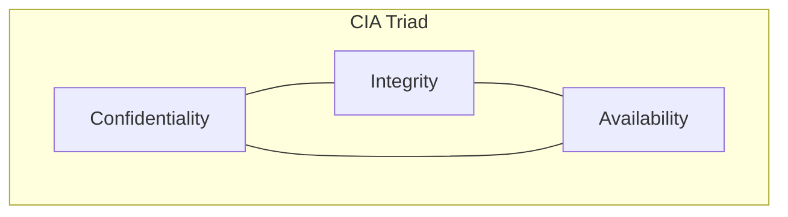
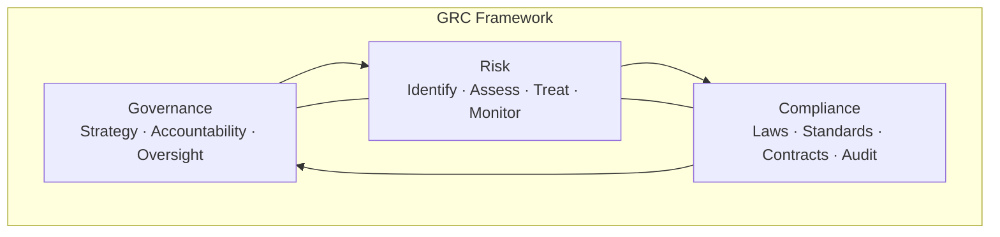

# Cyber Security and Privacy — Volume 01
## Lectures 1–10: Introduction, Foundations, GRC, Contingency Planning (Start)

**Course:** NPTEL 106106248 · **Instructor:** Prof. Saji K. Mathew, IIT Madras

---

## Lecture 1: Introduction — Part 1

**Source:** https://www.youtube.com/watch?v=2d5fKqo6zDc

### Learning objectives

- Explain why cybersecurity and privacy matter to managers, not only IT staff.
- Distinguish cybersecurity from privacy and describe their intersection.
- Recognize common attack patterns: phishing, spear phishing, ransomware, and social engineering.
- Articulate technology's triple role in security: threat source, asset, and defense.

### Core concepts

Cybersecurity and privacy are distinct but intertwined. **Cybersecurity** concerns protecting systems, networks, and data from unauthorized access, disruption, and damage. **Privacy** concerns an individual's control over personal information—what to disclose, to whom, and for what purpose. Organizations must manage both: strong security without privacy respect fails users; privacy policies without security are unenforceable.

The course opens with **real-world motivation**. Spear-phishing emails impersonating institutional leaders (e.g., IIT Madras director) demonstrate **social engineering**—attacks that exploit human trust rather than technical flaws alone. Unlike generic phishing, spear phishing uses **reconnaissance** (knowing names, roles, communication style) to increase success rates. Managers must cultivate **suspicion literacy**: verify sender domains, scrutinize unusual tone, and never share credentials via email links.

**Ransomware** encrypts victim systems and demands payment for decryption keys. The Kaseya (2021) attack shut down retail POS systems globally; **AIIMS (2022)** highlighted healthcare data sensitivity—unauthorized access to health records causes embarrassment, discrimination, and regulatory exposure (e.g., HIPAA in the US). **Denial of service** differs from ransomware: DoS floods resources to block access rather than encrypting data.

Digital adoption increases attack surface. **IoT** sensors in refineries, **internet-connected vehicles**, and **drones** used in critical infrastructure attacks (Saudi Aramco, 2019) show that cyber risk now threatens **physical safety and national security**, not only data confidentiality. EY reports that **91% of organizations** experienced at least one cyber incident annually—cybersecurity is a **board-level priority**.

Technology plays three roles: (1) **source of threat** (malware, DoS scripts), (2) **asset to protect** (servers, endpoints, data), and (3) **defense mechanism** (firewalls, encryption, monitoring). Managers must clarify which role is under discussion in any security decision.

### Key terms table

| Term | Definition |
|------|------------|
| Cybersecurity | Protection of cyberspace assets—systems, networks, data—from attack and misuse |
| Privacy | Individual control over personal information collection, use, and disclosure |
| Phishing | Fraudulent communication tricking users into revealing sensitive information |
| Spear phishing | Targeted phishing using personal/organizational context |
| Social engineering | Manipulating people to bypass security controls |
| Ransomware | Malware that encrypts systems and demands ransom for decryption |
| IoT | Internet-connected devices beyond traditional computers |
| Attack surface | Total exposure points where an adversary can attempt compromise |

### Exam-oriented summary

- Cybersecurity + privacy are both managerial concerns; neither is purely technical.
- Spear phishing uses social engineering with organizational intelligence.
- Ransomware vs. DoS: encryption/extortion vs. availability disruption.
- Technology is simultaneously threat, asset, and defense—define the context.
- Digital pervasiveness expands risk from data loss to life-safety and national infrastructure.

---

## Lecture 2: Introduction — Part 2

**Source:** https://www.youtube.com/watch?v=nadHKp3egDY

### Learning objectives

- Analyze how digital dependency creates operational and safety risks.
- Identify stakeholders affected by cyber incidents: individuals, organizations, society, government.
- Explain why abandoning digital technology is not a viable organizational strategy.
- Describe government's dual role in cybersecurity: protector and regulator.

### Core concepts

**Digital dependency** means organizations halt when IT fails. Citibank's "branchless" model, ERP-driven operations, and smart manufacturing (Industry 4.0) create **single points of failure**. Analog process control used wired sensors with limited remote exploit paths; **internet-connected digital sensors** enable remote manipulation (e.g., falsifying temperature readings in a refinery).

**Autonomous and connected vehicles** illustrate safety-critical cyber risk: compromised firmware or OTA updates could affect speed, braking, or fleet behavior. Automotive cyber testing (e.g., ICAT standards) has intensified accordingly.

Cyber risk spans **units of analysis**:

- **Individuals** — bank fraud, PAN verification scams, personal data theft
- **Organizations** — brand damage (Twitter celebrity hacks, TCS website defacement), operational shutdown
- **Society** — trust erosion in digital services, economic harm
- **Government** — citizen data stewardship (Aadhaar-scale databases), national security, policy formulation

The strategic response is **managed adoption**, not rejection of technology—analogous to improving road safety rather than banning cars. **Due attention** to security at each layer (individual hygiene, organizational controls, national policy) is required.

Government faces **two mandates**: securing its own systems and data, and **regulating** the digital ecosystem so citizens benefit from technology without unacceptable risk. Privacy and data protection are "close cousins" of cybersecurity in the regulatory domain.

### Key terms table

| Term | Definition |
|------|------------|
| Digital dependency | Reliance on IT/OT systems for core business or public functions |
| Industry 4.0 | Smart manufacturing using connected sensors, analytics, automation |
| Operational technology (OT) | Hardware/software controlling physical processes |
| Critical infrastructure | Systems whose failure endangers national security, economy, or public health |
| Attack vector | Path or means by which an attacker gains access |
| Due diligence | Reasonable care expected in managing known risks |

### Exam-oriented summary

- Connected OT/IoT expands cyber risk from information to physical harm.
- Stakeholders: individual, organization, society, government—each with distinct concerns.
- Strategy = secure digital adoption, not digital abstinence.
- Government protects its assets and regulates the broader ecosystem.
- High-profile breaches (Air India, Twitter) show reputational and trust impacts.

---

## Lecture 3: Introduction — Part 3

**Source:** https://www.youtube.com/watch?v=ZmCtYgj9kSo

### Learning objectives

- Define security in general and information/cyber security in organizational context.
- Contrast information security with the broader scope of cybersecurity.
- Preview course structure: management focus, policy, risk, contingency, privacy modules.
- Understand security as both objective state and psychological assurance.

### Core concepts

**Security** is a state of being protected from danger or threat—a condition where assets (life, property, information) are safe from unauthorized harm. For individuals, the primary asset is **life and body**, then **mental/informational assets**. For organizations, assets include **physical plant**, **information**, **reputation**, and **people**.

**Information security** traditionally focused on protecting **data and information systems**—confidentiality of databases, integrity of records, availability of services. **Cybersecurity** extends this scope to **infrastructure**, **people**, and **interconnected ecosystems** (cloud, mobile, IoT, supply chains). Information security is a **subset** of cybersecurity in modern usage.

The course emphasizes **management perspective**:

1. **Governance** — who decides, who is accountable
2. **Policy** — rules and priorities (ESSP, ISSP, system-specific policies)
3. **Risk management** — identify, assess, treat residual risk
4. **Contingency planning** — respond when controls fail
5. **Privacy** — regulatory, economic, and strategic dimensions

Managers need vocabulary to engage with CISOs, auditors, and regulators without implementing firewalls themselves. The course bridges **technical controls** and **business decisions** (budget, insurance, vendor risk, incident communication).

### Key terms table

| Term | Definition |
|------|------------|
| Information security | Protection of information and information systems |
| Cybersecurity | Broader protection of digital assets, infrastructure, and users in cyberspace |
| Asset | Anything of value requiring protection |
| Governance | Structures and processes for direction and accountability |
| Managerial perspective | Framing security as business risk and compliance, not only IT |
| Assurance | Confidence that security objectives are met |

### Exam-oriented summary

- Security = protected state; applies to people, property, and information.
- Cybersecurity scope > information security (infrastructure, people, ecosystems).
- Course pillars: GRC, policy, risk, contingency, privacy.
- Target audience: managers who must oversee, not only implement, security.
- Psychological "feeling secure" matters but organizational security requires measurable controls.

---

## Lecture 4: Foundations — Part 1

**Source:** https://www.youtube.com/watch?v=WAImfXGwhOs

### Learning objectives

- State the CIA triad and explain each pillar with examples.
- Describe how threats map to confidentiality, integrity, and availability.
- Introduce the CIA triangle model and basic threat–asset relationships.
- Connect foundational principles to later GRC and control selection.

### Core concepts

The **CIA triad** is the cornerstone of information security:

- **Confidentiality** — information accessible only to authorized parties. Breach example: unauthorized database access at a hospital.
- **Integrity** — data and systems are accurate, complete, and unaltered without authorization. Threat: tampering with financial records or sensor readings.
- **Availability** — authorized users can access systems and data when needed. Threat: DDoS attacks, ransomware locking systems, hardware failure.

Security controls are selected to protect one or more CIA dimensions. **Encryption** primarily supports confidentiality; **hashing and digital signatures** support integrity; **redundancy and backups** support availability. Real incidents often compromise **multiple pillars**—ransomware affects availability and may exfiltrate data (confidentiality).

The course uses **case-based learning**. The **Target data breach (2013)** illustrates how payment-card data theft (confidentiality), supply-chain/vendor access (third-party risk), and delayed detection combine into major business impact—foundations for later risk and policy modules.

Threat actors include **insiders**, **hacktivists**, **criminals**, **nation-states**, and **script kiddies**. Each has different motives (financial gain, ideology, espionage, notoriety), affecting **likelihood** and **impact** assessments in risk management.

### Key terms table

| Term | Definition |
|------|------------|
| CIA triad | Confidentiality, Integrity, Availability—the core security objectives |
| Confidentiality | Preventing unauthorized disclosure |
| Integrity | Preventing unauthorized modification |
| Availability | Ensuring timely, reliable access for authorized use |
| Threat actor | Entity that may cause harm (insider, criminal, nation-state, etc.) |
| Data breach | Confirmed disclosure of protected data to unauthorized party |
| Third-party risk | Security exposure from vendors, partners, and supply chain |

### Exam-oriented summary

- CIA: Confidentiality, Integrity, Availability—know one example threat and control per pillar.
- Controls often address multiple CIA elements; map controls explicitly in exams.
- Target breach links foundations to vendor access and detection failures.
- Threat actor motive drives risk prioritization.
- See also: [diagrams/cia-triad.md](../diagrams/cia-triad.md)

---

## Lecture 5: Foundations — Part 2

**Source:** https://www.youtube.com/watch?v=9oQb5DIuNKg

### Learning objectives

- Deepen understanding of confidentiality mechanisms and limits.
- Explain integrity controls and accountability (audit trails, non-repudiation).
- Analyze availability planning beyond uptime percentages.
- Study the Target breach as a multi-control failure case.

### Core concepts

**Confidentiality** is enforced through **access control** (DAC, MAC, RBAC), **encryption** (at rest and in transit), **data classification**, and **need-to-know** policies. **Defense in depth** layers controls so single-point failure does not expose all assets. Limits exist: encrypted data must be **decrypted for use**; insiders with legitimate access remain a risk; **metadata** may leak even when content is encrypted.

**Integrity** ensures data and systems are trustworthy. Mechanisms include **checksums**, **cryptographic hashes**, **version control**, **change management**, and **separation of duties** (no single person can complete a sensitive transaction alone). **Non-repudiation** prevents denying an action—digital signatures and audit logs support legal and compliance requirements.

**Availability** encompasses **reliability**, **maintainability**, and **resilience**. Metrics like **RTO** (recovery time objective) and **RPO** (recovery point objective) translate business needs into technical design. **Single points of failure** in DNS, identity providers, or cloud regions can cascade across "highly available" architectures.

The **Target breach** narrative: attackers entered via a **HVAC vendor** (third-party credentials), moved laterally, installed malware on POS systems, and exfiltrated card data. Lessons: **vendor access governance**, **network segmentation**, **monitoring**, and **incident detection speed** matter as much as perimeter firewalls.

### Key terms table

| Term | Definition |
|------|------------|
| Defense in depth | Layered security controls |
| RBAC | Role-based access control |
| Hash | One-way function detecting data alteration |
| Non-repudiation | Inability to deny having performed an action |
| RTO | Maximum acceptable downtime after disruption |
| RPO | Maximum acceptable data loss measured in time |
| Network segmentation | Isolating network zones to limit lateral movement |

### Exam-oriented summary

- Confidentiality: access control + encryption + classification; insiders remain a gap.
- Integrity: hashing, change control, separation of duties, audit trails.
- Availability: define RTO/RPO; eliminate hidden single points of failure.
- Target case: third-party access, lateral movement, delayed detection.
- Extended properties: authenticity, accountability, non-repudiation.

---

## Lecture 6: Foundations — Part 3

**Source:** https://www.youtube.com/watch?v=QDzGq_taOLM

### Learning objectives

- Integrate CIA with organizational security domains (physical, personnel, operations).
- Introduce security governance structures and accountability.
- Relate foundational concepts to standards preview (ISO 27001, NIST).
- Prepare for GRC module by framing security as ongoing process, not project.

### Core concepts

Organizational security spans **domains** beyond IT:

- **Physical security** — facilities, badges, CCTV, environmental controls
- **Personnel security** — hiring checks, training, termination procedures
- **Operations security** — procedures that prevent information leakage
- **Communications security** — protecting data in motion
- **Application security** — secure SDLC, patching, testing

The **CIA triad** applies within each domain. A lost laptop compromises confidentiality; an unpatched server affects integrity and availability; tailgating into a data center breaches physical controls.

**Security governance** assigns **roles**: board oversight, executive sponsorship, CISO/CSO accountability, data owners, system administrators, and end users. **Policies** translate governance intent into mandatory rules; **standards** specify technologies and configurations; **procedures** document step-by-step actions.

Frameworks like **ISO/IEC 27001** (ISMS) and **NIST Cybersecurity Framework** (Identify, Protect, Detect, Respond, Recover) provide **common language** for audits and continuous improvement. Security is **cyclical**: assess environment, implement controls, monitor, improve—aligned with **Plan-Do-Check-Act**.

Foundations conclude by emphasizing **proportionality**: controls should match asset value and threat landscape. Over-control wastes resources; under-control invites breach. This sets up **risk-based** thinking in Lectures 16–18.

### Key terms table

| Term | Definition |
|------|------------|
| ISMS | Information Security Management System (ISO 27001) |
| CISO | Chief Information Security Officer |
| Data owner | Business role accountable for data classification and access |
| Security domain | Category of controls (physical, personnel, technical, etc.) |
| Continuous improvement | Ongoing assessment and enhancement of security posture |
| Proportionality | Matching control strength to risk and asset criticality |

### Exam-oriented summary

- Security domains: physical, personnel, operations, comms, applications—not IT-only.
- Governance defines roles: board → executives → CISO → owners → users.
- ISO 27001 / NIST CSF provide structure for exams and real programs.
- Security is a continuous cycle (PDCA), not a one-time certification.
- Foundations lead into GRC: governance + risk + compliance as integrated discipline.

---

## Lecture 7: Security Management, GRC — Part 1

**Source:** https://www.youtube.com/watch?v=1okOQCY6Bsk

### Learning objectives

- Define Governance, Risk, and Compliance (GRC) and explain why they are integrated.
- Describe board and executive responsibilities for cybersecurity.
- Map GRC components to organizational decision-making.
- Introduce major standards and regulatory drivers of compliance.

### Core concepts

**GRC** unifies three disciplines that organizations often siloed:

- **Governance** — leadership, strategy, accountability, resource allocation
- **Risk management** — identifying, analyzing, and treating uncertainty affecting objectives
- **Compliance** — adhering to laws, regulations, contracts, and internal policies

Cybersecurity GRC answers: *Who is responsible? What can go wrong? What rules must we follow?*

**Governance** structures include board risk committees, security steering groups, and defined **three lines of defense**: (1) business owns and manages risk, (2) risk/compliance functions oversee, (3) internal audit provides independent assurance.

**Compliance** drivers include **ISO 27001** certification (customer trust), **PCI DSS** (payment cards), **sector regulators** (RBI, SEBI, HIPAA analogs), and emerging **privacy laws** (GDPR, DPDP). Non-compliance carries **fines**, **contract loss**, and **reputational damage**.

GRC is not bureaucracy for its own sake—it enables **consistent decisions** when incidents occur, budgets are constrained, or new technology (cloud, AI) is adopted. Security management is **executive leadership**, not only firewall configuration.

### Key terms table

| Term | Definition |
|------|------------|
| GRC | Governance, Risk, and Compliance—integrated management approach |
| Three lines of defense | Operational ownership, oversight, independent audit |
| Compliance | Conformance with external and internal requirements |
| Security governance | Framework for directing and controlling security activities |
| Regulatory driver | Law or rule mandating specific security/privacy practices |
| Steering committee | Cross-functional group overseeing security program |

### Exam-oriented summary

- GRC = Governance + Risk + Compliance; integrated, not separate silos.
- Board/executives accountable; CISO executes; business owns data risk.
- Compliance examples: ISO 27001, PCI DSS, GDPR/DPDP (privacy overlap).
- Three lines of defense model is common exam topic.
- GRC enables consistent decisions under uncertainty and regulation.

---

## Lecture 8: Security Management, GRC — Part 2

**Source:** https://www.youtube.com/watch?v=YE0PooziW-0

### Learning objectives

- Explain security standards hierarchy: policies, standards, guidelines, procedures.
- Compare ISO 27001/27002 with NIST CSF for organizational use.
- Describe audit, certification, and continuous monitoring in GRC.
- Link standards selection to industry and customer requirements.

### Core concepts

**Document hierarchy** in security programs:

1. **Policies** — high-level management mandates (e.g., acceptable use)
2. **Standards** — mandatory technical requirements (encryption algorithms, password length)
3. **Guidelines** — recommended practices (may deviate with justification)
4. **Procedures** — detailed steps (incident escalation, backup restore)

**ISO/IEC 27001** specifies requirements for establishing, implementing, maintaining, and continually improving an ISMS. **ISO/IEC 27002** provides a **control catalog** (organizational, people, physical, technological). Certification involves external audit against 27001; Statement of Applicability (SoA) documents which controls apply.

**NIST Cybersecurity Framework** functions:

| Function | Purpose |
|----------|---------|
| Identify | Asset management, risk assessment, governance |
| Protect | Access control, awareness training, data security |
| Detect | Monitoring, anomaly detection |
| Respond | Incident response planning and communication |
| Recover | Recovery planning, improvements |

Organizations map existing controls to NIST functions for **gap analysis** without mandatory certification.

**Audits** verify control effectiveness. **Internal audit** prepares for external certification; **penetration testing** simulates attack. GRC tools (GRC platforms) track controls, evidence, and remediation—supporting **continuous compliance** rather than annual checkbox exercises.

### Key terms table

| Term | Definition |
|------|------------|
| ISMS | Management system for information security per ISO 27001 |
| ISO 27002 | Code of practice—security control reference set |
| SoA | Statement of Applicability—controls selected and justified |
| NIST CSF | Voluntary framework: Identify, Protect, Detect, Respond, Recover |
| Control catalog | Structured list of security safeguards |
| Continuous monitoring | Ongoing visibility into control and threat status |

### Exam-oriented summary

- Policy > standard > guideline > procedure—know the hierarchy.
- ISO 27001 = certifiable ISMS; 27002 = control reference.
- NIST CSF five functions—map example controls to each.
- Audits and pen tests provide assurance; GRC tools track evidence.
- Choose standards based on industry, customers, and regulation.

---

## Lecture 9: Security Management, GRC — Part 3

**Source:** https://www.youtube.com/watch?v=1sN6NtaRoHE

### Learning objectives

- Implement GRC in practice: roles, metrics, and reporting.
- Balance security investment with business objectives.
- Address common GRC failures: checkbox compliance, siloed risk, weak ownership.
- Transition from GRC to operational planning (contingency module).

### Core concepts

Effective GRC requires **measurable outcomes**. Security metrics include:

- **Leading indicators** — training completion, patch latency, phishing simulation click rates
- **Lagging indicators** — incident count, mean time to detect/respond (MTTD/MTTR), audit findings

Reports to leadership should translate technical metrics into **business language**: financial exposure, customer impact, regulatory deadlines. **Risk registers** document threats, vulnerabilities, likelihood, impact, owners, and treatment plans.

**Common failures**:

- **Checkbox compliance** — policies exist but are not practiced
- **Siloed GRC** — IT security disconnected from enterprise risk management (ERM)
- **Unclear ownership** — "everyone's problem" becomes no one's accountability
- **Underfunded remediation** — audit findings without budget allocation

**Integration with ERM** aligns cyber risk with operational, financial, and strategic risk. **Risk appetite** statements define how much risk the board accepts; security spending should reflect appetite and **residual risk** after controls.

GRC concludes by bridging to **contingency planning**: even mature GRC cannot eliminate all incidents—organizations must **prepare to respond** when controls fail (Lectures 10–12).

### Key terms table

| Term | Definition |
|------|------------|
| Risk register | Document tracking identified risks and treatments |
| Risk appetite | Amount of risk organization willing to accept |
| Residual risk | Risk remaining after controls |
| ERM | Enterprise Risk Management |
| MTTD / MTTR | Mean time to detect / respond to incidents |
| Leading vs. lagging metric | Predictive vs. historical performance measure |

### Exam-oriented summary

- Use leading and lagging metrics; report in business terms to leadership.
- Risk register: threat, vulnerability, likelihood, impact, owner, treatment.
- Failures: checkbox compliance, silos, unclear ownership, unfunded fixes.
- Integrate cyber risk with ERM and board-defined risk appetite.
- GRC sets the stage for contingency planning when incidents occur.

---

## Lecture 10: Contingency Planning — Part 1

**Source:** https://www.youtube.com/watch?v=j0QxAhDh48E

### Learning objectives

- Define contingency planning and distinguish it from preventive risk management.
- Explain the premise: controls fail; organizations must prepare responses.
- Introduce contingency planning components: incident response, disaster recovery, business continuity.
- Relate contingency planning to cybersecurity management's two pillars: contingency and risk.

### Core concepts

**Contingency planning** addresses events that occur **despite preventive controls**. Human planners cannot predict every threat; new vulnerabilities emerge; insiders misbehave; suppliers fail. The managerial premise: **assume failure**, design **response and recovery**.

Cybersecurity management emphasizes two complementary pillars:

1. **Risk management** — reduce likelihood and impact proactively (Lectures 16–18)
2. **Contingency planning** — respond when harm materializes (Lectures 10–12)

Contingency encompasses **firefighting** (contain active incident) and **restoration** (return to normal operations).

Core plans and processes:

| Component | Focus |
|-----------|--------|
| **Incident Response (IR)** | Detect, contain, eradicate, recover from security events |
| **Disaster Recovery (DR)** | Restore IT systems, data, infrastructure after major disruption |
| **Business Continuity (BCP)** | Maintain essential business functions during and after crisis |
| **Crisis communication** | Internal and external messaging during incidents |

**Cybersecurity policy** (next module) provides the **reference document** for priorities during contingencies—what to protect first, who decides, escalation paths.

The **NIST IR lifecycle** (Prepare → Detect & Analyze → Contain, Eradicate & Recover → Post-incident activity) structures practical response. Preparation includes **playbooks**, **contact lists**, **forensic tools**, and **legal/comms** coordination.

Contingency planning is **not optional** for regulated sectors (finance, healthcare, critical infrastructure) and is increasingly expected in **vendor contracts** and **cyber insurance** underwriting.

### Key terms table

| Term | Definition |
|------|------------|
| Contingency planning | Preparing to manage unforeseen security/operational failures |
| Incident response (IR) | Process for handling active security incidents |
| Disaster recovery (DR) | Restoring IT capabilities after disaster |
| Business continuity (BCP) | Sustaining critical business operations |
| Playbook | Predefined response steps for incident types |
| Escalation path | Defined chain for notifying decision-makers |

### Exam-oriented summary

- Contingency = plan for when controls fail; complements risk management.
- IR (tactical), DR (IT restore), BCP (business functions)—know distinctions.
- Policy guides priorities during incidents; prepare playbooks and contacts.
- NIST IR phases: Prepare, Detect/Analyze, Contain/Eradicate/Recover, Post-incident.
- Contingency is expected for compliance, contracts, and cyber insurance.

---

*End of Volume 01 (Lectures 1–10). Continue with [Volume 02](vol-02-lectures-11-20.md).*
