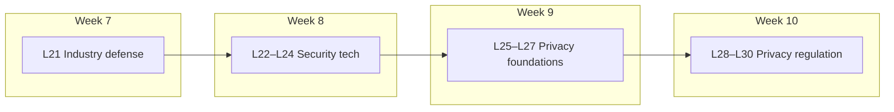

# Volume 03 Index — Lectures 21–30

**Course:** NPTEL — Cyber Security and Privacy (Prof. Saji K. Mathew, IIT Madras)  
**Volume focus:** Industry defense (cont.), security technologies, privacy foundations, privacy regulation  
**Weeks covered:** 7–10

---

## Quick navigation

| Lecture | Title | Week | Video |
|---------|-------|------|-------|
| [L21](vol-03-lectures-21-30.md#lecture-21--cybersecurity-industry-perspective--part-3) | Cybersecurity: Industry perspective — Part 3 | 7 | [YouTube](https://www.youtube.com/watch?v=2jsQKZCgWvY) |
| [L22](vol-03-lectures-21-30.md#lecture-22--cyber-security-technologies--part-1) | Cyber security technologies — Part 1 | 8 | [YouTube](https://www.youtube.com/watch?v=3rkIe2ZkkfY) |
| [L23](vol-03-lectures-21-30.md#lecture-23--cyber-security-technologies--part-2) | Cyber security technologies — Part 2 | 8 | [YouTube](https://www.youtube.com/watch?v=ZQSXMurVEXA) |
| [L24](vol-03-lectures-21-30.md#lecture-24--cyber-security-technologies--part-3) | Cyber security technologies — Part 3 | 8 | [YouTube](https://www.youtube.com/watch?v=taSQioUSrU8) |
| [L25](vol-03-lectures-21-30.md#lecture-25--foundations-of-privacy--part-1) | Foundations of privacy — Part 1 | 9 | [YouTube](https://www.youtube.com/watch?v=7-nnLNGBtLM) |
| [L26](vol-03-lectures-21-30.md#lecture-26--foundations-of-privacy--part-2) | Foundations of privacy — Part 2 | 9 | [YouTube](https://www.youtube.com/watch?v=TOki4KHyVWg) |
| [L27](vol-03-lectures-21-30.md#lecture-27--foundations-of-privacy--part-3) | Foundations of privacy — Part 3 | 9 | [YouTube](https://www.youtube.com/watch?v=s2vt-xAbgUk) |
| [L28](vol-03-lectures-21-30.md#lecture-28--privacy-regulation--part-1) | Privacy regulation — Part 1 | 10 | [YouTube](https://www.youtube.com/watch?v=g_G2bFrkeHY) |
| [L29](vol-03-lectures-21-30.md#lecture-29--privacy-regulation--part-2) | Privacy regulation — Part 2 | 10 | [YouTube](https://www.youtube.com/watch?v=nBr733H_xH4) |
| [L30](vol-03-lectures-21-30.md#lecture-30--privacy-regulation--part-3) | Privacy regulation — Part 3 | 10 | [YouTube](https://www.youtube.com/watch?v=IKPp1yc0dnk) |

---

## Volume arc

### Block summaries

| Block | Lectures | Core themes |
|-------|----------|-------------|
| **Industry perspective (cont.)** | L21 | Threat actors, CII, NCIIPC/CERT-In, threat intelligence, SOC/SIEM, red teaming, India policy gaps |
| **Security technologies** | L22–L24 | Risk management economics, access control, biometrics, firewalls/DMZ, cryptography, encryption standards, active defense |
| **Privacy foundations** | L25–L27 | Privacy vs information privacy, FIPPs, CFIP scale, *We Googled You* case |
| **Privacy regulation** | L28–L30 | Privacy paradox, anonymity, k-anonymity, Equifax breach, need for regulation |

---

## Key frameworks introduced

- **CII** — Critical Information Infrastructure (IT Act §70A)
- **NCIIPC** / **CERT-In** — Protection vs response in India
- **CIA + IAAA** — Confidentiality, integrity, availability; identification, authentication, authorization, accountability
- **FIPPs** — Fair Information Practice Principles (1973)
- **Data roles** — Data subject, controller, processor
- **k-anonymity** — Privacy-preserving data mining
- **Risk–utility trade-off** — Analytics value vs disclosure risk

---

## Cases & readings (this volume)

| Item | Lecture |
|------|---------|
| Active Defense and Hacking Back (Benito) | L24 |
| *We Googled You* (Hathaway Jones / Mimi Brewster) | L27 |
| Equifax data breach (2017) | L30 |

---

## Related volumes

- [← Volume 02: Lectures 11–20](../notes/) *(if present)*
- [→ Volume 04: Lectures 31–40](vol-04-lectures-31-40.index.md) — GDPR, DPDP/Aadhaar, privacy economics, strategy & safety
