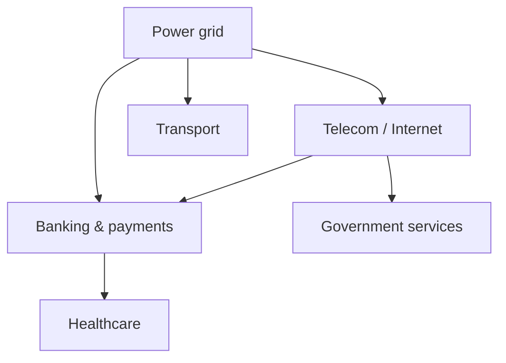
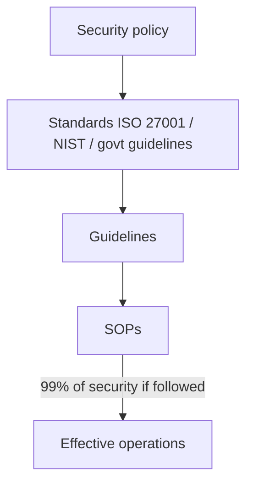
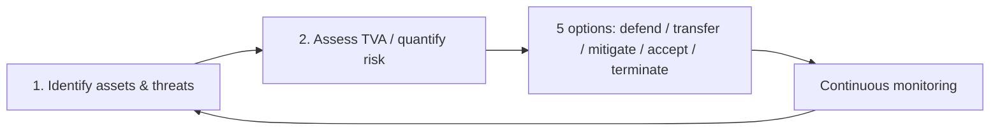
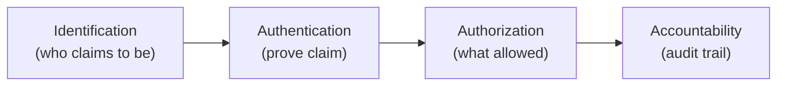
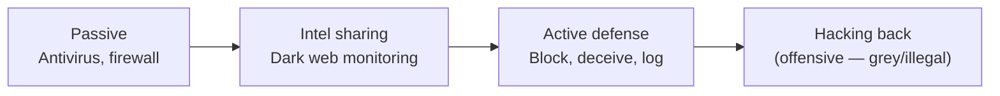
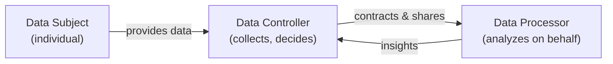
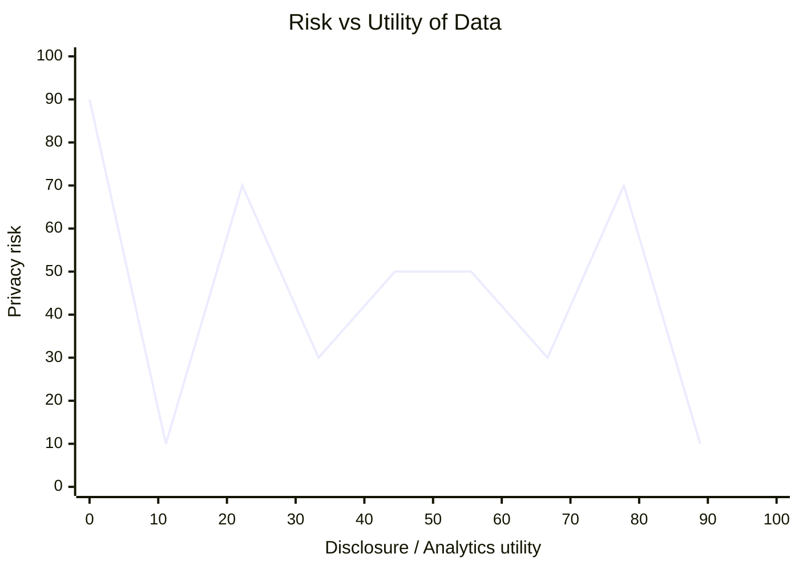
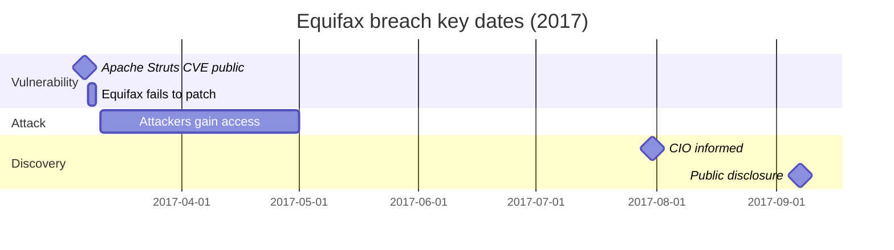

# Cyber Security and Privacy — Volume 03 Notes

**Lectures 21–30** | Prof. Saji K. Mathew, IIT Madras (NPTEL)  
**Topics:** Industry perspective (cont.), security technologies, privacy foundations, privacy regulation

---

## Lecture 21 — Cybersecurity: Industry perspective — Part 3

| Field | Detail |
|-------|--------|
| **Week** | 7 |
| **Video** | [https://www.youtube.com/watch?v=2jsQKZCgWvY](https://www.youtube.com/watch?v=2jsQKZCgWvY) |
| **Digimat ID** | `2jsQKZCgWvY` |
| **Guest speaker** | Industry practitioner (defense, threat intelligence, India ecosystem) |

### Learning objectives

- Classify modern threat actors (hacktivist groups, ransomware crews, nation-state–adjacent activity).
- Explain **Critical Information Infrastructure (CII)** and India's institutional response.
- Describe threat intelligence, SOC/SIEM operations, and red-team engagements from a managerial lens.
- Identify structural gaps in India's cybersecurity policy landscape.

### Key concepts

| Term | Definition |
|------|------------|
| **Attribution** | Determining who launched an attack — extremely difficult in cyberspace (server location ≠ attacker identity). |
| **CII** | Facilities/systems whose incapacity would debilitate national security, governance, economy, or social well-being (IT Act §70A). |
| **NCIIPC** | National Critical Information Infrastructure Protection Center — nodal agency for CII sectors; pre-incident protection focus. |
| **CERT-In** | Computer Emergency Response Team — emergency response, audits, "Safe to Host" empanelment. |
| **IT vs OT** | IT = office networks, email, ERP; OT = operational technology (factory SCADA, sensors) — OT breaches have physical consequences. |
| **SIEM** | Security Information and Event Management — fuses logs, runs analytics, surfaces threats. |
| **SOC** | Security Operations Center — analysts act on SIEM alerts (tiered escalation). |
| **EDR / XDR / MDR** | Endpoint / extended detection & response; managed detection & response. |
| **Red teaming** | Authorized adversary simulation: vuln analysis, pen testing, gap analysis — consultative, leadership-only. |

### Lecture notes

#### Threat landscape

- **Lapsus$** (DEV-0537): Organized group recruiting insiders via Telegram; ransomware profit-sharing model.
- **Russia–Ukraine cyber war**: Independent hacktivist groups (Anonymous, Conti splits) conducting DDoS and infrastructure attacks without clear state affiliation.
- **Attribution problem**: Chemical-plant "accidents" during border tensions may be cyber-physical attacks; governments often avoid naming attackers.

#### Critical sectors & interdependencies

NCIIPC-notified sectors: power & energy, banking/financial services, telecom, transport, government, strategic/public enterprises.



Criticality is **fluid** — e.g., delivery apps became essential during COVID lockdowns.

#### Landmark OT / ICS attacks

| Incident | Lesson |
|----------|--------|
| **Stuxnet (2009)** | APT manipulated centrifuge speeds while showing normal readings on HMI — destroyed Iranian enrichment capability. |
| **Ukrainian power grid** | Pre-war message attack on grid operations. |
| **Saudi Aramco** | Post-Stuxnet retaliation; simpler but devastating. |
| **SCADA crypto-mining** | Internet-connected industrial machines abused for mining. |

#### Defense stack (managerial view)



**Threat intelligence sources**: social media chatter, deep/dark web, leaked credentials, internal log anomalies.

**Defender questions**: Who is my attacker? Internal or external? Skill level (script kiddie → APT)? Motive (espionage, sabotage, ransom)? Target (focused vs unfocused)?

#### India policy gaps

- **Too many agencies**: NCIIPC, CERT-In, NCCC, cyber crime police, sector regulators (RBI, etc.) — "too many cooks."
- **2013 National Cyber Security Policy** outdated; unified strategy awaited.
- **Protection vs response split** (NCIIPC vs CERT-In) unique among major nations.
- **Open-source intelligence on dark web**: Legally unusable for building cases; veracity unknown.

### Summary

L21 closes the industry module by shifting from attack taxonomy to **national-scale defense**: CII prioritization, layered intelligence, SOC operations, and India's fragmented governance. Managers must map organizational assets to sector criticality and vendor risk.

### Review questions

1. Distinguish NCIIPC's role from CERT-In's.
2. Why is OT compromise more dangerous than typical IT breach?
3. What three questions should every security leader ask about an active threat?

---

## Lecture 22 — Cyber security technologies — Part 1

| Field | Detail |
|-------|--------|
| **Week** | 8 |
| **Video** | [https://www.youtube.com/watch?v=3rkIe2ZkkfY](https://www.youtube.com/watch?v=3rkIe2ZkkfY) |
| **Digimat ID** | `3rkIe2ZkkfY` |

### Learning objectives

- Recap quantitative risk management and five management options.
- Apply **cost–benefit analysis** (ALE, ACS) to security investments.
- Introduce protection technologies from a managerial (not engineering-design) perspective.

### Key concepts

**Residual risk** = (Loss frequency × Loss magnitude) − Protection from existing controls ± measurement uncertainty.

**Five risk management options**:

| Option | Meaning |
|--------|---------|
| **Defence** | Invest in controls, CISO, technologies before attack |
| **Transfer** | Outsource/managed services/cloud — vendor bears operational risk |
| **Mitigation** | Reduce impact *after* incident (contingency, hot site) |
| **Acceptance** | Economically tolerate residual risk (e.g., academic institutions) |
| **Termination** | Exit business/asset when security cost exceeds benefit |

### Risk economics

```
Annualized Loss Expectancy (ALE) = SLE × Annualized rate of occurrence
SLE (Single Loss Expectancy) = Asset value × Exposure factor

Gain from control = ALE_prior − (ALE_post + ACS)
Invest if gain > 0
```



Standards use different nomenclature (NIST SP 800-30, ISO 27005) but same concepts.

### Summary

Risk management closes with **economic justification** — security spend must reduce ALE enough to cover annualized cost of safeguards (ACS).

### Review questions

1. How do defence and mitigation differ?
2. When might *acceptance* be rational for a ₹70B company losing ₹500M?
3. What is residual risk?

---

## Lecture 23 — Cyber security technologies — Part 2

| Field | Detail |
|-------|--------|
| **Week** | 8 |
| **Video** | [https://www.youtube.com/watch?v=ZQSXMurVEXA](https://www.youtube.com/watch?v=ZQSXMurVEXA) |
| **Digimat ID** | `ZQSXMurVEXA` |

### Learning objectives

- Explain **IAAA** access control and supporting technologies.
- Evaluate biometric systems (FAR, FRR, CER).
- Describe firewalls, DMZ architecture, and cryptography fundamentals.

### Access control chain



**Authentication factors**: password/passphrase/OTP, smart card, biometric (fingerprint, iris, retina), behavioral (voice, signature). **MFA** combines factors across devices (e.g., SBI: password + CAPTCHA + SMS OTP).

### Biometrics trade-off

- **FAR** (False Acceptance Rate) vs **FRR** (False Rejection Rate).
- **CER** (Crossover Error Rate) — optimal operating point; check device CER before deployment.
- Rural fingerprint wear (manual labor) → multi-finger fusion in Andhra ration pilots.

### Firewalls & DMZ

- **Trusted network** = internal assets; **untrusted** = external.
- **DMZ (demilitarized zone)**: replica/proxy exposed to internet; core trusted network never directly reachable.

### Cryptography essentials

| Type | Keys | Challenge |
|------|------|-----------|
| **Symmetric** | One shared key | Key distribution over insecure channel |
| **Asymmetric** | Public encrypt / private decrypt | Slower; solves key exchange |
| **Digital signature** | Private sign / public verify | **Non-repudiation** (e-Gov filings, blockchain) |
| **Digital certificate** | CA-signed identity | Browser trusts HTTPS sites |

**Methods**: substitution (Caesar, mono/poly-alphabetic), transposition, XOR.

**End-to-end encryption** (WhatsApp): plaintext never visible to provider in transit.

### Summary

Protection technologies implement CIA via IAAA, network segmentation, and encryption — the trust layer underpinning e-commerce and messaging.

### Review questions

1. What is non-repudiation and where is it critical?
2. Why does DMZ exist?
3. Compare symmetric vs asymmetric encryption key management.

---

## Lecture 24 — Cyber security technologies — Part 3

| Field | Detail |
|-------|--------|
| **Week** | 8 |
| **Video** | [https://www.youtube.com/watch?v=taSQioUSrU8](https://www.youtube.com/watch?v=taSQioUSrU8) |
| **Digimat ID** | `taSQioUSrU8` |

### Learning objectives

- Summarize encryption standards (DES → AES, RSA) and blockchain security properties.
- Discuss **active defense** vs **hacking back** — ethical and legal boundaries.
- Apply proportionality, authority, and third-party immunity principles to cyber defense.

### Encryption standards

| Standard | Notes |
|----------|-------|
| **DES** (56-bit) | Broken by RSA team — obsolete |
| **3DES** | Interim strengthening |
| **AES** (128/192/256-bit) | NIST/ISO standard; brute-force infeasible at 128+ bits |
| **RSA** | Asymmetric; key length drives break difficulty |

**Blockchain security**: confidentiality (encryption), integrity/immutability (hash chains), non-repudiation (private-key transactions).

### Active defense spectrum



**Georgian government case**: Planted spyware documents retrieved by attacker — identified hacker via webcam; debated as national-security active defense.

**Ethical active defense principles** (Dorothy Denning / legal frameworks):

1. **Authority** — internal actions OK; external requires legal mandate.
2. **Third-party immunity** — no harm to innocents.
3. **Proportionality** — benefits ≥ costs.
4. **Human involvement** — automated thresholds need human accountability.
5. **Civil liberties** — even attackers retain privacy rights where applicable.

### Summary

Technology module closes with standards maturity and the **grey zone** between monitoring and offensive counter-attack — managers must stay on the defensible side of law.

### Review questions

1. Why is hacking back often unethical for private firms but debated for governments?
2. What three properties does blockchain borrow from cryptography?
3. Name two ethical constraints on active defense.

---

## Lecture 25 — Foundations of privacy — Part 1

| Field | Detail |
|-------|--------|
| **Week** | 9 |
| **Video** | [https://www.youtube.com/watch?v=7-nnLNGBtLM](https://www.youtube.com/watch?v=7-nnLNGBtLM) |
| **Digimat ID** | `7-nnLNGBtLM` |

### Learning objectives

- Distinguish **privacy** from **information privacy** and **cybersecurity**.
- Trace historical roots (Warren & Brandeis 1890, Kodak, Indian Telegraph Act).
- Understand privacy as autonomy — not an absolute right.

### Definitions

| Concept | Definition |
|---------|------------|
| **Privacy (classical)** | "The right to be let alone" (Warren & Brandeis, 1890) |
| **Information privacy** (Alan Westin) | Individual/group control over **when, how, and to what extent** personal information is communicated |
| **Big Brother** | Orwellian state surveillance; power asymmetry (Foucault's panopticon) |

### Privacy vs security link

- Encrypted WhatsApp chats leaked via **unencrypted Google Drive backups** (NCB case) — encryption intact; storage layer failed.
- Media published private chats citing **public interest**; celebrities sued (Ratan Tata / Niira Radia precedent).
- **Indian Telegraph Act (1885)**: Government intercept authority persists post-independence.

### Cultural lens

- Indian **collectivist** tradition vs Western **individualist** privacy consciousness.
- IIT hostel camera dispute: security vs privacy; informed surveillance signage as compromise.
- Postcards historically carried intimate content with no privacy expectation.

### Summary

Privacy is a **fundamental but qualified** right — technology (photography, digital platforms) made intrusion scalable; regulation lags user behavior.

### Review questions

1. How does information privacy differ from physical privacy?
2. Why are WhatsApp backups a privacy weak point?
3. What is the panopticon metaphor?

---

## Lecture 26 — Foundations of privacy — Part 2

| Field | Detail |
|-------|--------|
| **Week** | 9 |
| **Video** | [https://www.youtube.com/watch?v=TOki4KHyVWg](https://www.youtube.com/watch?v=TOki4KHyVWg) |
| **Digimat ID** | `TOki4KHyVWg` |

### Learning objectives

- Master **FIPPs** and the three data-privacy roles.
- Apply **Concern for Information Privacy (CFIP)** four dimensions.
- Connect privacy principles to organizational liability.

### Fair Information Practice Principles (1973, US)

| # | Principle |
|---|-----------|
| 1 | No secret personal-data record systems |
| 2 | Individual can discover what data is held and how used |
| 3 | **Purpose limitation** — no secondary use without consent |
| 4 | Individual can correct/amend records |
| 5 | **Data minimization** — collect only what is needed |
| 6 | Collector must secure data; breach = violation |

### Data roles



India's PDP/DPDP terminology: **Data Principal**, **Data Fiduciary**, **Data Processor**.

### CFIP dimensions (measurable)

1. **Collection** — why collected?
2. **Unauthorized access** — who else sees it?
3. **Errors** — can I fix wrong data?
4. **Secondary use** — will it be sold/shared?

### Summary

FIPPs became the global template for privacy law; organizations face legal and reputational liability for breaches (healthcare, credit bureaus).

### Review questions

1. List all six FIPP principles.
2. Give an example of secondary use without consent.
3. What are the four CFIP concerns?

---

## Lecture 27 — Foundations of privacy — Part 3

| Field | Detail |
|-------|--------|
| **Week** | 9 |
| **Video** | [https://www.youtube.com/watch?v=s2vt-xAbgUk](https://www.youtube.com/watch?v=s2vt-xAbgUk) |
| **Digimat ID** | `s2vt-xAbgUk` |

### Learning objectives

- Analyze employer **social media screening** and legal frameworks (FCRA, GDPR, EEOC, HIPAA, NLRA).
- Apply privacy-layered background-check policies.
- Manage personal digital footprint proactively.

### Case: *We Googled You*

**Hathaway Jones** (luxury apparel) seeks China expansion manager; CEO Fred favors **Mimi Brewster** (Stanford MBA, fluent Mandarin, expat). HR VP Virginia finds decade-old activist protests (WTO, China dissident) on page 9 of Google results.

| Stakeholder | Position |
|-------------|----------|
| Fred | Hire on merit; leadership = risk-taking |
| Virginia | Legal/privacy risk; needs screening policy |
| Mimi | Potential discrimination suit if rejected for ideology |
| China market | Anti-government activism = legitimacy risk |

**Legal overlays for US firms**:

- **GDPR**: Explicit consent before background checks on EU citizens.
- **FCRA**: Fair credit/criminal record use.
- **EEOC / NLRA**: No discrimination; protected protest activity.
- **HIPAA**: Health data off-limits for hiring.

**Recommendations**:

- Written internet-screening policy aligned with all privacy layers.
- Limit to **public, job-relevant** information; transparency with candidates.
- Option 3: Confront Mimi — hear her side; verify authenticity.
- **Personal hygiene**: Google yourself; Google Alerts; professional vs private accounts.

### Summary

Digital permanence makes past activism discoverable; firms need policies balancing due diligence, anti-discrimination law, and geopolitical risk.

### Review questions

1. Is deep Google search a privacy violation if data is public?
2. Why might hiring Mimi endanger China operations?
3. What screening practices reduce legal exposure?

---

## Lecture 28 — Privacy regulation — Part 1

| Field | Detail |
|-------|--------|
| **Week** | 10 |
| **Video** | [https://www.youtube.com/watch?v=g_G2bFrkeHY](https://www.youtube.com/watch?v=g_G2bFrkeHY) |
| **Digimat ID** | `g_G2bFrkeHY` |

### Learning objectives

- Explain why **regulation** is needed when platforms exploit information asymmetry.
- Define **privacy paradox**, PII, and quasi-identifiers.
- Contrast **right to privacy** vs **right to anonymity**.

### Platform economics

- **Lock-in** ("Hotel California"): switching costs trap users; social graph is the moat.
- **Shaadi.com-style clauses**: perpetual, irrevocable license to personal data on click — **76 working days** to read typical privacy policy (Luca & Bazerman).
- **Loyalty programs**: discounts in exchange for behavioral profiling; retailers may earn more from **data than merchandise**.

### Privacy paradox

Users demand privacy but resist paying for it; willingly share data for free services — conflicting **personal experience** vs **privacy** needs.

### Derek Smith (ChoicePoint, 2005)

> "You have a right to privacy, but in this society we cannot have a right to **anonymity**."

Citizens must identify to receive state benefits; privacy ≠ invisibility.

### Personal data taxonomy

| Term | Meaning |
|------|---------|
| **Personal data** | Any data relating to an individual (name, age, phone) |
| **PII / identifiable data** | Attributes that uniquely or partially identify (email, Aadhaar, quasi-identifiers combined) |
| **Quasi-identifier** | Non-unique alone; linkable in combination (ZIP + birth year) |

### Summary

Voluntary consent fails at scale; regulation must correct power imbalance between platforms and individuals.

### Review questions

1. What is the privacy paradox?
2. Why can't anonymity be absolute in modern nation-states?
3. Give an example of a quasi-identifier.

---

## Lecture 29 — Privacy regulation — Part 2

| Field | Detail |
|-------|--------|
| **Week** | 10 |
| **Video** | [https://www.youtube.com/watch?v=nBr733H_xH4](https://www.youtube.com/watch?v=nBr733H_xH4) |
| **Digimat ID** | `nBr733H_xH4` |

### Learning objectives

- Differentiate **anonymity, secrecy, confidentiality, transparency**.
- Apply **k-anonymity**, suppression, and generalization.
- Analyze **risk–utility** trade-off in analytics.

### Four-quadrant model (accuracy × volume shared)

| | Low volume | High volume |
|---|----------|-------------|
| **High accuracy** | Confidentiality | Transparency |
| **Low accuracy** | Secrecy | Anonymity |

### Privacy-preserving data mining

| Technique | Mechanism |
|-----------|-----------|
| **Randomization** | Add noise ε to sensitive values before sharing |
| **Anonymization** | k-anonymity, suppression, generalization |
| **Encryption** | Share only ciphertext |

### k-anonymity (Sweeney)

> Each release must be such that every combination of quasi-identifiers matches **at least k** individuals.

- **Suppression**: drop identifying columns (e.g., name).
- **Generalization**: coarsen values (full DOB → birth year; ZIP → partial).

**Linking attack**: external datasets re-identify anonymized records.

### Risk–utility curve



Higher utility → higher re-identification risk; regulation sets governance balance.

### Regulatory evolution

- **US**: Sectoral (HIPAA, FTC) + state laws — no federal omnibus law.
- **EU**: 1995 Directive → **GDPR 2018** (binding regulation).
- **OECD / FIPPs**: Guiding principles worldwide.

### Summary

Technical anonymization is necessary but not sufficient; governance (next: GDPR, cases) completes the picture.

### Review questions

1. Define k-anonymity with k=2 example.
2. What is a linking attack?
3. Compare suppression vs generalization.

---

## Lecture 30 — Privacy regulation — Part 3

| Field | Detail |
|-------|--------|
| **Week** | 10 |
| **Video** | [https://www.youtube.com/watch?v=IKPp1yc0dnk](https://www.youtube.com/watch?v=IKPp1yc0dnk) |
| **Digimat ID** | `IKPp1yc0dnk` |

### Learning objectives

- Dissect the **Equifax 2017 breach** as a governance and regulation case.
- Connect unpatched vulnerabilities to board-level accountability.
- Argue for mandatory breach-notification timelines.

### Equifax overview

- Credit bureau since 1899; **90% gross margin**; 820M consumers, 91M businesses.
- Segments: US Information Services, Workforce Solutions, Global Consumer Solutions.
- **$1B+ cybersecurity spend (2005–2017)** yet catastrophic failure.

### Breach timeline (Apache Struts CVE)



**143M Americans** (~56% of adult population) — names, SSNs, DOB, addresses, DL, credit cards.

### Root causes

| Category | Failure |
|----------|---------|
| **Patch management** | 8,500 unpatched vulns (Deloitte 2015 audit); reactive not proactive |
| **Governance** | CSO under CLO (non-security lawyer); CSO/CIO silos; no escalation to CEO |
| **Technology** | Expired SSL certs (324); 1970s ACIS; 30-day log retention vs NIST 90-day |
| **Response** | 6-week disclosure delay; forced arbitration clause; fake Equifax phishing site |

### Fallout

- Stock −35%; CEO, CIO, CSO resigned.
- **Freedom from Equifax Exploitation Act**; unified 30-day / state 72-hour notification proposals.
- Class action: **corporate governance failure** > bad luck — board ignored public cyber ratings (MSCI CCC).

### Link to GDPR

GDPR mandates **72-hour** breach notification to authorities — contrast with US patchwork pre-Equifax.

### Summary

Equifax proves cybersecurity is **board-level governance**, not only IT — and motivates omnibus privacy/security regulation.

### Review questions

1. What was the technical entry vector?
2. Why did organizational structure amplify risk?
3. How would GDPR have changed disclosure obligations?

---

*End of Volume 03 — continue with [Volume 04](vol-04-lectures-31-40.md) (GDPR, DPDP, economics, strategy).*
