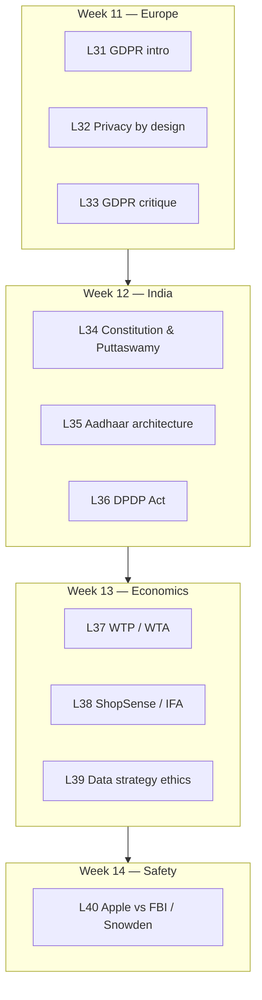

# Volume 04 Index — Lectures 31–40

**Course:** NPTEL — Cyber Security and Privacy (Prof. Saji K. Mathew, IIT Madras)  
**Volume focus:** GDPR, India (DPDP & Aadhaar), privacy economics, strategy & safety  
**Weeks covered:** 11–14

---

## Quick navigation

| Lecture | Title | Week | Video |
|---------|-------|------|-------|
| [L31](vol-04-lectures-31-40.md#lecture-31--privacy-regulation-in-europe--part-1) | Privacy regulation in Europe — Part 1 | 11 | [YouTube](https://www.youtube.com/watch?v=qtTFHNVUDBg) |
| [L32](vol-04-lectures-31-40.md#lecture-32--privacy-regulation-in-europe--part-2) | Privacy regulation in Europe — Part 2 | 11 | [YouTube](https://www.youtube.com/watch?v=gt8j3cUCL-I) |
| [L33](vol-04-lectures-31-40.md#lecture-33--privacy-regulation-in-europe--part-3) | Privacy regulation in Europe — Part 3 | 11 | [YouTube](https://www.youtube.com/watch?v=TSx88vrSfG0) |
| [L34](vol-04-lectures-31-40.md#lecture-34--privacy-the-indian-way--part-1) | Privacy: The Indian Way — Part 1 | 12 | [YouTube](https://www.youtube.com/watch?v=fobfwNopJtc) |
| [L35](vol-04-lectures-31-40.md#lecture-35--privacy-the-indian-way--part-2) | Privacy: The Indian Way — Part 2 | 12 | [YouTube](https://www.youtube.com/watch?v=oIUjD7JmDoU) |
| [L36](vol-04-lectures-31-40.md#lecture-36--privacy-the-indian-way--part-3) | Privacy: The Indian Way — Part 3 | 12 | [YouTube](https://www.youtube.com/watch?v=8MDW4UP7Quc) |
| [L37](vol-04-lectures-31-40.md#lecture-37--information-privacy-economics-and-strategy--part-1) | Information privacy: Economics and strategy — Part 1 | 13 | [YouTube](https://www.youtube.com/watch?v=qXHNviJSQD8) |
| [L38](vol-04-lectures-31-40.md#lecture-38--information-privacy-economics-and-strategy--part-2) | Information privacy: Economics and strategy — Part 2 | 13 | [YouTube](https://www.youtube.com/watch?v=LwARGPiu2oc) |
| [L39](vol-04-lectures-31-40.md#lecture-39--information-privacy-economics-and-strategy--part-3) | Information privacy: Economics and strategy — Part 3 | 13 | [YouTube](https://www.youtube.com/watch?v=EjOF_cVzvNE) |
| [L40](vol-04-lectures-31-40.md#lecture-40--privacy-strategy-and-safety--part-1) | Privacy: Strategy and safety — Part 1 | 14 | [YouTube](https://www.youtube.com/watch?v=All1JR-Avjw) |

---

## Volume arc

### Block summaries

| Block | Lectures | Core themes |
|-------|----------|-------------|
| **GDPR** | L31–L33 | Six principles, legal bases, DPO/DPIA, fines, privacy-by-design, third-country transfers, business impact |
| **India** | L34–L36 | Fundamental right to privacy, Aadhaar platform, weak links, PDP → DPDP 2023, data localization debate |
| **Privacy economics** | L37–L39 | Valuation, privacy paradox, behavioural economics, loyalty-program data trade, RBV strategy risks |
| **Strategy & safety** | L40 | Encryption, PRISM/Snowden, privacy vs national security, Apple–FBI backdoor debate |

---

## Key frameworks & statutes

| Framework | Volume location |
|-----------|-----------------|
| **GDPR** (EU 2016/679, effective 2018) | L31–L33 |
| **Privacy by Design** (Ann Cavoukian) | L32 |
| **Puttaswamy judgment** (2017) | L34 |
| **Aadhaar Act** & UIDAI architecture | L35 |
| **DPDP Act 2023** (India) | L36 |
| **WTP / WTA** (behavioural privacy valuation) | L37 |
| **FIPPs purpose limitation** | L39 |

---

## Mermaid diagrams in this volume

- GDPR stakeholder & compliance flow (L31)
- GDPR vs EU Data Protection Directive comparison (L31)
- DPDP three-actor model (L36)
- PDP vs DPDP comparison (L36)
- Privacy economics WTP/WTA paradox (L37)
- Data-trade stakeholder triangle (L38)
- Apple encryption / backdoor tension (L40)

---

## Cases & readings

| Item | Lecture |
|------|---------|
| GDPR student presentation + Microsoft compliance article | L31–L32 |
| Justice K.S. Puttaswamy v. Union of India | L34 |
| IIT Delhi Aadhaar security paper | L35 |
| *The Dark Side of Customer Analytics* (ShopSense / IFA) | L38 |
| *Apple: Privacy vs. Safety* (Snowden / FBI) | L40 |

---

## Related volumes

- [← Volume 03: Lectures 21–30](vol-03-lectures-21-30.index.md)
