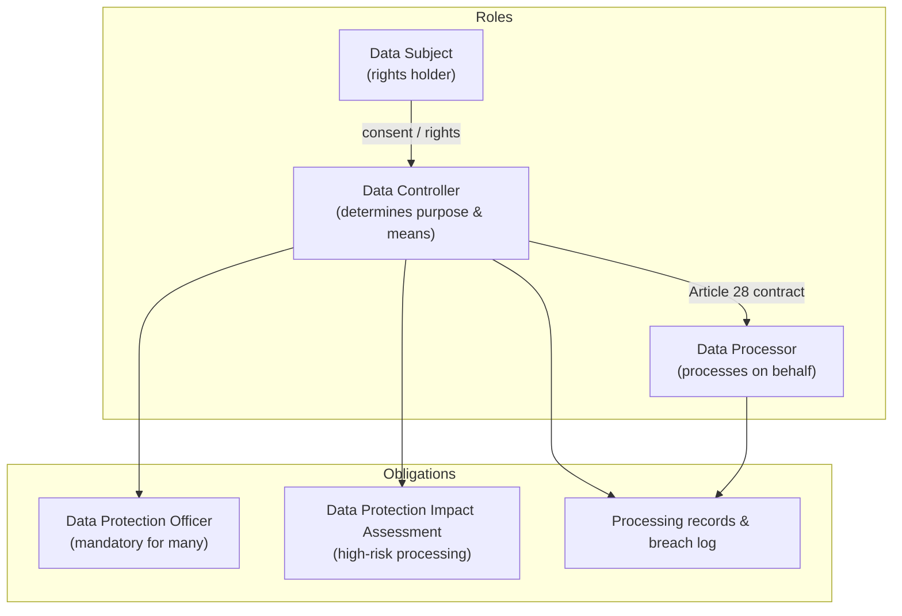
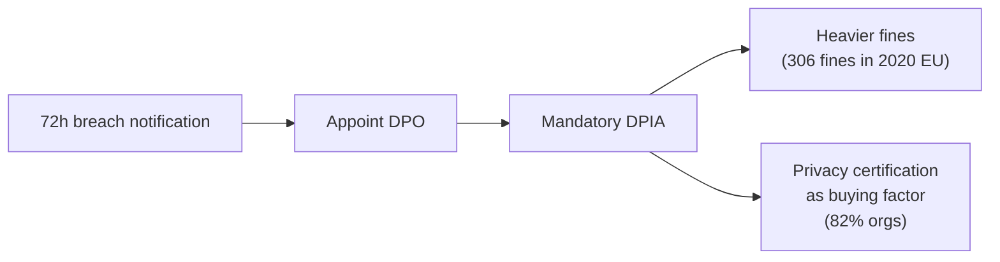
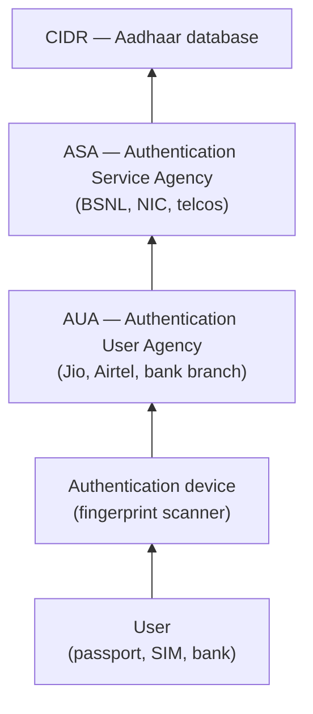
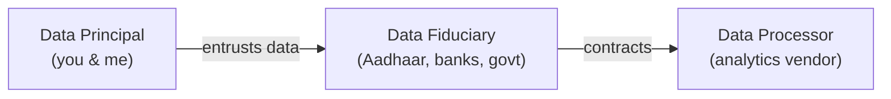
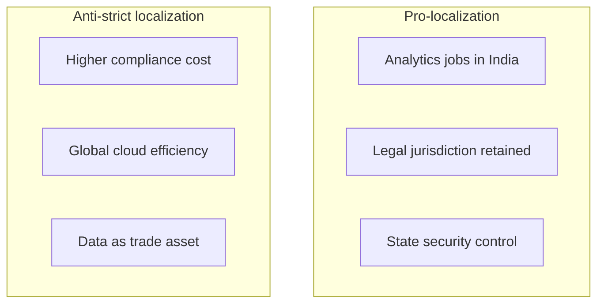
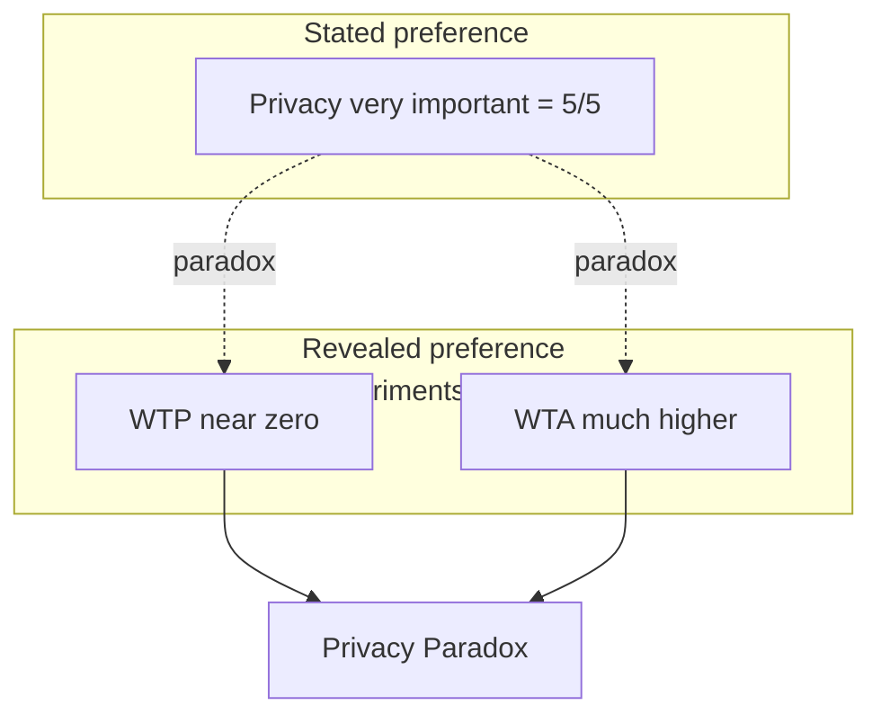
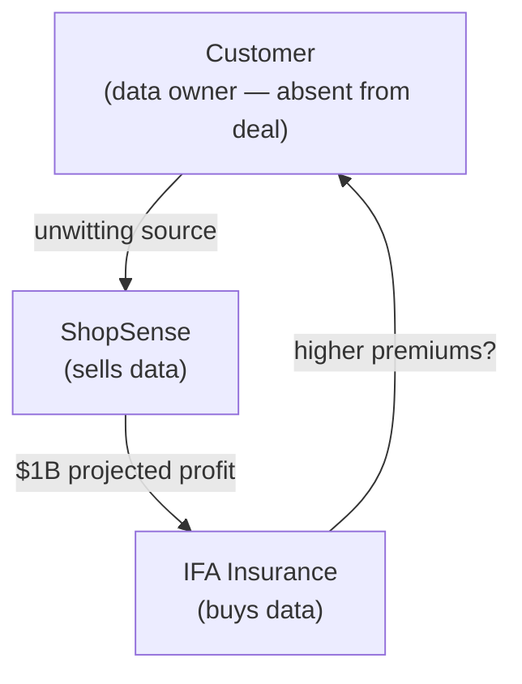
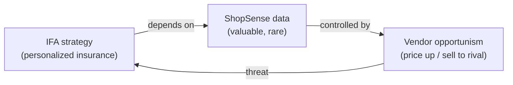
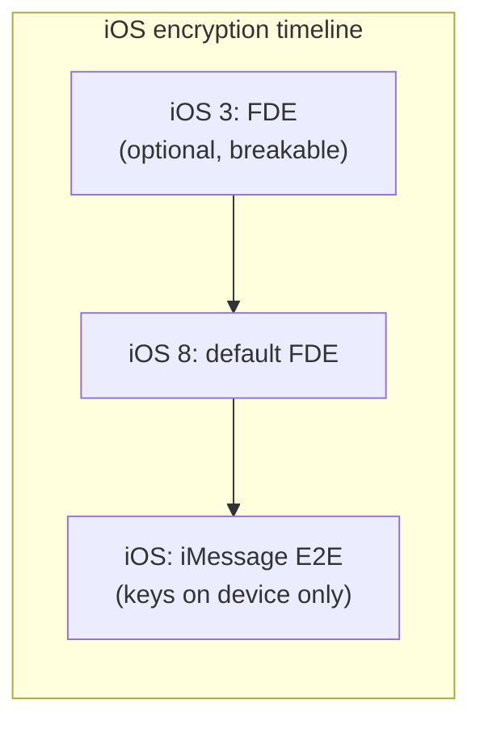
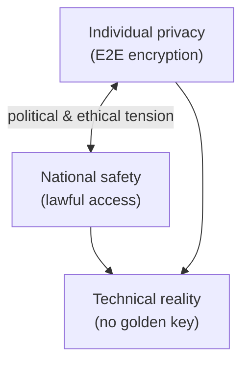

# Cyber Security and Privacy — Volume 04 Notes

**Lectures 31–40** | Prof. Saji K. Mathew, IIT Madras (NPTEL)  
**Topics:** GDPR, India (DPDP & Aadhaar), privacy economics, strategy & safety

---

## Lecture 31 — Privacy regulation in Europe — Part 1

| Field | Detail |
|-------|--------|
| **Week** | 11 |
| **Video** | [https://www.youtube.com/watch?v=qtTFHNVUDBg](https://www.youtube.com/watch?v=qtTFHNVUDBg) |
| **Digimat ID** | `qtTFHNVUDBg` |

### Learning objectives

- Contrast EU **1995 Directive (DPD)** with **GDPR (2018)**.
- Explain GDPR scope, six principles, and six legal bases for processing.
- Map controller/processor joint liability and penalty structure.

### Why GDPR?

- **4.76B** social-media users globally (2023); digital marketing drives demand for personal data.
- **DPD (1995)**: Non-binding directive — member states implemented inconsistently.
- **GDPR (Regulation 2016/679)**: Uniform, enforceable law from **25 May 2018**.

### GDPR scope

Applies when:

1. Establishment in EU member state, **or**
2. Processing data of individuals **in the EU** (regardless of processor location).

**Personal data**: Any information identifying a person directly or indirectly (name, biometric, IP, device ID, geolocation).

### Six GDPR principles

| Principle | Requirement |
|-----------|-------------|
| **Lawfulness, fairness, transparency** | Clear disclosure of processing |
| **Purpose limitation** | Specified, explicit, legitimate purposes only |
| **Data minimization** | Adequate, relevant, limited |
| **Accuracy** | Keep correct; rectify on request |
| **Storage limitation** | Delete when purpose served |
| **Integrity & confidentiality** | CIA-aligned security |

### Six legal bases for processing

1. **Consent** — freely given, specific, informed
2. **Contract** — necessary to perform agreement
3. **Legal obligation** — e.g., KYC/AML
4. **Vital interests** — emergency medical care
5. **Public interest** — criminal investigation
6. **Legitimate interests** — balanced against individual rights (e.g., recruitment)

### GDPR architecture

### Penalties & examples

- Up to **€20M or 4% global annual turnover** (whichever is higher).
- **Amazon** ~€746M (consent); **WhatsApp** (unclear policies); **Google** (cookie refusal UX); **British Airways** (post-breach fine despite no intent).

### GDPR vs DPD — key changes

| Aspect | DPD (Directive) | GDPR (Regulation) |
|--------|-----------------|-------------------|
| Binding force | Member-state laws varied | Direct application EU-wide |
| Personal data scope | Direct identifiers | Includes indirect/quasi-identifiers |
| Consent | Weak opt-in | Explicit opt-in required |
| Processor liability | Controller only | **Joint liability** |
| DPO | Optional | Mandatory (many cases) |
| DPIA | Optional | Mandatory for high-risk |
| Breach notification | Varied by state | **72 hours** uniform |
| Fines | Lower, inconsistent | Up to 4% global revenue |

### Data subject rights

- Access, rectification, erasure ("right to be forgotten"), restrict processing, data portability, object to processing.

### Summary

GDPR shifts power to individuals, imposes accountability on controllers **and** processors, and sets the global benchmark India and 120+ countries now emulate.

### Review questions

1. When does GDPR apply to an Indian IT services firm?
2. Name three legal bases besides consent.
3. Why are processors now jointly liable?

---

## Lecture 32 — Privacy regulation in Europe — Part 2

| Field | Detail |
|-------|--------|
| **Week** | 11 |
| **Video** | [https://www.youtube.com/watch?v=gt8j3cUCL-I](https://www.youtube.com/watch?v=gt8j3cUCL-I) |
| **Digimat ID** | `gt8j3cUCL-I` |

### Learning objectives

- Apply **Privacy by Design** (Ann Cavoukian) seven principles.
- Implement GDPR operational requirements: records, DPIA, breach response, cross-border transfers.
- Assess organizational compliance maturity post-GDPR.

### Privacy by Design — seven foundations

| # | Principle |
|---|-----------|
| 1 | **Proactive not reactive** — preventative |
| 2 | **Privacy as default** — no action required from user |
| 3 | **Full functionality** — positive-sum, not false trade-offs |
| 4 | **End-to-end security** — full lifecycle |
| 5 | **Visibility & transparency** |
| 6 | **Respect for user privacy** — user-centric |
| 7 | **Embedded into design** — not an afterthought |

> "Privacy knows no borders; we protect it globally or nowhere." — Ann Cavoukian

### Microsoft / practitioner requirements

1. **Privacy by design & default** — IT systems, business practices, network architecture; strength commensurate with data sensitivity.
2. **Record keeping** — Processing activities, categories, third parties, breach history.
3. **DPIA** — For new high-risk processing: nature, scope, purpose, harm likelihood/severity.
4. **Breach response** — Notify authority within **72 hours**; inform affected individuals; detective controls.
5. **Third-country transfers** — Adequacy decision OR Standard Contractual Clauses (SCCs) / Binding Corporate Rules (BCRs).

### Organizational manifest changes

**COVID impact**: Work-from-home expanded attack surface → surge in GDPR penalties 2020–2021 (€1.7M → €12M+ tracked fines).

### Global ripple effect

Australia, Brazil (LGPD), Canada, China (PIPL), India (DPDP), Israel, Japan, Nigeria/AU — GDPR-model laws proliferating.

### Summary

Compliance is operational: DPO, DPIA, pseudonymization, encryption, access control, incident response — privacy becomes **brand differentiator**.

### Review questions

1. What does "privacy as default" mean for cookie banners?
2. When is a DPIA mandatory?
3. How do SCCs enable India-EU data flows?

---

## Lecture 33 — Privacy regulation in Europe — Part 3

| Field | Detail |
|-------|--------|
| **Week** | 11 |
| **Video** | [https://www.youtube.com/watch?v=TSx88vrSfG0](https://www.youtube.com/watch?v=TSx88vrSfG0) |
| **Digimat ID** | `TSx88vrSfG0` |

### Learning objectives

- Debate GDPR's impact on **ad-tech business models**.
- Evaluate cookie-consent UX and implementation gaps.
- Assess GDPR **adequacy** list and third-country treatment of India.

### Critique: regulation vs innovation

**Pro-GDPR**: Protects individuals from surveillance capitalism; brings accountability (Equifax lesson); privacy certifications win customers.

**Con**: Strict rules may stifle ad-funded platforms (Google/Facebook revenue = targeted ads); consent banners become **click fatigue** — users accept without reading; not true informed consent.

### Cookie consent paradox

- Post-GDPR: ubiquitous banners — "Accept all" vs "Manage" — most users click through.
- Regulation intended **opt-in**; practice often **dark-pattern nudge** toward acceptance.
- IRCTC anecdote: ads reflect browsing history — user blamed, not platform.

### GDPR third countries

**14 adequacy countries** (express data-transfer permission) — **USA and India NOT on list**.

- India = **third country** → contracts (SCCs) required for EU personal data.
- IIT Madras processes EU exchange-student data via MOUs — often **no GDPR clauses**; awareness gap until breach complaint.

### Uniform application

- GDPR harmonized across EU (unlike DPD); post-Brexit UK GDPR largely aligned.
- Ireland vs Netherlands regulator speed debated, but any member can report violations.

### Summary

GDPR is necessary but imperfect — implementation quality matters more than text; global firms treat it as cost of EU market access.

### Review questions

1. Why isn't the US on the adequacy list?
2. Does cookie consent achieve informed consent?
3. Should Indian universities worry about GDPR?

---

## Lecture 34 — Privacy: The Indian Way — Part 1

| Field | Detail |
|-------|--------|
| **Week** | 12 |
| **Video** | [https://www.youtube.com/watch?v=fobfwNopJtc](https://www.youtube.com/watch?v=fobfwNopJtc) |
| **Digimat ID** | `fobfwNopJtc` |

### Learning objectives

- Trace Indian privacy from **Constitution Art. 21** through **Puttaswamy (2017)**.
- Balance **fundamental right to privacy** against state surveillance powers.
- Understand threefold test for privacy invasion.

### Constitutional foundation

**Article 21**: No person deprived of life or personal liberty except by **procedure established by law**.

**Indian Telegraph Act (1885)**: State intercept authority — never repealed; amended 1972 for wiretapping.

### Puttaswamy judgment (24 Aug 2017)

**Justice K.S. Puttaswamy** PIL challenged Aadhaar mandatory linkage.

> Privacy is a **fundamental right** protecting inner sphere from state and non-state interference; enables autonomous life choices.

**Not absolute** — qualified by legitimate state aims.

### Threefold test for invasion

| Test | Meaning |
|------|---------|
| **Legality** | Existence of law |
| **Legitimate state aim** | Defined need (security, welfare) |
| **Proportionality** | Rational, minimal collection |

~10 agencies (incl. NCB) may intercept with **ED** approval (Income Tax exempt per belief).

### Aadhaar tension

- Mandatory Aadhaar for benefits vs autonomy to refuse biometric disclosure.
- **Privacy paradox in India**: Rural majority prioritizes benefits over privacy abstract; urban educated drive debate.

### Legislative timeline

| Year | Event |
|------|-------|
| 2016 | Justice Srikrishna Committee formed |
| 2018 | PDP draft; GDPR enacted |
| 2019 | Cabinet PDP bill (amended — govt access powers) |
| 2022 | PDP withdrawn |
| 2023 | **DPDP Act** passed |

### Summary

India recognizes privacy constitutionally while preserving intercept powers — regulation must balance digital economy unlock with citizen protection.

### Review questions

1. Who is called the father of Indian data privacy?
2. What are the three Puttaswamy tests?
3. Why is privacy not absolute?

---

## Lecture 35 — Privacy: The Indian Way — Part 2

| Field | Detail |
|-------|--------|
| **Week** | 12 |
| **Video** | [https://www.youtube.com/watch?v=oIUjD7JmDoU](https://www.youtube.com/watch?v=oIUjD7JmDoU) |
| **Digimat ID** | `oIUjD7JmDoU` |

### Learning objectives

- Explain **Aadhaar** rationale, platform architecture, and weak links.
- Map UIDAI layered authentication model.
- Evaluate security claims vs architectural criticism.

### Why Aadhaar?

- **₹0.70 of ₹1** reached intended beneficiary (leakage/corruption).
- Multiple identities (ration cards, voter IDs) enabled fraud.
- **Nandan Nilekani** (UIDAI): minimal data collection; platform for layered apps.

### Aadhaar platform

- **12-digit** unique ID; world's largest biometric ID system.
- **CIDR** (Central Identities Data Repository) — core database ("10-foot wall" physical security claim).

### Architecture layers

- Authentication returns **yes/no** — raw biometrics not released to AUAs.
- **Weak links**: vendor data collection (~1,000 vendors fired after leaks); Aadhaar numbers aggregated by third parties; pseudo-ID (VID) mitigation.

### Criticisms

| Issue | Detail |
|-------|--------|
| **Vendor risk** | Thousands of enrollment agencies — leakage at collection |
| **Linking attacks** | Aadhaar + other datasets → profiling |
| **Mandatory linkage** | SC restricted mandatory use for essential services |
| **IIT Delhi paper** | Architecture vulnerabilities cited in Srikrishna draft |

### Cartoon insight

"10-foot wall in front, **back door open**" — weakest link ≠ datacenter.

### Summary

Aadhaar solves identity fraud at scale but concentrates risk; security is only as strong as enrollment and AUA ecosystem.

### Review questions

1. What problem did 70-paise leakage illustrate?
2. Distinguish AUA from ASA.
3. Where have Aadhaar leaks typically occurred?

---

## Lecture 36 — Privacy: The Indian Way — Part 3

| Field | Detail |
|-------|--------|
| **Week** | 12 |
| **Video** | [https://www.youtube.com/watch?v=8MDW4UP7Quc](https://www.youtube.com/watch?v=8MDW4UP7Quc) |
| **Digimat ID** | `8MDW4UP7Quc` |

### Learning objectives

- Compare **PDP Bill** vs **DPDP Act 2023**.
- Analyze three-tier data classification and **data localization** debate.
- Map DPDP actors, penalties, and governance concerns.

### Government TOR (Srikrishna Committee)

> "Unlock the data economy while keeping citizens' data secure."

- Do not destroy data-driven businesses (Uber, Facebook in India).
- Uphold privacy as fundamental right.

### Three stakeholder model (India)

### PDP vs DPDP comparison

| Feature | PDP Bill (2019 draft) | DPDP Act 2023 |
|---------|----------------------|---------------|
| Length | 56 pages, 14 chapters | 24 pages, 6 chapters |
| Scope | Broad data regulation | **Digital personal data** only |
| Classification | Personal / Sensitive (SPD) / Critical (CPD) | No three-tier taxonomy |
| Localization | SPD & CPD must stay in India | **Diluted** — not strict residency |
| Right to be forgotten | Explicit | Subsumed under **Right to Erasure** |
| Max penalty | Lower cap | **₹250 crore** (draft up to ₹500 crore discussed) |
| Principal liability | None | **Penalties on principals** for false claims |
| Govt rule-making | Limited | **14 of 22 clauses** — govt rule-making power |

### Data localization debate

**Pro**: Data sovereignty; analytics jobs in India; foreign govts can't subpoena offshore data.

**Con**: MNCs argue Indian DC security immature; conflicts with cloud economics; corporate lobbying diluted DPDP clause.

### Conflict of interest

Government = largest data fiduciary (Aadhaar, GST) **and** rule-maker — independence concern (cf. RBI model).

**Justice Srikrishna** on amended PDP: risks **"Orwellian state."**

### Summary

DPDP modernizes Indian law concisely but balances startup economy vs rights — implementation and independent enforcement will determine success.

### Review questions

1. What changed from three-tier PDP to DPDP scope?
2. Why did data localization get diluted?
3. What is a data fiduciary?

---

## Lecture 37 — Information privacy: Economics and strategy — Part 1

| Field | Detail |
|-------|--------|
| **Week** | 13 |
| **Video** | [https://www.youtube.com/watch?v=qXHNviJSQD8](https://www.youtube.com/watch?v=qXHNviJSQD8) |
| **Digimat ID** | `qXHNviJSQD8` |

### Learning objectives

- Explain why **privacy valuation** matters in cloud contracts.
- Demonstrate **WTP vs WTA** asymmetry (privacy paradox).
- Apply behavioural economics: loss aversion, endowment effect.

### Contract valuation gap

Industry practice: **5% of contract value** penalty thumb rule for data breach — no rigorous model.

GDPR/DPDP provide **statutory caps** as negotiation anchors.

### Classroom experiment (Gmail)

| Scenario | Typical response |
|----------|------------------|
| **WTP**: Pay monthly so Google never scans email | Low amounts (₹0–100) |
| **WTA**: Accept human scanning for payment | Higher amounts demanded |

### Privacy economics model

**WTA > WTP** — irrational by neoclassical standards; explained by **behavioural economics**.

### Behavioural drivers

| Concept | Privacy application |
|---------|---------------------|
| **Loss aversion** (Kahneman) | Pain of losing privacy > pleasure of gaining money |
| **Endowment effect** | 15 years of Gmail history feels "owned" — high parting cost |
| **Prospect theory** | Certainty preferred over gambles |

### Context specificity

Privacy value varies by: data type (health > browsing), culture (Germany vs India surveys), and framing (protect vs sell).

**Contingent valuation**: Stated vs revealed preference divergence.

### Summary

Privacy lacks a universal price — contracts and regulation use proxies; managers must test WTP in target segments, not assume survey answers.

### Review questions

1. Why is WTA typically higher than WTP?
2. What is the endowment effect with Gmail?
3. Stated vs revealed preference — example?

---

## Lecture 38 — Information privacy: Economics and strategy — Part 2

| Field | Detail |
|-------|--------|
| **Week** | 13 |
| **Video** | [https://www.youtube.com/watch?v=LwARGPiu2oc](https://www.youtube.com/watch?v=LwARGPiu2oc) |
| **Digimat ID** | `LwARGPiu2oc` |

### Learning objectives

- Analyze **data monetization** via loyalty programs (*ShopSense / IFA* case).
- Evaluate legal vs ethical dimensions of third-party data sale.
- Apply **Resource-Based View** to data-dependent strategy.

### Case: *The Dark Side of Customer Analytics*

**ShopSense** (Dallas supermarket): loyalty program + in-house analytics → coupons, pattern marketing. Already sells scanner data — **"makes more money from data than meat."**

**IFA Insurance**: seeks ShopSense 10-year Michigan purchase data to **personalize health premiums** (trans-fat purchases correlated with claims — pilot validated).

### Stakeholder triangle

### ShopSense perspective

| Pro | Con |
|-----|-----|
| Legal in operating states (loyalty T&C consent) | Customer trust erosion |
| ~$1B incremental profit, zero marginal cost | Opt-out from loyalty program |
| Wellness program spin possible | Loss of control over data use |
| Expert: short-sighted, not customer-centric | Reputational backlash if exposed |

### IFA perspective

| Pro | Con |
|-----|-----|
| Rich risk signals; personalized insurance (new product) | Data accuracy noise (buying for family) |
| Legal; public expects insurer risk analysis | **Resource not owned** — vendor dependence |
| Competitive moat if exclusive rights | Regulatory change (GDPR-style) risk |
| Progressive precedent (safe-driver telematics) | Battered customer syndrome (focus top 10%) |

### Ethics vs legality

- Loyalty enrollment = **legal consent** for analytics.
- Sharing with insurer for premium pricing = **ethical grey** — customer not in negotiation.
- **Progressive** model: transparent device + money-back for safe driving — customer opts in knowingly.

### Summary

Data trade is profitable and often legal; ethical failure occurs when the **data subject is excluded** from value exchange.

### Review questions

1. Why is the customer the "missing third party"?
2. What RBV risk does IFA face?
3. How does Progressive differ ethically from IFA–ShopSense?

---

## Lecture 39 — Information privacy: Economics and strategy — Part 3

| Field | Detail |
|-------|--------|
| **Week** | 13 |
| **Video** | [https://www.youtube.com/watch?v=EjOF_cVzvNE](https://www.youtube.com/watch?v=EjOF_cVzvNE) |
| **Digimat ID** | `EjOF_cVzvNE` |

### Learning objectives

- Apply **purpose limitation, transparency, data minimization** to strategic decisions.
- Propose **joint-product** model resolving ethics of data sharing.
- Connect regulation (GDPR) to trust-based competitive advantage.

### McKinsey 2019 trust survey

- Healthcare & financial services: highest confidence handling data.
- CPG, automotive, government: **~10%** confidence.
- Selective disclosure erodes trust — full transparency raises confidence.

### Ethical decision framework

| Principle | Application |
|-----------|-------------|
| **Purpose limitation** | Grocery data for coupons ≠ insurance underwriting |
| **Transparency** | Disclose partners and uses at collection |
| **Data minimization** | Collect only fields needed for stated purpose |

### Amazon loyalty pricing

- Same product, different prices for loyal vs new customers — sued; lock-in enables **opportunistic pricing**.
- Bezos: "We don't throw away any data."

### Strategic dependence risk

**KBV counter**: Insights may be proprietary even if raw data is not — but raw-material dependence remains.

### Proposed solution: joint product

**IFA–ShopSense Wellness Insurance** — co-branded, explicit opt-in, premium discounts for healthy purchasing patterns. Customer in the value loop; data sharing implicit in product choice.

### Summary

Privacy strategy must align economics with ethics — GDPR-style principles are competitive tools, not only compliance burdens.

### Review questions

1. Why does McKinsey link trust to sector?
2. What is the joint-product remedy?
3. How can data minimization build advantage?

---

## Lecture 40 — Privacy: Strategy and safety — Part 1

| Field | Detail |
|-------|--------|
| **Week** | 14 |
| **Video** | [https://www.youtube.com/watch?v=All1JR-Avjw](https://www.youtube.com/watch?v=All1JR-Avjw) |
| **Digimat ID** | `All1JR-Avjw` |
| **Case** | *Apple: Privacy vs. Safety* (Parts A & B) |

### Learning objectives

- Synthesize course themes: governance, regulation, economics, encryption.
- Analyze **Snowden/PRISM** impact on industry and public trust.
- Debate **privacy vs national security** — Apple default encryption vs FBI backdoor demands.

### Case framing

| Actor | Position |
|-------|----------|
| **Tim Cook (Apple)** | Privacy as fundamental right; default strong encryption (iOS 9+) |
| **James Comey (FBI)** | Encryption = "closet that cannot be opened" — justice for victims |
| **Edward Snowden** | Exposed NSA **PRISM** — bulk collection from 9 internet companies + telcos |

### PRISM & Snowden (June 2013)

- NSA + GCHQ **MUSCULAR** programs; Verizon/AT&T metadata.
- Snowden charged under Espionage Act; asylum in Russia.
- **Snowden effect**: Cisco/Qualcomm sales drop in China; Brazil data localization; "NSA-resistant" marketing by non-US firms.

### Survey highlights (2015)

- 74% prioritize privacy/freedom over national safety (claimed).
- 50% reported prior data breach; 39% no mobile password.
- Cultural variance: India/China more willing to trade data for services than Germany/Canada.

### Apple encryption evolution

**Key escrow design**: Passcode + device-unique UID → Apple **cannot** decrypt even under court order — technical impossibility claimed.

**Google response**: Gmail E2E (2010+), Android FDE optional (performance penalty on low-end hardware).

### Tim Cook's three dilemmas

1. Balance user privacy vs law-enforcement access.
2. If US gets access, **every government** (including human-rights violators) will demand same.
3. Cooperation with FBI → **customer trust** and market share risk.

**China precedent**: Apple allowed government audit of China data center — critics cite hypocrisy vs US stance.

### Privacy vs safety tension

Hypothetical: murder victim's locked iPhone holds sole evidence — justice vs principle.

### Course capstone themes

| Theme | Lectures |
|-------|----------|
| Cybersecurity governance | L21, L30 |
| Technology controls | L22–L24 |
| Privacy foundations | L25–L27 |
| Regulation | L28–L36 |
| Economics & strategy | L37–L39 |
| Safety & espionage | L40 |

### Summary

Privacy and security are neither purely technical nor purely legal — they are **strategic, political, and behavioural**. Managers must navigate paradoxical users, powerful states, and data-driven business models.

### Review questions

1. What did PRISM reveal and why did it matter commercially?
2. Why can't Apple technically comply with all decryption requests?
3. Is Apple's privacy stance consistent globally?

---

*End of Volume 04 — Course lectures 21–40 complete.*
