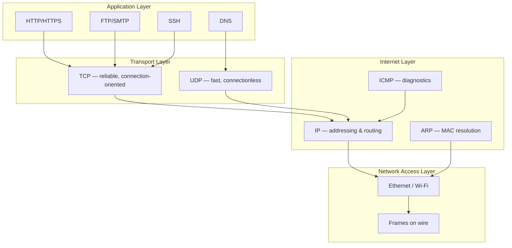

# Volume 01 — Lectures 1–10: Networking Foundations

> Ethical Hacking · NPTEL 106105217 · Prof. Indranil Sengupta

---

## L1: Introduction to Ethical Hacking

### Concepts
- **Hacking** = creative problem-solving applied to systems; **ethical hacking** = authorized security assessment with written permission.
- **Threat actors:** script kiddies, hacktivists, insiders, organized crime, nation-states.
- **Security goals (CIA triad):** Confidentiality, Integrity, Availability (+ Authentication, Non-repudiation).
- **Penetration testing phases:** Reconnaissance → Scanning → Gaining Access → Maintaining Access → Covering Tracks → Reporting.
- **Legal framework:** scope of engagement, rules of engagement (RoE), liability waiver.

### Tools
- Kali Linux (offensive security distro)
- VirtualBox / VMware (isolated lab)
- Metasploitable, DVWA (vulnerable targets)

### Attack Steps (Pentest Lifecycle)
1. Obtain signed authorization and define scope.
2. Passive recon (OSINT) → active recon (scanning).
3. Exploit identified vulnerabilities.
4. Document findings with severity ratings (CVSS).
5. Deliver remediation report to client.

### Defenses
- Security policy and acceptable-use agreements
- Bug bounty / responsible disclosure programs
- Defense-in-depth architecture
- Regular third-party audits

### Exam Bullets
- Ethical hacking requires **explicit written permission**; unauthorized access is a criminal offense.
- CIA triad is the foundation of information security objectives.
- Pentest phases: recon, scan, exploit, maintain, report.
- White-hat vs black-hat vs grey-hat distinction.
- CVSS scores rate vulnerability severity (0–10).

---

## L2: Basic Concepts of Networking — Part I

### Concepts
- **Network types:** LAN, MAN, WAN; client-server vs peer-to-peer.
- **OSI 7-layer model:** Physical → Data Link → Network → Transport → Session → Presentation → Application.
- **PDU names:** bits, frames, packets, segments, data.
- **Topologies:** bus, star, ring, mesh, hybrid.
- **Transmission media:** twisted pair (UTP/STP), coaxial, fiber optic, wireless.

### Tools
- `ipconfig` / `ifconfig` / `ip addr` — interface configuration
- `ping` — ICMP reachability test
- `traceroute` / `tracert` — path discovery

### Attack Steps
1. Map network topology via traceroute and ARP tables.
2. Identify broadcast domains and single points of failure.
3. Target hub-based (shared medium) segments for sniffing.

### Defenses
- Replace hubs with switches (microsegmentation)
- VLAN segmentation
- Physical port security (802.1X)

### Exam Bullets
- OSI Layer 3 = Network (routing); Layer 4 = Transport (TCP/UDP).
- Star topology: single switch failure isolates nodes; mesh is most fault-tolerant.
- LAN = local; WAN spans geographic distances.
- `ping` uses ICMP Echo Request/Reply (Layer 3).
- PDU at Data Link layer is a **frame**.

---

## L3: Basic Concepts of Networking — Part II

### Concepts
- **MAC address:** 48-bit hardware address (OUI + NIC-specific); flat namespace.
- **Ethernet frame structure:** preamble, dest/src MAC, type/length, payload, FCS.
- **CSMA/CD** (legacy Ethernet): collision detection on shared bus.
- **Switches:** learn MAC→port via CAM table; forward unicast, flood unknown/broadcast.
- **VLANs (802.1Q):** logical segmentation; tag inserted in frame header.

### Tools
- `arp -a` — view ARP cache
- `macof` (dsniff suite) — MAC flooding attack (lab only)
- Wireshark — capture and inspect frames

### Attack Steps
1. Read CAM table size on target switch.
2. Flood with random source MACs → CAM overflow → switch acts as hub.
3. Sniff traffic on VLAN after flooding or using double-tagging.

### Defenses
- Port security (limit MACs per port)
- Dynamic ARP Inspection (DAI)
- VLAN access control lists

### Exam Bullets
- Switch operates at **Layer 2**; router at **Layer 3**.
- CAM table maps MAC address → switch port.
- Broadcast MAC = `FF:FF:FF:FF:FF:FF`.
- 802.1Q VLAN tag is 4 bytes inserted in Ethernet frame.
- MAC flooding causes switch to flood frames to all ports (fail-open).

---

## L4: TCP/IP Protocol Stack — Part I

### Concepts
- **TCP/IP model (4 layers):** Network Access → Internet → Transport → Application.
- Maps loosely to OSI: Layers 1–2 → Network Access; Layer 3 → Internet; Layer 4 → Transport; Layers 5–7 → Application.
- **Encapsulation:** each layer adds its header (and sometimes trailer) to data from layer above.
- **Internet layer protocols:** IP (v4/v6), ICMP, IGMP, ARP.
- **IP datagram:** version, header length, TTL, protocol field, src/dst address, payload.

### TCP/IP Stack Diagram

### Tools
- Wireshark (protocol dissection)
- `tcpdump` — CLI packet capture

### Attack Steps
1. Capture packets at Network Access layer to see full frame headers.
2. Identify cleartext protocols (FTP, Telnet, HTTP) at Application layer.
3. Craft raw IP packets with `hping3` or Scapy.

### Defenses
- Encrypt at Transport (TLS) or Application layer
- Network segmentation to limit broadcast domains
- Egress filtering

### Exam Bullets
- TCP/IP has **4 layers**; OSI has **7**.
- IP operates at Internet layer; provides logical addressing only (no reliability).
- TTL field prevents infinite routing loops (decremented per hop).
- Protocol field in IP header identifies TCP (6) or UDP (17).
- Encapsulation: Application data → TCP segment → IP packet → Ethernet frame.

---

## L5: TCP/IP Protocol Stack — Part II

### Concepts
- **Application layer protocols:** HTTP (80), HTTPS (443), DNS (53), SMTP (25), FTP (21), SSH (22), Telnet (23).
- **Socket API:** (IP address, port number, protocol) uniquely identifies endpoint.
- **Well-known ports:** 0–1023; registered 1024–49151; dynamic/ephemeral 49152–65535.
- **DNS resolution:** recursive (client→resolver) vs iterative (resolver→root→TLD→authoritative).
- **DHCP (DORA):** Discover, Offer, Request, Acknowledge — auto IP configuration.

### Tools
- `nslookup` / `dig` — DNS queries
- `host` — DNS lookup
- `netstat -tuln` — listening ports
- `dnsenum` — DNS enumeration

### Attack Steps
1. Enumerate DNS records (A, MX, NS, TXT, AXFR) for target domain.
2. Identify subdomains via brute-force (`dnsenum`, `sublist3r`).
3. Map open services via port scan after DNS resolution.

### Defenses
- DNSSEC (signed DNS responses)
- Disable zone transfers (AXFR) to unauthorized clients
- Split-horizon DNS for internal vs external views

### Exam Bullets
- DNS uses **UDP port 53** (TCP for large transfers/zone transfers).
- DHCP provides IP, subnet mask, gateway, and DNS server.
- Socket = IP + port + protocol (TCP/UDP).
- `dig @server domain ANY` queries all record types.
- Telnet (port 23) transmits credentials in cleartext — never use in production.

---

## L6: IP Addressing and Routing — Part I

### Concepts
- **IPv4 address:** 32 bits, dotted-decimal notation (e.g., 192.168.1.10).
- **Address classes (legacy):** A (0–127), B (128–191), C (192–223); classless CIDR replaced this.
- **Private ranges (RFC 1918):** 10.0.0.0/8, 172.16.0.0/12, 192.168.0.0/16.
- **Special addresses:** loopback 127.0.0.0/8, link-local 169.254.0.0/16, broadcast (host bits all 1s).
- **Static vs dynamic** addressing; NAT maps private→public.

### Tools
- `ip route` / `route -n` — routing table
- `iptables` / `nftables` — NAT rules
- `nmap -sn` — host discovery (no port scan)

### Attack Steps
1. Identify private IP ranges from traceroute or leaked configs.
2. Scan internal subnets after VPN compromise or pivot.
3. Exploit misconfigured NAT/port forwarding.

### Defenses
- Network Address Translation (hide internal topology)
- RFC 1918 addressing with firewall rules
- IP allowlisting for management interfaces

### Exam Bullets
- Private ranges: 10.x, 172.16–31.x, 192.168.x (RFC 1918).
- Loopback = 127.0.0.1; used for local service testing.
- CIDR notation: IP/prefix-length (e.g., /24 = 255.255.255.0).
- NAT translates private IPs to one public IP (PAT/overloading).
- Classless addressing (CIDR) replaced classful A/B/C.

---

## L7: IP Addressing and Routing — Part II

### Concepts
- **Routing table entries:** destination network, next-hop, interface, metric.
- **Default gateway:** route for all non-local destinations (0.0.0.0/0).
- **Static routing:** manually configured; predictable but inflexible.
- **Dynamic routing:** routers exchange topology via routing protocols.
- **Longest prefix match:** most specific route wins when multiple match.

### Tools
- `traceroute` — per-hop TTL expiry reveals path
- `mtr` — continuous traceroute + ping
- `ip route show` — Linux routing table

### Attack Steps
1. Analyze traceroute output to map network topology and identify border routers.
2. Inject false routes if routing protocol authentication is absent (RIP).
3. Pivot through compromised host to reach internal subnets.

### Defenses
- Route authentication (OSPF MD5, BGP MD5/TCP-AO)
- Filter routing updates at edge
- Disable unnecessary routing protocols on endpoints

### Exam Bullets
- Default route = 0.0.0.0/0 pointing to gateway.
- Longest prefix match selects the most specific route.
- Static routes: admin-configured; no auto-failover.
- Traceroute exploits ICMP Time Exceeded (TTL expiry) messages.
- Host uses routing table to decide local delivery vs forwarding to gateway.

---

## L8: TCP and UDP — Part I

### Concepts
- **TCP:** connection-oriented, reliable, ordered delivery, flow control, congestion control.
- **Three-way handshake:** SYN → SYN-ACK → ACK (establishes connection).
- **TCP header fields:** src/dst port, seq number, ack number, flags (SYN/ACK/FIN/RST/PSH), window size.
- **UDP:** connectionless, no guarantee of delivery, no ordering, lower overhead.
- **Use cases:** TCP = HTTP, SSH, FTP; UDP = DNS, VoIP, streaming, gaming.

### Tools
- `nc` (netcat) — TCP/UDP connect/listen
- `hping3` — craft TCP/UDP/ICMP packets
- Wireshark — filter `tcp.flags.syn==1`

### Attack Steps
1. **SYN scan** (`nmap -sS`): send SYN, analyze SYN-ACK vs RST response without completing handshake.
2. **TCP connect scan** (`nmap -sT`): full 3-way handshake — logged by target.
3. **Banner grabbing:** connect to open port, read service banner.

### Defenses
- SYN cookies (mitigate SYN flood)
- Stateful firewall (track connection state)
- Disable unnecessary services

### Exam Bullets
- TCP 3-way handshake: SYN (seq=x) → SYN-ACK (seq=y, ack=x+1) → ACK (ack=y+1).
- SYN scan is stealthier than connect scan (no full connection).
- UDP has no handshake; stateless and faster but unreliable.
- TCP sequence numbers enable ordered, reliable delivery.
- RST flag immediately terminates a TCP connection.

---

## L9: TCP and UDP — Part II

### Concepts
- **TCP connection teardown:** FIN → ACK → FIN → ACK (four-way) or RST for abrupt close.
- **TCP state machine:** CLOSED → SYN_SENT → ESTABLISHED → FIN_WAIT → CLOSED.
- **Flow control:** sliding window, receiver advertises window size.
- **Congestion control:** slow start, congestion avoidance, fast retransmit (TCP Reno/CUBIC).
- **Port scanning types:** SYN, connect, FIN, NULL, Xmas, ACK, UDP.

### Tools
- `nmap -sS -sU` — SYN + UDP scan
- `nmap -sF -sN -sX` — FIN, NULL, Xmas scans
- `ss -t state established` — active TCP connections

### Attack Steps
1. FIN/NULL/Xmas scans: send abnormal flag combos; closed ports return RST (RFC 793), open/filtered may drop.
2. UDP scan: send payload to UDP port; ICMP Port Unreachable = closed.
3. Identify firewall behavior (filtered = no response vs closed = RST).

### Defenses
- IDS/IPS detecting scan patterns
- Rate limiting on SYN packets
- Close unused ports; use port knocking for admin access

### Exam Bullets
- FIN scan: send FIN packet; closed port → RST, open port → no response (RFC-compliant).
- Filtered port: firewall drops probe — nmap reports "filtered."
- UDP scanning is slower and less reliable than TCP scanning.
- TCP sliding window provides flow control between sender and receiver.
- Four-way teardown uses FIN and ACK flags in both directions.

---

## L10: IP Subnetting

### Concepts
- **Subnet mask:** separates network prefix from host portion (e.g., /24 = 255.255.255.0).
- **Subnetting:** divide a network into smaller broadcast domains.
- **CIDR calculation:** number of hosts = 2^(32-prefix) − 2 (subtract network and broadcast).
- **VLSM:** Variable Length Subnet Mask — different subnet sizes in same network.
- **Supernetting (route aggregation):** combine contiguous subnets into one route advertisement.

### Tools
- `ipcalc` — CIDR calculator
- `nmap 192.168.1.0/24` — scan entire subnet
- `nmap --top-ports 1000 10.0.0.0/8` — large-range scan (use with care)

### Attack Steps
1. Determine target subnet from WHOIS, DNS, or traceroute.
2. Host discovery: `nmap -sn 192.168.1.0/24` (ARP ping on local LAN).
3. Port scan live hosts: `nmap -sV -O 192.168.1.0/24`.

### Defenses
- Microsegmentation with /26 or smaller subnets
- Network ACLs between subnets
- Monitor ARP traffic for rogue devices

### Exam Bullets
- /24 subnet: 256 addresses, 254 usable hosts.
- /30 subnet: 4 addresses, 2 usable (common for point-to-point links).
- Subnet mask AND IP address = network address.
- VLSM allows efficient IP allocation with different prefix lengths.
- `nmap -sn` performs ping sweep without port scanning.

---

*Next: [Volume 02 — Routing, Demos & Nessus](vol-02.md)*
