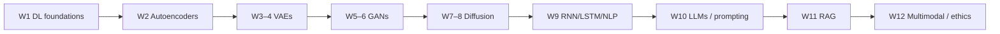

# L00: Course introduction

**Video:** [Intro](https://www.youtube.com/watch?v=9g8BtJMHVwc) · 6:42  
**Speakers in this video:** Prof. Sriram Ganapathy (IISc), Prof. Baishali Garai (RV University), Prof. Ashwini Kodipalli (PES University), plus TAs Tripti and Debarpan

### Learning objectives

- Place the 12-week course in the sequence after *Foundations of Deep Learning*.
- List the week-by-week theory map and the matching hands-on track.

### Who the course is for

Prof. Ganapathy frames this as a follow-on to the earlier NPTEL deep-learning course. It is aimed at **UG and PG students** and **working professionals** who want a foundations-plus-practice path through generative AI and large language models. The offering is a **12-week** NPTEL course with **weekly hands-on sessions** and **monthly live faculty interactions**. It is jointly taught by IISc, RV University, and PES University.

### Why generative AI now

Prof. Garai’s pitch is the shift from *analysis* to *creation*: models that write stories, emails, code, and images in seconds. Industry already uses them for customer support, software development, product design, and mining large corpora. The course’s job is to answer **how these systems actually work**—foundations, mathematics, and algorithms—not only demos.

### Twelve-week theory map

Prof. Kodipalli walks the syllabus in order. This notes-2 set follows the **same order as the videos**, not a condensed 36-lecture remap.

| Weeks | Theory focus |
|------:|--------------|
| 1 | Deep-learning foundations needed for generative models |
| 2 | Autoencoders and representation learning |
| 3–4 | Variational autoencoders, advanced VAEs, applications |
| 5–6 | GANs, important variants, applications |
| 7–8 | Diffusion models |
| 9 | Sequence models (RNN/LSTM) and NLP foundations |
| 10 | LLM foundations and prompt engineering |
| 11 | Retrieval-augmented generation (RAG) |
| 12 | LLM capabilities, multimodal AI, ethics |

### Hands-on track (Tripti)

The labs are not an afterthought. The announced implementation sequence is:

| Weeks | Labs announced in the intro |
|------:|-----------------------------|
| 1–2 | CNNs, transfer learning, ensemble models, then the **autoencoder** as the first generative model |
| 3–4 | Representation learning: train a **VAE** and a **conditional VAE** |
| 5–6 | Adversarial models: **DCGAN**, **cGAN**, **CycleGAN** |
| 7–8 | Diffusion: simulate **forward** noise, **reverse** denoising, and a **U-Net** |
| 9–10 | Sequence/LLM stack: **RNN**, **LSTM**, **transformer** |

### Later LLM / diffusion labs (Debarpan)

Debarpan’s sessions (later weeks) cover:

- Forward diffusion and reverse denoising
- LLM **inference** and **prompt engineering**
- Multimodal LLMs
- **Hallucinations**, and **RAG** as a way to ground generation

### Key takeaways

- The course is theory *and* weekly coding, from CNN recap through RAG.
- The video order is the authority for these notes: autoencoders → VAEs → GANs → diffusion → sequence models → transformers/LLMs → RAG/ethics.
- Several topics advertised for weeks 11–12 (RAG, multimodal, ethics, hallucinations) appear in this intro; they are expanded only when a later lecture actually teaches them.

---
