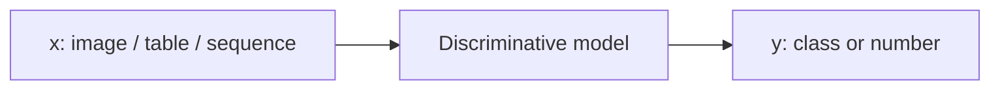
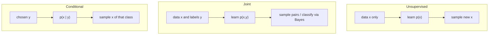
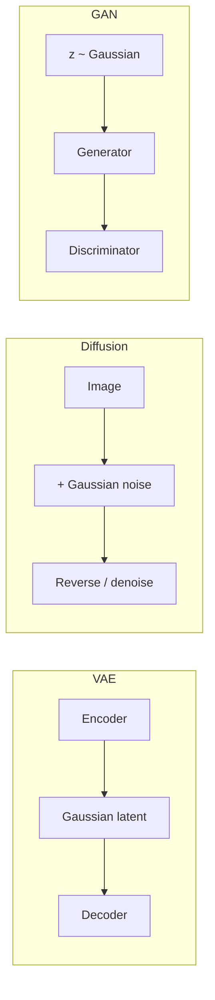

# L01: Introduction to Generative AI

**Video:** [Lec 01](https://www.youtube.com/watch?v=aOQMmjoUglM) · 42:38  
**Instructor in this lecture:** Prof. Ashwini Kodipalli

### Learning objectives

- Contrast discriminative models with generative models using the lecture’s $P(y \mid x)$ vs $P(x)$ / $P(x,y)$ language.
- Explain why **data augmentation** and **oversampling** are not generative modeling.
- Match output type → assumed distribution → activation and loss used in code.
- Locate where a **Gaussian** shows up in VAEs, diffusion, and GANs (preview only).

### Week 1 agenda (as stated in lecture)

This 12-week course covers autoencoders, VAEs, GANs, diffusion, then sequence models (RNN/LSTM) as a foundation for LLMs, then LLMs, RAG, multimodal AI, and ethics—with weekly hands-on.

**Before any of that, week 1 is only deep-learning fundamentals needed for GenAI:**

1. Shift from discriminative learning to generative learning
2. What generative modeling is, and types of generative modeling
3. Probability distributions used in generative models: **Gaussian, Bernoulli, categorical**
4. Applications of generative AI
5. Recap of **loss functions, activations, optimizers**
6. Recap of **CNNs** (later generative architectures reuse the same patterns)
7. Two labs: CNN on a real-world dataset, and an **ensemble** model

---

## Discriminative models we already know

The lecture starts from three familiar families, all treated as **discriminative**:

| Model | Data it fits | Typical tasks |
|-------|----------------|---------------|
| **MLP** | Tabular (CSV / spreadsheet features) | Classification or regression |
| **CNN** | Images | Classification, segmentation, object detection |
| **RNN / LSTM / GRU** | Sequences / time series | “What comes next” (e.g. rainfall tomorrow from 10 days of history) |

In every case the training set is **labeled**: each input $x$ has a target $y$. $x$ may be an image, text embeddings, tabular features, or a time series. $y$ is a numeric value (regression) or a class (classification).

### What “discriminative” means

Discriminative models **learn features that separate classes**. The cat-vs-dog slide is the running example: the model learns cat features vs dog features, using the known label of every training point.

Formally it estimates

$$
P(y \mid x)
$$

—the probability of the label given the input. Example from the lecture: an image scored $0.85$ cat, $0.10$ dog, $0.05$ horse. The model’s job is “which class does this $x$ belong to?”, not “how was this image produced?”.

**Stated drawback:** a discriminative model maps $x \mapsto y$. It **does not learn how the data were generated**.

---

## Why modern deep learning is not only discrimination

The lecture’s turning point: today’s systems are not limited to diagnosis (disease / no disease) or next-value prediction. They **learn the data distribution** so they can emit **new, realistic, statistically similar** samples:

- text prompt → image
- text prompt → paragraph
- damaged / incomplete face → completed image
- noisy data → cleaned reconstruction
- existing samples → newly synthesized samples

The aim is **what new data can be created**, not only which class $x$ belongs to.

---

## Why augmentation and oversampling are not enough

If the only requirement were “more data,” two old tricks come to mind. The lecture rejects both as *generative modeling*.

### Data augmentation

Flip (horizontal/vertical), rotate, zoom, crop, add noise. All of these are **different views of the same image**. They do **not** learn $p_{\text{data}}(x)$. The lecture’s visualization: a grid of images that are still one photograph at different orientations.

### Oversampling

Used when a **minority class** has too few rows. Typical tactics: **duplicate** minority examples or **interpolate** between them. That raises the count; it does **not** guarantee new variants of the data. Duplicates add no new information for the model to learn.

**Punchline from the lecture:** augmentation and oversampling increase samples **from existing data only**. Generative modeling must learn the **distribution and structure** of the data so it can emit **new, diverse, still-training-like** points—not copies and not wild deviations.

---

## Formal generative modeling

A generative model learns the **probability distribution of the data** in order to sample new points that look like training data.

| View | What is learned | When you use it |
|------|-----------------|-----------------|
| Unsupervised generation | $P(x)$ or $p_\theta(x) \approx p_{\text{data}}(x)$ | Features only (no labels) |
| Joint modeling | $P(x,y)$ | Features **and** labels |
| Conditional generation | $P(x \mid y)$ (lecture language: generate $x$ given a chosen class $y$) | “Only digit 7”, “only smiling faces”, extra **malignant** medical images |

### $P(x)$: unlabeled features

Running example: a table of **age, height, weight** with no class column. The cloud of points $x_1,\ldots,x_n$ has some mean and spread—the unknown $p_{\text{data}}(x)$. The network (weights $\theta$, or distribution parameters $\mu,\sigma$) learns $p_\theta(x)$. After training we want

$$
p_\theta(x) \approx p_{\text{data}}(x)
$$

so that **sampling** from $p_\theta$ yields new rows that could have come from the same population.

### $P(x,y)$: joint / labeled generation

Now each $x$ has a label $y$. The model learns the joint. As a side effect it can still **classify** via Bayes’ rule, recovering $P(y \mid x)$ from the joint. The lecture’s point: generative training does not forbid classification; it *can* do it, but that is not the headline goal.

### Conditional generation

Do not emit “any image”—emit **a specified class** (digit 7, smiling face, more malignant scans). Condition $y$ is the control signal.

---

## Output type → distribution → code (activation + loss)

The generator/decoder’s **output type** decides which distribution the lecture says the model “assumes.” You typically **do not type the word Gaussian in the training loop**; the pair *(activation, loss)* implies it.

| Desired output | Assumed distribution | Output activation | Loss |
|----------------|----------------------|-------------------|------|
| Continuous real values (age, height, weight) | **Gaussian** | **Linear** | **MSE** (predict the Gaussian mean) |
| Binary / 0–1 pixels (black-and-white image) | **Bernoulli** | **Sigmoid** | **Binary cross-entropy**; each pixel is $P(\text{pixel}=1)$ |
| Next word / multiclass token | **Categorical / multinomial** | **Softmax** | **Categorical cross-entropy** |

Gaussian is the bell curve with parameters $\mu$ and $\sigma$—the lecture’s default for **continuous** outputs.

---

## Where the Gaussian already appears (preview of later weeks)

The last block of the lecture is only a **pointer**, not a full derivation.

### VAE

Input → **encoder** (important features) → **latent space**. Between encoder and latent code the lecture places a **Gaussian**. The encoder maps $x$ to a Gaussian in latent space; new $x$ are made by **sampling** that Gaussian and decoding.

### Diffusion

Start from a cat image; add noise drawn from a **Gaussian**, repeatedly, until the cat is gone. Reverse: strip noise and obtain a **new** sample. (Forward / reverse are weeks 7–8.)

### GAN

A **generator** and a **discriminator** (real vs fake). The generator has to start somewhere: a **noise vector from a Gaussian**.

Bernoulli is recalled for binary outputs (sigmoid + BCE). Categorical is recalled for next-word prediction (softmax + CCE).

---

## Applications by modality (closing slide)

| You want to generate… | Models the lecture names as typical |
|-----------------------|--------------------------------------|
| **Text** | LLMs and **transformers** (taught in the LLM week) |
| **Images** (inpaint, extra samples) | **GAN, VAE, diffusion** |
| **Speech / music / sound** (time-dependent) | **Transformers**, also GAN or VAE |
| **Code** | Any of the course models, depending on setup |

### Key takeaways

- MLP / CNN / RNN-style predictors are discriminative: they learn $P(y \mid x)$ and **not** how $x$ was generated.
- Generative modeling learns $p_{\text{data}}$ so it can **sample** new realistic $x$ (and optionally $x$ given $y$).
- Augmentation and oversampling reuse existing points; they are not distribution learning.
- In code, Gaussian / Bernoulli / categorical show up as **linear+MSE**, **sigmoid+BCE**, **softmax+CCE**.
- The same Gaussian idea will reappear in VAE latents, diffusion noise, and GAN $z$.

---
