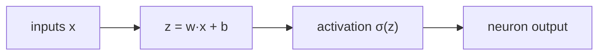
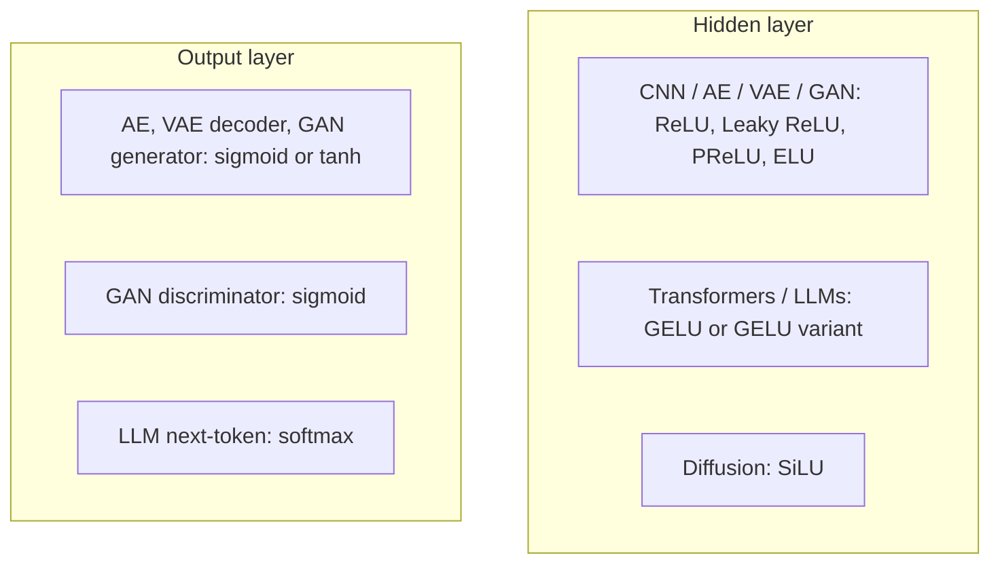
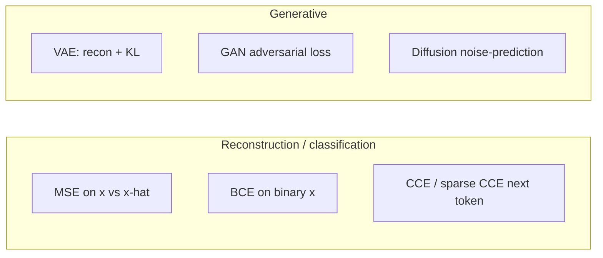

# L02: Activation Functions & Loss Functions in Deep Learning

**Video:** [Lec 02](https://www.youtube.com/watch?v=jXlaQvjQiIU) · 36:34

### Learning objectives

- State why a neuron needs a nonlinear activation, and where activations sit (hidden vs output).
- Compute ReLU / Leaky ReLU / ELU on a weighted sum, and pick sigmoid, tanh, or softmax at the output.
- Map this course’s models (CNN, autoencoder, VAE, GAN, diffusion, LLM) to typical hidden and output activations.
- Distinguish reconstruction / classification losses from generative-model losses (KL, GAN, noise-prediction).

### Week 1 placement

Previous lecture: generative-AI fundamentals. This lecture is the **activation + loss recap** needed for deep learning and for later generative models. Next lecture: optimizers.

---

## What one neuron does

Each neuron runs two steps:

1. **Weighted sum:** multiply inputs by weights, add bias.
2. **Activation:** pass that scalar through $\sigma(\cdot)$.

### Why an activation is required

| If there is no activation | What goes wrong |
|---------------------------|-----------------|
| The weighted sum is emitted unchanged | The neuron is a **linear** model |
| Stacking linear layers stays linear | The net cannot learn **complex patterns** |
| No ReLU-family gate | Negative / unused features are not suppressed |

Three roles the lecture names:

1. **Nonlinearity** — without $\sigma$, the unit is linear.
2. **Composition across layers** — each neuron’s output fans out to every neuron in the next layer, so activations let the stack combine features.
3. **Suppression (ReLU family)** — $\max(0,x)$ forwards only positive information.

In **generative** models the same nonlinear maps turn **noise** or a **latent** code into a meaningful sample.

### Where they sit

Activations are used at **hidden layers and at the output layer**. The two places do **not** share the same menu.

---

## Hidden-layer activations (ReLU family)

The $x$ below is the neuron’s weighted sum.

### ReLU — $\max(0,x)$ (default hidden activation)

| Weighted sum $x$ | $\max(0,x)$ |
|------------------|------------|
| negative (e.g. $-3$) | $0$ |
| $0$ | $0$ |
| positive (e.g. $4$) | $4$ |

**Interpretation:** a negative sum is treated as “this feature is not contributing,” so ReLU zeros it. Only positive evidence is sent on.

**Dying-neuron problem:** if a neuron’s sum is $-3$, ReLU outputs $0$ — the unit contributed nothing. That is not always correct; some negative evidence should leak through.

### Leaky ReLU — keep a trickle of the negative part

Plot vs ReLU: ReLU’s negative side is a flat line at $0$; Leaky ReLU has a shallow slope.

$$
\text{LeakyReLU}(x)=\begin{cases}
x & x \ge 0 \\
0.01\,x & x < 0
\end{cases}
$$

The slope **$0.01$ is fixed**. If you treat that slope as a learned hyperparameter, the activation is **parametric ReLU (PReLU)**, not Leaky ReLU.

Same example: $x=-3$ gave $0$ under ReLU; Leaky ReLU gives $0.01\times(-3)=-0.03$. Not the full negative value, but **some** information continues.

**What it fixes:** dying neurons.

### ELU — Exponential Linear Unit (smoother negative tail)

Leaky ReLU’s negative side is a **sharp** line. ELU uses an **exponential** for $x\le 0$, with hyperparameter $\alpha$ (lecture example $\alpha=1$):

$$
\text{ELU}(x)=\begin{cases}
x & x > 0 \\
\alpha(e^{x}-1) & x \le 0
\end{cases}
$$

Worked sketch from the lecture: $x=-1$, $\alpha=1$ → substitute into the exponential formula. Repeat with $x=-3$ and compare to Leaky ReLU’s $-0.03$ to see the smoother curve.

### GELU — Gaussian Error Linear Unit

A further ReLU-family variant used in **modern** nets, especially **transformers**. Substitute the weighted sum into the GELU formula (the slide’s closed form). Example given: $x=-1$ maps to the corresponding GELU output.

### SiLU (Sigmoid Linear Unit)

Another modern hidden activation, **inspired by sigmoid**. Substitute the neuron sum into the SiLU formula (typically $x\cdot\sigma(x)$).

---

## Output-layer activations (task-dependent)

You **do** have a choice, but it is determined by the problem — not by taste.

### Sigmoid — binary, labels in $\{0,1\}$

Disease / no disease, yes / no. Formula:

$$
\sigma(x)=\frac{1}{1+e^{-x}}
$$

| $x$ (weighted sum) | $\sigma(x)$ | Class (threshold $0.5$) |
|--------------------|-------------|-------------------------|
| $-2$ | $0.119$ | class $0$ ($<0.5$) |
| $0$ | $0.5$ | boundary (either class, by how you implement the cut) |
| $2$ | $0.881$ | class $1$ ($>0.5$) |

The sigmoid curve cuts at $0.5$.

### Tanh — binary, labels in $\{-1,+1\}$

If labels are already $-1$ and $+1$, two options: recode $-1\to 0$ and keep sigmoid, **or** use tanh and leave the labels.

$$
\tanh(x)=\frac{e^{x}-e^{-x}}{e^{x}+e^{-x}}
$$

| $x$ | $\tanh(x)$ | Class (cut at $0$) |
|-----|------------|---------------------|
| $-2$ | $-0.964$ | $-1$ |
| $0$ | $0$ | boundary |
| $2$ | $+0.964$ | $+1$ |

Any value $<0$ → minus class; $>0$ → plus class. (Contrast with sigmoid’s $0.5$ cut and rounding to $0/1$.)

### Softmax — multiclass

Medical: **normal / benign / malignant**. Or **male / female / transgender**. Sigmoid and tanh cannot handle more than two classes.

**Number of output neurons = number of classes.** Five classes → five output neurons, each with a weighted sum. Softmax turns that vector into probabilities that **sum to 1**.

Lecture vector of sums: $[1.3,\ 5.1,\ 2.2,\ 0.7,\ 1.1]$. For class $i$,

$$
p_i=\frac{e^{z_i}}{\sum_j e^{z_j}}
$$

Worked values from the lecture:

| $z_i$ | Numerator | $p_i$ (approx.) |
|------:|-----------|-----------------|
| $1.3$ | $e^{1.3}$ | $0.02$ |
| $5.1$ | $e^{5.1}$ | $0.90$ |
| $2.2$ | $e^{2.2}$ | $0.05$ |
| $0.7$ | $e^{0.7}$ | (compute similarly) |
| $1.1$ | $e^{1.1}$ | (compute similarly) |

Animal example: $C_1$ cat, $C_2$ dog, $C_3$ horse, … The **argmax** of the softmax vector is the predicted class (here $C_2$ / dog at $0.90$).

### Output-activation summary

| Problem | Output range | Activation |
|---------|--------------|------------|
| Binary, $\{0,1\}$ | $(0,1)$ | **sigmoid** |
| Binary, $\{-1,+1\}$ | $(-1,1)$ | **tanh** |
| Multiclass | probabilities summing to $1$ | **softmax** |

---

## Which activations this course actually uses

The syllabus order recalled here: **CNN → autoencoders → VAEs → GANs → diffusion → sequence models / LLMs**. You cannot reuse one hidden activation for all of them.

| Model | Hidden | Output |
|-------|--------|--------|
| CNN, autoencoder, VAE, GAN | ReLU, Leaky ReLU, PReLU, or ELU | — |
| Transformers / LLMs | **GELU** (Gaussian Error Linear Unit) or a GELU variant | **softmax** (next word / token) |
| Diffusion | **SiLU** | — |
| Autoencoder / VAE **decoder**, GAN **generator** | — | **sigmoid** or **tanh** |
| GAN **discriminator** | — | **sigmoid** |

---

## Loss functions

**Loss** measures how far the **prediction** is from the **ground truth** (or, in reconstruction, from the **original input**). Input → network → prediction; compare to the label (or to $x$ itself).

Same loss is **not** used for every application.

### Conventional DL vs generative DL

| Setting | What the loss compares |
|---------|------------------------|
| Classical deep learning | predicted label vs ground-truth label |
| Generative / “modern” DL | **reconstruct** $x$, **generate** realistic new samples, or **predict the next word** |

The lecture splits losses into (1) **reconstruction and classification** and (2) **generative-model** losses.

---

## Reconstruction and classification losses

### MSE as reconstruction loss (continuous $x$)

In an ML/DL course, MSE is usually $\frac{1}{n}\sum(y_i-\hat{y}_i)^2$ on **labels**. Here the aim is to **reconstruct the input**. Example features $2,4,6$ should come back as something like $2,4,6$. The “ground truth” is the **original sample**.

$$
\mathcal{L}_{\text{MSE}}=\frac{1}{n}\sum_i\bigl(x_i-\hat{x}_i\bigr)^2
$$

$x_i$ = original input, $\hat{x}_i$ = reconstructed input. If $x=25$ and $\hat{x}=20$, the gap is $5$. Use MSE when reconstructing **continuous** values.

### Binary cross-entropy (binary / $0$–$1$ reconstruction)

If you need reconstructed values in $\{0,1\}$ (not $25$, $28$), do **not** use MSE. Use **binary cross-entropy**, again with the **original input** in the $x$ slot (not a class label). Same functional form as supervised BCE; different target.

### Cross-entropy for next-word / LLM prediction

Predicting the next token is classification over the vocabulary.

| Label encoding | Loss |
|----------------|------|
| **One-hot** | **categorical cross-entropy** |
| **Integer class ids** (word $1$, word $2$, …) | **sparse categorical cross-entropy** |

Both appear in the week-1 hands-on. Categorical CE is the one the lecture flags for LLMs / next-token prediction.

---

## Generative-model losses (preview; math later)

### VAE: reconstruction + KL divergence

Total VAE loss = **reconstruction loss + KL divergence**.

Reconstruction is still “how far is $\hat{x}$ from $x$.” **KL divergence** measures how far **one probability distribution** is from another (e.g. a Gaussian vs a Bernoulli).

Analogy: distance between two **points** $P,Q$ in 2-D → Euclidean distance (each has $(x,y)$). Distance between two **distributions** → **not** Euclidean (there are no point coordinates). That job is KL. Full treatment is **week 3**.

### GAN

A **generator** emits samples; a **discriminator** says real vs fake. The generator’s job is to make images realistic enough that the discriminator is **confused**. The associated GAN loss is named here; the mathematics is **week 4**.

### Diffusion

**Noise-prediction loss** (later diffusion weeks).

### Key takeaways

- No activation ⇒ linear neuron; ReLU-family activations also **gate** negative features.
- Hidden menu: ReLU (dying neurons) → Leaky ReLU ($0.01$) / PReLU (learned slope) → ELU (smooth exponential) → GELU (transformers) / SiLU (diffusion).
- Output menu: sigmoid $\{0,1\}$, tanh $\{-1,+1\}$, softmax (multiclass / next token).
- Generative reconstruction uses MSE or BCE on **$x$ vs $\hat{x}$**, not on class labels; LLMs use (sparse) categorical CE; VAEs add KL; GANs and diffusion have their own losses.

---
