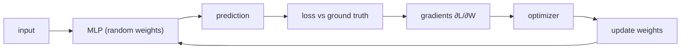
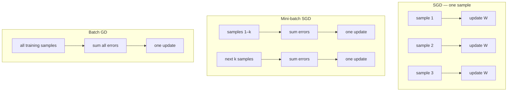

# L03: Optimizers — Part A

**Video:** [Lec 03](https://www.youtube.com/watch?v=VevYEYDAm_8) · 31:03

### Learning objectives

- Place the optimizer in the train loop: forward pass → loss → gradients → weight update.
- Apply $W_{\text{new}}=W_{\text{old}}-\eta\,\partial L/\partial W$ and explain the minus sign.
- Contrast **SGD**, **mini-batch SGD**, and **batch gradient descent** by *when* weights are updated.
- Write SGD **with momentum** as an exponentially weighted moving average of gradients.

### What this lecture is *not*

AdaGrad, RMSProp, and Adam are **Part B** (next video). This video stops after SGD with momentum.

---

## Why we need an optimizer

Setup: a simple **MLP**. Every neuron is connected to every neuron in the next layer; each connection has a weight. **Weights (and biases) start random.**

Because initialization is random, the first prediction is wrong. Compare it to the **ground truth** / label:

- True label $1$, prediction $0.2$ → **high** loss.
- True label $1$, prediction $0.95$ → **low** loss.

**Loss** answers: *how wrong is the model?* Goal: drive loss down so prediction and ground truth get close.

### Gradients

$$
g = \frac{\partial L}{\partial W}
$$

This derivative says **how each weight contributed to the loss**, and it gives both:

- the **direction** of the weight update,
- the **amount of influence** that weight has on the loss.

Increase $W$ → loss moves one way; decrease $W$ → the other way.

### Role of the optimizer

Use those gradients to **update weights in the right direction** so predictions gradually improve.

**Primary objective of optimization: minimize the loss.**

---

## The weight-update rule

$$
W_{\text{new}} = W_{\text{old}} - \eta \frac{\partial L}{\partial W}
$$

$\eta$ is the **learning rate**. The gradient may be $>0$ or $<0$.

**Why the minus sign?** We want to move **where loss decreases** (gradient descent).

### Worked sign examples

$W_{\text{old}}=5$, $\eta=0.1$.

| Gradient $\partial L/\partial W$ | Arithmetic | $W_{\text{new}}$ | Effect |
|----------------------------------|------------|------------------|--------|
| $-2$ (negative) | $5 - 0.1(-2)=5.2$ | $5.2$ | **weight increases** |
| positive | $5$ minus a positive quantity | $<5$ | **weight decreases** |

Punchlines:

- Gradient **negative** → subtracting a negative **increases** $W$.
- Gradient **positive** → optimizer **reduces** $W$.

The optimizer does **not** change weights at random. It reads the loss gradient and decides up vs down. “Optimizing weights” here just means increasing or decreasing them so that **loss is minimized**.

---

## Three classical update schedules

Training samples can be fed in three ways. All compute prediction → error vs ground truth → gradient → update; they differ in **how many samples** sit behind one update.

### Stochastic gradient descent (SGD)

Pass **one sample**, predict, compare to that sample’s $y$, compute loss, **backprop, update all weights**, then the next sample.

- Sample 1 → $P_1$ vs $Y_1$ → update.
- Sample 2 → $P_2$ vs $Y_2$ → update.
- Sample 3 → $P_3$ vs $Y_3$ → update.

**Picture toward the global minimum (loss near $0$):** first sample might **increase** $W$; second **decrease**; third **increase** again. Result: **heavy oscillation** / zigzag. The lecture does not call this a fatal flaw — it is simply what “update after every sample” looks like.

In the update formula, $\partial L/\partial W$ is computed from **that one sample’s error**.

### Mini-batch SGD

“Mini batch” = a **small subset** of samples. Batch size is a **hyperparameter** (diagram used $2$ only as a cartoon).

1. Forward sample 1 → error $E_1$. **Do not backprop yet.**
2. Forward sample 2 → error $E_2$.
3. **Add** $E_1+E_2$ (all errors in the batch), then one weight update.
4. Repeat on the next batch.

If the last leftover group is smaller than the batch size (one leftover sample in the lecture’s cartoon), you still forward it, compute its error, and update.

**Compared with SGD:** fewer updates per epoch → **less zigzag**. Mini-batch is often smoother, but there is **no thumb rule** — try both and keep the hyperparameter that performs on *your* data.

Here $\partial L/\partial W$ uses the **$k$ samples** in the batch.

### Batch gradient descent

Take **every** training sample: $E_1+\cdots+E_n$, then **one** update. No per-sample or per-mini-batch backprop.

Here the gradient uses **all** samples.

| Optimizer | Samples per update | Typical path to the minimum |
|-----------|--------------------|-----------------------------|
| SGD | $1$ | noisy, much zigzag |
| Mini-batch SGD | $k$ (hyperparameter) | smoother than SGD |
| Batch GD | all $n$ | one step per full pass |

These three are the **initial** set. The rest of the video is the first “modern” variant: **SGD with momentum**.

---

## SGD with momentum

### The zigzag problem, restated

SGD updates from the **current** gradient only. Sequence of signs $(-,+, -, +, \ldots)$ ⇒ weight up, down, up, down. That **slows convergence** to the global minimum.

In the formula, SGD’s gradient term is “$1$” in the sense that it is **only the current sample’s** $g_t$. Mini-batch uses $k$ errors; batch GD uses all of them.

### Momentum as velocity

Analogies from the lecture:

- Walking on a **flat** surface → you can go **fast**; on a **steep** slope → slower.
- If gradients have been **positive for many steps** (current, previous, the one before), you can **walk faster** toward the minimum — less zigzag, smoother path.

### Update with a velocity term

$$
v_t = \beta\, v_{t-1} + (1-\beta)\, g_t, \qquad
W_{\text{new}} = W_{\text{old}} - \eta\, v_t
$$

$g_t=\partial L/\partial W$ at the current step. $\beta$ is the momentum coefficient; **standard default $\beta=0.9$**. $v_0=0$ on the first step.

$v_t$ is an **exponentially weighted moving average (EWMA)** of gradients:

- **recent** gradients get **more** weight,
- **older** gradients are still remembered, with **decreasing** importance.

### Numerical walk-through ($\beta=0.9$)

Lecture’s consistent-positive run (reconstructed from the stated $v$ values: $v_1=0.5$ implies $g_1=5$):

| Step | $g_t$ | Recurrence | $v_t$ |
|-----:|------:|------------|------:|
| $1$ | $5$ | $0.9\cdot 0 + 0.1\cdot 5$ | $0.5$ |
| $2$ | $6$ | $0.9\cdot 0.5 + 0.1\cdot 6$ | $1.05$ |
| $3$ | $7$ | $0.9\cdot 1.05 + 0.1\cdot 7$ | $1.645$ |

If gradients **point the same way**, velocity **rises** ($0.5\to 1.05\to 1.645$). On a “flat” consistent slope you take **larger steps** — you already have evidence from the past.

### What if the next gradient goes negative?

$g_4=-4$, $v_3=1.645$:

$$
v_4 = 0.9\cdot 1.645 + 0.1\cdot(-4) \approx 1.08
$$

Speed **drops a little**; it does **not** reverse violently. **Smooth** transition instead of SGD’s abrupt zigzag. Negative-gradient stretches still look like a smooth curve on the board.

### Key takeaways

- Optimizer = use $\partial L/\partial W$ to raise or lower $W$ so loss falls; the minus sign is “move downhill.”
- SGD / mini-batch / batch GD differ only in **how many samples** feed one update.
- SGD zigzags because each update sees only the current $g_t$.
- Momentum replaces $g_t$ by an EWMA $v_t$ ($\beta\approx 0.9$): same-direction gradients **speed up**; a sudden sign flip **damps** rather than snaps.

---
