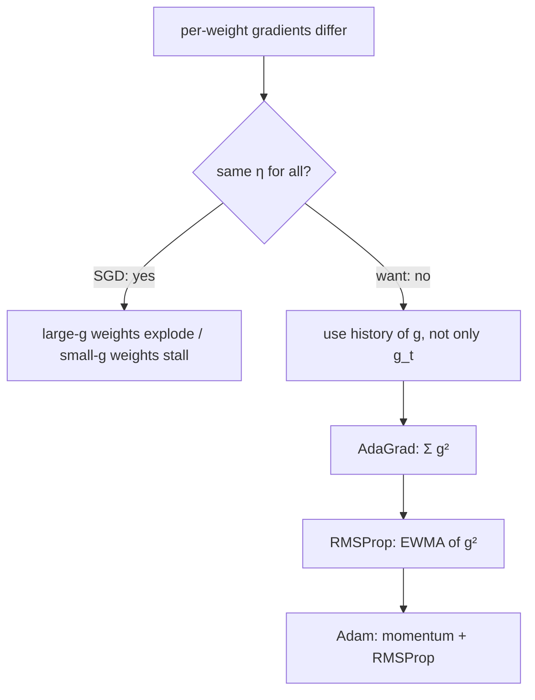
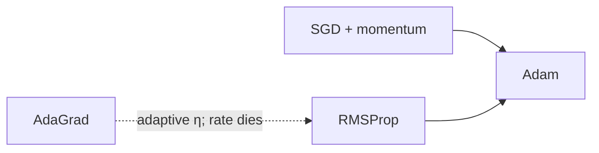

# L04: Optimizers — Part B

**Video:** [Lec 04](https://www.youtube.com/watch?v=7vmbACnFrb4) · 34:13

### Learning objectives

- Separate **gradient sign** (direction) from **gradient magnitude** and **learning rate** (step size).
- Explain why a **single** $\eta$ for millions of weights is a bad idea.
- Write **AdaGrad**’s per-parameter rate from the sum of **squared** past gradients, and state why the rate can die.
- Show how **RMSProp** replaces that sum by an EWMA of $g_t^2$, and how **Adam** = momentum + RMSProp.

### Recap from Part A (first minutes)

SGD update:

$$
W_{\text{new}} = W_{\text{old}} - \eta\, g, \qquad g=\frac{\partial L}{\partial W}
$$

Already known:

- $g>0$ → weight **decreases**; $g<0$ → weight **increases**.

New emphasis: **how large** $|g|$ is, and how $\eta$ interacts with it.

---

## Sign vs magnitude vs learning rate

Keep $\eta$ fixed. $W_{\text{old}}=5$.

| Situation | What happens to $W$ |
|-----------|---------------------|
| **Large** $\|g\|$ | **Large** change (lecture: $5\to 4$) |
| **Small** $\|g\|$ | **Tiny** change (lecture: $5\to 4.95$) |

So:

- **sign** of $g$ → **direction**,
- **magnitude** of $g$ → **how much** $W$ moves.

### Same gradient, different $\eta$

Now **vary the learning rate**. Large $g$ (lecture used $g=10$), $W_{\text{old}}=5$:

| $\eta$ | Qualitative result |
|--------|--------------------|
| small | small change in $W$ |
| moderate | e.g. $5\to 4$ |
| **high** | **abrupt** jump — lecture’s scare case: $5\to 0$ |

Repeat with a **small** gradient and several $\eta$: again, $\eta$ controls how far $W$ moves. Statement to keep:

> **Learning rate controls how the weight actually changes.**

---

## Why one global $\eta$ is not enough

A net has **millions** of weights. They do **not** all see the same $|g|$:

- some parameters get **large** gradients,
- some get **small / rare** gradients.

SGD still uses **one** $\eta$ for everyone.

| Parameter’s gradient | If $\eta$ is also large | If $\eta$ is also small | What you actually want |
|----------------------|-------------------------|-------------------------|------------------------|
| already **large** | adverse: $5\to 0$ | stable small step | **small** $\eta$ |
| already **small** | reasonable movement | almost stuck ($5\to 4.99$); slow convergence | **large** $\eta$ |

Ideal: **large $g$ ⇒ shrink $\eta$; small $g$ ⇒ grow $\eta$.** SGD cannot do that with a shared rate.

### Don’t decide from the current $g$ alone

A single mini-batch might be an outlier. Better: look at the **history**.

- If **past** gradients were all large, the **cumulative sum** is large → confidently **decrease** $\eta$.
- If past gradients were all small, the cumulative sum is small → confidently **increase** $\eta$.

That idea is **AdaGrad** (adaptive gradient).

---

## AdaGrad

SGD:

$$
W_{\text{new}} = W_{\text{old}} - \eta\, g_t
$$

$\eta$ is the **same** for every weight. AdaGrad keeps a **running sum of squared gradients** and builds a **per-parameter** rate.

### Accumulator

At every step: square the current gradient, **add** it to the previous total.

$$
\alpha_t = \alpha_{t-1} + g_t^2
$$

$\alpha_{t-1}$ = accumulated squared gradients **up to the previous step**. Decision uses **all previous** $i=1,\ldots,t-1$, not only $g_t$.

### Per-parameter learning rate

$$
\eta_t = \frac{\eta}{\sqrt{\alpha_{t-1}+\varepsilon}}, \qquad
W_{\text{new}} = W_{\text{old}} - \eta_t\, g_t
$$

$\varepsilon$ is a small constant so the **denominator is never zero**.

### Why this grows / shrinks $\eta$ correctly

Denominator $= \sqrt{\alpha_{t-1}+\varepsilon}$.

**Small past gradients** (lecture sketch $0.1,\ 0.2,\ 0.3,\ -0.4$): squares are tiny, $\alpha$ is small, denominator is small ⇒ $\eta/\sqrt{\alpha}$ is **large** ⇒ **larger** effective learning rate for those weights.

**Large past gradients** (e.g. $5,\ 5.95,\ -4,\ 3,\ 0.79$): $\alpha$ is huge, denominator is huge ⇒ effective $\eta$ is **small**.

AdaGrad therefore:

- **allows larger rates** for parameters that have been seeing **small** gradients,
- **shrinks rates** for parameters that have been seeing **large** gradients.

None of the Part A optimizers could do this.

### AdaGrad’s failure mode

$\alpha$ is a **cumulative sum**. In a **deep** net, large $g$ keep adding forever. Then:

- denominator → large ⇒ effective $\eta$ → **tiny**,
- $\eta_t g_t$ ≈ $0$ ⇒ $W_{\text{new}}\approx W_{\text{old}}$,
- **no further progress**; reaching the minimum becomes extremely slow.

The lecture’s cartoon: if the subtracted term is tiny (e.g. you multiply a small rate by $25$ and still get almost nothing), the old weight is the new weight — **loss does not move**.

The whole problem sits in that **unbounded sum of squares**. Fix: stop accumulating everything equally. That is **RMSProp**.

---

## RMSProp (root mean square propagation)

Keep AdaGrad’s good idea (different $\eta$ per weight). Replace $\alpha_t=\sum g_i^2$ by an **exponentially weighted moving average of squared gradients** — the same EWMA idea as **SGD with momentum**, but on $g_t^2$.

$$
s_t = \beta\, s_{t-1} + (1-\beta)\, g_t^2
$$

$s_t$ = EWMA of **squared** gradients at time $t$. Put $s_t$ where AdaGrad put $\alpha$:

$$
W_{\text{new}} = W_{\text{old}} - \frac{\eta}{\sqrt{s_t+\varepsilon}}\, g_t
$$

### EWMA meaning, with $\beta=0.9$

$s_0=0$. Expand a few steps (lecture’s algebra):

| $t$ | Recurrence | Who is emphasized |
|----:|------------|-------------------|
| $1$ | $s_1=0.1\,g_1^2$ | only the current gradient |
| $2$ | $s_2=0.9\,s_1+0.1\,g_2^2=0.09\,g_1^2+0.1\,g_2^2$ | $g_2$ more than $g_1$ |
| $3$ | $s_3=0.9\,s_2+0.1\,g_3^2$ | $g_3$ highest; $g_1$ already small |
| $4$ | continue | $g_1$ tiny; $g_2$ small; $g_3$ less; **$g_4$ largest** |

**Current $g_t^2$ gets the most weight; older squares remain but with decreasing importance.** That is exactly the definition of exponentially weighted moving average.

Same “small $s$ ⇒ large $\eta$; large $s$ ⇒ small $\eta$” logic as AdaGrad, **without** the accumulator that drives $\eta\to 0$ forever.

---

## Adam

**Adam = momentum + RMSProp** (the two ideas that survived).

There are newer optimizers; Adam is the last **fundamental** one in this pair of lectures.

Use **two** $\beta$s because both pieces have a $\beta$:

| Piece | What is averaged | Coefficient |
|-------|------------------|-------------|
| **Momentum** (Part A) | gradients $g_t$ | $\beta_1$ |
| **RMSProp** | squared gradients $g_t^2$ | $\beta_2$ |

The Adam step combines:

- a **momentum** term in the numerator (smooth direction, velocity),
- an **RMSProp** term in the denominator (adaptive per-weight scale).

---

## Week 1 theory map (closing)

Week 1 so far: generative-modeling language → **activations** → **losses** → **optimizers** (this video and the previous). Next two sessions: **CNN recap** (how each layer works).

### Key takeaways

- Sign of $g$ = direction; $|g|$ and $\eta$ = step size. A huge $\eta$ with a huge $g$ can slam $W$ (e.g. $5\to 0$).
- Weights see different $|g|$; one global $\eta$ is the SGD assumption we drop.
- AdaGrad: $\eta_t=\eta/\sqrt{\sum g^2+\varepsilon}$ — good adaptivity, **vanishing rate** as the sum grows.
- RMSProp: same denominator idea with **EWMA of $g^2$** so old squares fade.
- Adam: **momentum ($\beta_1$) + RMSProp ($\beta_2$)**.

---
