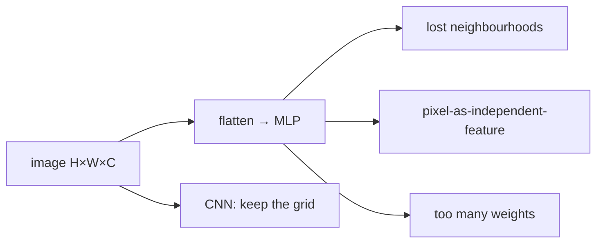
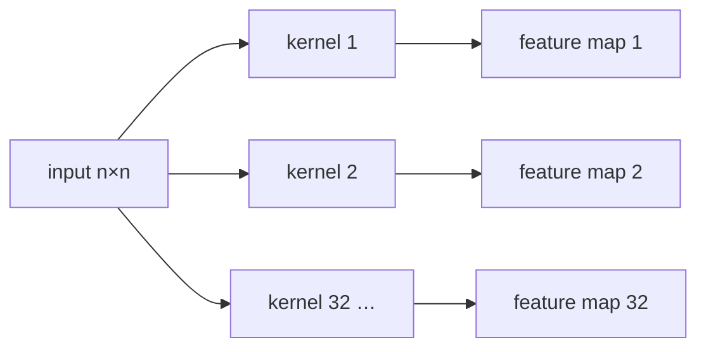
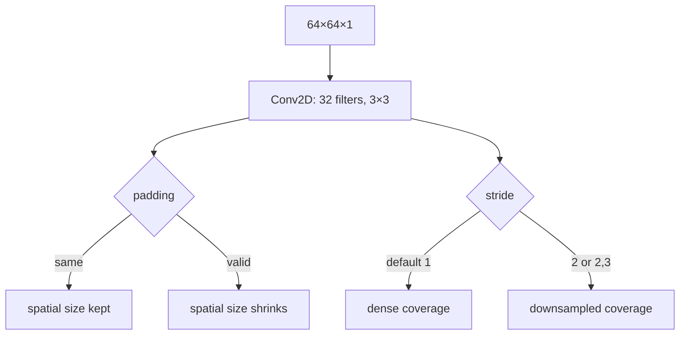

# L05: Convolutional Neural Network — Part A

**Video:** [Lec 05](https://www.youtube.com/watch?v=SoKjqOB0YPw) · 47:25

### Learning objectives

- Describe how a machine stores an image (pixels, height × width, channels).
- List why a fully connected MLP is the wrong first model for images.
- Name CNN applications (classification, detection, segmentation variants).
- Run one **convolution**: kernel, element-wise multiply-and-sum, stride, padding, output size, Keras `Conv2D` arguments.

### What this lecture is *not*

**ReLU, pooling, flatten, and the fully connected head** are Part B. This video stops after the convolutional layer (plus a Keras preview of `Conv2D`).

---

## How a computer reads an image

To a human, a photograph is a scene. To a machine it is a **matrix of pixel values**.

- One **pixel** = one numerical intensity (brightness), or a colour intensity in **RGB**.
- **One pixel is not an object.** Nearby pixels together are the sun, an edge, a digit.
- **Height** = number of rows; **width** = number of columns. That pair is the **spatial size** of the image.

---

## Why not a fully connected MLP?

An MLP wants **independent features in a single vector**.

### Parameter blow-up

| Image | Channels | Flattened length |
|-------|----------|------------------|
| $28\times 28$ colour | $3$ (RGB) | $28\times 28\times 3=2352$ |
| $200\times 200$ colour | $3$ | $120{,}000$ |

$28\times 28\times 3$ is already a **low-resolution** image; you barely see content. Realistic sizes explode the input width. Every hidden neuron connects to every input, so **weights explode**, training **slows**, and **overfitting** gets worse.

### Spatial structure is destroyed

Flattening a 2-D grid into a 1-D vector:

1. **Destroys spatial relationships** — how pixels are *positioned* and *related*.
2. Treats every pixel as an **independent** feature. A single pixel is almost never a useful image feature; **neighbourhoods** are.
3. **Local dependencies** (an edge, a curve, a stroke of an “8”) vanish.

Lecture’s $3\times 3$ walk-through: horizontal neighbours of $1$ are $2$; of $2$ are $1$ and $3$; rows $1\,2\,3$, $4\,5\,6$, $7\,8\,9$. Vertical: $1,4,7$. After flattening, $2$ and $5$ are no longer adjacent; $3$ and $4$ look adjacent even though they were not. Scale that to $28\times 28=784$ and many fully connected hidden layers: **parameter explosion**.

That is why images use a **convolutional neural network (CNN)** — a specialized deep net for image (grid) data.

---

## What CNNs are used for

| Task | Lecture example |
|------|-----------------|
| **Image classification** | sheep or not; **benign vs malignant** / cancerous vs not |
| **Object detection** | several objects; **where** each one is |
| **Image segmentation** | keep only the **region of interest** |
| Classification + **localization** | same class (sheep) **and** a box |
| **Semantic segmentation** | road / grass / sheep — one colour per **class** |
| **Instance segmentation** | sheep 1, sheep 2, sheep 3 — same class, **different instances** |

Medical segmentation example: CT of the **ovarian** region. The tumour occupies a small patch. Sending the whole scan forces the model to learn irrelevant background. Segment the tumour, treat the rest as background, and the net focuses on what matters.

CNNs are **not only classifiers**.

---

## Inspiration: human visual system

MLP/perceptrons mimic biological neurons. CNNs mimic **how a human eye parses a scene**:

1. first **outlines** — lines, **edges**, **corners**;
2. then connect those into **shapes**;
3. then identify the object (lecture: **elephant** — outlines, then texture and colour).

CNN **early layers** look at **local** regions (lines, edges, corners). **Deeper** layers see the image as a whole.

---

## Four core components (map for Parts A–B)

| # | Component | Job in this course’s story |
|---|-----------|----------------------------|
| 1 | **Convolutional layer** | **extract features** (this lecture) |
| 2 | **Activation** (typically **ReLU**, not always — see the lab) | kill unhelpful (negative) features |
| 3 | **Pooling** | **downsample** — shrink feature-map **height and width** |
| 4 | **Fully connected layer** | classification (needs a vector) |

**Optional** regularizers: **normalization** and **dropout**.

Why pool at all? The eventual classifier is still a fully connected net, but you **must not** dump the raw image into it (too many features). Conv extracts; activation gates; pooling **still has to shrink size**. Terminology is unpacked as we go.

Feature hierarchy inside stacked conv layers:

- early conv → **low-level** features,
- middle conv → **mid-level**,
- late conv → **high-level**.

---

## Convolutional layer

**Fundamental building block.** Extracts features from the input image.

The “eye” that scans the image is the **kernel** (also called **filter** — the lecture uses the words interchangeably). The kernel walks the image and extracts features.

Kernel entries are **not fixed**. They are **learnable**; backpropagation updates them.

Image = matrix of pixels ⇒ kernel = a **smaller** matrix, almost always **odd-sized**: $1\times 1$ or $3\times 3$. The lecture starts with $3\times 3$ and later warns that $1\times 1$ is usually a poor first choice.

### Convolution operation

Place the $3\times 3$ kernel on a $3\times 3$ patch of the image:

1. **element-wise multiply**,
2. **sum** the nine products,
3. write that scalar into the **feature map**.

Definition given: *element-wise multiplication and sum the result.*

### Worked $6\times 6$ image, $3\times 3$ kernel

First patch → sum $=-5$ (products include $3\cdot 1$, $1\cdot 1$, $2\cdot 1$, then a row of zeros, then a row of $-1$s). That is one feature-map entry.

Then **stride**: slide the kernel to the next patch, multiply-and-sum again. Repeat until the kernel has covered the image. Resulting feature map in the slide: **$4\times 4$**.

### The border is under-visited

The lecture asks you to watch the pixel valued **$3$**. Interior pixels are seen in **several** windows; **border** pixels ($3$, $4$, $9$, $2$, …) are seen **once**. That is the information-loss problem padding will fix.

### Several kernels ⇒ several feature maps

Running the **same** kernel again extracts the **same** features (same weights). To get **different** features, use a **different** kernel → another feature map. **More kernels, more kinds of features.** Count of kernels is a hyperparameter.

---

## Output size (no padding)

$$
\left\lfloor\frac{n-f}{s}\right\rfloor+1
\quad\text{(height and width)}
$$

$n$ = input size, $f$ = kernel size, $s$ = **stride**. If $s=1$ this is just $n-f+1$.

Lecture numbers: $n=6$, $f=3$, $s=1$ → $6-3+1=4$ → feature map **$4\times 4$**.

**Problem:** $6\times 6$ became $4\times 4$ — **size dropped, information lost**, especially at borders. In **medical** images every region (including the border) can matter.

---

## Padding

Add a frame of **zeros** around the image so border pixels are visited as often as interior ones.

After **one** layer of zero-padding on a $6\times 6$ image, the working grid is $8\times 8$, but we want the **feature map** back at **$6\times 6$** (same as the original image) so we can say nothing was lost.

Formula **with padding** $p$ (and $s=1$ as in the board derivation):

$$
n+2p-f+1
$$

Substitute $n=6$, $p=1$, $f=3$: $6+2-3+1=6$. Matches the original size.

(The lecture said “one layer of pooling” once when it meant **padding** — ASR/slip; the algebra is padding.)

With padding, the pixel $3$ is seen on the first window, after a horizontal stride, after a vertical stride, and again — **multiple looks** at the border.

---

## Stride

**Hyperparameter.** In Keras it controls **how the filter moves**. After one multiply-and-sum, jump $s$ pixels.

General size formula (include $2p$ only if you padded):

$$
\left\lfloor\frac{n+2p-f}{s}\right\rfloor+1
$$

If the division is not integer, take the **floor** (e.g. $3.1$, $3.5$, $3.9$ all become $3$ — greatest integer $\le$ that number).

### $s=1$ example (no pad)

$n=7$, $f=3$, $s=1$, $p=0$ → $(7-3)/1+1=5$ → **$5\times 5$**.

### $s=2$

Skip a position; the kernel lands on every other patch. Same $n=7$, $f=3$, $p=0$: $(7-3)/2+1=3$ → **$3\times 3$**. Larger stride ⇒ **smaller** feature map.

Stride is **not** always $1$, and **not** always square.

---

## Keras / `Conv2D` preview (hands-on syntax)

Minimum ingredients: **input image** + **kernels**.

Lecture defaults:

- input **$64\times 64\times 1$** — the $1$ is the channel count (**grayscale / binary**).
- **$32$ kernels**, each **$3\times 3$**. (Both $32$ and $3\times 3$ are hyperparameters.)
- Each kernel produces one feature map → $32$ maps.

| Argument | Meaning |
|----------|---------|
| `padding="same"` | apply padding (keep size) |
| `padding="valid"` | **no** padding |
| `strides=(2,2)` | jump two pixels |
| `activation="relu"` | ReLU after the conv (detail in Part B) |
| omitted stride | **default stride $=1$** |

Function name: **`Conv2D`**.

### Rectangular images

The $64\times 64$ demo is square. Real photos can be **rectangular** (different aspect ratio). Then stride need not be square: `strides=(2,3)` means **$3$ pixels right and $2$ pixels down** (lecture’s wording). Square input ↔ square stride is a convenience, not a law.

### Why CNN now

Later generative architectures **reuse CNN patterns**. Knowing conv/kernel/stride/padding is the prerequisite.

Next session: **ReLU, pooling, flatten**.

### Key takeaways

- Images are $H\times W\times C$ pixel grids; flattening them for an MLP drops neighbourhoods and explodes parameters.
- CNN applications: classify, detect, semantically / instance-segment (sheep, CT tumour, …).
- A kernel slides, multiply-and-sums, writes a feature map; **many kernels ⇒ many maps**; kernel weights are learned.
- Size: $\lfloor(n+2p-f)/s\rfloor+1$, floor if needed; **padding** protects borders; **stride** is how far the kernel jumps.
- Keras: `Conv2D`, `padding="same"|"valid"`, default stride $1$.

---
