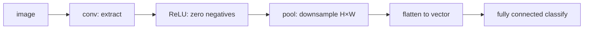
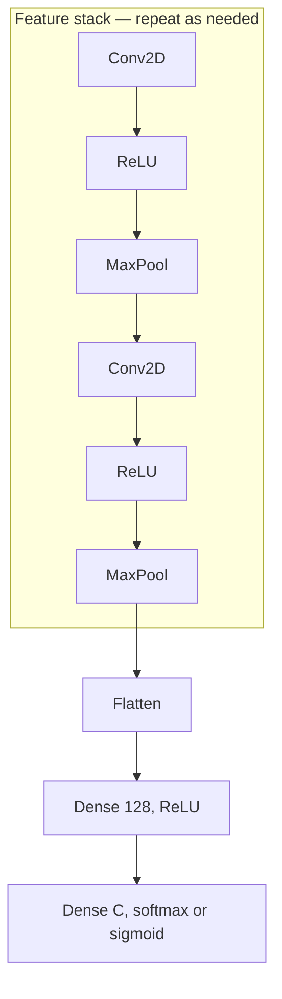

# L06: Convolutional Neural Network — Part B

**Video:** [Lec 06](https://www.youtube.com/watch?v=wyvLZfmhqP0) · 51:50

### Learning objectives

- Apply **ReLU** to a feature map and explain why it does **not** downsample.
- Count **learnable conv parameters** and the **output tensor size** after conv.
- Run **max / average / min / max-average-min** pooling, including Keras `MaxPooling2D`.
- Stack conv–ReLU–pool, **flatten**, and a **fully connected** classifier (sigmoid vs softmax).

### Placement

Part A: why MLP fails on images, and the **convolutional** layer. This video is the rest of the CNN, then the end of **week-1 theory**. Next: hands-on CNN.

---

## Recap: we still have not shrunk the map

Conv **extracts** features. With **padding**, the feature map stays the **same spatial size** as the input. You still cannot dump that tensor into a fully connected classifier (parameter explosion from Part A). Remaining layers: **activation (ReLU)**, **pooling**, **flatten**, **fully connected**.



---

## ReLU after convolution

**Rectified linear unit:** $\max(0,x)$ on **every** feature-map entry.

Lecture walk-through: conv output contains $1$, $14$, $-9$, $4$, … After ReLU: $1$, $14$, **$0$**, $4$, … All **negatives become $0$**; positives stay.

**Intuition:** the feature map *is* the extracted features. A **negative** response is “this feature is not contributing” → drop it. ReLU does **not** change height or width.

### Diagonal-feature example

Input image $X$, one kernel. The feature map’s **diagonal** is large compared with other entries — that kernel found a **diagonal** structure (the lecture’s “X” / stroke). After ReLU the diagonal **stays**; unhelpful locations become $0$. The extracted pattern is not compromised.

Same kernel again ⇒ **same** map. A **different** kernel ⇒ a **different** map, then its own ReLU. Stack those maps: one kernel on a handwritten **4** keeps **vertical** strokes; another keeps another vertical band; combining them reconstructs the digit.

### Keras line (ties to Part A)

Input $64\times 64\times 1$, **$32$** kernels of **$3\times 3$**, `activation="relu"`. (The toy figures used **two** kernels; real nets use many.)

**Punchline:** conv extracts; ReLU zeros negatives; **neither reduces spatial size** if you padded. Downsampling is pooling’s job.

---

## How many learnable parameters?

Kernel weights are **learned** (updated over iterations). Count them.

$$
\bigl(f_H \times f_W \times C_{\text{in}} + 1\bigr)\times n_{\text{filters}}
$$

$+1$ is the **bias** per filter. $C_{\text{in}}$ comes from the input: **$3$ for RGB**, **$1$ for grayscale/binary**.

**Stride and padding do not change this count.** Padding a $32\times 32$ image still has a $32\times 32$ original; stride only moves the window.

### Worked counts from the lecture

| $f_H\times f_W$ | $C_{\text{in}}$ | Filters | Arithmetic | Parameters |
|-----------------|-----------------|---------|------------|------------|
| $5\times 5$ | $3$ | $6$ | $(25\times 3 + 1)\times 6$ | **$456$** (stated) |
| $3\times 3$ | $3$ | $64$ | $(9\times 3 + 1)\times 64$ | $1792$ |
| $5\times 5$ | $64$ | $128$ | $(25\times 64 + 1)\times 128$ | $204{,}928$ |

Always know the parameter count **after each layer**.

---

## Feature-map (output) size after conv

$$
\left(\left\lfloor\frac{I - F + 2P}{S}\right\rfloor + 1\right) \times D
$$

$I$ = spatial input, $F$ = filter, $P$ = padding, $S$ = stride, $D$ = **number of filters** (output depth / channels). Non-integer results: **floor**.

You need this whenever you **draw** a custom CNN (input size → size after conv 1 → size after conv 2). In code, `model.summary()` prints the same thing.

### Example A — no padding

Input **$32\times 32\times 3$**, **six** $5\times 5$ filters, $S=1$, $P=0$:

$$
\frac{32-5+0}{1}+1=28
$$

**Six** $28\times 28$ maps (one per kernel). Size dropped because there was **no** padding.

### Example B — `padding = 2`

“Padding equal to two” = **two rings** of padding. $P=2$, $2P=4$:

$$
\frac{32-5+4}{1}+1=32
$$

Output spatial size **matches** the $32\times 32$ input. Depth still $6$.

---

## Pooling — the actual downsampler

You do not need **every** pixel to recognize a person; **salient** features suffice. Pooling **reduces spatial size** while keeping those.

**Input to pooling:** ReLU’s map (negatives already $0$). Real images are not $7\times 7$; the board is small only for arithmetic.

### Mechanics

1. Fix a **window** (hyperparameter; lecture default **$2\times 2$**).
2. **Slide** it over the feature map.
3. **Summarize** the window: max, average, or min (and one research variant below).

$2\times 2$ on a $7\times 7$-ish map → about **$4\times 4$**: spatial dimensions fall.

**Pooling = downsampling.** It reduces **width and height** of the feature map, **cuts compute**, and prepares a smaller tensor for the dense classifier.

Default **stride = window size**. For $2\times 2$, if you do not set stride, it is **$2$**. You *may* set stride explicitly.

### Max pooling

Take the **largest** value in the window. Intuition: that entry carries the **most important** feature.

$4\times 4$ map, $2\times 2$ window, stride $2$: windows yield e.g. **$71$**, **$6$**, **$60$**, **$13$**.

### Average pooling

Mean of the four values. First window $71+8+1+0=80$, $80/4=20$. Mixes the strong response with the weak ones.

### Min pooling

The **smallest** value in the window (least-important / weakest response): e.g. $0$, $2$, $20$, $3$.

### Max-average-min pooling (from a paper the instructor flagged)

Let $M=\max$, $m=\min$, $A=\text{average}$ **inside the window**.

- If $M-m > A$ (large gap ⇒ **sharp** change / strong feature): emit $M-m$. Example: $M=71$, $m=0$, $A=20$, $71>20$ → output **$71$**.
- If $M-m \le A$ (more **uniform** window): emit $(M+A)/2$.

Use when implementing; it is a fourth pooling option, not the Keras default.

### Did we throw the pattern away?

**No.** On the diagonal-feature example, max-pool **$7\times 7$** with $2\times 2$, stride $2$: the **diagonal stays visible** in the smaller map. Important extracted structure is retained.

### Keras

```text
from tensorflow.keras.models import Sequential
from tensorflow.keras.layers import Conv2D, MaxPooling2D
```

`MaxPooling2D(pool_size=(2,2))` — **pool size is required**. Unspecified stride ⇒ $2$. To override: `strides=(1,1)`.

Worked block:

- `Conv2D(32, (3,3), activation="relu", padding="same", input 28×28×1)` → **$28\times 28\times 32$**
- `MaxPooling2D((2,2))` → **$14\times 14\times 32$** (spatial **halved**; **$32$ channels kept**)

If conv used `padding="same"`, the lecture also pads in the pooling demo so empty cells are $0$.

### Output size after pooling

$$
\left(\frac{n_H-F}{S}+1\right)\times(\text{same for width})\times D
$$

$D$ = number of filters from the **preceding conv**.

Example: $5\times 5\times 1$ “input” to a $3\times 3$ window, $S=1$ → $(5-3)/1+1=3$ → **$3\times 3\times 1$** (one map, not five separate maps). Three conv kernels would give **three** such maps.

---

## Repeating conv–ReLU–pool

You **can** stack another conv–ReLU–pool. Why: after **one** round the maps may still be large.

Three $3\times 3$ kernels on a padded $7\times 7\times 1$: three feature maps. Flattening those $4\times 4$ maps is $3\times 16=48$ numbers — fine for a toy $7\times 7$, **not** for $256\times 256$. A **second** block, again three kernels, sees the **already pooled** maps as input and writes **three smaller** maps (lecture: $12$ values to the classifier instead of $48$).

How many times to repeat is the question “how small must the final map be before the dense net?” Sequential Keras: the **second** `Conv2D` does **not** take `input_shape`; previous output is the input.

```text
Conv2D(3, (3,3), activation="relu")   # no input_shape the second time
MaxPooling2D(...)
```

---

## Flatten

Classification (or detection / segmentation — this recap is classification) still has not happened. A dense MLP wants a **1-D vector**. Pooling output is still a **matrix / tensor**.

**Flatten** concatenates maps: e.g. $3,1,1,3,1,2,5,0,2,\ldots$ then the next map, … One `Flatten()` call. Multiple maps → concatenate all of them.

---

## Fully connected head

This is an MLP: any number of hidden layers, any width. **Last layer width = number of classes.**

| Task | Output neurons | Activation |
|------|----------------|------------|
| Binary | **$1$** | **sigmoid** |
| $3$-class | **$3$** | **softmax** |

Code pattern from the lecture:

1. `Flatten()`
2. hidden `Dense(128, activation="relu")`
3. `Dense(3, activation="softmax")`  — or `Dense(1, activation="sigmoid")` if binary
4. `compile`: **optimizer**, **loss**, metric **accuracy** (details in the lab)



### Week-1 theory close

| Layer | Role |
|-------|------|
| Convolution | extract features |
| ReLU | negatives → $0$ |
| Pooling | downsample $H\times W$ |
| Flatten | maps → vector |
| Fully connected | classify |

Hands-on CNN is the next two sessions.

### Key takeaways

- ReLU after conv zeros negatives and **keeps spatial size**; pooling is the downsampler.
- Conv parameters: $(f_H f_W C_{\text{in}}+1)\times n_{\text{filters}}$; output spatial size $\lfloor(I-F+2P)/S\rfloor+1$ with depth $=$ number of filters.
- Pooling: $2\times 2$ window, default stride $2$; max (salient), average, min, or max-average-min; Keras `MaxPooling2D`.
- Stack blocks until the map is small enough; flatten; dense head with **$C$** outputs (sigmoid vs softmax).

---
