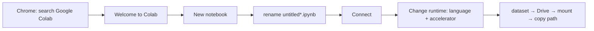
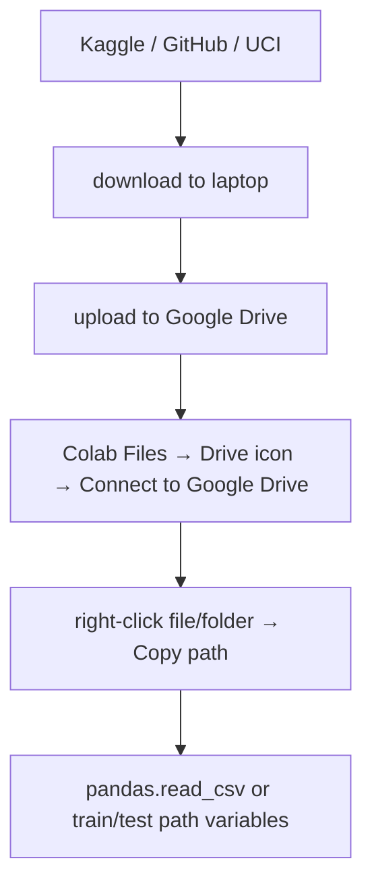

# L07: Introduction to Google Colab

**Video:** [Lec 07](https://www.youtube.com/watch?v=ukII_nwzPsI) · 16:21

### Learning objectives

- Open Colab, create a notebook, connect a runtime, and pick CPU / GPU / TPU.
- Run **code** vs **text** cells (`Shift+Enter`).
- Pull a dataset from **Kaggle**, **GitHub**, or **UCI**, land it in **Google Drive**, and paste the path into pandas / folder variables.

### What this lecture is *not*

No CNN training. This is the **environment + data plumbing** session before Practical Exercise 1.

---

## Why Colab

**Free cloud** Python, with a **Jupyter notebook** UI. Used in this course for ML / DL (datasets, not only toy arithmetic).



---

## Open a notebook

1. Chrome → type **Google Colab**.
2. Click **Welcome to Colab**.
3. **New notebook** (page takes a moment to load).
4. Default name like `untitled5.ipynb` — replace with a project name (demo: **project four**).

**`.ipynb`:** **I**nteractive **Py**thon **N**ote**b**ook.

5. Top right: **Connect**.

### Menu bar

**File, Edit, View, Insert, Runtime, Tools, Help.**

---

## Runtime: language, hardware, version

Connect dropdown → **Change runtime**.

| Field | Options the lecture shows | What to pick |
|-------|---------------------------|--------------|
| **Runtime type** | **Python 3**, **R**, **Julia** | Python 3 for this course; R if you are writing R |
| **Hardware accelerator** | **CPU**, **GPU**, **TPU** | see below |
| **Runtime version** | several | **latest** |

**Save** after choosing.

### CPU vs GPU vs TPU

| Accelerator | When |
|-------------|------|
| **CPU** (default) | fine for small demos; lecture selects CPU “for the time being” |
| **GPU** (graphics processing unit) | same code that might take **10–12 hours** on CPU can take **1–2 hours** on GPU |
| **TPU** (tensor processing unit) | **very large** datasets or **NLP** |

Pick the accelerator **before** you run heavy training.

After connect you also see **RAM** and **disk** — quota for this session.

---

## Text cells vs code cells

Tabs: **Code** and **Text**.

**Text** demo: heading “multiplication of two numbers”. **Shift+Enter** renders the markdown.

**Code** demo:

```python
x = 5
y = 8
z = x * y
print(z)   # 40
```

Run with the **play button** in the cell **or** **Shift+Enter**.

---

## Where datasets come from

Colab is for models that need data. Typical sources named: **Kaggle**, **GitHub**, **UCI**. Files are **CSV**, **images**, or **videos**.

### Pattern used throughout

1. Download to **your computer**.
2. Upload to **Google Drive**.
3. In Colab, **mount Drive** and **copy path**.



---

## Kaggle

1. Open Kaggle (sign up if new; already-signed-in users see their name).
2. Search, e.g. **lung cancer** — lecture saw **5,191** results.
3. First hit was a **`lung cancer.csv`** project. **Download** (top right). File lands **on your system**.
4. Image search example: **Alzheimer’s dataset**. Read the dataset **description**, table of contents, and **libraries**. Download is a **zip**. Inside: separate folders for **test**, **train**, and **validation**. Download those folders too.

Kaggle is **not only datasets**. **Create** opens a **notebook** where you can write and **run** code.

**Share:** button **Share** — **private** (named people) or **public** via link, same idea as sharing a Drive file.

---

## Mount Drive and read a CSV in Colab

Left sidebar: **folder**. Inside, the icon with a **Drive** badge → **Connect to Google Drive** → wait for mount → **drive** → **My Drive**. Whatever you uploaded appears (lecture: test folder, train folder, lung-cancer CSV).

```python
import pandas as pd
import numpy as np

lung = pd.read_csv("PASTE_COPIED_PATH_HERE")
lung.head()
```

**Copy path:** right-click the CSV in the file browser → **Copy path** → paste inside the quotes.

`head()` showed rows with features:

| Feature | Role |
|---------|------|
| name, surname | identity |
| age | |
| smokes | |
| area | |
| alcohol | |
| **result** | **lung cancer or not** — **binary classification** |

### Train / test image folders

Right-click **test** → Copy path → `test_data = "..."`. Same for **train**. Those folder paths are what later image loaders will use.

---

## GitHub

Sign in (register if new). Search **lung cancer** — lecture saw **11.6k** results. Opening a repo shows the project write-up: how they built the **CNN**, training, testing, **confusion matrix**, and the files themselves.

Use GitHub to **host your whole project** and to **download** someone else’s data (same pipeline: download → Drive → Colab).

### Create a repo (lecture demo)

1. **New repository**.
2. Name: **lung two**.
3. Visibility: **public**.
4. **Add README**: on (so you can write a project explanation).
5. **Create repository**.
6. **Edit file** → type description or code → **Commit changes** (confirm).

Share the URL at the top, or make the repo public.

---

## UCI datasets

**University of California** repository. Example: **heart disease** → **Download** → laptop → Drive → path in Colab. Same procedure, different catalogue.

You can **contribute / donate** a dataset (form or link).

Most people in the lecture’s framing use **Kaggle** and **GitHub**; **UCI** sometimes.

---

## Saving the notebook

**File** menu:

- **Save a copy in Drive**
- **Save a copy in GitHub**

### Key takeaways

- Colab = free cloud Jupyter; connect, then set **Python 3** and **CPU/GPU/TPU** (GPU for long jobs, TPU for huge / NLP).
- `Shift+Enter` runs a cell; `.ipynb` is an interactive Python notebook.
- Data path: Kaggle / GitHub / UCI → disk → **Google Drive** → mount → **Copy path** into `read_csv` or train/test variables.
- Kaggle also runs notebooks; GitHub also hosts full CNN projects (confusion matrices included).

---
