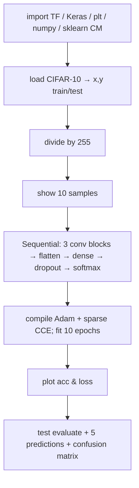
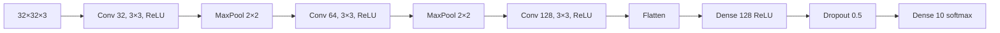

# L08: Practical exercise 1 — CNN on CIFAR-10

**Video:** [Lec 08](https://www.youtube.com/watch?v=9xuj1BTwWos) · 47:36

### Learning objectives

- Load **CIFAR-10**, normalize pixels to $[0,1]$, and plot a $2\times 5$ sample grid.
- Build a **three-block** Keras CNN (32 / 64 / 128 filters), flatten, dense, **dropout $0.5$**, softmax-10.
- Compile with **Adam** + **sparse categorical cross-entropy** + **accuracy**; train **10 epochs**, batch **64**, `validation_split=0.2`.
- Read accuracy/loss curves, test metrics, per-image predictions, and the **$10\times 10$ confusion matrix**.

This is the **week-1 CNN hands-on** (not the ensemble lab).

---

## What the lab is doing

A CNN classifies images. Base operation: **convolution** (multiply then sum), then **pooling**, **activations**, then a prediction head.



---

## 1. Imports

| Import | Why |
|--------|-----|
| `tensorflow as tf` | DL framework |
| `tensorflow.keras`: **`datasets`**, **`layers`**, **`models`** | CIFAR loader, layer types, Sequential |
| `matplotlib.pyplot as plt` | plots |
| `numpy as np` | arrays |
| `sklearn.metrics`: **`confusion_matrix`**, **`confusion_matrix_display`** | true vs predicted counts |

Keras `datasets` is how they pull a ready set (Kaggle / UCI are mentioned as the general idea; **this** notebook uses the built-in CIFAR loader).

---

## 2. Dataset: CIFAR-10

**CIFAR** = **Canadian Institute for Advanced Research**. **10 classes** of vehicles, animals, and birds:

**airplane, automobile, bird, cat, deer, dog, frog, horse, ship, truck.**

```python
(x_train, y_train), (x_test, y_test) = ...cifar10.load_data()
```

| Split | Contents |
|-------|----------|
| `x_train` | training **images** |
| `y_train` | training **labels** |
| `x_test` | test images |
| `y_test` | test labels (ground truth to compare with $\hat{y}$) |

### Normalization to $[0,1]$

RGB intensities are **$0$–$255$** ($256$ levels per channel). Learning on that range is “tedious.” Divide **train and test** by **$255$**:

- $0/255=0$, $255/255=1$, e.g. $100/255$ in between.

Toy $4\times 4$ sketch in the lecture uses values $100,50,10,250$ all mapped into $[0,1]$.

### Shapes (after `print(...shape)`)

| Split | Count | Spatial | Channels |
|-------|------:|---------|----------|
| Train | **$50{,}000$** | $32\times 32$ | $3$ (RGB) |
| Test | **$10{,}000$** | $32\times 32$ | $3$ |

---

## 3. Visualize 10 training images

- `plt.figure(figsize=(10, 5))` — width $10$, height $5$.
- Loop `i in range(10)` (indices $0$–$9$).
- `subplot`: **$2$ rows × $5$ columns**.
- Show `x_train[i]`; title = `class_names[y_train[i]]`.
- `plt.axis("off")` — no $x$/$y$ axis labels.
- Images called out: frog, truck (twice), deer, automobile (twice), horse, ship, cat.

---

## 4. Architecture (`Sequential` — stack layers)

A **basic** CNN can be one conv + pool + flatten + dense. Here they use **three conv blocks** because they can afford the compute / memory; filter count **rises** with depth (low-level → harder high-level features).

| Block | Layer | Filters / units | Kernel / pool | Activation | Extra |
|-------|-------|-----------------|---------------|------------|--------|
| 1 | `Conv2D` | **32** | **$3\times 3$** | **ReLU** | `input_shape=(32,32,3)` |
| 1 | `MaxPooling2D` | — | **$2\times 2$** | — | |
| 2 | `Conv2D` | **64** | $3\times 3$ | ReLU | |
| 2 | `MaxPooling2D` | — | $2\times 2$ | — | |
| 3 | `Conv2D` | **128** | $3\times 3$ | ReLU | |
| — | `Flatten` | — | — | — | matrix/tensor → 1-D |
| — | `Dense` | **128** | — | ReLU | hidden |
| — | `Dropout` | **$0.5$** | — | — | drop **50%** of units — **regularize**, fight **overfitting** |
| — | `Dense` | **10** | — | **softmax** | **10 classes ⇒ 10 neurons** |

Output width **equals** the number of classes (two classes would mean two neurons).



---

## 5. Board-sized walk-through (why each layer)

They re-teach conv/pool/ReLU/flatten/softmax on a **$5\times 5\times 3$** RGB toy (one **red** channel filled in: first row $10,2,1,0,2$) instead of $32\times 32$.

### Convolution / feature extraction

Filters detect points, shapes, textures, **edges**, lines. Deeper layers: extraction gets **harder** — that is why filters go **$32\to 64\to 128$**.

Named **edge operators** you could use as kernels: **Prewitt**, **Sobel**, **Canny**.

- **Sobel vertical:** pattern $1,2,1$ (vertical).
- **Sobel horizontal:**
  $$
  \begin{bmatrix}-1 & -2 & -1\\ 0 & 0 & 0\\ 1 & 2 & 1\end{bmatrix}
  $$
- Prewitt: separate **vertical** and **horizontal** $3\times 3$ masks (shown on the slide).

**Overlap the mask, multiply pixels, sum.** Vertical-Prewitt-style products on the first window: $-10+0+1-2+0+4+0+0+4$ → they reduce this to **$11$**. Slide with **stride $1$**: next windows share a $2$-pixel overlap, then $1,0,2,\ldots$ and so on. Result: a **feature map**, spatially **smaller** than $5\times 5$.

### Output size after conv (no pad, $s=1$)

$$
W_{\text{out}}=\frac{W_{\text{in}}-F+2P}{S}+1
$$

$5-3+0+1=3$ (same for height) → **$3\times 3\times 3$**. Padding with a **ring of zeros** would **preserve edges**; this toy uses $P=0$. Benefit: **less memory / time**, plus the features the kernel is designed for (vertical vs horizontal edges).

### Max pooling on the $3\times 3$ map

Pooling is again for **compute / memory**. Options: **max, average, min**; they use **max** (keep the most important response).

$2\times 2$ windows on a map that includes the $11$: maxima **$11$**, **$5$**, **$2$**, **$2$** → **$2\times 2\times 3$** (channels unchanged). **No padding** in pooling here (not extracting edges). Formula they used with stride $1$: $(3-2)/1+1=2$.

### ReLU on the pooled map

$\max(0,x)$: $11,5,2,2$ stay; a $-5$ would become **$0$**. Adds **nonlinearity** (negatives do not pass as negatives).

### Flatten → dense → softmax

Four values $11,5,2,2$ become features $x_1,\ldots,x_4$. Multiply by a **weight matrix** whose **rows match the number of inputs** and **columns match hidden neurons**. Cartoon hidden layer: **$2$** neurons ⇒ $W$ is $4\times 2$, bias $(b_1,b_2)$.

$$
z = W^{\top}x + b
$$

$z$ is **raw scores**, not probabilities. CIFAR head actually has **$10$** output neurons (10 classes). Softmax:

$$
p_i=\frac{e^{z_i}}{\sum_j e^{z_j}}
$$

Example logits $0.5,0.15,0.2,0.1,\ldots$ do **not** already sum to $1$; after softmax they do. **Argmax $p_i$** is the predicted class.

---

## 6. Compile and train

| Knob | Value | Why |
|------|-------|-----|
| Optimizer | **Adam** | |
| Loss | **sparse categorical cross-entropy** | 10 classes **encoded as integers** (e.g. automobile$\,\to 0$, truck$\,\to 1$, bird$\,\to 2$). Integers ⇒ **sparse** CCE, not one-hot CCE. **Binary** CE would be for **two** classes only |
| Metric | **accuracy** | train and validation |
| `epochs` | **10** | full passes over the data |
| `batch_size` | **64** | samples $0$–$63$: predict, loss, **update weights**; then $64$–$127$; … |
| `validation_split` | **$0.2$** | **80% / 20%** train / val from the training set |
| `verbose` | **1** | one progress line per epoch (`0` = silent, `2` = two lines) |

**Reported after 10 epochs:** training acc **$\approx 75\%$**, validation **$\approx 72\%$**. Gap is small ⇒ **not overfitting** in this run.

---

## 7. Curves

`figsize=(12, 5)`. Two subplots (`1,2,1` and `1,2,2`):

| Panel | Series | Labels |
|-------|--------|--------|
| **Model accuracy** | train + val acc | $x$=epoch, $y$=accuracy; legend **training** (blue) / **validation** (orange) |
| **Model loss** | train + val loss | $x$=epoch, $y$=loss |

**Observe:** both accuracies **rise** with epoch; val acc stays a bit under train ($\sim 72\%$ vs $\sim 75\%$). Both losses **fall**; val loss stays slightly **higher**.

---

## 8. Test set

$10{,}000$ images. `evaluate` on `(x_test, y_test)`:

| Test accuracy | Test loss |
|---------------|-----------|
| **$\approx 71\%$** | **$\approx 0.82$** |

### Five qualitative predictions

`predictions = model.predict(x_test)`. For `i in range(5)`: predicted label = **`argmax`** of that row’s 10 probabilities; actual = `y_test[i]`. Plot image, title “prediction vs actual”, axes off.

All five shown were **correct**: cat/cat, ship/ship, ship/ship, and the 4th and 5th also matched. The lecture stresses this **need not** hold for every test image.

---

## 9. Confusion matrix

`argmax` over `predictions` with `axis=1` (**columns** = predicted). True labels from `y_test` flattened to 1-D (default axis $0$ = rows).

`confusion_matrix(true, pred)` → `ConfusionMatrixDisplay` with **class names**, colormap **Blues**, `xticks_rotation=45` so names do not overlap. Title: **CNN CIFAR confusion matrix**.

$10$ classes ⇒ **$10\times 10$** matrix.

| Where | Meaning | Examples from the run |
|-------|---------|------------------------|
| **Diagonal** | correct | airplane→airplane **$815$**; automobile→automobile **$839$** |
| **Off-diagonal** | mistakes | true automobile, pred airplane **$35$**; true automobile, pred frog **$16$** |

Light blue = small counts, dark blue = large. Mostly dark diagonal + sparse off-diagonal matches the **$\sim 72\%$** accuracy.

### Why three conv blocks

More conv layers ⇒ **richer features** ⇒ easier prediction than a one-conv “basic” CNN.

### Key takeaways

- CIFAR-10: $50\mathrm{k}+10\mathrm{k}$ RGB $32\times 32$ images, 10 named classes; pixels **$/255$**.
- CNN: Conv32–pool, Conv64–pool, Conv128, flatten, Dense128 ReLU, **Dropout $0.5$**, Dense10 softmax.
- Adam + **sparse** CCE (integer labels) + accuracy; 10 epochs, batch 64, 20% val.
- This run: train $\sim 75\%$, val $\sim 72\%$, test $\sim 71\%$ / loss $0.82$; CM diagonal (e.g. $815$, $839$) vs off-diagonal errors ($35$, $16$, …).

---
