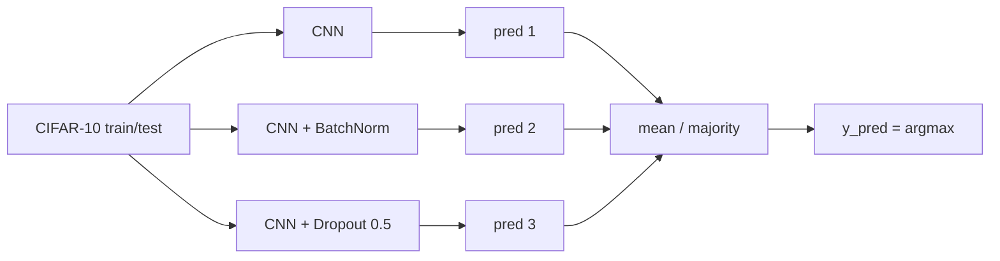

# L09: Practical exercise 2 — Ensemble models

**Video:** [Lec 09](https://www.youtube.com/watch?v=1zLfwJgBnOo) · 29:49

### Learning objectives

- Contrast **serial** vs **parallel** ensembling; implement **three CNNs in parallel** and **average** their probability vectors.
- Differentiate the three members: plain CNN, CNN + **batch normalization**, CNN + **dropout $0.5$**.
- Train each **5 epochs** (batch $64$, `validation_split=0.2`, Adam, sparse CCE) and compare **individual val acc** to **ensemble test acc $\approx 71\%$**.

This is the **ensemble-model hands-on** (same CIFAR-10 data as Practical 1, different models).

---

## Why ensemble

Take several models, run them **in parallel**, collect their predictions, then **average** (this lab) or **stack**. Averaging / majority vote is meant to **cut misclassifications** relative to any single model.



---

## 1. Imports (same stack as the CNN lab)

| Import | Role |
|--------|------|
| `tensorflow as tf` | build nets |
| Keras `datasets`, `layers`, `models` | CIFAR-10, layers, Sequential |
| `matplotlib.pyplot as plt` | plots |
| `numpy as np` | arrays |
| sklearn `confusion_matrix`, `confusion_matrix_display` | true vs predicted |
| later: `accuracy_score` from sklearn | ensemble accuracy |

---

## 2. Data — CIFAR-10 again

**Canadian Institute for Advanced Research**, **10** classes: vehicles, animals, birds.

**airplane, automobile, bird, cat, deer, dog, frog, horse, ship, truck.**

```python
(x_train, y_train), (x_test, y_test) = ...cifar10.load_data()
```

Images have intensities **$0$–$255$**. Normalize to **$[0,1]$** (they also mention $[-1,1]$ as a possible range; this notebook uses $0$–$1$ via **/ $255$**). Same numerical story as Lec 08: $0/255=0$, $255/255=1$.

| Split | Samples | Shape |
|-------|--------:|-------|
| Train | **$50{,}000$** | $32\times 32\times 3$ (W, H, RGB) |
| Test | **$10{,}000$** | $32\times 32\times 3$ |

---

## 3. Parallel ensemble — cartoon vote

$N\ge 2$ models; here **$N=3$**: `model1`, `model2`, `model3`. **Same** train and test tensors go to all three.

Index-$0$ test image example:

| Model | Prediction |
|-------|------------|
| 1 | **truck** |
| 2 | automobile |
| 3 | **truck** |

**Majority = truck** → final label truck. One model alone might err more often; three votes **stabilize**.

### How the three CNNs differ

All are **custom CNNs**. Regularizers differ:

| Model | Extra | Intent |
|-------|--------|--------|
| **1** | plain conv–pool–dense | baseline customized CNN (same *idea* as Practical 1) |
| **2** | **batch normalization** | regularize, **generalize**, reduce **overfitting** |
| **3** | **dropout** | drop the effect of some neurons so they do **not memorize** training patterns |

---

## 4. Model 1 — two-block CNN

Sequential.

| Step | Spec |
|------|------|
| `Conv2D` | **32** filters, **$3\times 3$**, **ReLU**, `input_shape=(32,32,3)` |
| `MaxPooling2D` | **$2\times 2$** |
| `Conv2D` | **64** filters, $3\times 3$, ReLU (high-level features; $32$ was low-level) |
| `MaxPooling2D` | $2\times 2$ |
| `Flatten` | $32\times 32$ grid / pooled maps → **1-D** features $x_1,x_2,\ldots$ |
| `Dense` | **128**, ReLU |
| `Dense` | **10**, **softmax** (10 classes; softmax because **$>2$** classes) |

**Conv** = feature extraction (max in the window = most contributing pixel intensity). Flatten exists so $W x+b$ can produce **raw scores**, then softmax probabilities.

---

## 5. Model 2 — CNN + batch normalization

Sequential, **two** repeats of:

**Conv → BatchNormalization → ReLU → MaxPool**

Then flatten → Dense **128** → Dense **10**.

The **only** structural add vs model 1 is **batch norm**.

### What batch norm does (lecture formula)

On a pooled / activated $2\times 2$ patch with values e.g. $2,10,3,4$:

$$
x_{\text{norm}} = \frac{x-\mu}{\sigma}
$$

$\mu$ = mean of those four values, $\sigma$ = their standard deviation. Every activation is mapped into a **fixed range**.

**Why:** data become more **Gaussian / bell-shaped** (few outliers). Fewer outliers ⇒ **fewer misclassifications**. Lecture summary: BN targets **zero-mean, unit-variance** style scaling — a more **regularized / generalized** net.

---

## 6. Model 3 — CNN + dropout $0.5$

Sequential: conv → max pool → conv → max pool → flatten → Dense **128** → **dropout** → Dense **10**.

**Dropout:** in a fully connected hidden stack, every neuron talks to every neuron in the next layer ($A$ feeds $D,E,F$, …). Those units **memorize training patterns** and fail on unseen data.

Dropout **removes connections**. Cartoon: from $10$ connections, drop $5$ = **$50\%$ dropout**. Dense **128** is thinned by half during training — neurons **deactivated**, less memorization, more **generalization**.

---

## 7. Compile (all three)

Put the three models in a list / loop and compile each:

| Knob | Value |
|------|-------|
| Optimizer | **Adam** |
| Loss | **sparse categorical cross-entropy** |
| Metric | **accuracy** |

**Why sparse:** classes are **integers $0$–$9$** (automobile$\,\to 0$, truck$\,\to 1$, …). A computer does not need the English names. If labels were one-hot and $C>2$, use **categorical** CE; if **two** classes, **binary** CE.

---

## 8. Train each model separately

Same recipe for model 1, 2, and 3:

| Knob | Value | Notes |
|------|-------|--------|
| Data | `x_train`, `y_train` | |
| `epochs` | **5** | you *may* use more; five is for a short demo |
| `batch_size` | **64** | $50\mathrm{k}$ images are **not** one giant update; update after every 64 samples, pass new weights to the next batch |
| `validation_split` | **$0.2$** | 20% of training held out |

You see **epochs 1–5 three times** (once per model).

**Validation accuracy at epoch 5 (this run):**

| Model | Val acc | Comment |
|-------|---------|---------|
| 1 (plain) | **$\approx 67\%$** | |
| 2 (batch norm) | **$\approx 68\%$** | BN **most effective** of the three |
| 3 (dropout) | **$\approx 61\%$** | weakest single model here |

---

## 9. Average the three test predictions

```text
pred1 = model1.predict(x_test)
pred2 = model2.predict(x_test)
pred3 = model3.predict(x_test)
ensemble_pred = (pred1 + pred2 + pred3) / 3    # mean = majority-in-probability
y_pred = argmax(ensemble_pred)                 # index of largest of 10 probs
```

Each row is 10 class probabilities. **Argmax** = class id (automobile, truck, …).

### Ensemble accuracy

`accuracy_score(y_test, y_pred)` → **$0.7114$ ($\approx 71\%$)**.

That is **higher than 67 / 68 / 61**. Averaging over all test images beats every member.

---

## 10. Confusion matrix

`confusion_matrix(y_test, y_pred)` — true labels vs **ensemble** predictions. Colormap **Blues**.

This lab labels axes with **integers $0$–$9$**, not English class names, to show the matrix still works that way (and to match **sparse** CCE).

| Axis | Content |
|------|---------|
| Rows (axis 0) | **true** class $0$–$9$ |
| Columns (`axis=1`) | **predicted** class $0$–$9$ |

**Diagonal = correct.** Lecture counts: class $0\to 0$ **$805$** (spoken “8.5”); class $1\to 1$ **$839$**; class $2\to 2$ **$547$**.

**Off-diagonal = errors.** Examples: $0$ predicted as $1$: **$19$**; class $2$ predicted as class $5$: **$73$**. Sum of off-diagonals = misclassifications (drives loss). Light blue = small, dark blue = large.

Most mass on the diagonal ⇒ accuracy **$71\%>50\%$**.

### Key takeaways

- Parallel ensemble: three CIFAR CNNs, **average softmax vectors**, then argmax.
- Members: (1) two-block CNN, (2) same idea + **batch norm** ($\frac{x-\mu}{\sigma}$), (3) CNN + **$50\%$ dropout**.
- Train **5** epochs, batch **64**, val **$20\%$**, Adam, **sparse** CCE, accuracy.
- This run: val **$67\% / 68\% / 61\%$**; ensemble test **$71.14\%$** — fewer mistakes than any one model.

---
