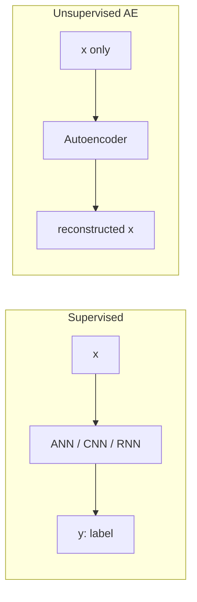
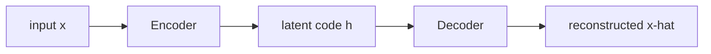
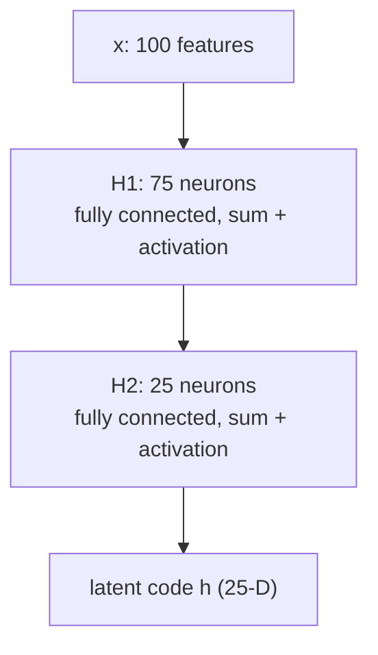
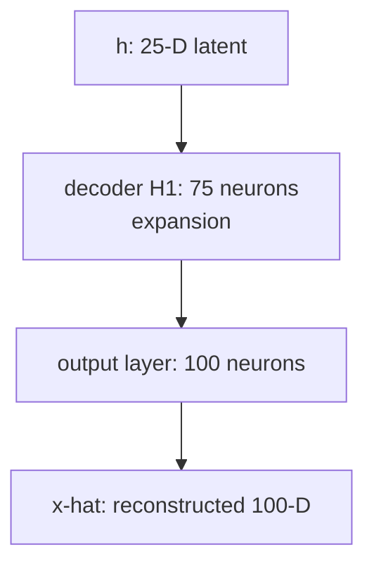
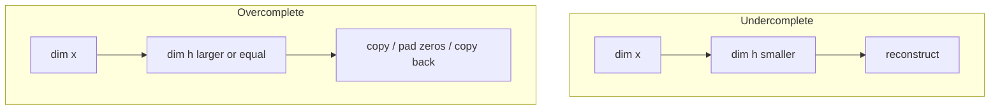

# L10: Introduction to Autoencoder

**Video:** [Lec 10](https://www.youtube.com/watch?v=aBauhB6K0jg) · 34:48  
**Instructor in this lecture:** Prof. Ashwini Kodipalli

### Learning objectives

- Place autoencoders in week 2 as **representation learning**, after week 1’s activations, losses, optimizers, and CNNs.
- Contrast **supervised** $x \mapsto y$ mapping with **unsupervised** learning from unlabeled $x$ only.
- Name the three AE blocks—**encoder**, **latent code**, **decoder**—and the two objectives: representation learning and reconstruction.
- Walk a fully connected encoder/decoder on tabular data: $100 \to 75 \to 25 \to 75 \to 100$.
- Distinguish **undercomplete** vs **overcomplete** latent spaces, including the identity-mapping failure mode.

### Week 2 agenda (as stated in lecture)

Week 2 is autoencoders. The announced sequence is:

1. Introduction and architecture (this lecture)
2. How the autoencoder works in detail
3. **Undercomplete** vs **overcomplete** latent space
4. **Reconstruction loss**
5. Types: **simple / shallow**, **deep**, and **CNN** autoencoders
6. Regularization: **denoising**, **sparse**, **contractive**
7. One **numerical example**
8. **Limitations** of autoencoders (why a VAE is needed)
9. Hands-on on the types of autoencoders

Today’s session only: *why* autoencoders, the three-block architecture, then undercomplete vs overcomplete.

---

## From supervised nets to unlabeled data

Week 1 reviewed ANN, CNN, RNN-style models. Those are **supervised**: every sample has a label. The running picture is a labeled dataset—input $x$ and target $y$. The model’s job is to learn the **mapping** $x \mapsto y$.

When labels are missing, the problem is **unsupervised**. The lecture’s table is **age, height, weight** with no class column. The model must learn **directly from $x$**: hidden patterns, correlations among features, and the structure of the data.

Unsupervised learning in general discovers patterns in unlabeled data. Autoencoders are a **special category**: they learn a **meaningful representation** of $x$ so that they can **reconstruct their own inputs**.

An autoencoder is therefore an **unsupervised deep learning model** whose headline job is representation learning, with reconstruction as the check that the representation is useful.

---

## Three components: encoder, latent code, decoder

| Block | Role |
|-------|------|
| **Encoder** | Learns the most important features of $x$. Output is a **smaller internal representation**. |
| **Latent code** $h$ | That compact representation (also: encoded data, latent representation, hidden representation). |
| **Decoder** | Maps $h$ back toward the original input. Output is $\hat{x}$ (not called $x$, because it is reconstructed). |

Working order:

1. Pass $x$ into the encoder.
2. Encoder compresses $x$ into $h$.
3. Pass $h$ into the decoder.
4. Decoder reconstructs $\hat{x}$.

### Two objectives

| Objective | Who does it | Meaning |
|-----------|-------------|---------|
| **Representation learning** | Encoder | Compact, important features of $x$ |
| **Reconstruction learning** | Decoder | Recover the original input **from $h$**, not by copying pixels/values |

If $h$ really captured structure, $\hat{x}$ will look like $x$. If $h$ is a poor code, reconstruction fails. So $h$ is the hinge of the whole model: $x \to h \to \hat{x}$.

---

## Encoder in detail (tabular MLP example)

The lecture uses **tabular** data (rows and columns), so both encoder and decoder are **multi-layer perceptrons** (fully connected).

Running sizes (chosen only to explain the idea; 25 is a **hyperparameter**, not a law):

$$
100 \;\to\; 75 \;\to\; 25
$$

Input $x$ has **100 features**. First hidden layer $H_1$ has **75 neurons**. Second hidden layer $H_2$ has **25 neurons**. The output of $H_2$ **is** the latent code.

### Fully connected first layer

Every one of the 100 inputs connects to every one of the 75 neurons. Each neuron does the usual deep-learning pair: **weighted sum + activation**.

After $H_1$ you have 75 numbers—not because 25 features were deleted, but because the **same 100 features were compressed**. Every hidden neuron sees **all** inputs. Nothing is dropped; the representation is smaller.

### Second layer: 75 → 25

Every one of the 75 activations connects to every one of the 25 neurons. Again: summation and activation. Output: 25 numbers. Again, this is **compression**, not deletion.

That 25-dimensional vector is $h$: encoded data / latent code / latent representation. The encoder’s job in one sentence: **map $x$ to a lower-dimensional latent representation by progressively reducing the number of hidden neurons**.

$$
100 \;\to\; 75 \;\to\; 25 = h
$$

Because the bottleneck is only 25, the encoder is **forced** to keep the most important features. That is representation learning. The latent size is a **hyperparameter**: you choose it when you design the encoder.

---

## Decoder in detail (mirror expansion)

Decoder is also an MLP on this tabular example. Input to the decoder is the **25-D latent code**.

$$
25 \;\to\; 75 \;\to\; 100 = \hat{x}
$$

First decoder hidden layer: **75 neurons**. Every latent unit connects to every one of those 75. Summation + activation. You now have 75 numbers. This is **expansion**, not insertion of extra raw features: each of the 75 outputs is a **combination** of all 25 latent values (times weights, plus bias).

Next layer: **100 neurons**—the original feature count. Fully connected from 75, summation + activation. The 100 outputs are the **reconstructed** vector $\hat{x}$.

The decoder does **not** copy $x$. It only ever sees $h$. It reconstructs by **progressively increasing** hidden width until the last layer matches $\dim(x)$.

If $h$ captured the important structure, $\hat{x}$ will be similar to $x$. That is reconstruction learning.

### End-to-end map

$$
x \;\xrightarrow{\text{encoder}}\; h \;\xrightarrow{\text{decoder}}\; \hat{x}
$$

Notation in the lecture: encoder maps $x$ to hidden representation $h$; decoder maps $h$ back to $\hat{x}$. The whole aim is $x_i \to h \to \hat{x}_i$, so **$h$ is the object that must be good**.

---

## Undercomplete vs overcomplete

Is $\dim(h) < \dim(x)$ mandatory? No. Both designs exist.

| Type | Latent size | What the lecture wants you to remember |
|------|-------------|----------------------------------------|
| **Undercomplete** | $\dim(h) < \dim(x)$ | Bottleneck **enforces** important-feature learning. If you can still reconstruct, $h$ is a compact, essentially **loss-free encoding** of $x$. |
| **Overcomplete** | $\dim(h) \ge \dim(x)$ | Easy **trivial / identity mapping**: copy $x$ into $h$, pad remaining units with **zeros**, then copy back. **No** useful representation learning. |

### Undercomplete (preferred in practice)

The 100→25 example is undercomplete. Reconstructing from a **smaller** $h$ is evidence that $h$ kept what mattered. This is the architecture the lecture says you should use for real problems and for hands-on work.

### Overcomplete and trivial learning

Suppose $x$ has 4 (or 6) features and $h$ is **larger**. A cheap solution: copy the original coordinates into $h$ and set the extra coordinates to 0, then drop them on the way back. That is an **identical mapping** $x \to h \to \hat{x}$ with **no** good representation.

**Punchline:** in applications, design **undercomplete** autoencoders so $\dim(h)$ is smaller than $\dim(x)$.

---

## What the next lecture will add

The decoder has produced $\hat{x}$. The remaining question is **how close** $\hat{x}$ is to $x$—the **loss**. That is reconstruction loss, next session.

### Key takeaways

- Autoencoders are unsupervised **representation learners** that reconstruct their own $x$; they are not $x \mapsto y$ classifiers.
- Encoder compresses $x$ to latent $h$; decoder expands $h$ to $\hat{x}$. Compression is **not** deletion of features.
- Two objectives: **representation learning** (encoder) and **reconstruction learning** (decoder).
- Tabular example: $100 \to 75 \to 25 \to 75 \to 100$, fully connected, sum + activation at each neuron. Latent size is a hyperparameter.
- **Undercomplete** ($\dim(h) < \dim(x)$) forces useful features. **Overcomplete** ($\dim(h) \ge \dim(x)$) risks copying $x$ and padding zeros.

---
