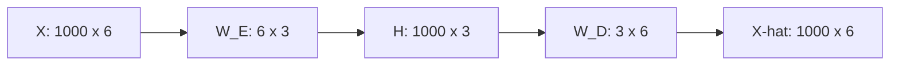
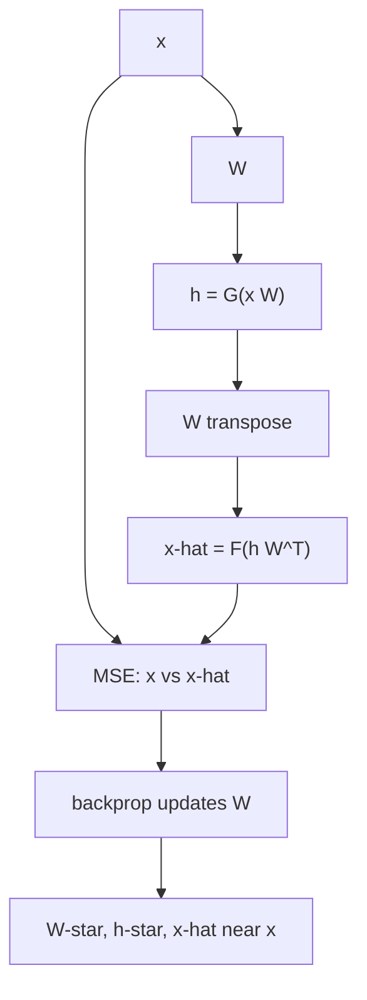

# L11: Reconstruction Loss (MSE, Binary Cross-Entropy)

**Video:** [Lec 11](https://www.youtube.com/watch?v=FyL6UTURU4c) · 39:03  
**Instructor in this lecture:** Prof. Ashwini Kodipalli

### Learning objectives

- Write the encoder/decoder maps $h = G(x W_E)$ and $\hat{x} = F(h W_D)$ with shapes for a $1000 \times 6$ example.
- Contrast **generic** weights ($W_E$ and $W_D$ both learned) with the **tied-weight** assumption $W_D = W^\top$.
- Choose **output activation** from the feature type: sigmoid for binary, linear for continuous.
- Derive **MSE** reconstruction loss for real-valued $x$ and **binary cross-entropy** for $0/1$ features, including why BCE has a leading minus.
- Add a **weight regularizer** so $W$ stays small; after training, $W^\star$ yields a good $h^\star$ and an $\hat{x}$ close to $x$.

### What this lecture is *not*

CNN autoencoders are only **previewed** at the end (conv encoder, upsample / transpose-conv decoder). Types of AE are the next video.

---

## Setup: a one-hidden-layer autoencoder

The math is shown on a **simple** AE: one hidden layer whose output **is** the latent code, then one output layer as the decoder.

Running shapes:

| Object | Shape | Meaning |
|--------|-------|---------|
| Input $X$ | $1000 \times 6$ | 1000 samples, 6 features |
| Latent $H$ | $1000 \times 3$ | same 1000 samples, 3-D code (undercomplete) |
| Encoder weights $W_E$ | $6 \times 3$ | maps $\mathbb{R}^6 \to \mathbb{R}^3$ |
| Decoder weights $W_D$ | $3 \times 6$ | maps $\mathbb{R}^3 \to \mathbb{R}^6$ |
| Reconstruction $\hat{X}$ | $1000 \times 6$ | 6 features back |

Fully connected: each of the 6 inputs connects to all 3 hidden units.

Bias is present in a real net; the lecture **drops bias** here so the products stay readable.

---

## Encoder and decoder equations

Hidden activation $G$, output activation $F$:

$$
h = G(x\, W_E)
$$

$$
\hat{x} = F(h\, W_D)
$$

If $X$ is $1000\times 6$ and $H$ must be $1000\times 3$, then $W_E$ **must** be $6\times 3$. Role of $W_E$: map an input vector in $\mathbb{R}^6$ to $\mathbb{R}^3$.

If $H$ is $1000\times 3$ and $\hat{X}$ must be $1000\times 6$, then $W_D$ **must** be $3\times 6$. Role of $W_D$: map the latent vector in $\mathbb{R}^3$ back to $\mathbb{R}^6$.

---

## Generic weights vs tied weights

$W_E$ is $6\times 3$ and $W_D$ is $3\times 6$: **shapes** are transposes of each other. The **entries need not** be transposes. If you train both matrices, backpropagation learns **two** parameter sets.

| Setting | What is learned | Cost |
|---------|-----------------|------|
| **Generic** | $W_E$ **and** $W_D$ | More parameters, slower training |
| **Tied weights** | Learn only $W$ ($= W_E$); set $W_D = W^\top$ | Same shapes as needed for decode; **one** matrix to train |

Tied-weight assumption: learn $W_E$ only; for the decoder, **take the transpose**. That is enough because $(6\times 3)^\top = 3\times 6$. Complexity of the model drops.

For the rest of the MSE derivation the lecture writes $W_E$ as $W$ and $W_D$ as $W^\top$.

---

## Activations: binary vs continuous features

Choose $F$ (output) from **what you must reconstruct**. Hidden $G$ is almost always **nonlinear**.

### Binary features (all $x_j \in \{0,1\}$)

Decoder must emit values in $[0,1]$. **Output = sigmoid.**

$$
\sigma(a) = \frac{1}{1+e^{-a}}, \qquad
\hat{x} = \sigma(h\, W_D)
$$

Threshold language in the lecture: value $> 0.5$ treated as 1, $< 0.5$ as 0.

**Hidden $G$:** ReLU **or** sigmoid.

### Continuous / real-valued features

Example row: $2.5,\; 7.3,\; 6.9,\; 11.4$. Reconstruction should come back near those reals (the lecture’s sketch: something like $2.1,\; 6.4,\; 6.9,\; 6.1,\; 10.7$—close, not magically exact).

**Output = linear:**

$$
F(a) = a
$$

**Hidden $G$:** ReLU, sigmoid, or **tanh**, depending on the architecture.

| Input features | Output activation $F$ | Hidden $G$ |
|----------------|----------------------|------------|
| Binary $0/1$ | **Sigmoid** | ReLU or sigmoid |
| Continuous | **Linear** | ReLU / sigmoid / tanh |

---

## MSE reconstruction loss (real-valued $x$)

Ideal requirement: $\hat{x}_i = x_i$. In practice: **approximately** equal. There are **no labels**; the **reference is $x$ itself**. Minimize the difference between original and reconstructed input.

**Per-sample** loss (square so a negative residual still costs):

$$
\ell_i = (x_i - \hat{x}_i)^2
$$

**Average** over $m$ samples:

$$
L = \frac{1}{m}\sum_{i=1}^{m} \ell_i
$$

The object that makes this small is the weight matrix. Under tied weights you only need one $W$.

Substitute $\hat{x} = h\, W_D$, $W_D = W^\top$, $h = x\, W$:

$$
\hat{x} = (x\, W)\, W^\top
$$

The reconstruction error is then the mismatch between $x$ and that product, and training should find an $W$ that **minimizes** it.

### $L_2$ regularizer on $W$

Entries of $W$ can be large or small and still fit. The lecture **adds a regularization term** so those entries stay **small**. Example: multiply by $\lambda = 0.01$. Small $\lambda$ scales the matrix down. Intuition: keep $W$ small while still shrinking $\|x - \hat{x}\|$.

After training you have $W^\star$. Then:

$$
h^\star = x\, W^\star
$$

is the **optimized** latent code (important features), and

$$
\hat{x} = h^\star (W^\star)^\top
$$

is a reconstruction **close** to $x$, because $W^\star$ was chosen to shrink that gap under backpropagation.

---

## Binary cross-entropy (binary features)

Do **not** use MSE when features are $0/1$. Output is sigmoid, so $\hat{x}$ is a **probability** in $(0,1)$.

Lecture sketch of targets vs predictions: original $1$ with $\hat{x}=0.92$; original $0$; original $1$; original $1$; original $0$ with $\hat{x}=0.12$. Compare those with **BCE**, not squared error.

**Per-sample** BCE (one feature shown; extend across $D$ features of sample $i$):

$$
\ell_i = -\Big( x_i \log \hat{x}_i + (1-x_i)\log(1-\hat{x}_i) \Big)
$$

### Why the minus sign

In MSE, squaring made the cost non-negative. You cannot square BCE the same way.

- $\hat{x}$ is a probability in $(0,1)$.
- $\log$ of a number in $(0,1)$ is **negative**.
- The inner expression is therefore negative.
- Multiply by $-1$ so the **loss is positive**.

$i$ indexes the **sample**. One sample with $D$ features is $x_{i1},\ldots,x_{iD}$. Over $n$ samples:

$$
L = \frac{1}{n}\sum_{i=1}^{n} \ell_i
$$

(with the same minus-and-log form inside, summed over features). Minimize this in $W$, again with a regularizer so $W$ stays small.

| Feature type | Loss | Why |
|--------------|------|-----|
| Real-valued / continuous | **MSE** | Compare $x$ and $\hat{x}$ in Euclidean sense; square kills the sign |
| Binary $0/1$ | **BCE** | Compare $0/1$ targets to sigmoid probabilities; minus flips $\log p < 0$ |

Both are **reconstruction** losses: the “label” is the original $x$.

---

## Recap diagram and data type → architecture

Latent size is a **hyperparameter** (the recap slide used size **2**). Encoder produces $h$ (or $z$); decoder produces $\hat{x}$. For **tabular** data, encoder and decoder are MLPs. Loss for that recap: MSE on $x$ vs $\hat{x}$.

This course’s AE track is **tabular and images only** (not audio/video).

| Data | Encoder | Decoder | Typical output act. / loss |
|------|---------|---------|----------------------------|
| Tabular | MLP | MLP | linear + MSE, or sigmoid + BCE |
| Images | **Convolution** (feature extraction) | **Upsampling** or **transposed convolution** (CNN AE) | sigmoid if pixels in $\{0,1\}$ / $[0,1]$ |

Next lecture starts from images: CNN autoencoder, then shallow vs deep.

### Key takeaways

- $h = G(x W_E)$, $\hat{x} = F(h W_D)$; for $1000\times 6 \to 1000\times 3$, $W_E$ is $6\times 3$ and $W_D$ is $3\times 6$.
- **Generic:** learn both matrices. **Tied:** learn $W$, decode with $W^\top$.
- Binary $x$: sigmoid out, **BCE**. Continuous $x$: linear out, **MSE**. Hidden: nonlinear (ReLU / sigmoid / tanh).
- Autoencoders have no class labels; reconstruction loss compares $\hat{x}$ to $x$.
- Regularize $W$ (example $\lambda=0.01$) so weights stay small; $W^\star$ gives a useful $h^\star$ and $\hat{x}\approx x$.

---
