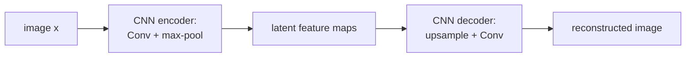
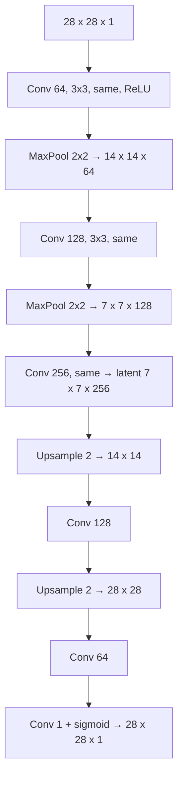
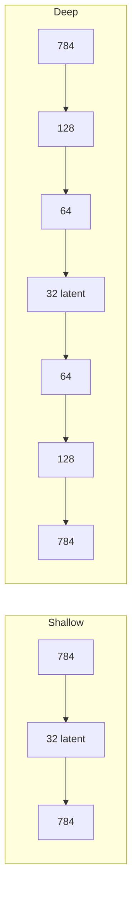

# L12: Types of Autoencoders

**Video:** [Lec 12](https://www.youtube.com/watch?v=vo2z-cWDLGE) · 39:39  
**Instructor in this lecture:** Prof. Ashwini Kodipalli

### Learning objectives

- Build a **CNN autoencoder** for images: conv + max-pool encoder, upsample-then-conv decoder, ending in sigmoid for binary pixels.
- Compute the lecture’s **28×28×1** Keras stack down to a **7×7×256** latent code and back.
- Contrast **nearest-neighbor / bed-of-nails** upsampling with **transposed convolution**, including the **checkerboard** artifact and why AE decoders prefer upsample + convolution.
- Code a **shallow** AE ($784\to 32\to 784$) and a **deep** AE ($784\to 128\to 64\to 32\to 64\to 128\to 784$).
- Explain why flattening a $28\times 28$ image into 784 and using a deep MLP AE **loses spatial structure**.

---

## Why start with CNN AEs

L10–L11 used **tabular** $x$, so encoder and decoder were MLPs. If $x$ is an **image**, the AE is **CNN-based**. Recap from week 1 CNN: convolution extracts features; pooling reduces **spatial** size. Types covered today: CNN AE, then **shallow**, then **deep**.

Every AE still has encoder, latent code, decoder. Only the **layer types** change with the data.

---

## CNN encoder

- **Conv** layers: extract features.
- **Pooling:** reduce spatial size. Pooling kinds from week 1: max, min, average. In autoencoders the lecture uses **max pooling**.
- Latent code = output of the **last conv** in the encoder: compressed maps that hold the important features.

Decoder cannot stay an MLP. It must **upsample** back to the input size (example: latent $7\times 7$ back to $28\times 28$) using **transposed convolution** (deconvolution) and/or explicit upsampling.

---

## Keras walk-through: $28\times 28\times 1$

Binary image: height $28$, width $28$, **1 channel**. Implemented with Keras `Conv2D`. Function name in the lecture: `conv_autoencoder`.

**Padding = `'same'`** keeps spatial size through convolution. **ReLU** after encoder/decoder convs (except the last output).

| Stage | Operation | Output shape |
|-------|-----------|----------------|
| Input | image | $28\times 28\times 1$ |
| Conv2D | 64 kernels, $3\times 3$, ReLU, `padding='same'` | $28\times 28\times 64$ |
| MaxPool | window $2\times 2$ | $14\times 14\times 64$ |
| Conv2D | 128 kernels, $3\times 3$, ReLU, `same` | $14\times 14\times 128$ |
| MaxPool | $2\times 2$ | $7\times 7\times 128$ |
| Conv2D | 256 kernels, `same` | $7\times 7\times 256$ **(latent)** |

$28\to 14\to 7$: two $2\times 2$ pools. Latent spatial size is **$7\times 7$** with **256** maps—compressed relative to $28\times 28$.

---

## Upsampling methods (decoder)

Need $7\times 7 \to 28\times 28$. The lecture first explains **how** you enlarge a map.

### 1. Nearest-neighbor upsampling

Toy input $X$ is $2\times 2$: values $1,2,3,4$. Upsampling factor $s=2$: **each** value is expanded to a $2\times 2$ block. Output is $4\times 4$. **Nearest neighbor** = copy the original value into every cell of its block.

### 2. Bed-of-nails / zero insertion

Same geometry, but fill the new cells with **0** instead of copying.

**Drawback of both:** no **learnable** parameters. Growing $7\times 7$ to $14\times 14$ with $s=2$ is just placing values. The model does not learn the upsample.

### 3. Transposed convolution

Input $2\times 2$:

$$
\begin{bmatrix} 1 & 2 \\ 0 & 1 \end{bmatrix}
$$

Kernel $2\times 2$:

$$
\begin{bmatrix} 4 & 3 \\ 2 & 1 \end{bmatrix}
$$

Output spatial size:

$$
\text{out} = \text{in} + \text{kernel} - 1 = 2+2-1 = 3
$$

so a $3\times 3$ map (zeros first, then scatter-add).

Place each input scalar times the whole kernel at that input’s location:

| Contribution | Where | Result (as taught) |
|--------------|--------|---------------------|
| $G_1$ | $1$ at top-left | $1\cdot[4,3;2,1]$ → $4,3,2,1$ in the top-left $2\times 2$ |
| $G_2$ | $2$ at top-right | $2\cdot 4=8$, $2\cdot 3=6$, $2\cdot 2=4$, $2\cdot 1=2$ |
| $G_3$, $G_4$ | remaining two inputs × kernel | two more $3\times 3$ maps |

**Transposed convolution** = **element-wise add** of $G_1+G_2+G_3+G_4$. Spoken partial sums: top-left $4$; next cell $3+8=11$; next $6$; a later cell $1+4+0+4=9$.

The **kernel is learned** (starts random, updates in backprop). $2\times 2 \to 3\times 3$ is a real upsample with parameters—better than copy/zeros.

### Checkerboard artifacts

Problem: some summed cells are **very large**, others **very small**. On an image that looks like a **grid** of alternating bright/dark squares. Cause: the kernel **overlaps unevenly**—some input regions are hit many times, some once. These are **systematic artifacts of the op**, not added noise.

### Fix used in AE decoders: upsample, then conv

1. Upsample (nearest neighbor **or** zero insertion) so values are spread **uniformly**.
2. Apply a **ordinary convolution** so the kernel walks the map evenly.

Same toy input $[1,2;0,1]$ and kernel $[4,3;2,1]$: after upsample+conv the lecture’s result is more **evenly** distributed (not a few huge cells and a few tiny ones). Overlap is uniform, so checkerboard is avoided.

**Rule for this course’s CNN AE:** decoder = **upsampling then convolution**, not raw transposed conv alone.

---

## CNN decoder matching the $7\times 7\times 256$ code

| Stage | Operation | Output shape |
|-------|-----------|----------------|
| Latent | from encoder | $7\times 7\times 256$ |
| Upsample | factor $2\times 2$ | $14\times 14\times 256$ |
| Conv | 128 kernels | $14\times 14\times 128$ |
| Upsample | factor $2$ | $28\times 28\times 128$ |
| Conv | 64 kernels | $28\times 28\times 64$ |
| Conv | **1** kernel, $3\times 3$, `padding='same'` | $28\times 28\times 1$ |

Last conv is required to collapse **64 channels → 1** so the tensor matches $28\times 28\times 1$.

**Output activation: sigmoid**, because the input is binary $0/1$; reconstruction must lie in $[0,1]$.

You can plot latent maps and reconstructions in the later hands-on.

---

## Latent size is a hyperparameter (image quality)

How small you compress is set in code.

| Latent size | Reconstruction |
|-------------|----------------|
| **Too small** | Over-compression; important information is compromised; reconstruction is **too blurry** |
| **Moderately larger** (still $<$ input) | Better compressed code; **sharper** reconstructions |
| **Too large** (past a point) | Quality **deteriorates** (diminishing / worse images) |

Tune the latent dimensionality; do not collapse it, and do not grow it without limit.

---

## Shallow autoencoder

**Shallow** = **one hidden layer** between input and output. That hidden layer **is** the latent code.

MNIST-shaped vector example:

$$
784 \;\xrightarrow{\text{ReLU}}\; 32 \;\xrightarrow{\text{sigmoid}}\; 784
$$

- Input 784 (e.g. flattened $28\times 28$).
- Hidden: **32** neurons, ReLU → encoded length 32.
- Output: **784** neurons, **sigmoid**.

**Why sigmoid at the output**

- If raw features are binary, outputs should be binary-valued in $[0,1]$.
- If **preprocessing scaled** features to $[0,1]$ (normalization), outputs must match that range → still sigmoid, and loss is **BCE**.
- If features stay **real-valued** / you used **standardization** (not $0$–$1$ scaling) → **linear** output and **MSE**.

The reconstructed range must match the input range.

---

## Deep autoencoder

**Deep** = **several** hidden layers. Encoder widths **decrease**; decoder widths **increase**. Last encoder layer is the latent code.

Lecture sizes:

$$
784 \to 128 \to 64 \to 32 \;\to\; 64 \to 128 \to 784
$$

Code-level (dense layers, store activations back into `x`):

1. Input 784 → Dense 128, ReLU  
2. → Dense 64, ReLU  
3. → Dense 32, ReLU  **(latent)**  
4. → Dense 64, ReLU  
5. → Dense 128, ReLU  
6. → Dense 784, **sigmoid** if scaled to $[0,1]$; **linear** if real-valued / standardized  

---

## Do not use a deep MLP AE on images

Can you flatten $28\times 28\times 1$ to 784 and run the deep AE? **No** for images.

Flattening **destroys spatial information**. Side-by-side in the lecture (red highlights): CNN reconstructions keep **sharp** features; the deep MLP blurs edges. A mark on a **T-shirt** is kept by the CNN AE and lost by the deep AE.

| Model on images | What happens |
|-----------------|--------------|
| Deep / shallow **MLP** AE | Flattening drops **edges, contours, shapes**; spatial relations are gone |
| **CNN** AE | Convolution keeps **local spatial structure** (edges, textures, shapes); decoder uses learned feature maps |

**Rule:** images → CNN autoencoder. Tabular data → shallow **or** deep MLP AE.

---

## Next: regularization

AEs can **overfit**. Week 1 already had L1/L2, dropout, early stopping, batch norm (for images). Next lectures ask whether AEs need **extra** regularizers: denoising, sparse, contractive.

### Key takeaways

- Image AE: encoder = conv + **max-pool**; decoder = **upsample then conv**; last layer **sigmoid** if pixels are $0/1$.
- Example stack: $28\times 28\times 1$ → … → latent $7\times 7\times 256$ → … → $28\times 28\times 1$.
- Nearest-neighbor / bed-of-nails upsample have **no** learned params. Transposed conv learns a kernel but can make **checkerboard** artifacts; prefer upsample + conv.
- Shallow: one hidden layer ($784\to 32\to 784$). Deep: stacked bottlenecks ($784\to 128\to 64\to 32\to \cdots \to 784$).
- Flattening images for an MLP AE loses spatial structure; use a CNN AE.

---
