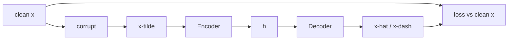

# L13: Denoising Autoencoder

**Video:** [Lec 13](https://www.youtube.com/watch?v=q3XAdXdqz8s) · 42:36  
**Instructor in this lecture:** Prof. Ashwini Kodipalli

### Learning objectives

- Say why AEs need **regularization**, especially in the **overcomplete** identity-mapping case.
- Draw the DAE pipeline: corrupt $x \to \tilde{x}$, encode, decode, compare $\hat{x}$ to the **clean** $x$ (never to $\tilde{x}$).
- Name three corruption recipes: **Gaussian**, **masking** ($q=0.4$), **salt-and-pepper**, with the lecture’s numbers.
- Explain **neighboring-pixel dependence** as the reason a DAE can fill missing pixels (toy counts / means vs real **conv** filters).
- Write the DAE equations and training objective (MSE or BCE on clean $x$ vs $\hat{x}$).

This lecture is **only** denoising. Sparse and contractive are later videos.

---

## Recap, then why regularize

Standard AE (bias included this time):

$$
h = G(W_E x + b_E)
$$

$G$ is **nonlinear** on the encoder. Decoder last layer:

$$
\hat{x} = F(W_D h + b_D)
$$

$F$ is chosen from the output type. Intermediate decoder hidden layers: **ReLU**. Train by shrinking the gap between $x$ and $\hat{x}$.

That is enough when the AE is well behaved. **Regularization** means restricting how freely weights and biases move.

Classic failure: **overcomplete** AE ($\dim(h) \gg \dim(x)$). The net can **copy** $x$ into $h$ and copy back—an **identity mapping**, not robust features. Result: **overfitting** and poor generalization. (Undercomplete nets can overfit too; overcomplete is the **textbook** case.)

You need a **regularized variant** that blocks identity mapping and still forces useful features. **Denoising autoencoder (DAE)** is the first such variant.

---

## DAE in one picture

1. Take clean $x$.
2. **Intentionally corrupt** it (noise, brightness up/down, “tap” values). Call the result $\tilde{x}$ (tilde $x$).
3. Feed **only** $\tilde{x}$ to the encoder.
4. Decoder emits a reconstruction (lecture also writes $x'$ / $x$-dash to avoid mixing hat and tilde).
5. Loss compares reconstruction to **clean $x$**, **not** to $\tilde{x}$.

Ground truth is the clean image; the model never sees a free copy path. It **cannot relax** (cannot identity-map $\tilde{x}\to\tilde{x}$). Working harder is the regularizer.

Diagram in the lecture: clean digit **4** → add noise → noisy image → DAE → **clean** target. Corruption uses a **probability-based** rule.

---

## Three ways to corrupt $x$

### 1. Gaussian noise

Draw noise from a Gaussian with **mean $0$** and some variance; **add** it to $x$.

Lecture vector (four features):

| | $x_1$ | $x_2$ | $x_3$ | $x_4$ |
|--|------:|------:|------:|------:|
| Clean $x$ | 0.50 | 0.80 | 0.20 | 0.90 |
| After noise $\tilde{x}$ | 0.51 | 0.75 | 0.23 | 0.82 |

Not the same row. The AE must reconstruct **$0.50, 0.80, 0.20, 0.90$**, not the noisy numbers. Disturbance can be larger than this toy; values stay “in and around” the originals.

### 2. Masking noise

Randomly set **some features to 0**. Probability $q$ that a feature is zeroed; probability $1-q$ that it is left unchanged.

Lecture: $q = 0.4$ → **40%** chance a feature becomes 0, **60%** chance it stays.

Five features; $40\%$ of $5$ is **2**, so about two entries become 0. One realized mask: **2nd and 4th** set to 0, others unchanged. Other draws are equally allowed (e.g. two different indices). Every feature independently has a $40\%$ chance.

### 3. Salt-and-pepper (most popular in the lecture)

Salt = **white**, pepper = **black**. Replace random pixels by **extreme intensity**, not by a small nudge.

**Binary $3\times 3$:** some $1$s become $0$ and some $0$s become $1$ (extremes of $\{0,1\}$). The lecture stresses this is **not** “always flip every pixel”—it is replacing **selected** pixels by the opposite extreme.

**Grayscale ($0$–$255$):** example **$128 \to 0$** (pepper / black) and **$130 \to 255$** (salt / white). The image fills with **white and black dots**—visibly noisy.

| Corruption | What it does |
|------------|----------------|
| Gaussian | Add $\mathcal{N}(0,\sigma^2)$ |
| Masking | Each feature $\to 0$ with probability $q$ (lecture $q=0.4$) |
| Salt-and-pepper | Random pixels $\to$ extreme intensity ($0$ or $1$ binary; $0$ or $255$ grayscale) |

Always: pass $\tilde{x}$ in; score $\hat{x}$ against **clean $x$**.

---

## Why reconstruction can still recover a clean “3”

After salt-and-pepper a clean **3** has cuts and missing ink. The DAE must emit a **clean 3**, not a 3 with gaps. How does it know the missing curve?

**Neighboring pixels are not independent.** They are **strongly correlated**. Face photo: pixels in one region look alike (skin vs hair). Cat: tail pixels similar, legs similar, and so on. Shapes exist only because neighbors agree.

Write $x_{i,j}$ for the pixel at row $i$, column $j$. Binary: $0$ or $1$. Grayscale: $0$–$255$, or $[0,1]$ if normalized.

If a pixel sits on a **curved black stroke**, nearby pixels are likely on the **same** stroke. If that center value is **missing**, infer it from neighbors.

**DAE is not only “reconstruct”:** it learns to restore $x$ using **neighborhood dependence**. A corrupted center can be read off the surrounding **eight** pixels (3×3 window). In probability language: $p(\text{center} \mid \text{neighbors})$.

### Toy neighborhood fill (intuition only — **not** the deployed algorithm)

The lecture repeats: **do not** use these counting tricks in production; they only show why neighbors matter.

**Binary, missing center**

- Six $1$s and two $0$s among eight neighbors.  
  $$P(\text{center}=1)=\frac{6}{8}=0.75,\quad P(\text{center}=0)=\frac{2}{8}=0.25$$  
  Fill **1**.
- Other patch: six $0$s, two $1$s → fill **0**.
- Missing pixel need not be the geometric center of the whole image; treat it as center of **its** 3×3.

**Grayscale, missing center**

Cannot count zeros and ones. List neighbors (spoken: $120, 125, 130, 123, 127, \ldots$), take the **mean**.

$$
\text{mean} = 124.625 \;\xrightarrow{\text{round}}\; 125
$$

Fill **125**. Neighbors live in $120$–$130$, so the center should too. (Correct arithmetic if a slide typo appears.)

---

## How it is actually implemented: convolution

For an **image** DAE, neighborhood structure is learned by **CNN filters**, same as week 1.

Lecture snippet: **32** filters, each **$3\times 3$**, **ReLU**, padding, applied to the (noisy) input.

Toy: kernel on a patch whose missing pixel is written as **0**. Convolution = element-wise multiply, then **sum**. First window sums to **17**. Sliding the $3\times 3$ window always mixes the missing site with its neighbors. Window size is a hyperparameter; “eight neighbors” was for a $3\times 3$ illustration.

So: corrupt → conv encoder learns local context → decoder reconstructs a clean image.

---

## DAE equations and training loop

**Step 1 — corrupt**

$$
x \;\xrightarrow{\text{Gaussian / mask / salt-pepper / other}}\; \tilde{x}
$$

**Step 2 — encoder** (one hidden layer, or last layer if deep)

$$
h = G(W \tilde{x} + b)
$$

**Step 3 — decoder**

$$
\hat{x} = F(W' h + b')
$$

Hidden decoder layers: ReLU / nonlinear. Last layer: output activation from data type.

**Step 4 — loss vs clean $x$**

$$
\min \; L\big(x,\, \hat{x}\big)
$$

| Data | Loss |
|------|------|
| Continuous | **MSE** |
| Binary or $[0,1]$ normalized | **BCE** |

Early in training $\hat{x}$ still looks noisy; the gap to clean $x$ is large → weights move. Later $\hat{x}$ approaches the clean image. At **test** time a corrupted input should yield a **clean** output.

Hidden objective: reconstructed pixel at $(i,j)$ is a function of its **local neighborhood**.

**Application:** you have corrupted measurements; DAE maps them toward clean data. Training **adds** noise to originally clean $x$ so the mapping is learnable (shown in the week-2 lab).

---

## Why this is a regularizer (even if overcomplete)

| Model | Input | Compared to |
|-------|--------|-------------|
| Standard AE | clean $x$ | clean $x$ |
| DAE | $\tilde{x}$ (noise **you** added) | still clean $x$ |

If an overcomplete DAE **copied** its input, $\hat{x}$ would stay **noisy**. Compared with clean $x$, loss would **not** go to zero. Copying is no longer a shortcut.

Corruption **removes identity mapping**. The model must **infer missing values from context**, so it learns features instead of copying.

### Key takeaways

- Regularize AEs to stop identity mapping, especially when $\dim(h)$ is large.
- DAE: encode **$\tilde{x}$**, reconstruct **clean $x$**. That gap is the constraint.
- Corrupt with Gaussian (example $0.50\to 0.51$, …), masking ($q=0.4$), or salt-and-pepper ($128\to 0$, $130\to 255$).
- Restoration uses **neighbor correlation**; toy fill is majority/mean; real images use **conv** kernels (e.g. 32 filters, $3\times 3$).
- Train MSE or BCE on $(x,\hat{x})$; test: noisy in, clean out.

---
