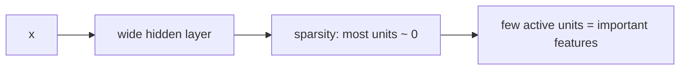
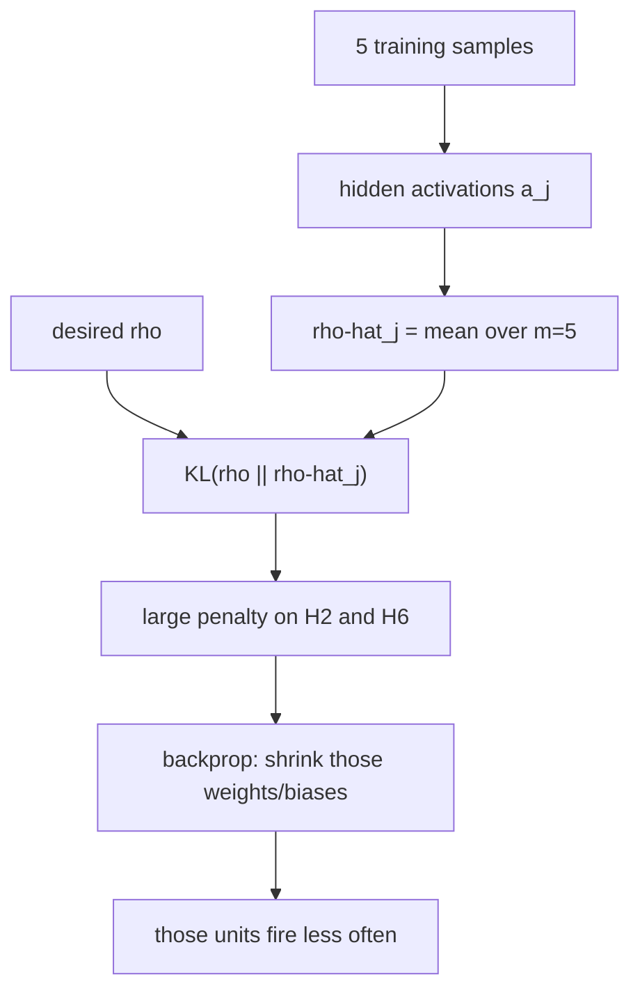

# L14: Sparse Autoencoder

**Video:** [Lec 14](https://www.youtube.com/watch?v=CmOGqsDRVP8) · 39:30  
**Instructor in this lecture:** Prof. Ashwini Kodipalli

### Learning objectives

- State the SAE idea: even with a **wide** hidden layer, keep **most units inactive** so the few that fire must carry important features.
- Write the loss as reconstruction **plus** a sparsity penalty controlled by $\beta$.
- Define average hidden activation $\hat{\rho}_j$, desired sparsity $\rho$, and the constraint $\hat{\rho}_j \approx \rho$.
- Use **KL divergence** $\mathrm{KL}(\rho \| \hat{\rho}_j)$ as the penalty, including the active and inactive terms, and the identity case $\rho=\hat{\rho}=0.05$.
- Follow the lecture’s **5-sample / 7-neuron** example: large $\hat{\rho}$ on **H2** and **H6** → large KL → backprop shrinks those units.

---

## Why sparsity (same overfitting story)

If $\dim(h) < \dim(x)$ (undercomplete), the bottleneck already **forces compression**. If $\dim(h) > \dim(x)$ (overcomplete), copying $x$ into $h$ is too easy—identity mapping, weak features, overfitting. Undercomplete nets are not immune, but overcomplete is the sharp case.

**Requirement:** even with **many** hidden neurons, still learn important features—**no** identity map.

Idea: keep some hidden **outputs at 0** (inactive). Effective width drops; the units that remain on must encode something real.

---

## What “sparse” means

A **sparse autoencoder** wants **most hidden neurons inactive** for most inputs—only a **few** active. Those few are then forced to capture important structure.

Regularization here is not “delete the layer”; it is **restrict** when a unit may fire.

### Add a sparsity term to the loss

A plain AE has only reconstruction loss. SAE:

$$
L = L_{\text{reconstruction}} + \beta\, L_{\text{sparsity}}
$$

| Term | Role |
|------|------|
| $L_{\text{reconstruction}}$ | How well $\hat{x}$ matches $x$ |
| $L_{\text{sparsity}}$ | **Penalty** if too many hidden neurons are active |
| $\beta$ | Hyperparameter: **how strongly** to enforce sparsity (small constant) |

If a neuron is active too often, **punish** it so it becomes less active; remaining activity has to be informative.

Two ways to implement sparsity: **KL divergence** or **L1**. This lecture (and the original SAE paper the instructor cites) uses **KL**. L1 appears in the week-2 lab.

---

## Notation (paper-style)

Toy net in the slides: **4** input features, **3** hidden neurons, fully connected. The construction does not depend on under- vs overcomplete.

For input $x$, the activation of hidden neuron $j$ in layer 2:

$$
a^{(2)}_j(x)
$$

Read: **output of hidden neuron $j$ in layer 2 for input $x$**. (Layer 1 = input, layer 2 = hidden.)

For training sample $i$, write the same activation on that example.

### Average activation $\hat{\rho}_j$

Do **not** sparsify from a single example. Pass **all** $m$ training samples. Neuron $j$ produces $m$ activations. Average them:

$$
\hat{\rho}_j = \frac{1}{m}\sum_{i=1}^{m} a^{(2)}_j(x^{(i)})
$$

Every hidden unit gets its own $\hat{\rho}_j$. This is the **actual average activation**.

### Desired sparsity $\rho$

$\rho$ is the **target** average activation (sparsity level). SAE constraint:

$$
\hat{\rho}_j \approx \rho
$$

If $\hat{\rho}_j$ is close to $\rho$, **small** penalty. If they differ a lot, **large** penalty. Distance between the two numbers is measured with **KL divergence**.

Two readings of “sparse,” both used:

1. Inside one hidden layer, only a **small fraction** of neurons active at a time.
2. **On average**, each neuron is active only **rarely**.

---

## KL penalty

For one unit:

$$
\mathrm{KL}(\rho \| \hat{\rho}_j)
= \rho\log\frac{\rho}{\hat{\rho}_j}
+ (1-\rho)\log\frac{1-\rho}{1-\hat{\rho}_j}
$$

- If $\rho \approx \hat{\rho}_j$, KL $\approx 0$ (ideally zero; in data, nearly zero). **Little or no** penalty.
- If they are far, KL **grows** → **large** penalty.

Sum over **all** hidden units (four units in the schematic; seven in the numerical table):

$$
L_{\text{sparsity}} = \sum_j \mathrm{KL}(\rho \| \hat{\rho}_j)
$$

### Active term and inactive term

A hidden unit has two sides: it can be **on** or **off**. Checking only “how often it is on” misses half the behavior. KL’s two logs are:

| Term | What it matches |
|------|-----------------|
| $\rho \log(\rho / \hat{\rho}_j)$ | **Active** part: how often the unit **should** fire vs how often it **does** |
| $(1-\rho)\log\bigl((1-\rho)/(1-\hat{\rho}_j)\bigr)$ | **Inactive** part: how often it **should** be off vs how often it **is** |

Penalty = mismatch on **both** sides.

---

## Identity example: $\rho = \hat{\rho} = 0.05$

Desired active rate $\rho = 0.05$ ⇒ desired inactive rate $1-\rho = 0.95$.

If actual $\hat{\rho} = 0.05$ as well, actual inactive $= 0.95$.

Plug in (lecture used $\log_{10}$ on the slide; $\log 1 = 0$ in any base):

$$
0.05\log\frac{0.05}{0.05} + 0.95\log\frac{0.95}{0.95} = 0
$$

Perfect match on active **and** inactive ⇒ KL $= 0$ ⇒ no penalty. This is the “$\rho=\hat{\rho}$” sanity check.

---

## Numerical example: 5 samples, 7 hidden units

Dataset: **5** samples, each with several input features. Hidden layer: **7** neurons $H_1,\ldots,H_7$.

Pass sample 1: each of the 7 units emits a number. Pass samples 2–5: five numbers **per column** (per neuron). Average each column with

$$
\hat{\rho}_j = \frac{1}{5}\sum_{i=1}^{5} a_j(x^{(i)})
$$

Spoken result for **$H_1$**: average activation **$0.3$** (recompute from the slide if a caption/typo disagrees; the instructor invited corrections). Repeat for $H_2$ through $H_7$ to fill $\hat{\rho}_j$.

Desired sparsity in this walk-through is the small rate from the KL slide (**$\rho = 0.05$**; the live lecture also says $0.005$ at one point—use the slide and the $1-\rho=0.95$ identity example as the intended $\rho$).

By eye:

- Some $\hat{\rho}_j$ sit **near** $\rho$ → small KL.
- **$H_2$ and $H_6$** sit **far** above $\rho$ → they fire **too often**.

SAE does **not** want neurons that are on most of the time. **$H_2$ and $H_6$ get the large penalties.**

Substitute $(\rho, \hat{\rho}_j)$ into KL for each $j$. For a unit with $\hat{\rho}$ near $\rho$, KL is **tiny**. For $H_2$ / $H_6$, KL is **large**. (Work the arithmetic from the table; treat any slide typo as yours to fix.)

---

## What backprop does with a large KL

Large $\mathrm{KL}(\rho\|\hat{\rho}_j)$ is **added** to reconstruction loss ⇒ **total $L$ up**. Gradients flow into the weights **and bias** of that hidden unit. Next pass, $H_2$ / $H_6$ become **less** active. Overactive neurons are pushed toward rare firing.

Units that are usually off, when they **do** turn on, must carry **relevant** information. That restriction is the regularizer: the net cannot freely copy $x$ through a crowd of always-on hidden units.

### End-to-end picture

Example numbers used in the closing sketch: one unit with $\rho=0.05$ vs $\hat{\rho}=0.3$ (too active) vs another closer to target. KL on the overactive unit **rises**, total loss rises, backprop **turns that unit down**.

$$
L = L_{\text{rec}}(x,\hat{x}) + \beta \sum_j \mathrm{KL}(\rho \| \hat{\rho}_j)
$$

Because most hidden dimensions cannot stay on, SAE fights the overcomplete copying path and keeps a **sparse** code.

Next lecture: **contractive** autoencoders.

### Key takeaways

- SAE: many hidden units allowed, but **most stay off**; the few that fire must be useful.
- Loss = reconstruction + $\beta \times$ sparsity penalty (KL in this lecture; L1 is the other option).
- $\hat{\rho}_j$ = mean activation of unit $j$ over $m$ samples; target $\rho$; want $\hat{\rho}_j \approx \rho$.
- $\mathrm{KL}(\rho\|\hat{\rho})$ has an **active** log and an **inactive** log; $\rho=\hat{\rho}=0.05$ gives KL $=0$.
- In the 5×7 example, **H2** and **H6** are over-active; large KL + backprop makes them quieter.

---
