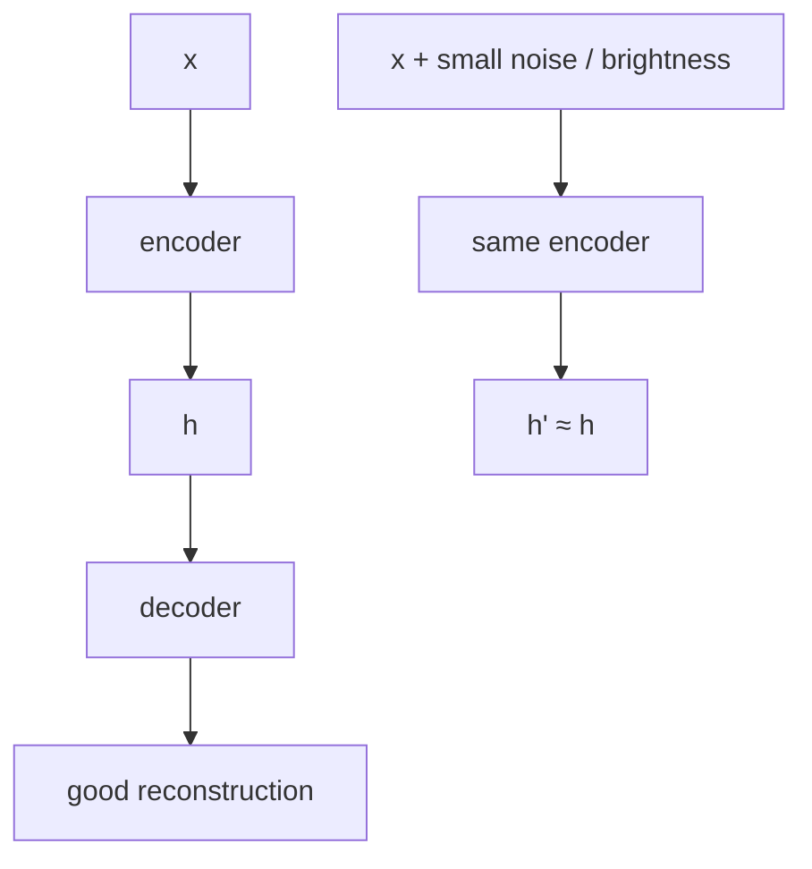
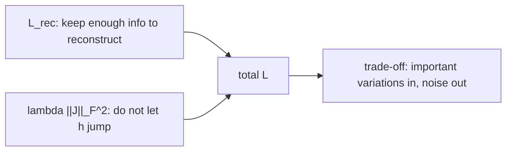

# L15: Contractive Autoencoder

**Video:** [Lec 15](https://www.youtube.com/watch?v=87pbybKetu4) · 27:05  
**Instructor in this lecture:** Prof. Ashwini Kodipalli

### Learning objectives

- State the CAE extra requirement: reconstruct well **and** keep $h$ **stable** when $x$ changes only slightly (noise, brightness).
- Write the **Jacobian** $J_h(x) = \partial h / \partial x$ and the **Frobenius** penalty $\|J_h(x)\|_F^2$.
- Add that penalty to reconstruction loss with weight $\lambda$.
- Interpret a large vs small $\partial h_1 / \partial x_1$ (sensitivity vs insensitivity).
- Explain the **trade-off**: keep **genuine** variations, suppress **unimportant** ones (noise), using $\lambda$ and the two loss terms.

---

## Reconstruct well, but keep $h$ stable

Standard AE: encoder $\to$ latent $h$ $\to$ decoder reconstructs $x$ well.

**Contractive** AE: still reconstruct well, **and** keep the hidden representation **stable**.

**Stable** means: if two inputs differ only **slightly**, their codes $h$ should stay **close**.

Lecture pair of images: same object/features; the second has a little **noise**. Features did not change. Then $h$ for the two images should not jump.

Slight change in $x$ can also be a **brightness** shift, not only additive noise.

A vanilla AE **will** usually move $h$ a bit when you pass $x$ vs $x+\delta$. CAE says those two hidden vectors should remain **nearly the same**.

**Goal:** good reconstruction **and** stable $h$.

Like DAE and SAE, CAE is a **regularized** AE aimed at **overcomplete** nets that would otherwise learn a **trivial identity map**. The extra term is **Jacobian** regularization on the loss.

---

## Jacobian of $h$ with respect to $x$

Encoder (as before): weighted sum + bias, then activation $G$:

$$
h = G(x)
$$

The regularizer uses the **Jacobian of all hidden units with respect to all input dimensions**—partial derivatives $\partial h_k / \partial x_j$.

### Matrix picture

Inputs $x_1,x_2,x_3$ (three features). Hidden units $h_1,h_2,h_3,h_4$. Fully connected. $J$ is the matrix of every $\partial h_k / \partial x_j$.

**First column:** how much **each** hidden unit moves when $x_1$ moves a little:

$$
\frac{\partial h_1}{\partial x_1},\;
\frac{\partial h_2}{\partial x_1},\;
\frac{\partial h_3}{\partial x_1},\;
\frac{\partial h_4}{\partial x_1}
$$

That column is the **sensitivity** of the whole hidden layer to feature $x_1$. Other columns: sensitivity to $x_2$, $x_3$.

### Tiny input change (spoken numbers)

$$
x = (1.5,\; 2.5,\; 3.5)
\quad\text{vs}\quad
(1.6,\; 2.5,\; 3.4)
$$

$h$ should **not** swing wildly. Each entry of $J$ answers “how much did this $h_k$ move when this $x_j$ moved?”

### Frobenius norm

The penalty is the **sum of squares of all Jacobian entries**—the **Frobenius** norm:

$$
\|J_h(x)\|_F^2
= \sum_{k,j} \left(\frac{\partial h_k}{\partial x_j}\right)^2
$$

If this is **large**, many entries of $J$ are large ⇒ $h$ **changes a lot** for a small change in $x$. CAE wants those values **small** so $h$ stays stable.

---

## Loss

Add the Jacobian term to reconstruction loss:

$$
L = L_{\text{rec}}(x,\hat{x}) + \lambda \,\|J_h(x)\|_F^2
$$

Training **minimizes** $L$, so the second term is driven **toward 0**: $h$ should not twitch for tiny input moves.

### Reading one entry: $\partial h_1 / \partial x_1$

| Size of $\partial h_1/\partial x_1$ | Meaning | Wanted? |
|-------------------------------------|---------|---------|
| **Large** | $h_1$ changes a lot when $x_1$ changes a little; $h_1$ is **very sensitive** to $x_1$ | No: reconstruction would **copy noise** into $\hat{x}$ |
| **Small** | $h_1$ barely reacts; **insensitive** to small $x_1$ wiggles | Yes for **unimportant** wiggles |

CAE does not want $h_1$ to track **unimportant** changes in $x_1$.

---

## Two contradictory pressures — the trade-off

If $h$ **drops** information, reconstruction is **poor** and $L_{\text{rec}}$ is large. So the first term says: **keep enough information** to reconstruct.

The second term says: **do not** let $h$ change for every small variation.

Those pull opposite ways. **Compromise:** preserve **important** variations in the data; **ignore / suppress** less important ones.

$h$ cannot store every detail, and it cannot be **completely** dead to all changes. **Balance** is the hyperparameter $\lambda$:

| $\lambda$ | Effect (as taught) |
|-----------|---------------------|
| **Large** | Punish $h$-movement more → **more stable** features |
| **Small** | Weaker penalty → **more detailed** reconstruction |

---

## How the model “knows” what to keep

The lecture’s two thought experiments (same formula, two inputs).

### Scenario A — genuine variation

The change in $x$ is a **real** part of the data—not noise, not a brightness glitch. Then $h$ **should** capture it.

If $h$ **refuses** to react (because you trained it to be still):

- $\hat{x}$ **misses** that variation.
- Compared with original $x$, **$L_{\text{rec}}$ rises**.
- Meanwhile derivatives in $J$ stay **small**, so the penalty term is **tiny**.

High reconstruction loss is the signal: **this variation mattered—capture it.** Valid structure in $x$ must move $h$.

### Scenario B — noise / random disturbance

Two images: same features, extra **noise**. $h$ should **not** encode the speckle.

If $h$ **does** react:

- $\partial h_1/\partial x_1$ (and other entries) **grow** ⇒ Frobenius penalty **grows**.
- Decoder **paints the noise** into $\hat{x}$.
- Clean original $x$ vs noisy $\hat{x}$ ⇒ **$L_{\text{rec}}$ also up**.

**Both** terms punish capturing noise. The net learns: **do not** keep those dimensions.

(The instructor once says “VAE” while pointing at this penalty; in this video that is the **contractive** loss, not a variational autoencoder.)

---

## Summary of the three regularizers (week 2)

| Variant | Extra constraint |
|---------|------------------|
| **DAE** (L13) | Encode a **corrupted** $\tilde{x}$; reconstruct **clean** $x$ |
| **SAE** (L14) | Hidden units **rarely** active (KL / L1) |
| **CAE** (this lecture) | Reconstruct well **and** keep $h$ **stable** (small Jacobian) |

Next: a **numerical** AE forward pass and the **limitations** that motivate VAEs.

### Key takeaways

- CAE: $\hat{x}$ should match $x$, and $h(x)$ should match $h(x+\text{small noise})$.
- Penalty is $\lambda$ times the **Frobenius** norm of $J_h(x)=\partial h/\partial x$.
- Large Jacobian entries = $h$ too sensitive (example $x=(1.5,2.5,3.5)$ vs $(1.6,2.5,3.4)$).
- $L_{\text{rec}}$ vs Jacobian is a trade-off: keep **real** factors, drop **noise**; $\lambda$ sets the balance.
- Overcomplete identity mapping is the failure mode this regularizer is built to block.

---
