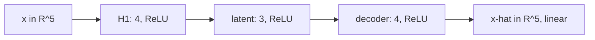
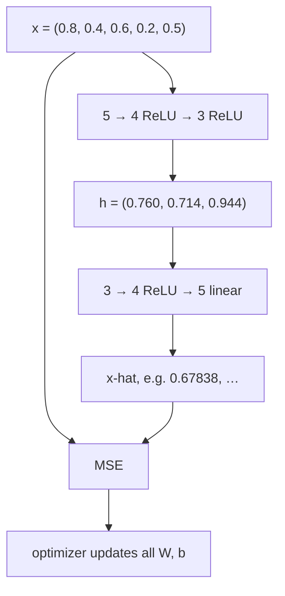
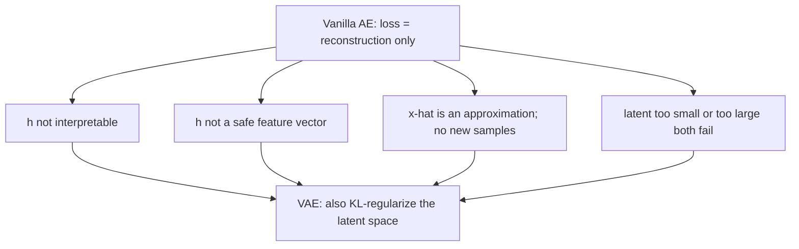

# L16: Numerical Example and Limitations of Autoencoders

**Video:** [Lec 16](https://www.youtube.com/watch?v=vvkdhI5ECHM) · 27:25  
**Instructor in this lecture:** Prof. Ashwini Kodipalli

### Learning objectives

- Run a fully connected AE **forward pass** with the lecture’s numbers: $5\to 4\to 3\to 4\to 5$.
- Use **ReLU** on hidden layers and **linear** + **MSE** on a continuous output.
- State what training does to weights/biases so $\hat{x}$ approaches $x$.
- List four **limitations** of AEs (uninterpretable $h$, weak downstream use, approximation not generation, latent-size trap).
- See why week 3 adds a **VAE** (KL regularizer on the latent space).

Last **theory** session of week 2. Next video is the hands-on (shallow / deep / convolutional AEs—not VAEs yet, despite one slip of the tongue at the end).

---

## Architecture for the numerical example

Five input features. Encoder: hidden **4**, then hidden **3** (latent). Decoder: hidden **4**, then output **5**.

$$
5 \;\xrightarrow{\text{ReLU}}\; 4 \;\xrightarrow{\text{ReLU}}\; 3
\;\xrightarrow{\text{ReLU}}\; 4 \;\xrightarrow{\text{linear}}\; 5
$$

Fully connected at every step: all inputs to a neuron, weighted sum **plus bias**, then activation.

---

## Input

$$
x = (0.8,\; 0.4,\; 0.6,\; 0.2,\; 0.5)
$$

Continuous values ⇒ last layer **linear**, loss **MSE**. Hidden layers: **ReLU**, $\mathrm{ReLU}(t)=\max(0,t)$.

---

## Encoder layer 1: $5 \to 4$

### Neuron 1 (weights spoken in full)

Weights into this unit: $0.2,\; 0.5,\; 0.4,\; 0.3,\; 0.1$. Bias $0.01$.

$$
\begin{aligned}
z_1 &= 0.8\cdot 0.2 + 0.4\cdot 0.5 + 0.6\cdot 0.4 + 0.2\cdot 0.3 + 0.5\cdot 0.1 + 0.01 \\
&= 0.16 + 0.20 + 0.24 + 0.06 + 0.05 + 0.01 \\
&= 0.72
\end{aligned}
$$

$$
a_1 = \max(0,\, 0.72) = 0.72
$$

### Neuron 2

Weights: $0.1,\; 0.3,\; 0.2,\; 0.6,\; 0.4$. Same pattern: $x$ dotted with those weights, plus bias, then ReLU.

$$
a_2 = \max(0,\, 0.65) = 0.65
$$

### Neurons 3 and 4

Same fully connected rule (five weights + bias each; the lecture fills the remaining two units on the slide). After ReLU the **four** hidden outputs are:

$$
(0.72,\; 0.65,\; 0.66,\; 0.77)
$$

Five features have been **compressed** to four. Nothing was deleted: every original coordinate reached every neuron.

---

## Encoder layer 2: $4 \to 3$ (latent)

Inputs to this layer are $(0.72,\; 0.65,\; 0.66,\; 0.77)$. Each of 3 neurons takes **four** weights + bias, then ReLU.

### First latent unit

Weights: $0.3,\; 0.5,\; 0.2,\; 0.1$.

$$
h_1 = \max\bigl(0,\; 0.760\bigr) = 0.760
$$

(The pre-activation $0.760$ is the weighted sum **plus bias** as written on the slide.)

### Remaining two latent units

Same calculation with two other weight rows. Spoken latent vector:

$$
h = (0.760,\; 0.714,\; 0.944)
$$

This **is** the latent code: $5\to 4\to 3$, still **compression**, not deletion. If a slide arithmetic disagrees, recompute as the instructor asked.

---

## Decoder layer 1: $3 \to 4$

Each of 4 neurons takes **three** weights + bias, ReLU (still a hidden layer).

First unit, weights $0.4,\; 0.2,\; 0.3$:

$$
0.760\cdot 0.4 + 0.714\cdot 0.2 + 0.944\cdot 0.3 + b
$$

ReLU of that pre-activation is spoken as **$0.74$**. The other three units follow the same template. Width is back to **4**, on the way to **5**.

---

## Output layer: $4 \to 5$, linear

Five output neurons, **four** weights + bias each. **Linear** activation $F(a)=a$: the displayed sum **is** the reconstructed coordinate (no extra squash). That is why the lecture sometimes omits drawing $F$.

First reconstructed coordinate (spoken):

$$
\hat{x}_1 = 0.67838
$$

Then four more linear outputs (slide). End-to-end:

$$
5 \to 4 \to 3 \to 4 \to 5
$$

Compare to the original:

| | $x_1$ | $x_2$ | $x_3$ | $x_4$ | $x_5$ |
|--|------:|------:|------:|------:|------:|
| Original $x$ | 0.8 | 0.4 | 0.6 | 0.2 | 0.5 |
| $\hat{x}$ (first coord. spoken) | 0.67838 | (slide) | (slide) | (slide) | (slide) |

Not equal yet—this is **one** forward pass with the **current** (untrained / mid-training) weights.

---

## MSE, then training

Five continuous coordinates ⇒ **mean squared error**. Average the five squared residuals:

$$
L = \frac{1}{5}\sum_{j=1}^{5} (x_j - \hat{x}_j)^2
$$

If $L$ is large, **backpropagate**. An **optimizer** updates **all** weights: $5\to 4$, $4\to 3$, $3\to 4$, $4\to 5$, and the biases.

After training you have **optimized** weights and biases. Then:

$$
x \;\times\; W^\star \;\to\; h^\star \;\times\; W^{\star}_{\text{dec}} \;\to\; \hat{x} \approx x
$$

A good $h^\star$ plus a good decoder gives small MSE: reconstruction **close** to the original.

### Activation / loss reminder

| $x$ type | Hidden act. | Output act. | Loss |
|----------|-------------|-------------|------|
| Continuous (this example) | ReLU | **Linear** | **MSE** |
| Binary $0/1$ | ReLU | **Sigmoid** | **BCE** |

(The lecture’s wording: the last layer **reconstructs**, it does not “generate” a new sample.)

---

## Limitations (all about $h$)

Reconstruction is entirely from the latent code. Four limits:

### 1. $h$ is not human-readable

Low MSE and a pretty $\hat{x}$ do **not** mean $h$ stores **meaningful** factors you can read off.

Handwritten digits: from $h$ you **cannot** tell “is this a **2** or a **9**?”, “thin vs thick stroke?”, “slanted or not?”. Reconstruction can look fine while $h$ still has **no** interpretable content.

### 2. Downstream tasks on $h$ fail

You cannot treat that $h$ as a ready feature vector for **classification, prediction, clustering, anomaly detection**. Low reconstruction error ≠ a code that is useful or human-interpretable for those jobs.

### 3. Approximation, not new samples

$\hat{x}$ is decoded from a **compressed** $h$, so it is always an **approximation** of $x$, not an exact copy. The model also does **not generate a new sample**—it reconstructs what it was given.

### 4. Latent **size** is a trap

| Latent size | What you see | Hidden problem |
|-------------|--------------|----------------|
| **Too small** | Too much compression, **information loss**, **poor** $\hat{x}$ (blurry / wrong) | Underfitting the structure |
| **Too large** | Low reconstruction error, $\hat{x}$ close to $x$ | Possible **copying** / identity map; **weak** feature learning. Example: 3 inputs, 5 hidden, 3 outputs—copy $x$ and pad **zeros** |

This is the undercomplete vs overcomplete lesson again, as a **limitation** of vanilla AEs.

---

## Bridge to variational autoencoders

The problems sit in the **latent space**. Week 3’s **VAE** regularizes $h$ by adding a **KL divergence** term to the loss (vanilla AE has reconstruction only). That KL is there to **control the latent space**. Full discussion starts next week.

Hands-on next: **shallow**, **deep**, and **convolutional** autoencoders (not VAEs).

### Key takeaways

- Worked net: $x=(0.8,0.4,0.6,0.2,0.5)$, $5\to 4\to 3\to 4\to 5$, ReLU hidden, linear out.
- Spoken checkpoints: $H_1=(0.72,0.65,0.66,0.77)$, $h=(0.760,0.714,0.944)$, $\hat{x}_1=0.67838$; then MSE and backprop.
- Low reconstruction error does **not** imply a meaningful or reusable $h$, and AEs **reconstruct** rather than sample new $x$.
- Tiny latent loses information; huge latent copies. VAEs add **KL on $h$** to fix the latent-space issues.

---
