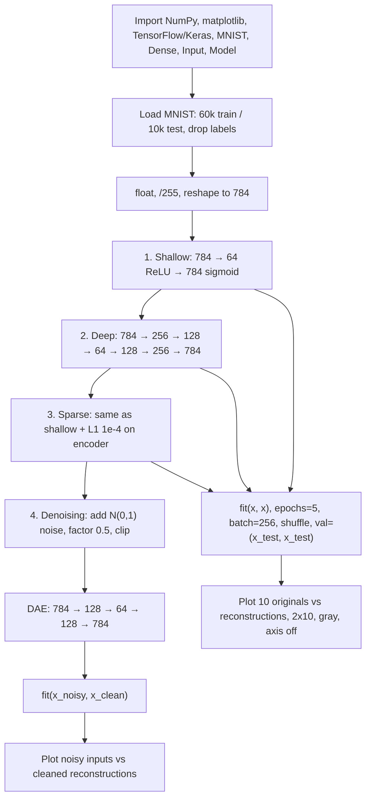

# L17: Practical Exercise 1 — Autoencoders

**Video:** [Lec 17](https://www.youtube.com/watch?v=5C95atwLrAM) · 35:59  

Week-2 AE hands-on #1. Implement **four** Keras models on **MNIST**: shallow (basic), deep, sparse (L1), and denoising (Gaussian noise).

### Learning objectives

- Load MNIST **without labels**, scale to $[0,1]$, flatten $28\times 28 \to 784$.
- Train a **shallow** AE $784\to 64\to 784$ (Adam, BCE) and read the parameter counts $50{,}240 + 50{,}960 = 101{,}200$.
- Train a **deep** AE $784\to 256\to 128\to 64\to 128\to 256\to 784$ and compare validation loss to the shallow net.
- Add **L1** ($10^{-4}$) for a **sparse** AE and see higher loss / worse reconstructions.
- Build a **DAE**: Gaussian noise with `noise_factor=0.5`, clip to $[0,1]$, train on noisy inputs vs clean targets.

### What this lecture is *not*

No contractive AE and no CNN AE in this notebook (those stay in the theory videos / a later lab). Labels are ignored: this is reconstruction, not classification.

---

## Exercise flowchart



Shared training knobs unless noted: **Adam**, **binary cross-entropy**, **5 epochs**, **batch size 256**, **shuffle=True**, validation = test set (encoder **and** decoder both need $x$, so `x` is passed **twice**).

---

## 1. Libraries

| Import | Role |
|--------|------|
| `numpy` as `np` | Arrays / numbers |
| `matplotlib.pyplot` as `plt` | Plots |
| `tensorflow` as `tf` | Deep-learning framework |
| `mnist` from `tensorflow.keras.datasets` | Handwritten digits **0–9** (10 classes in the dataset, unused as labels) |
| `Dense`, `Input` | Hidden/output dense layers; input size |
| `Model` | Functional API model |

---

## 2. Data: MNIST without labels

Autoencoders **reconstruct images**. Labels are discarded with `_`:

```text
(x_train, _), (x_test, _) = mnist.load_data()
```

| Split | Count | Native shape |
|-------|------:|--------------|
| Train | 60,000 | $28\times 28$ |
| Test | 10,000 | $28\times 28$ |

**Preprocess**

1. Cast to **float**.
2. **Normalize** by dividing by **255** (pixel levels $0$–$255$) so values lie in **$[0,1]$** (the lecture also mentions $[-1,1]$ as a possible scaling family; this notebook uses $0$–$1$). Scaling makes learning easier.
3. Same for the test set.
4. **Reshape** each image to a length-**784** vector ($28\times 28=784$) so `Dense` layers see a vector. Print shapes: `(60000, 784)` and `(10000, 784)`.

---

## 3. Shallow / basic autoencoder

One encoder dense layer, one decoder dense layer.

| Piece | Spec |
|-------|------|
| Input | `Input(shape=(784,))` → `input_image` |
| Encoder | `Dense(64, activation='relu')` on the input. **784 → 64** compression (also a storage win) |
| Decoder | `Dense(784, activation='sigmoid')` on the code. Sigmoid because pixels are in $[0,1]$ (two ends of the range) |
| Model | `Model(input_image, decoded)` |
| Optimizer / loss | **Adam** / **binary cross-entropy** |
| `fit` | `x_train, x_train` (input **and** reconstruction target). **epochs=5**, **batch_size=256**, `shuffle=True`, `validation_data=(x_test, x_test)` |

`x_train` appears twice because **both** encoder and decoder need the image (unlike a classifier, where you pass `x` once and `y` as labels).

**Why shuffle:** random order so the net does not memorize a serial pattern; helps generalization / reduces overfitting.

**Epoch** = one full pass over the training set (here 5). **Batch 256** = 256 samples per weight update (easier backprop than the full 60k).

### Parameter counts (spoken)

`Dense` params $= \text{(incoming dim)}\times\text{(units)} + \text{bias}$.

| Layer | Output shape | Parameters |
|-------|--------------|------------|
| Input | `(None, 784)` | **0** (no weights) |
| Dense 1 (encoder) | `(None, 64)` | $784\times 64 + 64 = \mathbf{50{,}240}$ |
| Dense 2 (decoder) | `(None, 784)` | $64\times 784 + 784 = \mathbf{50{,}960}$ |
| **Total trainable** | | **101,200** |

### Validation loss by epoch (shallow)

| Epoch | Val. loss (spoken) |
|------:|-------------------:|
| 1 | 0.16 |
| 2 | 0.12 |
| 3 | 0.10 |
| 4 | 0.09 |
| 5 | 0.09 |

Loss falls across epochs.

### Plots

- `decoded_imgs = autoencoder.predict(x_test)`
- `n = 10` images
- `plt.figure(figsize=(20, 4))` — width 20, height 4
- Two rows × 10 columns: **row 1 original** `x_test`, **row 2 reconstruction**
- Reshape each vector back to **$28\times 28$**, `cmap='gray'`, `axis('off')`

**What to observe:** reconstructions are almost the right digits, with a little **blur** after only 5 epochs.

---

## 4. Deep autoencoder

Several encoder layers **and** matching decoder layers (one decode stage per encode stage).

$$
784 \xrightarrow{\text{ReLU}} 256 \xrightarrow{\text{ReLU}} 128 \xrightarrow{\text{ReLU}} 64
\xrightarrow{\text{ReLU}} 128 \xrightarrow{\text{ReLU}} 256 \xrightarrow{\text{sigmoid}} 784
$$

Only the **last** dense layer is sigmoid (pixels in $[0,1]$). Compile: Adam + BCE. Same `fit` signature as the shallow net.

### Parameter counts (spoken)

Formula unchanged: incoming $\times$ units $+$ bias. Input layer still 0 params.

| Dense stage (as listed) | Parameters |
|-------------------------|------------|
| after 784 | **209,960** |
| next | **32,896** |
| next | **8,256** |
| next | **8,320** |
| next | **33,024** |
| last (→ 784) | **201,488** |
| **Total** | **484,944** |

### Validation loss (deep)

Spoken sequence: **0.13**, then **0.10**, **0.1029**, **0.0968** (caption also sounds like 0.00968—treat as **0.0968** on the 0.1 scale of the other epochs), **0.0937**. Still decreasing.

Compare to shallow’s final **0.09**: deep ends near **0.093**. The lecture’s take: this deeper stack did **not** clearly win on loss in 5 epochs; reconstructions are plotted the same $2\times 10$ way.

---

## 5. Sparse autoencoder (L1)

Shallow-shaped net **plus** L1 on the encoder. Import `regularizers` from Keras.

| Piece | Spec |
|-------|------|
| Encoder | `Dense(64, activation='relu', activity_regularizer=L1(1e-4))` on 784-D input |
| Decoder | `Dense(784, activation='sigmoid')` |
| L1 strength | $10^{-4}$ (could be $10^{-1},10^{-2},10^{-3}$ by trial) |
| Params | Same as shallow: **0 + 50,240 + 50,960 = 101,200** |
| Train | Same Adam / BCE / 5 epochs / batch 256 / `(x_test, x_test)` val |

### Validation loss (sparse)

**0.6, 0.5, 0.5, 0.46, 0.43** — **higher** than shallow/deep.

**Why (as taught in the lab):** regularization **generalizes** by not fitting every sample. L1 adds $\lambda \sum |w|$ on the weights (spoken: $\lambda$ times absolute weights; 60,000 / 256 ≈ **234** batches). Sparsity means you are not using all 784 dimensions freely—activity is pushed through **64** units. Less memorization ⇒ **higher** reconstruction loss.

**What to observe:** many reconstructions **fail**; this run looks **worse** than shallow and deep. The lab’s conclusion: not the strongest reconstructor of the four **in this setup**.

---

## 6. Denoising autoencoder

Generalize by **adding noise** to MNIST, then reconstructing the **clean** image.

### Noise model

- **Gaussian / normal** noise, mean **0**, standard deviation **1**
- `noise_factor = 0.5` (range $[0,1]$: **0** = almost no noise, **1** = very heavy; **0.5** = moderate)

```text
x_train_noisy = x_train + noise_factor * np.random.normal(loc=0.0, scale=1.0, size=x_train.shape)
x_test_noisy  = x_test  + noise_factor * np.random.normal(loc=0.0, scale=1.0, size=x_test.shape)
```

`loc=0` → mean 0; `scale=1` → std 1; `size` matches the original array (do not change length).

**Clip** both noisy arrays to **$[0,1]$**: values $<0$ become 0, values $>1$ become 1, values already in $[0,1]$ stay. Avoids wild negatives / positives.

### Architecture

Two encode stages, two decode stages:

$$
784 \xrightarrow{\text{ReLU}} 128 \xrightarrow{\text{ReLU}} 64
\xrightarrow{\text{ReLU}} 128 \xrightarrow{\text{sigmoid}} 784
$$

Adam + BCE.

### `fit` targets

Train on **noisy inputs**, **clean** targets:

```text
fit(x_train_noisy, x_train, ..., validation_data=(x_test_noisy, x_test))
```

That is the DAE rule from L13: do not learn $\tilde{x}\mapsto\tilde{x}$.

### Validation loss (DAE)

**0.18, 0.15, 0.14, …, 0.13**. More epochs would likely push it down further. Because the model is **regularized by noise**, you **trade** some loss for generalization.

### Plots

Same $2\times 10$, gray, axes off. **Top:** noisy digits. **Bottom:** reconstructions.

**What to observe:** outputs are a bit **blurred**, but the **noise is gone**—a usable clean digit even though the input was corrupted.

---

## Side-by-side (this notebook)

| Model | Widths | Extra | Final val. loss (spoken) | Look at |
|-------|--------|-------|---------------------------|---------|
| Shallow | $784\to 64\to 784$ | — | $\approx 0.09$ | Slight blur, digits OK |
| Deep | $784\to 256\to 128\to 64\to \cdots\to 784$ | more layers, **484,944** params | $\approx 0.093$ | Similar; not clearly better in 5 epochs |
| Sparse | $784\to 64\to 784$ | **L1** $10^{-4}$ | $\approx 0.43$ | Many failed reconstructions |
| Denoising | $784\to 128\to 64\to 128\to 784$ | Gaussian, factor **0.5**, clip $[0,1]$ | $\approx 0.13$ | Noise removed, mild blur |

All four share: MNIST flattened, $[0,1]$ pixels, sigmoid + BCE, Adam, 5 epochs, batch 256.

### Key takeaways

- Drop MNIST labels; reconstruct `x` from `x` (or from `x_noisy` in the DAE).
- Shallow $64$-D bottleneck: **101,200** weights; val. loss down to $\sim 0.09$ in 5 epochs.
- Deep has **484,944** weights; here it does not beat shallow on val. loss in 5 epochs.
- Sparse L1 ($10^{-4}$) **raises** loss ($\sim 0.43$) and hurts visual reconstructions in this run.
- DAE: `noise_factor=0.5` Gaussian, clip $[0,1]$, train `(noisy, clean)`; recovers a clean digit from a noisy one.

---
