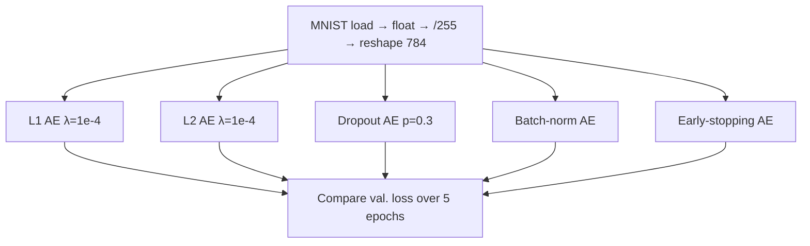

# L18: Practical exercise 2 — regularizing an autoencoder

**Video:** [Lec 18](https://www.youtube.com/watch?v=sSDaKISydCA) · 23:02

### Learning objectives

- Implement five regularization methods on the same MNIST autoencoder: **L1**, **L2**, **dropout**, **batch normalization**, and **early stopping**.
- State what each method does to weights or connections (absolute vs squared penalty, dropped edges, per-batch scaling, patience).
- Train with the lecture’s optimizer, loss, epochs, and batch size, and compare **validation losses**.
- Read the lecture’s ranking: L2 beats L1; among all five runs, **early stopping** is called the best.

This video is a **week-2 autoencoder lab**, not a VAE. There is no KL term and no sampling of $z$.

---

## What this session implements

The hands-on goal is to regularize an autoencoder so it **generalizes** and does **cleaner feature extraction**, then compare validation losses with each other and with the **previous (unregularized) session**.

Five techniques, in order:

1. L1 regularization  
2. L2 regularization  
3. Dropout  
4. Batch normalization  
5. Early stopping  



---

## 1. Libraries

| Import | Role in the notebook |
|--------|----------------------|
| `numpy` as `np` | Arrays |
| `matplotlib.pyplot` as `plt` | Plots (available; this session is mostly loss numbers) |
| `tensorflow` | Neural nets |
| `tensorflow.keras.datasets.mnist` | Handwritten digits **0–9** (10 classes) |
| `*` from TensorFlow / Keras | Pull in layers and model helpers in one go |
| Keras `models` | Build the autoencoder |
| Regularizers **L1, L2**; **Dropout**; **BatchNormalization**; **EarlyStopping** | The five techniques |

---

## 2. Dataset, dtype, normalize, reshape

1. Load MNIST into a **train** split and a **test** split.  
2. Cast pixels to **float** (needed for the network arithmetic).  
3. **Normalize** train and test by dividing by **255** so intensities lie in $[0,1]$.  
4. **Reshape** both to `(-1, 784)`. The lecture’s language: `-1` (or `_`) **drops the label**. An autoencoder is unsupervised: **784** pixel features only, no class target.

---

## Shared training recipe (every model unless noted)

| Choice | Value | Why the lecture uses it |
|--------|-------|-------------------------|
| Input size | 784 | Flattened MNIST |
| Output activation | **Sigmoid** | Pixels already in $[0,1]$ |
| Optimizer | **Adam** | Default for these labs |
| Loss | **Binary cross-entropy** | Matches normalized 0–1 pixels |
| Fit targets | `(x_train, x_train)` | Reconstruct the input (encoder *and* decoder see $x$) |
| Epochs | **5** | Short comparison run |
| Batch size | **256** | Weights update **per batch**, not once per epoch |
| Validation | `(x_test, x_test)` | Same reconstruct-the-input pairing |

Batch size is treated as a training choice (alongside SGD vs full-batch): **256** means the encoder/decoder weights move after each mini-batch, which the lecture says helps learning.

---

## 3. L1 regularization

**Penalty the lecture writes:** $\lambda$ times the **absolute** weights,

$$
\lambda \sum_i |w_i|
$$

with $\lambda = 10^{-4}$. $w_i$ are the weights in the current batch. Large $|w|$ is taxed, so **unimportant connections shrink** and the net keeps **features that actually help reconstruction**.

### Architecture

| Piece | Spec |
|-------|------|
| Input | 784 |
| Encoder dense | **128**, **ReLU**, `kernel_regularizer=L1(1e-4)` |
| Decoder dense | **784**, **sigmoid** |
| Compile | Adam + BCE |
| Fit | 5 epochs, batch 256, validate on `x_test` |

### Validation loss by epoch (spoken)

| Epoch | Val. loss |
|------:|----------:|
| 1 | 0.61 |
| 2 | 0.55 |
| 3 | 0.50 |
| 4 | 0.46 |
| 5 | **0.43** |

Loss falls every epoch; L1 is already helping, but later methods go lower.

---

## 4. L2 regularization

**Penalty:** $\lambda$ times **squared** weights,

$$
\lambda \sum_i w_i^2
$$

Same $\lambda = 10^{-4}$. Squaring still down-weights large $w_i$. The lecture’s picture: multiplying a **tiny** $\lambda$ into the weights **reduces the influence of some neurons** (features), which *is* feature extraction.

You may try $10^{-1}$, $10^{-2}$, $10^{-3}$ as well; smaller $\lambda$ deactivates less.

### Architecture

Same skeleton as L1: **784 → 128 ReLU (L2 $10^{-4}$) → 784 sigmoid**, Adam, BCE, 5 epochs, batch 256, `(x_train, x_train)` / `(x_test, x_test)`.

### Validation loss (spoken)

| Epoch | Val. loss |
|------:|----------:|
| 1 | 0.15 |
| 2 | 0.12 |
| … | keeps falling |
| last | **0.09** |

### L1 vs L2 (lecture comparison)

| Regularizer | Last-epoch val. loss |
|-------------|----------------------|
| L1 | 0.43 |
| L2 | **0.09** |

**Claim in the lecture:** L2 is **better than L1** here. Squaring the weights and scaling by $\lambda$ leaves **only the important features**, which yields a **cleaner reconstruction**.

---

## 5. Dropout

### Intuition (two hidden layers of five neurons)

Without dropout the graph is **fully connected**: neuron 1 in layer 1 always talks to every neuron in layer 2, on **every** batch. Those pairs **memorize training patterns**, so reconstructions on **train** look sharp, but **unseen test** digits are not reconstructed well — the model never had to **generalize**.

Dropout **cuts some edges** each time (lecture sketch: drop 1→3, drop 2→2, drop 3→2, …). Associations that were always “neuron $i$ with neuron $j$” cannot memorize the training set. **Specification is lost; generalization is gained.**

### Architecture (this run is deeper than L1/L2)

| Piece | Spec |
|-------|------|
| Input | 784 |
| Dense | **256**, ReLU |
| Dropout | **0.3** (drop **30%** of connections) |
| Dense | **128**, ReLU |
| Dropout | **0.3** again |
| Dense | **784**, sigmoid (output; lecture: two-class / 0–1 pixels) |
| Compile / fit | Adam, BCE, 5 epochs, batch 256, validate on `x_test` |

### Validation loss (spoken)

0.14 → 0.1 → 0.1 → 0.1 → **0.1042**. Gradual decrease.

---

## 6. Batch normalization

**Formula written on the board:** for a pixel / activation $x$,

$$
x_{\text{norm}} = \frac{x - \mu}{\sigma}
$$

After this, values sit on a **bell curve** (mean near 0, std near 1) and can be scaled into a tight range such as $[0,1]$ or $[-1,1]$. A raw intensity **255** can become **1**; a negative can be pulled toward **0**. The network spends **less effort** learning scale, which the lecture counts as **generalization**.

### Architecture

| Piece | Spec |
|-------|------|
| Input | 784 |
| Dense **256** → **BatchNorm** → **ReLU** | encoder side |
| Dense **128** → **BatchNorm** → **ReLU** | decoder hidden |
| Dense **784**, sigmoid | output |
| Compile / fit | Adam, BCE, 5 epochs, batch 256, `(x_train, x_train)`, val `(x_test, x_test)` |

### Validation loss (spoken)

First epoch already **0.13**, then down to **0.08**.

**Claim vs L1 / L2 / dropout:** this **0.08** is the **smallest** of those four. Batch norm is called a **very good** regularizer **compared with the three above**.

---

## 7. Early stopping

**Idea:** if **validation loss stops falling** (or accuracy stops rising), **stop**. Do not burn extra epochs. The user chooses a **patience**: maybe **2** epochs with no improvement, or **5**.

### Keras callback (three arguments spoken)

```text
EarlyStopping(
    monitor="val_loss",   # they trained on loss, so monitor validation loss
    patience=2,           # stop if val_loss does not drop for 2 epochs
    restore_best_weights=True
)
```

**Restore best weights:** keep the checkpoint from the **best** validation loss so later forward passes use those weights, not the last (possibly worse) step.

### Architecture

**784 → 256 ReLU → 128 ReLU → 784 sigmoid**, Adam, BCE, fit on `(x_train, x_train)`.

### Validation loss on this 5-epoch run (spoken)

| Epoch | Val. loss |
|------:|----------:|
| 1 | 0.11 |
| 2 | 0.09 |
| 3 | 0.08 |
| 4 | 0.0799 |
| 5 | **0.0722** |

**Early stopping did not fire** in five epochs: loss was still dropping, so there were never two flat epochs. The lecture’s saturation picture: if epoch 4, 5, and 6 all sat at **0.0799**, training would **stop** after patience **2**. With **10 / 20 / 50** epochs, that plateau would likely appear.

---

## Comparison the lecture actually states

| Method | Architecture (encoder → … → 784) | Last val. loss (spoken) | Lecture verdict |
|--------|----------------------------------|-------------------------|-----------------|
| L1, $\lambda=10^{-4}$ | 128 ReLU + L1 | 0.43 | Worse than L2 |
| L2, $\lambda=10^{-4}$ | 128 ReLU + L2 | 0.09 | **Better than L1** (square the weights) |
| Dropout 0.3 | 256 → drop → 128 → drop | 0.1042 | Regularizes by cutting edges |
| Batch norm | 256 BN ReLU → 128 BN ReLU | 0.08 | Best of the **first four** |
| Early stopping | 256 → 128, patience 2 | **0.0722** | **Best of all five** in the closing recap |

L2 beats L1 because the penalty uses $w_i^2$. After all five, the speaker ranks **early stopping** first on this notebook (lowest spoken val. loss, **0.0722**).


### Key takeaways

- Same data recipe every time: MNIST, float, $/255$, shape `(-1, 784)`, **Adam + BCE**, reconstruct `x` from `x`, **5 × batch 256**.
- L1 taxes $|w|$; L2 taxes $w^2$; both at $\lambda=10^{-4}$ on a **128**-unit bottleneck. L2’s last val. loss **0.09** beats L1’s **0.43**.
- Dropout **0.3** after 256 and after 128 stops co-adaptation so test reconstructions generalize.
- Batch norm uses $(x-\mu)/\sigma$ and reached **0.08** in this run.
- Early stopping **monitors `val_loss`**, **patience 2**, **restores best weights**; here loss still fell to **0.0722** in five epochs, so the callback never clipped training.

---
