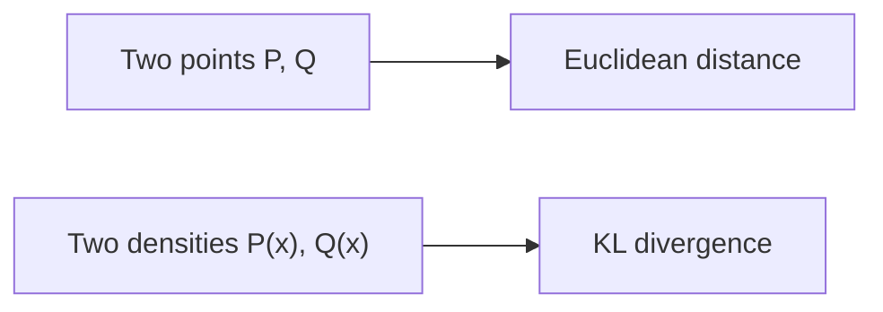
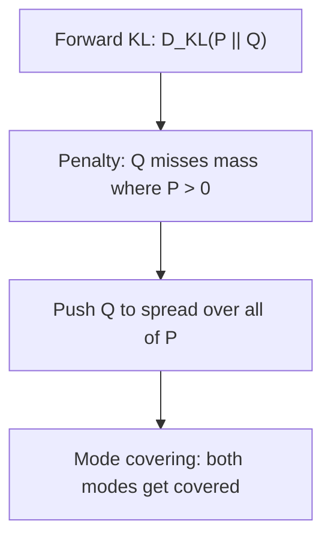
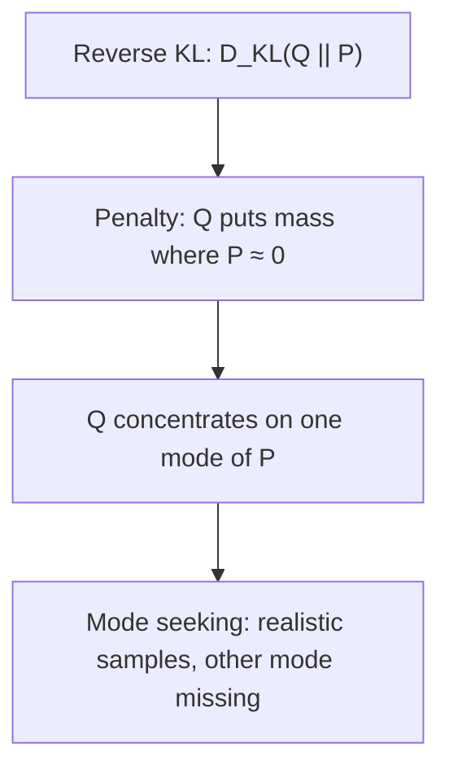
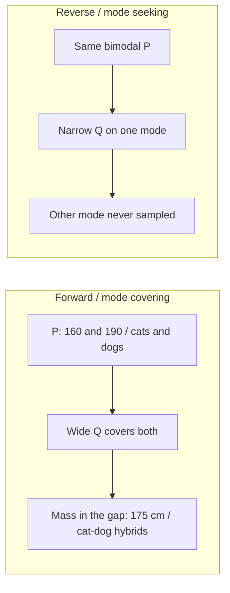

# L19: Intuition behind KL divergence — Part A

**Video:** [Lec 19](https://www.youtube.com/watch?v=-1T2LLNIggw) · 39:47  
**Instructor in this lecture:** Prof. Ashwini Kodipalli

### Learning objectives

- Say why **KL divergence** exists: Euclidean distance is for **points**; KL is for **probability distributions** $P(x)$ vs $Q(x)$ (discrete or continuous).
- Read the three overlap pictures: identical → KL $=0$; nearby means → small KL; far apart → large KL.
- Write **forward** $D_{\mathrm{KL}}(P \,\|\, Q)$ and **reverse** $D_{\mathrm{KL}}(Q \,\|\, P)$ for sums and integrals.
- Match **forward = mode covering** and **reverse = mode seeking** on the height (160 / 190 cm) and cats-vs-dogs examples.

Part B (next video) does **self-information, entropy, cross-entropy**, and the **derivation** of the KL formula. This video is definitions, directions, and pictures only.

---

## Week 3 map (as stated)

Week 2 was autoencoders. Week 3 is **variational autoencoders**, theory only — **no VAE lab this week**; that is **week 4, first session**.

| Topic this week | Where |
|-----------------|-------|
| Intuition behind KL | This lecture + Part B |
| VAE architecture | Encoder, **latent space**, decoder (later videos) |
| ELBO | Evidence lower bound (later) |
| VAE loss | **Reconstruction** + **KL** |
| Reparameterization trick | Later |
| Numerical example | End of the week |

**Today only:** basic KL, **two directions** (forward / reverse), **two behaviours** (mode covering / mode seeking).

---

## Why KL: points vs distributions

Two points $P$ and $Q$ in 2-D: distance is easy; one tool is **Euclidean distance**.

If $P$ and $Q$ are no longer points but **distributions** $P(x)$ and $Q(x)$, the question is: **how different is $P$ from $Q$** (or $Q$ from $P$)? That difference is **Kullback–Leibler (KL) divergence**.

KL applies to **discrete** or **continuous** distributions. That is the whole motivation slide.

---

## Definition (lecture wording)

KL measures how a distribution **$Q(x)$** differs from a **reference** distribution **$P(x)$**.

$P$ is the reference (later: **true data**). $Q$ is the other distribution (later: **what the model learned**).

### Three pictures

| Case | Overlap | KL |
|------|---------|----|
| $P$ and $Q$ **identical** (blue $P$, red $Q$ stacked) | Complete | **$0$** |
| Nearby means, **good but not perfect** overlap | Partial | **Small** |
| Means far, **almost no overlap** | Little | **Large** |

KL is not “a distance you can draw with a ruler”; it is a **mismatch score** that is zero only when the two densities match.

---

## Forward KL

### Discrete

$$
D_{\mathrm{KL}}(P \,\|\, Q) = \sum_x P(x)\,\log\frac{P(x)}{Q(x)}
$$

(The **why** of this formula is Part B. Here we only name terms.)

### Continuous

$$
D_{\mathrm{KL}}(P \,\|\, Q) = \int P(x)\,\log\frac{P(x)}{Q(x)}\,dx
$$

### What it punishes

On the slide (black $P$, red $Q$): there is a region where **$P(x)>0$** but **$Q(x)=0$** (or $\approx 0$). $Q$ **failed to cover** mass that $P$ actually has.

- Forward KL **strongly penalizes $Q$** for missing regions of $P$.
- If $Q=0$ in the log ratio, $P/Q$ **blows up** → forward KL is **huge** → the learner is forced to react.

### What $Q$ then does: spread out (mode covering)

The fix forward KL “wants”: **push $Q$ to spread** until it covers the **entire support of $P$**.

If $P$ is **bimodal** and a narrow $Q$ sits on only one bump, spreading $Q$ makes a **wide** density that covers **both** modes. That is **mode covering**. A side effect appears in the examples below (mass in the **gap**).

---

## Reverse KL

Notation in the lecture: reverse is **$Q$ then $P$**, i.e. $D_{\mathrm{KL}}(Q \,\|\, P)$.

### Discrete

$$
D_{\mathrm{KL}}(Q \,\|\, P) = \sum_x Q(x)\,\log\frac{Q(x)}{P(x)}
$$

### Continuous

$$
D_{\mathrm{KL}}(Q \,\|\, P) = \int Q(x)\,\log\frac{Q(x)}{P(x)}\,dx
$$

### What it punishes

Now $Q$ has leaked into a region where **$P$ has no mass** (or almost none). $P$ is the **true / given** data distribution. Mass that $Q$ puts there is **not in the real data**.

- If $P\approx 0$ in the denominator, reverse KL is **large**.
- Reverse KL **punishes $Q$ for placing probability where $P$ is empty**.

### Multimodal $P$: sit on one mode (mode seeking)

With **two modes**, a reverse-KL $Q$ often **locks onto one bump** and **ignores the other**. That is **mode seeking**: sharp, realistic samples **from the chosen mode only**.

---

## $P(x)$ vs $Q_\theta(x)$ on a real table

Any problem gives you a **dataset**. The running table has **two features**. The job of a generative model is to **emit new rows**, which first requires learning the **unknown true density**.

### How the lecture draws $P(x)$

1. Take **feature 1** values.  
2. Split the range into **bins**.  
3. **Count** how many samples fall in each bin.  
4. Histogram: $x$-axis = feature-1 range, $y$-axis = **frequency**.  
5. Repeat for **feature 2**.

The screenshot on the left is only a **few rows**; the full set is large (e.g. you may not see a “4” in the screenshot even if that bin exists in the full data).

Those histograms **are** the true distribution, called **$P(x)$**. Samples were drawn from this unknown $P$. The **model is not told** the shape (perfect bell vs wiggles).

### What a VAE (any generative net) actually learns

Training sees only a **finite** set of samples, so it cannot recover $P$ exactly. It learns an **approximation** $Q_\theta(x)$, where **$\theta$** = network **weights and biases**.

**Goal:** $Q_\theta$ as close as possible to $P$. Then **samples from $Q_\theta$** look like real data.

At the start of training $P$ and $Q_\theta$ differ; mismatch is **quantified by KL**, either forward ($P$ from $Q$) or reverse.

### Two failure pictures (blue = $P$, dotted red = $Q$)

| Picture | What you see on the $x$-axis | Name |
|---------|------------------------------|------|
| $P$ still has mass, $Q$ has already gone to **0** | Model **missed** real data | **Forward KL** situation |
| $Q$ has mass where **$P$ is empty** | Model will emit **unrealistic** extras | **Reverse KL** situation |

### Why we never hand $P$ to the model

If the true density were given, generation would copy it with **no variation**. We **let the net learn** an approximation from **few training points** so new samples are **variants** of the real data, not clones. The approximation should still **sit close** to $P$ — that closeness is KL.

---

## Example 1 — heights (mode covering vs mode seeking)

Dataset of people:

| Group | Height | Role on the plot |
|-------|--------|------------------|
| Short cluster | **160 cm** | Mode A |
| Tall cluster | **190 cm** | Mode B |
| Very few people | **175 cm** | Low-density gap |

Two clear clusters; almost nobody in between.

### Forward KL = mode covering

Forward KL **forces $Q$ to cover both modes**. A **single Gaussian** $Q$ becomes **so broad** that it sits over 160 **and** 190.

- **Good:** both groups are represented.  
- **Bad:** the **peak of that wide Gaussian sits near 175**. The model then **samples 175 cm a lot**, even though the data almost never has that height. Those in-between people are **unrealistic** relative to the true density.

### Reverse KL = mode seeking

$Q$ **locks onto one mode** — either the 160 cluster **or** the 190 cluster.

| If $Q$ covers… | Samples look like | Misses |
|----------------|-------------------|--------|
| Cluster A (160) | Short people, **realistic** | All tall people |
| Cluster B (190) | Tall people, **realistic** | All short people |

**Advantage:** draws from the chosen mode are **on-data**. **Disadvantage:** the **other valid group never appears**.

---

## Example 2 — cats and dogs

Training images: **cats** and **dogs**. Task: generate **animal** images (new cats or dogs).

### Forward KL (cover both modes)

$Q$ is again **broad** enough to cover **both** class clouds. The **high-density region of $Q$ is in the middle**, where the data has **no** true animals. Samples become **hybrids**: a cat that, as you move along the row, picks up **dog features** — **unrealistic in-between** images.

**Punchline:** mode covering **hits every mode** but can emit **unrealistic interpolations**.

### Reverse KL (mode seeking)

$Q$ learns **cats well** *or* **dogs well**, not both.

- Generate cats → **dogs missing**.  
- Generate dogs → **cats missing**.

**Punchline:** mode seeking gives **sharp, realistic** samples **from one mode**; the other mode is **gone**.

---

## Forward vs reverse (cheat sheet)

| | Forward $D_{\mathrm{KL}}(P \,\|\, Q)$ | Reverse $D_{\mathrm{KL}}(Q \,\|\, P)$ |
|--|--------------------------------------|----------------------------------------|
| Discrete | $\sum P\log(P/Q)$ | $\sum Q\log(Q/P)$ |
| Continuous | $\int P\log(P/Q)\,dx$ | $\int Q\log(Q/P)\,dx$ |
| Penalty | $Q$ **misses** mass of $P$ | $Q$ **invents** mass where $P$ is empty |
| Multimodal behaviour | **Mode covering** (spread $Q$) | **Mode seeking** (one mode) |
| Typical artefact | Unrealistic **in-between** samples | **Missing** the other real cluster |

### Key takeaways

- KL replaces Euclidean distance when $P$ and $Q$ are **densities**, discrete or continuous.
- Identical densities → KL **0**; slight mismatch → **small**; far means → **large**.
- **Forward** KL makes $Q$ **cover** $P$ (risk: gap samples). **Reverse** KL makes $Q$ **seek one mode** (risk: drop the other mode).
- In a VAE, $P$ is the unknown data distribution and $Q_\theta$ is the learned approximation; KL is how we **score** the mismatch. The algebraic identity is the **next** lecture.

---
