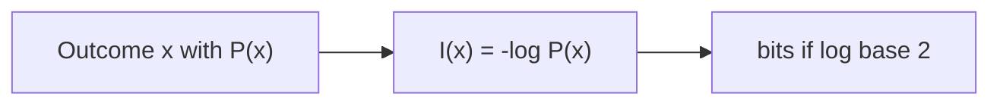
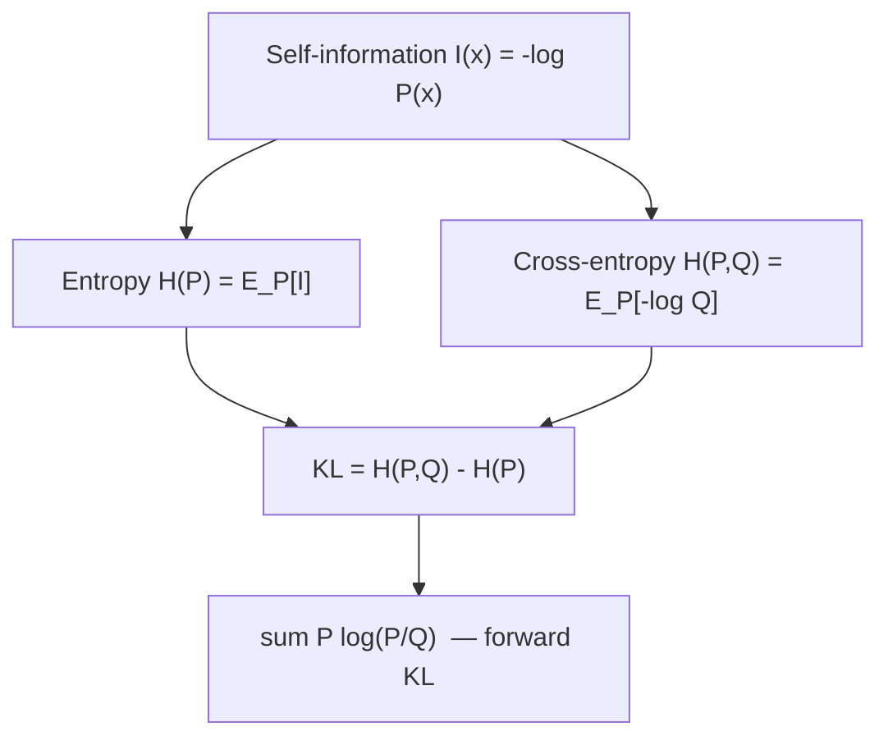

# L20: Intuition behind KL divergence — Part B

**Video:** [Lec 20](https://www.youtube.com/watch?v=5-O3uduPc8A) · 28:03  
**Instructor in this lecture:** Prof. Ashwini Kodipalli

### Learning objectives

- Define **self-information** $I(x)=-\log P(x)$ as surprise of **one** outcome, with the weather numbers in **bits**.
- Define **entropy** $H(P)$ as the **average** surprise of a whole distribution (one number for uncertainty).
- Define **cross-entropy** $H(P,Q)$ as surprise of the **true** outcome under the **model’s** $Q$.
- Derive **forward KL** as the lecture did: $D_{\mathrm{KL}}(P \,\|\, Q)=H(P,Q)-H(P)$, down to $\sum P\log(P/Q)$.

Watch Part A first. This video **finishes KL**. VAE architecture starts next.

---

## Running example: tomorrow’s weather

Two outcomes: **sunny** or **rainy**. The trained model’s predictive distribution (used in every numerical slide):

| Outcome $x$ | $P(x)$ | Spoken percent |
|-------------|--------|----------------|
| Sunny | **0.875** | 87.5% (also said “around 87% / 90%”) |
| Rainy | **0.125** | 12.5% |

---

## Self-information (surprise of one outcome)

**If tomorrow is sunny:** you are **not** surprised. The model already assigned **0.875**.  
**If tomorrow is rainy:** you **are** surprised. Rain was **unlikely**.

Self-information of an outcome $x$ with probability $P(x)$:

$$
I(x) = \log \frac{1}{P(x)} = -\log P(x)
$$

($\log(1/a)=-\log a$.)

| $P(x)$ | $I(x)$ | Reading |
|--------|--------|---------|
| Large (sunny happened, as predicted) | **Small** | Little surprise |
| Small (rain happened) | **Large** | Much surprise |

$I$ and $P$ are **inversely** related, which is why $1/P(x)$ appears.

### Why a logarithm?

For **independent** events, $P(AB)=P(A)P(B)$. A log turns the **product into a sum**: $\log(AB)=\log A+\log B$. That is the lecture’s reason for $\log$.

**Base 2** → unit is **bits**.

### Weather numbers (base 2)

$$
I(\text{sunny}) = -\log_2(0.875) = 0.193 \text{ bits}
$$

$$
I(\text{rainy}) = -\log_2(0.125) = 3 \text{ bits}
$$

Rain carries **more** self-information because it is **less likely**. Self-information is always about **one** realized outcome.

---

## Entropy (uncertainty of the whole distribution)

Before tomorrow arrives, **either** sunny **or** rainy can occur. There is **uncertainty**. Entropy folds **every** outcome’s surprise into **one average**.

Self-information: **one** observed $x$.  
Entropy: **one number** for the **entire** $P$.

$$
H(P) = \sum_x P(x)\,I(x) = \sum_x P(x)\big(-\log P(x)\big) = -\sum_x P(x)\log P(x)
$$

Equivalently without a leading minus:

$$
H(P) = \sum_x P(x)\,\log\frac{1}{P(x)}
$$

### Plug in the weather $P$

Two terms, sunny and rainy:

$$
H(P) = 0.875\cdot I(\text{sunny}) + 0.125\cdot I(\text{rainy}) = 0.544 \text{ bits}
$$

(Using the $0.193$ and $3$ from above: $0.875\times 0.193 + 0.125\times 3 \approx 0.544$.)

**Low entropy (0.544):** one outcome is **much more likely** than the other (87.5% vs 12.5%). The situation is **relatively predictable**.

### Two other $P$’s the lecture compares

| Model’s $(P_{\text{sun}}, P_{\text{rain}})$ | $H(P)$ | Meaning |
|---------------------------------------------|--------|---------|
| $(0.875,\ 0.125)$ | **0.544** (low) | One event dominates |
| $(0.5,\ 0.5)$ | **1** (maximum for two outcomes, bits) | Coin toss: **maximum uncertainty**, result unpredictable |
| $(0,\ 1)$ or $(1,\ 0)$ | **0** | **No** uncertainty: weather is fully determined |

Entropy = **before you see the outcome**, how uncertain is the **whole** experiment: multiply each outcome’s surprise by its probability and **add**.

---

## Cross-entropy (true $P$ vs model $Q$)

Now there is a **target** (true) distribution $P$ and a **predicted** distribution $Q$.

**Actual outcome = sunny** → one-hot target

$$
P = (1,\ 0)
$$

(sunny gets 1, rainy gets 0). The model still outputs $Q=(0.875,\ 0.125)$.

Cross-entropy $H(P,Q)$ mixes **$P$’s mass** with **surprise under $Q$**:

$$
H(P,Q) = -\sum_x P(x)\,\log Q(x) = \sum_x P(x)\,I_Q(x)
$$

where $I_Q(x)=-\log Q(x)$ is surprise if you score the outcome with the **model**.

### Case 1 — model agrees with the truth

$P=(1,0)$, $Q=(0.875,0.125)$:

$$
H(P,Q) = -\,1\cdot\log_2(0.875) - 0\cdot\log_2(0.125) = 0.193
$$

(The lecture also says **0.195** while writing the same substitution; the log calculation is **0.193 bits**, same as $I(\text{sunny})$ under $Q$.)

**Small** cross-entropy: the model put **high** $Q$ on the **correct** class.

### Case 2 — model is confident in the wrong class

Truth is still sunny, $P=(1,0)$, but $Q$ now puts only **0.125** on sunny (the rest on rain). Only the sunny term survives:

$$
H(P,Q) = -\log_2(0.125) = 3
$$

**Large** cross-entropy: the model assigned **low** probability to the **correct** class → **large loss**.

| $Q$ on the true class | $H(P,Q)$ | Lecture reading |
|-----------------------|----------|-----------------|
| High (0.875 on sunny) | **0.193** (small) | Model matches the answer |
| Low (0.125 on sunny) | **3** (large) | Model missed the correct class |

**Definition as stated:** cross-entropy measures how well predicted $Q$ **matches** target $P$. It is “how **surprised the model is** about the **correct** answer.”

$P(x)$ = true probability of $x$; $-\log Q(x)$ = surprise the **model** assigns to that $x$. Combining them is $H(P,Q)$.

You can also write

$$
H(P,Q) = \sum_x P(x)\,\log\frac{1}{Q(x)}
$$

This is the bridge the lecture flags: KL will look like $P\log(P/Q)$.

---

## Derivation of (forward) KL — exactly the board work

Ingredients: cross-entropy and entropy (both built from self-information).

$$
D_{\mathrm{KL}}(P \,\|\, Q) = H(P,Q) - H(P)
$$

Substitute the sums (discrete, as on the slide):

$$
H(P,Q) = -\sum_x P(x)\log Q(x),\qquad
H(P) = -\sum_x P(x)\log P(x)
$$

Then

$$
H(P,Q)-H(P)
= -\sum_x P(x)\log Q(x) \;-\; \Big(-\sum_x P(x)\log P(x)\Big)
$$

Minus of minus is plus:

$$
= -\sum_x P(x)\log Q(x) + \sum_x P(x)\log P(x)
$$

**Rearrange** so the **positive** $\log P$ term is written first:

$$
= \sum_x P(x)\log P(x) - \sum_x P(x)\log Q(x)
$$

**Factor** the common $P(x)$:

$$
= \sum_x P(x)\Big(\log P(x) - \log Q(x)\Big)
$$

**Log identity** $\log a - \log b = \log(a/b)$:

$$
D_{\mathrm{KL}}(P \,\|\, Q) = \sum_x P(x)\,\log\frac{P(x)}{Q(x)}
$$

That is **forward KL** — the same formula as Part A, now derived.

---

## Why this formula is in week 3

VAE **loss** (next lectures) contains a **KL** term; week 4’s advanced VAEs still use it. The point of Parts A and B is to know **what the formula is** and **how it was obtained** before encoder / decoder math.

### Key takeaways

- $I(x)=-\log P(x)$: surprise of **one** outcome (sunny **0.193 bits**, rain **3 bits** at these $P$).
- $H(P)$: average surprise of **all** outcomes (**0.544** here; **1** if 50–50; **0** if deterministic).
- $H(P,Q)$: score $Q$ against true $P$ (small if $Q$ is high on the correct class).
- Forward KL is **cross-entropy minus entropy**, which algebraically is $\sum P\log(P/Q)$.

---
