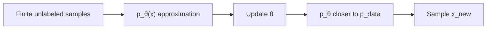
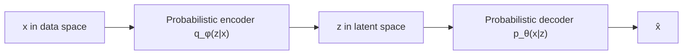
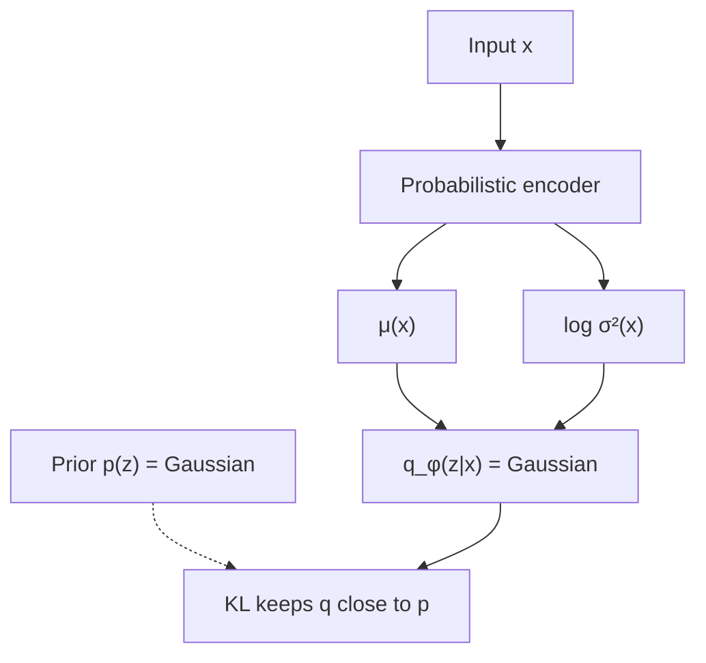

# L21: Introduction to VAE and the working of the encoder

**Video:** [Lec 21](https://www.youtube.com/watch?v=hOu8AoG83H4) · 41:14  
**Instructor in this lecture:** Prof. Ashwini Kodipalli

### Learning objectives

- Contrast autoencoders (**reconstruction**) with VAEs (**generation** of new samples).
- State the generative goal: from finite unlabeled samples, learn $p_\theta(x)\approx p_{\text{data}}(x)$.
- Explain why the encoder learns an **approximate posterior** $q_\phi(z\mid x)$, not the true $p(z\mid x)$.
- List the **Gaussian** assumptions on $p(z)$ and $q_\phi(z\mid x)$, and what the encoder actually outputs (**mean** and **log-variance**).
- Walk the lecture’s **latent-size-5** sampling picture.

Decoder, ELBO, and “why the evidence integral is intractable” are **this video + the next**. Watch them as a pair.

---

## Motivation: reconstruction is not enough

Week 2 autoencoders reconstruct $x$. A VAE is introduced because we also want **new samples** — **generation**, not only copying the input.

---

## Iris picture: class-conditional clouds (labels unused)

The **Iris** table has $n$ samples $x_1,\ldots,x_n$ and three species: **setosa**, **versicolor**, **virginica** (ASR: “sautazo / versicol”). Within a class, **petal width** and **petal length** sit in a similar range — each class has its own **class-conditional** pattern.

A VAE is **unsupervised**: **class labels are not used in training**. The net must still learn the **underlying pattern** so it can emit a new $x$ that looks like the table.

### What we do not know

- The **true** data distribution.  
- The **functional form** (Gaussian? Bernoulli? Poisson?).  

All we have is a **finite training set** drawn from that unknown law.

### What a generative model must do

1. Learn the **underlying distribution**.  
2. Sample a new $x_{\text{new}}$ that looks like training data.

With only a few points we learn an **approximation** $p_\theta(x)$, $\theta=$ **weights and biases**. Early in training $p_\theta$ is far from $p_{\text{data}}$; as $\theta$ updates they **move together**. Then we can **sample** from $p_\theta$.

---

## Recap: deterministic autoencoder

$x$ → **encoder** → compact **latent** (important variations) → **decoder** → reconstruction. Compare to $x$; if the gap is large, **backprop**, update parameters, until reconstruction matches $x$.

If a VAE did **only** this, we would **lose generation**. The change is **probabilistic** maps.

---

## Two spaces, two distributions

| Object | Distribution | Lives in |
|--------|--------------|----------|
| Data $x_1,\ldots,x_n$ | $p_{\text{data}}(x)$ | **Data space** (input dimension / structure) |
| Latent $z$ | $p(z)$ | **Latent space** (different dimension / structure) |

Because $x$ and $z$ live in **different spaces**, mapping $x\to z$ and $z\to\hat x$ must be **probabilistic**.

| Autoencoder | VAE |
|-------------|-----|
| Encoder | **Probabilistic encoder** |
| Latent code | Latent **distribution** |
| Decoder | **Probabilistic decoder** |

---

## Encoder: approximate posterior, not true posterior

**True posterior** (what we wish we had):

$$
p(z\mid x) = \text{probability of latent }z\text{ given data }x
$$

The encoder **does not** compute this. True posterior is **hard** (denominator — hold this; decoder lecture finishes the argument). Instead it learns an **approximate posterior** with **learnable** $\phi$ (weights):

$$
q_\phi(z\mid x) \approx p(z\mid x)
$$

**Encoder’s job:** $q_\phi(z\mid x)$ — “probability of $z$ given $x$.”

**Decoder’s job** (named here, derived next video): **likelihood**

$$
p_\theta(x\mid z)
$$

—“probability of reconstructing / generating $x$ given $z$.”

---

## Bayes’ rule and why $p(z\mid x)$ is refused

From Bayes (ASR: “base theorem”):

$$
p(z\mid x) = \frac{p(x\mid z)\,p(z)}{p(x)}
$$

| Factor | Name in the lecture |
|--------|---------------------|
| $p(z\mid x)$ | True **posterior** |
| $p(z)$ | **Prior** |
| $p(x\mid z)$ | **Likelihood** |
| $p(x)$ | **Evidence** |

$p(x)$ in the denominator is **hard**: it needs an **integral over all possible latent $z$**. That sentence is parked until the decoder video. **Because of that**, VAE never uses the true posterior; it uses $q_\phi(z\mid x)$.

---

## $z$ is a vector, not a scalar

You cannot crush **100** features to **one** number without throwing information away. If the latent size is **25**, 100 inputs become a **25-D vector**: the 100 values are **compressed** into 25 important coordinates — you have **not** deleted 75 features and kept 25 raw ones.

| Input features | Latent size | What $z$ is |
|----------------|-------------|-------------|
| 100 | 1 | Forbidden in the lecture: too much information lost |
| 100 | **25** | A **vector** of length 25 |

Same AE idea: **meaningful, lower-dimensional** representation of $x$. The VAE encoder has that same job, plus the probabilistic layer below.

---

## Assumption 1: prior $p(z)$ is Gaussian

We **do not know** the geometry of latent space. The lecture’s assumption:

$$
p(z) \sim \mathcal{N}(\mu, \sigma^2)
$$

(standard VAE: typically $\mathcal{N}(0,I)$; the slide insists on **Gaussian** with **mean and variance**).

**Why Gaussian, not some other family?** (for now)

1. **Simple / mathematically convenient** — only **two** parameters (mean, variance).  
2. **Sampling is easy**.

A fuller “why” returns when $q$ is also Gaussian.

---

## Assumption 2: $q_\phi(z\mid x)$ is Gaussian too

Encoder must output a **distribution**. Rather than an arbitrary complex density, **restrict $q_\phi$ to Gaussian**. Then the encoder outputs **only two objects: mean and variance**.

**Why match the prior’s family?** $p(z)$ is already Gaussian and is the **reference**. If $q_\phi(z\mid x)$ is Gaussian too, we can **compare** them. **KL divergence** (regularizer in the loss, next to **reconstruction loss**) **keeps the encoder Gaussian close to the prior Gaussian**.

Training is easy: learn **two** parameter maps. Sampling $z$ is easy: draw from that Gaussian.

---

## Encoder as a neural net (end-to-end sketch)

The probabilistic encoder **is** a net:

- **Tabular** $x$ → **MLP** (hidden layers, weights, biases, activations).  
- **Image** $x$ → **CNN**.

At the **last encoder stage** the lecture’s code-shaped output is:

- a **mean** vector, and  
- a **log-variance** vector  

Gaussian needs **mean and variance**, so convert log-variance with the usual identity (same conversion used in the week-3 numerical example and the week-4 lab):

$$
\sigma^2 = \exp(\log\sigma^2),\qquad \sigma = \sqrt{\sigma^2} = \exp\!\big(\tfrac12\log\sigma^2\big)
$$

**Latent size is a hyperparameter** you set in code. Example: size **5** → five means, five log-variances (then five variances), five coordinates $z_1,\ldots,z_5$.

### Sampling $z$ (this lecture’s meaning)

Each pair $(\mu_j,\sigma_j^2)$ is one 1-D Gaussian. **Sampling** = **randomly pick one number** from that Gaussian → $z_j$. Do this for $j=1,\ldots,5$. Pass the five-vector into the decoder (next video).

Worked numbers on the slide: after converting log-variance → variance, a **random** draw near the first mean might be $z_1=0.65$. It could equally have been **0.45**, **0.55**, **0.67**, … — **infinitely many** $z$ for **one** $x$.

That infinity is the **hint** why the Bayes denominator $p(x)$ is hard: you cannot list “the” $z$ that produced $x$. The decoder lecture turns the hint into the integral $\int p(x\mid z)p(z)\,dz$.

Until that lecture, the encoder story is: **$x$ in → $\mu$ and $\log\sigma^2$ out → sample $z$**. Why only $\mu,\sigma^2$? Because both $p(z)$ and $q_\phi(z\mid x)$ were assumed **Gaussian**.

### Key takeaways

- AE reconstructs; VAE must **generate** by learning $p_\theta(x)$ from unlabeled samples.
- Encoder’s target is $p(z\mid x)$, but evidence $p(x)=\int p(x\mid z)p(z)\,dz$ is **intractable**, so we train $q_\phi(z\mid x)$.
- Prior $p(z)$ and approximate posterior $q_\phi$ are both taken **Gaussian**; encoder emits **$\mu$ and $\log\sigma^2$**; **KL** pins $q$ to the prior.
- $z$ is a **vector**; sampling it is a **random pick** from each coordinate’s Gaussian, so one $x$ has **infinitely many** latents.

---
