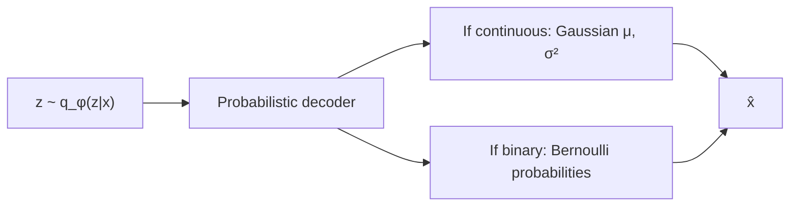
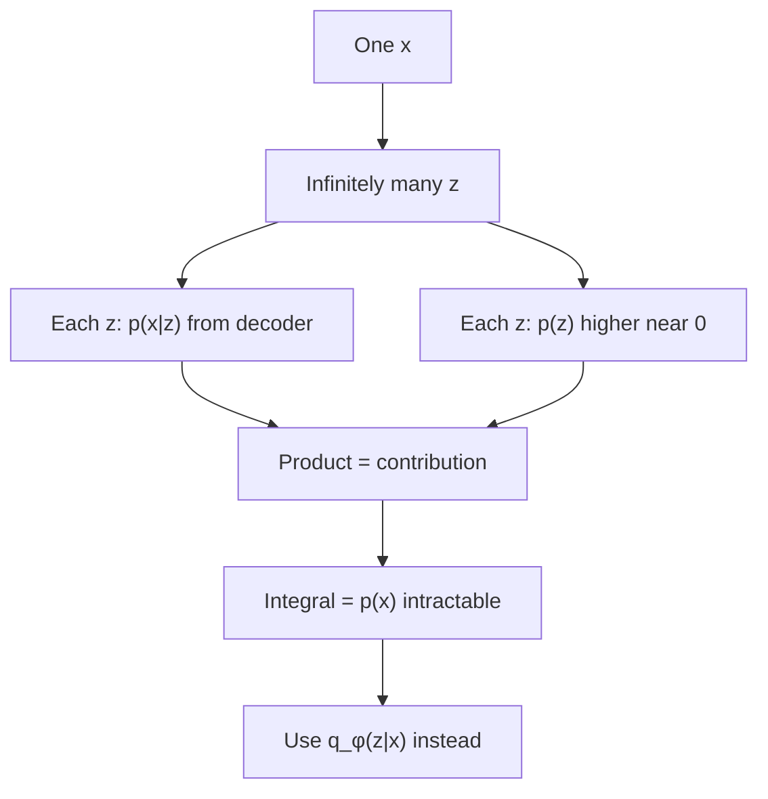

# L22: Probabilistic decoder, ELBO, and the VAE loss

**Video:** [Lec 22](https://www.youtube.com/watch?v=09A4OkjUjt0) · 44:39  
**Instructor in this lecture:** Prof. Ashwini Kodipalli

### Learning objectives

- Describe the decoder as a net that maps sampled $z$ to **likelihood parameters** (Gaussian vs Bernoulli, by data type).
- Use the lecture’s **5-feature / latent-size-2** example to see **infinitely many** $z$ for one $x$, and slightly different $\hat x$ that stay near $x$.
- Explain why $p(x)=\int p(x\mid z)p(z)\,dz$ is **intractable**, so the encoder never learns the **true** posterior.
- Write **ELBO** as reconstruction minus KL, and the **VAE loss** as **minimize** $-\text{ELBO}$.
- State the **closed-form Gaussian KL** and why **naïve sampling of $z$ blocks backprop** (reparameterization is the next video).

This lecture answers questions parked in L21. There is still **no full architecture diagram** — that comes **after** the reparameterization trick.

---

## From encoder to $z$ (recap)

Encoder outputs **mean and variance** of $q_\phi(z\mid x)$. **Sampling** $z$ means **randomly picking a number** from that Gaussian (L21’s numerical sketch). That $z$ is the **input to the decoder**.

---

## Role of the probabilistic decoder

The VAE should **generate new data** (and can reconstruct). The decoder is a neural net: $z$ in, reconstruction / sample out.

Because it is **probabilistic**, it outputs **parameters of the likelihood** $p_\theta(x\mid z)$ — “probability of $x$ given $z$.” Which parameters depend on **what you are generating**.

| Data you reconstruct / generate | Likelihood | Decoder outputs | How you get $\hat x$ |
|---------------------------------|------------|-----------------|----------------------|
| **Continuous / real** values | **Gaussian** | **Mean and variance** | Theory: **sample** $\hat x$ from that Gaussian. Practice (next numerical lecture): the **mean itself** is $\hat x$ |
| **Binary** (each feature / pixel 0 or 1) | **Bernoulli** | A **probability per feature** | $\hat x$ sampled from those Bernoullis |

---

## Numerical picture of the decoder

**Input $x$:** **five** continuous features.  
**Latent size:** **2** → two means, two variances (convert log-variance → variance if needed).

$z_1$ is drawn from the first Gaussian, $z_2$ from the second. **The draw is not fixed.** First pick might be one pair; next pick another. There is **no end**: **infinitely many** $(z_1,z_2)$ for **one** $x$.

Spoken examples of “randomly pick a number”: 0.45, 0.46, 0.55, 0.54, 0.51, then later 0.55, 0.22, 0.46, $-0.2$, …

### Three concrete samples (lecture)

| Sample | $(z_1, z_2)$ |
|--------|----------------|
| $z^{(1)}$ | $(0.56,\ -0.11)$ |
| $z^{(2)}$ | $(0.43,\ -0.32)$ |
| $z^{(3)}$ | $(0.61,\ -0.24)$ |

Each vector is **different**. Each is passed through the **same** decoder.

Decoder last layer has **five** neurons (match the five features). Three latents → three reconstructions $\hat x^{(1)}, \hat x^{(2)}, \hat x^{(3)}$, **slightly different** from each other, **all near the original $x$**. Variation in $z$ **causes** variation in $\hat x$. That is **generation**: not a single copy of $x$, but new points around it.

Early in training, $\mu,\sigma^2$ are arbitrary. After backprop, they are **optimized**, so decoder outputs stay **close to $x$** while still **differing** across samples.

**Punchline:** many latent vectors, many reconstructions, **all similar to the original input**.

---

## Why $p(z\mid x)$ is intractable (the L21 question)

Facts already on the table:

- **Infinitely many** $z$ for one observed $x$.  
- You **cannot** point to **one** $z$ and say “this latent produced this $x$ through the decoder.”

To answer “which $z$ generated this $x$?” you need the **true posterior** $p(z\mid x)$, hence Bayes:

$$
p(z\mid x) = \frac{p(x\mid z)\,p(z)}{p(x)},\qquad
p(x) = \int p(x\mid z)\,p(z)\,dz
$$

The integral (lecture: **sum over all latents** that could have produced $x$) has **no finite list**. For a neural decoder this integral is **intractable**. So we **never** train $p(z\mid x)$; we train $q_\phi(z\mid x)$.

### Two factors inside the integrand (why each $z$ “contributes”)

For **every** candidate $z$:

1. **Likelihood** $p(x\mid z)$: decoder’s probability that **this** $z$ would generate the observed $x$ (could be 0.8, 0.2, …).  
2. **Prior density** $p(z)$: if the coordinates of $z$ sit **near the origin** (near **0**), **high** prior density; if they are **far from 0**, **low** prior density. Example: a $z$ near origin gets relatively **high** $p(z)$; a $z$ with large coordinates gets **low** $p(z)$.

**Contribution of one $z$:** product $p(x\mid z)\,p(z)$.  
**Evidence $p(x)$:** **integral / sum of all such products** — infinitely many terms. That is the hard denominator.

### $q_\phi$ vs $p(z\mid x)$ — not “just a letter”

| | True posterior $p(z\mid x)$ | Approximate $q_\phi(z\mid x)$ |
|--|-----------------------------|-------------------------------|
| Rule it follows | **Bayes** (needs $p(x)$) | **Gaussian** (output $\mu$, $\sigma^2$) |
| Denominator | Integral over **all** $z$ | **None** |
| What the net emits | Would need that integral | Mean and variance of $q_\phi$ |

The difference is **not** merely writing $P$ vs $Q$. One is Bayesian with an infinite integral; the other is a Gaussian encoder.

---

## What we actually want after training (MNIST thought experiment)

If the model has really learned the data distribution on **MNIST digits**:

- **Digit-like** images → **high** $p_\theta(x)$  
- **Noisy / non-digit** images → **low** $p_\theta(x)$

So the ideal objective is **maximize** $\log p_\theta(x)$. But $\log p_\theta(x)$ **cannot be computed** (same integral over all $z$ that could have generated $x$).

---

## ELBO — evidence lower bound

**ASR: “elbow” / “evidence low bound.”** Instead of maximizing $\log p_\theta(x)$, maximize a **simpler** objective: the **ELBO**, the **lower bound** of $\log p_\theta(x)$. **The VAE maximizes the ELBO** — it does **not** maximize $\log p_\theta(x)$ directly.

As written in the lecture, two pieces:

$$
\text{ELBO}
= \underbrace{\mathbb{E}_{q_\phi(z\mid x)}\big[\log p_\theta(x\mid z)\big]}_{\text{reconstruction / log-likelihood}}
- \underbrace{D_{\mathrm{KL}}\big(q_\phi(z\mid x) \,\|\, p(z)\big)}_{\text{KL regularizer}}
$$

The first term is the **log-likelihood** of the observed $x$ under the decoder, in expectation over $z\sim q_\phi(z\mid x)$. The second term is the **KL** from L19–L20, now between **encoder Gaussian** and **prior Gaussian**.

### Reconstruction term

Encoder has learned $\mu,\sigma^2$; $z$ is sampled from $q_\phi(z\mid x)$; decoder should assign **high** probability to the **observed** $x$ — i.e. reconstruct $x$.

| Data type | Reconstruction in code |
|-----------|------------------------|
| Continuous / real | **MSE** |
| Binary | **Binary cross-entropy** |

If the encoder’s Gaussian is right, reconstruction is right.

### KL term

$p(z)$ is Gaussian; $q_\phi(z\mid x)$ is assumed Gaussian. KL **keeps the encoder distribution close to the prior** (L19–L20 intuition).

---

## From ELBO to VAE **loss** (max → min)

The reconstruction / log-likelihood term is something we want to **maximize** (high probability on observed $x$). Neural nets are trained to **minimize** a loss.

**Max of $f$ = min of $-f$.** Put a **minus** on the whole ELBO:

$$
\mathcal{L}_{\text{VAE}} = -\text{ELBO}
= -\mathbb{E}_{q_\phi}\big[\log p_\theta(x\mid z)\big]
+ D_{\mathrm{KL}}\big(q_\phi(z\mid x) \,\|\, p(z)\big)
$$

Board-level sign chase the lecture walks: minus in front of the **whole** ELBO; the reconstruction piece had been a term we wanted **large**, so **minus of that** is the error we **minimize**. If a minus already sat on the KL inside ELBO, **minus of minus** on that piece becomes a **plus**: KL is **added** to the loss.

| Term in $\mathcal{L}_{\text{VAE}}$ | Continuous / real $x$ | Binary $x$ |
|------------------------------------|----------------------|------------|
| Reconstruction (from log-likelihood) | **MSE** | **BCE** |
| Regularizer | **KL**($q_\phi(z\mid x) \,\|\, p(z)$) | same |

That is the **VAE loss function** slide: reconstruction **plus** KL.

---

## Closed-form KL when both densities are Gaussian

Because $q_\phi(z\mid x)=\mathcal{N}(\mu,\sigma^2)$ (diagonal in practice) and $p(z)=\mathcal{N}(0,I)$, KL has a **closed form**: plug in numbers, get a scalar. The lecture writes the analytic expression (derived as “two Gaussians” — the discrete $\sum P\log(P/Q)$ of L20 specializes to this). Coordinate-wise:

$$
D_{\mathrm{KL}}\big(q_\phi(z\mid x) \,\|\, p(z)\big)
= \frac12\sum_j \Big(\mu_j^2 + \sigma_j^2 - 1 - \log\sigma_j^2\Big)
$$

Equivalent coding form (log-variance $l_j=\log\sigma_j^2$):

$$
\frac12\sum_j \big(\mu_j^2 + e^{l_j} - 1 - l_j\big)
= -\frac12\sum_j \big(1 + l_j - \mu_j^2 - e^{l_j}\big)
$$

L24 substitutes $\mu$, $\log\sigma^2$, and $\sigma^2$ into this family of formulae.

---

## Remaining hole: sampling $z$ breaks gradients

KL still **encourages** $q_\phi$ toward $p(z)$. But $z$ is **sampled** from $q_\phi$, and **every draw is different** — a **random** node. **Randomness breaks gradient flow.** There is **no fixed formula** $z=f(\mu,\sigma)$ in this picture, so you **cannot backprop through sampling** to the encoder weights.

The architecture is therefore **incomplete** until the **reparameterization trick** (next lecture). Only after that does the course draw the **solid VAE diagram**.

### Key takeaways

- Decoder outputs **likelihood parameters**: Gaussian $(\mu,\sigma^2)$ for continuous $x$, Bernoulli probabilities for binary $x$.
- One $x$ ↔ **infinitely many** $z$ ↔ many nearby $\hat x$ (**generation**).
- $p(x)=\int p(x\mid z)p(z)\,dz$ sums **unbounded** contributions; true posterior is **intractable**; encoder uses $q_\phi$.
- Maximize **ELBO** $= \mathbb{E}[\log p(x\mid z)] - \mathrm{KL}(q_\phi \,\|\, p)$. Minimize **loss** $= -\text{ELBO}$ = reconstruction (MSE or BCE) + KL.
- Naïve sampling of $z$ **blocks** backprop → reparameterization next.

---
