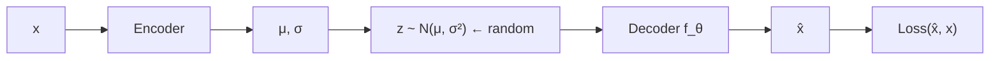
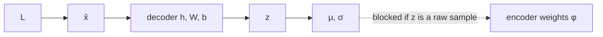
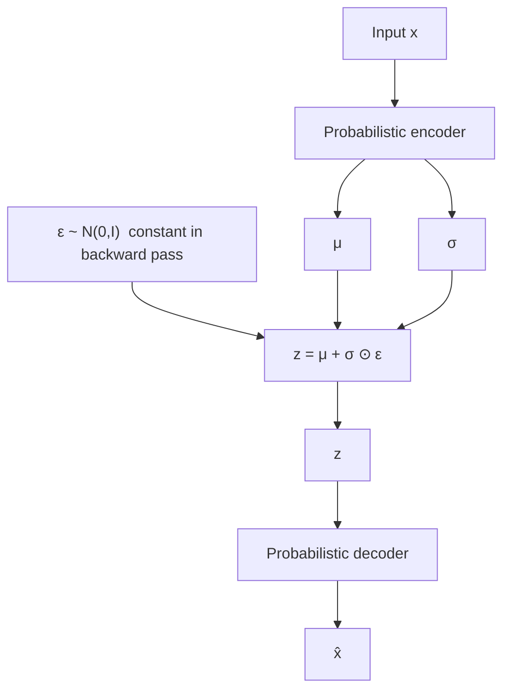

# L23: Reparameterization trick

**Video:** [Lec 23](https://www.youtube.com/watch?v=GA9T9kNoRd4) · 35:04  
**Instructor in this lecture:** Prof. Ashwini Kodipalli

### Learning objectives

- Restate the VAE loss (reconstruction + closed-form KL) and why **sampling $z$** blocks **backprop**.
- Show that **decoder** parameters are fine under ordinary chain rule; the break is $\partial z/\partial\mu$ and $\partial z/\partial\sigma$.
- Write the **reparameterization** $z=\mu+\sigma\odot\varepsilon$, $\varepsilon\sim\mathcal{N}(0,I)$, and treat $\varepsilon$ as a **constant** during backprop.
- Compute $\partial z/\partial\mu=1$ and $\partial z/\partial\sigma=\varepsilon$, then push gradients into the **encoder weights**.
- Draw the **full VAE architecture** the course withheld until this trick.

A full **numerical** forward pass is the **next** lecture.

---

## Loss we already have

Two terms (L22):

1. **Reconstruction** — how far $\hat x$ is from $x$: **MSE** if continuous, **BCE** if binary.  
2. **KL regularizer** — both $q_\phi(z\mid x)$ and $p(z)$ are Gaussian, so KL is the **closed form** that keeps the **encoder distribution close to the prior**.

$z$ appears in this story as a **sample** from $\mathcal{N}(\mu,\sigma^2)$: **randomly pick** a value given those parameters. **Sampling is a random operation. Randomness breaks gradient flow.** Without a gradient path you cannot update $\theta$.

**Question this lecture answers:** how do we get gradients when **part of the net is a sample**?

---

## Forward pass (before fixing sampling)

1. Input $x$ → encoder → parameters of $q_\phi(z\mid x)$: **mean $\mu$ and variance / std $\sigma$**.  
2. $z$ sampled from that Gaussian.  
3. $z$ → decoder $f_\theta$ → $\hat x$.

$$
\hat x = f_\theta(z)
$$

$\theta$ = decoder **weights and biases** (learnable). Updating $\theta$ pulls $\hat x$ toward $x$.

---

## Decoder side: ordinary backprop works

If $x$ is tabular, imagine decoder = **MLP**. Lecture’s two-layer sketch:

**Hidden layer** (ReLU):

$$
h_1 = \mathrm{ReLU}(W_1 z + b_1)
$$

Decoder takes $z$, multiplies by **input-to-hidden** $W_1$, adds $b_1$, applies **ReLU**. $h_1$ is the first hidden representation.

**Output layer:**

$$
\hat x = f(W_2 h_1 + b_2)
$$

$f$ depends on data type:

| Data | Output activation $f$ |
|------|------------------------|
| Binary | **Sigmoid** |
| Continuous | **Linear** |

**Learnable decoder parameters:** $W_1,b_1,W_2,b_2$.

Compute loss between $\hat x$ and $x$ (MSE or BCE). Initially loss is high; updates drive weights/biases toward an optimum.

### Chain rule at the output layer

$$
\frac{\partial L}{\partial W_2} = \frac{\partial L}{\partial\hat x}\,\frac{\partial\hat x}{\partial W_2},\qquad
\frac{\partial L}{\partial b_2} = \frac{\partial L}{\partial\hat x}\,\frac{\partial\hat x}{\partial b_2}
$$

All of these exist.

### Chain rule at the hidden layer

Path $L \to \hat x \to h_1 \to W_1$:

$$
\frac{\partial L}{\partial W_1} = \frac{\partial L}{\partial\hat x}\,\frac{\partial\hat x}{\partial h_1}\,\frac{\partial h_1}{\partial W_1}
$$

and likewise for $b_1$. **Decoder-side gradients are standard backprop. The decoder is not the problem.**

---

## Gradient w.r.t. $z$ is also fine

$\hat x$ is produced **from** $z$, so $L$ depends on $z$ through $\hat x$:

$$
\frac{\partial L}{\partial z} = \frac{\partial L}{\partial\hat x}\,\frac{\partial\hat x}{\partial z}
$$

Once sampled, $z$ is just a **numeric vector** into a differentiable decoder. Gradients **reach $z$**. The break is **behind** $z$, toward the encoder.

---

## Where it breaks: $\mu$ and $\sigma$

Encoder outputs $\mu$ and $\sigma$ (variance converted to **standard deviation**). We need $\partial L/\partial\mu$ and $\partial L/\partial\sigma$ so we can update encoder weights.

Chain rule **looks** like

$$
\frac{\partial L}{\partial\mu} = \frac{\partial L}{\partial z}\,\frac{\partial z}{\partial\mu},\qquad
\frac{\partial L}{\partial\sigma} = \frac{\partial L}{\partial z}\,\frac{\partial z}{\partial\sigma}
$$

$\partial L/\partial z$ we have. **$\partial z/\partial\mu$ and $\partial z/\partial\sigma$ we do not**, if $z$ is defined only as “a random draw from $\mathcal{N}(\mu,\sigma^2)$.” That sampling map is **not a differentiable function of $\mu$**. **Direct backprop through sampling is impossible.**

---

## Reparameterization: move the randomness into $\varepsilon$

**Do not** sample $z$ directly from $\mathcal{N}(\mu,\sigma^2)$. **Write**

$$
z = \mu + \sigma \odot \varepsilon,\qquad \varepsilon \sim \mathcal{N}(0, I)
$$

($\odot$ = elementwise product; lecture writes the 1-D form $z=\mu+\sigma\varepsilon$.)

- $\mu$ and $\sigma$ **depend on** $x$ and encoder parameters (weights, biases).  
- $\varepsilon$ is **independent** of $\mu$ and $\sigma$. It is **not learned**. It is a draw from a **standard Gaussian**. During backprop it is a **fixed number** (a **constant**).

**Why $\varepsilon$ at all?** One $x$ must still generate **many** $z$ (L21–L22). That diversity has to come from **somewhere**. $\varepsilon$ supplies the **randomness** without putting a non-differentiable sample **on the path** from $L$ to $\phi$.

Randomness is **separated** from encoder parameters. Now $z$ **is** a differentiable function of $\mu$ and $\sigma$.

---

## The two derivatives that were missing

$$
z = \mu + \sigma\,\varepsilon
$$

**W.r.t. mean**

$$
\frac{\partial z}{\partial\mu} = 1 + 0 = 1
$$

(first term depends on $\mu$; second term has **no** $\mu$.)

**W.r.t. standard deviation**

$$
\frac{\partial z}{\partial\sigma} = 0 + \varepsilon = \varepsilon
$$

(first term has **no** $\sigma$; second term contributes $\varepsilon$.)

Those were the unknown factors. They are now **1** and **$\varepsilon$**.

---

## Full backward path (end-to-end)

Decoder path unchanged: $L \to \hat x \to z$ with

$$
\frac{\partial L}{\partial z} = \frac{\partial L}{\partial\hat x}\,\frac{\partial\hat x}{\partial z}
$$

Then into encoder outputs:

$$
\frac{\partial L}{\partial\mu}
= \frac{\partial L}{\partial\hat x}\,\frac{\partial\hat x}{\partial z}\,\frac{\partial z}{\partial\mu}
= \frac{\partial L}{\partial z}\cdot 1
$$

$$
\frac{\partial L}{\partial\sigma}
= \frac{\partial L}{\partial\hat x}\,\frac{\partial\hat x}{\partial z}\,\frac{\partial z}{\partial\sigma}
= \frac{\partial L}{\partial z}\cdot\varepsilon
$$

Finally, **standard backprop** from $(\mu,\sigma)$ into encoder weights $\phi$:

$$
\frac{\partial L}{\partial\phi} = \frac{\partial L}{\partial\mu}\,\frac{\partial\mu}{\partial\phi} + \frac{\partial L}{\partial\sigma}\,\frac{\partial\sigma}{\partial\phi}
$$

Gradients run from the **output** all the way to the **encoder**. **End-to-end training is possible.**

---

## Architecture the course can finally draw

| Before reparameterization | After |
|---------------------------|--------|
| $z\sim\mathcal{N}(\mu,\sigma^2)$ (raw sample) | $z=\mu+\sigma\odot\varepsilon$, $\varepsilon\sim\mathcal{N}(0,I)$ |

**Full diagram:** $x$ → probabilistic encoder → $\mu$, $\sigma$ → combine with $\varepsilon$ → $z$ → decoder → $\hat x$ (or $x'$).

That is the VAE architecture. Next lecture: **one numerical forward pass** so the flow is concrete.

### Key takeaways

- Reconstruction + KL is not enough: **sampling $z$** is non-differentiable, so encoder $\phi$ cannot be updated.
- Decoder $W,b$ and even $\partial L/\partial z$ are ordinary calculus; the hole is $\partial z/\partial\mu$ and $\partial z/\partial\sigma$.
- Reparameterization: $z=\mu+\sigma\varepsilon$ with $\varepsilon$ **independent** and treated as **constant**. Then $\partial z/\partial\mu=1$, $\partial z/\partial\sigma=\varepsilon$.
- Gradients reach encoder parameters; **end-to-end** VAE training works.

---
