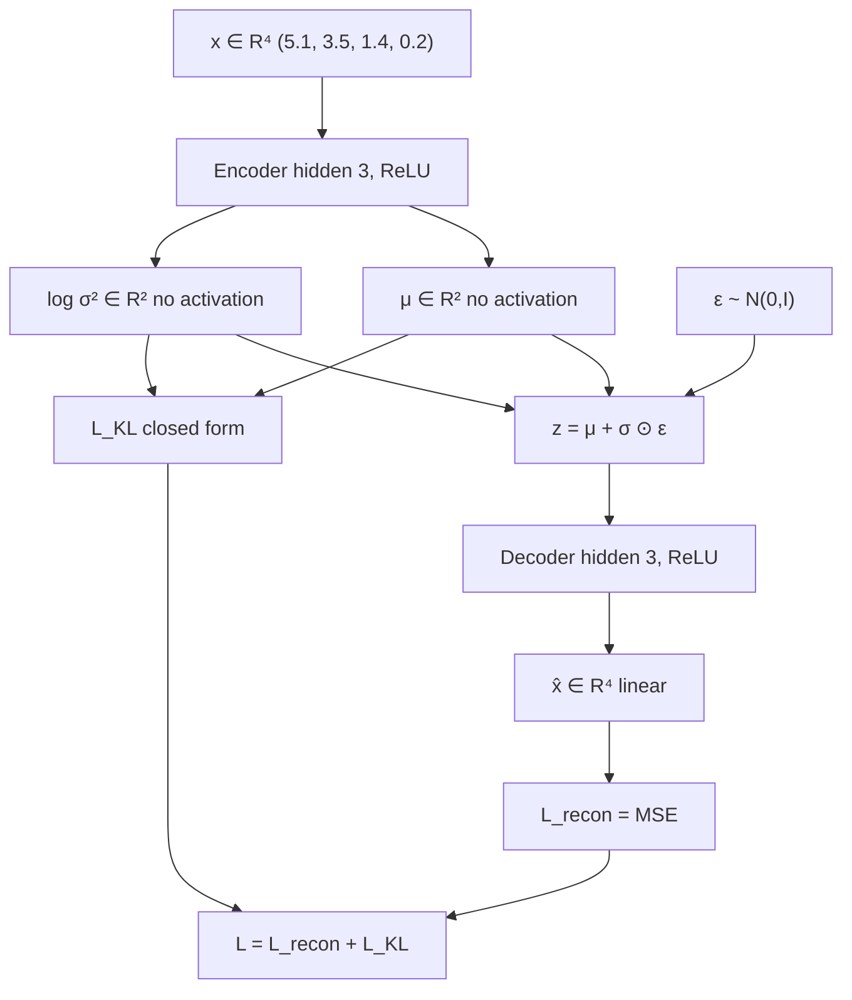

# L24: VAE numerical example

**Video:** [Lec 24](https://www.youtube.com/watch?v=0ui08gNfjcA) · 45:54  
**Instructor in this lecture:** Prof. Ashwini Kodipalli

### Learning objectives

- Run a **full forward pass** of a tiny MLP VAE on one **continuous tabular** row (four features).
- Compute hidden ReLUs, **μ** and **log-variance** (no activation on those heads), **σ²** and **σ**, then **reparameterized** $z$.
- Decode with ReLU then **linear** output; compare $\hat x$ to $x$.
- Plug the lecture’s numbers into **MSE** reconstruction and **closed-form Gaussian KL**, then add them.

Week 3 **ends** here (no lab). Week 4 starts with a **practical VAE**. This video is **forward pass + loss only** — no numerical backprop.

---

## Problem setup

Last session of week 3. Encoder, decoder, and reparameterization were theory; now **one worked example**.

| Choice | Lecture |
|--------|---------|
| Data | **Continuous**, **tabular** (rows × columns) |
| Features / input neurons | **4** |
| Spoken coordinates | **5.1**, **3.5**, **1.4**, and a fourth input into weight **0.2** |
| Consistent fourth value | **0.2** (Iris-style row $(5.1,\ 3.5,\ 1.4,\ 0.2)$ makes the spoken $h_1=1.07$) |
| Encoder hidden | **3** neurons, **ReLU**, bias **0.1** |
| Latent size | **2** (two μ, two log-σ²) |
| Decoder hidden | **3** neurons, **ReLU**, bias **0.1** |
| Decoder output | **4** neurons, **linear** (continuous reconstruction) |
| Weights | **Random** (can be negative, e.g. $-0.7$) |

---

## 1. Encoder hidden layer

Every input connects to every hidden unit (four weights per neuron). First hidden neuron (weights spoken):

$$
h_1 = 5.1\cdot 0.1 + 3.5\cdot 0.4 + 1.4\cdot(-0.7) + 0.2\cdot 0.2 + 0.1
$$

$$
= 0.51 + 1.40 - 0.98 + 0.04 + 0.1 = 1.07
$$

Same pattern for the other two hidden units (four random weights each, same bias **0.1**). Spoken pre-activations after the sum:

| Hidden unit | Pre-activation $h$ |
|-------------|-------------------|
| 1 | **1.07** |
| 2 | **1.93** |
| 3 | **0.87** |

**ReLU** on a hidden layer: $\mathrm{ReLU}(h)=\max(0,h)$. All three are positive, so they pass through:

$$
a = (a_1,a_2,a_3) = (1.07,\ 1.93,\ 0.87)
$$

That vector is the **output of the first hidden layer**.

---

## 2. Mean head (latent dimension 2)

Next layer is **not** another ordinary hidden layer: it must emit **approximate-posterior parameters**. Latent size **2** → **two means**.

Each mean is a linear map from $a\in\mathbb{R}^3$ (three weights + bias). **Bias is 0** “for simple calculation.”

**μ₁** (weights **0.5**, **−0.3**, **0.1**):

$$
\mu_1 = 1.07\cdot 0.5 + 1.93\cdot(-0.3) + 0.87\cdot 0.1 + 0
= 0.535 - 0.579 + 0.087 = 0.043
$$

**μ₂** (weights **0.2**, **0.4**, **−0.5**):

$$
\mu_2 = 1.07\cdot 0.2 + 1.93\cdot 0.4 + 0.87\cdot(-0.5) + 0
= 0.214 + 0.772 - 0.435 = 0.551
$$

### Why **no activation** on μ

ReLU would be $\max(0,\mu)$. A **negative mean is valid**. ReLU would **zero** it and **distort** the Gaussian. **No standard activation** on the mean head. (The lecture pauses here and asks you to answer before stating this.)

---

## 3. Log-variance head, then σ² and σ

Same $a$, **another** linear map (random weights; one spoken third-weight **0.2**), bias **0**. Encoder emits **log-variance**, not σ² yet. Spoken values:

$$
\log\sigma_1^2 = 0.732,\qquad \log\sigma_2^2 = 0.302
$$

**No activation** on this head either (keep the raw linear value).

Variance and std:

$$
\sigma_j^2 = e^{\log\sigma_j^2},\qquad \sigma_j = \sqrt{\sigma_j^2}
$$

| $j$ | $\log\sigma_j^2$ | $\sigma_j^2=e^{\cdot}$ | $\sigma_j$ |
|-----|------------------|-------------------------|------------|
| 1 | 0.732 | $e^{0.732}\approx 2.079$ | **1.442** (spoken) |
| 2 | 0.302 | $e^{0.302}\approx 1.353$ | $\approx 1.163$ |

We now have **μ**, **log-variance**, **variance**, and **standard deviation**. $z$ is still not sampled.

---

## 4. Reparameterized $z$ (not a raw Gaussian draw)

Theory said $z\sim\mathcal{N}(\mu,\sigma^2)$. Reparameterization says **do not** pick $z$ that way. Latent size 2:

$$
z_1 = \mu_1 + \sigma_1\,\varepsilon_1,\qquad
z_2 = \mu_2 + \sigma_2\,\varepsilon_2
$$

$\varepsilon_j\sim\mathcal{N}(0,1)$, **independent** of $\mu,\sigma$. Need **two** draws. First pair on the board:

$$
\varepsilon = (0.5,\ -0.2)
$$

**First latent coordinate** (spoken arithmetic):

$$
z_1 = 0.043 + 1.442\cdot 0.5 = 0.043 + 0.721 = 0.764
$$

**Second** (matches the decoder input they use next):

$$
z_2 = 0.551 + 1.163\cdot(-0.2) \approx 0.318
$$

$$
z^{(1)} = (0.764,\ 0.318)
$$

(If a slide digit is off, recompute from this formula; the lecture invites you to correct typos while calculating along.)

### Same $x$, many $z$

μ and σ **do not change** for this input (they came from $x$). Only $\varepsilon$ is redrawn. Next samples from $\mathcal{N}(0,1)$ give **other** $z^{(2)}, z^{(3)},\ldots$ — **infinitely many** latents for **one** $x$, all from the **same** $q_\phi(z\mid x)$. That is the theory claim, now numeric.

---

## 5. Decoder hidden layer

Take $z^{(1)}=(0.764,\ 0.318)$. Hidden layer: **3** neurons, two incoming weights each, bias **0.1**, **ReLU**.

**Neuron 1** (weights **0.6**, **0.3**):

$$
h_1 = 0.764\cdot 0.6 + 0.318\cdot 0.3 + 0.1
= 0.4584 + 0.0954 + 0.1 = 0.6538
$$

$$
a_1 = \max(0,\ 0.6538) = 0.6538
$$

**Neuron 2** (weights **−0.4**, **0.1**):

$$
h_2 = 0.764\cdot(-0.4) + 0.318\cdot 0.1 + 0.1
= -0.3056 + 0.0318 + 0.1 = -0.1738
$$

$$
a_2 = \max(0,\ -0.1738) = 0
$$

**Neuron 3** (weights **0.2**, **−0.5**):

$$
h_3 = 0.764\cdot 0.2 + 0.318\cdot(-0.5) + 0.1
= 0.1528 - 0.159 + 0.1 = 0.0938
$$

$$
a_3 = \max(0,\ 0.0938) = 0.0938
$$

Decoder hidden output:

$$
a^{\text{dec}} = (0.6538,\ 0,\ 0.0938)
$$

---

## 6. Decoder output (reconstruction)

Four reconstructed coordinates. Because $x$ is **continuous**, output activation is **linear**: $f(u)=u$ (identity). If data were **binary** or scaled to $[0,1]$, the lecture would use **sigmoid** instead.

**$\hat x_1$** (weights **0.2**, **0.1**, **−0.3**):

$$
\hat x_1 = 0.6538\cdot 0.2 + 0\cdot 0.1 + 0.0938\cdot(-0.3)
= 0.13076 - 0.02814 = 0.10262
$$

$\hat x_2,\hat x_3,\hat x_4$ are the same pattern with other random weight triples (shown on the next slides, not all spoken). After **rounding to three decimals** (five digits after the point → keep three), the lecture displays a four-vector $\hat x$.

**Theory vs this numerical practice**

- Theory: decoder outputs **likelihood parameters**; $\hat x$ is **sampled** from that Gaussian.  
- Practice here: the linear layer’s output **is** the **mean**, and **that mean is $\hat x$**.

Compare to original $x=(5.1,\ 3.5,\ 1.4,\ 0.2)$: reconstruction is **poor**. Weights/biases were **random**. After training, backprop **updates all of them**, μ and log-σ² improve, $z$ improves, $\hat x$ moves toward $x$.

---

## 7. Reconstruction loss (MSE)

Continuous data → **mean squared error** between $x$ and $\hat x$ (and $\hat x$ **is** that decoder mean):

$$
L_{\text{recon}} = \frac{1}{4}\sum_{i=1}^{4}(x_i - \hat x_i)^2
$$

Substitute the (rounded) reconstructed coordinates from the slide:

$$
L_{\text{recon}} = 9.7111
$$

---

## 8. KL term (closed form, two Gaussians)

KL forces **encoder** $q_\phi(z\mid x)$ toward **prior** $p(z)$. **Closed form** = an expression you can **substitute numbers into**. Using μ, log-variance, and variance already computed:

$$
D_{\mathrm{KL}}
= \frac12\sum_{j=1}^{2}\Big(\mu_j^2 + \sigma_j^2 - 1 - \log\sigma_j^2\Big)
$$

Squares of the means (lecture: compute $\mu^2$ first):

$$
\mu_1^2 = 0.043^2 = 0.001849,\qquad
\mu_2^2 = 0.551^2 = 0.303601
$$

Per-coordinate pieces:

$$
\begin{align*}
\mu_1^2 + \sigma_1^2 - 1 - \log\sigma_1^2
&\approx 0.001849 + 2.079 - 1 - 0.732 = 0.3488,\\[4pt]
\mu_2^2 + \sigma_2^2 - 1 - \log\sigma_2^2
&\approx 0.3036 + 1.353 - 1 - 0.302 = 0.3546.
\end{align*}
$$

Sum, then **divide by 2**:

$$
D_{\mathrm{KL}} \approx 0.3517 \;\rightarrow\; \mathbf{0.352}
$$

(the lecture rounds **0.3517** to **0.352**).

---

## 9. Total VAE loss

$$
L = L_{\text{recon}} + D_{\mathrm{KL}} = 9.7111 + 0.352 = \mathbf{10.0631}
$$

**10.0631 is high.** Next step in a real training loop: an **optimizer** backprops and updates **every** weight and bias. Better μ, log-σ² → better $z$ → better $\hat x$ → lower loss.

This example is only the **forward** path: input → encoder → latent → decoder → loss.

---

## Forward-pass checklist (what the lecture wants you to be able to repeat)

| Step | What you compute | Activations |
|------|------------------|-------------|
| 1 | Hidden $h$, then $a=\mathrm{ReLU}(h)$ | **ReLU** |
| 2 | $\mu_1,\mu_2$ from $a$ | **None** (mean may be negative) |
| 3 | $\log\sigma^2$, then $\sigma^2=e^{\cdot}$, $\sigma=\sqrt{\cdot}$ | **None** on log-variance |
| 4 | Draw $\varepsilon\sim\mathcal{N}(0,1)$; $z=\mu+\sigma\odot\varepsilon$ | — |
| 5 | Decoder hidden ReLU | **ReLU** |
| 6 | $\hat x$ | **Linear** if continuous; **sigmoid** if binary / $[0,1]$ |
| 7 | $L_{\text{recon}}=\mathrm{MSE}(x,\hat x)$ here | — |
| 8 | Closed-form KL from μ, σ², log σ² | — |
| 9 | $L=L_{\text{recon}}+\mathrm{KL}$ | then optimizer |

### Key takeaways

- Tiny MLP VAE on $x=(5.1,\ 3.5,\ 1.4,\ 0.2)$: hidden ReLU **(1.07, 1.93, 0.87)** → **μ=(0.043, 0.551)**, **log σ²=(0.732, 0.302)**, **σ₁=1.442**.
- First $\varepsilon=(0.5,-0.2)$ → $z=(0.764,\ 0.318)$; other $\varepsilon$ give other $z$ from the **same** Gaussian.
- Decoder ReLU **(0.6538, 0, 0.0938)** → linear $\hat x_1=0.10262$; reconstruction is bad because weights are random.
- $L_{\text{recon}}=9.7111$, $\mathrm{KL}=0.352$, **$L=10.0631$**. Training would now update parameters. Week 4 lab implements a real VAE.

---
