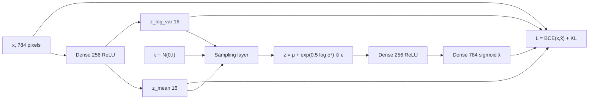

# L25: Practical exercise 1 — variational autoencoder

**Video:** [Lec 25](https://www.youtube.com/watch?v=5Iiqeoxw_Sk) · 33:25

### Learning objectives

- Contrast a **vanilla autoencoder** (fixed latent vector) with a **VAE** ($z=\mu+\sigma\varepsilon$).
- Build the lecture’s Keras VAE on **MNIST**: **784 → 256 → 16** latents → **256 → 784**, with a **sampling layer**.
- Code **BCE reconstruction + closed-form KL**, train with **Adam**, **10** epochs, batch **128**.
- Plot original vs reconstructed digits and state the lecture’s diagnosis: missing **labels** → blurry / wrong digits, which a **conditional VAE** will fix.

This is **week 4, session 1** — the VAE lab promised at the end of week 3. It is not a CVAE yet.

---

## Vanilla AE vs VAE (opening slide)

| | Autoencoder | VAE in this lab |
|--|-------------|-----------------|
| Encoder | $x$ → **one fixed** latent vector | $x$ → **μ and variance** of the pixel distribution |
| Latent | Cannot be resampled | $z = \mu + \sigma\,\varepsilon$ with noise **ε** |
| Decoder | $z$ → reconstruction | Same, but $z$ is **stochastic** |

MNIST pixels → empirical mean/variance → $z$ depends on **μ, σ, and ε**. Decoder rebuilds the image from that $z$.



---

## 1. Libraries

| Import | Use |
|--------|-----|
| `tensorflow` as `tf` | Deep-learning framework |
| `keras.layers`, `keras.models` | Input / hidden / output layers; `Model` |
| `matplotlib.pyplot` as `plt` | Original vs reconstruction plots |

---

## 2. Dataset — same MNIST as the autoencoder labs

Handwritten digits **0–9**, **10** classes. Continuation of the AE / regularization notebooks.

### Load and drop labels

```text
(x_train, _), (x_test, _) = mnist.load_data()
```

**No `y_train` / `y_test`.** A VAE does not use class labels. `_` discards them.

### Float + normalize to $[0,1]$

Cast to float, divide by **255** (grayscale min **0**, max **255**).

Lecture’s **3×3** toy: each entry $v$ becomes $v/255$. **0 → 0**, **255 → 1**. Normalization puts pixels in a range the net can learn.

### Flatten 28×28×1 → 784

MNIST is **28×28**, channel **1**. Reshape to `(-1, 784)`. `-1` ignores the label axis so only **features** remain.

### Shapes after preprocessing (printed)

| Split | Samples | Features |
|-------|--------:|---------:|
| Train | **60,000** | 784 |
| Test | **10,000** | 784 |

---

## 3. Sampling layer (the VAE difference)

After the encoder, **before** the decoder, define sampling:

$$
z = \mu + \sigma \odot \varepsilon,\qquad
\varepsilon \sim \mathcal{N}(0, I)
$$

ε is **Gaussian / normal** noise, mean **0**, std **1**. **Shape of ε = shape of μ** (here length **16**).

### Latent dimension

`latent_dim = 16` (any size is allowed; **16** for simplicity). 784 pixels compress to **16** latent variables, each with its own $\mu_j$ and $\sigma_j^2$.

### σ from log-variance (as coded)

The network stores **log-variance**. Std is the square root of variance. With natural log:

$$
\log\sigma = \tfrac12\log(\sigma^2)
\quad\Rightarrow\quad
\sigma = \exp\!\big(0.5\cdot\log\sigma^2\big)
$$

In TensorFlow: `tf.exp(0.5 * z_log_var)`. Then

$$
z = \mu + \exp(0.5\cdot\log\sigma^2)\odot\varepsilon
$$

That is the **reparameterization trick** in the lab.

---

## 4. Encoder

| Layer | Units / shape | Activation |
|-------|----------------|------------|
| Input | **784** ($28\times 28$) | — |
| Dense | **256** | **ReLU** |
| Dense `z_mean` | **16** | linear (no ReLU on μ) |
| Dense `z_log_var` | **16** | linear |

ReLU: $\max(0,u)$ — pass positives, zero negatives (lecture example: $\max(0,5)=5$, $\max(0,-2)=0$). Adds **nonlinearity**.

`z_mean` and `z_log_var` are dense maps of size `latent_dim` on the **256**-unit representation of $x$. Encoder `Model` takes the image and produces **μ, log-variance, and sampled $z$**.

---

## 5. Decoder

Mirror the 256-unit block; decode from **latent inputs** of shape **16**.

| Layer | Units | Activation | Why |
|-------|------:|------------|-----|
| Dense | **256** | **ReLU** | Same width as encoder hidden; acts on $z$ |
| Dense | **784** | **Sigmoid** | Match **normalized** pixels in $(0,1)$ |

**Sigmoid** (standard formula the lab wants):

$$
\sigma(u) = \frac{1}{1+e^{-u}} \in (0,1)
$$

Whatever the pre-activation, the reconstruction stays in the same range as $x/255$. (The spoken limits “$-\infty\to 1$, $+\infty\to 0$” are reversed; the **point** is: outputs live in **0–1**.)

Decoder `Model`: latent $z$ → reconstruction.

---

## 6. VAE `Model` class: two losses

Subclass Keras `Model`. Encoder, decoder, and sampling are wired inside. Training uses **only** $x$ (the input).

### Tuples and `data[0]`

A batch may arrive as `(x, y)`. The VAE wants **index 0 only** — the pixels. If `data` is a tuple, take `data[0]` for both train and test. Labels in slot 1 are ignored.

### Total loss

$$
L = L_{\text{recon}} + L_{\text{KL}}
$$

Vanilla AE had reconstruction only. VAE adds **KL**.

### Reconstruction = binary cross-entropy

Spoken skeleton (standard BCE; $y=x$ pixels, $\hat y=\hat x$):

$$
\mathrm{BCE}(x,\hat x) = -\Big[x\log\hat x + (1-x)\log(1-\hat x)\Big]
$$

In code: BCE between **original image** `data` and **decoder output** `reconstruction`, then **reduce / mean**.

Lecture’s averaging picture: if you had 16 per-latent BCE pieces $0.02, 0.04, \ldots, 0.16$, **add them and divide by 16** → mean reconstruction loss. In the notebook this is a **reduced mean** over pixels / batch.

### KL (closed form, as written in the lab)

Depends on **μ** and **variance / log-variance**:

$$
L_{\mathrm{KL}} = -\frac12\sum_j \Big(1 + \log\sigma_j^2 - \mu_j^2 - \sigma_j^2\Big)
$$

Same identity as L22/L24:

$$
L_{\mathrm{KL}} = \frac12\sum_j \Big(\mu_j^2 + \sigma_j^2 - 1 - \log\sigma_j^2\Big)
$$

**Total** = mean BCE + this KL. Return that scalar from `train_step`.

---

## 7. Gradients and optimizer

Forward: weights, biases, $z$. Backward: gradients so loss falls.

Generic SGD picture:

$$
w_{\text{new}} = w_{\text{old}} - \eta\,\frac{\partial L}{\partial w}
$$

$\eta$ = learning rate; $\partial L/\partial w$ = how much to move the weight.

**Adam** is used because it tracks **mean and variance** of gradients (matches a model that already thinks in μ, σ). You *may* use SGD, momentum, Adagrad, RMSprop; this notebook **sticks to Adam**.

`GradientTape` computes grads of **total** loss w.r.t. VAE weights and applies the optimizer.

---

## 8. Fit

| Setting | Value | Lecture reason |
|---------|-------|----------------|
| Data | `x_train` only | Unsupervised |
| Epochs | **10** | |
| Batch size | **128** | Update weights every **128** images, **not** after all ~50k–60k — otherwise loss stays huge |

### Losses at epoch 10 (spoken)

| Quantity | Value |
|----------|-------|
| KL | $3.4\times 10^{-5}$ (also $3.42\times 10^{-5}$) |
| Reconstruction | **0.2643** |
| Total | **0.2644** |

Check: $0.2643 + 3.42\times 10^{-5} \approx 0.2644$. The lecture calls this **much smaller** than the earlier **shallow / deep autoencoder** losses in this series.

Each epoch logs **KL, total, reconstruction**.

---

## 9. Reconstruct 10 test images

- Take **10** `x_test` samples.  
- Encoder → `z_mean`, `z_log_var` → sampled $z$.  
- Decoder **predicts** on $z$.  

**Reconstructed shape: `(10, 784)`.** Ten examples, **784** pixels — **not** latent size 16. Even after a 16-D bottleneck, the image comes back at **input** width.

---

## 10. Plot original vs reconstruction

| `plt.figure` | Width **20**, height **4** |
| Subplots | **2 rows × 10 columns** |
| Loop | `i` in `range(10)` → positions `i+1` |
| Top row | `x_test[i]` reshaped **28×28**, colormap **gray**, axes **off** |
| Bottom row | reconstructed `[i]` reshaped **28×28**, gray, axes **off** |

Do not plot the 784-vector as a long array; **reshape** to a digit.

---

## What to observe (lecture’s drawback)

Top row: true digits. Bottom row: reconstructions.

Spoken failure mode:

- True **7** reconstructs like a **3** or **9**.  
- True **2** also looks like a **3** / **9**.

**Why:** $z$ was built from **$x$ only** (μ, σ, ε of the pixels). The lab **never conditions on $y$**. Probability of $z$ “should also have depended on $Y$.” Without labels, reconstructions **confuse classes**.

**Fix announced:** **conditional VAE** in the **next** section, which is said to overcome this VAE drawback.

### Key takeaways

- VAE lab: MNIST **60k / 10k**, $/255$, flatten **784**, **no labels**.
- Encoder **256 ReLU** + **16-D** μ and log-σ²; $z=\mu+\exp(0.5\log\sigma^2)\odot\varepsilon$; decoder **256 ReLU → 784 sigmoid**.
- $L=\mathrm{BCE}+\mathrm{KL}$ with the Gaussian closed-form KL; **Adam**, **10** epochs, batch **128**.
- Final losses ≈ KL **$3.4\times 10^{-5}$**, recon **0.2643**, total **0.2644**; reconstructions are **784-D** again.
- Plots show **class mix-ups** because $y$ is unused — motivation for **CVAE**.

---
