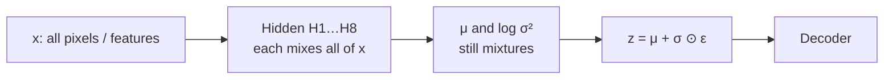
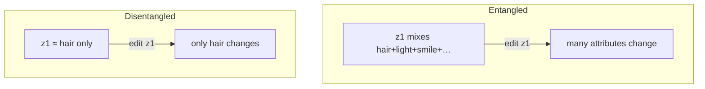
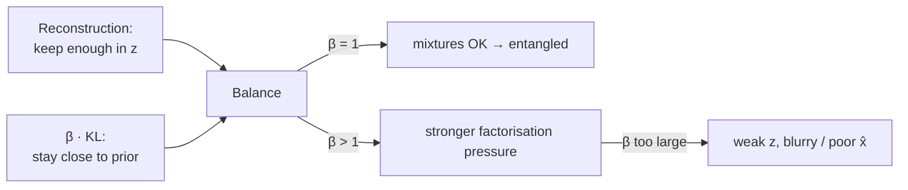
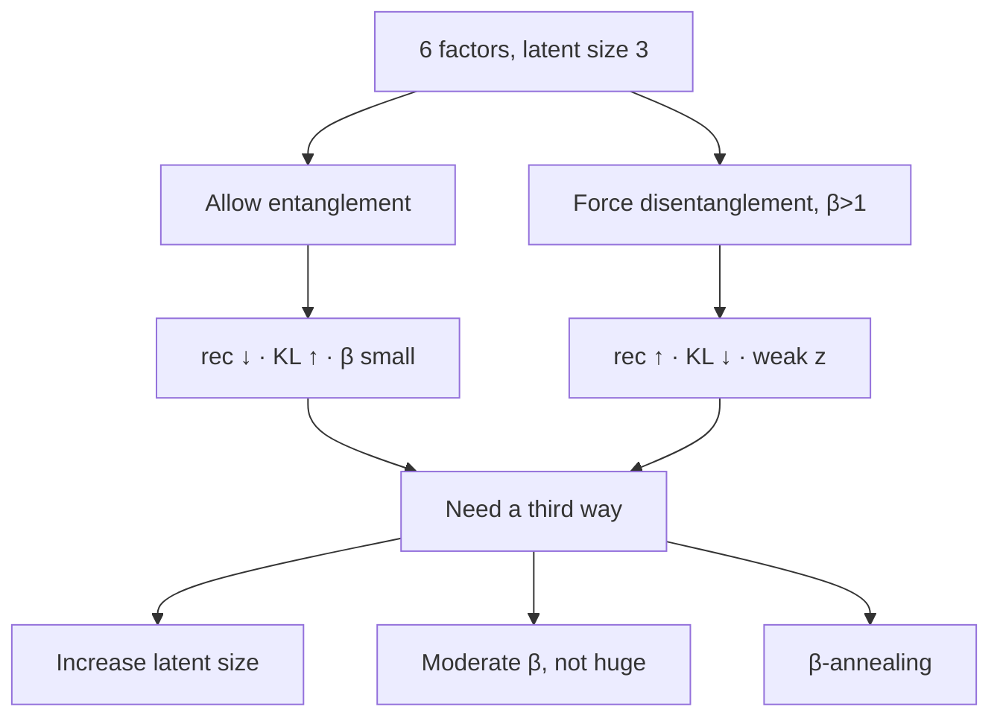

# L26: Entanglement, disentanglement, and β-VAE

**Video:** [Lec 26](https://www.youtube.com/watch?v=nh55anAdRfw) · 50:25  
**Instructor in this lecture:** Prof. Ashwini Kodipalli

### Learning objectives

- Explain why a fully connected encoder produces an **entangled** $z$: each coordinate mixes many factors of variation.
- Contrast that with a **disentangled** latent space, where each $z_i$ mainly controls one factor (hair, lighting, smile, …).
- Write the **β-VAE** loss and say what $\beta=1$ vs $\beta>1$ does to the KL term.
- Use the lecture’s two-dimensional KL examples to connect “small $\mu$” ↔ closer to the prior ↔ one-factor codes.
- List the three practical fixes when there are **more factors than latent dimensions**: larger $z$, moderate $\beta$, **β-annealing**.

### Week 4 agenda (as stated in lecture)

Week 3 already covered how a VAE works, a numerical example, and the **reparameterization trick**. Week 4 is advanced VAEs plus labs. The announced order is:

1. Hands-on VAE (previous practical)
2. Entangled vs disentangled latent space, then **β-VAE** (this lecture)
3. **Conditional VAE**: motivation, loss, numerical example
4. **Latent-space interpolation**
5. Hands-on **β-VAE** and **conditional VAE**

---

## How $z$ is built (and why it mixes factors)

Nothing here is a new architecture. Input $x$ goes through a hidden layer (the slide uses **8 neurons**). Every hidden unit is a combination of **all** $x_1,\ldots,x_n$. From those hidden units the encoder produces **mean** and **log-variance**; convert log-variance → variance → standard deviation; then sample

$$
z = \mu + \sigma \odot \varepsilon, \qquad \varepsilon \sim \mathcal{N}(0, I)
$$

(the reparameterization trick from week 3). Because $\mu$ and $\sigma$ already mix every input coordinate, each sampled coordinate $z_i$ is a **compressed mixture** of the input’s important variations.

**Role of $z$:** a lower-dimensional code that stores the **important variations** of $x$, not a pixel-for-pixel copy.

---

## What “important variations” are

### MNIST digits ($28\times 28 \to 784$)

Not all 784 pixels carry structure. The lecture’s four running factors:

| Factor | What it means on a digit |
|--------|--------------------------|
| **Thickness** | Thin vs thick stroke |
| **Slant** | Tilted vs upright |
| **Rotation** | How the glyph is rotated |
| **Position** | Where the digit sits in the frame |

If the latent size is **4**, you get $z_1,z_2,z_3,z_4$. Those four codes are *meant* to capture those variations — but in a standard VAE they do **not** line up one-to-one.

### Face images

The same idea on faces: **hair**, **lighting**, **skin**, **smile**, **pose**.

---

## Entangled latent space

Because $H_1$–$H_8$ mix all 784 pixels, $\mu$ and $\sigma$ mix them again, and $z$ is sampled from those, **each $z_i$ is a combination of thickness, slant, rotation, and position** (or hair, light, skin, smile, pose).

**Definition used in the lecture:** an **entangled** latent space is one where **changing one latent variable changes multiple properties together**.

If $z_1$ contains a bit of thickness *and* slant *and* rotation *and* position, a small edit to $z_1$ moves all of those at once. You cannot “only thicken the stroke” or “only change the hair.”

---

## Disentangled latent space

The wish: if there are five meaningful factors and latent size **5**, enforce

| Coordinate | Should mainly control |
|------------|------------------------|
| $z_1$ | Hair |
| $z_2$ | Lighting |
| $z_3$ | Skin tone |
| $z_4$ | Smile |
| $z_5$ | Pose |

**Definition:** a **disentangled** latent space learns a **structured** representation in which **each latent dimension focuses on one factor of variation**. Changing one $z_i$ should change mainly **one** property of the generated image; the rest stay (mostly) unchanged.

The lecture’s face grids make the point visually: same person, only hair changes; same person, only smile changes; same person, only pose changes. That is **interpretable, controlled** generation — more variants from editing a single coordinate.

Standard VAE **does not guarantee** this. β-VAE is the lecture’s tool for *encouraging* it.

---

## Standard VAE loss vs β-VAE

The week-3 VAE loss has two terms:

$$
\mathcal{L}_{\text{VAE}} = \underbrace{\mathbb{E}_{q(z\mid x)}\!\big[\text{reconstruction of }x\text{ from }z\big]}_{\text{store enough in }z} + \underbrace{D_{\mathrm{KL}}\!\big(q(z\mid x)\,\|\,p(z)\big)}_{\text{do not store }z\text{ arbitrarily}}
$$

- **Reconstruction:** decoder $z \mapsto \hat{x}$ should match $x$. That forces $z$ to keep **enough** information.
- **KL:** encoder distribution $q(z\mid x)$ should stay close to the **prior** $p(z)$ (standard Gaussian). That forbids stuffing $z$ in an arbitrary way.

Those two already pull in opposite directions. β-VAE does **not** invent a new architecture. It only **reweights the KL**:

$$
\mathcal{L}_{\beta\text{-VAE}} = \text{reconstruction} + \beta\, D_{\mathrm{KL}}\!\big(q(z\mid x)\,\|\,p(z)\big)
$$

| $\beta$ | What the lecture says happens |
|--------:|-------------------------------|
| $=1$ | Same as standard VAE. Mixtures in $z$ are allowed **as long as reconstruction is good**. **No guarantee of disentanglement.** |
| $>1$ | Extra pressure on the KL: $q$ must hug the prior more tightly ($\mu$ near $0$, variances near $1$). That **restricts mixed information** in every latent coordinate and **encourages** disentanglement. |
| Too large | Reconstruction **quality drops** (reconstruction loss rises). Perfect disentanglement is **still not guaranteed**. |

**Punchline:** β-VAE = VAE loss + a **regularization weight** $\beta$ on the KL, with $\beta>1$ when you want disentanglement. Stronger regularization **encourages** a structured $z$; it does **not** certify a perfect one-factor-per-dimension code.

---

## Numerical intuition (latent size $=2$, $\sigma^2=1$)

Take $z=(z_1,z_2)$ with

$$
z_1 = \mu_1 + \sigma_1\,\varepsilon_1, \qquad z_2 = \mu_2 + \sigma_2\,\varepsilon_2, \qquad \varepsilon_i\sim\mathcal{N}(0,1).
$$

For the closed-form KL against $\mathcal{N}(0,1)$, the lecture sets **variance $=1$ for simplicity**. The $\sigma^2-\log\sigma^2-1$ pieces cancel ($\log 1=0$), so KL is driven by the **means**.

$$
D_{\mathrm{KL}} \propto \tfrac12\big(\mu_1^2 + \mu_2^2\big)
\quad\text{(after the variance terms cancel)}
$$

### Case A — disentangled (small means)

Suppose $z_1$ is **thickness only** and $z_2$ is **slant only**. Then $\mu_1$ mainly encodes thickness and $\mu_2$ mainly encodes slant: each mean carries **one** piece of information, so the lecture treats the means as **small**. Example: $\mu=(0.4,\,0.2)$.

$$
\tfrac12\big(0.4^2 + 0.2^2\big) = \tfrac12(0.16+0.04)=0.10
$$

Small KL ⇒ encoder is **close to the prior** ⇒ means near $0$ ⇒ each coordinate is not hoarding a mix of factors.

### Case B — entangled (larger means)

Now each $z_i$ (and therefore each $\mu_i$) mixes **both** factors. Means get **larger**. Example: $\mu=(0.8,\,0.6)$.

$$
\tfrac12\big(0.8^2 + 0.6^2\big) = \tfrac12(0.64+0.36)=0.50
$$

KL $=0.50$ is the lecture’s “50%” figure: encoder mean is **far from** the prior, so $z$ is using **more latent capacity** to store mixed information.

### Case C — even more mixing

Example: $\mu=(1.5,\,0.5)$. $1.5^2=2.25$; KL is **large**. Far-from-zero means ⇒ **more** information packed into $z$ ⇒ entangled codes.

| Setting | Example $\mu$ | KL (with $\sigma^2=1$) | Lecture reading |
|---------|---------------|------------------------|-----------------|
| Disentangled | $(0.4,\,0.2)$ | $0.10$ | close to prior; one factor each |
| Entangled | $(0.8,\,0.6)$ | $0.50$ | far from prior; mixed factors |
| More mixed | $(1.5,\,0.5)$ | large ($\tfrac12(2.25+0.25)=1.25$) | even more capacity used |

The reverse-engineering the lecture wants: **small KL ↔ small $\mu$ ↔ $z_i$ focused on one factor.** $\beta>1$ is extra pressure to keep that KL small.

---

## When there are more factors than latent dimensions

Earlier slides had **four factors and four** $z$-coordinates (a hopeful one-to-one map). Now: **six** important variations, latent size only **three**. Two bad extremes, then three practical knobs.

### Extreme 1 — allow entanglement

Each of $z_1,z_2,z_3$ mixes all six factors so the decoder still sees everything.

- Reconstruction **good** (loss **down**), because $z$ stored a lot.
- Means **grow** ⇒ encoder far from the prior ⇒ **KL up**.
- $\beta$ is kept **small** (no extra disentanglement pressure).

### Extreme 2 — force disentanglement anyway ($\beta>1$)

Three coordinates can lock onto only the **most important** factors; the rest are dropped. $z$ is **weak** ⇒ decoder reconstructs poorly ⇒ **reconstruction loss up**. High $\beta$ keeps means near $0$ ⇒ **KL down**.

Neither extreme is a solution by itself.

### Three knobs the lecture actually gives

1. **Increase the latent size** (hyperparameter / trial-and-error). More dimensions ⇒ more factors can be stored **separately** ⇒ reconstruction improves while KL can stay small.
2. **Tune $\beta$ to a moderate value**, not a huge one. Too-large $\beta$ over-enforces the prior, yields a weak $z$, and reconstruction collapses. Sweep $\beta$ until reconstruction and disentanglement **balance**.
3. **β-annealing.** Start with $\beta=0$ or a **very small** $\beta$ so the KL term is off and the model first learns a **good reconstruction**. Then **raise $\beta$ gradually** so the KL turns on and starts encouraging structure in $z$.

---

### Key takeaways

- Fully connected $\mu,\sigma$ make each $z_i$ a **mixture** of factors: that is **entanglement**. Editing one coordinate moves several attributes.
- **Disentanglement** means one coordinate $\approx$ one factor (hair vs smile vs pose on the face grids; thickness vs slant on digits).
- β-VAE is the VAE loss with weight $\beta$ on the KL. $\beta=1$ is ordinary VAE; $\beta>1$ **encourages** (does not certify) disentanglement; $\beta$ too large **hurts reconstruction**.
- Small $\mu$ ⇒ small KL ⇒ codes closer to the prior and less mixed; large $\mu$ ⇒ large KL ⇒ mixed, high-capacity $z$.
- If factors outnumber latent dimensions, raise **latent size**, use a **moderate $\beta$**, or **anneal $\beta$** from $\approx 0$ upward.

---
