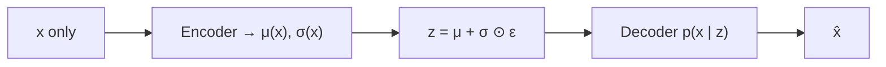
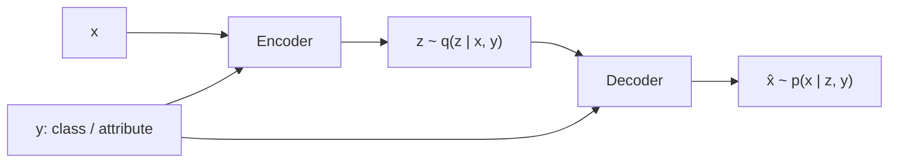
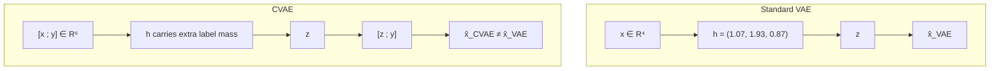

# L27: Conditional VAE

**Video:** [Lec 27](https://www.youtube.com/watch?v=RO7aOFN2vkI) · 23:44  
**Instructor in this lecture:** Prof. Ashwini Kodipalli

### Learning objectives

- Recap the **unconditional** VAE path $x \to z \to \hat{x}$ and why generation is not class-controlled.
- State the CVAE change: extra condition $y$ into **both** encoder and decoder.
- Explain why $z$ in a CVAE can drop class identity and keep **within-class style**.
- Write the CVAE loss as the VAE loss with $y$ inserted, and follow the lecture’s numerical comparison (4 features $\to$ 6 inputs with one-hot $y$).

### What this lecture is *not*

This is the **theory** CVAE session. The Colab is a later practical. Conditional **GANs** are not in this video (the instructor’s slip “conditional GAN” is corrected in-speech to CVAE).

---

## Recap: standard VAE

The model is trained on **$x$ only**. Encoder maps $x$ to a **probabilistic** latent: approximate posterior parameters $\mu(x)$ and $\log\sigma^2(x)$. Sample $z$ with the reparameterization trick

$$
z = \mu(x) + \sigma(x)\odot\varepsilon, \qquad \varepsilon\sim\mathcal{N}(0,I)
$$

Decoder maps $z$ back to data space and produces $\hat{x}$. The lecture writes the decoder as $p(x\mid z)$: probability of the reconstruction given the code.

**Limitation (the whole motivation for this lecture):** generation is **not explicitly controlled**. You cannot ask the decoder for “only digit 5”, “only cats”, “only dogs”, or **extra malignant** medical images, because nothing in the forward pass is a class knob.

---

## Why CVAE: extra guidance $y$

CVAE is an **extension of VAE**, not a new family. Working mechanism stays the same; you add a **condition** $y$ — a **class label** or an **attribute** — to **both** networks:

| Network | Standard VAE input | CVAE input |
|---------|--------------------|------------|
| Encoder | $x$ | $x$ **and** $y$ |
| Reparameterization | $\mu(x),\sigma(x)$ | $\mu(x,y),\sigma(x,y)$ |
| Decoder | $z$ | $z$ **and** $y$ |

$$
z = \mu(x,y) + \sigma(x,y)\odot\varepsilon
$$

$\mu$ and $\sigma$ now **depend on the label**, so the sampled $z$ is already class-aware. At decode time the same $y$ is concatenated again.

**Controlled generation:** at test time you pick $y$ (digit 5, cat, malignant, …) and sample $z$; the decoder is **forced** to emit that class. That is the extra **flexibility** vs a vanilla VAE.

---

## Why $z$ is more efficient in a CVAE

### What $z$ must store in a standard VAE

Pass a handwritten **3**. Then $z$ has to encode **both**:

1. **Style / appearance:** how the 3 is written — thin vs thick, slant vs straight, sharp vs curved.
2. **Class identity:** “this is a 3.”

The decoder sees **only** $z$, so class and style are jammed into the same vector.

### What $z$ must store in a CVAE

$y$ is given to the decoder explicitly. Class identity is **someone else’s job**. $z$ can spend capacity on **variations within that class**:

- thin vs thick
- tilted vs straight
- tall vs short
- curved vs sharp

**Less burden on $z$** → a more efficient code for **style**, plus **controlled** outputs because $y$ is an input, not something $z$ has to memorize.

---

## CVAE loss: same two terms, $y$ in both

The lecture puts the **standard VAE loss** on the board (reconstruction + KL from week 3) and says the CVAE change is **only** that $y$ is passed into the encoder **and** the decoder (and therefore into the reparameterization).

$$
\mathcal{L}_{\text{CVAE}}
= \underbrace{\mathbb{E}_{q(z\mid x,y)}\big[\log p(x\mid z,y)\big]}_{\text{reconstruct }x\text{ given }z\text{ and }y}
- \underbrace{D_{\mathrm{KL}}\big(q(z\mid x,y)\,\|\,p(z\mid y)\big)}_{\text{regularize the encoder, now conditioned on }y}
$$

No new loss family: same reconstruction-vs-KL trade-off, now **conditional** on $y$. The board still shows the **standard VAE loss**; the CVAE edit is “write $y$ next to $x$ at the encoder, next to $z$ at the decoder, and inside $\mu,\sigma$.” That extra input is what yields **class-conditional** generation.

---

## Numerical example (same week-3 VAE problem, plus a label)

The instructor points back to the **week 3 last numerical session**. Recall that problem, then add $y$.

### Standard VAE side (already solved)

Input $x$ had **four features**. After the first hidden layer + ReLU the activations were

$$
(1.07,\; 1.93,\; 0.87)
$$

### CVAE side: concatenate one-hot $y$

Suppose the row belongs to a **binary** class. Then $y\in\{0,1\}$, or as **one-hot**: $(1,0)$ or $(0,1)$.

Running example: treat **Iris** as two classes for the arithmetic (the real Iris set has three; the lecture says so). One-hot $(1,0)$ means “this sample is **Iris setosa**, not versicolor.”

| Object | Dimension |
|--------|-----------|
| $x$ | 4 |
| one-hot $y$ | 2 |
| encoder input $[x;y]$ | **6** |

You need **two extra incoming weights** on every first-layer neuron. After the extra weighted contributions from $y$, the CVAE hidden vector is **larger in magnitude** than $(1.07,\,1.93,\,0.87)$: the label injects **additional weighted information** into the encoded representation.

Then: encode $\mu,\sigma$ from that hidden state, sample $z$ (same reparameterization).

### Decoder input is no longer $z$ alone

Standard VAE decoder input: $z$ only.  
CVAE decoder input: **$[z;\, y]$** with the same one-hot $(1,0)$.

The decoder is told: reconstruct $x$ from this $z$, **conditioned on class $y$**. The reconstructed $\hat{x}$ therefore **differs** from the week-3 VAE reconstruction. Over training you compute the (now conditional) loss, backprop, and update weights/biases until $\hat{x}$ matches $x$.

**Causal chain the lecture wants you to see:**

$$
y \;\to\; \text{hidden }h \;\to\; z \;\to\; \hat{x}
$$

Label $y$ changes the encoder hidden state, which changes $z$, which changes the reconstruction. That is the numerical proof that **conditioning is not a no-op**.

---

### Key takeaways

- Vanilla VAE: $x\to z\to\hat{x}$. You cannot request a **specific class**.
- CVAE: pass **$y$ into encoder and decoder**. Reparameterization becomes $z=\mu(x,y)+\sigma(x,y)\odot\varepsilon$.
- $z$ no longer has to store class identity, so it can store **within-class style**; generation is **controlled** by $y$.
- Loss is the VAE pair (reconstruction + KL) with $y$ in both $q$ and $p$.
- In the reused week-3 example, four features plus a 2-d one-hot become **six** inputs, extra weights, a **richer** hidden code, and a **different** $\hat{x}$.

---
