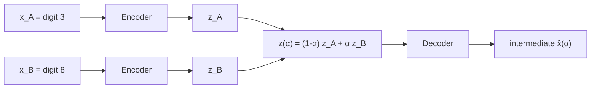
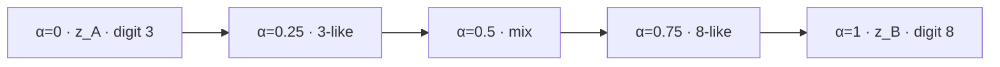

# L28: Latent-space interpolation

**Video:** [Lec 28](https://www.youtube.com/watch?v=z8nEJfojlWo) · 26:59  
**Instructor in this lecture:** Prof. Ashwini Kodipalli

### Learning objectives

- State why interpolation is done in **$z$**, not in pixel space.
- Write the linear blend $z(\alpha)=(1-\alpha)z_A+\alpha z_B$ and evaluate the lecture’s $\alpha\in\{0,0.25,0.5,0.75,1\}$.
- Decode each intermediate $z$ to get a **smooth morph** (digit 3 → digit 8).
- Name the medical **missing-scan** use case (early tumor vs late tumor, nothing in between).

### Week 4 wrap (as stated)

This is the last **theory** session of week 4. The next two videos are hands-on on the week-4 models.

---

## What interpolation is for

A VAE generates by decoding a latent vector. One generation mode is **interpolation**: given two images, produce **in-between** images that sit on a path from one to the other.

Running example: start image **digit 3** ($x_A$), end image **digit 8** ($x_B$). Encode each; the decoder of $z_A$ gives a reconstructed 3 (the lecture’s slide paints it as a colored box **only for visualization** — the real $\hat{x}_A$ is a **slightly blurry 3**, not a solid block). Encode the 8 the same way. You now hold **two codes**. The three **middle** pictures on the slide are **not** extra training images; they are what you are about to **invent**.

You do **not** invent those middle pixels by hand. You:

1. Encode $x_A \to z_A$ and $x_B \to z_B$ (same encoder / reparameterization as week 3).
2. **Mix those two vectors** in a controlled way to get intermediate codes $z^{(1)}, z^{(2)}, z^{(3)}$ (the lecture’s three interior slots).
3. Decode each mixed $z$ to an image.

You **cannot** take only $z_A$ and hope to get a path to 8 — interpolation is **between the two**. The middles must lie **between 3 and 8** in the **learned** latent space, not a random scribble. Between 3 and 8 the pixels *could* be anything; the point of the math is a **systematic** walk, not a guess.

Pixel-space interpolation is **not** what this lecture does. Inputs and outputs are images; the **numbers you blend** are the compressed codes.

---

## Application the lecture actually gives

Medical follow-up: a patient is scanned at an **early** tumor stage, then disappears to another hospital, then returns with a **well-grown** tumor. There is **no intermediate imaging**. For analysis / diagnosis you still want to see **how the tumor could have progressed** (size over time). Encode the early scan and the late scan, interpolate in $z$, decode the path. That is the same 3-to-8 construction with clinical endpoints.

---

## Encoding the two endpoints (latent size $=2$)

Same feed-forward as the week-3 numerical (rewatch that session if the $\mu,\log\sigma^2$ steps are rusty): the digit is a matrix → flatten to a **1-d vector** → hidden layer. Latent size **2** ⇒ **two means and two log-variances**; convert log-variance → variance → $\sigma$; reparameterize.

For image $x_A$ the lecture writes the two coordinates as $z_{A1}, z_{A2}$ (instead of generic $z_1,z_2$) so you never confuse which image they came from:

$$
z_{A1} = \mu_1^{(A)} + \sigma_1^{(A)}\,\varepsilon_1, \qquad
z_{A2} = \mu_2^{(A)} + \sigma_2^{(A)}\,\varepsilon_2
$$

After the arithmetic you hold a 2-d vector $z_A$. That is the “we have reached this step” mark on the 3-to-8 cartoon: first image encoded.

Pass $x_B$ through the **same** encoder (same weights). You get $z_B=(z_{B1},z_{B2})$. The lecture drops in a **worked $z_B$** after that feed-forward (the numbers live on the slide; the method is ordinary VAE encoding). **No interpolation yet** — only two encodings sitting as numeric vectors, which is the only place mixing is well-defined.

---

## The interpolation formula

You need a **systematic** mix, not “pick a random $z$.” The lecture’s formula:

$$
z(\alpha) = (1-\alpha)\, z_A + \alpha\, z_B, \qquad \alpha \in [0,1]
$$

$\alpha$ is the **interpolation parameter**: how far to walk from $z_A$ toward $z_B$.

| $\alpha$ | Algebra | Whose code you get |
|--------:|---------|---------------------|
| $0$ | $1\cdot z_A + 0\cdot z_B$ | exactly $z_A$ → decode to image **3** |
| $1$ | $0\cdot z_A + 1\cdot z_B$ | exactly $z_B$ → decode to image **8** |
| in between | a convex combination | a code **on the segment** $z_A\to z_B$ |

The slide’s interior knots: $\alpha=0.25,\;0.50,\;0.75$.

Because $z$ is **two-dimensional**, expand componentwise:

$$
\begin{aligned}
z_1(\alpha) &= (1-\alpha)\, z_{A1} + \alpha\, z_{B1} \\
z_2(\alpha) &= (1-\alpha)\, z_{A2} + \alpha\, z_{B2}
\end{aligned}
$$

Every intermediate is still a **2-vector**, so it is a legal decoder input.

### Worked $\alpha=0.25$ (as spoken)

$1-\alpha=0.75$, so you take **75% of $z_A$** and **25% of $z_B$**:

$$
z(0.25) = 0.75\, z_A + 0.25\, z_B
$$

The resulting coordinates sit **closer to $z_A$ than to $z_B$**. Decoded, the image should look **3-like**, not yet an 8.

### Worked $\alpha=0.5$ and $\alpha=0.75$ (same substitution)

Same two-line expansion, new $\alpha$.

- $\alpha=0.5$: $1-\alpha=0.5$ → **50% / 50%** mix (the most “between” 3 and 8).

$$
z(0.5) = 0.5\, z_A + 0.5\, z_B
$$

- $\alpha=0.75$: $1-\alpha=0.25$ → **25% of $z_A$, 75% of $z_B$** → 8-like.

$$
z(0.75) = 0.25\, z_A + 0.75\, z_B
$$

The lecture calls $\alpha$ a **hyperparameter / interpolation parameter** that **controls the movement** from $z_A$ to $z_B$. Allowed range is **only $[0,1]$**.

Plug the slide’s $z_{A1},z_{A2},z_{B1},z_{B2}$ into that pair of lines; the first output component uses only the “1” coordinates, the second only the “2” coordinates. The lecture’s slide numbers for $z_A$ and $z_B$ are read off the board (same numerical pipeline as week 3); the **method** is the mix above.

**What “closer” means at $\alpha=0.25$:** compare $z(0.25)$ to $z_A$. The lecture’s board values sit **near** $z_A$ (first component a bit smaller, second a bit larger than $z_A$ — not a copy). Decode that and you should get a **3-like** glyph, not an 8. Each later $\alpha$ is a little less like 3 and a little more like 8.

You pass each $z(\alpha)$ through the **same decoder**:

| Code you decode | Image you should see |
|-----------------|----------------------|
| $z_A = z(0)$ | $\hat{x}_A$ (reconstructed 3) |
| $z(0.25)$ | 3-like intermediate |
| $z(0.50)$ | mixed 3/8 |
| $z(0.75)$ | 8-like intermediate |
| $z_B = z(1)$ | $\hat{x}_B$ (reconstructed 8) |

You are **not** jumping randomly in $z$. You move **smoothly along the line segment** in the **learned** latent space: a bit more of $z_B$, a bit less of $z_A$, decode, repeat.

**Portion language the lecture uses:**

| $\alpha$ | Mix |
|--------:|-----|
| $0.25$ | **75%** $z_A$ + **25%** $z_B$ |
| $0.50$ | **50% / 50%** |
| $0.75$ | **25%** $z_A$ + **75%** $z_B$ |

Decoded sequence: digit 3 → 3-like intermediate → mixed 3/8 → 8-like → digit 8. That slow, **ordered** change is the generation trick: you only owned two photographs, but latent mixing **manufactures** the in-betweens.

The closing diagram (faces morphing from one photo toward another) is credited to an **internet source / author** on the slide. Same geometry: as you walk $\alpha$, the picture **gradually** becomes the second endpoint. Use this whenever **intermediate observations are missing** but you still need to **analyze** that gap (tumor-progression example). Week 4 theory ends here; the next two sessions are **hands-on**.

---

### Key takeaways

- Interpolation for generation happens in **latent space**, then you **decode**. You cannot mix the two photographs directly and call it a VAE interpolation.
- $z(\alpha)=(1-\alpha)z_A+\alpha z_B$ with $\alpha\in[0,1]$. Endpoints recover the two encodings; $0.25/0.5/0.75$ are the lecture’s interior steps.
- Componentwise mix if $\dim z>1$. Each mixed $z$ has the **same** length as $z_A$ and $z_B$.
- Visual result: a **systematic** morph (3 → 3-like → mix → 8-like → 8), useful when **intermediate observations are missing** (tumor-progression example).

---
