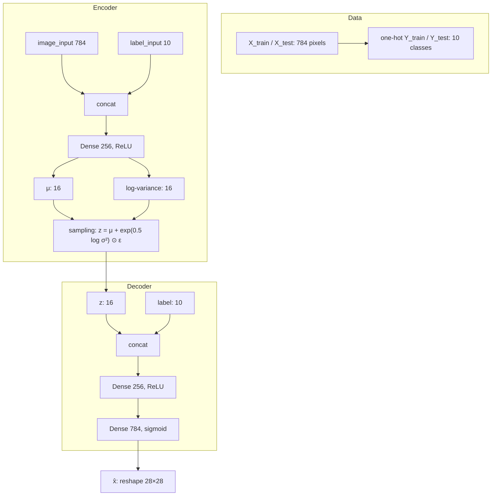

# L29: Practical exercise 2 — Conditional VAE

**Video:** [Lec 29](https://www.youtube.com/watch?v=f9FV2DbbxnA) · 26:31

### Learning objectives

- Build a **CVAE** on **MNIST** in TensorFlow/Keras, using the **same** $28\times 28$ digits as the previous VAE lab so the two are comparable.
- One-hot the labels, concatenate $y$ to **encoder and decoder**, keep the VAE sampling layer.
- Train with **BCE reconstruction + KL**, **Adam**, and generate a **class-specific** digit (the demo uses **7**).

### What this lecture is *not*

This is **practical exercise 2**, the **CVAE** Colab. It is *not* the first VAE lab and *not* the β-VAE lab (next video). Filename aside, every step below is CVAE as taught here.

---

## Why CVAE after the VAE lab

VAE $z$ is already smoother than a plain autoencoder (mean, variance, and $\varepsilon$ noise → interpolation between samples is smoother). The **stated drawback**: reconstruction **ignores the class label**, so reconstructions are **poor** / not class-specific.

CVAE keeps the same latent

$$
z = \mu + \sigma\odot\varepsilon
$$

but the decoder (and encoder) also see the **label**. The demo calls this a **conditional / posterior** path: generation depends on the image **and** $y$.

---

## 1. Libraries

| Import | Role in this notebook |
|--------|------------------------|
| **TensorFlow** | Deep-learning framework |
| **Keras `layers`, `Model`** | Input / hidden / output layers; wrap encoder, decoder, CVAE |
| **NumPy** | Arrays; one-hot is numeric |
| **`matplotlib.pyplot` as `plt`** | Show the generated digit |

---

## 2. Dataset and preprocessing

**Dataset:** **MNIST** (same as the VAE hands-on), handwritten digits **0–9**, **10 classes**.

From `keras.datasets` load into `X_train`, `Y_train`, `X_test`, `Y_test`. **Unlike the VAE lab, keep $Y$** — that is the whole CVAE difference at data time.

1. Cast images to **float**.
2. **Normalize** by dividing by **255** (grayscale intensities $0$–$255$ → $[0,1]$). Same reason as the previous lab.
3. **Reshape** $28\times 28$ → **784** features. The spoken “$-1$” is the batch / flatten convention so each row is one digit vector.

---

## 3. One-hot encoding (CVAE-only step)

Integer labels $0,\ldots,9$ become length-**10** binary vectors (one **1**, rest **0**). Vector length **equals the number of classes**.

| Digit | One-hot (length 10) |
|------:|---------------------|
| 0 | `1 0 0 0 0 0 0 0 0 0` |
| 1 | `0 1 0 0 0 0 0 0 0 0` |
| 2 | `0 0 1 0 0 …` |
| 9 | `0 0 0 0 0 0 0 0 0 1` |

Code path: `tensorflow.keras.utils.to_categorical` on `Y_train` and `Y_test` with **10** classes.

---

## 4. Sampling layer (same math as VAE)

Extra hyperparameter vs the VAE lab: **`num_classes = 10`**. Latent size stays **`latent_dim = 16`**.

Inputs to the sampling layer: $\mu$ and log-variance. $\varepsilon\sim\mathcal{N}(0,I)$ from TensorFlow’s random normal, **shape copied from $\mu$** (length 16).

$$
z = \mu + \exp(0.5\cdot \log\sigma^2)\odot\varepsilon
$$

(The $\exp(0.5\cdot)$ conversion from log-variance to $\sigma$ was derived in the previous VAE hands-on.)

---

## 5. Encoder

| Piece | Spec as coded |
|-------|----------------|
| `image_input` | `Input(shape=784)` |
| `label_input` | `Input(shape=10)` |
| Encoder input | **concatenate** image then label |
| Hidden | **Dense 256, ReLU** |
| Heads | Dense **16** for $\mu$, Dense **16** for log-variance |
| $z$ | sampling layer on $(\mu, \log\sigma^2)$ |
| `Model` inputs / outputs | `[image_input, label_input]` → $z$ (via $\mu,\sigma$) |
| Name | `"encoder"` |

**ReLU reminder from the demo:** $\mathrm{ReLU}(x)=\max(0,x)$ — zeros negatives, keeps positives; used here for non-linearity (as in the other GenAI labs).

Previous VAE lab used **only $X$**. Here both $X$ and $Y$ are encoder inputs.

---

## 6. Decoder

| Piece | Spec as coded |
|-------|----------------|
| Latent input | shape **16** |
| `label` for decoder | shape **10** |
| Decoder input | **concatenate** $z$ then $y$ |
| Hidden | **Dense 256, ReLU** |
| Output | **Dense 784, sigmoid** |
| Why sigmoid | pixels were scaled to $[0,1]$; sigmoid emits probabilities in $[0,1]$ |
| `Model` | `[z, y] → 784` , name `"decoder"` |

Three blocks in the notebook: **encoder, sampling, decoder**.

---

## 7. CVAE wrapper and training step

Keras `Model`: image + label in; encoder produces $z$ from $\mu,\sigma$; decoder reconstructs from **$(z,y)$**. $z$ is a **distributional** code (not a single autoencoder bottleneck point).

**Backprop reminder** (as spoken):

$$
W \leftarrow W - \eta \frac{\partial L}{\partial W}
$$

**Loss — same two terms as the VAE lab**, now with labels in the forward pass.

**Reconstruction:** binary cross-entropy between the **image** $x$ and $\hat{x}$ (not the class index):

$$
\mathrm{BCE} = -\Big(x\log\hat{x} + (1-x)\log(1-\hat{x})\Big)
$$

Then `tf.reduce_mean` so you average over the batch / pixels (the demo also mentions averaging across the **16** latent-related terms as in the previous lab).

**KL** (same closed form as the VAE demo):

$$
D_{\mathrm{KL}} = -\frac12\sum \big(1 + \log\sigma^2 - \mu^2 - \sigma^2\big)
$$

**Total:** reconstruction + KL. Optimizers differ by momentum / mean / variance bookkeeping; this notebook uses **Adam** because it already tracks mean and variance estimates — the same statistics the VAE latent uses.

---

## 8. Fit

- Data: **`X_train` and `Y_train`** (VAE lab **dropped** `Y_train`).
- **Epochs:** 10 (as run).
- **Batch size:** 128 or 256 (demo: smaller batch ⇒ more weight updates per epoch ⇒ typically lower loss, but you still tune batch size).
- Optimizer: **Adam**.

### Losses to read off the log (end of epoch 10)

| Term | Value spoken |
|------|----------------|
| Reconstruction | $0.21$ |
| KL | $1.05\times 10^{-5}$ |
| **Total** | **$0.2160$** |

**Observation they want:** this total is **lower** than the previous VAE lab, because reconstructions are **class-specific** instead of a generic blur across digits.

---

## 9. Generate a chosen digit

1. Sample a random $z\sim\mathcal{N}(0,I)$ of shape `(1, 16)` — **one** digit, 16 latent coordinates.
2. Build a **label**: digit **7**, `to_categorical(..., num_classes=10)`.
3. `decoder.predict([z, label])`.
4. Reshape **$28\times 28$**, `cmap='gray'`, axes off.

**What to observe:** a recognizable **7**. The VAE lab sampled **random** digits with **no** class control (10 or 20 images, mixed classes). CVAE’s advantage here: **class separation** plus the same flexible $z$ (mean + variance, not a fixed autoencoder point), so interpolation between samples stays smooth **and** you can request a class.

---

### Key takeaways

- CVAE = VAE sampling + **one-hot $y$ concatenated on both sides**.
- MNIST, 784, latent **16**, hidden **256 ReLU**, output **sigmoid 784**, **Adam**, **10** epochs, batch **128/256**.
- Loss is still **BCE + KL**; epoch-10 total **$0.2160$**, smaller than the unconditioned VAE run.
- Decode $(z, y{=}7)$ to emit **that** class on demand.

---
