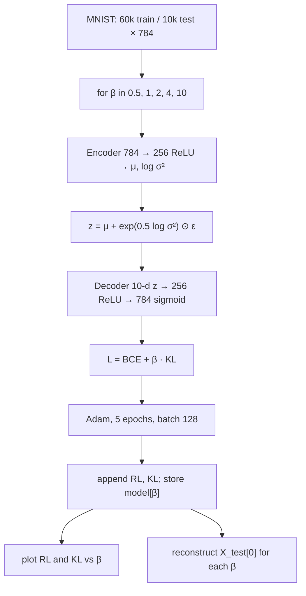

# L30: Practical exercise 3 — β-VAE

**Video:** [Lec 30](https://www.youtube.com/watch?v=9TlyLSpTq4Y) · 35:13

### Learning objectives

- Implement **β-VAE** on MNIST: same encoder/decoder skeleton as the VAE labs, with a scalar **$\beta$ multiplying the KL**.
- Sweep $\beta\in\{0.5,1,2,4,10\}$ and record reconstruction vs KL.
- Read the plot **“effect of beta on beta variational autoencoder”** and the reconstructed **digit 7** as $\beta$ grows.

### What this lecture is *not*

This is **practical exercise 3**, the **β-VAE** Colab. The CVAE notebook was the **previous** hands-on. Labels $y$ are **dropped** here (underscores on the Keras load).

---

## Why β-VAE in code

Previous labs: total VAE loss = **reconstruction + KL**. Here a hyperparameter **$\beta\ge 0$** (no upper bound stated) scales the KL:

$$
\mathcal{L} = \mathrm{RL} + \beta\cdot D_{\mathrm{KL}}
$$

**$\beta=1$** recovers the **standard VAE** equation $\mathrm{RL}+\mathrm{KL}$.

The TA’s setup speech: a plain VAE pushes $q(z\mid x)$ toward the prior so hard that $z$ can become **too constrained** to hold complex structure. β-VAE is the **knob** between reconstruction and that KL. The **experiment** then shows the trade-off the theory lecture already named: **raise $\beta$** ⇒ more weight on KL ⇒ **KL falls**, **reconstruction loss rises**, decoded digits get **worse**, while the latent is under **stronger** prior pressure (the same video later calls this **more disentanglement**).

Finding a **good $\beta$ is hard** — that is why this notebook trains **five** models.

---

## 1. Libraries

Same stack as the other VAE labs: **TensorFlow** as `tf`; Keras **`layers`** and **`Model`**; **NumPy** as `np`; **`matplotlib.pyplot` as `plt`**.

---

## 2. Dataset (no labels)

**MNIST** again, so you can compare autoencoder / VAE / CVAE / β-VAE on the **same** digits 0–9.

Load train/test; **ignore $Y$** (`_` placeholders). CVAE needed labels; this model does not.

1. Float cast.
2. Divide by **255**. Spoken mini-example: a $3\times 3$ grayscale patch with entries such as 5, 10, 0, 255 becomes $5/255$, $10/255$, $0$, $1$ — range **$[0,1]$**.
3. Reshape with `-1` and **784** ($28\times 28$).

**Printed shapes:**

| Split | Samples | Features |
|-------|--------:|---------:|
| Train | **60,000** | 784 |
| Test | **10,000** | 784 |

---

## 3. Hyperparameters

| Name | Value in the demo |
|------|-------------------|
| Latent dimension | **10** (784 down to 10 codes). The sampling-layer recap still says “16” once — leftover wording from the VAE lab; the **decoder input and the run** use **10**. |
| $\beta$ grid | **`[0.5, 1, 2, 4, 10]`** |
| Epochs | **5** (kept small because **five models** train; you may raise it) |
| Batch size | **128** |
| Optimizer | **Adam** |
| `verbose` | **1** (one-line loss print per epoch) |

Sampling math (unchanged):

$$
z = \mu + \sigma\odot\varepsilon, \qquad \varepsilon\sim\mathcal{N}(0,1)
$$

$\sigma=\exp(0.5\log\sigma^2)$; $\varepsilon$ shape matches $\mu$.

---

## 4. Sampling layer, encoder, decoder

**Sampling:** unpack $(\mu, \log\sigma^2)$ from the encoder; draw Gaussian $\varepsilon$; return $z=\mu+\exp(0.5\log\sigma^2)\odot\varepsilon$.

**Encoder**

| Layer | Spec |
|-------|------|
| Input | 784 |
| Hidden | **Dense 256, ReLU** — $\max(0,x)$ (example: $-10\to 0$, $100\to 100$) |
| $\mu$ head | Dense, width = latent dim |
| log-var head | Dense, width = latent dim |
| $z$ | sampling |
| `Model` | input → $(\mu, \log\sigma^2, z)$ |

**Decoder** — reverse of the encoder:

| Layer | Spec |
|-------|------|
| Input | latent dim **10** |
| Hidden | **Dense 256, ReLU** |
| Output | **Dense 784, sigmoid** $\sigma(x)=1/(1+e^{-x})\in(0,1)$ as $x$ runs over $\mathbb{R}$ — matches normalized pixels |
| Reshape | **$28\times 28$** for display |

`super()` in the custom `Model` subclass: initialize the parent TensorFlow model correctly.

---

## 5. Loss trackers and train step

Three Keras **metrics** (`Mean`), so each epoch reports averages rather than a single noisy outlier:

| Tracker name shown in logs | Quantity |
|----------------------------|----------|
| `loss` | total $\mathrm{RL}+\beta\cdot\mathrm{KL}$ |
| `reconstruction_loss` | mean BCE |
| `kl_loss` | mean KL |

`@property` on `metrics` so TensorFlow can pick them up automatically.

**Train step (as spoken):** predict → loss → gradients → weight update

$$
W_{\text{new}} = W_{\text{old}} - \eta\,\frac{\partial L}{\partial W}
$$

Encoder yields $z$ from $(\mu,\sigma)$; decoder sees $z$ only (no $y$).

**BCE** between true image $x$ and reconstruction $\hat{x}$ (they write $y,\hat{y}$ for that pair):

$$
\mathrm{BCE} = -\big(x\log\hat{x} + (1-x)\log(1-\hat{x})\big)
$$

then **mean**.

**KL** (same formula as the VAE hands-on):

$$
D_{\mathrm{KL}} = -\frac12\sum\big(1+\log\sigma^2-\mu^2-\sigma^2\big)
$$

**Only difference vs vanilla VAE:** multiply KL by **$\beta$**. Gradients of that total update weights; **Adam** as usual.

Trackers `.update_state` on total / RL / KL so you can **history** five $\beta$s and plot them. Return the three scalar losses.

---

## 6. Train one model per $\beta$

Empty lists for reconstruction losses and KL losses; a **dictionary** `trained_models[β] = model` (key = β, value = that run’s network).

For each $\beta$: build encoder + decoder + β-VAE, `compile` with **Adam**, `fit(X_train, epochs=5, batch_size=128, verbose=1)`, **append** the final RL and KL.

### Numbers read from the fifth epoch

| $\beta$ | Reconstruction | KL | Total (if spoken) |
|--------:|---------------:|---:|-------------------|
| 0.5 | **19.02** | **9.95** | **24.0081** |
| 1 | **22.35** (higher RL) | **5.55** (lower KL) | — |
| 2 | **27.79** | **1.96** | — |
| 4, 10 | RL keeps rising, KL keeps falling (plot) | | |

**Pattern they hammer:** **as $\beta$ increases, reconstruction loss increases and KL decreases.** Reconstruction **quality** gets **poor** if $\beta$ is too large — pick a **balance**.

---

## 7. Plot: effect of $\beta$

- `figsize=(8, 5)`
- Reconstruction vs $\beta$: marker **`'o'`**
- KL vs $\beta$: marker **`'s'`** (square)
- xlabel **beta**, ylabel **loss**
- title **“effect of beta on beta variational autoencoder”**
- **legend** + **grid**

**What the curve shows:** $\beta$ from 0 to 10; **blue reconstruction line goes up**; **KL line goes down**. Balance is “challenging.”

---

## 8. Reconstruct one test digit across $\beta$

- Sample: `X_test[0:1]` (index **0**).
- Subplots: `len(betas)+1` (original + five reconstructions), `figsize=(15, 3)`.
- Encode the sample → $z$ from $\mu,\sigma$ → decode → reshape **$28\times 28$**, `cmap='gray'`, axes off, title with that $\beta$.

**What to observe:**

| Panel | Spoken result |
|-------|----------------|
| Original | label **7** |
| $\beta=0.5$ | reconstruction still a 7 |
| $\beta=1$ | still readable as 7 |
| larger $\beta$ | quality **degrades**; at **$\beta=10$** it may look like **3 or 9**, not 7 |

Same story as the loss table: **higher $\beta$ → worse pixels**, **stronger structure / disentanglement pressure** on $z$. **Optimal $\beta$** is the point of the lab.

The closing claim: with a **well-chosen** $\beta$, β-VAE can stay near the prior **and** still capture complex factors, so it can beat a default VAE — **provided** $\beta$ is not wild.

---

### Key takeaways

- β-VAE loss: $\mathrm{RL}+\beta\cdot\mathrm{KL}$. $\beta=1$ is vanilla VAE; sweep **0.5, 1, 2, 4, 10**.
- MNIST **60k / 10k × 784**, latent **10**, **256 ReLU**, **sigmoid 784**, **Adam**, **5** epochs, batch **128**, **no** labels.
- Measured trade-off: $\beta\uparrow$ ⇒ **RL↑, KL↓**, digit **7** turns to mush by $\beta=10$.
- Plot title and markers as above; use the trackers so all five runs are comparable.

---
