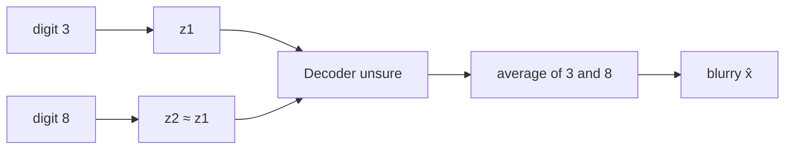
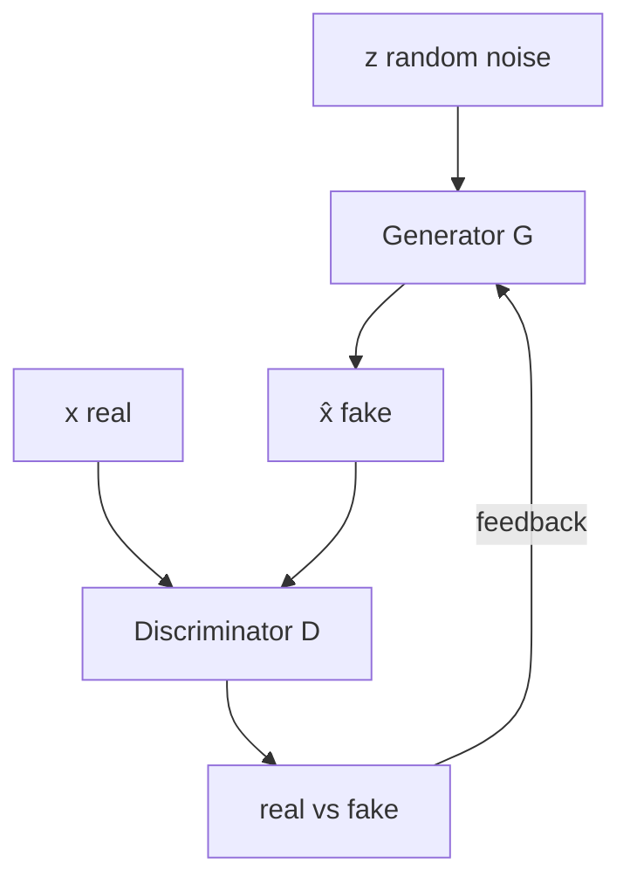

# L31: Motivation for GANs

**Video:** [Lec 31](https://www.youtube.com/watch?v=nrzPtPnz2Js) · 27:55  
**Instructor in this lecture:** Prof. Ashwini Kodipalli

### Learning objectives

- List the **six VAE limitations** this lecture uses as the reason to leave explicit likelihoods.
- State the GAN **motivation** in one sentence: realistic samples **without** a prescribed $p(x)$ or reconstruction loss.
- Define **adversarial learning** as two networks that compete: **generator** vs **discriminator**.

### Week 5 agenda (as stated)

Week 5 is **generative adversarial networks** (foundations for week 6’s variants):

1. VAE limitations and **motivation for GANs** (this lecture)
2. Idea of **adversarial learning**
3. **GAN architecture**: generator and discriminator
4. **Objective / loss**, how training runs, **convergence / equilibrium**
5. First variant: **DCGAN** (deep convolutional GAN)
6. Two labs: **basic GAN** and **DCGAN**

DCGAN, Nash equilibrium, and the labs are **later videos**. This one stops after limitations + motivation + the adversarial story.

---

## Six limitations of VAEs

All of these are reasons the generated pictures look **blurry / less realistic**, mostly from **Gaussian assumptions**, **likelihood choice**, and **pixel reconstruction**.

### 1. Gaussian assumptions

Two Gaussians are baked in:

| Piece | Assumption |
|-------|------------|
| Approximate **posterior** $q(z\mid x)$ | **Gaussian**, so the encoder only emits $\mu$ and $\log\sigma^2$ |
| **Prior** $p(z)$ | **standard normal** $\mathcal{N}(0,I)$ |

Training is **easy** under those choices. Real data need not be that simple. If the world has a **complicated structure**, the Gaussian pair is a mismatch — first limitation.

### 2. Blurry images from pixel-wise reconstruction

VAEs usually reconstruct with a **pixel-wise** loss (often **MSE**) comparing $\hat{x}$ to $x$.

Thought experiment: encode image “3” → $z_1$, encode “8” → $z_2$. If for some reason $z_1\approx z_2$, the decoder is handed **almost the same code** for two different digits. It has seen **different** $z$s in training, so it is **not sure** whether to emit a 3 or an 8. It **averages**. Averaging **washes out sharp edges and fine detail** → a **blurry** image. Second limitation: VAEs **sometimes produce blurry images**.

### 3. Reconstruction vs KL trade-off

VAE loss = reconstruction + KL.

- Reconstruction wants $\hat{x}\approx x$, i.e. decoder output **approximately equal** to the input. That only happens if $z$ is a **good** code, so the encoder tries to **store a lot** about $x$ in $z$.
- KL wants the encoder’s distribution and the prior to stay **as close as possible**. That **prevents** the encoder from packing too much **input-specific** information into $z$ (otherwise $q$ would drift far from $\mathcal{N}(0,I)$).

One term says “store maximum information”; the other says “don’t.” Improving one **reduces** the other. Third limitation: an inherent **trade-off**. (Week 4’s $\beta$ only **moves** that trade-off; it does not remove it.)

### 4. Posterior collapse

KL is near **0** only when $q(z\mid x)$ is almost **identical** to the prior. The prior is $\mathcal{N}(0,1)$ per coordinate. An easy cheat under “make $q$ look like the prior”: for **every** $x$, emit $\mu=0$, $\sigma=1$. Then KL vanishes, but $z$ is **uninformative** — the same $(\mu,\sigma)$ (hence a useless $z$) for every input. Extra KL pressure (the week-4 $\beta$ story) makes this cheat **more** tempting.

**Ideal VAE:** $x\to$ encoder $\to\mu,\log\sigma^2\to$ reparameterize $z\to$ decoder uses **that** $z$ (which still carries $x$) $\to\hat{x}$. Different $x$ should yield different informative $z$.

**Collapse:** input $x_1$ maps to a $z_1$ glued to the prior; $x_2$ maps to a $z_2$ also glued to the prior. $z$ no longer tells the decoder **which** $x$ it came from. The decoder then reconstructs **ignoring $z$**, from whatever it already learned: **autoregressive** decoder for **text**, **CNN / non-autoregressive** decoder for **images**. One-line definition: posterior $\approx$ prior for all $x$ ⇒ $z$ is empty ⇒ decoder does not use $z$.

### 5. Likelihood assumption

The decoder outputs **parameters of a chosen distribution**, not “pixels” in the abstract. Those **predefined choices** are the **likelihood assumption**, and they **pick the reconstruction loss**:

| Data type | Decoder emits | Distribution | Reconstruction loss |
|-----------|---------------|--------------|---------------------|
| Continuous | means | **Gaussian** | **MSE** |
| Binary | per-bit probabilities | **Bernoulli** | **BCE** |

Week 3’s numerical already did this: the four or five decoder coordinates **are** Gaussian means. If the chosen likelihood is **too simple**, **too smooth**, or **does not match** complicated real characteristics, the decoder **cannot represent output uncertainty** accurately → again **blurry / less realistic** $\hat{x}$. Fifth limitation: a **predefined likelihood**.

### 6. Missing fine detail

Even when global structure is fine, VAEs miss **sharp edges, fine texture, small facial details**. Samples look **smooth** but **less realistic**. This is the last limitation on the slide; it is mostly a **symptom** of (1), (2), and (5).

| # | Limitation | One-line cause |
|---|------------|----------------|
| 1 | Gaussian assumptions | Posterior and prior both forced Gaussian |
| 2 | Blurry images | Pixel MSE; decoder **averages** when two $z$s collide |
| 3 | Rec ↔ KL trade-off | Store more in $z$ vs stay near the prior |
| 4 | Posterior collapse | $\mu=0,\sigma=1$ for every $x$ ⇒ empty $z$ |
| 5 | Likelihood assumption | Gaussian/Bernoulli choice sets MSE vs BCE |
| 6 | Missing fine detail | Structure yes; texture / edges / faces no |

Stack those six and the common failure mode is **blurry / unrealistic samples**, caused by the **Gaussian pair**, the **likelihood choice**, and **pixel reconstruction**. VAEs still capture **overall structure**; they miss the last mile of realism.

## Motivation for GANs

VAE’s *aim* was already “$\hat{x}$ close to $x$.” The blocker is **how** it gets there (explicit $p$, reconstruction). If you want another model, it should generate **highly realistic** data **without**:

1. explicitly defining a **probability distribution**, and
2. a **reconstruction loss**.

No “probability part” in the training loop in the VAE sense. That is the **motivation for GANs** as stated here.

---

## Adversarial learning (the “A” in GAN)

**Adversarial** in English: **in conflict / competing**. Competition needs **two** players. Here both players are **neural networks**. They **learn by competing**.

| Network | Letter | Job |
|---------|--------|-----|
| **Generator** | $G$ | Map random noise $z$ to a **fake** sample $\hat{x}=G(z)$. Goal: fakes that **look real**. |
| **Discriminator** | $D$ | See **real** $x$ and **fake** $\hat{x}$; output which is which. Goal: **correctly** tell real from generated. |

**Competition loop** (repeat for many rounds):

1. Generator emits fakes from noise.
2. Discriminator classifies real vs fake.
3. Generator uses the discriminator’s **prediction as feedback** and improves.
4. Over time $G$ **gradually** learns more realistic samples **while** $D$ gets better at the real/fake call.

If $D$ tags an image as generated and that verdict is fed back, $G$ can **correct itself**. Both sides keep raising their game: $G$ “constantly puts in effort” to look real; $D$ “puts in effort” to stay accurate. The **end state this lecture wants** is an image **close to the original data** — without ever writing $p(x)$ or a pixel reconstruction term.

Learn the two roles **separately**, then lock them:

- $D$ learns to distinguish **real samples** from **fakes produced by $G$**.
- $G$ learns to generate samples so $D$ **cannot easily** tell generated from real.
- $G$ **only** generates. Fuel = noise $z$. Ambition = fakes that could pass as data.
- $D$ **only** judges. Fuel = real $x$ **and** $G$’s fakes. Ambition = a correct real/fake call.

Then turn on the fight: $G$ works **harder** so $D$ **fails** to spot fakes; $D$ gets **stronger** so it still spots them. $G$ tries to **fool** $D$; $D$ tries **not** to be fooled. That two-player fight is **adversarial learning**. The **next** lecture puts numbers on $G$ and $D$ (architecture, losses, backprop). This video’s closer: limitations of VAE + why GAN + this competition picture — not yet the full $G$/$D$ diagrams.

---

### Key takeaways

- VAEs are limited by **Gaussian posterior/prior**, **pixel MSE averaging** (3 vs 8 with similar $z$), **rec↔KL trade-off**, **posterior collapse**, **likelihood choice**, and **missing fine texture**.
- GAN motivation: realistic samples **without** writing $p(x)$ or a reconstruction term.
- GAN = two nets: $G(z)\to$ fakes, $D$ scores real vs fake; they **compete** and $G$ trains on $D$’s feedback.

---
