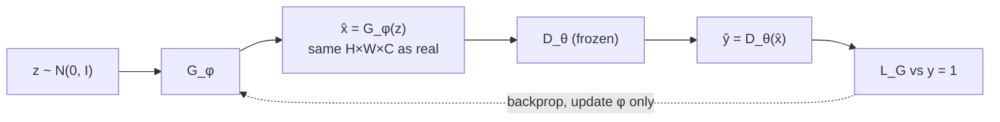
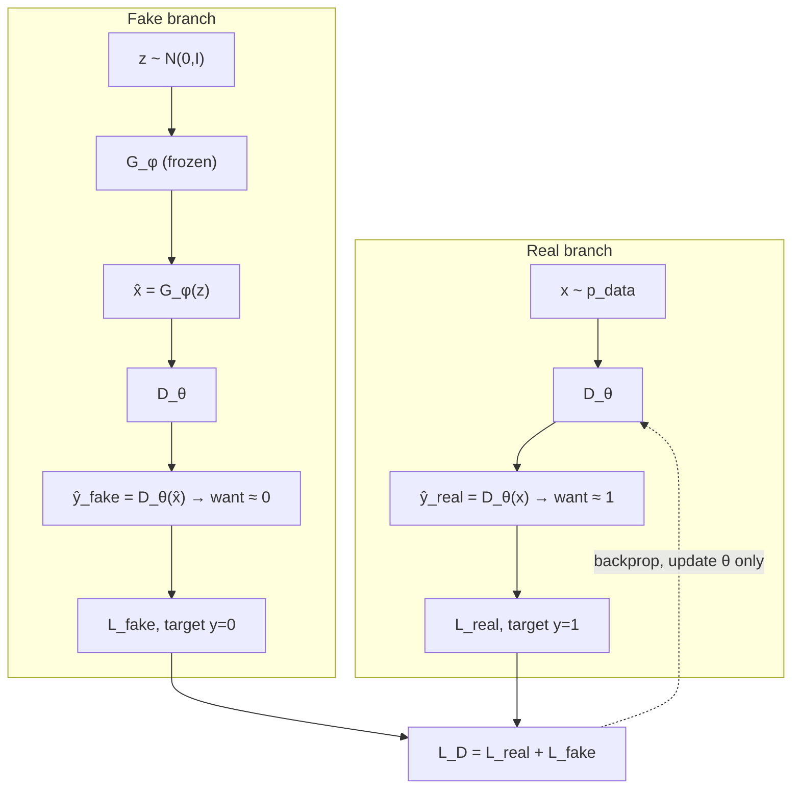

# L32: GAN architecture

**Video:** [Lec 32](https://www.youtube.com/watch?v=uWm5rUJpZ_4) · 50:13  
**Instructor in this lecture:** Prof. Ashwini Kodipalli

### Learning objectives

- Trace **generator training**: $z\to G_\phi(z)=\hat{x}\to D_\theta(\hat{x})=\hat{y}$, BCE with **target $y=1$**, update **only $\phi$**.
- Trace **discriminator training**: real branch ($y=1$) and fake branch ($y=0$), $L_D=L_{\text{real}}+L_{\text{fake}}$, update **only $\theta$**.
- Derive both losses from **binary cross-entropy** and write the chain-rule updates.
- Reproduce the lecture’s probability examples ($0.2$ vs $0.9$ / $0.8$).

### Notation in this course

This video (and the next) uses **$\phi$ for generator** parameters and **$\theta$ for discriminator** parameters. (ASR captions say “fi / five / file” for $\phi$ and “Gshian” for Gaussian.)

---

## Generator training — forward pass

1. Draw a **$d$-dimensional** noise vector $z$ from a **standard normal** (Gaussian). If you set latent size **100** in code, you draw **100** Gaussians. At the start $z$ is **meaningless random numbers**.
2. Pass $z$ through generator network $G_\phi$ (**$\phi$ = trainable weights/biases**). $G$ **transforms** the low-dimensional noise into an image
   $$
   \hat{x} = G_\phi(z).
   $$
3. **Shape constraint:** $\hat{x}$ must have the **same dimensions as real training images**, because **one** discriminator sees both.
   - Real grayscale $28\times 28$ ⇒ generate $28\times 28$.
   - Real color $64\times 64\times 3$ ⇒ generate $64\times 64\times 3$.
   You **hard-code that output size** in the generator’s last layer. Two reasons the lecture repeats:
   - If $\hat{x}$ is smaller (or otherwise the wrong tensor shape), $D$ has a **giveaway** that the image is generated.
   - $D$ is built for the **real** tensor shape; a second shape would need a second network. So real and fake **must** share size before they share $D$.
4. Feed $\hat{x}$ to discriminator $D_\theta$ (**$\theta$ = its weights/biases**). $D$ emits a probability $\hat{y}\in(0,1)$:
   $$
   \hat{y} = D_\theta\big(G_\phi(z)\big).
   $$
   Example: $\hat{y}=0.2$ means “only **20%** chance this is real” — $D$ is **confident the image is fake**.

---

## Why the generator’s target is $y=1$

$G$’s job is to **fool** $D$: $D$ should call fakes **real**. So during **generator** training the **desired** label is **$y=1$**, even though the pixels came from $G$.

If you used $y=0$ (“it is fake”), a low $\hat{y}$ (D correctly saying fake) would give a **tiny** error, and $G$ would be told “you are doing fine.” Then **where does the realistic image come from?** Target **1** makes $\hat{y}=0.2$ a **large** loss, which is the signal $G$ needs. The target is **deliberately** 1 because $G$’s objective is to **fool** $D$.

**Forward summary the instructor repeats before the loss slide:** noise → $G$ → $\hat{x}$ → $D$ → $\hat{y}$ compared with **$y=1$** → $L_G$ → backprop (blue dotted path on the slide) **through** $D$ **into** $G$.

---

## Generator loss from BCE

Binary cross-entropy (signs as used on the board):

$$
\mathrm{BCE}(y,\hat{y}) = -\Big( y\log\hat{y} + (1-y)\log(1-\hat{y}) \Big)
$$

Put $y=1$: the second term dies, leftover $-\log\hat{y}$. Substitute $\hat{y}=D_\theta(G_\phi(z))$:

$$
L_G = -\log D_\theta\big(G_\phi(z)\big)
$$

**Goal of $G$ training:** make $D_\theta(G_\phi(z))$ **close to 1**.

**Numeric example:** $\hat{y}=0.2$ ⇒ $L_G=-\log 0.2$ **large**. Two readings of a large $L_G$: $D$ **successfully** tagged a fake, and $G$ **failed** to look real. That large loss, backpropagated, is how $G$ improves.

---

## Generator backpropagation

Path: $L_G \leftarrow \hat{y} \leftarrow \hat{x} \leftarrow \phi$. Chain rule:

$$
\frac{\partial L_G}{\partial\phi}
= \frac{\partial L_G}{\partial\hat{y}}
\cdot \frac{\partial\hat{y}}{\partial\hat{x}}
\cdot \frac{\partial\hat{x}}{\partial\phi}
$$

with $\hat{y}=D_\theta(G_\phi(z))$ and $\hat{x}=G_\phi(z)$. All pieces are differentiable. Update

$$
\phi \leftarrow \phi - \eta\,\frac{\partial L_G}{\partial\phi}.
$$

**Freeze $\theta$.** Gradients **flow through** $D$ but **discriminator weights are not updated** (“$\theta$ frozen”). Only $G$ is learning in this phase. $\theta$ still **appears** in the chain-rule formula — you need $D$ to compute $\hat{y}$ — but you do not step $\theta$. Purpose: change $G$ so $D$ assigns **high “real” probability** to fakes ($D_\theta(G_\phi(z))\to 1$). If that happens, $D$ can no longer tell real from fake, which is the lecture’s definition of a **good** generator.

---

## Discriminator training — two branches

$D$ sees **two** kinds of input. Task: **distinguish** them. **One** $D$, not two.

$p_{\text{data}}(x)$ is the **unknown real-data distribution**. Writing $x\sim p_{\text{data}}$ does **not** mean the GAN learns that density explicitly; in practice you **take a real image or a minibatch from the training set** and call it $x$.

### Real branch

$x$ from the dataset → $D_\theta(x)=\hat{y}_{\text{real}}$. For a **real** image this probability should be **high** (near 1). Ground truth **$y_{\text{real}}=1$**. Example: $D_\theta(x)=0.9$ → 90% “real” → good.

### Fake branch

$z\sim$ Gaussian → $\hat{x}=G_\phi(z)$ **same shape as $x$** → $D_\theta(\hat{x})=\hat{y}_{\text{fake}}$. For $D$, fakes should score **near 0**. Ground truth **$y_{\text{fake}}=0$**. (This is the **opposite** of generator training, where the fake’s target was 1.) Example: $0.2$ → only 20% “real” → $D$ correctly called it fake.

Do **not** confuse the two $y$’s:

| Who is training | Input to $D$ | Target $y$ |
|-----------------|--------------|------------|
| Generator | fake $\hat{x}$ | **1** (fool $D$) |
| Discriminator | real $x$ | **1** |
| Discriminator | fake $\hat{x}$ | **0** |

---

## Discriminator losses from BCE

**Real** ($y=1$): second BCE term vanishes

$$
L_{\text{real}} = -\log D_\theta(x).
$$

**Fake** ($y=0$): first BCE term vanishes

$$
L_{\text{fake}} = -\log\Big(1 - D_\theta\big(G_\phi(z)\big)\Big).
$$

**Total:**

$$
L_D = L_{\text{real}} + L_{\text{fake}}
= -\log D_\theta(x) - \log\big(1-D_\theta(G_\phi(z))\big).
$$

(The lecture factors out the leading minus once both logs are written.)

---

## Discriminator backpropagation

Update **$\theta$ only**. **Freeze $\phi$**: fakes still come from $G$, but **generator weights do not change**. Path is short: $L_D \to D \to \theta$.

$$
\frac{\partial L_D}{\partial\theta}
= \frac{\partial L_{\text{real}}}{\partial\theta} + \frac{\partial L_{\text{fake}}}{\partial\theta}
$$

Real path: $L_{\text{real}}\leftarrow \hat{y}_{\text{real}}=D_\theta(x)\leftarrow\theta$.  
Fake path: $L_{\text{fake}}\leftarrow \hat{y}_{\text{fake}}=D_\theta(G_\phi(z))\leftarrow\theta$ (stop before $\phi$).

$$
\theta \leftarrow \theta - \eta\,\frac{\partial L_D}{\partial\theta}.
$$

---

## Discriminator numerical examples

### $D$ doing well

Spoken pair: $D_\theta(x)=0.9$ (real called real), $D_\theta(G(z))=0.2$ (fake called fake). Both BCE terms **small** ⇒ **$L_D$ low**. A good discriminator **lowers** $L_D$.

### $D$ doing badly

$D_\theta(x)=0.2$ (only 20% “real” on a **real** image) and $D_\theta(G(z))=0.8$ (80% “real” on a **fake**). Lecture values:

$$
L_{\text{real}}=-\log 0.2 = 1.609, \qquad L_{\text{fake}}\text{ also large},
$$

so **$L_D$ high**. High $L_D$ backprop tells $D$: push real scores toward **1** and fake scores toward **0**.

---

### Key takeaways

- $G_\phi$: Gaussian $z$ → image $\hat{x}$ **matching real shape** → $D_\theta(\hat{x})$; $L_G=-\log D_\theta(G_\phi(z))$ with **$y=1$**; update **$\phi$**, freeze **$\theta$**.
- $D_\theta$: real $x$ wants score $\approx 1$ ($y=1$); fake $G_\phi(z)$ wants score $\approx 0$ ($y=0$); $L_D=L_{\text{real}}+L_{\text{fake}}$; update **$\theta$**, freeze **$\phi$**.
- Same BCE, different targets, **alternating** freezes. Next lecture turns this into a **min / max** objective.

---
