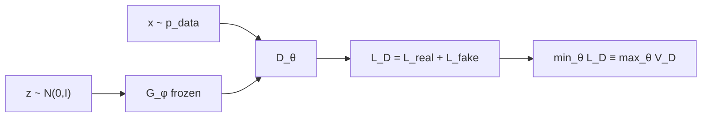
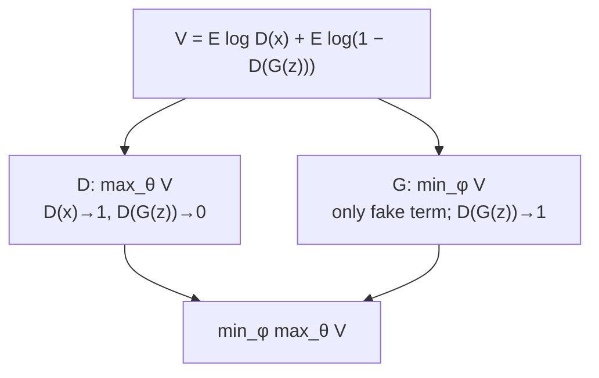

# L33: GAN objective and loss functions

**Video:** [Lec 33](https://www.youtube.com/watch?v=GqbgTaJcl38) · 43:38  
**Instructor in this lecture:** Prof. Ashwini Kodipalli

### Learning objectives

- Re-derive $L_{\text{real}}$, $L_{\text{fake}}$, and $L_D$ from BCE (same algebra as Lec 32).
- Turn **minimize $L_D$** into **maximize** a value function $V_D$, then write **expectations** for minibatches.
- Explain **why** $\max_\theta V$ pushes $D_\theta(x)\to 1$ and $D_\theta(G_\phi(z))\to 0$, using the lecture’s $\log 0.1/\log 0.5/\log 0.9$ table.
- Write the **generator** value function (optimize **only the fake term**) and the combined **minimax** GAN objective.

### What this lecture is *not*

**Convergence / Nash equilibrium** is the **next** video. This one stops at the **objective**.

---

## Recap: discriminator BCE on one real and one fake

**Real sample.** $x$ is one training point from the unknown $p_{\text{data}}$. $D_\theta(x)$ is the predicted probability that $x$ is real. Target $y=1$. BCE collapses to

$$
L_{\text{real}} = -\log D_\theta(x).
$$

**Fake sample.** $z$ from the **standard normal** noise prior → $G_\phi(z)=\hat{x}$ (also called $x_{\text{fake}}$) → $D_\theta(G_\phi(z))$ is the probability $D$ assigns “real” to a fake. Target $y=0$. BCE collapses to

$$
L_{\text{fake}} = -\log\big(1 - D_\theta(G_\phi(z))\big).
$$

**Total discriminator loss** (one pair):

$$
L_D = L_{\text{real}} + L_{\text{fake}}
= -\Big(\log D_\theta(x) + \log\big(1-D_\theta(G_\phi(z))\big)\Big).
$$

Neural nets **minimize** loss. Here we minimize $L_D$ **w.r.t. $\theta$**. $\theta$ is weights and biases in an MLP, or **kernel weights** if $D$ is CNN-based. $\phi$ appears inside $G_\phi(z)$ but is **held fixed** while $D$ trains. The left-hand “min over $\theta$ of $L_D(\theta,\phi)$” is exactly that: step $\theta$, freeze $\phi$.

---

## From minimize $L_D$ to maximize $V_D$

$L_D$ is a **minus** a positive log-sum. The lecture’s algebra move: **minimizing $(-A)$ is maximizing $A$**. So

$$
\min_\theta L_D(\theta,\phi) \quad\Longleftrightarrow\quad \max_\theta V_D(\theta,\phi)
$$

where $V$ is the **value function** at the discriminator. $L_D$ kept the minus; $V_D$ (they also write $V_D$ / “WD” in captions) drops it:

$$
V_D(\theta,\phi)
= \log D_\theta(x) + \log\big(1-D_\theta(G_\phi(z))\big)
\quad\text{(one real $x$, one noise $z$).}
$$

If minimization was named $L_D$, maximization of the same contents is named $V_D$. The lecture writes the left-hand side with a **semicolon** $(\theta;\,\phi)$: **only $\theta$ is optimized**, $\phi$ fixed.

---

## Minibatches → expectations

Training never uses a **single** $x$ and a **single** $z$. For many reals, average $\log D_\theta(x)$; for many fakes, average $\log(1-D_\theta(G_\phi(z)))$. That average is an **expectation** (equivalent to $\frac1N\sum_i$ over the batch):

$$
\max_\theta V_D(\theta;\,\phi)
= \mathbb{E}_{x\sim p_{\text{data}}(x)}\big[\log D_\theta(x)\big]
+ \mathbb{E}_{z\sim p_z(z)}\big[\log\big(1-D_\theta(G_\phi(z))\big)\big]
$$

That is the **discriminator objective** used for the rest of the lecture. $D$ **maximizes** this $V_D$.

---

## Why maximizing $V_D$ forces $D(x)\to 1$

Look only at the **real** term $\log D_\theta(x)$. $D_\theta(x)\in(0,1)$. $\log$ is increasing, so the term is **largest** when $D_\theta(x)$ is **largest**, i.e. **$1$** ($\log 1=0$).

At the **start** of training, $\theta$ is **random**. $D$ need not score reals high. Lecture walk-through:

| $D_\theta(x)$ | $\log D_\theta(x)$ (approx.) | Reading |
|--------------:|-----------------------------:|---------|
| $0.1$ (untrained, poor) | $-2.303$ | $D$ fails on reals |
| $0.5$ after some training | $-0.693$ | improving |
| $0.9$ later | $-0.105$ | near the ceiling |

As $D_\theta(x)$ **increases**, $\log D_\theta(x)$ **increases** ($-2.3\to -0.6\to -0.1$). The **limit** is $D_\theta(x)=1$, $\log=0$. **Maximizing the real term pushes $D_\theta(x)$ toward 1** — the same “reals should score high” rule as Lec 32, now from the value function.

---

## Why maximizing $V_D$ forces $D(G(z))\to 0$

Fake term: $\log\big(1-D_\theta(G_\phi(z))\big)$. This is large when $1-D_\theta(G_\phi(z))$ is large, i.e. when **$D_\theta(G_\phi(z))$ is near 0**. Then $1-0=1$, $\log 1=0$ (best value of a log-probability term).

Untrained $D$ may **wrongly** call a fake real:

| $D_\theta(G_\phi(z))$ | $1-D$ | $\log(1-D)$ | Reading |
|----------------------:|------:|------------:|---------|
| $0.9$ (bad $D$) | $0.1$ | $-2.303$ | fakes scored as real |
| $0.5$ | $0.5$ | $-0.693$ | middling |
| $0.1$ (good $D$) | $0.9$ | $-0.105$ | fakes scored as fake |

As the fake score **falls** toward 0, $\log(1-D)$ **rises**. **Maximizing the fake term pushes $D_\theta(G_\phi(z))$ toward 0.**

Together: maximize $V_D$ ⇒ reals $\to 1$, fakes $\to 0$. That is the mathematical form of “$D$ should classify correctly.”

---

## Generator objective $V_G$

Write the **same** two-term value, now as a function of **$\phi$** (optimize generator; **freeze $\theta$**):

$$
V_G(\phi;\,\theta)
= \mathbb{E}_{x}\big[\log D_\theta(x)\big]
+ \mathbb{E}_{z}\big[\log\big(1-D_\theta(G_\phi(z))\big)\big]
$$

**First term does not contain $\phi$.** Real $x$ and $D_\theta$ only. $G$ **cannot** change it. During a generator step you **optimize only the second term**.

$G$ wants $D$ to call fakes **real**, i.e. $D_\theta(G_\phi(z))\to 1$ (Lec 32’s $y=1$ story). If that probability goes to 1,

$$
\log\big(1-D_\theta(G_\phi(z))\big) \to \log 0
$$

which is **undefined / $-\infty$**. So $G$ drives that log term **as small as possible** (large negative). **Generator’s aim is to minimize** the fake log term — opposite of $D$, who wanted to **maximize** it.

The lecture’s sketch: as $D_\theta(G_\phi(z))$ approaches 1, the fake log **drops** (example order-of-magnitude: a very small / large-negative value). That is **minimization**.

---

## Combined GAN objective: minimax

You do not train $G$ and $D$ as two unrelated problems. **One** value $V$, **opposite** goals:

- $D$ **maximizes** $V$ w.r.t. $\theta$
- $G$ **minimizes** $V$ w.r.t. $\phi$

$$
\min_\phi \max_\theta \; V(\phi,\theta)
= \mathbb{E}_{x\sim p_{\text{data}}}\big[\log D_\theta(x)\big]
+ \mathbb{E}_{z\sim p_z}\big[\log\big(1-D_\theta(G_\phi(z))\big)\big]
$$

In $G,D$ letters instead of $\phi,\theta$:

$$
\min_G \max_D \; V(G,D)
= \mathbb{E}_{x}\big[\log D(x)\big]
+ \mathbb{E}_{z}\big[\log\big(1-D(G(z))\big)\big]
$$

**Opposite targets on the same fake:**

| Player | Wants $D(G(z))$ |
|--------|------------------|
| Discriminator | **near 0** |
| Generator | **near 1** |

One minimizes, one maximizes — that is the **adversarial** game from Lec 31, now as a **minimax** objective. How this **converges** and **equilibrium** are the **next** lecture.

---

### Key takeaways

- $L_D=-\log D(x)-\log(1-D(G(z)))$ on one pair; **min $L_D$** = **max $V_D$** with the minus dropped.
- Batches replace single logs by **expectations** over $p_{\text{data}}$ and $p_z$.
- $\max V_D$ raises $\log D(x)$ ($D(x)\to 1$) and $\log(1-D(G(z)))$ ($D(G(z))\to 0$); the $0.1/0.5/0.9$ log table is the proof.
- $G$ cannot touch the real term; it **minimizes** $\log(1-D(G(z)))$, i.e. wants $D(G(z))\to 1$ (and hits $\log 0$ if it fully succeeds).
- Full GAN: $\min_G\max_D V(G,D)$ — two opposite objectives on the same $V$.

---
