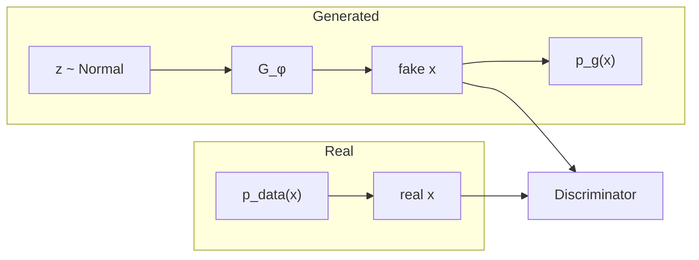
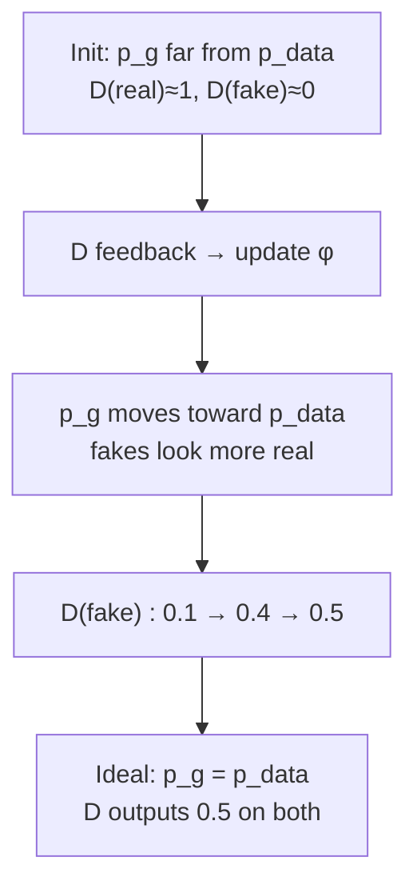

# L34: GAN Convergence and Nash Equilibrium

**Video:** [Lec 34](https://www.youtube.com/watch?v=nDQHxsLiXz8) · 16:52

### Learning objectives

- State what $p_{\text{data}}(x)$ and $p_g(x)$ are, and how generated samples are produced from $z$.
- Describe the **start of training**: noisy $G$, a strong $D$, and $p_g \neq p_{\text{data}}$.
- Track how discriminator feedback moves $p_g$ toward $p_{\text{data}}$ and $D(G(z))$ toward $0.5$.
- Define **GAN convergence** and **Nash equilibrium** in the lecture’s two-player language.

### Place in week 5

Previous session: GAN **objective** and **loss**. This session is only **convergence**. Next session: **DCGAN** (deep convolutional GAN), which the lecture contrasts with the basic GAN at the end.

---

## Two distributions the lecture keeps on the board

All **real** training points $x$ are drawn from the real data distribution

$$
x \sim p_{\text{data}}(x).
$$

**Generated** samples are not drawn from $p_{\text{data}}$. They are made in two steps:

1. Sample noise $z$ from a **normal** (Gaussian) distribution.
2. Pass $z$ through the generator $G_\phi$ (parameters $\phi$).

The collection of all such $G_\phi(z)$ follows a second distribution, the **generated distribution** $p_g(x)$ (spoken “$p_g$ of $x$”).

**Convergence talk is always about these two:** $p_{\text{data}}(x)$ versus $p_g(x)$.

---

## Start of training: the two distributions are not equal

$\phi$ is **randomly initialized**, so it is not a trained generator. Samples from $G_\phi$ are **noisy, meaningless, unrealistic**.

Therefore

$$
p_g(x) \;\neq\; p_{\text{data}}(x).
$$

Running example: a **human-face** dataset.

| Source | What the images look like at initialization |
|--------|-----------------------------------------------|
| Real $x \sim p_{\text{data}}$ | Actual faces |
| Fake $G_\phi(z)$ | Noise / disturbed / unrealistic blobs |

### What the discriminator does at this stage

| Input | Discriminator output (probability “real”) |
|-------|-------------------------------------------|
| Real face | closer to **$1$** |
| Generated blob | closer to **$0$** |

So at the initial phase: **discriminator performs well, generator performs poorly**.

---

## As training progresses

The discriminator’s prediction produces a **loss**. That loss is **fed back to the generator**. Gradients are back-propagated **through** $D$ into $G$. In that generator-update path the lecture’s point is: you are updating **$\phi$**, not using that backward pass to retrain $D$.

$$
\phi \;\leftarrow\; \text{update from } D\text{'s feedback}.
$$

Effects, in the lecture’s order:

1. Generated **samples** improve.
2. Therefore $p_g$ **moves closer** to $p_{\text{data}}$.
3. At sample level, fakes look **closer to real images**.
4. It becomes **harder** for $D$ to say real vs generated.

### Score on fakes climbs toward one-half

$D$ on generated images starts low (example **$0.1$**), then **$0.4$**, then **$0.5$**. The generated images are becoming more and more difficult to classify as fake.

The same story again with the real path: real $x$ still go to $D$ with target near $1$. The change is on the **fake** path, because $G$ is catching up.

---

## Ideal equilibrium

At an **ideal equilibrium**

$$
p_g(x) \;=\; p_{\text{data}}(x).
$$

The generated distribution matches (or comes as close as the lecture’s language allows: “matching / coming closer to”) the real data distribution. Then:

- $D$ **can no longer distinguish** real samples from generated samples.
- For **either** a real image or a generated image, $D$ outputs **$0.5$**.

**$0.5$ does not mean $D$ is a failed network.** It means $G$ has reached the stage of producing images that sit on the same distribution as the real set. $D$ is **confused**, not “broken.”

---

## GAN convergence

**GAN convergence** is the state in which:

1. $p_g$ **matches** $p_{\text{data}}$, and
2. $D$ **can no longer distinguish** real images from generated samples.

The lecture also **calls this same state Nash equilibrium**.

---

## Nash equilibrium (two players)

Players: **generator** and **discriminator**.

At equilibrium:

| Player | Why it cannot improve further |
|--------|-------------------------------|
| $D$ | Real and generated samples follow the **same** distribution, so $D$ cannot get a better real/fake split. |
| $G$ | It is already producing images that **match** the real distribution. |

**Definition as stated:** Nash equilibrium is a state in which **neither generator nor discriminator is improving**. Neither player can obtain a **better outcome by changing its own parameters alone** while the **other network’s parameters are kept unchanged**.

You cannot improve **only** $D$ with $G$ frozen, and you cannot improve **only** $G$ with $D$ frozen: both have already reached a stage where unilateral change does not help.

### One-sentence version from the lecture

$G$ generates images **as close as** the real images $\Rightarrow$ $p_g$ matches $p_{\text{data}}$ $\Rightarrow$ $D$ cannot tell them apart $\Rightarrow$ **neither** player can improve. That is **convergence** and **Nash equilibrium**.

---

## Preview of DCGAN (closing slide)

What you have seen so far is the **basic / vanilla GAN**. It can be used for **images** or for **tabular / CSV** data.

**DCGAN** (deep convolutional GAN) is **specially designed for images**. Architecture is the next session.

### Key takeaways

- Real data: $x \sim p_{\text{data}}(x)$. Fakes: $z \sim \mathcal{N}$, then $G_\phi(z)$ with collection $p_g(x)$.
- At init, $p_g \neq p_{\text{data}}$; $D$ scores reals near $1$ and fakes near $0$.
- Training updates $\phi$ from $D$’s feedback; $p_g$ moves toward $p_{\text{data}}$ and $D(\text{fake})$ climbs toward $0.5$.
- **Convergence:** $p_g = p_{\text{data}}$ and $D \equiv 0.5$ on both. Same state is **Nash**: neither player improves by changing only its own weights.

---
