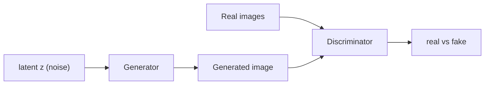
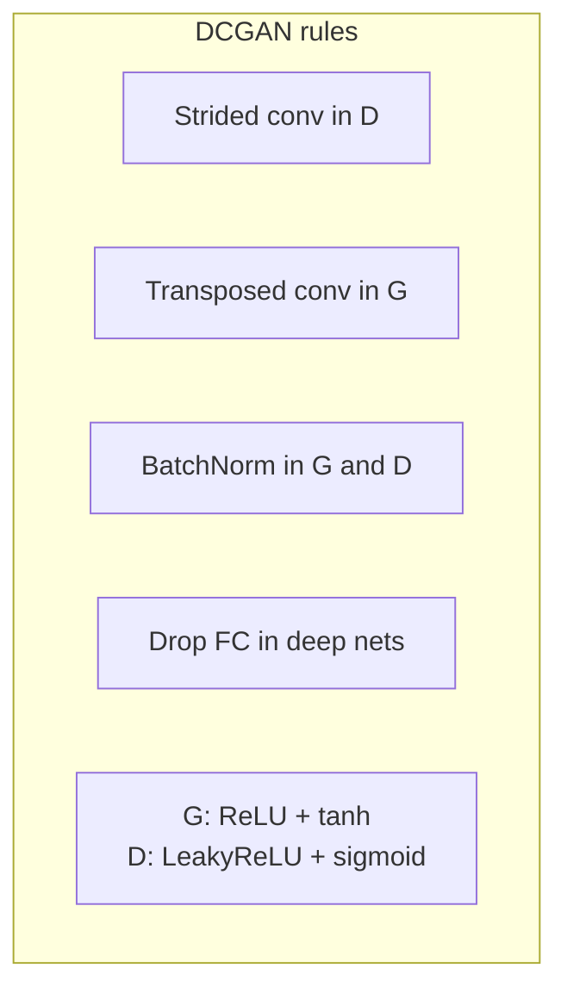
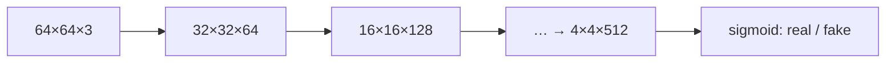

# L35: Introduction to DCGAN

**Video:** [Lec 35](https://www.youtube.com/watch?v=XSSaV-FHW2E) · 10:49

### Learning objectives

- Recap vanilla GAN as two networks with **opposite** (minimax) objectives.
- List four **limitations** of GANs taught here: no convergence guarantee, mode collapse, vanishing gradients, hyperparameter sensitivity.
- State the **DCGAN design rules** (strided / transposed conv, batch norm, no FC, activations).
- Sketch the lecture’s **64×64 RGB** generator and discriminator tensor sizes.

### Week 5 theory wrap

Last theory session of week 5 (GAN foundations). Already covered: VAE limitations → motivation for GANs, adversarial learning, architecture, objectives, losses. This video: **limitations of GAN** + **deep convolutional GAN (DCGAN)**. Next: hands-on **vanilla GAN** then **DCGAN**.

---

## Vanilla GAN recap

Two neural networks:

| Network | Input | Job |
|---------|--------|-----|
| **Generator** $G$ | latent noise $z$ | Emit images that $D$ will accept as real |
| **Discriminator** $D$ | real images **and** $G$’s images | Tell real from generated |

They have **opposite** objectives: $G$ gets better at **fooling** $D$; $D$ gets better at **catching** $G$.

### Minimax (from the previous session; reused here)

First term: $D$ on **real** data — $D$ wants this probability **large**.  
Second term: $D$ on **generated** data — $D$ wants this **small**. That is the **minimax** relationship.

$$
\min_G \max_D V(D,G)
= \mathbb{E}_{x \sim p_{\text{data}}}[\log D(x)]
+ \mathbb{E}_{z \sim p_z}[\log\bigl(1 - D(G(z))\bigr)]
$$

---

## Limitations of GANs

### 1. No convergence guarantee

Minimax + **competitive** objectives $\Rightarrow$ it is hard to reach a **stable equilibrium**. There is **no guarantee** of convergence.

### 2. Mode collapse

Example: real data contains **cat, dog, horse, elephant**. $G$ should emit all four.

What can happen: $G$ produces a **very realistic cat**. $D$ accepts it as real. $G$ then keeps emitting **only cats** — the mode $D$ already accepted — and **never** horse / elephant / dog.

**Other modes are missing.** That is mode collapse.

### 3. Vanishing gradients

If $D$ is **well trained early**, or becomes **too accurate**, there is **no useful gradient** into $G$. Then $G$ **cannot improve**. That is vanishing gradients in this adversarial setting.

### 4. Hyperparameter sensitivity

Hyperparameters (learning rate, batch size, …) should be set **before** training. **Mid-training** retuning can make the model fail to work, sometimes **collapse entirely**.

DCGAN is introduced as a **stable** deep convolutional GAN: a few **architecture** changes to reduce these problems.

---

## DCGAN design rules (architecture changes)

Vanilla / fully connected GAN used **dense** layers and **pooling**. DCGAN’s rules as taught:

| Piece | Vanilla GAN | DCGAN |
|-------|-------------|--------|
| Discriminator spatial ops | pooling | **strided convolution** |
| Generator spatial ops | (dense upsample) | **transposed convolution** (also called deconvolution / **fractionally strided** convolution) |
| Batch normalization | not used | **BN in $G$ and $D$** |
| Fully connected layers | present | **removed** in deeper architectures |
| $G$ activations | — | **ReLU** hidden; **tanh** at output |
| $D$ activations | — | **Leaky ReLU**; **sigmoid** at last layer (real vs fake: $0$ or $1$) |

---

## Generator internals (lecture’s 64×64 RGB walk-through)

- Input: latent $z$, **100-D** random noise from a **normal** distribution.
- **Reshape** to $4 \times 4 \times 1024$.
- Each upsample block: **transposed convolution + batch norm + ReLU**.
- **Spatial size doubles**; **channels halve**.

| Stage | Spatial | Channels |
|-------|---------|----------|
| after reshape | $4 \times 4$ | $1024$ |
| upsample | $8 \times 8$ | $512$ |
| … | doubles each time | halves each time: $512 \to 256 \to 128 \to 3$ |
| output | $64 \times 64$ | **$3$ (RGB)** |

---

## Discriminator internals

Input: real **or** generated image, **$64 \times 64 \times 3$**.

Each downsample: **strided convolution + Leaky ReLU + batch norm**.

**Spatial size halves**; **channels double**.

| Stage | Tensor |
|-------|--------|
| input | $64 \times 64 \times 3$ |
| after 1st downsample | $32 \times 32 \times 64$ |
| after 2nd | $16 \times 16 \times 128$ |
| … | continue until **$4 \times 4 \times 512$** |
| last layer | **sigmoid** → probability real vs fake |

---

## DCGAN as foundation for later GANs

DCGAN **reduces** most of the listed limitations; it does not end the GAN family. Later models still **keep the DCGAN core** and add extras:

| Later GAN (named here) | Extra the lecture mentions |
|------------------------|----------------------------|
| **StyleGAN** | better **noise injection** and **style control** (architecture still DCGAN-like plus those extras) |
| **BigGAN** | **attention** for long-range dependencies |
| **WGAN** | named as another later type |

**Punchline:** many named GANs are DCGAN + additional features; **DCGAN’s core design stays**.

Next session: implementation of **basic GAN** and **DCGAN**.

### Key takeaways

- Vanilla GAN is a minimax game; it can fail to converge, collapse modes, starve $G$ of gradients, and blow up if you retune mid-run.
- DCGAN: strided conv in $D$, transposed conv in $G$, BN both sides, drop FC, ReLU/tanh in $G$, Leaky ReLU/sigmoid in $D$.
- Lecture’s picture: $100$-D $z$ $\to$ $4\times4\times1024$ $\to$ $64\times64\times3$; $D$ mirrors that down to $4\times4\times512$ then sigmoid.
- StyleGAN / BigGAN / WGAN are taught as **add-ons on the DCGAN foundation**, not replacements of that core.

---
