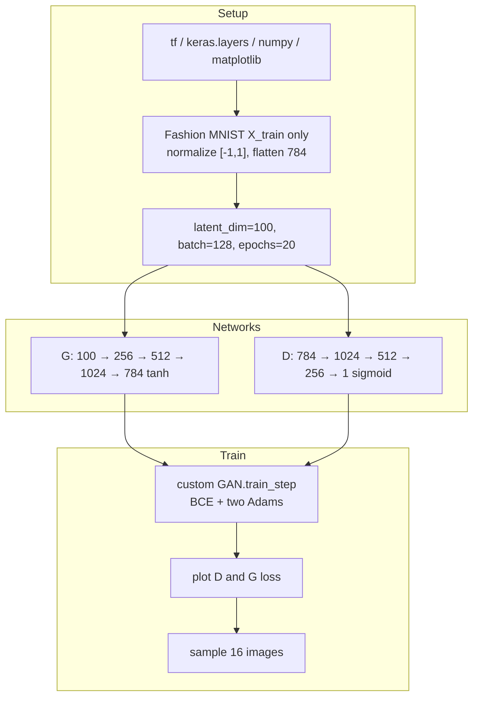

# L36: Practical Exercise 1 — Vanilla GAN

**Video:** [Lec 36](https://www.youtube.com/watch?v=WTpywahiL9w) · 33:04

This lab is the **vanilla (2014) fully connected GAN**, not DCGAN (that is Lec 37).

### Learning objectives

- Implement a **vanilla GAN** in TensorFlow/Keras on **Fashion MNIST**.
- Normalize pixels to **$[-1,1]$** to match **tanh**, flatten $28\times28\to784$, and drop labels / test split.
- Build MLP **generator** and **discriminator**, a custom `GAN` model class, **Adam** + **binary cross-entropy**, and plot both losses.
- Read the loss curves and the $4\times4$ grid of generated garments.

---

## What is being built

Vanilla GAN (2014): two networks, all **fully connected**. It is the base framework the lecture says later models (DCGAN, StyleGAN, CycleGAN, “diffusion” as later generative models) build on.

| Network | Role in this lab |
|---------|------------------|
| Generator | Noise $z$ → **fake** $28\times28$ fashion image |
| Discriminator | Classifier: **real** Fashion MNIST vs **fake** |

---

## 1. Libraries

- `tensorflow` as `tf`
- `tensorflow.keras` **layers**
- `numpy` as `np`
- `matplotlib.pyplot` as `plt`

---

## 2. Dataset: Fashion MNIST (no labels, no test set)

Benchmark set of **clothing and accessories**, **10 classes**:

| Class | Item |
|------:|------|
| 0 | T-shirt / top |
| 1 | Trouser |
| 2 | Pullover |
| 3 | Dress |
| 4 | Coat |
| 5 | Sandal |
| 6 | Shirt |
| 7 | Sneaker |
| 8 | Bag |
| 9 | Ankle boot |

Load from `tf.keras.datasets.fashion_mnist` into **`X_train` only**.

GANs here are **unsupervised generation**:

- **No** `y_train` / `y_test` (underscores in the unpack).
- **No** `X_test` — “testing” is $D$ scoring real training images vs $G$’s fakes.

---

## 3. Preprocess: $[-1,1]$ then flatten

Pixel intensities are **$0$–$255$** grayscale. Output activation is **tanh** (range **$[-1,1]$**), so scale with

$$
X \leftarrow \frac{X_{\text{float}} - 127.5}{127.5}.
$$

Checks from the lecture:

| Raw pixel | After scale |
|-----------|-------------|
| $0$ | $(0-127.5)/127.5 = -1$ |
| $255$ | $(255-127.5)/127.5 = 1$ |

Then **flatten** each $28\times28$ image to a **$784$** vector.

**Shape printed:** `60 000` samples × `784` features.

---

## 4. Hyperparameters

| Name | Value | Why |
|------|------:|-----|
| `latent_dim` | **100** | length of noise $z$ |
| `batch_size` | **128** | 60 000 split into batches of 128 |
| `epochs` | **20** | as used in the demo |

---

## 5. Generator (MLP)

`Sequential`. Input size **100**.

Why **Leaky ReLU**, not ReLU: ReLU is $\max(0,x)$. Negative $x$ becomes **$0$** → neurons can **die**. Leaky ReLU:

$$
\max(x,\; \alpha x),\qquad \alpha = 0.2.
$$

Worked examples:

- $x=-5$: $\max(-5,\; 0.2\cdot(-5)) = \max(-5,-1) = -1$ (still a leak, neuron stays alive).
- $x=5$: $\max(5,\; 1) = 5$.

| Layer | Units | Activation |
|-------|------:|------------|
| Dense | 256 | Leaky ReLU $0.2$ |
| Dense | 512 | Leaky ReLU $0.2$ |
| Dense | 1024 | Leaky ReLU $0.2$ |
| Dense (output) | **784** | **tanh** (matches $[-1,1]$ pixels) |

### Parameter counts (as computed on the summary)

Formula used: $(\text{in}\times\text{units}) + \text{bias}$.

| Layer | Calculation | Trainable params |
|-------|-------------|-----------------:|
| Dense 256 | $100\times256 + 256$ | **25 856** |
| Leaky ReLU | — | 0 |
| Dense 512 | $256\times512 + 512$ | **131 584** |
| later dense layers | same rule | (sum is large) |

---

## 6. Discriminator (MLP, mirror of $G$)

Input **784**. Stack is the **reverse** of $G$’s widths, then a binary head.

| Layer | Units | Activation |
|-------|------:|------------|
| Dense | 1024 | (Leaky ReLU in the same style as $G$) |
| Dense | 512 | |
| Dense | 256 | |
| Dense | **1** | **sigmoid** |

Binary classifier: $p>0.5$ → class **1 (real)**; $p<0.5$ → class **0 (fake)**.

Example param count: $784\times1024 + 1024 =$ **803 840**.

**Total $D$ params stated:** **1 460 225**.

---

## 7. Custom `GAN` class

Subclass `tf.keras.Model`.

1. Constructor stores `generator` and `discriminator`; `super()` initializes the Keras model.
2. **Loss trackers:** `tf.keras.metrics.Mean` for discriminator loss and generator loss (running averages, less noise from outliers).
3. **Two Adam optimizers** (one for $D$, one for $G$).

### Adam as written

New weights from old weights, learning rate $\eta$, bias-corrected mean $\hat{m}$ and variance $\hat{v}$:

$$
w \leftarrow w - \eta \frac{\hat{m}}{\sqrt{\hat{v}} + \varepsilon}.
$$

$$
m \leftarrow \beta_1 m + (1-\beta_1)g_t, \qquad
v \leftarrow \beta_2 v + (1-\beta_2)g_t^2.
$$

$\beta_1,\beta_2$ control moving averages of gradients and squared gradients.

---

## 8. `train_step`

### Discriminator step

1. Real batch: Fashion MNIST, size **128**.
2. Noise $\sim$ **normal / Gaussian**, shape **$(128, 100)$**.
3. `generated_images = G(noise, training=True)`.
4. **Concatenate** reals and fakes on **axis 0** (stack fakes **under** reals).
5. Labels: **ones** for real, **zeros** for fake; concatenate the same way.
6. **Label noise:** add $\text{Uniform}\times 0.05$ so labels are not hard $0/1$ (uniform so labels stay roughly equally probable).
7. $D$ predicts on the combined batch (`training=True`).
8. **Binary cross-entropy** between those labels and predictions.
9. Gradients w.r.t. $D$ weights; `zip` gradients with trainable weights; Adam update.

### Generator step

1. Fresh noise shape $(128, 100)$.
2. **Misleading labels = ones** (shape `(batch, 1)`): $G$ wants $D$ to call fakes real.
3. $D$ scores `G(noise)` with `training=True` on that path.
4. Generator BCE vs those ones; backprop into **$G$** only; zip + apply.

Return tracked **$D$ loss** and **$G$ loss**.

---

## 9. Compile, $\beta$, fit

- Build `GAN(generator, discriminator)`.
- Configure both Adams. Lecture choice: **$\beta = 0.5$** for GANs so you do **not** depend too much on the past (high/low $\beta$ → more oscillation, more “stuck on old fakes”).
- Loss: **binary cross-entropy** (true vs predicted; large when they differ).
- `fit` on `X_train`, **20** epochs, batch **128**.

Demo numbers after training: **$D$ loss $\approx 0.71$**, **$G$ loss $\approx 0.89$**. Lower $D$ loss means $D$ is still somewhat able to separate fakes from reals.

---

## 10. Loss plot — what to observe

- Figure **$8\times 5$**.
- Plot history of $D$ loss and $G$ loss; $x$ = epoch, $y$ = loss; title **“vanilla GAN training”**; legend.
- **Blue** = discriminator, **orange** = generator.

| Phase | Observation |
|-------|-------------|
| Epochs **0–7** | $D$ loss **much smaller** than $G$ loss ($G$ cannot yet make realistic images) |
| Then | $D$ loss drops further ($D$ still classifies well) |
| After ~**10** epochs | the two curves move **together**; gap is the $0.71$ vs $0.89$ seen in the log |

That matches the theory: early $D$ is strong and $G$ is weak; later they train **hand in hand**.

---

## 11. Sample 16 fashion images

1. `n = 16`; noise shape **$(16, 100)$** from a normal.
2. `G.predict(z)`; **reshape** to $(16, 28, 28)$.
3. Subplot grid **$4\times 4$**; colormap **gray**; axes off; suptitle **generated Fashion MNIST images**.

**What they saw:** shirts, sneakers/shoes, sandals, T-shirts, a plausible **bag** — clothing and accessories, not noise.

Vanilla GAN is left as the **fundamental** stack before DCGAN / CycleGAN / StyleGAN.

### Key takeaways

- Unsupervised Fashion MNIST: **60k × 784**, pixels in **$[-1,1]$**, no labels/test.
- $G$: $100\to256\to512\to1024\to784$ tanh, Leaky ReLU $0.2$; $D$ is the reverse plus sigmoid.
- Train with a Keras `GAN` class, two Adams ($\beta=0.5$), BCE, optional $0.05$ label noise, misleading ones for $G$.
- Early: $D$ loss $\ll$ $G$ loss; later they track; 16 grayscale samples already look like garments.

---
