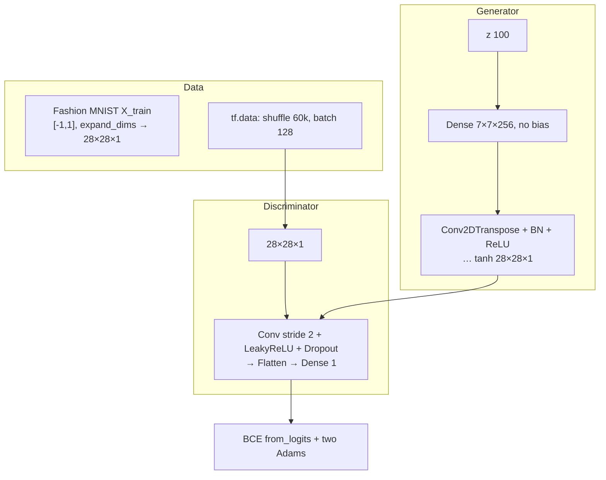

# L37: Practical Exercise 2 — DCGAN

**Video:** [Lec 37](https://www.youtube.com/watch?v=nOL6et_IQRQ) · 40:05

### Learning objectives

- Explain why **convolutions** beat the Lec 36 MLP: spatial structure, feature hierarchy, fewer parameters.
- Rebuild Fashion MNIST as **$28\times28\times1$**, with shuffle/batch pipeline, `Conv2DTranspose` generator and strided-conv discriminator.
- Reproduce BN + `use_bias=False`, padding, stride-2, Leaky ReLU $0.2$, dropout $0.3$, Adam **$2\times10^{-4}$**, $\beta=0.5$, BCE **`from_logits=True`**.
- Compare sample quality and param counts to vanilla GAN; note the missing **class control** (teaser for cGAN).

---

## Why DCGAN after vanilla GAN

Vanilla GAN **flattens** $28\times28$ to $784$. **Spatial layout is lost.**

DCGAN keeps 2-D maps:

| Vanilla GAN | DCGAN |
|-------------|--------|
| Fully connected | **Convolutional** |
| Spatial structure discarded | Spatial structure **preserved** (padding helps keep borders) |
| No explicit hierarchy | **Low-level** (edges, corners) → **mid-level** (textures, shapes) → **high-level** (object parts) |
| More parameters | **Fewer** parameters, less memory, faster training |

Same dataset as Lec 36 so the two labs are comparable.

---

## 1. Libraries

Same stack as Lec 36: `tensorflow` as `tf`, `keras.layers`, `numpy` as `np`, `matplotlib.pyplot` as `plt`.

---

## 2. Dataset and preprocess

Fashion MNIST again, **10 classes** (T-shirt/top, trouser, pullover, dress, coat, sandal, shirt, sneakers, bag, ankle boot).

Unpack **`X_train` only** — unsupervised; no `y_*`, no `X_test`. Evaluation is $D$ on reals vs $G$’s fakes.

**Normalize to $[-1,1]$** because the generator ends in **tanh**:

$$
X \leftarrow \frac{X_{\text{float}} - 127.5}{127.5}.
$$

($127.5$ is half of $255$.)

**Keep the image grid:** `np.expand_dims` adds a channel. Printed shape:

$$
60\,000 \times 28 \times 28 \times 1
$$

(grayscale → one channel).

---

## 3. `tf.data` pipeline

| Knob | Value |
|------|------:|
| Buffer / training size | **60 000** |
| Batch | **128** |

`tf.data.Dataset.from_tensor_slices(X_train)` → **shuffle** the buffer → **batch** 128.

Shuffle so you do **not** always see indices $0$–$127$, then $128$–$255$, … (avoids memorizing order).

---

## 4. Generator

`latent_dim = 100`. `Sequential`.

### Why $7\times7$?

Need to grow back to **$28\times28$**. $7$ is a convenient **factor of $28$** (could have used $14$, etc.; they start from the smallest $7\times7$). **$256$** feature maps at $7\times7$.

### First dense, no bias

`Dense(7*7*256, use_bias=False, input_shape=(100,))` then **batch norm**, **ReLU**, **reshape** to $(7,7,256)$.

**Why `use_bias=False`:** BN already has a learnable **scale $\gamma$** and **shift $\beta$**. A dense/conv bias would **shift twice**. Parameter count becomes $\text{in}\times\text{units}$ with **no** extra $+ \text{units}$.

### Upsampling: `Conv2DTranspose`

Typical block: transposed conv, **kernel $5\times5$**, `padding='same'` (zero-pad so borders are not cropped off), `use_bias=False`, **BN**, **ReLU**.

Lecture stack (as spoken):

| Transposed conv | Filters | Stride | Notes |
|-----------------|--------:|--------|--------|
| 1 | 128 | **1** | $5\times5$, same pad, no bias, BN, ReLU |
| 2 | 64 | **2** | same pattern |
| … | … | 2 | repeat conv / BN / ReLU |
| last | **1** | **2** | $5\times5$, same pad, **tanh** → $[-1,1]$ |

### Convolution mini-lesson (5×5 toy image)

Grayscale values $0$ (black) – $255$ (white). Overlay a **$3\times3$ kernel** (edge/corner/line detector). Example **Prewitt**-style vertical kernel they wrote:

$$
\begin{bmatrix}
-1 & -1 & -1 \\
0 & 0 & 0 \\
1 & 1 & 1
\end{bmatrix}
$$

Place the kernel’s center on a pixel, multiply-add, write the result into the feature map (their example replaces the center value **$10$**). Slide across. Without padding, a $5\times5$ image with a $3\times3$ kernel yields **$3\times3$** and **loses the border**. **`padding='same'`** adds zeros so the center can sit on edge pixels and **boundaries survive**.

**Stride:** stride $1$ = shift the window by one pixel. Implementation uses **stride $2$** in later layers = skip a pixel (center jumps by two) → downsample/upsample by about $2\times$.

### Batch norm formula (as written)

$$
x_{\text{norm}} = \frac{x - \mu}{\sqrt{\sigma^2 + \varepsilon}}, \qquad
y = \gamma\, x_{\text{norm}} + \beta.
$$

$\varepsilon$ is a tiny constant for **numerical stability** (avoid divide-by-zero). $\gamma$ = learnable scale, $\beta$ = learnable shift. After BN, values sit near a Gaussian with mean $0$, std $1$ (mass inside $\pm1$, $\pm2$, or $\pm3$ $\sigma$ depending how much of the bell you keep).

**ReLU** after BN: $\max(0,x)$ — zeros negatives, passes positives; adds nonlinearity.

### Generator summary numbers

First dense output width $7\times7\times256 = 12\,544$.

$$
100 \times 7 \times 7 \times 256 = 1\,254\,400
$$

(no $+7\times7\times256$ bias).

**Total $G$ parameters: $2\,330\,944$** — large net, but **fewer** than the vanilla MLP GAN, so training is lighter.

---

## 5. Discriminator

Mirror the filter counts: $G$ went **$256 \to 64 \to 1$**; $D$ starts **$64 \to 128 \to 1$**.

| Layer | Details |
|-------|---------|
| Conv2D | **64** filters, $5\times5$, stride **$(2,2)$**, `padding='same'`, input **$(28,28,1)$** |
| Leaky ReLU | $\alpha=0.2$: $\max(x, 0.2x)$ — same $-5\to-1$, $+5\to5$ examples as Lec 36 |
| Dropout | **$0.3$** (30% of units dropped in training — less co-adaptation / memorization) |
| Conv2D | **128**, $5\times5$, stride $2$, same pad, Leaky ReLU, dropout |
| Flatten | 1-D vector |
| Dense | **1** logit — binary real vs fake |

First-layer spatial size: $28\to14$, so **$14\times14\times64$**.

Params (bias **kept** here): they compute first conv **$1\,664$**.

**Total $D$ parameters: $212\,865$**.

---

## 6. Adversarial loss (`from_logits=True`)

`BinaryCrossentropy(from_logits=True)`.

**Logits** = raw scores, **not** probabilities (they need not sum to $1$). The loss applies **sigmoid** internally:

$$
\sigma(x) = \frac{1}{1+e^{-x}}.
$$

Then $p \ge 0.5$ → class **1 real**; $p < 0.5$ → class **0 fake**.

(The spoken “ten raw scores” is Fashion-MNIST class count leaking into the explanation. The **network head is one logit**, binary.)

| Loss | Code idea |
|------|-----------|
| Real $D$ loss | BCE of **ones** vs $D(\text{real})$ |
| Fake $D$ loss | BCE of **zeros** vs $D(\text{fake})$ |
| $D$ total | real + fake |
| $G$ loss | BCE of **ones** vs $D(G(z))$ (fool $D$) |

---

## 7. Optimizers

**Adam** on $G$ and on $D$.

- **Learning rate $0.0002$**
- **$\beta = 0.5$** (same rationale as Lec 36: neutral; extreme $\beta$ → oscillations / clinging to old fakes, weaker adversarial learning)

---

## 8. Training step (`GradientTape`)

Per batch of real images:

1. Noise $\sim$ normal, shape **$(128, 100)$**.
2. `generated_images = G(noise, training=True)`.
3. $D$ on reals and on fakes (`training=True`).
4. Compute $G$ loss from **fake** scores only; $D$ loss from **real + fake**.
5. Gradients: $G$ loss w.r.t. $G$ trainable vars; $D$ loss w.r.t. $D$ trainable vars.
6. Apply both Adams. Return both losses.

**$G$ sees only $z$.** **$D$ sees MNIST reals and $G$ fakes.**

---

## 9. Train 20 epochs — printed losses

Outer loop `for epoch in range(20)`; inner loop over image batches; print epoch and both losses to **four decimal places**.

| What they observed | Numbers |
|--------------------|---------|
| Early $G$ loss | starts around **$0.65$**, then **$0.84$**, **$0.82$**, then **gradually decreases** |
| $D$ loss | **varies**: **$1.45$**, **$1.19$**, **$1.26$**, … |
| End of epoch 20 | $G$ **$0.81$**, $D$ **$1.32$** — “hand in hand” |

Early $G$ is weak; it improves by learning from noise + adversarial signal. $D$’s loss fluctuating means its real/fake job is not a monotone easy win.

---

## 10. Display 16 images

- Noise $(16, 100)$; `generated = G(noise)`.
- Map from $[-1,1]$ to roughly $[0,1]$: **`(generated + 1) / 2`**.
- Figure **$8\times8$**; **$4\times4$** subplots; `cmap='gray'`; axes off; `tight_layout`.

Visible: sneakers, boots, T-shirts, bag, shirt-like clothes.

---

## 11. Vanilla GAN vs DCGAN (closing comparison)

| | Vanilla (Lec 36) | DCGAN (this lab) |
|--|------------------|------------------|
| Quality of 16 samples | recognizable but weaker | **higher quality** reconstruction |
| Parameters | huge FC counts | **fewer** despite a “deep” conv stack |
| Spatial structure | destroyed by flatten | kept via conv + **padding** |
| Class control | none | **still none** |

**Limitation they emphasize:** asking for “16 samples” yields a **random mix** of bags, sneakers, boots, clothes — **not class-specific**. For **label-conditioned** generation, next model is **conditional GAN (cGAN)**.

### Key takeaways

- Keep Fashion MNIST as $28\times28\times1$; shuffle 60k; batch 128; $z\in\mathbb{R}^{100}$.
- $G$: dense $7\times7\times256$ (no bias) → Conv2DTranspose + BN + ReLU → tanh; **$2\,330\,944$** params.
- $D$: strided conv 64 then 128, Leaky ReLU $0.2$, dropout $0.3$, dense 1; **$212\,865$** params.
- Adam $2\times10^{-4}$, $\beta=0.5$, BCE with logits; 20 epochs end near $G\,0.81$, $D\,1.32$.
- Better images than vanilla GAN, still **unconditional** — that is the hook for Lec 38.

---
