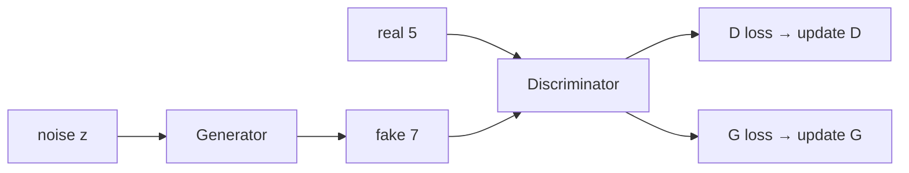
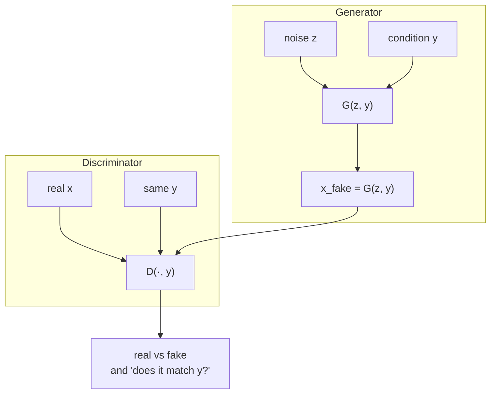

# L38: Conditional GAN

**Video:** [Lec 38](https://www.youtube.com/watch?v=a9ier1m_Fzs) · 44:49  
**Instructor in this lecture:** Prof. Baishali Garai (introduces herself as Vaishali)

### Learning objectives

- Restate vanilla GAN as a **minimax / cricket-style** adversarial game, and why $z$ alone cannot request “digit 5.”
- Draw the **cGAN** architecture: condition $y$ into **both** $G$ and $D$.
- Write **real / fake $D$ losses**, the **non-saturating $G$ loss**, and the **conditioned minimax** $V(D,G)$.
- Contrast vanilla vs conditional GAN and list the lecture’s applications (including the Pix2Pix teaser).

### Agenda (as listed)

Quick GAN review → motivation for cGAN → architecture → training loop → objective / losses → vanilla vs cGAN → applications.

---

## Vanilla GAN recap

GAN = two networks, **generator** $G$ and **discriminator** $D$, trained **against** each other.

**Cricket analogy:** batsman tries to **increase** runs; bowler tries to **stop** that. Success of one is failure of the other. Same structure: $G$ vs $D$ in a **minimax game**.

### MNIST walk-through they put on the slide

- Real image: handwritten **5** → $D$ (learns what a 5 looks like).
- $G$ gets **random noise**, emits a **fake** (example: a **7**).
- $D$ sees real 5 and fake 7 and must say **real vs fake**.
- If $D$ is wrong: **discriminator loss**, backprop into $D$.
- If the fake does not look like the reals: **generator loss**, backprop into $G$.

$G$’s job: make fakes $D$ will accept as real. $D$’s job: maximize correct real/fake calls.

---

## What “random noise” is

$z$ is a **latent vector** from an abstract, **low-dimensional** space that still holds essential structure (summary of a long storybook: shorter, but the important plot is there).

If $z$ is **100-D**, it is 100 numbers. **Each component is drawn independently** from

$$
\mathcal{N}(0,1)
$$

(mean $0$, variance $1$). $G(z)$ turns that unstructured vector into a **structured** image (the fake 7).

---

## Motivation: no control over what $G$ emits

**There is no control** on the class of $G(z)$.

Latent space in a **standard GAN has no explicit semantic meaning**. MNIST example:

| Sample | $G(z)$ might be |
|--------|-----------------|
| $z_1$ | digit **3** |
| $z_2$ | digit **7** |
| $z_3$ | digit **1** |

**Can you demand a 5?** You do **not** know which $z$ yields 5. There is **no map** “this region of $Z$ = digit 5.”

That is the **main motivation** for **conditional GAN (cGAN)**.

Still true in both vanilla and cGAN:

- $G$ is trained to **maximize $D$’s mistakes**.
- $D$ is trained to **maximize correct** real/fake decisions.

cGAN adds **controlled, guided** generation: put a **conditioning input** into $G$ so the output is the class (or other condition) you asked for.

---

## What a cGAN conditions on

Paper the lecture points to: **Conditional Generative Adversarial Nets** (original cGAN paper — students are told to read it).

**Extra information $y$ goes to both $G$ and $D$.**

On MNIST, $y$ is the **class label** $0$–$9$ (image of a 0 tagged $0$, and so on).

Conditioning is **not only labels**. Other modalities named:

- **text prompts**
- **images** (image-to-image translation)

---

## Architecture on digit 7

- Real image $x$ = a **7**, label $y=7$. Both go to $D$.
- Noise $z$ **plus the same** $y=7$ go to $G$.
- $G$ now emits **sevens** (the requested class). The fake 7s can still **look different** (different stroke structure) from the real 7.
- Fakes go to $D$ as well. Reals and fakes are typically shown **50/50**.
- $D$ loss backprop → $D$; $G$ loss backprop → $G$. Same adversarial loop, now **conditioned**.

$D$ must decide: does this look like the **real 7s**, not just “is it some digit?”

---

## Training loop (five steps)

### Step 1 — real pair into $D$

Pick real image $x$ (a 7) and its condition $y$ (`label = 7`). Both enter $D$.

### Step 2 — score on the real pair

$$
D(x,y) \in [0,1]
$$

= probability $D$ assigns to “this pair is real.”

### Step 3 — fake pair into $D$

Sample $z$. Same $y$ into $G$:

$$
x_{\text{fake}} = G(z,y).
$$

$D$ scores the fake **with the same $y$:**

$$
D\bigl(G(z,y),\, y\bigr).
$$

It asks two questions at once: **does the image match condition $y$?** and **is it real?**

Targets while training $D$:

$$
D(x,y) \to 1 \quad \text{(real pair)}, \qquad
D\bigl(G(z,y), y\bigr) \to 0 \quad \text{(fake pair)}.
$$

### Step 4 — train $G$

$G$ tries to **fool** $D$: push

$$
D\bigl(G(z,y), y\bigr) \to 1.
$$

$G$ learns: given $y$, emit an image that **looks real** **and** **matches $y$**.

### Step 5 — repeat

$G$ improves image quality (and label consistency). $D$ improves detection. Eventually $G$ produces **realistic, label-consistent** samples.

---

## Discriminator losses

$D$’s goal: real pairs → real, fake pairs → fake. Two terms.

### Real loss

$$
L_D^{\text{real}}
= -\,\mathbb{E}_{x \sim p_{\text{data}}(x)}\bigl[\log D(x,y)\bigr].
$$

- Expectation = average over the **real** set.
- $p_{\text{data}}(x)$ = true data distribution.
- $D(x,y)$ = “real pair” probability.
- $D$ wants $D(x,y)\to 1$. The **minus** is there so training **minimizes** this loss.

**Numerical check they computed** (natural log):

| $D(x,y)$ | $\log D(x,y)$ | after minus (loss) |
|--------:|--------------:|-------------------:|
| $0.9$ | $\approx -0.045$ | **$0.045$** (small — $D$ is confident on a real) |
| $0.2$ | $\approx -0.70$ | **$0.70$** (large — $D$ failed on a real) |

(The spoken “$D$ wants $0$” on this slide is a slip; the table only makes sense if $D$ wants **$1$** on reals, matching the rest of the lecture.)

### Fake loss

$$
L_D^{\text{fake}}
= -\,\mathbb{E}_{z \sim p_z}\Bigl[\log\bigl(1 - D(G(z,y), y)\bigr)\Bigr].
$$

Average over **noise** samples. $D$ wants $D(G(z,y), y)\to 0$ on fakes.

**Total discriminator loss** = real + fake.

---

## Generator loss

Standard (saturating) form:

$$
L_G
= \mathbb{E}_{z,y}\Bigl[\log\bigl(1 - D(G(z,y), y)\bigr)\Bigr].
$$

**Vanishing gradients** if you use that. **In practice** they use the non-saturating version (derivation not done in class):

$$
L_G
= -\,\mathbb{E}_{z}\bigl[\log D(G(z,y), y)\bigr].
$$

Minus sign again = minimize. $G$ wants $D(G(z,y), y)\to 1$; $D$ wants that same score $\to 0$.

---

## Minimax objective of cGAN

Both networks are **conditioned on $y$**:

$$
\min_G \max_D V(D,G)
= \mathbb{E}\bigl[\log D(x,y)\bigr]
+ \mathbb{E}\bigl[\log\bigl(1 - D(G(z,y), y)\bigr)\bigr].
$$

- $\max_D$: $D$ **maximizes** $V$ (better real/fake + condition check).
- $\min_G$: $G$ **minimizes** $V$ (reduce $D$’s success / fool $D$).
- First term: classify **real** $(x,y)$ correctly.
- Second term: push $G(z,y)$ toward images $D$ would call real **under $y$**.

Competition $\Rightarrow$ realistic samples that **obey the condition**.

---

## Vanilla GAN vs cGAN

| | Vanilla GAN | Conditional GAN |
|--|-------------|-----------------|
| $G$ input | $z$ only | $z$ **and** $y$ |
| $D$ input | $x$ | $x$ **and** $y$ |
| $D$’s question | “Is $x$ real?” | “Is $x$ real **and** does it match $y$?” |
| Control | **none** | **controlled** generation |

---

## Applications named in the lecture

All of the MNIST story is **class-label** conditioning. Also:

| Task | Example they showed |
|------|---------------------|
| Image → image | **sketch → photograph** |
| Time of day | **daytime → nighttime** |
| Text → image | “**red bird with blue wings**” |
| Super-resolution | low-res → sharper high-res |
| Style | photo → **Van Gogh**-style painting |

Conditioning can be **labels, images, text, other modalities**.

**Next lecture:** **Pix2Pix** — a **specialized cGAN** for **image-to-image translation** (the sketch→photo application).

### Key takeaways

- Vanilla $z$ has no semantic map to classes; you cannot request “digit 5.”
- cGAN feeds $y$ to **both** $G$ and $D$; $G(z,y)$ is the controlled fake.
- $D(x,y)\to1$, $D(G(z,y),y)\to0$ when training $D$; $G$ pushes the fake score to $1$.
- Practical $L_G = -\mathbb{E}[\log D(G(z,y),y)]$; objective is minimax $V$ **conditioned on $y$**.
- Same game as vanilla GAN, plus **label-consistent** (or text/image-conditioned) samples.

---
