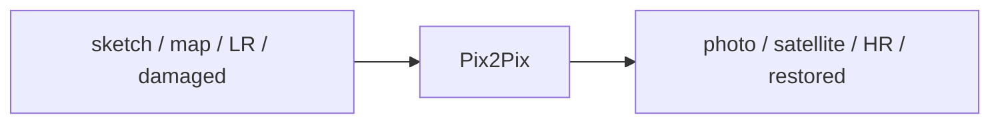
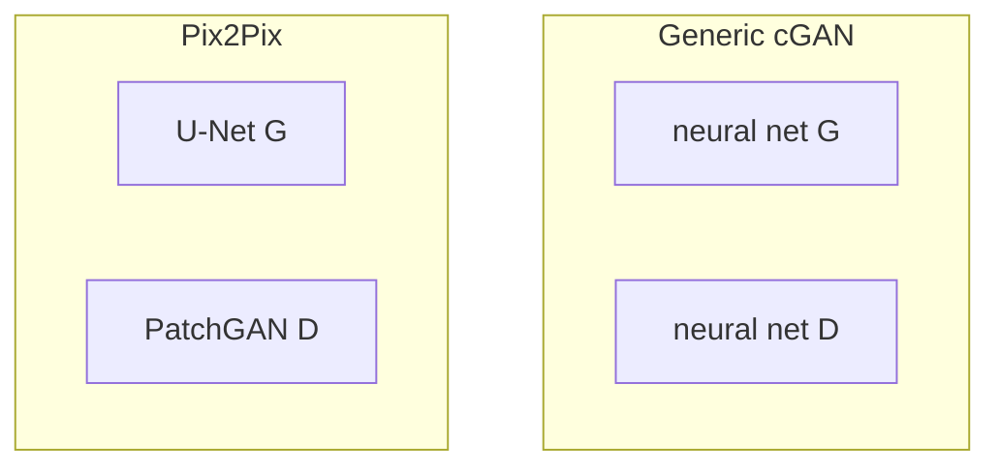
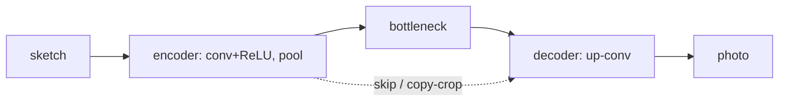
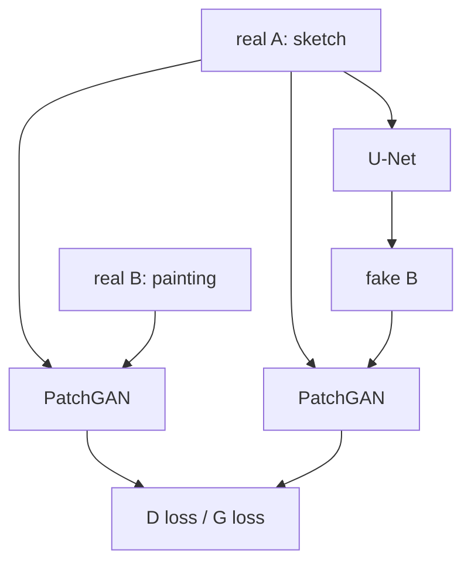

# L39: Pix2Pix GAN

**Video:** [Lec 39](https://www.youtube.com/watch?v=xS5PlsvAOb8) · 34:20  
**Instructor in this lecture:** Prof. Baishali Garai

### Learning objectives

- Place Pix2Pix as a **paired image-to-image** specialist of **cGAN**.
- Explain why the generator is a **U-Net** (skip connections) and the discriminator a **PatchGAN**, including the **$70\times70$** patch result.
- Write **$G$’s loss** $L_{\text{cGAN}} + \lambda L_1$ with $\lambda=100$, and $D$’s real+fake BCE.
- State training details (alternating Adam steps) and that **$D$ is dropped at inference**.

### Agenda (as listed)

Introduction → cGAN vs Pix2Pix → applications → U-Net generator → PatchGAN discriminator → weight updates → training and inference.

---

## What Pix2Pix is

Pix2Pix is a **specialized cGAN for image-to-image translation**: one kind of image in, another kind out.

Paper: **Image-to-Image Translation with Conditional Adversarial Networks**, **Phillip Isola** and team, **Berkeley AI Research (BAIR)**.

### Translation tasks on the slides

| Input | Output |
|-------|--------|
| Edges / **sketch** | **Photo** |
| **Map** | **Satellite** image |
| Sketch | **Painting** |
| **Low resolution** | **Super-resolution** |
| **Damaged** image | **Repaired** reconstruction |

---

## cGAN vs Pix2Pix

Pix2Pix **is** a cGAN, specialized.

| | Conditional GAN | Pix2Pix |
|--|-----------------|---------|
| Scope | **Generic** conditional generation | **Paired** image-to-image only |
| Condition $y$ | labels, **text**, **images**, … | the **input image** of a pair |
| Generator | ordinary net (as in Lec 38) | **U-Net** |
| Discriminator | ordinary net | **PatchGAN** |

When the paper dropped, **visual artists / graphic practitioners** used it widely. Community examples from the paper’s figures: sketch→image, **background removal**, sketch→**Pokémon**, **palette** fill-in, **pose transfer** (“do as I do”), sketch→portrait, photo generation.

---

## Architectural difference (the picture to remember)

Everything in the cGAN cartoon stays, except:

- Generator: **U-Net** (not a generic MLP/CNN).
- Discriminator: **PatchGAN**.

---

## U-Net as generator

You have seen U-Net for **semantic segmentation**. Here it **is** the Pix2Pix generator.

### Encoder (contracting path)

- Blue arrows: **$3\times3$ convolution + ReLU**
- Red arrows: **max pooling** — spatial size **drops** each level
- Extracts **fine details**: edges, lines, sketch structure

### Bottleneck

Most **compressed** code: important information in the smallest map.

### Decoder (expanding path)

**Up-convolutions** reconstruct / **generate** the photo (or painting). The U-Net is trained on **where to put color**, **which color**, **which structure**.

### Skip connections — why not a plain encoder–decoder

During encoding, shrinking spatial size **throws away low-level spatial detail**. U-Net **copy-and-crop** skips send encoder maps to the matching decoder level so those details are **put back**.

Without skips, sketch→photo would **lose fine structure**. That is why Pix2Pix uses U-Net rather than a bare encoder–decoder.

---

## PatchGAN as discriminator

Vanilla / generic cGAN $D$ looks at the **whole** image and says real vs fake.

**PatchGAN** classifies **each $n\times n$ patch** as real or fake.

Example: a **$256\times256$** image is scored **patch by patch**. One patch of the (possibly blurry) fake is compared to the corresponding real region, then the next patch, and so on.

**Final $D$ output = average of all patch decisions.**

### How big should $n$ be? (paper ablations they walked)

| Patch | What they reported |
|-------|--------------------|
| **$1\times1$** | **Color** is right; **spatial statistics** are not (looks unclear) |
| **$16\times16$** | Locally **sharp**, but **tiling artifacts** |
| **$70\times70$** | **Sharp**; some spatial/spectral mistakes remain; **best visual + FCN metric** trade-off |
| **$286\times286$** | Looks **similar** to $70\times70$, but **FCN score drops** |

**Chosen trade-off: $70\times70$ PatchGAN.**

---

## Training cartoon: sketch $A$ → painting $B$

- **Real $A$:** sketch of a scene  
- **Real $B$:** target painting of that scene (paired)

| Network | Inputs |
|---------|--------|
| **U-Net $G$** | real $A$ only → emits **fake $B$** |
| **PatchGAN $D$** | **$(A, B_{\text{real}})$** and **$(A, B_{\text{fake}})$** |

$D$ outputs a real/fake score. **GAN / BCE** losses backprop: $D$ loss into $D$, $G$ loss into $G$. Fake $B$ starts blurrier / lower-res than real $B$ and sharpens over iterations.

---

## Weight update of the generator

$G$ (U-Net): sketch → fake $B$. Target = real $B$.

### Two pieces

1. **$L_1$ / MAE** between fake $B$ and real $B$, **pixel by pixel**:

$$
L_1(G) = \mathbb{E}_{x,y}\bigl[\,\| y - G(x) \|_1\,\bigr].
$$

($x$ = input image / real $A$; $y$ = real target $B$; $G(x)$ = fake $B$.)

2. Fake $B$ also goes to $D$ (which also sees the target). **Binary cross-entropy** on $D$’s output.

### “All labels are one”

While training $G$, fakes are passed through $D$. $G$ wants $D$ to predict **$1$** (fool $D$). BCE compares $D(\text{fake})$ against **label 1**.

### Combine with $\lambda$

$$
L_G = L_{\text{cGAN}} + \lambda L_1, \qquad \lambda = 100
$$

in the **original paper** — **heavy weight on pixel-wise** match. Sum → **gradient descent** into U-Net weights.

### cGAN / adversarial term as written

$$
L_{\text{cGAN}}(G,D)
= \mathbb{E}_{x,y}\bigl[\log D(x,y)\bigr]
+ \mathbb{E}_{x}\bigl[\log\bigl(1 - D(x, G(x))\bigr)\bigr].
$$

$D(x,y)$: score on the **real pair**. $D(x,G(x))$: score on **input + generated target**. Minimizing $L_1$ pulls **every pixel** of $G(x)$ toward $y$.

### Why not $L_1$ alone or cGAN alone?

Paper figure: **input | ground truth | $L_1$ only | cGAN only | $L_1$ + cGAN**.

- $L_1$ only: not great  
- cGAN only: better  
- **$L_1$ + cGAN:** clearly best  

That is why the **sum** is the generator objective.

---

## Weight update of the discriminator

PatchGAN sees **input $A$** and **target $B$**. $G$ still sees only $A$ and produces fake $B$, which also enters $D$.

| Loss | Meaning | Labels |
|------|---------|--------|
| **Real** | $-\mathbb{E}_{x,y}[\log D(x,y)]$ | sigmoid BCE of **all ones** vs real pairs |
| **Fake / generated** | BCE of **all zeros** vs fake pairs | $D$ should tag $G(x)$ as fake |

$$
L_D = L_{\text{real}} + L_{\text{fake}}.
$$

Gradients update **$D$ only**.

---

## Training details and inference

**Alternation:** one **gradient-descent step on $D$**, freeze $D$, then step on $G$; repeat. While $D$ trains, $G$ is held; while $G$ trains, $D$ is held.

| Knob | Value in the paper / lecture |
|------|------------------------------|
| Optimizer | **Adam** |
| Learning rate | **$0.0002$** |
| $\beta_1$ | **$0.5$** |
| $\beta_2$ | **$0.999$** |
| Inference batch | typically **$1$ to $10$** |

**At inference, $D$ is not used.** $D$ exists only to push $G$ during training. Deployment is the trained **U-Net generator** alone.

Why drop $D$? Its job was to force $G$ until fake $B$ is **indistinguishable** (at patch level) from real $B$. Once weights are learned, you only need $G(A)$.

---

## Putting $G$ and $D$ losses next to each other

| | Generator | Discriminator |
|--|-----------|----------------|
| Sees | real $A$ (sketch) | pairs $(A,B_{\text{real}})$ and $(A,B_{\text{fake}})$ |
| Labels used | **all ones** on fakes (wants to fool $D$) | **ones** on real pairs, **zeros** on fakes |
| Extra term | $\lambda L_1$ vs real $B$, $\lambda=100$ | none |
| Update | Adam on U-Net | Adam on PatchGAN, **then freeze** while $G$ steps |

---

## Objective function

Same $L_{\text{cGAN}}$ as above, plus $\lambda L_1$:

$$
G^*
= \arg\min_G \max_D \;
L_{\text{cGAN}}(G,D) + \lambda L_1(G).
$$

$G$ minimizes; $D$ maximizes; $\lambda$ scales the pixel term.

---

## Summary they closed with

Pix2Pix = **paired** image-to-image **cGAN**. Generic cGAN can condition on labels/text/images; Pix2Pix’s architectural bet is **U-Net $G$ + PatchGAN $D$**. Next session: **CycleGAN**.

### Key takeaways

- Paired translation: sketch↔photo, map↔satellite, LR↔HR, inpainting-style repair.
- U-Net skips restore spatial detail the encoder would drop.
- PatchGAN averages **$n\times n$** real/fake votes; paper’s best patch **$70\times70$**.
- $L_G = L_{\text{cGAN}} + 100\, L_1$; $L_D$ = real ones + fake zeros; alternate Adam $2\times10^{-4}$.
- Inference = generator only.

---
